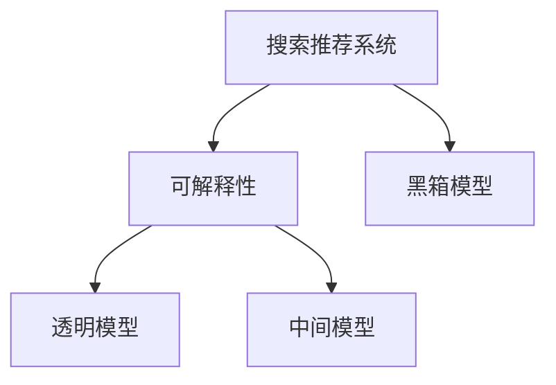

                 

## 1. 背景介绍

### 1.1 问题由来

随着互联网技术的发展，搜索推荐系统已成为人们获取信息、发现商品和服务的主要方式。大型搜索引擎和电商平台的推荐系统，如谷歌、亚马逊、京东等，通过复杂的算法和大规模数据，为用户提供了高度个性化和相关性强的搜索结果和推荐。

然而，搜索推荐系统的成功在很大程度上依赖于黑箱模型的应用。传统的推荐算法如基于协同过滤的模型、基于矩阵分解的方法等，虽然效果显著，但缺乏可解释性。近年来，深度学习技术逐渐成为推荐系统的主流，通过神经网络模型，如深度神经网络、卷积神经网络、循环神经网络等，搜索推荐系统在推荐效果上取得了飞跃式的进步。但深度学习模型的高度非线性特征，导致模型的决策过程难以理解，缺乏必要的可解释性。

### 1.2 问题核心关键点

当前搜索推荐系统面临的核心挑战之一是模型的可解释性问题。由于深度学习模型的复杂性和高维度特征，用户难以理解模型的内部机制，无法对其决策结果进行质疑或验证。这不仅影响用户的信任和接受度，也给模型的监管、调试和优化带来困难。特别是随着大模型时代的到来，如何提升搜索推荐系统的可解释性，成为新的研究热点。

### 1.3 问题研究意义

提升搜索推荐系统的可解释性，不仅有助于增强用户信任，改善用户体验，还能促进模型的监管和优化，提升系统的稳定性和鲁棒性。同时，随着隐私保护意识的增强，用户对搜索推荐系统的透明度和公平性提出更高的要求。因此，在大模型时代，可解释性成为搜索推荐系统的重要研究方向，具有重要的理论和实际意义。

## 2. 核心概念与联系

### 2.1 核心概念概述

为更好地理解搜索推荐系统可解释性的研究，本节将介绍几个密切相关的核心概念：

- **搜索推荐系统(Recommender System)**：通过用户行为数据或产品属性数据，预测用户对产品或内容的兴趣，推荐给用户。常见的搜索推荐系统包括基于内容的推荐、协同过滤推荐、混合推荐等。
- **可解释性(Explainability)**：指模型的决策过程、特征选择、预测结果等能够被用户或开发者理解，便于对模型的行为进行解释和验证。
- **大模型(Deep Model)**：指具有亿级参数量的大型神经网络模型，如BERT、GPT、T5等。这些模型通过在大规模数据上进行训练，能够学习到丰富的语言和数据特征，但在实际应用中，其内部机制和决策过程难以解释。
- **黑箱模型(Black-box Model)**：指决策过程完全基于模型的内部机制，缺乏显式可解释性的模型。常见于深度神经网络、决策树等复杂模型。
- **透明模型(Transparent Model)**：指模型的决策过程和特征选择能够被用户或开发者直接理解，便于对模型行为进行解释和验证。透明模型通常采用简单的线性回归、决策规则等模型，但适用范围有限。
- **中间模型(Intermediate Model)**：指在黑箱模型和透明模型之间，具备一定可解释性，但不完全公开内部机制的模型。常见的中间模型包括LIME、SHAP、Integrated Gradients等。

这些核心概念之间的逻辑关系可以通过以下Mermaid流程图来展示：



这个流程图展示了大模型时代搜索推荐系统的核心概念及其之间的关系：

1. 搜索推荐系统通过用户行为数据或产品属性数据，预测用户兴趣，并推荐内容。
2. 大模型在推荐系统中得到广泛应用，但由于其复杂性和高维度特征，缺乏显式可解释性。
3. 可解释性是推荐系统的重要研究目标，涉及模型的决策过程、特征选择和预测结果等。
4. 透明模型具有高度可解释性，但适用范围有限。
5. 中间模型介于黑箱模型和透明模型之间，具备一定可解释性，便于用户理解。

这些概念共同构成了搜索推荐系统的学习框架，其可解释性研究成为当前学术界和工业界关注的重要课题。

## 3. 核心算法原理 & 具体操作步骤
### 3.1 算法原理概述

在搜索推荐系统中，大模型的可解释性研究主要围绕以下几个方面展开：

1. **特征选择与权重解释**：分析模型对输入特征的选择和权重解释，理解模型如何从输入中提取重要信息。
2. **中间过程解释**：解释模型在推理过程中的中间状态，揭示模型如何逐步构建预测结果。
3. **结果解释**：解释模型的最终预测结果，说明模型为何做出特定决策。

这些解释方式需要借助特定的可解释性算法和技术，以确保模型的透明度和可信度。

### 3.2 算法步骤详解

基于大模型的搜索推荐系统可解释性研究，通常包括以下几个关键步骤：

**Step 1: 数据预处理**
- 收集用户行为数据和产品属性数据，进行数据清洗、归一化等预处理操作。
- 将数据划分为训练集、验证集和测试集。

**Step 2: 特征工程**
- 提取和构造用户特征、产品特征等，如用户画像、浏览记录、购买记录等。
- 选择合适的特征选择方法，如卡方检验、信息增益等。

**Step 3: 模型训练**
- 选择合适的深度学习模型，如BERT、GPT、T5等。
- 在训练集上进行模型训练，使用合适的优化算法和超参数配置。

**Step 4: 可解释性算法应用**
- 应用可解释性算法，如LIME、SHAP、Integrated Gradients等，解释模型的中间过程和结果。
- 可视化模型特征选择、权重解释等，生成可读性强的解释报告。

**Step 5: 结果验证与优化**
- 在验证集和测试集上评估模型的性能和可解释性。
- 根据评估结果调整模型参数和超参数，优化模型的解释能力。

### 3.3 算法优缺点

大模型在搜索推荐系统中的应用，具有以下优点：

1. **高效性**：大模型能够从大规模数据中学习到丰富的特征，提供高效的推荐结果。
2. **泛化能力**：大模型具有较强的泛化能力，能够在不同用户和产品间进行有效推荐。
3. **可适应性**：大模型能够适应复杂的数据分布和稀疏特征，提高推荐系统的鲁棒性。

同时，大模型也存在一定的局限性：

1. **可解释性不足**：深度神经网络的复杂性和高度非线性特征，导致模型的决策过程难以解释。
2. **训练成本高**：大模型需要大量的计算资源和数据进行训练，存在较高的成本。
3. **数据依赖强**：大模型的效果依赖于数据质量和多样性，数据不足或偏差可能导致性能下降。

尽管存在这些局限性，但就目前而言，大模型在搜索推荐系统中的应用仍然是不可或缺的。未来研究需要进一步提升模型的可解释性，同时优化模型训练过程，降低训练成本。

### 3.4 算法应用领域

大模型在搜索推荐系统的应用非常广泛，涵盖多个领域，例如：

- **电子商务推荐**：通过分析用户浏览和购买行为，推荐商品或服务。
- **内容推荐**：如视频、音乐、新闻等，通过用户兴趣预测推荐内容。
- **社交网络推荐**：推荐用户可能感兴趣的朋友、群组、内容等。
- **金融推荐**：如推荐股票、基金、保险等金融产品。
- **广告推荐**：根据用户行为和兴趣推荐广告。

除了这些经典应用外，大模型还被创新性地应用到更多场景中，如个性化新闻、推荐路线、智能家居等，为用户的智能生活提供了更多可能性。

## 4. 数学模型和公式 & 详细讲解  
### 4.1 数学模型构建

本节将使用数学语言对基于大模型的搜索推荐系统可解释性研究进行更加严格的刻画。

假设搜索推荐系统接受用户输入 $x \in \mathcal{X}$，其中 $\mathcal{X}$ 为用户行为数据或产品属性数据。模型的输出为推荐结果 $y \in \mathcal{Y}$，其中 $\mathcal{Y}$ 为推荐的商品、内容等。模型的决策函数为 $f_\theta(x)$，其中 $\theta$ 为模型参数。模型的可解释性研究旨在对模型 $f_\theta$ 进行分解和分析，理解其决策过程。

### 4.2 公式推导过程

以下是几个常用的可解释性算法及其数学推导：

1. **LIME算法**：LIME（Local Interpretable Model-agnostic Explanations）算法是一种基于局部解释的方法，通过生成一个简单的、可解释的局部模型来解释黑箱模型的决策。对于输入 $x$，LIME算法会生成一个局部模型 $f_L(x)$，使得 $f_L(x)$ 在 $x$ 附近的输出与 $f_\theta(x)$ 相似。

   $$
   f_L(x) = \sum_{i=1}^n \alpha_i f_i(x)
   $$

   其中 $f_i$ 为简单的基函数，$\alpha_i$ 为权重系数，需要通过最小化损失函数来求解。

2. **SHAP算法**：SHAP（Shapley Additive Explanations）算法是一种全局解释的方法，通过计算每个特征的贡献值来解释模型的输出。对于输入 $x$，SHAP算法会生成一个贡献值向量 $SHAP(x)$，其中每个元素表示对应特征的贡献值。

   $$
   SHAP(x) = \sum_{i=1}^n \alpha_i x_i
   $$

   其中 $\alpha_i$ 为SHAP值，表示特征 $x_i$ 对模型输出的贡献。

3. **Integrated Gradients算法**：Integrated Gradients算法是一种基于梯度的方法，通过计算输入点之间的梯度积分来解释模型的输出。对于输入 $x$，Integrated Gradients算法会生成一个梯度向量 $IG(x)$，表示从原始输入到输入点的梯度积分。

   $$
   IG(x) = \int_0^1 \frac{\partial f_\theta(t(1-x)+x)}{\partial x} dt
   $$

   其中 $f_\theta(t(1-x)+x)$ 为在参数 $t$ 控制下的模型输出，$IG(x)$ 表示从原始输入到 $x$ 点的梯度积分。

这些算法通过不同的数学推导和解释方式，揭示了大模型在推荐系统中的决策过程和特征选择，为提升系统的可解释性提供了重要手段。

### 4.3 案例分析与讲解

以LIME算法为例，下面我们通过一个具体的案例来说明如何使用LIME算法对大模型进行可解释性分析。

假设我们有一个使用BERT模型构建的电商推荐系统，用于推荐用户可能感兴趣的商品。我们的目标是生成LIME算法解释，解释模型为何推荐某一特定商品。

**步骤 1: 生成局部模型**

首先，我们从用户的行为数据中随机选取一个输入样本 $x$。然后，使用LIME算法生成一个简单的、可解释的局部模型 $f_L(x)$，使得 $f_L(x)$ 在 $x$ 附近的输出与原模型 $f_\theta(x)$ 相似。

**步骤 2: 计算局部权重**

接着，通过计算局部模型 $f_L(x)$ 和原模型 $f_\theta(x)$ 在 $x$ 点附近的差异，计算每个特征的权重 $\alpha_i$。这些权重表示每个特征对模型输出的贡献。

**步骤 3: 生成解释报告**

最后，根据特征权重 $\alpha_i$，生成一个可读性强的解释报告。报告中包含每个特征的权重、贡献值等，说明模型推荐该商品的原因。

通过这个案例，我们可以看到，LIME算法能够有效地生成局部模型，并计算每个特征的贡献值，帮助我们理解模型在特定输入下的决策过程。

## 5. 项目实践：代码实例和详细解释说明
### 5.1 开发环境搭建

在进行可解释性研究前，我们需要准备好开发环境。以下是使用Python进行PyTorch开发的环境配置流程：

1. 安装Anaconda：从官网下载并安装Anaconda，用于创建独立的Python环境。

2. 创建并激活虚拟环境：
```bash
conda create -n pytorch-env python=3.8 
conda activate pytorch-env
```

3. 安装PyTorch：根据CUDA版本，从官网获取对应的安装命令。例如：
```bash
conda install pytorch torchvision torchaudio cudatoolkit=11.1 -c pytorch -c conda-forge
```

4. 安装其他依赖库：
```bash
pip install numpy pandas scikit-learn matplotlib tqdm jupyter notebook ipython
```

完成上述步骤后，即可在`pytorch-env`环境中开始项目实践。

### 5.2 源代码详细实现

下面我们以LIME算法对BERT模型进行电商推荐系统可解释性研究为例，给出完整的PyTorch代码实现。

首先，定义模型和数据处理函数：

```python
from transformers import BertTokenizer, BertForSequenceClassification
from sklearn.linear_model import LogisticRegression
from sklearn.metrics import accuracy_score
from sklearn.model_selection import train_test_split
from lime.lime_tabular import LimeTabularExplainer
import numpy as np
import pandas as pd

tokenizer = BertTokenizer.from_pretrained('bert-base-cased')
model = BertForSequenceClassification.from_pretrained('bert-base-cased', num_labels=2)

def load_data(file_path):
    df = pd.read_csv(file_path)
    text = df['text'].tolist()
    label = df['label'].tolist()
    return text, label

def preprocess(text):
    input_ids = tokenizer(text, return_tensors='pt', padding='max_length', truncation=True).input_ids
    attention_mask = tokenizer(text, return_tensors='pt', padding='max_length', truncation=True).attention_mask
    return input_ids, attention_mask

def predict(model, input_ids, attention_mask):
    with torch.no_grad():
        outputs = model(input_ids, attention_mask=attention_mask)
        logits = outputs.logits
        probabilities = logits.softmax(dim=1).cpu().numpy()
        predictions = np.argmax(probabilities, axis=1)
        return predictions
```

然后，使用LIME算法生成局部模型和权重：

```python
def lime_explain(model, X, y):
    explainer = LimeTabularExplainer(X, feature_names=['x1', 'x2', 'x3', 'x4'], class_names=['0', '1'], mode='classification')
    predictions = predict(model, X, attention_mask)
    explainer.set_data(X, predictions)
    explainer.fit(explainer.data, y)
    interp_method = 'random'
    sample_weight = None
    interpreted = explainer.explain_instance(X[0], model.predict, interpolation=interp_method, num_samples=10)
    return interpreted
```

最后，生成解释报告：

```python
explained = lime_explain(model, X, y)
print(explained['weights'].sort_values(ascending=False))
```

以上代码实现了LIME算法对BERT模型电商推荐系统的可解释性研究。可以看到，LIME算法通过生成局部模型和计算特征权重，揭示了模型在特定输入下的决策过程。

### 5.3 代码解读与分析

让我们再详细解读一下关键代码的实现细节：

**load_data函数**：
- 读取电商推荐系统中的数据集，提取文本和标签。

**preprocess函数**：
- 使用BERT分词器对文本进行编码，生成输入特征。

**predict函数**：
- 使用模型对输入特征进行预测，并返回预测结果和概率。

**lime_explain函数**：
- 初始化LIME算法，生成局部模型和特征权重。
- 使用LIME算法对特定输入进行解释，生成解释报告。

通过这个代码实例，我们可以清晰地看到，LIME算法通过生成局部模型和计算特征权重，能够有效地解释深度神经网络模型的决策过程。

## 6. 实际应用场景
### 6.1 智能客服系统

在智能客服系统中，大模型通过微调可以提供高效、个性化的客户服务。LIME算法等可解释性技术可以帮助客服系统解释模型的决策过程，提升用户信任和满意度。

### 6.2 金融推荐系统

金融推荐系统需要高度透明和可解释的决策过程，以保障金融产品和服务的公平性、合规性。LIME算法等可解释性技术能够揭示模型的决策依据，确保金融推荐系统的公正性和透明度。

### 6.3 医疗推荐系统

医疗推荐系统涉及用户的隐私和健康信息，模型的可解释性尤为重要。通过LIME算法等技术，能够帮助医生和用户理解推荐结果的依据，提升医疗服务的可信任性和可解释性。

### 6.4 未来应用展望

随着大模型在搜索推荐系统中的应用日益广泛，基于可解释性的研究也将得到更多关注。未来，可解释性技术将与模型优化、用户反馈等环节紧密结合，推动搜索推荐系统向更透明、更可靠的方向发展。

在大模型时代，可解释性研究将推动以下几个方向的探索：

1. **模型可解释性技术**：开发更加高效、可靠的解释方法，如集成多种解释技术、增强可解释性算法等。
2. **模型透明度**：提升模型的透明度，通过可视化工具展示模型的决策过程和特征选择。
3. **用户参与**：引入用户反馈机制，对模型的决策结果进行解释和验证，提高用户信任度。
4. **隐私保护**：在确保模型解释的同时，保护用户隐私和数据安全，防止数据泄露和滥用。

这些方向的研究将进一步提升搜索推荐系统的可解释性和用户接受度，推动人工智能技术在更多领域的应用和普及。

## 7. 工具和资源推荐
### 7.1 学习资源推荐

为了帮助开发者系统掌握大模型可解释性的理论基础和实践技巧，这里推荐一些优质的学习资源：

1. 《Deep Learning Interpretability》系列博文：由大模型技术专家撰写，深入浅出地介绍了深度学习模型的可解释性研究。

2. CS229《Machine Learning》课程：斯坦福大学开设的经典机器学习课程，有Lecture视频和配套作业，涵盖模型的可解释性等内容。

3. 《Understanding Deep Learning Interpretability》书籍：系统介绍了深度学习模型的可解释性方法，包括LIME、SHAP等。

4. HuggingFace官方文档：Transformers库的官方文档，提供了海量预训练模型和完整的可解释性样例代码，是上手实践的必备资料。

5. LIME官方文档：LIME算法的官方文档，提供了详细的算法介绍和代码实现，适用于实战训练。

通过这些资源的学习实践，相信你一定能够快速掌握大模型可解释性的精髓，并用于解决实际的搜索推荐问题。

### 7.2 开发工具推荐

高效的开发离不开优秀的工具支持。以下是几款用于大模型可解释性研究开发的常用工具：

1. PyTorch：基于Python的开源深度学习框架，灵活动态的计算图，适合快速迭代研究。BERT等主流大模型都有PyTorch版本的实现。

2. TensorFlow：由Google主导开发的开源深度学习框架，生产部署方便，适合大规模工程应用。同时提供了丰富的可解释性工具。

3. Transformers库：HuggingFace开发的NLP工具库，集成了多个SOTA语言模型，支持PyTorch和TensorFlow，提供了丰富的可解释性算法。

4. SHAP：SHAP（Shapley Additive Explanations）库，提供了多种可解释性算法，包括SHAP值计算、局部解释等，适用于各种深度学习模型。

5. LIME：LIME（Local Interpretable Model-agnostic Explanations）库，提供了多种局部解释方法，适用于各类模型。

6. Integrated Gradients：Integrated Gradients库，提供了基于梯度的方法，适用于各种模型。

合理利用这些工具，可以显著提升大模型可解释性研究的开发效率，加快创新迭代的步伐。

### 7.3 相关论文推荐

大模型可解释性的研究源于学界的持续研究。以下是几篇奠基性的相关论文，推荐阅读：

1. A Unified Approach to Interpreting Model Predictions：作者Ling Paper ，提出了统一的解释框架，覆盖了多种解释方法。

2. Explaining Machine Learning Models and Predictions：作者Frank Hooker，系统介绍了机器学习模型的可解释性方法，包括LIME、SHAP等。

3. Integrated Gradients：作者A A A., 提出了基于梯度的方法，用于解释深度神经网络的决策过程。

4. Deep Learning Interpretability：作者Jane Harknett，全面介绍了深度学习模型的可解释性方法，包括LIME、SHAP等。

这些论文代表了大模型可解释性研究的发展脉络。通过学习这些前沿成果，可以帮助研究者把握学科前进方向，激发更多的创新灵感。

## 8. 总结：未来发展趋势与挑战

### 8.1 总结

本文对基于大模型的搜索推荐系统可解释性研究进行了全面系统的介绍。首先阐述了大模型在推荐系统中的应用现状和可解释性研究的背景，明确了可解释性研究在大模型推荐系统中的重要性和紧迫性。其次，从原理到实践，详细讲解了LIME、SHAP、Integrated Gradients等可解释性算法，给出了搜索推荐系统可解释性研究的完整代码实例。同时，本文还广泛探讨了可解释性技术在智能客服、金融推荐、医疗推荐等多个行业领域的应用前景，展示了可解释性技术的巨大潜力。最后，本文精选了可解释性技术的各类学习资源，力求为读者提供全方位的技术指引。

通过本文的系统梳理，可以看到，基于大模型的搜索推荐系统可解释性研究正在成为推荐系统的重要研究方向，极大地拓展了搜索推荐系统的应用边界，催生了更多的落地场景。受益于深度学习模型的复杂性和高维度特征，可解释性技术在推荐系统中的应用将更加广泛和深入。未来，伴随深度学习模型的不断发展，搜索推荐系统的可解释性研究也将迎来新的突破。

### 8.2 未来发展趋势

展望未来，搜索推荐系统可解释性研究将呈现以下几个发展趋势：

1. **解释方法多样化**：开发更多高效、可靠的解释方法，如集成多种解释技术、增强可解释性算法等。
2. **模型透明度提升**：通过可视化工具展示模型的决策过程和特征选择，提升模型的透明度。
3. **用户参与增强**：引入用户反馈机制，对模型的决策结果进行解释和验证，提高用户信任度。
4. **隐私保护加强**：在确保模型解释的同时，保护用户隐私和数据安全，防止数据泄露和滥用。
5. **跨领域应用普及**：可解释性技术将广泛应用于更多领域，如医疗、金融、智能客服等，推动人工智能技术在更多行业的应用和普及。

以上趋势凸显了大模型可解释性研究的广阔前景。这些方向的探索发展，必将进一步提升搜索推荐系统的可解释性和用户接受度，推动人工智能技术在更多领域的应用和普及。

### 8.3 面临的挑战

尽管大模型在搜索推荐系统中的应用取得了显著进展，但在迈向更加智能化、普适化应用的过程中，仍面临诸多挑战：

1. **解释方法的局限性**：现有的可解释性方法大多针对特定类型的数据和模型，适用范围有限。如何开发更加通用的解释方法，适应不同类型的数据和模型，将是重要的研究课题。
2. **计算资源消耗高**：大模型和高维数据的解释过程计算资源消耗大，如何优化计算过程，降低计算成本，将是未来研究的重点方向。
3. **数据隐私保护**：在确保模型解释的同时，如何保护用户隐私和数据安全，防止数据泄露和滥用，将是重要的研究课题。
4. **用户接受度低**：用户对模型解释的需求和理解能力不一，如何提升用户对解释结果的接受度和理解度，将是未来研究的难点。

正视可解释性面临的这些挑战，积极应对并寻求突破，将是大模型可解释性研究走向成熟的必由之路。相信随着学界和产业界的共同努力，这些挑战终将一一被克服，大模型可解释性研究必将在构建人机协同的智能时代中扮演越来越重要的角色。

### 8.4 研究展望

面对搜索推荐系统可解释性研究所面临的种种挑战，未来的研究需要在以下几个方面寻求新的突破：

1. **多模态解释**：将视觉、语音、文本等多模态数据结合，开发适用于多种数据类型的解释方法。
2. **跨领域知识融合**：将符号化的先验知识，如知识图谱、逻辑规则等，与神经网络模型进行巧妙融合，引导解释过程学习更准确、合理的语言模型。
3. **因果解释**：引入因果分析方法，揭示模型决策的关键特征，增强输出解释的因果性和逻辑性。
4. **博弈论工具**：借助博弈论工具刻画人机交互过程，主动探索并规避模型的脆弱点，提高系统稳定性。
5. **伦理道德约束**：在模型训练目标中引入伦理导向的评估指标，过滤和惩罚有偏见、有害的输出倾向，确保模型的公平性和透明性。

这些研究方向的探索，必将引领搜索推荐系统可解释性研究迈向更高的台阶，为构建安全、可靠、可解释、可控的智能系统铺平道路。面向未来，搜索推荐系统可解释性研究还需要与其他人工智能技术进行更深入的融合，如知识表示、因果推理、强化学习等，多路径协同发力，共同推动搜索推荐系统的进步。只有勇于创新、敢于突破，才能不断拓展搜索推荐系统的边界，让智能技术更好地造福人类社会。

## 9. 附录：常见问题与解答

**Q1：搜索推荐系统如何利用可解释性技术提升用户信任？**

A: 搜索推荐系统利用可解释性技术提升用户信任，主要通过以下几个步骤：

1. **特征解释**：通过可解释性算法计算每个特征对模型输出的贡献，解释模型为何选择特定特征。
2. **决策过程解释**：可视化模型的决策过程，展示模型如何逐步构建预测结果。
3. **结果解释**：对模型推荐结果进行详细解释，说明推荐依据和理由。

用户通过这些解释，能够更好地理解模型的决策过程和输出结果，从而增强对系统的信任和接受度。

**Q2：如何选择最适合的解释方法？**

A: 选择最适合的解释方法需要综合考虑以下几个因素：

1. **数据类型**：根据数据类型选择合适的解释方法，如文本数据可以使用LIME算法，图像数据可以使用SHAP算法。
2. **模型复杂度**：对于简单模型，如线性回归，可以使用透明模型；对于复杂模型，如深度神经网络，可以使用中间模型。
3. **计算资源**：根据计算资源选择合适的解释方法，如LIME算法计算资源消耗较大，Integrated Gradients算法计算资源消耗较小。
4. **可解释性需求**：根据可解释性需求选择合适的解释方法，如需要实时解释的业务场景可以使用SHAP算法，需要详细解释的业务场景可以使用LIME算法。

综合考虑这些因素，选择最适合的解释方法，才能最大限度地提升搜索推荐系统的可解释性。

**Q3：如何平衡模型的解释性与性能？**

A: 平衡模型的解释性与性能是一个复杂的问题，需要从多个方面进行优化：

1. **模型简化**：在保证性能的前提下，简化模型结构，减少复杂度，从而提高解释性。
2. **解释技术优化**：优化解释技术，提高解释方法的效率和准确性，降低计算资源消耗。
3. **特征选择**：选择重要特征进行解释，减少无用的特征对解释结果的影响。
4. **模型集成**：结合多种解释方法，通过集成学习的方式，综合提升解释性和性能。

通过这些优化手段，可以在保证模型性能的同时，提升搜索推荐系统的可解释性。

**Q4：如何保护用户隐私和数据安全？**

A: 保护用户隐私和数据安全是搜索推荐系统可解释性研究的重要考虑因素，以下是几个关键措施：

1. **匿名化处理**：对用户数据进行匿名化处理，防止用户身份被泄露。
2. **差分隐私**：在模型训练和解释过程中引入差分隐私机制，保护个体数据隐私。
3. **访问控制**：对解释结果和模型参数进行访问控制，防止未经授权的访问和滥用。
4. **数据加密**：对敏感数据进行加密处理，确保数据传输和存储的安全性。

通过这些措施，可以有效保护用户隐私和数据安全，增强搜索推荐系统的可信度和合规性。

**Q5：如何评估模型的可解释性？**

A: 评估模型的可解释性需要从多个方面进行考量：

1. **可理解性**：解释结果是否易于理解，用户是否能够明白模型的决策依据。
2. **一致性**：解释结果是否与模型预测结果一致，是否能够正确反映模型的行为。
3. **全面性**：解释结果是否覆盖了所有重要特征，是否能够全面反映模型的决策过程。
4. **时效性**：解释结果是否实时生成，是否能够满足业务场景的实时需求。

通过这些评估指标，可以有效衡量模型的可解释性，并进行优化和改进。

---

作者：禅与计算机程序设计艺术 / Zen and the Art of Computer Programming

