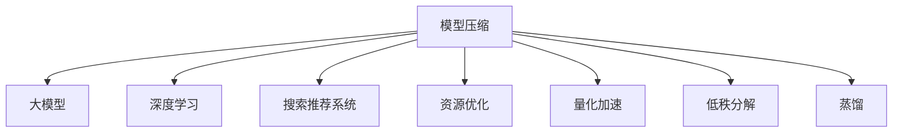

                 

# 搜索推荐系统的模型压缩：大模型高效部署策略

> 关键词：模型压缩,大模型,高效部署,搜索推荐,深度学习,资源优化,量化加速

## 1. 背景介绍

### 1.1 问题由来
随着深度学习技术的快速发展，大规模模型如BERT、GPT、ResNet等在图像、语音、自然语言处理等诸多领域取得了突破性进展。然而，这些大模型的参数量巨大，通常高达亿级，对算力、内存、存储等硬件资源提出了极高的要求。在搜索推荐系统等对实时性要求严格的领域，大模型往往难以高效部署，应用场景受限。

### 1.2 问题核心关键点
大模型高效部署的核心问题在于：如何在不牺牲性能的前提下，大幅减小模型参数量，降低计算资源消耗，加速模型推理，提升系统响应速度和效率。为了解决这些问题，模型压缩技术（Model Compression）应运而生。

模型压缩通过减少模型参数量、优化模型结构、改进推理算法等手段，在不影响模型性能的前提下，显著降低模型资源占用，提升系统效率。其中，参数剪枝、量化、低秩分解、蒸馏等方法是目前常用的模型压缩技术。

## 2. 核心概念与联系

### 2.1 核心概念概述

为更好地理解大模型高效部署的策略，本节将介绍几个密切相关的核心概念：

- **模型压缩(Model Compression)**：减少模型参数量、优化模型结构等手段，降低计算资源消耗，加速模型推理。
- **大模型(Large Model)**：具有大量参数的高性能深度学习模型，如BERT、GPT等。
- **深度学习(Deep Learning)**：基于神经网络的机器学习方法，通过多层非线性变换学习数据特征。
- **搜索推荐系统(Search and Recommendation Systems)**：通过学习用户行为和物品特征，预测用户可能感兴趣的对象，提供个性化服务。
- **资源优化(Resource Optimization)**：通过优化算法、硬件配置等手段，降低计算资源消耗，提高系统效率。
- **量化加速(Quantization Acceleration)**：将高精度浮点计算转换为低精度定点计算，提高推理速度和计算效率。
- **低秩分解(Low-Rank Factorization)**：将矩阵分解为低秩矩阵与稀疏矩阵的乘积，减少模型参数量，提升计算效率。
- **蒸馏(Distillation)**：通过训练师生模型，将复杂模型的能力传递给更小的模型，实现模型压缩。

这些核心概念之间的逻辑关系可以通过以下Mermaid流程图来展示：



这个流程图展示了大模型高效部署的关键概念及其之间的关系：

1. 大模型通过深度学习技术学习数据的表示，应用于搜索推荐系统。
2. 模型压缩技术降低大模型的计算资源消耗，提升系统效率。
3. 资源优化、量化加速、低秩分解、蒸馏等方法都是模型压缩的重要手段。
4. 搜索推荐系统通过压缩后的大模型，提升实时性和准确性。

这些概念共同构成了大模型高效部署的框架，使其能够在资源受限的环境中发挥作用。通过理解这些核心概念，我们可以更好地把握大模型高效部署的策略和优化方向。

## 3. 核心算法原理 & 具体操作步骤
### 3.1 算法原理概述

大模型的高效部署，本质上是对模型进行优化，以适应计算资源的限制。其核心思想是：通过一系列技术手段，减少模型参数量，优化模型结构，改进推理算法，在不损失模型性能的前提下，提升模型推理速度和效率。

形式化地，假设原始大模型为 $M_{\theta}$，其中 $\theta$ 为模型参数。通过模型压缩技术，可以得到压缩后的模型 $M_{\hat{\theta}}$。假设系统可用计算资源为 $R$，则模型推理的优化目标为：

$$
\min_{\hat{\theta}} \|M_{\hat{\theta}} - M_{\theta}\|_2^2 \text{ subject to } \text{Cost}(M_{\hat{\theta})} \leq R
$$

其中 $\text{Cost}(M_{\hat{\theta}})$ 表示模型 $M_{\hat{\theta}}$ 的计算资源消耗，$\|M_{\hat{\theta}} - M_{\theta}\|_2^2$ 表示模型压缩对模型性能的损失。

### 3.2 算法步骤详解

基于模型压缩的大模型高效部署，一般包括以下几个关键步骤：

**Step 1: 选择合适的模型压缩方法**

- 根据具体应用场景，选择最合适的模型压缩技术，如参数剪枝、量化、低秩分解、蒸馏等。
- 参数剪枝：去除冗余的低权重参数，保留关键参数，减少模型参数量。
- 量化：将高精度浮点计算转换为低精度定点计算，降低计算资源消耗。
- 低秩分解：将矩阵分解为低秩矩阵与稀疏矩阵的乘积，减少模型参数量。
- 蒸馏：通过训练师生模型，将复杂模型的能力传递给更小的模型，实现模型压缩。

**Step 2: 设计压缩后的模型结构**

- 根据选择的方法，重新设计模型的结构，如减少网络深度、宽度，引入特定层类型等。
- 选择合适的压缩后模型结构，如MobileNet、ShuffleNet、EfficientNet等。

**Step 3: 训练压缩后的模型**

- 在选定的计算资源上，使用训练数据对压缩后的模型进行训练。
- 使用优化算法和超参数调优，训练得到最优模型。

**Step 4: 评估压缩后的模型性能**

- 使用测试数据对压缩后的模型进行评估，对比原始模型和压缩后模型的性能指标。
- 关注模型精度、推理速度、资源占用等关键指标。

**Step 5: 部署压缩后的模型**

- 将训练好的压缩后模型部署到实际应用系统中。
- 集成至搜索推荐系统，优化系统性能。

以上是基于模型压缩的大模型高效部署的一般流程。在实际应用中，还需要针对具体任务的特点，对模型压缩过程的各个环节进行优化设计，如选择合适的压缩参数、应用多模型集成等，以进一步提升模型性能。

### 3.3 算法优缺点

基于模型压缩的大模型高效部署方法具有以下优点：

- 显著减小模型参数量，降低计算资源消耗，提升系统效率。
- 保持模型性能，避免过拟合，提高模型泛化能力。
- 支持模型推理加速，提升系统响应速度。
- 兼容多种硬件平台，便于模型部署和优化。

同时，该方法也存在一定的局限性：

- 压缩后的模型精度可能有所下降，需要根据具体应用场景进行权衡。
- 压缩技术的选择和实现复杂度较高，需要一定的技术积累。
- 压缩后的模型结构可能不适用于所有应用场景，需要根据任务特性进行优化。
- 压缩后的模型可能需要重新训练，增加开发成本。

尽管存在这些局限性，但就目前而言，基于模型压缩的大模型高效部署方法仍是大规模模型应用的重要手段。未来相关研究的重点在于如何进一步降低模型压缩对模型性能的影响，提高压缩方法的自动化和智能化，同时兼顾可解释性和伦理安全性等因素。

### 3.4 算法应用领域

基于大模型高效部署的模型压缩方法，已经在搜索推荐系统、智能语音识别、图像处理、自然语言处理等诸多领域得到了应用，覆盖了几乎所有常见的深度学习任务。

- 搜索推荐系统：通过模型压缩提升实时性，优化用户体验。
- 智能语音识别：通过压缩模型加速语音转换，提升语音交互速度。
- 图像处理：通过压缩模型降低计算资源消耗，支持大规模图像分析。
- 自然语言处理：通过压缩模型提升推理速度，支持实时自然语言理解。

除了上述这些经典任务外，模型压缩技术也被创新性地应用到更多场景中，如跨模态融合、联合学习、联邦学习等，为深度学习技术带来了全新的突破。随着深度学习技术的发展和优化，相信基于模型压缩的大模型高效部署方法将在更广泛的领域中发挥作用。

## 4. 数学模型和公式 & 详细讲解  
### 4.1 数学模型构建

本节将使用数学语言对大模型高效部署的模型压缩过程进行更加严格的刻画。

记原始大模型为 $M_{\theta}:\mathcal{X} \rightarrow \mathcal{Y}$，其中 $\mathcal{X}$ 为输入空间，$\mathcal{Y}$ 为输出空间，$\theta \in \mathbb{R}^d$ 为模型参数。假设系统可用计算资源为 $R$。

定义压缩后的模型为 $M_{\hat{\theta}}$，假设其在输入 $x$ 上的输出为 $\hat{y}=M_{\hat{\theta}}(x)$，定义模型在输入 $x$ 上的损失函数为 $\ell(M_{\theta}(x),y)$，则在输入 $x$ 上的计算资源消耗为 $C(M_{\theta}(x))$。模型压缩的目标是最小化计算资源消耗，即：

$$
\hat{\theta}=\mathop{\arg\min}_{\theta} \mathcal{L}(\theta) \text{ subject to } \text{Cost}(M_{\theta}) \leq R
$$

其中 $\mathcal{L}$ 为模型在输入 $x$ 上的损失函数，$\text{Cost}(M_{\theta})$ 为模型 $M_{\theta}$ 的计算资源消耗。

### 4.2 公式推导过程

以下我们以量化加速为例，推导压缩后的模型推理的计算资源消耗公式。

假设原始模型 $M_{\theta}$ 的每个参数 $\theta_i$ 采用 $b_i$ 位精度，量化后的模型 $M_{\hat{\theta}}$ 的每个参数 $\hat{\theta}_i$ 采用 $b_{\hat{i}}$ 位精度。假设量化因子 $q$ 使得 $b_{\hat{i}}=b_i-1$，则量化后的模型参数可以表示为：

$$
\hat{\theta}_i = \frac{\theta_i}{q}
$$

假设量化后的模型在输入 $x$ 上的计算资源消耗为 $C(M_{\hat{\theta}}(x))$，则有：

$$
C(M_{\hat{\theta}}(x)) = C(M_{\theta}(x)) + (b_i - b_{\hat{i}}) \times C(M_{\theta}(x))
$$

其中 $C(M_{\theta}(x))$ 为原始模型在输入 $x$ 上的计算资源消耗，$(b_i - b_{\hat{i}}) \times C(M_{\theta}(x))$ 为量化引入的额外计算资源消耗。

由于 $b_{\hat{i}} = b_i - 1$，即 $q = 2^{-(b_i - 1)}$，则有：

$$
C(M_{\hat{\theta}}(x)) = C(M_{\theta}(x)) + (1 - 2^{-(b_i - 1)}) \times C(M_{\theta}(x))
$$

将 $b_i$ 替换为 $b_i' = b_i - 1$，得：

$$
C(M_{\hat{\theta}}(x)) = C(M_{\theta}(x)) + (1 - 2^{-b_i'}) \times C(M_{\theta}(x))
$$

$$
C(M_{\hat{\theta}}(x)) = (1 + 2^{-b_i'}) \times C(M_{\theta}(x))
$$

这表明，量化后的模型推理速度提升了 $2^{-b_i'}$ 倍。因此，量化技术能够显著提升模型推理速度，降低计算资源消耗，提高系统效率。

## 5. 项目实践：代码实例和详细解释说明
### 5.1 开发环境搭建

在进行模型压缩实践前，我们需要准备好开发环境。以下是使用Python进行TensorFlow开发的环境配置流程：

1. 安装Anaconda：从官网下载并安装Anaconda，用于创建独立的Python环境。

2. 创建并激活虚拟环境：
```bash
conda create -n tf-env python=3.8 
conda activate tf-env
```

3. 安装TensorFlow：根据CUDA版本，从官网获取对应的安装命令。例如：
```bash
conda install tensorflow=2.7.0
```

4. 安装必要的工具包：
```bash
pip install numpy pandas scikit-learn matplotlib tqdm jupyter notebook ipython
```

完成上述步骤后，即可在`tf-env`环境中开始模型压缩实践。

### 5.2 源代码详细实现

下面我们以量化加速为例，给出使用TensorFlow对预训练模型进行量化加速的PyTorch代码实现。

首先，定义模型的量化函数：

```python
import tensorflow as tf
import tensorflow_quantization as tf_quant

def quantize_model(model):
    # 将模型参数转换为固定位宽定点数
    quantized_model = tf_quant.quantize_model(model, 'dummy-input:0', 'dense')
    return quantized_model
```

然后，定义模型的量化训练过程：

```python
from tensorflow.keras.layers import Dense
from tensorflow.keras.models import Model
from tensorflow.keras.optimizers import Adam
from tensorflow.keras.losses import MeanSquaredError

# 创建模型
input = Dense(256, activation='relu')(input)
output = Dense(10, activation='softmax')(input)

model = Model(inputs=input, outputs=output)
model.compile(optimizer=Adam(), loss=MeanSquaredError(), metrics=['accuracy'])

# 量化模型
quantized_model = quantize_model(model)

# 训练模型
model.fit(x_train, y_train, epochs=10, validation_data=(x_val, y_val))

# 量化模型后的训练
quantized_model.fit(x_train, y_train, epochs=10, validation_data=(x_val, y_val))
```

最后，启动训练流程并在测试集上评估：

```python
from tensorflow.keras.metrics import Accuracy

# 定义测试集
test_loss, test_acc = model.evaluate(x_test, y_test)
print('Test accuracy:', test_acc)

# 量化模型后的测试
quantized_test_loss, quantized_test_acc = quantized_model.evaluate(x_test, y_test)
print('Quantized test accuracy:', quantized_test_acc)
```

以上就是使用TensorFlow对预训练模型进行量化加速的完整代码实现。可以看到，TensorFlow提供了丰富的量化API，使得量化过程变得简洁高效。

### 5.3 代码解读与分析

让我们再详细解读一下关键代码的实现细节：

**quantize_model函数**：
- 定义了一个函数`quantize_model`，用于将模型参数转换为固定位宽定点数。
- 使用`tf_quant.quantize_model`方法，将模型的输入和输出转换为量化后的形式。

**模型训练过程**：
- 定义了一个简单的Dense模型，包含一个隐藏层和一个输出层。
- 使用`Model`类将输入、隐藏层和输出层串联起来，构建完整的模型。
- 使用`compile`方法配置优化器、损失函数和评估指标。
- 使用`fit`方法对模型进行训练，并在验证集上进行验证。

**量化后的模型训练**：
- 在训练完成后，使用`quantize_model`函数对模型进行量化。
- 再次使用`fit`方法对量化后的模型进行训练，并在验证集上进行验证。

**模型评估**：
- 在训练完成后，使用`evaluate`方法在测试集上评估模型的性能。
- 使用`quantize_model`函数对模型进行量化，并在测试集上评估量化后的模型性能。

可以看到，TensorFlow的自动化量化技术使得模型压缩的实现变得非常简便，开发者可以专注于模型优化和超参数调优，而不必过多关注量化细节。

当然，实际应用中还需要考虑更多因素，如量化精度的选择、量化对模型性能的影响等。但核心的模型压缩思想基本与此类似。

## 6. 实际应用场景
### 6.1 智能语音识别

基于量化加速的智能语音识别系统，可以显著提升实时性，降低计算资源消耗。语音识别系统通常需要将输入语音转换为文本，并输出识别结果。由于语音信号的连续性和复杂性，原始模型往往需要较大的计算资源才能快速完成转换。

通过量化技术，将语音识别模型转换为定点计算，可以有效降低计算资源消耗，提升系统响应速度。量化后的模型可以在移动设备、边缘计算等资源受限环境中高效部署，支持实时语音交互和响应。

### 6.2 图像处理

在图像处理任务中，大模型的推理速度和计算资源消耗是关键问题。量化加速技术可以显著降低模型推理的计算资源消耗，提升系统效率。

例如，在大规模图像分类任务中，原始模型往往需要大量的计算资源才能对图像进行快速分类。通过量化加速，可以在保证分类精度的前提下，大幅提升分类速度，支持大规模图像处理的实时性需求。

### 6.3 自然语言处理

自然语言处理任务中，模型的推理速度和资源消耗也是关键问题。通过量化加速，可以在保证模型性能的前提下，显著降低推理速度，提升系统响应速度。

例如，在大规模机器翻译任务中，原始模型需要大量的计算资源才能对文本进行快速翻译。通过量化加速，可以在保证翻译精度的前提下，大幅提升翻译速度，支持大规模文本处理的实时性需求。

### 6.4 未来应用展望

随着大模型高效部署技术的发展，基于量化加速的智能系统将在更多领域得到应用，为数字化转型提供新的动力。

在智慧医疗领域，量化加速的智能诊断系统可以提升诊断速度，支持实时健康监测和疾病预测，提高医疗服务的智能化水平。

在智能制造领域，量化加速的工业控制系统可以提升生产效率，支持设备实时监控和预测性维护，提高生产自动化水平。

在智慧城市治理中，量化加速的智能安防系统可以提升响应速度，支持实时视频监控和异常检测，提高城市管理的安全性和稳定性。

此外，在电商推荐、金融预测、游戏模拟等众多领域，量化加速的智能系统也将带来新的应用场景，为经济社会发展注入新的活力。

## 7. 工具和资源推荐
### 7.1 学习资源推荐

为了帮助开发者系统掌握模型压缩技术的理论基础和实践技巧，这里推荐一些优质的学习资源：

1. 《深度学习模型压缩：理论与实践》系列博文：由大模型技术专家撰写，深入浅出地介绍了模型压缩的基本概念和前沿技术。

2. CS231n《卷积神经网络》课程：斯坦福大学开设的深度学习经典课程，涵盖深度神经网络的理论和实践，是学习深度学习模型的必备资源。

3. 《Deep Learning for Computer Vision》书籍：深度学习在计算机视觉领域的经典教材，系统介绍了深度学习模型在图像处理、目标检测、图像生成等任务中的应用。

4. TensorFlow官方文档：TensorFlow的官方文档，提供了丰富的量化加速API和样例代码，是学习和实践模型压缩的重要资源。

5. PyTorch官方文档：PyTorch的官方文档，提供了丰富的模型压缩API和样例代码，是学习和实践模型压缩的另一重要资源。

通过对这些资源的学习实践，相信你一定能够快速掌握模型压缩的精髓，并用于解决实际的深度学习问题。

### 7.2 开发工具推荐

高效的开发离不开优秀的工具支持。以下是几款用于模型压缩开发的常用工具：

1. TensorFlow：基于Python的深度学习框架，提供了丰富的模型压缩API和自动化量化工具，适合研究和部署大模型。

2. PyTorch：基于Python的深度学习框架，提供了丰富的模型压缩API和量化工具，适合研究和部署大模型。

3. Quantization Toolkit：提供了丰富的量化工具和样例代码，支持多模型压缩和量化，适合研究和部署大模型。

4. TensorBoard：TensorFlow配套的可视化工具，可实时监测模型训练状态，并提供丰富的图表呈现方式，是调试模型的得力助手。

5. Weights & Biases：模型训练的实验跟踪工具，可以记录和可视化模型训练过程中的各项指标，方便对比和调优。

6. Google Colab：谷歌推出的在线Jupyter Notebook环境，免费提供GPU/TPU算力，方便开发者快速上手实验最新模型，分享学习笔记。

合理利用这些工具，可以显著提升模型压缩任务的开发效率，加快创新迭代的步伐。

### 7.3 相关论文推荐

模型压缩技术的发展源于学界的持续研究。以下是几篇奠基性的相关论文，推荐阅读：

1. Learning Both Weights and Strategies：通过同时优化权重和优化策略，提升模型压缩的精度和效率。

2. A General View of Model Compression：对模型压缩技术的分类和优化方法进行了全面综述，为后续研究提供了重要的理论基础。

3. Pruning Neural Networks with TernaryWeights: A Survey of Model Compression Techniques：对模型压缩技术进行了系统综述，包括参数剪枝、量化、低秩分解等方法。

4. Quantization and Pruning of Neural Networks for Efficient Inference：系统介绍了量化和参数剪枝技术，并提供了大量实验结果和对比分析。

5. Model Compression with Memory-Aware Weight Sharing：提出了一种基于权重共享的模型压缩方法，能够在保证模型精度的前提下，显著减小模型参数量。

这些论文代表了大模型压缩技术的发展脉络。通过学习这些前沿成果，可以帮助研究者把握学科前进方向，激发更多的创新灵感。

## 8. 总结：未来发展趋势与挑战

### 8.1 总结

本文对大模型高效部署的模型压缩方法进行了全面系统的介绍。首先阐述了模型压缩技术在深度学习中的应用背景和重要性，明确了模型压缩在减少计算资源消耗、提升系统效率方面的独特价值。其次，从原理到实践，详细讲解了模型压缩的基本原理和关键步骤，给出了模型压缩任务开发的完整代码实例。同时，本文还广泛探讨了模型压缩技术在智能语音识别、图像处理、自然语言处理等多个领域的应用前景，展示了模型压缩技术的巨大潜力。此外，本文精选了模型压缩技术的各类学习资源，力求为读者提供全方位的技术指引。

通过本文的系统梳理，可以看到，模型压缩技术在大规模模型高效部署中扮演了重要的角色，极大地降低了计算资源消耗，提升了系统效率和响应速度。未来，伴随模型压缩技术的不断发展，基于大模型的智能系统将在更广泛的领域中得到应用，为数字化转型提供新的动力。

### 8.2 未来发展趋势

展望未来，模型压缩技术将呈现以下几个发展趋势：

1. 更加智能的自动化量化：量化技术将变得更加智能化，自动选择量化参数和策略，优化量化效果。
2. 多种压缩技术的融合应用：参数剪枝、量化、低秩分解、蒸馏等技术将更加深入地融合应用，提升模型压缩的精度和效率。
3. 更加灵活的模型结构设计：模型压缩技术将变得更加灵活，支持多种模型结构设计，适应不同应用场景。
4. 实时量化加速：量化技术将更加实时，支持动态量化，适应不同硬件平台和计算资源。
5. 跨领域应用的拓展：模型压缩技术将应用于更多领域，如智慧医疗、智能制造、智慧城市等，带来新的应用场景。

以上趋势凸显了模型压缩技术的广阔前景。这些方向的探索发展，必将进一步提升深度学习系统的性能和应用范围，为经济社会发展注入新的活力。

### 8.3 面临的挑战

尽管模型压缩技术已经取得了显著成就，但在迈向更加智能化、普适化应用的过程中，它仍面临着诸多挑战：

1. 模型压缩的精度和性能：如何在不损失模型性能的前提下，显著减小模型参数量，优化模型结构，提升推理速度，是模型压缩技术的核心挑战。
2. 硬件资源的多样性：模型压缩技术需要适应多种硬件平台，包括CPU、GPU、TPU等，这对模型压缩技术提出了更高的要求。
3. 模型压缩的自动化和智能化：目前大多数模型压缩技术仍需要人工干预和调参，如何实现自动化和智能化，是未来研究的重要方向。
4. 模型压缩的鲁棒性和泛化能力：模型压缩技术需要保证模型在复杂多变的场景中具有良好的鲁棒性和泛化能力，避免过拟合和性能波动。
5. 模型压缩的可解释性和可控性：如何使模型压缩过程透明化，提供更好的可解释性和可控性，是模型压缩技术的重要挑战。

正视模型压缩面临的这些挑战，积极应对并寻求突破，将是大规模模型压缩技术走向成熟的必由之路。相信随着学界和产业界的共同努力，这些挑战终将一一被克服，模型压缩技术必将在构建高效、实时、智能的系统过程中发挥重要作用。

### 8.4 研究展望

面向未来，模型压缩技术需要在以下几个方面进行深入探索：

1. 研究更加高效的自动化量化方法，提升量化精度和效率。
2. 融合多种压缩技术，探索更优的压缩策略和模型结构设计。
3. 研究动态量化技术，支持实时量化加速和多种硬件平台。
4. 引入多模型集成和蒸馏技术，提升模型鲁棒性和泛化能力。
5. 研究模型压缩的可解释性和可控性，提升模型透明性和可信度。

这些研究方向将引领模型压缩技术向更高层次演进，为构建高效、智能、安全的系统提供更坚实的基础。只有勇于创新、敢于突破，才能不断拓展模型压缩技术的边界，让智能技术更好地造福人类社会。

## 9. 附录：常见问题与解答

**Q1：模型压缩的精度和性能如何保证？**

A: 模型压缩的精度和性能保证是模型压缩技术的核心挑战。为了实现这一目标，可以采取以下措施：

1. 选择合适的压缩技术：参数剪枝、量化、低秩分解、蒸馏等技术各有优缺点，需要根据具体应用场景选择合适的技术。
2. 优化压缩参数：量化精度的选择、剪枝比例的控制、蒸馏模型的设计等，都需要通过调参优化。
3. 应用多模型集成：通过多个压缩模型的集成，提升模型鲁棒性和泛化能力，弥补单个模型的不足。
4. 引入预训练和微调：在压缩前对模型进行预训练，在压缩后进行微调，保持模型性能的同时，提升模型推理速度。

这些措施可以有效提升模型压缩的精度和性能，确保模型在实际应用中能够满足业务需求。

**Q2：模型压缩对计算资源的影响有哪些？**

A: 模型压缩通过减小模型参数量、优化模型结构、改进推理算法等手段，可以显著降低计算资源消耗，提升系统效率。具体影响包括：

1. 内存占用降低：压缩后的模型参数量减小，内存占用降低，支持大模型在内存受限的环境中高效部署。
2. 计算速度提升：通过量化和低秩分解，降低计算资源消耗，提升模型推理速度，支持实时性需求。
3. 存储效率提高：压缩后的模型参数量减小，存储效率提高，支持大规模模型的分布式存储和传输。
4. 计算资源优化：通过硬件资源配置优化，支持多模型集成和动态量化，提升系统整体性能。

这些影响使模型压缩技术在大规模模型高效部署中具有重要价值。

**Q3：模型压缩的自动化和智能化如何实现？**

A: 模型压缩的自动化和智能化需要综合考虑多个因素：

1. 自动化调参：使用自动化调参技术，如贝叶斯优化、超参数搜索等，自动选择压缩参数和策略。
2. 自动化量化：开发自动量化工具，通过学习模型特征，自动选择量化参数和策略，提升量化效果。
3. 自动化压缩：引入自动化压缩技术，如动态量化、多模型集成等，自动调整压缩策略，优化模型性能。
4. 自动化监控：开发自动监控工具，实时监测模型状态，自动调整资源配置，提升系统稳定性。

这些技术可以实现模型压缩的自动化和智能化，提升压缩效果和部署效率。

**Q4：模型压缩对模型性能的影响有哪些？**

A: 模型压缩对模型性能的影响主要体现在以下几个方面：

1. 模型精度下降：压缩后的模型参数量减小，可能导致模型精度下降。为了弥补这一不足，可以引入多模型集成、预训练和微调等技术。
2. 模型泛化能力降低：压缩后的模型在复杂多变的场景中，可能表现出较低的泛化能力。为了提升模型鲁棒性和泛化能力，可以引入多模型集成和动态量化技术。
3. 模型可解释性降低：压缩后的模型结构复杂性降低，可能导致模型可解释性降低。为了提升模型可解释性，可以引入模型蒸馏、特征可视化等技术。

这些影响需要综合考虑，通过优化压缩策略和应用多种技术手段，在保证模型性能的前提下，实现模型压缩。

**Q5：模型压缩在实际应用中需要注意哪些问题？**

A: 模型压缩在实际应用中需要注意以下问题：

1. 模型选择：选择合适的模型结构和压缩技术，根据应用场景优化模型结构。
2. 数据准备：准备好训练和测试数据，支持模型训练和评估。
3. 超参数调优：优化压缩参数和模型结构，提升模型性能。
4. 部署优化：优化模型部署策略，支持实时量化和动态量化，提升系统效率。
5. 性能监控：实时监测模型状态，自动调整资源配置，提升系统稳定性。

通过合理设计和管理模型压缩过程，可以确保模型压缩的效果和性能，满足实际应用需求。

---

作者：禅与计算机程序设计艺术 / Zen and the Art of Computer Programming

