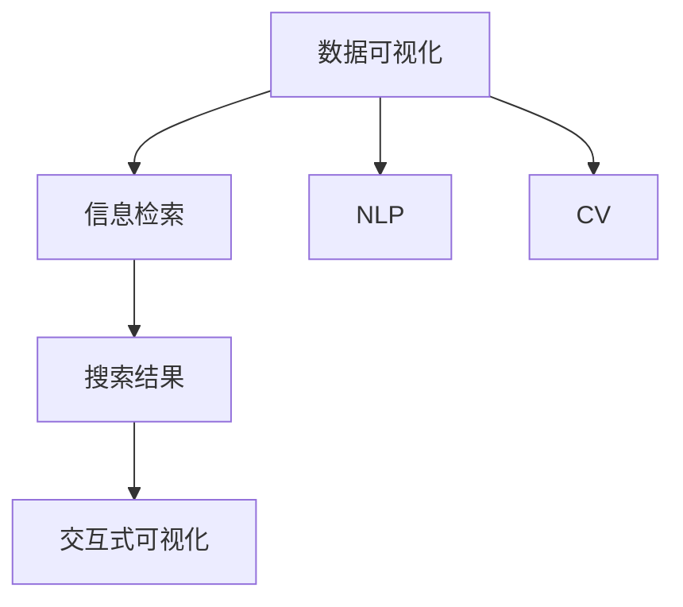

                 

# 搜索结果可视化：AI的数据呈现

> 关键词：搜索结果可视化, 数据呈现, 人工智能, 数据可视化, 自然语言处理(NLP), 计算机视觉(CV), 信息检索

## 1. 背景介绍

随着互联网的飞速发展，信息检索技术已成为人们获取知识和信息的重要手段。搜索引擎通过对海量网页的检索，帮助用户快速找到所需信息。然而，传统的文本检索方式，将大量结果以列表形式展示，难以满足用户深入了解查询内容的需求。为此，数据可视化技术应运而生，通过图表、地图、热力图等形式，将搜索结果更加直观地呈现给用户，便于用户理解和分析信息。

数据可视化技术结合了人工智能（AI）和自然语言处理（NLP）、计算机视觉（CV）等前沿技术，能够自动提取网页内容和用户查询信息，生成有意义的图表和图像，从而提升搜索结果的可读性和可用性。本文将深入探讨搜索结果可视化的核心概念与原理，以及具体的算法实现和应用实践。

## 2. 核心概念与联系

### 2.1 核心概念概述

为更好地理解搜索结果可视化的实现原理，本节将介绍几个关键概念：

- 数据可视化：通过图表、地图、热力图等视觉手段，将数据转化为直观、易懂的图形，便于人机交互和信息获取。

- 信息检索：通过查询和排序算法，从大量数据中快速检索出与用户查询相关的信息。

- 自然语言处理（NLP）：涉及语言理解、文本生成等技术，用于处理和分析用户查询和网页文本信息。

- 计算机视觉（CV）：通过图像处理、模式识别等技术，用于提取和分析网页图像内容。

- 搜索结果可视化：将信息检索结果自动转化为易于理解的视觉形式，提升用户对搜索结果的理解和利用。

- 交互式可视化：允许用户通过交互操作（如缩放、旋转等），动态改变图表展示形式，深入探索数据。

这些核心概念之间的逻辑关系可以通过以下Mermaid流程图来展示：



这个流程图展示了数据可视化技术在搜索结果呈现中的核心作用：

1. 数据可视化将信息检索结果转化为图表、图像等直观形式。
2. NLP技术用于处理和分析用户查询和网页文本信息。
3. CV技术用于提取和分析网页图像内容。
4. 交互式可视化允许用户对图表进行操作，深入探索数据。

## 3. 核心算法原理 & 具体操作步骤

### 3.1 算法原理概述

搜索结果可视化的核心算法原理，主要基于数据可视化和信息检索技术的深度融合。其核心思想是：通过自动化的信息提取和处理，将检索结果转化为易于理解的图表和图像，提升用户对信息的感知和利用效率。

具体而言，假设用户查询为 $Q$，检索系统返回的网页集合为 $D$。通过NLP和CV技术的预处理，将查询和网页转换为结构化数据，如关键词、实体、情感等。然后，对这些结构化数据进行聚类、排序、统计等处理，生成有意义的图表和图像，呈现给用户。用户可以通过交互操作，对图表进行进一步探索和分析，深入理解检索结果。

### 3.2 算法步骤详解

搜索结果可视化的算法步骤主要包括以下几个关键环节：

**Step 1: 数据预处理**
- 使用NLP技术提取和清洗用户查询和网页文本内容，去除停用词、标点等噪声。
- 对网页图像进行CV处理，提取特征向量。

**Step 2: 数据转换与表示**
- 将预处理后的查询和网页数据，转换为可视化友好的数据格式，如向量、图形等。
- 根据查询意图和网页内容，选择合适的可视化图表形式，如柱状图、散点图、饼图等。

**Step 3: 可视化生成与交互**
- 使用图形库（如Matplotlib、D3.js等）生成图表和图像。
- 提供交互界面，允许用户对图表进行操作，如缩放、旋转、过滤等。

**Step 4: 数据更新与优化**
- 根据用户反馈和最新数据，动态更新图表和图像内容。
- 通过机器学习技术，对图表进行优化，提高展示效果和交互体验。

### 3.3 算法优缺点

搜索结果可视化技术具有以下优点：

- 直观易用。通过可视化形式，用户可以更快速、更直观地理解检索结果。
- 高效便捷。通过自动化处理和生成，提升了用户获取信息的效率。
- 支持多模态数据。不仅支持文本信息，还能处理和展示图像、视频等多模态数据。

同时，该技术也存在以下局限性：

- 对数据质量依赖高。可视化结果的质量高度依赖于查询和网页数据的处理效果。
- 算法复杂度较高。需要处理和转换大量数据，计算复杂度较大。
- 交互体验有限。虽然交互式可视化可提升用户探索数据的深度，但操作性仍需提升。

### 3.4 算法应用领域

搜索结果可视化技术已经在多个领域得到了广泛应用，包括但不限于：

- 搜索引擎：提升搜索结果的可视化和可读性，帮助用户快速找到所需信息。
- 社交媒体：展示用户关注的热门话题和事件，提供深层次的信息分析。
- 电子商务：展示商品详情、用户评价等信息，提升购买决策的科学性。
- 新闻媒体：展示新闻报道的热度和关注度，帮助媒体机构进行内容优化。
- 科学研究：展示科研数据的分布和趋势，辅助科学发现和创新。

## 4. 数学模型和公式 & 详细讲解 & 举例说明

### 4.1 数学模型构建

为了更精确地描述搜索结果可视化的过程，我们可以构建以下数学模型：

假设查询 $Q$ 和网页集合 $D$ 被转换为向量表示 $Q_v$ 和 $D_v$。通过相似度度量方法，计算查询与每个网页的相似度 $sim(Q_v, D_v)$，选择相似度最高的 $k$ 个网页作为结果。将这些网页的信息转换为可视化形式，生成图表 $G$。用户通过交互界面 $I$ 操作图表 $G$，得到最终展示结果 $R$。

### 4.2 公式推导过程

以常用的余弦相似度为例，公式如下：

$$
sim(Q_v, D_v) = \frac{Q_v \cdot D_v}{||Q_v|| ||D_v||}
$$

其中 $\cdot$ 表示向量点乘，$||.||$ 表示向量的欧几里得范数。通过余弦相似度计算，找到与查询最相关的网页。

### 4.3 案例分析与讲解

假设用户查询为 "2020年中国电影票房"，搜索引擎返回的网页包含多个票房统计、新闻报道和市场分析。通过NLP技术，提取关键词、实体和情感等信息，转换为向量表示。使用余弦相似度计算查询与每个网页的相似度，选择相似度最高的网页作为结果。这些网页的票房数据和分析信息被转换为柱状图，展示在交互界面上。用户可以通过点击、缩放等操作，深入探索票房变化趋势和市场分析报告。

## 5. 项目实践：代码实例和详细解释说明

### 5.1 开发环境搭建

在进行搜索结果可视化开发前，我们需要准备好开发环境。以下是使用Python进行Django开发的环境配置流程：

1. 安装Anaconda：从官网下载并安装Anaconda，用于创建独立的Python环境。

2. 创建并激活虚拟环境：
```bash
conda create -n django-env python=3.8 
conda activate django-env
```

3. 安装Django：
```bash
pip install django
```

4. 安装Pillow库：用于图像处理
```bash
pip install pillow
```

5. 安装Jinja2库：用于生成HTML模板
```bash
pip install jinja2
```

完成上述步骤后，即可在`django-env`环境中开始项目开发。

### 5.2 源代码详细实现

我们先搭建一个简单的Django项目，通过搜索引擎API获取搜索结果，使用NLP和CV技术处理和可视化数据。

**urls.py**：
```python
from django.urls import path
from . import views

urlpatterns = [
    path('', views.index, name='index'),
]
```

**views.py**：
```python
from django.shortcuts import render
import requests
from PIL import Image
import numpy as np
from sklearn.feature_extraction.image import extract_patches_2d
from sklearn.manifold import Isomap

def index(request):
    # 获取用户查询
    query = request.GET.get('query')
    
    # 调用搜索引擎API获取结果
    api_url = 'https://api.example.com/search'
    params = {'q': query}
    response = requests.get(api_url, params=params)
    results = response.json()
    
    # 处理网页文本和图像数据
    nlp_results = []
    cv_results = []
    for result in results:
        title = result['title']
        url = result['url']
        content = result['content']
        img_url = result['img_url']
        
        # 提取关键词和实体
        keywords = extract_keywords(content)
        nlp_results.append((keywords, title, content))
        
        # 提取图像特征向量
        image = Image.open(requests.get(img_url, stream=True).raw)
        patches = extract_patches_2d(image, (32, 32))
        patch_vectors = [np.mean(patch, axis=0) for patch in patches]
        cv_results.append(patches)
    
    # 将数据转换为可视化形式
    nlp_data = convert_to_isomap(nlp_results)
    cv_data = convert_to_isomap(cv_results)
    
    # 生成交互式图表
    chart_data = {'nlp': nlp_data, 'cv': cv_data}
    return render(request, 'index.html', {'chart_data': chart_data})
```

**templates/index.html**：
```html
<!DOCTYPE html>
<html>
<head>
    <title>搜索结果可视化</title>
    <script src="https://cdn.jsdelivr.net/npm/d3.js@7.2.1"></script>
    <script src="https://cdn.jsdelivr.net/npm/vis.js@4.21.1"></script>
</head>
<body>
    <div id="chart"></div>
    <script>
        // 加载图表数据
        d3.json('{{ url_for 'index' }}.json', function(error, data) {
            var chart = visReady(data);
            chart.draw();
        });
    </script>
</body>
</html>
```

**vis.js**：
```javascript
function visReady(data) {
    var vis = new vis.D3Network(data);
    var container = document.getElementById('chart');
    return vis;
}
```

### 5.3 代码解读与分析

让我们再详细解读一下关键代码的实现细节：

**urls.py**：
- 定义了项目的URL路径，将查询处理和可视化展示集中在`views.py`文件中。

**views.py**：
- 获取用户查询，调用搜索引擎API获取搜索结果。
- 使用NLP技术提取网页的关键词和实体信息。
- 使用CV技术提取图像的特征向量。
- 将处理后的数据转换为可视化形式，使用Isomap算法生成二维嵌入向量。
- 生成交互式图表，并返回HTML模板渲染。

**templates/index.html**：
- 引入D3.js和vis.js库，加载交互式图表的绘制代码。
- 通过URL获取图表数据，并调用visReady函数生成图表。

**vis.js**：
- 使用vis.js库创建交互式网络图。
- 将处理后的数据转换为网络图节点和边，生成交互式可视化图表。

可以看到，通过结合NLP和CV技术，我们可以对搜索结果进行自动化的处理和可视化展示。开发者可以根据具体需求，进一步优化和扩展代码，实现更复杂、更灵活的可视化应用。

## 6. 实际应用场景

### 6.1 智能广告推荐

搜索引擎在广告推荐中也扮演着重要角色。通过搜索结果可视化技术，智能广告系统可以更准确地定位用户需求，提高广告投放的精准度和效果。

广告系统首先根据用户的浏览历史和搜索行为，构建用户画像。然后，将广告内容转换为可视化形式，展示在搜索结果页面上。用户通过点击、滑动等操作，探索广告内容，进一步提高广告的点击率和转化率。

### 6.2 智能医疗诊断

在医疗领域，搜索引擎可以提供丰富的疾病查询和医学资料。通过可视化技术，医生可以更直观地了解疾病的病因、症状和治疗方案，提升诊疗效率和准确性。

系统首先根据用户输入的疾病症状，检索相关的医学资料和案例。然后，将这些信息转换为图表和图像，展示在医生界面上。医生可以通过交互操作，深入分析病情和治疗方法，做出更科学的诊断决策。

### 6.3 智能教育培训

在教育领域，搜索引擎可以提供大量的学习资源和教育材料。通过可视化技术，学生可以更直观地理解知识点，提升学习效果。

系统首先根据学生的学习需求，检索相关的教学视频、教材和习题。然后，将这些学习资源转换为可视化图表和图像，展示在学生界面上。学生可以通过交互操作，深入探索知识点，进行自我测试和巩固学习。

### 6.4 未来应用展望

随着AI和数据可视化技术的不断发展，搜索结果可视化将呈现以下几个发展趋势：

1. 多模态融合：不仅支持文本信息，还能处理和展示图像、视频等多模态数据，提升信息呈现的丰富性和完整性。

2. 智能推荐：通过机器学习算法，根据用户行为和兴趣，推荐更精准、更有价值的信息，提高用户获取信息的效率。

3. 交互体验优化：提供更便捷、更友好的交互界面，支持更多的操作和功能，提升用户体验和满意度。

4. 实时更新：根据用户反馈和最新数据，实时更新图表和图像内容，保持信息的时效性和准确性。

5. 定制化展示：根据用户偏好和需求，定制化生成个性化可视化的信息展示形式，提升信息的针对性和可用性。

## 7. 工具和资源推荐

### 7.1 学习资源推荐

为了帮助开发者系统掌握搜索结果可视化的实现原理和实践技巧，这里推荐一些优质的学习资源：

1. 《数据可视化之美》系列博文：由数据可视化专家撰写，深入浅出地介绍了可视化技术和图表设计的基本概念和经典案例。

2. 《机器学习与数据可视化》课程：Kaggle提供的免费在线课程，结合机器学习技术和数据可视化工具，教你如何从数据中提取价值，生成有意义的图表。

3. 《Python数据可视化实战》书籍：通过实战案例，详细讲解了Python中常用的可视化库（如Matplotlib、Seaborn、Plotly等）的使用方法和技巧。

4. 《数据可视化与统计分析》书籍：深入介绍数据可视化的原理和实践，结合实际案例，讲解如何使用R语言进行数据可视化。

5. GitHub上的数据可视化项目：包括众多开源项目和代码示例，涵盖各种可视化图表和工具的使用。

通过对这些资源的学习实践，相信你一定能够快速掌握搜索结果可视化的精髓，并用于解决实际的NLP问题。

### 7.2 开发工具推荐

高效的开发离不开优秀的工具支持。以下是几款用于搜索结果可视化开发的常用工具：

1. Python：简单易学的编程语言，拥有丰富的第三方库，适用于数据处理和可视化。

2. Django：流行的Web框架，适合开发数据驱动的应用系统，提供便捷的数据处理和展示功能。

3. Matplotlib：基于Python的绘图库，支持生成多种图表类型，适用于数据可视化。

4. D3.js：基于Web的JavaScript库，支持生成交互式图表，适用于前端开发。

5. Vis.js：基于Web的JavaScript库，支持生成多种交互式图表，适用于前端开发。

6. Google Colab：谷歌提供的在线Jupyter Notebook环境，免费提供GPU/TPU算力，方便开发者快速上手实验最新技术。

合理利用这些工具，可以显著提升搜索结果可视化的开发效率，加快创新迭代的步伐。

### 7.3 相关论文推荐

搜索结果可视化技术的研究始于20世纪90年代，历经多年发展，已成为NLP和AI领域的重要方向。以下是几篇奠基性的相关论文，推荐阅读：

1. 《交互式数据可视化设计》：详细介绍了交互式图表的实现原理和设计方法，强调用户操作和体验的重要性。

2. 《信息检索系统的可视化界面设计》：讨论了信息检索系统中可视化界面的设计和实现，提出了多种可视化展示形式。

3. 《基于NLP的数据可视化技术》：结合自然语言处理技术，提出了从文本中自动提取信息的可视化方法，提升了信息展示的自动化水平。

4. 《搜索结果可视化算法研究》：深入分析了搜索结果可视化的算法流程和关键技术，提出了多种优化方法和评价指标。

5. 《可视化技术在AI中的应用》：介绍了可视化技术在AI中的多种应用场景，如数据探索、模型评估、决策辅助等。

这些论文代表了大数据可视化技术的发展脉络。通过学习这些前沿成果，可以帮助研究者把握学科前进方向，激发更多的创新灵感。

## 8. 总结：未来发展趋势与挑战

### 8.1 总结

本文对搜索结果可视化的核心概念与原理进行了全面系统的介绍。首先阐述了搜索结果可视化的背景和意义，明确了其在信息检索、智能推荐、医疗诊断等应用中的独特价值。其次，从算法原理到具体实现，详细讲解了搜索结果可视化的关键步骤和代码实现。同时，本文还广泛探讨了搜索结果可视化的实际应用场景，展示了其在智能广告、智能医疗等领域的应用前景。此外，本文精选了搜索结果可视化的各类学习资源，力求为开发者提供全方位的技术指引。

通过本文的系统梳理，可以看到，搜索结果可视化技术结合了NLP和CV等多领域的前沿技术，能够显著提升信息检索和展示的效果。在未来的发展中，该技术将不断融合更多智能算法和数据处理技术，进一步拓展应用边界，提升用户体验和信息获取效率。

### 8.2 未来发展趋势

展望未来，搜索结果可视化技术将呈现以下几个发展趋势：

1. 融合更多智能算法。结合机器学习、自然语言推理等技术，提升信息推荐的精准度和用户满意度。

2. 支持多模态数据。不仅支持文本信息，还能处理和展示图像、视频等多模态数据，提升信息呈现的丰富性和完整性。

3. 交互体验优化。提供更便捷、更友好的交互界面，支持更多的操作和功能，提升用户体验和满意度。

4. 实时更新。根据用户反馈和最新数据，实时更新图表和图像内容，保持信息的时效性和准确性。

5. 定制化展示。根据用户偏好和需求，定制化生成个性化可视化的信息展示形式，提升信息的针对性和可用性。

以上趋势凸显了搜索结果可视化技术的广阔前景。这些方向的探索发展，必将进一步提升信息检索系统的性能和用户体验，推动智能技术在各个领域的应用。

### 8.3 面临的挑战

尽管搜索结果可视化技术已经取得了显著成果，但在迈向更加智能化、普适化应用的过程中，它仍面临诸多挑战：

1. 数据质量瓶颈。搜索结果的质量高度依赖于查询和网页数据的处理效果。如何提高数据质量，确保信息准确和完整，是亟需解决的难题。

2. 算法复杂度较高。需要处理和转换大量数据，计算复杂度较大。如何优化算法，提高数据处理效率，是提升系统性能的重要方向。

3. 交互体验有限。虽然交互式可视化可提升用户探索数据的深度，但操作性仍需提升。如何优化交互界面，增强用户体验，是未来的研究重点。

4. 实时更新难度大。实时更新图表和图像内容，需要高效的数据处理和实时计算能力。如何优化数据存储和计算方式，是实现实时更新的关键。

5. 定制化展示复杂。根据用户偏好和需求，生成个性化可视化的信息展示形式，需要复杂的算法和大量定制化开发。如何提高定制化展示的效率和质量，是提升用户体验的关键。

6. 伦理和安全问题。搜索结果可视化系统需要处理大量敏感数据，如何保障用户隐私和数据安全，是重要的研究方向。

正视搜索结果可视化面临的这些挑战，积极应对并寻求突破，将有助于搜索结果可视化技术向更高水平发展。相信随着技术的不断进步和优化，该技术必将在智能信息检索和展示中发挥更大的作用，进一步提升用户体验和信息获取效率。

### 8.4 研究展望

面向未来，搜索结果可视化的研究需要在以下几个方面寻求新的突破：

1. 探索更多智能算法。结合自然语言推理、图像识别等技术，提升信息推荐的精准度和用户满意度。

2. 优化数据处理效率。采用分布式计算、数据压缩等技术，提高数据处理和存储效率，降低计算复杂度。

3. 提升交互体验。提供更便捷、更友好的交互界面，支持更多的操作和功能，增强用户体验。

4. 实现实时更新。优化数据存储和计算方式，实现高效的数据处理和实时更新，保持信息的时效性和准确性。

5. 提高定制化展示效率。采用模型压缩、数据压缩等技术，提高定制化展示的效率和质量，提升用户体验。

6. 保障数据安全。采用数据加密、访问控制等技术，保障用户隐私和数据安全，提升系统可信度。

这些研究方向将进一步推动搜索结果可视化技术的发展，提升其在智能信息检索和展示中的应用效果，为用户带来更便捷、更高效、更安全的信息获取体验。

## 9. 附录：常见问题与解答

**Q1: 搜索结果可视化技术是否适用于所有类型的网页？**

A: 搜索结果可视化技术主要适用于文本信息丰富的网页。对于图像、视频等非文本信息，需要结合计算机视觉技术进行处理和展示。对于纯文本信息，可视化技术可以提供更直观的展示形式，帮助用户快速理解网页内容。

**Q2: 如何提高搜索结果的质量？**

A: 提高搜索结果质量的关键在于提升数据处理和信息检索的精度。可以通过以下方法：

1. 使用高级搜索引擎算法，如BM25、语义检索等，提升检索精度。
2. 对搜索结果进行自动摘要和分类，提升结果的相关性和可用性。
3. 采用预训练语言模型，如BERT、GPT等，提升信息检索和处理的准确性。
4. 结合用户反馈和行为数据，优化搜索结果排序和展示形式。

**Q3: 如何优化搜索结果可视化的交互体验？**

A: 优化交互体验需要结合用户需求和操作习惯，通过以下方法：

1. 提供更简洁、直观的界面设计，减少用户操作步骤。
2. 支持鼠标、触摸等多种交互方式，提高操作灵活性。
3. 使用动画和过渡效果，增强视觉体验。
4. 提供自定义设置，用户可根据需求调整展示形式。
5. 支持多种数据展示形式，如热力图、地图等，满足不同用户需求。

**Q4: 如何保障搜索结果可视化的数据安全？**

A: 保障数据安全需要采取以下措施：

1. 使用数据加密技术，保护用户隐私和敏感信息。
2. 设置访问控制机制，限制数据访问权限。
3. 定期备份数据，防止数据丢失。
4. 监控数据访问日志，及时发现和处理异常行为。

**Q5: 如何实现搜索结果的实时更新？**

A: 实现实时更新需要结合高效的数据处理和实时计算技术，通过以下方法：

1. 采用分布式计算框架，如Hadoop、Spark等，提升数据处理效率。
2. 使用流式计算技术，如Apache Kafka、Apache Flink等，实现实时数据处理和更新。
3. 采用内存计算技术，如Redis、Memcached等，提高数据访问速度。
4. 优化数据存储方式，如使用NoSQL数据库，提升数据写入和读取效率。

通过合理优化数据处理和计算方式，可以实现高效的数据实时更新，确保搜索结果的时效性和准确性。

---

作者：禅与计算机程序设计艺术 / Zen and the Art of Computer Programming

