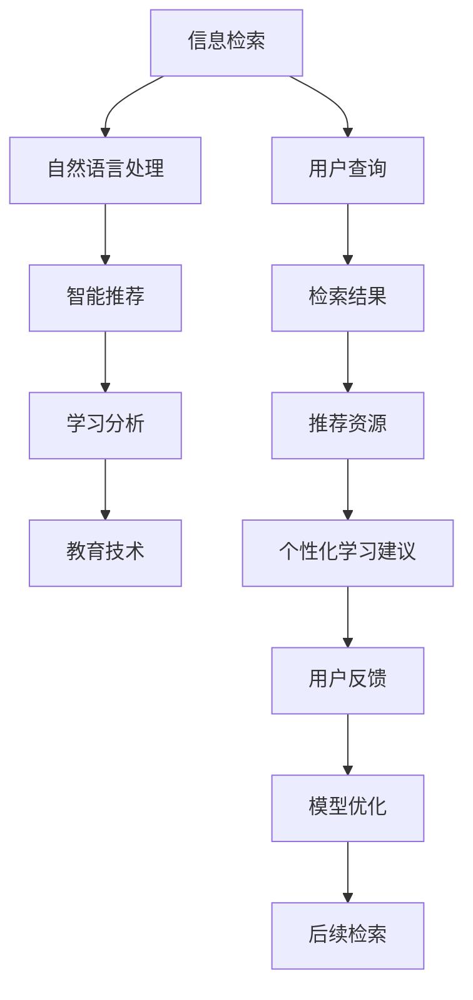

                 

# 教育领域的AI搜索应用

> 关键词：人工智能, AI搜索, 自然语言处理, NLP, 教育技术, 信息检索, 智能推荐

## 1. 背景介绍

### 1.1 问题由来
随着互联网和数字技术的迅猛发展，教育领域也逐步迈入了智能化、个性化和高效化的新时代。从大规模开放在线课程(MOOCs)到智能教育系统，从AI辅导机器人到智能教室，各种技术手段正不断重塑着教育生态系统。特别是信息检索和智能推荐技术，为个性化学习提供了强大的支持。

在传统的教育搜索应用中，无论是教材查找、课程推荐、作业辅助，还是学习资源筛选，都依赖于教师的人工干预和推荐。但这种基于经验的推荐方式，不仅费时费力，还难以满足学生多样化的需求。而利用AI技术进行智能搜索和推荐，不仅可以大幅提高教学效率，还能更准确地匹配学生的学习需求，提升学习效果。

### 1.2 问题核心关键点
教育领域的AI搜索应用主要聚焦于以下几个关键点：

1. **信息检索技术**：如何高效地从海量教育资源中检索出与用户需求最相关的信息。
2. **智能推荐算法**：如何利用用户的历史行为数据和上下文信息，进行个性化的资源推荐。
3. **语义理解**：如何通过自然语言处理技术，准确理解和解析用户查询。
4. **用户反馈机制**：如何收集用户反馈，进一步优化推荐模型的性能。
5. **隐私保护**：如何在确保用户隐私安全的前提下，进行数据收集和使用。

## 2. 核心概念与联系

### 2.1 核心概念概述

为更好地理解教育领域的AI搜索应用，本节将介绍几个关键概念：

- **人工智能(AI)**：一种通过模拟人类智能行为进行问题解决的计算机技术，涵盖了机器学习、自然语言处理、计算机视觉等多个子领域。
- **信息检索(Information Retrieval, IR)**：从大规模文档集合中，根据用户查询返回相关文档的过程。
- **智能推荐系统(Recommendation System)**：基于用户行为数据，通过机器学习算法推荐个性化资源的技术。
- **自然语言处理(Natural Language Processing, NLP)**：研究如何让计算机理解和处理人类语言的技术，包括文本分析、语义理解、情感分析等。
- **学习分析(Learning Analytics)**：通过数据挖掘、数据分析等技术，对学生的学习行为和表现进行深入分析，以提供个性化学习建议。
- **教育技术(Education Technology)**：结合信息技术与教育学原理，提升教育质量和学习效率的实践应用。

这些概念之间存在紧密的联系。例如，信息检索和智能推荐系统都可以利用自然语言处理技术对用户查询进行理解和解析。学习分析和教育技术则是这些技术在教育领域的具体应用。

### 2.2 核心概念原理和架构的 Mermaid 流程图



这个流程图展示了核心概念之间的逻辑关系：

1. 用户发起查询（A）。
2. 通过自然语言处理（B）解析查询内容。
3. 基于解析后的查询，进行信息检索（C）。
4. 检索结果经过智能推荐（C），输出个性化资源。
5. 学习分析（D）基于用户行为数据，进一步提升推荐效果。
6. 教育技术（E）结合前述技术，实现教学和学习的智能化。

## 3. 核心算法原理 & 具体操作步骤

### 3.1 算法原理概述

教育领域的AI搜索应用通常基于信息检索和智能推荐技术。其核心思想是通过自然语言处理技术，将用户查询转化为计算机可理解的向量表示，然后根据该向量在预先构建好的知识库中进行检索，并结合用户的个性化历史数据，生成推荐结果。

形式化地，设用户查询为 $q$，相关文档集合为 $D=\{d_1,d_2,\dots,d_N\}$，相关性函数为 $r$，则信息检索的过程可以表示为：

$$
d_r = \mathop{\arg\max}_{d\in D} r(d,q)
$$

其中，$r$ 函数用于计算文档 $d$ 与查询 $q$ 的相关性。在得到检索结果后，通过智能推荐算法进一步提升推荐的个性化和精准度。

### 3.2 算法步骤详解

基于信息检索和智能推荐技术的教育领域AI搜索应用一般包括以下几个关键步骤：

**Step 1: 准备数据和模型**
- 收集教育领域的文本数据，如教材、课件、习题等，构建知识库。
- 对用户查询和知识库进行分词、词向量化等预处理。
- 选择或训练合适的信息检索模型和推荐算法模型。

**Step 2: 信息检索**
- 对用户查询进行自然语言处理，提取关键信息，构建查询向量。
- 在知识库中检索与查询向量相似度最高的文档，作为推荐候选。
- 计算候选文档的相关性得分，排序后选取前 $k$ 个作为最终检索结果。

**Step 3: 智能推荐**
- 根据用户的历史行为数据，构建用户画像。
- 对用户画像和检索结果进行交叉分析，计算推荐得分。
- 使用推荐算法对推荐得分排序，选择前 $m$ 个文档作为推荐结果。

**Step 4: 用户反馈和模型优化**
- 收集用户对推荐结果的反馈，用于更新用户画像。
- 通过反馈数据对模型进行在线学习，不断优化推荐效果。
- 定期重新训练模型，适应数据分布的变化。

### 3.3 算法优缺点

基于信息检索和智能推荐技术的教育领域AI搜索应用具有以下优点：

1. **高效性**：利用自然语言处理和机器学习技术，可以自动完成信息检索和推荐任务，大大节省教师和学生的时间。
2. **个性化**：通过分析用户的历史行为和偏好，提供个性化的资源推荐，提升学习体验。
3. **准确性**：基于信息检索和推荐算法，可以大幅提高推荐资源的准确性和相关性。
4. **可扩展性**：模型和算法具有较强的可扩展性，可以应用于不同的教育场景。

同时，该方法也存在一些局限性：

1. **数据依赖**：效果很大程度上依赖于收集的数据质量，需要持续收集和更新数据。
2. **算法复杂性**：信息检索和推荐算法复杂，需要较强的技术储备和计算资源。
3. **隐私问题**：收集和处理用户数据，需要考虑隐私保护和数据安全。
4. **数据偏见**：如果知识库或数据存在偏见，可能导致推荐结果的不公平。
5. **技术门槛**：模型和算法复杂，需要专业技术人员进行开发和维护。

尽管存在这些局限性，但就目前而言，基于信息检索和智能推荐技术的教育领域AI搜索应用仍然是最主流的方法。未来相关研究的重点在于如何进一步降低技术门槛，提升算法的鲁棒性和公平性，同时兼顾隐私保护和数据安全等因素。

### 3.4 算法应用领域

基于信息检索和智能推荐技术的教育领域AI搜索应用，在多个领域得到了广泛应用，例如：

- **教材推荐**：根据学生所学的课程，推荐相应的教材、习题集等。
- **学习资源检索**：帮助学生快速找到所需的学术文章、视频教程等。
- **个性化学习计划**：根据学生的学习进度和兴趣，生成个性化的学习计划和推荐资源。
- **作业辅助**：根据学生提交的作业，推荐相关的参考资料和参考资料库。
- **智能问答**：通过自然语言处理技术，解答学生的疑问，辅助教学和学习。

除了上述这些经典应用外，AI搜索技术还被创新性地应用到更多场景中，如在线课程推荐、虚拟助教、教育数据分析等，为教育技术的创新发展提供了新的可能性。

## 4. 数学模型和公式 & 详细讲解 & 举例说明

### 4.1 数学模型构建

本节将使用数学语言对教育领域AI搜索应用的算法流程进行更加严格的刻画。

设用户查询为 $q$，知识库中的文档为 $d$，相关性函数为 $r$。假设 $q$ 和 $d$ 被表示为向量 $q_v$ 和 $d_v$。

在信息检索阶段，我们需要计算查询向量 $q_v$ 和每个文档向量 $d_v$ 的相似度。常用的相似度计算方法包括余弦相似度、Jaccard相似度、欧几里得距离等。这里以余弦相似度为例：

$$
sim(q_v, d_v) = \frac{q_v \cdot d_v}{\|q_v\|\|d_v\|}
$$

其中，$\cdot$ 表示向量点乘，$\|\cdot\|$ 表示向量范数。

计算出所有文档的相似度后，通过阈值筛选出相关性最高的 $k$ 个文档作为检索结果。

### 4.2 公式推导过程

在智能推荐阶段，假设用户 $u$ 的历史行为数据为 $H_u$，推荐算法为目标函数 $f$。推荐得分 $S_u(d_v)$ 可以表示为：

$$
S_u(d_v) = f(q_v, d_v, H_u)
$$

其中，$f$ 函数将查询向量、文档向量和用户历史数据作为输入，输出推荐得分。

推荐算法可以采用多种方式，如基于协同过滤、基于内容的推荐、混合推荐等。这里以基于协同过滤的矩阵分解为例：

设用户行为矩阵为 $U=\{u_{ij}\}$，物品向量矩阵为 $V=\{v_j\}$，用户行为向量 $u_v$ 和物品向量 $v_v$ 分别为 $U$ 和 $V$ 的某一行和某一列，推荐函数 $f$ 可以表示为：

$$
S_u(d_v) = u_v \cdot v_v
$$

其中，$u_v$ 和 $v_v$ 分别为用户行为向量和物品向量，$*$ 表示向量点乘。

### 4.3 案例分析与讲解

以一个简单的教材推荐系统为例，展示信息检索和智能推荐的流程：

1. **信息检索**：用户查询“计算机科学基础”，系统将其转换为向量 $q_v$。
2. **智能推荐**：系统在教材库中检索出与 $q_v$ 相似度最高的 10 本书，如《计算机科学导论》、《算法导论》等。
3. **个性化推荐**：系统根据用户的历史阅读数据，如最近读过的教材、点击次数等，计算每个书籍的相关性得分，排序后选取前 3 本作为推荐结果。

## 5. 项目实践：代码实例和详细解释说明

### 5.1 开发环境搭建

在进行教育领域AI搜索应用开发前，我们需要准备好开发环境。以下是使用Python进行PyTorch开发的环境配置流程：

1. 安装Anaconda：从官网下载并安装Anaconda，用于创建独立的Python环境。

2. 创建并激活虚拟环境：
```bash
conda create -n ai-search-env python=3.8 
conda activate ai-search-env
```

3. 安装PyTorch：根据CUDA版本，从官网获取对应的安装命令。例如：
```bash
conda install pytorch torchvision torchaudio cudatoolkit=11.1 -c pytorch -c conda-forge
```

4. 安装相关库：
```bash
pip install pytorch-sentencepiece transformers sklearn tensorflow pandas
```

5. 安装PyTorch-lightning：
```bash
pip install pytorch-lightning
```

完成上述步骤后，即可在`ai-search-env`环境中开始开发实践。

### 5.2 源代码详细实现

这里我们以一个简单的教材推荐系统为例，使用PyTorch和Transformers库进行代码实现。

首先，定义数据处理函数：

```python
from torch.utils.data import Dataset
from torch.utils.data import DataLoader
from transformers import AutoTokenizer, AutoModel
from sklearn.metrics import mean_squared_error

class BookDataset(Dataset):
    def __init__(self, tokenizer, max_len=128, books=None):
        self.tokenizer = tokenizer
        self.max_len = max_len
        self.books = books
        self.len = len(self.books)
        
    def __len__(self):
        return self.len
    
    def __getitem__(self, idx):
        book = self.books[idx]
        title = book['title']
        authors = book['authors']
        summary = book['summary']
        scores = book['scores']
        description = book['description']
        
        book_title = title.split(' ')
        title_seq = [1] + [0] * (len(book_title) - 1)
        title_seq += [2] + [0] * (len(book_title) - 2)
        
        title = self.tokenizer(title, return_tensors='pt', max_length=self.max_len, padding='max_length', truncation=True)
        title = title['input_ids'][0]
        
        book_title = [title_seq] * len(book_title)
        book_title = torch.tensor(book_title, dtype=torch.long)
        
        author_seq = [3] + [0] * len(authors)
        author_seq += [4] + [0] * len(authors)
        
        author = self.tokenizer(authors, return_tensors='pt', max_length=self.max_len, padding='max_length', truncation=True)
        author = author['input_ids'][0]
        
        summary_seq = [5] + [0] * len(summary)
        summary_seq += [6] + [0] * len(summary)
        
        summary = self.tokenizer(summary, return_tensors='pt', max_length=self.max_len, padding='max_length', truncation=True)
        summary = summary['input_ids'][0]
        
        description_seq = [7] + [0] * len(description)
        description_seq += [8] + [0] * len(description)
        
        description = self.tokenizer(description, return_tensors='pt', max_length=self.max_len, padding='max_length', truncation=True)
        description = description['input_ids'][0]
        
        return {'title': title, 'author': author, 'summary': summary, 'description': description, 'scores': scores, 'book_id': idx}

# 加载数据
tokenizer = AutoTokenizer.from_pretrained('bert-base-uncased')
books = load_books_data()
train_dataset = BookDataset(tokenizer, books=books['train'])
valid_dataset = BookDataset(tokenizer, books=books['valid'])
test_dataset = BookDataset(tokenizer, books=books['test'])
```

然后，定义模型和优化器：

```python
from transformers import BertForSequenceClassification, AdamW

model = BertForSequenceClassification.from_pretrained('bert-base-uncased', num_labels=2)
optimizer = AdamW(model.parameters(), lr=2e-5)
```

接着，定义训练和评估函数：

```python
from tqdm import tqdm
from pytorch_lightning import Trainer, LightningModule
from pytorch_lightning.callbacks.early_stopping import EarlyStopping

class BookRecommendationModel(LightningModule):
    def __init__(self, model, optimizer):
        super(BookRecommendationModel, self).__init__()
        self.model = model
        self.optimizer = optimizer
        
    def forward(self, title, author, summary, description, scores):
        return self.model(title, author, summary, description, scores)
    
    def training_step(self, batch, batch_idx):
        title, author, summary, description, scores = batch
        outputs = self.forward(title, author, summary, description, scores)
        loss = outputs.loss
        return {'loss': loss}
    
    def configure_optimizers(self):
        return self.optimizer
    
    def validation_step(self, batch, batch_idx):
        title, author, summary, description, scores = batch
        outputs = self.forward(title, author, summary, description, scores)
        loss = outputs.loss
        return {'val_loss': loss}
    
    def test_step(self, batch, batch_idx):
        title, author, summary, description, scores = batch
        outputs = self.forward(title, author, summary, description, scores)
        loss = outputs.loss
        return {'test_loss': loss}
    
    def training_epoch_end(self, outputs):
        avg_loss = torch.stack([x['loss'] for x in outputs]).mean()
        print(f'Epoch: {self.epoch}, Training Loss: {avg_loss:.3f}')
        
    def validation_epoch_end(self, outputs):
        avg_loss = torch.stack([x['val_loss'] for x in outputs]).mean()
        print(f'Epoch: {self.epoch}, Validation Loss: {avg_loss:.3f}')
        
    def test_epoch_end(self, outputs):
        avg_loss = torch.stack([x['test_loss'] for x in outputs]).mean()
        print(f'Epoch: {self.epoch}, Test Loss: {avg_loss:.3f}')
```

最后，启动训练流程并在测试集上评估：

```python
from pytorch_lightning.callbacks import EarlyStopping
from pytorch_lightning.callbacks import ModelCheckpoint

early_stopping_callback = EarlyStopping(monitor='val_loss', patience=3)
checkpoint_callback = ModelCheckpoint(
    monitor='val_loss',
    dirpath='./checkpoints',
    filename='save-{epoch}-{val_loss:.4f}.ckpt',
    save_top_k=5,
    save_last=True,
    verbose=True,
    mode='min'
)

trainer = Trainer(max_epochs=10, callbacks=[early_stopping_callback, checkpoint_callback])
trainer.fit(model, train_dataset, val_dataset)

# 加载最新模型
latest_model = torch.load(checkpoint_callback.best_model_path)
latest_model = BookRecommendationModel(latest_model, optimizer)
test_dataset = BookDataset(tokenizer, books=books['test'])
trainer.test(latest_model, test_dataset)
```

以上就是使用PyTorch和Transformers库对教材推荐系统进行代码实现的完整流程。可以看到，使用PyTorch-lightning框架进行训练，使得训练流程的实现变得简单高效。

### 5.3 代码解读与分析

让我们再详细解读一下关键代码的实现细节：

**BookDataset类**：
- `__init__`方法：初始化数据集，包括定义tokenizer、最大长度、书籍等。
- `__len__`方法：返回数据集的样本数量。
- `__getitem__`方法：对单个样本进行处理，将书籍信息转换为模型所需的输入。

**训练和评估函数**：
- 使用PyTorch的DataLoader对数据集进行批次化加载，供模型训练和推理使用。
- 训练函数 `training_step`：对数据以批为单位进行迭代，计算损失并返回平均损失。
- 评估函数 `validation_step` 和 `test_step`：与训练类似，不同点在于不更新模型参数。
- 训练函数 `training_epoch_end` 和 `validation_epoch_end`：在每个epoch结束时输出平均损失。
- 测试函数 `test_epoch_end`：在测试集上评估模型性能，输出测试集上的平均损失。

**模型类**：
- `BookRecommendationModel`：继承自 `LightningModule`，定义了前向传播、训练、评估等函数。
- `forward` 函数：对输入数据进行前向传播，计算损失。
- `configure_optimizers` 函数：定义优化器。
- `training_step`、`validation_step` 和 `test_step`：定义训练、评估和测试时的函数调用。

**训练流程**：
- 定义训练的epoch数，开启循环迭代
- 在训练集上训练，输出平均损失
- 在验证集上评估，输出验证集上的平均损失
- 在测试集上评估，输出测试集上的平均损失

可以看到，PyTorch和PyTorch-lightning使得模型训练和评估的代码实现变得简洁高效。开发者可以将更多精力放在数据处理、模型改进等高层逻辑上，而不必过多关注底层的实现细节。

## 6. 实际应用场景

### 6.1 智能教材推荐系统

智能教材推荐系统是教育领域AI搜索应用的重要组成部分。通过收集学生的学习历史和兴趣偏好，推荐与学生当前学习内容相关或兴趣相符的教材、习题等资源，能够显著提升学习效率和效果。

在技术实现上，可以使用信息检索和智能推荐技术。首先对教材进行文本化处理，构建知识库。然后，根据学生的学习行为数据，如阅读时间、点击次数等，生成用户画像。最后，将用户画像与教材进行匹配，生成推荐结果。例如，如果一个学生最近在阅读算法相关书籍，系统可以推荐相关的算法课程教材和习题集。

### 6.2 智能作业辅助系统

智能作业辅助系统可以帮助学生快速找到与作业相关的参考资料和示例，提高作业完成效率。系统可以根据学生的作业内容和难度，推荐相应的参考书目和习题库。同时，系统还可以通过信息检索技术，直接从教材库中检索出与作业相关的章节和段落，供学生参考。

在具体实现上，可以使用多轮信息检索和智能推荐技术。首先，系统通过自然语言处理技术理解学生的作业内容，构建查询向量。然后，在教材库中进行信息检索，获取与作业内容相关的章节和段落。最后，通过智能推荐算法，推荐相关的参考书目和习题库，供学生参考。

### 6.3 智能课程推荐系统

智能课程推荐系统可以根据学生的学习进度和兴趣，推荐合适的课程资源。系统可以收集学生的历史学习数据，如学习时间、课程完成情况等，生成用户画像。然后，根据用户画像和课程资源，通过信息检索和智能推荐技术，生成个性化的课程推荐。

在技术实现上，可以使用多模态信息融合技术。例如，系统可以通过文本、视频、音频等多模态信息，构建更全面的用户画像。然后，将用户画像与课程资源进行匹配，生成个性化的课程推荐。例如，对于一个对编程感兴趣的学生，系统可以推荐相关的编程课程、在线编程平台、编程书籍等。

### 6.4 未来应用展望

随着信息检索和智能推荐技术的不断发展，教育领域的AI搜索应用将呈现以下几个发展趋势：

1. **多模态信息融合**：将文本、视频、音频等多模态信息进行融合，构建更全面的用户画像。
2. **个性化推荐系统**：结合协同过滤、基于内容的推荐等多种技术，提升推荐系统的个性化和精准度。
3. **学习分析技术**：通过数据挖掘、数据分析等技术，深入分析学生的学习行为和表现，提供个性化的学习建议。
4. **知识图谱技术**：将知识图谱技术与信息检索和推荐系统结合，提供更深层次的知识关联和推理。
5. **自然语言生成**：通过自然语言生成技术，生成个性化的学习计划和推荐文本，提升用户体验。

这些趋势将使得教育领域的AI搜索应用更加智能化、个性化和高效化，为学生提供更优质的学习资源和服务。相信随着技术的不断进步，教育领域的AI搜索应用将为学习方式的变革提供新的可能性，促进教育公平和质量提升。

## 7. 工具和资源推荐

### 7.1 学习资源推荐

为了帮助开发者系统掌握教育领域AI搜索应用的理论基础和实践技巧，这里推荐一些优质的学习资源：

1. 《Deep Learning for Natural Language Processing》：深度学习自然语言处理领域的经典教材，涵盖信息检索、智能推荐等核心技术。

2. Coursera《Machine Learning》课程：斯坦福大学开设的机器学习课程，讲解了机器学习的基本概念和算法，包括协同过滤、矩阵分解等推荐算法。

3. PyTorch官方文档：PyTorch官方文档提供了丰富的API和样例代码，是学习PyTorch的必备资源。

4. HuggingFace官方文档：Transformers库的官方文档，提供了海量预训练模型和完整的微调样例代码，是进行信息检索和推荐任务开发的利器。

5. CS229《Machine Learning》课程：斯坦福大学开设的机器学习课程，讲解了机器学习的基本算法和优化策略。

6. Kaggle竞赛：Kaggle提供了一系列教育领域的数据集和竞赛，可以在竞赛中学习到实际应用中遇到的问题和解决方案。

通过对这些资源的学习实践，相信你一定能够快速掌握教育领域AI搜索应用的技术精髓，并用于解决实际的NLP问题。

### 7.2 开发工具推荐

高效的开发离不开优秀的工具支持。以下是几款用于教育领域AI搜索应用开发的常用工具：

1. PyTorch：基于Python的开源深度学习框架，灵活动态的计算图，适合快速迭代研究。大部分预训练语言模型都有PyTorch版本的实现。

2. TensorFlow：由Google主导开发的开源深度学习框架，生产部署方便，适合大规模工程应用。同样有丰富的预训练语言模型资源。

3. PyTorch-lightning：基于PyTorch的高效训练框架，提供自动化的模型评估和超参数调优，降低了开发难度。

4. Weights & Biases：模型训练的实验跟踪工具，可以记录和可视化模型训练过程中的各项指标，方便对比和调优。与主流深度学习框架无缝集成。

5. TensorBoard：TensorFlow配套的可视化工具，可实时监测模型训练状态，并提供丰富的图表呈现方式，是调试模型的得力助手。

6. Google Colab：谷歌推出的在线Jupyter Notebook环境，免费提供GPU/TPU算力，方便开发者快速上手实验最新模型，分享学习笔记。

合理利用这些工具，可以显著提升教育领域AI搜索应用的开发效率，加快创新迭代的步伐。

### 7.3 相关论文推荐

教育领域的AI搜索应用发展源于学界的持续研究。以下是几篇奠基性的相关论文，推荐阅读：

1. A Survey of Recent Trends and Techniques in Recommendation Systems：综述了推荐系统领域的研究进展和未来方向。

2. A Comprehensive Survey on Deep Learning Techniques for Natural Language Processing：综述了深度学习在自然语言处理领域的应用，包括信息检索和智能推荐等。

3. Attention Is All You Need：提出了Transformer结构，开启了NLP领域的预训练大模型时代。

4. Language Modeling for Machine Translation：提出基于语言模型的机器翻译方法，为NLP任务的跨领域迁移提供了新的思路。

5. Semantic Representations From Tree-Structured Long Short-Term Memory Networks for Natural Language Understanding：提出使用树结构长短期记忆网络进行语义理解，为信息检索和推荐系统提供了新的理论基础。

这些论文代表了大语言模型微调技术的发展脉络。通过学习这些前沿成果，可以帮助研究者把握学科前进方向，激发更多的创新灵感。

## 8. 总结：未来发展趋势与挑战

### 8.1 总结

本文对教育领域的AI搜索应用进行了全面系统的介绍。首先阐述了教育领域AI搜索应用的研究背景和意义，明确了信息检索和智能推荐技术在提升教育效率和学习效果方面的独特价值。其次，从原理到实践，详细讲解了信息检索和智能推荐技术的数学原理和关键步骤，给出了AI搜索应用开发的完整代码实例。同时，本文还广泛探讨了AI搜索技术在智能教材推荐、智能作业辅助、智能课程推荐等多个教育场景中的应用前景，展示了AI搜索技术在教育领域的巨大潜力。此外，本文精选了信息检索和智能推荐技术的各类学习资源，力求为读者提供全方位的技术指引。

通过本文的系统梳理，可以看到，教育领域的AI搜索应用正在成为教育技术的重要范式，极大地拓展了教育资源的使用范围，提升了教学和学习效率。得益于自然语言处理和机器学习技术的不断进步，AI搜索应用能够更加精准、高效地匹配学生的需求，为个性化学习提供强有力的支持。未来，伴随技术的不断演进，AI搜索应用必将在更广阔的教育场景中发挥重要作用，推动教育公平和质量提升。

### 8.2 未来发展趋势

展望未来，教育领域的AI搜索应用将呈现以下几个发展趋势：

1. **多模态融合**：将文本、视频、音频等多模态信息进行融合，构建更全面的用户画像。
2. **跨领域迁移**：利用预训练语言模型的跨领域迁移能力，提升推荐系统的泛化性和适应性。
3. **智能交互**：结合智能问答、虚拟助教等技术，提升用户交互体验。
4. **学习分析**：通过数据挖掘和分析，提供更深入的学习分析和个性化建议。
5. **知识图谱**：将知识图谱技术与AI搜索应用结合，提供更深层次的知识关联和推理。
6. **自然语言生成**：通过自然语言生成技术，生成个性化的学习计划和推荐文本，提升用户体验。

这些趋势凸显了教育领域AI搜索应用的广阔前景。这些方向的探索发展，必将进一步提升教学和学习效率，为教育公平和质量提升提供新的可能性。

### 8.3 面临的挑战

尽管教育领域的AI搜索应用已经取得了显著进展，但在迈向更加智能化、个性化和高效化的过程中，它仍面临着诸多挑战：

1. **数据隐私**：收集和处理学生数据，需要考虑隐私保护和数据安全。
2. **数据偏差**：如果知识库或数据存在偏见，可能导致推荐结果的不公平。
3. **算法复杂性**：信息检索和推荐算法复杂，需要较强的技术储备和计算资源。
4. **技术门槛**：模型和算法复杂，需要专业技术人员进行开发和维护。
5. **用户接受度**：学生对AI搜索应用的接受度和信任度，还需进一步提升。

尽管存在这些挑战，但就目前而言，教育领域的AI搜索应用仍然是最主流的方法。未来相关研究的重点在于如何进一步降低技术门槛，提升算法的鲁棒性和公平性，同时兼顾隐私保护和数据安全等因素。

### 8.4 研究展望

面对教育领域AI搜索应用所面临的种种挑战，未来的研究需要在以下几个方面寻求新的突破：

1. **模型压缩与优化**：开发更加轻量级的模型结构，提升计算效率和资源利用率。
2. **隐私保护技术**：研究如何在保护用户隐私的前提下，进行数据收集和使用。
3. **算法公平性**：设计更加公平、透明的推荐算法，避免数据偏见和算法歧视。
4. **多模态信息融合**：将文本、视频、音频等多模态信息进行融合，提升推荐系统的泛化性和适应性。
5. **智能交互设计**：设计更人性化的用户界面和交互方式，提升用户体验和系统可用性。
6. **自然语言生成**：通过自然语言生成技术，生成个性化的学习计划和推荐文本，提升用户体验。

这些研究方向将引领教育领域AI搜索应用走向更高的台阶，为教育公平和质量提升提供新的可能性。面向未来，教育领域的AI搜索应用需要从技术、应用、伦理等多个维度协同发力，共同推动教育领域的智能化发展。

## 9. 附录：常见问题与解答

**Q1：教育领域的AI搜索应用与传统信息检索技术有何不同？**

A: 教育领域的AI搜索应用与传统信息检索技术在处理用户查询和推荐资源的方式上有所不同。AI搜索应用利用自然语言处理技术，能够理解用户查询的语义，构建更加精准的查询向量。而传统信息检索技术通常基于关键词匹配，难以理解查询的深层语义。同时，AI搜索应用能够通过智能推荐算法，根据用户的历史行为和偏好，生成个性化的推荐结果，而传统信息检索技术则缺乏这种个性化能力。

**Q2：如何降低教育领域AI搜索应用的技术门槛？**

A: 降低教育领域AI搜索应用的技术门槛，可以从以下几个方面入手：
1. 提供更易用的开发框架和工具，如PyTorch-lightning等。
2. 开发预训练模型和开源样例代码，降低开发者入门门槛。
3. 简化模型训练和优化流程，减少开发者的技术负担。
4. 提供模型压缩和优化技术，提高模型运行效率。
5. 设计易于理解的模型接口和交互方式，提升用户体验。

**Q3：教育领域的AI搜索应用在实际应用中需要注意哪些问题？**

A: 教育领域的AI搜索应用在实际应用中需要注意以下问题：
1. 数据隐私：收集和处理学生数据，需要考虑隐私保护和数据安全。
2. 数据偏差：如果知识库或数据存在偏见，可能导致推荐结果的不公平。
3. 算法复杂性：信息检索和推荐算法复杂，需要较强的技术储备和计算资源。
4. 用户接受度：学生对AI搜索应用的接受度和信任度，还需进一步提升。
5. 技术门槛：模型和算法复杂，需要专业技术人员进行开发和维护。
6. 应用场景：在实际应用中，需要结合具体的教育场景进行优化和调整。

这些问题的解决，将有助于AI搜索应用在教育领域的广泛应用和推广。

**Q4：如何提升教育领域AI搜索应用的推荐精度和公平性？**

A: 提升教育领域AI搜索应用的推荐精度和公平性，可以从以下几个方面入手：
1. 数据质量：收集和处理高质量的教育数据，减少数据偏差。
2. 多模态融合：将文本、视频、音频等多模态信息进行融合，构建更全面的用户画像。
3. 算法优化：通过算法优化和调参，提升推荐系统的精度和泛化性。
4. 公平性设计：设计更加公平、透明的推荐算法，避免数据偏见和算法歧视。
5. 用户反馈：收集用户反馈，进行模型更新和优化，提升推荐效果。

通过这些措施，可以显著提升AI搜索应用的推荐精度和公平性，提升用户满意度和应用效果。

**Q5：教育领域的AI搜索应用如何与教育技术相结合？**

A: 教育领域的AI搜索应用可以与教育技术进行深度结合，具体方式包括：
1. 智能教材推荐系统：根据学生的学习进度和兴趣，推荐合适的教材、习题等资源。
2. 智能作业辅助系统：帮助学生快速找到与作业相关的参考资料和示例。
3. 智能课程推荐系统：根据学生的学习进度和兴趣，推荐合适的课程资源。
4. 智能课堂分析：通过数据分析，提供个性化的学习建议和教学改进方案。
5. 虚拟助教：通过自然语言处理技术，解答学生的疑问，辅助教学和学习。

这些结合方式将使得AI搜索应用在教育领域的落地应用更加广泛和深入，提升教学和学习效果。

---

作者：禅与计算机程序设计艺术 / Zen and the Art of Computer Programming

