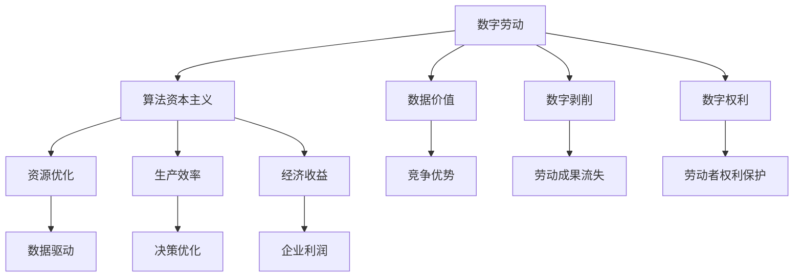

                 

# 数字劳动：人类计算的社会和经济影响

> 关键词：数字劳动,人类计算,社会影响,经济影响,算法资本主义,自动化,数字剥削,数字权利

## 1. 背景介绍

### 1.1 问题由来
在21世纪的数字经济中，数字劳动（digital labor）的概念日益受到关注。随着计算机和网络技术的迅猛发展，越来越多的工作开始通过数字化方式进行，传统的人类劳动逐渐被数字化计算所取代。数字劳动在提升生产效率、优化资源配置等方面发挥了重要作用，但同时也引发了一系列社会和经济问题，引起了广泛关注。

### 1.2 问题核心关键点
数字劳动的核心关键点包括：
- **人类计算的替代**：数字劳动通过算法和自动化技术替代了人类的体力和脑力劳动，从而改变了工作的方式和性质。
- **数据价值和经济收益**：数字劳动依赖于大量数据输入，数据成为新的生产要素，其价值和利用方式对经济收益有着深远影响。
- **算法资本主义**：算法资本主义（Algorithmic Capitalism）是数字劳动的典型特征，即企业利用算法来优化资源配置和生产流程，从而获得高额利润。
- **数字剥削和权利问题**：数字劳动中存在数字剥削现象，工人的劳动成果和价值被数据公司和算法系统剥削，同时数字劳动者的权利保护问题也日益突出。

这些关键点共同构成了数字劳动的复杂图景，反映了其在社会和经济领域的深远影响。本文将通过一系列核心概念的介绍和联系，深入探讨数字劳动的原理与操作步骤，以及其在实际应用场景中的表现和未来展望。

## 2. 核心概念与联系

### 2.1 核心概念概述

- **数字劳动**：指通过计算机和网络技术进行的工作，包括编程、数据分析、在线客服、内容创作等。数字劳动改变了劳动的形式和性质，使劳动成果更依赖于技术和数据。
- **算法资本主义**：以算法为核心的资本主义新形态，通过数据驱动的决策过程优化资源配置，提高生产效率，但也导致了就业不平等、数据垄断等问题。
- **数据价值**：在数字劳动中，数据成为重要的生产要素，其获取、处理和利用方式对经济收益和竞争优势有显著影响。
- **数字剥削**：在算法资本主义下，劳动者（即算法输入）的价值被算法输出（即决策）所剥削，导致劳动成果和权利的流失。
- **数字权利**：包括数据隐私、算法透明性、劳动者权利保护等内容，是数字劳动健康发展的关键。

这些核心概念通过数字劳动的形式联系在一起，共同反映了数字经济时代劳动和社会的新变化。

### 2.2 核心概念原理和架构的 Mermaid 流程图(Mermaid 流程节点中不要有括号、逗号等特殊字符)


这个流程图展示了数字劳动的主要概念及其内在联系。数字劳动通过算法资本主义优化资源和提高生产效率，产生了显著的经济收益，同时带来了数据价值的竞争优势。但同时，数字剥削现象也导致劳动者价值流失，数字权利问题随之凸显。数据驱动的决策过程是数字劳动的关键特征，也深刻影响了资源优化和生产效率。

## 3. 核心算法原理 & 具体操作步骤
### 3.1 算法原理概述

数字劳动的算法原理主要包括数据驱动的决策过程、自动化技术的应用以及算法的优化和训练。

在数字劳动中，算法被广泛应用于数据分析、决策支持、智能推荐、自然语言处理等多个领域。算法通过大量数据输入，经过训练和优化，生成用于指导决策的输出。这些算法通常包括监督学习、无监督学习、强化学习等。

算法原理的核心在于：

- **数据驱动**：算法通过数据输入和输出，利用机器学习技术进行优化和训练，从而提高决策的准确性和效率。
- **自动化**：算法自动化执行各种任务，从数据收集、预处理到决策输出，极大提升了生产效率和资源利用率。
- **优化与训练**：算法的不断优化和训练，使其能够适应不断变化的环境和任务需求，保持高性能和稳定性。

### 3.2 算法步骤详解

数字劳动的算法步骤如下：

1. **数据收集**：通过各种渠道收集数据，包括用户行为数据、社交媒体数据、市场数据等。这些数据是算法训练和优化的基础。
2. **数据预处理**：对收集到的数据进行清洗、归一化、标注等预处理步骤，以便算法能够有效处理。
3. **模型选择与训练**：根据具体任务选择合适的算法模型，并通过训练数据对其进行优化训练。常用的算法包括决策树、神经网络、支持向量机等。
4. **模型评估与优化**：通过评估指标（如准确率、召回率、F1值等）对模型进行评估，根据评估结果调整模型参数，进行进一步优化。
5. **部署与应用**：将优化后的模型部署到实际应用中，进行决策支持和数据驱动的生产流程优化。

### 3.3 算法优缺点

数字劳动的算法具有以下优点：

- **高效性**：算法能够快速处理大量数据，显著提升生产效率和资源利用率。
- **灵活性**：算法能够适应不同环境和任务需求，具有较高的灵活性和可扩展性。
- **自动化**：算法自动化执行任务，减少了人工干预，降低了劳动强度和工作成本。

但同时，算法也存在以下缺点：

- **数据依赖**：算法的性能高度依赖于数据质量，数据偏差可能导致算法输出不公平或不准确。
- **复杂性**：算法的开发和优化过程复杂，需要较高的技术门槛和专业技能。
- **可解释性**：算法的决策过程往往难以解释，缺乏透明性和可解释性，导致信任度下降。

### 3.4 算法应用领域

数字劳动的算法应用广泛，包括但不限于：

- **数据分析**：通过算法分析用户行为数据，发现潜在的商业机会和趋势。
- **智能推荐**：利用算法为用户推荐个性化的产品和服务，提升用户体验。
- **自然语言处理**：使用算法处理和分析文本数据，提取有用信息。
- **机器人流程自动化**：通过算法驱动的自动化工具，完成重复性高、工作量大的人机交互任务。
- **金融分析**：利用算法进行市场预测和风险评估，辅助决策。

## 4. 数学模型和公式 & 详细讲解 & 举例说明

### 4.1 数学模型构建

数字劳动中常用的数学模型包括线性回归模型、逻辑回归模型、支持向量机模型等。这里以线性回归模型为例，构建数学模型并进行详细讲解。

设训练数据集为 $D=\{(x_i,y_i)\}_{i=1}^N$，其中 $x_i$ 为输入特征， $y_i$ 为输出标签。线性回归模型为 $f(x) = \theta_0 + \theta_1 x_1 + \theta_2 x_2 + ... + \theta_p x_p$，其中 $\theta$ 为模型参数，$x_1, x_2, ..., x_p$ 为输入特征。

模型的训练目标是最小化经验风险：

$$
\mathcal{L}(\theta) = \frac{1}{N} \sum_{i=1}^N (y_i - f(x_i))^2
$$

通过梯度下降等优化算法，求解最优参数 $\theta$，使得模型输出逼近真实标签。

### 4.2 公式推导过程

线性回归模型的参数更新公式为：

$$
\theta \leftarrow \theta - \eta \nabla_{\theta}\mathcal{L}(\theta)
$$

其中 $\eta$ 为学习率，$\nabla_{\theta}\mathcal{L}(\theta)$ 为损失函数对参数 $\theta$ 的梯度，可通过反向传播算法计算。

在具体应用中，还需要进行数据预处理、特征工程等步骤，以提高模型的性能。例如，可以使用归一化、标准化等方法对输入数据进行处理，以提高模型的收敛速度和稳定性。

### 4.3 案例分析与讲解

以电商推荐系统为例，使用线性回归模型进行商品推荐。通过收集用户的历史购买记录和浏览行为数据，作为输入特征，预测用户对新商品的可能购买意愿。具体步骤如下：

1. **数据收集**：收集用户购买记录、浏览网页、点击广告等行为数据，作为输入特征。
2. **数据预处理**：对收集到的数据进行清洗、归一化等处理，以提高模型的训练效果。
3. **模型选择与训练**：选择线性回归模型，并使用训练数据对其进行优化训练。
4. **模型评估与优化**：通过交叉验证等方法评估模型性能，根据评估结果调整模型参数，进行进一步优化。
5. **部署与应用**：将优化后的模型部署到推荐系统中，根据用户行为数据生成个性化推荐。

## 5. 项目实践：代码实例和详细解释说明

### 5.1 开发环境搭建

在进行数字劳动相关的项目实践前，需要准备好开发环境。以下是使用Python进行Scikit-Learn开发的开发环境配置流程：

1. 安装Anaconda：从官网下载并安装Anaconda，用于创建独立的Python环境。
2. 创建并激活虚拟环境：
```bash
conda create -n sklearn-env python=3.8 
conda activate sklearn-env
```

3. 安装Scikit-Learn、Numpy、Pandas等工具包：
```bash
pip install scikit-learn numpy pandas
```

4. 安装相关数据集和工具包：
```bash
pip install datasets scikit-learn-utils
```

完成上述步骤后，即可在`sklearn-env`环境中开始项目实践。

### 5.2 源代码详细实现

以下是使用Scikit-Learn进行线性回归模型训练的代码实现：

```python
from sklearn.linear_model import LinearRegression
from sklearn.model_selection import train_test_split
from sklearn.metrics import mean_squared_error
import numpy as np

# 数据准备
X = np.array([[1, 2, 3], [4, 5, 6], [7, 8, 9], [10, 11, 12]])
y = np.array([2, 4, 6, 8])

# 分割数据集
X_train, X_test, y_train, y_test = train_test_split(X, y, test_size=0.2)

# 创建模型
model = LinearRegression()

# 训练模型
model.fit(X_train, y_train)

# 预测并评估
y_pred = model.predict(X_test)
mse = mean_squared_error(y_test, y_pred)

print(f"Mean Squared Error: {mse}")
```

### 5.3 代码解读与分析

让我们再详细解读一下关键代码的实现细节：

**线性回归模型训练代码**：
- `X`和`y`分别表示输入特征和输出标签。
- `train_test_split`函数将数据集分为训练集和测试集。
- `LinearRegression`类创建线性回归模型。
- `fit`方法对模型进行训练。
- `predict`方法对测试集进行预测。
- `mean_squared_error`函数计算预测值和真实值之间的均方误差。

**数据预处理**：
- 数据预处理是数字劳动中非常重要的一环，通常包括数据清洗、归一化、标准化等步骤。

**模型评估**：
- 使用均方误差（MSE）等评估指标对模型进行评估，以衡量其预测效果。

## 6. 实际应用场景

### 6.1 智能推荐系统

在智能推荐系统中，数字劳动的算法广泛用于为用户推荐个性化产品和服务。通过分析用户的历史行为数据，算法可以预测用户对新商品的可能购买意愿，从而提供定制化的推荐。例如，电商平台可以根据用户浏览历史、购买记录等数据，推荐相关商品或服务，提升用户体验和销售额。

### 6.2 金融风险评估

在金融领域，数字劳动的算法被用于风险评估和市场预测。通过分析历史交易数据、市场行情等数据，算法可以识别出潜在的风险因素和市场趋势，辅助金融机构做出决策。例如，银行可以利用算法对客户信用进行评估，保险公司可以利用算法对保险产品进行定价和风险控制。

### 6.3 医疗诊断支持

在医疗领域，数字劳动的算法可以用于疾病诊断、治疗方案推荐等任务。通过分析病人的病历数据、实验室检查结果等数据，算法可以辅助医生进行诊断和治疗方案的制定。例如，算法可以识别出病人的疾病风险，提供个性化的治疗建议，从而提高医疗服务质量和效率。

### 6.4 未来应用展望

随着数字劳动技术的不断发展，其应用领域将更加广泛。未来，数字劳动将在以下几个方面展现新的应用前景：

1. **智能制造**：通过算法优化生产流程，提高制造效率和质量。
2. **智慧城市**：利用算法优化城市资源配置，提高公共服务水平。
3. **个性化教育**：通过算法分析学生学习数据，提供个性化学习方案。
4. **环境保护**：利用算法分析环境数据，预测环境变化，提供环境保护建议。

这些应用场景展示了数字劳动在各个领域的巨大潜力，也反映了其在社会和经济中的深远影响。

## 7. 工具和资源推荐

### 7.1 学习资源推荐

为了帮助开发者系统掌握数字劳动的理论基础和实践技巧，这里推荐一些优质的学习资源：

1. 《机器学习实战》系列书籍：由机器学习领域的专家撰写，系统介绍了机器学习的基本概念和实际应用，适合入门学习。
2. Coursera《机器学习》课程：斯坦福大学开设的机器学习课程，有Lecture视频和配套作业，带你深入理解机器学习的原理和算法。
3. Kaggle平台：数据科学竞赛平台，提供大量真实数据集和机器学习竞赛，可以实践和提高算法能力。
4. GitHub开源项目：机器学习社区的代码分享平台，可以找到大量开源项目，学习优秀的实践经验和算法实现。

通过对这些资源的学习实践，相信你一定能够快速掌握数字劳动的精髓，并用于解决实际的机器学习问题。

### 7.2 开发工具推荐

高效的开发离不开优秀的工具支持。以下是几款用于数字劳动开发的常用工具：

1. Python：功能强大的通用编程语言，拥有丰富的机器学习库和数据处理工具，适合数字劳动的开发。
2. Jupyter Notebook：交互式笔记本环境，方便进行数据探索和算法实验。
3. Scikit-Learn：基于Python的机器学习库，提供了丰富的算法和工具，适合快速原型设计和模型训练。
4. TensorFlow和PyTorch：主流的深度学习框架，支持多种算法实现和模型训练，适合高性能计算需求。

合理利用这些工具，可以显著提升数字劳动的开发效率，加快创新迭代的步伐。

### 7.3 相关论文推荐

数字劳动相关的前沿研究已经取得显著进展，以下是几篇奠基性的相关论文，推荐阅读：

1. Turing and Digital Labor: A New Legal Paradigm for Data Employees：探讨数字劳动中的劳动权利保护问题。
2. Algorithmic Accountability: Towards Fair and Transparent Automated Systems：研究算法的公平性和透明性问题，提出算法透明性框架。
3. The Hidden Costs of AI：揭露AI技术开发和应用中的伦理问题，探讨数据伦理和社会影响。
4. Fairness in Machine Learning：研究机器学习中的公平性问题，提出数据集平衡和算法公平性的解决方案。
5. Privacy-Preserving Machine Learning：探讨数据隐私保护和算法安全问题，提出隐私保护方法。

这些论文代表了数字劳动研究的前沿方向，可以帮助研究者更好地理解数字劳动的社会和经济影响，探索未来的发展路径。

## 8. 总结：未来发展趋势与挑战

### 8.1 总结

本文对数字劳动的原理与操作步骤进行了详细讲解，并从理论和实践两方面探讨了数字劳动的影响。通过系统梳理数字劳动的核心概念，我们看到了其在社会和经济中的深远影响，也理解了其在各个领域的广泛应用。未来，数字劳动技术将在更多的领域得到应用，推动社会和经济的发展。

### 8.2 未来发展趋势

数字劳动的未来发展趋势包括：

1. **数据驱动的决策优化**：通过算法优化决策过程，提升资源配置和生产效率。
2. **多模态数据的整合**：将文本、图像、视频等多种数据进行融合，提供更全面、准确的决策支持。
3. **自动化和智能化的融合**：将自动化技术和智能化算法结合起来，提高劳动效率和工作质量。
4. **隐私保护和数据安全**：在保护用户隐私和数据安全的前提下，实现算法优化和应用。
5. **公平性和透明性**：通过算法透明性技术，确保算法的公平性和透明性，避免数据剥削和社会不公。

这些趋势反映了数字劳动技术的不断进步和发展，也揭示了其未来的广阔前景。

### 8.3 面临的挑战

尽管数字劳动技术在各个领域得到了广泛应用，但在其发展过程中也面临诸多挑战：

1. **数据隐私和伦理问题**：数字劳动中数据隐私和伦理问题日益突出，如何保护用户隐私，避免数据滥用，是一个亟待解决的问题。
2. **算法公平性和透明性**：算法的公平性和透明性问题复杂，需要建立更加完善的算法透明性框架，避免算法偏见和歧视。
3. **资源消耗和环境影响**：大规模数据处理和算法训练需要大量资源，如何降低资源消耗，保护环境，也是一个重要挑战。
4. **技术门槛和人才短缺**：数字劳动技术复杂，需要高水平的技术人才，如何降低技术门槛，培养更多技术人才，也是一个现实问题。
5. **法规和政策问题**：数字劳动技术的广泛应用带来了复杂的法规和政策问题，需要各方共同努力，制定合理的法规和政策，确保数字劳动的健康发展。

这些挑战需要在未来的研究和发展中不断克服，才能确保数字劳动技术的健康发展和社会进步。

### 8.4 研究展望

面对数字劳动技术的未来发展，研究者需要在以下几个方面进行深入探索：

1. **数据隐私保护**：研究更加高效、安全的数据隐私保护方法，确保用户数据安全。
2. **算法透明性和公平性**：研究算法透明性和公平性技术，提升算法的可信度和公正性。
3. **资源优化和环境友好**：研究资源优化和环境友好算法，降低资源消耗，保护环境。
4. **人才培训和技术普及**：通过教育和培训，提高公众对数字劳动技术的理解和应用能力。
5. **法规和政策研究**：研究数字劳动技术的法规和政策，确保其健康发展和公平应用。

这些研究方向将为数字劳动技术的未来发展提供重要指导，推动社会和经济的可持续发展。

## 9. 附录：常见问题与解答

**Q1：数字劳动和传统劳动有何区别？**

A: 数字劳动和传统劳动的主要区别在于劳动的方式和工具。数字劳动通过计算机和网络技术进行，依赖于数据和算法驱动，具有高效率、高灵活性和高自动化等特点。而传统劳动则更多依赖于人力，效率较低，灵活性较差。

**Q2：数字劳动中的数据剥削问题如何解决？**

A: 数字劳动中的数据剥削问题可以通过以下方法解决：

1. **数据所有权和隐私保护**：确保数据所有权和隐私保护，避免数据滥用。
2. **透明性和公平性**：建立算法透明性和公平性框架，确保算法的公正性和可信度。
3. **数据共享和合作**：通过数据共享和合作，平衡各方利益，实现共赢。
4. **监管和监督**：建立监管和监督机制，确保数字劳动的公平和透明。

**Q3：数字劳动的算法有哪些？**

A: 数字劳动中的算法包括但不限于：

1. 监督学习算法：如线性回归、逻辑回归、支持向量机等。
2. 无监督学习算法：如聚类、降维、关联规则挖掘等。
3. 强化学习算法：如Q-learning、策略梯度等。
4. 神经网络算法：如卷积神经网络、循环神经网络、生成对抗网络等。

**Q4：数字劳动技术在金融领域的应用有哪些？**

A: 数字劳动技术在金融领域的应用包括：

1. 风险评估：通过分析历史交易数据和市场行情，评估客户的信用风险和市场风险。
2. 市场预测：利用算法分析市场数据，预测市场趋势和价格变化。
3. 投资组合优化：通过算法优化投资组合，提高投资回报率。
4. 自动化交易：利用算法进行高频交易和量化交易，提高交易效率和收益。

**Q5：数字劳动技术的未来发展方向是什么？**

A: 数字劳动技术的未来发展方向包括：

1. 数据驱动的决策优化：通过算法优化决策过程，提升资源配置和生产效率。
2. 多模态数据的整合：将文本、图像、视频等多种数据进行融合，提供更全面、准确的决策支持。
3. 自动化和智能化的融合：将自动化技术和智能化算法结合起来，提高劳动效率和工作质量。
4. 隐私保护和数据安全：在保护用户隐私和数据安全的前提下，实现算法优化和应用。
5. 公平性和透明性：通过算法透明性技术，确保算法的公平性和透明性，避免算法偏见和歧视。

---

作者：禅与计算机程序设计艺术 / Zen and the Art of Computer Programming

