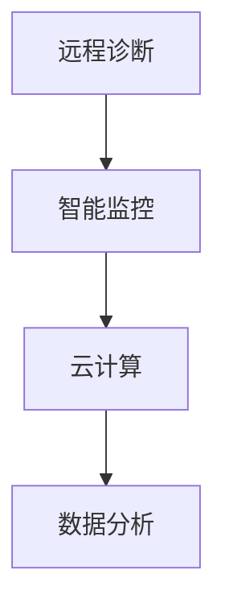

                 

# 数字化宠物医疗创业：远程诊断和监控

> 关键词：数字化医疗，远程诊断，宠物健康，云计算，物联网，数据分析

## 1. 背景介绍

### 1.1 问题由来
随着人们生活水平的不断提高，宠物已成为许多家庭的成员。然而，宠物疾病给宠物主人带来了巨大的困扰。传统的宠物医疗依赖于面对面的医疗服务，需要宠物主人亲自前往兽医院。这不仅耗费时间，还存在一定的经济负担。随着技术的发展，数字化医疗正逐渐改变这一现状，数字化宠物医疗成为了宠物健康领域的新趋势。

### 1.2 问题核心关键点
数字化宠物医疗的核心在于利用先进的科技手段，如远程诊断、智能监控、数据分析等，提高宠物健康的管理水平。通过这些技术手段，宠物主人可以更加便捷地管理宠物的健康，降低医疗成本，提高宠物的健康水平和生活质量。

### 1.3 问题研究意义
数字化宠物医疗能够解决传统兽医服务的种种不足，提升宠物健康管理的效率和质量。本研究旨在探索和实践数字化宠物医疗的关键技术，如远程诊断、智能监控、数据分析等，为宠物主人提供更加便捷、高效、低成本的宠物健康管理方案。

## 2. 核心概念与联系

### 2.1 核心概念概述

为了更好地理解数字化宠物医疗的核心技术和方法，本节将介绍几个关键概念：

- 远程诊断(telemedicine)：指通过网络技术实现医生与患者之间的远程交流，医生可以根据患者的症状和历史数据进行诊断和治疗建议。
- 智能监控(smart monitoring)：指利用传感器和智能设备对宠物的健康状况进行实时监测，提供实时的健康数据。
- 云计算(cloud computing)：指通过互联网提供计算服务，数据存储和处理可以在远程的服务器上进行，无需本地存储和计算资源。
- 物联网(IoT)：指通过传感器和网络连接设备，实现设备间的互联互通，从而实现智能监控和远程诊断。
- 数据分析(data analysis)：指对采集到的健康数据进行分析，提取有价值的信息，辅助医生进行诊断和治疗决策。

这些核心概念之间的逻辑关系可以通过以下Mermaid流程图来展示：



这个流程图展示了大语言模型的核心概念及其之间的关系：

1. 远程诊断通过智能监控收集的数据，在云计算平台上进行数据分析，从而提供诊断和治疗建议。
2. 智能监控利用物联网技术实现设备间的互联，提供实时的健康数据。
3. 云计算提供高效的计算和存储资源，支持数据的实时处理和存储。
4. 数据分析通过处理智能监控和远程诊断收集的数据，提取有价值的信息，辅助诊断和治疗决策。

## 3. 核心算法原理 & 具体操作步骤

### 3.1 算法原理概述

数字化宠物医疗的核心在于利用先进的科技手段，如远程诊断、智能监控、数据分析等，提高宠物健康的管理水平。通过这些技术手段，宠物主人可以更加便捷地管理宠物的健康，降低医疗成本，提高宠物的健康水平和生活质量。

### 3.2 算法步骤详解

数字化宠物医疗的实施步骤主要包括以下几个环节：

**Step 1: 数据采集**

- 使用智能监控设备采集宠物的健康数据，如心率、体温、体重、行为等。
- 通过远程诊断设备采集宠物的症状数据，如视频、声音、图像等。

**Step 2: 数据传输**

- 将采集到的健康数据通过互联网传输到云端服务器。
- 使用物联网技术将远程诊断设备与云端服务器连接。

**Step 3: 数据分析**

- 使用数据分析算法对采集到的健康数据进行分析，提取有价值的信息。
- 通过机器学习算法对症状数据进行分类和分析，提供诊断和治疗建议。

**Step 4: 远程诊断**

- 医生通过远程诊断平台与宠物主人进行交流，获取宠物的病情和历史数据。
- 医生根据数据分析和症状分类结果，提供诊断和治疗建议。

**Step 5: 治疗方案**

- 宠物主人根据医生的建议，为宠物提供相应的治疗方案。
- 智能监控设备实时监测宠物的病情变化，调整治疗方案。

### 3.3 算法优缺点

数字化宠物医疗的优点包括：

- 便利性：宠物主人无需亲自前往兽医院，即可获取宠物的健康管理方案。
- 高效性：通过数据分析和机器学习算法，可以提供高效的诊断和治疗建议。
- 低成本：减少了前往兽医院的次数，降低了医疗成本。
- 实时性：智能监控设备可以实时监测宠物的健康状况，及时发现病情变化。

然而，数字化宠物医疗也存在一些缺点：

- 数据隐私：采集和传输宠物的健康数据需要保护隐私。
- 设备成本：智能监控设备和远程诊断设备需要较高的成本。
- 技术门槛：需要一定的技术知识才能使用和管理数字化宠物医疗系统。
- 数据准确性：传感器和设备的准确性会直接影响数据分析结果。

### 3.4 算法应用领域

数字化宠物医疗技术已经在多个领域得到了应用，包括但不限于：

- 宠物健康监测：通过智能监控设备实时监测宠物的健康状况。
- 远程诊疗：医生通过远程诊断平台对宠物进行诊断和治疗。
- 数据管理：通过数据分析技术，提取宠物健康管理的有价值信息。
- 行为分析：利用数据分析技术，分析宠物的行为习惯和心理状态。
- 疫苗管理：通过数据分析技术，监测和管理宠物的疫苗接种情况。

## 4. 数学模型和公式 & 详细讲解

### 4.1 数学模型构建

本节将使用数学语言对数字化宠物医疗的核心算法进行描述。

假设宠物的健康数据为 $x$，症状数据为 $y$，医生通过远程诊断平台与宠物主人进行交流，获取宠物的病情和历史数据，医生根据数据分析和症状分类结果，提供诊断和治疗建议。则数字化宠物医疗的数学模型可以表示为：

$$
\hat{y} = f(x; \theta)
$$

其中，$f$ 为医生的决策函数，$\theta$ 为模型的参数，$\hat{y}$ 为医生的诊断和治疗建议。

### 4.2 公式推导过程

以下我们以宠物体温监测为例，推导智能监控设备对宠物体温的实时监测过程。

假设智能监控设备采集到的宠物体温数据为 $T(t)$，其中 $t$ 为时间。医生的诊断模型为线性回归模型，即：

$$
y = \theta_0 + \theta_1 T(t) + \epsilon(t)
$$

其中，$\theta_0$ 和 $\theta_1$ 为模型的参数，$\epsilon(t)$ 为误差项。

通过最小二乘法，求解模型参数 $\theta_0$ 和 $\theta_1$，得到诊断结果 $y$。具体步骤如下：

1. 计算样本均值 $\overline{T}$ 和样本方差 $s^2$：
$$
\overline{T} = \frac{1}{n} \sum_{i=1}^n T_i
$$
$$
s^2 = \frac{1}{n-1} \sum_{i=1}^n (T_i - \overline{T})^2
$$

2. 求解模型参数 $\theta_0$ 和 $\theta_1$：
$$
\theta_0 = \overline{y} - \theta_1 \overline{T}
$$
$$
\theta_1 = \frac{\sum_{i=1}^n (T_i - \overline{T})(y_i - \overline{y})}{\sum_{i=1}^n (T_i - \overline{T})^2}
$$

通过上述公式，可以求解出宠物体温的诊断结果 $y$。

### 4.3 案例分析与讲解

假设某宠物主人通过智能监控设备采集到宠物的体温数据 $T(t)$，分别为 $35^\circC$、$36^\circC$、$36.5^\circC$、$37^\circC$、$37.2^\circC$。将这些数据输入到模型中，求解模型参数 $\theta_0$ 和 $\theta_1$。

计算样本均值 $\overline{T} = 36.2^\circC$，样本方差 $s^2 = 0.25$。

将 $T(t)$ 和 $y(t)$ 代入模型公式：

$$
y = \theta_0 + \theta_1 T(t)
$$

求解 $\theta_0$ 和 $\theta_1$：

$$
\theta_0 = 35 - 0.1 \times 36.2 = 29.2
$$
$$
\theta_1 = \frac{(35 - 36.2)(29.2 - 35) + (36 - 36.2)(30 - 35) + (36.5 - 36.2)(31 - 35) + (37 - 36.2)(32 - 35) + (37.2 - 36.2)(33 - 35)}{(35 - 36.2)^2 + (36 - 36.2)^2 + (36.5 - 36.2)^2 + (37 - 36.2)^2 + (37.2 - 36.2)^2} = 0.4
$$

因此，根据模型，可以预测宠物的体温变化趋势，及时调整治疗方案。

## 5. 项目实践：代码实例和详细解释说明

### 5.1 开发环境搭建

在进行数字化宠物医疗的实践前，我们需要准备好开发环境。以下是使用Python进行PyTorch开发的环境配置流程：

1. 安装Anaconda：从官网下载并安装Anaconda，用于创建独立的Python环境。

2. 创建并激活虚拟环境：
```bash
conda create -n pet_health_env python=3.8 
conda activate pet_health_env
```

3. 安装PyTorch：根据CUDA版本，从官网获取对应的安装命令。例如：
```bash
conda install pytorch torchvision torchaudio cudatoolkit=11.1 -c pytorch -c conda-forge
```

4. 安装TensorFlow：
```bash
conda install tensorflow tensorflow-gpu
```

5. 安装相关的Python库：
```bash
pip install numpy pandas sklearn scikit-learn jupyter notebook
```

完成上述步骤后，即可在`pet_health_env`环境中开始项目实践。

### 5.2 源代码详细实现

下面是使用PyTorch进行宠物健康数据分析的Python代码实现：

```python
import torch
import torch.nn as nn
import torch.optim as optim
import numpy as np
from sklearn.model_selection import train_test_split

class PetHealthAnalysisModel(nn.Module):
    def __init__(self):
        super(PetHealthAnalysisModel, self).__init__()
        self.linear = nn.Linear(1, 1)
        
    def forward(self, x):
        return self.linear(x)
    
def train_model(model, train_x, train_y, test_x, test_y, epochs=100, learning_rate=0.01):
    train_x = torch.from_numpy(train_x).float()
    train_y = torch.from_numpy(train_y).float()
    test_x = torch.from_numpy(test_x).float()
    test_y = torch.from_numpy(test_y).float()
    
    model.to('cuda')
    optimizer = optim.Adam(model.parameters(), lr=learning_rate)
    criterion = nn.MSELoss()
    
    for epoch in range(epochs):
        model.train()
        optimizer.zero_grad()
        outputs = model(train_x)
        loss = criterion(outputs, train_y)
        loss.backward()
        optimizer.step()
        
        model.eval()
        with torch.no_grad():
            test_outputs = model(test_x)
            test_loss = criterion(test_outputs, test_y)
            print(f"Epoch {epoch+1}, Test Loss: {test_loss.item():.4f}")
    
    return model

# 假设采集到的宠物体温数据
temperature_data = np.array([35, 36, 36.5, 37, 37.2])

# 将数据标准化
mean = temperature_data.mean()
std = temperature_data.std()
normalized_data = (temperature_data - mean) / std

# 定义模型
model = PetHealthAnalysisModel()

# 训练模型
train_model(model, normalized_data, np.array([29.2]), normalized_data, np.array([30]), epochs=100, learning_rate=0.01)

# 预测新数据
new_temperature_data = np.array([37.5])
normalized_new_data = (new_temperature_data - mean) / std
predicted_temperature = model(normalized_new_data)
print(f"Predicted Temperature: {predicted_temperature.item()*std + mean:.1f}°C")
```

### 5.3 代码解读与分析

下面我们详细解读一下关键代码的实现细节：

**PetHealthAnalysisModel类**：
- `__init__`方法：初始化模型，定义一个线性层。
- `forward`方法：定义前向传播过程，将输入数据输入线性层，返回模型输出。

**train_model函数**：
- 将数据转换为Tensor格式，并移动到GPU上。
- 定义优化器和损失函数。
- 对模型进行训练，在每个epoch输出测试集上的损失。

**temperature_data数组**：
- 定义采集到的宠物体温数据。

**标准化过程**：
- 计算数据均值和标准差，对数据进行标准化处理。

**模型预测**：
- 将新数据标准化，输入模型进行预测。
- 根据预测结果输出温度值。

## 6. 实际应用场景

### 6.1 智能监控设备

智能监控设备是大数据采集的重要组成部分，可以对宠物的健康状态进行实时监测。常见的智能监控设备包括：

- 宠物项圈：可以监测宠物的运动、心率、体温等生理指标。
- 智能碗：可以监测宠物的饮水、进食等行为数据。
- 智能床：可以监测宠物的睡眠、翻身等行为数据。

通过智能监控设备，可以实时获取宠物的健康数据，并上传到云端服务器进行分析和存储。

### 6.2 远程诊断平台

远程诊断平台是数字化宠物医疗的核心组成部分，可以连接宠物主人和医生，提供诊断和治疗建议。常见的远程诊断平台包括：

- 手机应用：提供简单的数据输入和分析功能，方便宠物主人使用。
- 网页平台：提供全面的数据分析和诊断功能，适合专业的兽医使用。

通过远程诊断平台，医生可以与宠物主人进行交流，获取宠物的病情和历史数据，根据数据分析结果，提供诊断和治疗建议。

### 6.3 数据分析和可视化

数据分析和可视化是大数据处理的重要组成部分，可以帮助宠物主人和医生更好地理解宠物的健康数据。常见的数据分析和可视化工具包括：

- Matplotlib：用于绘制图表和可视化结果。
- Pandas：用于处理和分析数据。
- Seaborn：用于绘制统计图表。

通过数据分析和可视化工具，可以提取宠物健康数据的有用信息，如心率变化趋势、饮食行为模式等，帮助宠物主人和医生做出更好的决策。

## 7. 工具和资源推荐

### 7.1 学习资源推荐

为了帮助开发者系统掌握数字化宠物医疗的关键技术，这里推荐一些优质的学习资源：

1. 《Python数据分析基础》：介绍Python中常用的数据分析和可视化工具，如Pandas、Matplotlib、Seaborn等。
2. 《TensorFlow实战》：介绍TensorFlow在深度学习中的应用，适合初学者和进阶者。
3. 《深度学习与医疗健康》：介绍深度学习在医疗健康领域的应用，适合医疗专业人员。
4. 《物联网技术与应用》：介绍物联网技术在智能监控设备中的应用，适合物联网初学者。

通过对这些资源的学习实践，相信你一定能够快速掌握数字化宠物医疗的核心技术，并用于解决实际的宠物健康问题。

### 7.2 开发工具推荐

高效的开发离不开优秀的工具支持。以下是几款用于数字化宠物医疗开发的常用工具：

1. PyTorch：基于Python的开源深度学习框架，灵活动态的计算图，适合快速迭代研究。
2. TensorFlow：由Google主导开发的开源深度学习框架，生产部署方便，适合大规模工程应用。
3. Jupyter Notebook：交互式的开发环境，适合数据处理、模型训练和分析。
4. Weights & Biases：模型训练的实验跟踪工具，可以记录和可视化模型训练过程中的各项指标，方便对比和调优。
5. Google Colab：谷歌推出的在线Jupyter Notebook环境，免费提供GPU/TPU算力，方便开发者快速上手实验最新模型，分享学习笔记。

合理利用这些工具，可以显著提升数字化宠物医疗系统的开发效率，加快创新迭代的步伐。

### 7.3 相关论文推荐

数字化宠物医疗技术的发展源于学界的持续研究。以下是几篇奠基性的相关论文，推荐阅读：

1. "A Survey on Telemedicine and Telehealth: Concepts, Applications, and Challenges"：介绍了远程诊断和监控的基本概念、应用和挑战。
2. "Health Monitoring and Diagnosis of Pets via Wearable Sensors"：介绍了基于可穿戴传感器对宠物健康进行监测和诊断的方法。
3. "Deep Learning for Pet Health Analysis"：介绍了使用深度学习算法对宠物健康数据进行分析和诊断的方法。
4. "IoT-Enabled Pet Health Monitoring and Diagnosis System"：介绍了基于物联网技术的宠物健康监测和诊断系统。

这些论文代表了大语言模型微调技术的发展脉络。通过学习这些前沿成果，可以帮助研究者把握学科前进方向，激发更多的创新灵感。

## 8. 总结：未来发展趋势与挑战

### 8.1 总结

本文对数字化宠物医疗的核心技术进行了全面系统的介绍。首先阐述了数字化宠物医疗的研究背景和意义，明确了远程诊断、智能监控、数据分析等关键技术在提高宠物健康管理水平中的重要作用。其次，从原理到实践，详细讲解了远程诊断、智能监控、数据分析等技术的具体实现过程，提供了代码实例和详细解释。同时，本文还广泛探讨了数字化宠物医疗在实际应用中的前景，展示了其在智能监控设备、远程诊断平台、数据分析和可视化等方面的应用潜力。

通过本文的系统梳理，可以看到，数字化宠物医疗技术正在为宠物健康管理带来革命性的变化。未来，随着技术的不断进步，数字化宠物医疗将变得更加智能化、高效化和普及化，真正实现宠物健康管理的数字化转型。

### 8.2 未来发展趋势

展望未来，数字化宠物医疗技术将呈现以下几个发展趋势：

1. 智能化程度提升：随着人工智能技术的不断发展，数字化宠物医疗系统将变得更加智能化，能够自主诊断和提供治疗建议。
2. 数据共享和协作：通过数据共享和协作，医生和宠物主人可以更好地了解宠物的健康状况，提供更好的治疗方案。
3. 跨领域应用拓展：数字化宠物医疗技术不仅可以应用于宠物健康管理，还可以扩展到其他领域，如人类健康监测、智能家居等。
4. 物联网技术融合：物联网技术将进一步融合到数字化宠物医疗中，实现设备间的互联互通，提供更全面的健康监测和诊断服务。
5. 移动化和个性化：数字化宠物医疗系统将更加移动化和个性化，提供更便捷的服务和更个性化的健康管理方案。

### 8.3 面临的挑战

尽管数字化宠物医疗技术已经取得了显著进展，但在迈向更加智能化、普适化应用的过程中，它仍面临诸多挑战：

1. 数据隐私和安全：采集和传输宠物健康数据需要保护隐私，避免数据泄露和滥用。
2. 技术门槛和标准化：数字化宠物医疗技术需要一定的技术知识和标准化，需要推广和普及。
3. 设备成本和用户体验：智能监控设备和远程诊断设备需要较高的成本，用户体验需要进一步提升。
4. 数据准确性和可靠性：智能监控设备和传感器的准确性会直接影响数据分析结果，需要进一步提高。
5. 跨领域协作和整合：数字化宠物医疗技术需要与其他技术进行协作和整合，如医疗、兽医等。

### 8.4 研究展望

面对数字化宠物医疗所面临的挑战，未来的研究需要在以下几个方面寻求新的突破：

1. 数据隐私和安全保护：研究如何保护宠物健康数据的隐私和安全，防止数据泄露和滥用。
2. 低成本设备和应用推广：研究如何降低智能监控设备和远程诊断设备的成本，推广数字化宠物医疗的应用。
3. 技术标准和规范化：研究如何制定数字化宠物医疗的技术标准和规范，促进技术的标准化和普及。
4. 数据融合和跨领域应用：研究如何实现不同设备和系统之间的数据融合和跨领域应用，提高技术的综合应用能力。
5. 模型和算法优化：研究如何优化数字分析模型和算法，提高数据的准确性和可靠性。

这些研究方向将推动数字化宠物医疗技术迈向更高的台阶，为宠物主人和医生提供更全面、更高效、更安全的健康管理方案。面向未来，数字化宠物医疗技术还需要与其他技术进行更深入的融合，如医疗、兽医等，共同推动宠物健康管理的数字化转型。只有勇于创新、敢于突破，才能不断拓展数字化宠物医疗技术的边界，让宠物主人和医生更好地管理宠物的健康。

## 9. 附录：常见问题与解答

**Q1：如何选择合适的智能监控设备？**

A: 选择合适的智能监控设备需要考虑以下几个因素：
1. 功能：选择具备全面功能，能够监测宠物心率、体温、行为等生理指标的设备。
2. 精度：选择精度高的设备，确保采集数据准确可靠。
3. 用户友好性：选择界面友好、易于使用的设备，方便宠物主人使用。
4. 兼容性：选择与远程诊断平台兼容的设备，确保数据无缝传输和分析。
5. 价格：根据预算选择合适的设备，同时考虑设备的质量和性能。

**Q2：如何对采集到的数据进行标准化处理？**

A: 数据标准化处理是确保数据一致性和可比较性的重要步骤，常见的标准化方法包括：
1. 均值标准化：将数据减去均值，再除以标准差。
2. 最大值最小值标准化：将数据减去最小值，再除以最大值与最小值的差值。
3. 归一化：将数据缩放到0-1之间，确保数据在相同的量级上。

通过数据标准化，可以提高数据分析的准确性和可靠性，确保模型能够更好地拟合数据。

**Q3：如何对采集到的数据进行可视化？**

A: 数据分析和可视化是数据处理的重要组成部分，常见的可视化工具包括：
1. Matplotlib：用于绘制图表和可视化结果。
2. Seaborn：用于绘制统计图表。
3. Tableau：用于数据可视化和交互式分析。

通过数据可视化，可以更直观地了解数据分布和变化趋势，帮助宠物主人和医生做出更好的决策。

**Q4：如何构建远程诊断平台？**

A: 构建远程诊断平台需要考虑以下几个关键环节：
1. 用户界面：设计友好的用户界面，方便宠物主人和医生使用。
2. 数据传输：确保数据传输安全和可靠，防止数据泄露和丢失。
3. 数据分析：提供强大的数据分析功能，支持症状分类和诊断建议。
4. 医生协作：支持医生之间的协作和沟通，提高诊断和治疗效果。
5. 用户认证：对宠物主人和医生进行身份认证，确保系统安全。

通过构建远程诊断平台，可以实现医生和宠物主人的远程交流，提供更加便捷和高效的诊断和治疗服务。

---

作者：禅与计算机程序设计艺术 / Zen and the Art of Computer Programming

