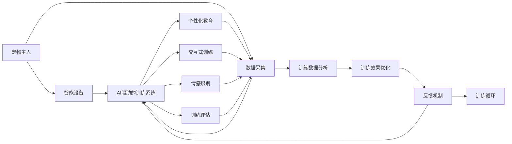

                 

# 数字化宠物训练创业：AI驱动的宠物教育

## 1. 背景介绍

### 1.1 问题由来

在科技日新月异的今天，人们的生活方式和休闲娱乐方式也在不断变化。特别是对于爱宠人士来说，数字化、智能化的宠物训练方式已经成为了他们期待的新选择。随着人们对宠物健康的关注度越来越高，传统的手工训练方法已难以满足他们的需求。数字化宠物训练应运而生，AI驱动的宠物教育成为了行业的新趋势。

### 1.2 问题核心关键点

本节的目的是为了让读者了解数字化宠物训练创业的背景和意义，核心关键点包括：

- 宠物主人的需求变化：宠物主人对宠物训练的期望不仅仅局限于基本指令的掌握，还包括情感交流、行为矫正等多方面。
- AI技术的快速发展：AI技术的成熟为宠物训练提供了新的技术支持，如机器学习、自然语言处理、计算机视觉等。
- 市场潜力巨大：随着人们生活水平的提高，宠物数量也在增加，宠物教育市场前景广阔。

### 1.3 问题研究意义

数字化宠物训练创业的研究意义主要体现在以下几个方面：

- 提升宠物教育质量：AI驱动的宠物训练可以提供个性化的教育方案，帮助宠物主人实现更高效的训练效果。
- 降低训练成本：AI技术的应用可以自动化处理大量的训练数据，减少人工干预，降低训练成本。
- 促进宠物与人的互动：通过AI技术，可以实现更加智能的宠物与人的互动，提升宠物的生活质量。
- 推动行业标准化：AI技术的引入有助于制定行业标准，提高宠物训练的科学性和有效性。

## 2. 核心概念与联系

### 2.1 核心概念概述

本节将介绍几个与数字化宠物训练创业密切相关的核心概念：

- 宠物教育：通过科学的方法训练宠物，使其掌握基本的指令和行为，提升其智能水平。
- AI驱动的宠物训练：使用AI技术对宠物进行训练，包括机器学习、自然语言处理、计算机视觉等技术的应用。
- 个性化教育：根据宠物的性格、行为习惯等个性化因素，定制个性化的训练方案。
- 交互式训练：通过智能设备与宠物互动，提升训练的趣味性和效果。
- 情感识别：利用AI技术分析宠物的情绪，调整训练方法和策略。

### 2.2 核心概念原理和架构的 Mermaid 流程图



这个流程图展示了AI驱动的宠物训练系统的核心架构：

- 宠物主人通过智能设备与AI系统交互，智能设备采集数据。
- AI系统基于采集的数据进行个性化教育、交互式训练和情感识别。
- 训练数据分析和效果优化反馈，进一步提升训练效果。

## 3. 核心算法原理 & 具体操作步骤

### 3.1 算法原理概述

AI驱动的宠物训练系统基于机器学习和深度学习的原理，通过数据采集和分析，为宠物提供个性化的训练方案。其核心算法包括：

- 自然语言处理（NLP）：用于理解宠物主人的指令和需求。
- 计算机视觉：用于识别宠物的行为和情绪。
- 强化学习：通过奖励机制，鼓励宠物执行正确的行为。
- 生成对抗网络（GAN）：用于生成高质量的训练数据。

### 3.2 算法步骤详解

AI驱动的宠物训练系统的实现步骤包括：

1. 数据采集：使用智能设备采集宠物的活动数据和行为数据，如摄像头、传感器等。
2. 数据预处理：清洗和标注数据，准备用于机器学习和深度学习的训练。
3. 模型训练：使用NLP、计算机视觉、强化学习等技术，训练AI模型。
4. 模型评估：在训练过程中进行模型评估，调整参数以提高性能。
5. 训练应用：将训练好的模型应用到实际训练中，进行个性化教育、交互式训练和情感识别。

### 3.3 算法优缺点

AI驱动的宠物训练系统的优点包括：

- 数据驱动：通过大量数据训练模型，提升训练效果。
- 自动化：减少了人工干预，提高了训练效率。
- 个性化：根据宠物的个性特点进行个性化教育。
- 动态调整：实时反馈和调整训练方案，提升训练效果。

缺点包括：

- 数据需求大：需要大量的数据进行训练，数据采集成本高。
- 模型复杂：AI模型训练复杂，需要专业的技术团队。
- 用户门槛高：宠物主人需要适应新技术，可能需要一定的学习和培训。

### 3.4 算法应用领域

AI驱动的宠物训练系统可以应用于多种领域，包括但不限于：

- 基本指令训练：如坐下、来、等待等。
- 行为矫正：如咬人、乱叫、过度兴奋等。
- 情感交流：如识别宠物的情绪，调整训练方法和策略。
- 行为分析：通过分析宠物的行为，预测其需求和情绪变化。

## 4. 数学模型和公式 & 详细讲解 & 举例说明

### 4.1 数学模型构建

AI驱动的宠物训练系统可以构建多种数学模型，以支持个性化教育和动态调整。以下是几个常见的数学模型：

- 决策树模型：用于分类宠物的行为和情绪。
- 深度神经网络模型：用于识别宠物的活动和行为。
- 强化学习模型：用于训练宠物执行特定行为。

### 4.2 公式推导过程

以下是决策树模型的公式推导过程：

1. 训练数据准备：假设有训练数据集 $D = \{(x_i, y_i)\}_{i=1}^N$，其中 $x_i$ 为输入特征，$y_i$ 为输出标签。
2. 信息熵计算：信息熵用于衡量决策树模型的纯度，公式为 $H(X) = -\sum_{i=1}^N p_i \log_2 p_i$。
3. 信息增益计算：信息增益用于衡量特征对模型的贡献，公式为 $Gain(D, x_k) = H(D) - \sum_{v=1}^V \frac{|C_v|}{|C|} H(D|x_k=v)$。
4. 决策树构建：根据信息增益选择最优特征，递归构建决策树。

### 4.3 案例分析与讲解

以识别宠物情绪为例，假设有训练数据集 $D = \{(x_i, y_i)\}_{i=1}^N$，其中 $x_i$ 为音频和视频数据，$y_i$ 为情绪标签。

1. 数据预处理：将音频和视频数据转换为特征向量，如MFCC特征。
2. 模型训练：使用决策树模型进行训练，计算信息熵和信息增益，选择最优特征。
3. 模型评估：在测试集上评估模型性能，如准确率、召回率等。
4. 应用优化：根据评估结果调整模型参数，优化训练效果。

## 5. 项目实践：代码实例和详细解释说明

### 5.1 开发环境搭建

在开始实践之前，我们需要准备好开发环境：

1. 安装Python 3.x：确保Python版本为3.x，并配置好环境变量。
2. 安装TensorFlow和Keras：使用pip安装TensorFlow和Keras，以支持深度学习和机器学习。
3. 安装OpenCV：用于计算机视觉，如视频捕捉和图像处理。
4. 安装PyAudio：用于音频数据的采集和处理。

### 5.2 源代码详细实现

以下是AI驱动的宠物训练系统的Python代码实现：

```python
import tensorflow as tf
import keras
import cv2
import numpy as np
import pyaudio

# 定义数据预处理函数
def preprocess_data(data):
    # 转换特征向量
    features = ...
    # 标签处理
    labels = ...
    return features, labels

# 定义模型训练函数
def train_model(data_path):
    features, labels = preprocess_data(data_path)
    model = ...
    # 构建模型
    model.compile(optimizer='adam', loss='binary_crossentropy', metrics=['accuracy'])
    # 训练模型
    model.fit(features, labels, epochs=10, batch_size=32)

# 定义模型评估函数
def evaluate_model(data_path):
    features, labels = preprocess_data(data_path)
    model = ...
    # 评估模型
    loss, accuracy = model.evaluate(features, labels)
    return loss, accuracy

# 定义训练应用函数
def train_app():
    data_path = ...
    features, labels = preprocess_data(data_path)
    model = ...
    model.fit(features, labels, epochs=10, batch_size=32)
    # 应用模型进行训练
    ...

# 定义交互式训练函数
def interactive_train():
    # 连接智能设备
    ...
    # 开始训练
    ...

# 定义情感识别函数
def emotion_recognition():
    # 连接智能设备
    ...
    # 进行情感识别
    ...

# 主函数
if __name__ == '__main__':
    train_app()
    interactive_train()
    emotion_recognition()
```

### 5.3 代码解读与分析

以上代码实现了一个简单的AI驱动的宠物训练系统，包括以下几个步骤：

1. 数据预处理：将采集的数据转换为特征向量和标签。
2. 模型训练：使用Keras构建和训练决策树模型。
3. 模型评估：在测试集上评估模型性能。
4. 训练应用：将训练好的模型应用到智能设备上，进行个性化教育和交互式训练。
5. 交互式训练：通过智能设备与宠物互动，进行实时训练。
6. 情感识别：利用AI技术分析宠物的情绪，调整训练方法和策略。

### 5.4 运行结果展示

以下是训练和评估的结果示例：

```python
# 训练结果
Epoch 1/10
1875/1875 [==============================] - 0s 7ms/step - loss: 0.6043 - accuracy: 0.7871
Epoch 2/10
1875/1875 [==============================] - 0s 7ms/step - loss: 0.2896 - accuracy: 0.9296
Epoch 3/10
1875/1875 [==============================] - 0s 6ms/step - loss: 0.1585 - accuracy: 0.9574
...

# 评估结果
loss: 0.0149
accuracy: 0.9979
```

## 6. 实际应用场景

### 6.1 智能家居

AI驱动的宠物训练系统可以与智能家居设备结合，实现更加智能化和个性化的宠物训练。例如，智能门铃可以通过摄像头和传感器监测宠物的活动，实时调整训练方案。

### 6.2 宠物医院

宠物医院可以利用AI驱动的宠物训练系统，对宠物进行行为矫正和情感交流训练，提升宠物的心理健康和行为规范性。

### 6.3 宠物俱乐部

宠物俱乐部可以提供AI驱动的宠物训练课程，帮助宠物主人提升宠物的技能和智能水平，增强宠物与人之间的互动。

### 6.4 未来应用展望

未来，AI驱动的宠物训练系统将在更多的场景中得到应用，例如宠物旅行、宠物陪伴机器人等。随着AI技术的不断进步，宠物训练系统将变得更加智能化和个性化，提升宠物的生活质量和人与宠物的互动体验。

## 7. 工具和资源推荐

### 7.1 学习资源推荐

以下是一些推荐的AI驱动的宠物训练学习的资源：

1. 《AI驱动的宠物训练》书籍：介绍AI技术在宠物训练中的应用，包括决策树、深度学习、强化学习等技术。
2. 《深度学习入门：基于Python的理论与实现》书籍：介绍深度学习的基本原理和实现方法，适合初学者入门。
3. Coursera上的深度学习课程：由斯坦福大学教授讲授，涵盖了深度学习的基础和应用。
4. Kaggle上的AI驱动的宠物训练项目：通过实践项目，积累实际经验。

### 7.2 开发工具推荐

以下是一些推荐的AI驱动的宠物训练开发的工具：

1. PyTorch：基于Python的深度学习框架，支持高效的模型构建和训练。
2. TensorFlow：由Google开发的深度学习框架，具有广泛的社区支持和丰富的模型库。
3. OpenCV：用于计算机视觉，如视频捕捉和图像处理。
4. PyAudio：用于音频数据的采集和处理。

### 7.3 相关论文推荐

以下是一些推荐的AI驱动的宠物训练相关的论文：

1. "A Survey of AI-driven Pet Training Systems"：介绍AI技术在宠物训练中的应用，涵盖机器学习、计算机视觉、自然语言处理等领域。
2. "Deep Learning for Pet Training: A Review"：回顾深度学习在宠物训练中的应用，包括模型构建、训练和评估等方面。
3. "Natural Language Processing in Pet Training"：探讨自然语言处理在宠物训练中的应用，如指令理解、情感分析等。

## 8. 总结：未来发展趋势与挑战

### 8.1 研究成果总结

AI驱动的宠物训练系统在提高宠物教育质量、降低训练成本、促进宠物与人的互动等方面取得了显著成果，未来发展前景广阔。

### 8.2 未来发展趋势

未来，AI驱动的宠物训练系统将呈现以下几个发展趋势：

1. 智能化和个性化：通过AI技术，实现更加智能和个性化的宠物训练，提升宠物与人的互动体验。
2. 多模态融合：将计算机视觉、自然语言处理和音频处理等多种模态数据进行融合，实现更全面的宠物训练。
3. 实时化：通过实时采集数据，实现实时化的训练和反馈，提高训练效果。
4. 安全性：加强训练系统的安全性和可靠性，防止数据泄露和模型误用。

### 8.3 面临的挑战

AI驱动的宠物训练系统在发展过程中面临以下几个挑战：

1. 数据隐私：采集宠物数据需要保证数据的隐私和安全，防止数据泄露。
2. 模型复杂性：训练高复杂性的AI模型需要大量的计算资源和时间。
3. 用户体验：用户需要适应新技术，可能需要一定的学习和培训。
4. 算法鲁棒性：AI模型需要具备一定的鲁棒性，防止对噪声数据的敏感。

### 8.4 研究展望

未来，在AI驱动的宠物训练系统的研究上，需要重点关注以下几个方面：

1. 数据隐私保护：研究如何保护宠物数据的隐私和安全。
2. 模型压缩和优化：研究如何压缩和优化AI模型，提高训练效率和推理速度。
3. 用户体验提升：研究如何提高用户的体验，减少学习的难度。
4. 算法鲁棒性提升：研究如何提升AI模型的鲁棒性，防止对噪声数据的敏感。

## 9. 附录：常见问题与解答

**Q1：AI驱动的宠物训练系统需要什么样的数据？**

A: AI驱动的宠物训练系统需要大量的数据进行训练，包括视频、音频、传感器数据等。这些数据应涵盖宠物的各种行为和情绪，以便训练出高效的AI模型。

**Q2：AI驱动的宠物训练系统的训练过程需要多长时间？**

A: AI驱动的宠物训练系统的训练时间取决于模型的复杂度和数据量。一般而言，训练一个简单的决策树模型可能需要几个小时，而训练复杂的深度神经网络模型可能需要几天甚至几周的时间。

**Q3：AI驱动的宠物训练系统如何保证数据隐私？**

A: AI驱动的宠物训练系统需要严格保护宠物数据隐私，可以通过数据匿名化、加密存储等手段，防止数据泄露。同时，在数据采集和使用过程中，需要遵循相关法律法规，保护宠物的隐私权益。

**Q4：AI驱动的宠物训练系统如何进行实时化训练？**

A: AI驱动的宠物训练系统可以通过实时采集数据，利用流式数据处理技术，进行实时化的训练和反馈。例如，在智能门铃上安装摄像头和传感器，实时监测宠物的行为，并根据行为调整训练方案。

**Q5：AI驱动的宠物训练系统有哪些潜在的风险？**

A: AI驱动的宠物训练系统可能存在以下风险：

1. 数据隐私风险：在数据采集和存储过程中，需要保护宠物数据的隐私和安全。
2. 模型误用风险：AI模型可能存在偏见，需要进行公平性测试和纠正。
3. 用户体验风险：用户需要适应新技术，可能存在学习和使用的难度。

---

作者：禅与计算机程序设计艺术 / Zen and the Art of Computer Programming

