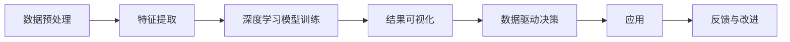

                 

# 数字化直觉增强：AI辅助的第六感开发

> 关键词：直觉增强,数字化转型,人工智能,AI辅助,决策支持,数据驱动

## 1. 背景介绍

### 1.1 问题由来

在信息化时代，数据逐渐成为人类决策的重要参考依据。但数据量庞大、信息过载等现实问题，使得仅凭人工直觉进行决策变得困难重重。例如，在商业决策中，企业高管需要快速从海量数据中筛选出关键信息，形成有效的决策直觉，以便在激烈的市场竞争中抢占先机。然而，如何高效整合和分析复杂多变的数据，并从中提炼出具备指导意义的直觉，成为了一个重大难题。

为解决这一难题，人工智能技术尤其是自然语言处理(NLP)和机器学习算法应运而生。通过对海量数据进行深度学习和智能分析，AI系统能提炼出关键信息，帮助决策者形成直观的直觉，从而做出更高效、更科学的决策。近年来，结合AI技术的数据驱动决策方法，正逐渐成为数字化转型时代的核心工具，为企业和组织带来了前所未有的竞争优势。

### 1.2 问题核心关键点

数字化直觉增强的核心在于通过AI技术对海量数据进行高效整合和智能分析，提炼出对决策有益的关键信息，并转化为具有指导意义的直觉。这一过程包括数据预处理、特征提取、模型训练、结果可视化等多个环节。以下是其中几个核心要点：

1. **数据预处理**：确保数据质量和完整性，去除噪声和冗余，提升模型训练效果。
2. **特征提取**：从原始数据中提取出最具代表性、对决策有用的特征。
3. **模型训练**：基于深度学习等算法，训练出对数据有强大预测能力的模型。
4. **结果可视化**：将模型输出结果以直观的方式呈现，便于决策者理解和应用。

通过以上几个关键点，数字化直觉增强方法可以显著提升决策效率和准确性，帮助企业在快速变化的市场环境中保持竞争优势。

### 1.3 问题研究意义

数字化直觉增强对于提升企业决策效率和质量、推动数字化转型具有重要意义：

1. **提升决策效率**：通过自动化数据分析和提炼，AI技术大幅缩短决策过程，使企业能够更快响应市场变化。
2. **提升决策质量**：AI技术能够准确识别关键信息，减少人为因素对决策的影响，提升决策科学性。
3. **推动数字化转型**：将AI技术应用于决策过程，加速企业向数字化、智能化方向发展，保持行业领先地位。
4. **支持知识传承**：数字化决策系统不仅记录决策过程，还能生成报告和知识库，便于企业内部知识传承和积累。
5. **增强应变能力**：AI系统具有自学习和自适应能力，能帮助企业迅速应对突发事件，提升危机应对能力。

## 2. 核心概念与联系

### 2.1 核心概念概述

为更好地理解数字化直觉增强的原理和应用，本节将介绍几个关键概念及其相互联系：

- **数据预处理**：对原始数据进行清洗、转换和归一化，使其具备高质量和一致性。
- **特征提取**：从原始数据中提炼出最有信息量的特征，为模型训练提供重要输入。
- **深度学习模型**：以神经网络为核心的学习算法，能够对数据进行非线性映射和复杂关系建模。
- **数据驱动决策**：基于数据和模型预测结果进行决策，而非单纯依赖主观直觉或经验。
- **结果可视化**：将模型输出结果以图表、报告等形式展示，使决策者易于理解和应用。

这些概念之间存在密切联系，共同构成数字化直觉增强的完整框架。数据预处理和特征提取为模型训练提供高质量输入，深度学习模型则对输入数据进行智能分析和预测，最终通过结果可视化将预测结果转化为直观的直觉，辅助决策者进行决策。

### 2.2 核心概念原理和架构的 Mermaid 流程图



该流程图展示了数字化直觉增强的主要流程。从数据预处理开始，通过特征提取和深度学习模型训练，得到预测结果。这些结果经过结果可视化，形成直观的直觉，辅助决策者进行决策。同时，根据决策结果和反馈，可以进一步改进模型和优化数据处理流程，实现持续改进。

## 3. 核心算法原理 & 具体操作步骤
### 3.1 算法原理概述

数字化直觉增强的核心算法是深度学习模型，特别是以神经网络为核心的模型。深度学习模型能够对非线性、高维度数据进行高效处理和预测，从而帮助决策者提炼出有价值的直觉。

### 3.2 算法步骤详解

数字化直觉增强的步骤主要包括数据预处理、特征提取、模型训练和结果可视化四个环节。以下详细介绍每个环节的详细步骤：

#### 数据预处理

1. **数据清洗**：去除缺失值、重复数据和异常值，保证数据质量。
2. **数据转换**：将数据转换为模型可以接受的格式，如将文本数据转化为向量。
3. **数据归一化**：将数据缩放到0-1之间或均值为0、方差为1的标准正态分布中，提升模型训练效果。

#### 特征提取

1. **特征选择**：选择与决策目标最相关的特征，去除冗余信息。
2. **特征提取方法**：使用TF-IDF、Word2Vec、BERT等技术，从文本中提取语义、情感、主题等特征。
3. **特征转换**：对特征进行降维、标准化等处理，提升模型训练效率。

#### 模型训练

1. **选择模型**：根据任务类型选择合适的深度学习模型，如线性回归、逻辑回归、卷积神经网络(CNN)、循环神经网络(RNN)、Transformer等。
2. **设置超参数**：调整学习率、批量大小、迭代次数等参数，优化模型性能。
3. **训练模型**：使用训练集数据进行模型训练，调整模型参数。

#### 结果可视化

1. **选择可视化工具**：使用Matplotlib、Seaborn、Tableau等工具，将模型输出结果进行可视化。
2. **数据展示**：将关键数据点、趋势线、热力图等展示在图表中，便于决策者理解。
3. **报告生成**：生成详细报告，记录数据来源、模型训练过程、预测结果等，方便后续参考和回顾。

### 3.3 算法优缺点

数字化直觉增强的优点包括：

1. **高效性**：AI技术能快速处理和分析海量数据，提升决策效率。
2. **准确性**：深度学习模型对数据具有强大的预测能力，提升决策质量。
3. **可扩展性**：算法可以应用于多种类型的决策问题，具备良好的泛化能力。
4. **自动化程度高**：通过自动化处理和模型训练，减少人为干预，降低出错率。

但其缺点也不容忽视：

1. **数据依赖性强**：模型效果高度依赖于数据质量，数据偏差可能影响结果。
2. **算法复杂度高**：深度学习模型训练过程复杂，需要大量计算资源。
3. **模型黑盒问题**：深度学习模型往往是"黑盒"，决策过程难以解释和调试。
4. **高成本投入**：高质量的数据和计算资源投入是必须条件，企业需承担较高成本。

### 3.4 算法应用领域

数字化直觉增强方法广泛应用于多个领域，包括但不限于：

- **商业决策**：评估市场趋势、客户行为、竞争策略等。
- **金融分析**：预测股票走势、评估投资风险、进行风险管理。
- **医疗诊断**：辅助诊断疾病、评估治疗效果、预测患者健康风险。
- **供应链管理**：优化库存管理、预测市场需求、提升供应链效率。
- **客户服务**：提升客户满意度、优化客户体验、提高客户忠诚度。

## 4. 数学模型和公式 & 详细讲解 & 举例说明

### 4.1 数学模型构建

以一个简单的线性回归模型为例，进行数字化直觉增强的数学模型构建：

假设原始数据集为 $D=\{(x_i, y_i)\}_{i=1}^N$，其中 $x_i$ 为特征向量，$y_i$ 为目标变量。线性回归模型为：

$$
y = \theta_0 + \theta_1 x_1 + \cdots + \theta_n x_n + \epsilon
$$

其中，$\theta_j$ 为模型参数，$\epsilon$ 为误差项，$j=0,1,\cdots,n$。

### 4.2 公式推导过程

线性回归模型的训练过程，通过最小化损失函数来实现：

$$
\hat{\theta} = \mathop{\arg\min}_{\theta} \sum_{i=1}^N (y_i - \theta_0 - \sum_{j=1}^n \theta_j x_{ij})^2
$$

根据梯度下降算法，模型参数的更新公式为：

$$
\theta_j = \theta_j - \frac{\alpha}{N} \sum_{i=1}^N (y_i - \hat{y}_i) x_{ij}
$$

其中 $\alpha$ 为学习率。

### 4.3 案例分析与讲解

假设某企业希望通过数据分析预测下一季度的销售额。企业收集了过去5年的销售数据和市场环境数据，包括气温、节假日、促销活动等。通过数据预处理和特征提取，得到模型输入特征向量 $x$ 和目标变量 $y$。

1. **数据预处理**：去除缺失值，将数据标准化到0-1之间。
2. **特征提取**：从历史销售数据中提取平均销售额、销售增长率、季节性因素等特征。
3. **模型训练**：使用线性回归模型进行训练，调整模型参数，得到最优参数 $\hat{\theta}$。
4. **结果可视化**：将模型预测结果绘制成趋势图，展示未来季度销售额的预测值。

通过数字化直觉增强，企业能够更准确地预测销售趋势，优化库存和促销策略，提升市场竞争力。

## 5. 项目实践：代码实例和详细解释说明
### 5.1 开发环境搭建

为实现数字化直觉增强，需要一个完备的开发环境。以下是Python开发环境配置步骤：

1. **安装Anaconda**：从官网下载并安装Anaconda，用于创建独立的Python环境。
2. **创建虚拟环境**：
```bash
conda create -n AI_env python=3.8
conda activate AI_env
```
3. **安装相关库**：
```bash
conda install pandas numpy scikit-learn matplotlib seaborn joblib tqdm pyaml
```

### 5.2 源代码详细实现

以下是一个简单的线性回归模型的Python代码实现：

```python
import pandas as pd
import numpy as np
from sklearn.model_selection import train_test_split
from sklearn.linear_model import LinearRegression
import matplotlib.pyplot as plt

# 数据读取和处理
df = pd.read_csv('sales_data.csv')
X = df.drop('sales', axis=1).values
y = df['sales'].values
X_train, X_test, y_train, y_test = train_test_split(X, y, test_size=0.2, random_state=42)

# 模型训练
model = LinearRegression()
model.fit(X_train, y_train)

# 模型预测和结果可视化
y_pred = model.predict(X_test)
plt.plot(y_test, label='Actual')
plt.plot(y_pred, label='Predicted')
plt.legend()
plt.show()
```

### 5.3 代码解读与分析

该代码实现了线性回归模型的训练和预测，并使用Matplotlib进行结果可视化。

**数据读取和处理**：
- 使用Pandas读取CSV格式的数据文件。
- 将数据分为特征向量 $X$ 和目标变量 $y$。
- 使用train_test_split将数据集分为训练集和测试集。

**模型训练**：
- 创建LinearRegression模型实例。
- 使用训练集数据拟合模型。

**模型预测和结果可视化**：
- 使用模型对测试集进行预测。
- 使用Matplotlib绘制预测结果和实际结果的对比图。

通过代码实现，可以直观理解线性回归模型的训练和预测过程，并生成可视化结果。

### 5.4 运行结果展示

运行上述代码后，将生成一个图表，展示预测值和实际值的对比。图表中应包括两条曲线，一条为实际销售数据，另一条为模型预测的销售数据。

## 6. 实际应用场景
### 6.1 智能推荐系统

数字化直觉增强技术在智能推荐系统中有着广泛应用。电商平台通过分析用户历史行为数据，预测用户偏好，为用户推荐个性化的商品。

1. **数据预处理**：从用户行为数据中提取关键特征，如浏览次数、购买记录、评分等。
2. **特征提取**：使用协同过滤、TF-IDF等方法，从用户和商品数据中提取相似度特征。
3. **模型训练**：使用协同过滤、矩阵分解等方法，训练推荐模型。
4. **结果可视化**：将推荐结果展示在用户界面，生成推荐列表和热力图。

通过数字化直觉增强，智能推荐系统能够高效预测用户偏好，提升推荐效果，提高用户满意度和销售额。

### 6.2 风险预警系统

金融行业通过数字化直觉增强技术，实时监测市场风险，及时预警潜在风险。

1. **数据预处理**：收集市场交易数据、舆情信息、财务报告等数据。
2. **特征提取**：提取市场波动率、新闻情绪、财务指标等特征。
3. **模型训练**：使用深度学习模型，训练风险预警模型。
4. **结果可视化**：将模型预测的风险值展示在仪表盘上，生成风险预警报告。

通过数字化直觉增强，金融风险预警系统能够及时发现市场异常，降低风险损失，保障投资者利益。

### 6.3 医疗诊断系统

医疗行业通过数字化直觉增强技术，辅助医生进行疾病诊断和预测。

1. **数据预处理**：收集患者病历、实验室检查结果、影像数据等数据。
2. **特征提取**：提取病情描述、影像特征、病理指标等特征。
3. **模型训练**：使用深度学习模型，训练疾病诊断和预测模型。
4. **结果可视化**：将模型预测结果展示在医生界面，生成诊断报告。

通过数字化直觉增强，医疗诊断系统能够提高疾病诊断的准确性和效率，帮助医生制定更科学的诊疗方案。

## 7. 工具和资源推荐
### 7.1 学习资源推荐

为帮助开发者深入理解数字化直觉增强，以下推荐一些学习资源：

1. **《深度学习》书籍**：Ian Goodfellow、Yoshua Bengio、Aaron Courville合著的经典教材，全面介绍了深度学习的基本原理和应用。
2. **《Python数据科学手册》**：Jake VanderPlas撰写的实用指南，涵盖Pandas、Numpy、Matplotlib等数据科学工具的使用。
3. **Coursera《深度学习》课程**：Andrew Ng主讲的深度学习入门课程，系统讲解深度学习的基础知识和实践技巧。
4. **Kaggle数据科学竞赛平台**：参与实际数据科学项目，提升实战经验，获取行业数据和案例分析。
5. **GitHub开源项目**：GitHub上丰富的开源项目，涵盖数据处理、模型训练、结果可视化等多个环节，供学习和参考。

通过这些资源的学习和实践，相信你能够深入掌握数字化直觉增强技术，并将其应用于实际问题中。

### 7.2 开发工具推荐

以下是几款用于数字化直觉增强开发的常用工具：

1. **PyTorch**：由Facebook开源的深度学习框架，支持动态计算图，适用于研究和大规模模型训练。
2. **TensorFlow**：由Google开发的深度学习框架，生产部署方便，适合工业级应用。
3. **Keras**：高层次API，易于上手，支持多种深度学习模型。
4. **Pandas**：数据分析库，支持数据预处理和特征提取。
5. **Matplotlib**：数据可视化库，支持生成多种图表。
6. **Seaborn**：基于Matplotlib的高级可视化库，支持更丰富的统计图表。
7. **Tableau**：商业智能工具，支持复杂数据可视化和仪表盘设计。

这些工具能够显著提升数字化直觉增强的开发效率和结果可视化效果。

### 7.3 相关论文推荐

为深入理解数字化直觉增强的最新进展，以下推荐几篇相关论文：

1. **《A Survey of Decision Making and Risk Management with Big Data》**：Jerry Guo等，介绍了大数据在决策和风险管理中的应用。
2. **《Machine Learning for Healthcare》**：John D. Storey等，介绍了机器学习在医疗领域的应用，包括疾病预测和诊断。
3. **《A Survey on Personalized Recommendation Systems》**：Tian Deng等，总结了个性化推荐系统的最新研究进展。
4. **《Adversarial Machine Learning》**：Nicolas Carlini等，介绍了对抗机器学习的概念和应用，提高模型的鲁棒性。
5. **《Deep Learning for Unsupervised Learning》**：Ian Goodfellow等，介绍了深度学习在无监督学习中的应用，拓展了数字化直觉增强的技术边界。

这些论文能够帮助你全面了解数字化直觉增强的最新理论和实践。

## 8. 总结：未来发展趋势与挑战
### 8.1 总结

数字化直觉增强技术在提升决策效率和质量方面具有重要意义。通过深度学习模型对海量数据进行高效分析和提炼，帮助决策者形成直观的直觉，从而做出更科学、更高效的决策。本文详细介绍了数字化直觉增强的核心概念、算法原理、操作步骤以及实际应用场景，给出了具体的代码实例和结果展示，并通过丰富的学习资源和开发工具推荐，为读者提供了全面的技术指引。

### 8.2 未来发展趋势

数字化直觉增强技术将随着深度学习模型的不断发展，呈现以下几个趋势：

1. **模型规模增大**：随着算力提升和数据积累，深度学习模型将具有更强大的表达能力和泛化能力，提升直觉增强的效果。
2. **多模态融合**：结合图像、视频、音频等多模态数据，拓展直觉增强的应用场景和效果。
3. **自适应学习**：利用自适应算法和持续学习机制，提升模型对数据变化的快速适应能力。
4. **边缘计算**：在数据源端进行初步分析和处理，减少数据传输和计算开销，提升响应速度。
5. **联邦学习**：分布式训练模型，保护数据隐私，提升模型泛化能力。
6. **跨领域迁移**：在多个领域间共享模型和知识，提升直觉增强的通用性。

### 8.3 面临的挑战

尽管数字化直觉增强技术发展迅速，但在实际应用中仍面临一些挑战：

1. **数据质量和多样性**：数据质量和多样性直接影响到模型的效果，需要持续收集和标注高质量数据。
2. **模型复杂性**：深度学习模型结构复杂，需要大量计算资源和专业技能进行训练和优化。
3. **模型可解释性**：深度学习模型往往是"黑盒"，难以解释其内部决策过程，影响决策的可信度。
4. **安全性和隐私保护**：数据隐私和模型安全是重要问题，需要采用加密和匿名化等技术进行保护。
5. **跨领域应用**：在多个领域间进行模型迁移和知识共享，需要处理领域差异和数据不一致问题。

### 8.4 研究展望

未来的数字化直觉增强技术需要在以下几个方面进行探索和突破：

1. **增强模型可解释性**：引入可解释性技术，如模型蒸馏、注意力机制等，提升模型决策过程的可理解性和可信度。
2. **提升模型泛化能力**：通过跨领域迁移学习、自适应学习等方法，提升模型的泛化能力和适应性。
3. **优化模型训练效率**：利用分布式训练、混合精度训练等技术，提升模型训练速度和效率。
4. **加强数据隐私保护**：采用差分隐私、联邦学习等技术，保障数据隐私和安全。
5. **开发通用智能算法**：结合知识图谱、逻辑推理等技术，开发具备通用智能的直觉增强算法。

通过持续创新和探索，数字化直觉增强技术必将进一步提升决策效率和质量，推动数字化转型，为社会带来更深远的影响。

## 9. 附录：常见问题与解答

**Q1：如何选择合适的特征提取方法？**

A: 特征提取方法应根据数据类型和任务需求进行选择。例如，对于文本数据，可以使用TF-IDF、Word2Vec、BERT等方法提取语义和情感特征。对于图像数据，可以使用CNN提取图像特征。对于时序数据，可以使用RNN、LSTM等模型提取序列特征。

**Q2：深度学习模型是否需要大量的标注数据？**

A: 深度学习模型训练通常需要大量的标注数据，但通过迁移学习和自监督学习技术，可以在一定程度上降低对标注数据的依赖。例如，使用无监督预训练模型作为初始化，对特定任务进行微调。

**Q3：如何提高模型训练效率？**

A: 提高模型训练效率可以从多个方面入手：使用分布式训练、混合精度训练、模型并行、数据增强等方法，优化训练过程。同时，选择合适的优化器和超参数，如AdamW、SGD、学习率等，提升训练效果。

**Q4：如何评估数字化直觉增强的效果？**

A: 评估数字化直觉增强的效果通常通过以下指标进行衡量：精度、召回率、F1-score、AUC等，用于评估模型的预测性能。同时，通过实际应用中的效果反馈和用户满意度，进一步验证模型的实用性和效果。

**Q5：如何处理模型过拟合问题？**

A: 处理模型过拟合问题可以通过以下方法进行：增加训练数据、使用正则化技术、调整模型复杂度、优化损失函数等。同时，采用对抗训练和数据增强等方法，提升模型的泛化能力和鲁棒性。

通过这些问题的解答，相信你能够更全面地理解数字化直觉增强技术的实现细节和应用效果，为实际应用提供指导。

