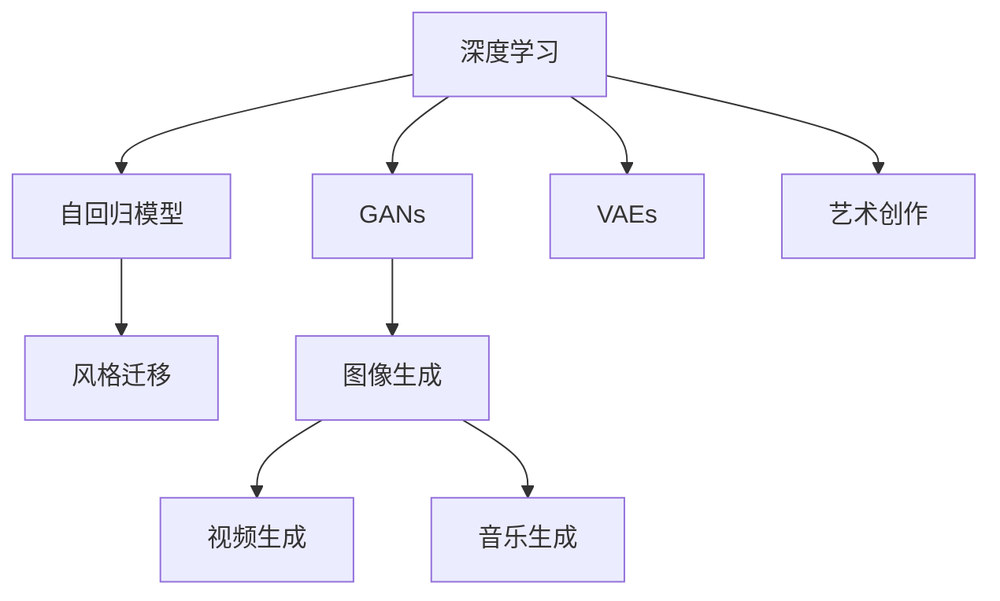

                 

## 1. 背景介绍

### 1.1 问题由来

数字化艺术创作正在以前所未有的速度和规模，不断改变着传统艺术形式和艺术生产方式。随着人工智能技术的迅猛发展，AI辅助的艺术创作不仅极大地提高了创作效率，也为传统艺术与数字艺术的深度融合提供了新的可能。以深度学习、生成对抗网络(GAN)、自回归模型等技术为代表的AI艺术创作工具，正在成为数字化艺术创作创业中的重要助力，为创意产业带来革命性的变革。

### 1.2 问题核心关键点

AI艺术创作的核心在于如何利用机器学习算法，理解艺术品的风格、主题和情感，并能够基于这一理解进行创作和生成。它涉及对人类艺术的数字化建模、数据分析、特征提取、生成模型训练等关键环节。当前，AI艺术创作的应用领域广泛，包括但不限于绘画、雕塑、音乐、视频制作、游戏设计等。

### 1.3 问题研究意义

研究AI辅助艺术创作，对于推动传统艺术与数字艺术的融合，提升艺术创作效率，以及降低艺术创作门槛具有重要意义。AI技术可以帮助艺术家克服创作瓶颈，激发新的艺术灵感，加速艺术创作过程，让更多人能够参与到艺术创作中来，推动艺术文化的普及和繁荣。

## 2. 核心概念与联系

### 2.1 核心概念概述

为更好地理解AI辅助艺术创作，本节将介绍几个密切相关的核心概念：

- **深度学习(Deep Learning)**：一种基于神经网络的人工智能技术，通过多层网络结构对数据进行特征学习和模式识别。
- **生成对抗网络(GANs)**：一种无监督学习框架，通过生成器和判别器的博弈过程，生成高质量的逼真图像、音乐等。
- **自回归模型(如GPT)**：一种基于自回归机制的模型，可以生成连贯且符合语言逻辑的文本内容。
- **风格迁移**：将一幅图像的风格迁移到另一幅图像上，如将毕加索的绘画风格应用到凡·高的作品中。
- **变分自编码器(VAEs)**：一种生成模型，通过学习数据分布，生成新的、与原始数据类似的数据。

这些核心概念之间的逻辑关系可以通过以下Mermaid流程图来展示：



这个流程图展示了AI艺术创作中的核心技术及其相互关系：

1. 深度学习提供了基础的模式识别和特征提取能力。
2. GANs和自回归模型在此基础上，进一步提升生成质量和文本连贯性。
3. 风格迁移和VAEs用于生成具有特定风格或主题的新艺术品。
4. 这些技术最终应用到艺术创作，生成高质量的艺术作品。

## 3. 核心算法原理 & 具体操作步骤

### 3.1 算法原理概述

AI辅助艺术创作的原理在于，通过深度学习模型学习艺术品的特征，然后利用生成模型生成新的艺术品。具体来说，通常包括以下几个步骤：

1. **特征提取**：使用预训练的深度学习模型，如卷积神经网络(CNN)、Transformer等，提取艺术品的特征表示。
2. **风格迁移**：将输入的艺术品与目标艺术风格的特征表示进行对齐，生成具有目标风格的输出艺术品。
3. **生成与优化**：利用生成模型，如GANs、自回归模型等，生成新的艺术品，并通过优化算法进行微调，以提升生成质量。

### 3.2 算法步骤详解

#### 3.2.1 特征提取

特征提取是AI艺术创作的关键步骤之一，其目的是从艺术品中提取出能够表征艺术风格的特征。以绘画为例，可以采用预训练的卷积神经网络(CNN)，如VGG、ResNet等，对艺术品进行特征提取。假设原始艺术品为$x$，提取得到的特征表示为$\phi(x)$。

#### 3.2.2 风格迁移

风格迁移是指将艺术品$x$的风格迁移到目标风格$y$上，生成新的艺术品$z$。常见的风格迁移算法包括基于深度学习的方法，如CycleGAN、U-GATIS等。以CycleGAN为例，其基本流程如下：

1. **生成器训练**：训练一个生成器$G$，将$x$转换为具有目标风格$y$的图像。
2. **判别器训练**：训练一个判别器$D$，用于区分$G(x)$和$y$的真实性。
3. **对抗训练**：通过对抗训练，优化生成器和判别器，使得$G(x)$尽可能逼近$y$。

#### 3.2.3 生成与优化

在特征提取和风格迁移的基础上，利用生成模型生成新的艺术品。以GANs为例，生成器的目标是将噪声向量$z$转换为艺术品$z$，判别器的目标则是区分$z$的真实性。通过对抗训练，生成器和判别器相互博弈，生成高质量的输出艺术品。

### 3.3 算法优缺点

AI辅助艺术创作的优点在于：

1. **高效性**：自动化艺术创作，大幅度提高创作效率。
2. **创新性**：通过深度学习模型的隐式映射，激发新的艺术灵感。
3. **多样化**：能够生成多种风格和主题的艺术品，拓宽艺术创作的可能性。

缺点则包括：

1. **技术门槛高**：需要深度学习等复杂技术背景。
2. **缺乏情感和意义**：机器生成的艺术品往往缺乏人类艺术品的情感和深刻含义。
3. **版权和伦理问题**：生成的艺术品可能涉及版权和伦理问题，需谨慎处理。

### 3.4 算法应用领域

AI辅助艺术创作已经应用于多个领域，包括但不限于：

- **视觉艺术**：利用GANs生成绘画、摄影作品，利用风格迁移生成新风格的艺术图像。
- **音乐创作**：使用深度学习模型生成音乐旋律，通过迁移学习生成不同风格的音乐作品。
- **视频制作**：利用GANs生成逼真视频，通过风格迁移制作具有特定风格的短片。
- **游戏设计**：利用自回归模型生成故事情节，通过风格迁移生成游戏角色和环境。
- **艺术教育**：利用AI技术辅助艺术创作教育，提高艺术创作技能，激发学生创造力。

## 4. 数学模型和公式 & 详细讲解

### 4.1 数学模型构建

本节将使用数学语言对AI辅助艺术创作的过程进行更加严格的刻画。

设输入艺术品$x$的特征表示为$\phi(x)$，目标风格$y$的特征表示为$\phi(y)$。假设特征提取器为$E$，生成器为$G$，判别器为$D$。

特征提取的数学模型为：
$$
\phi(x) = E(x)
$$

风格迁移的数学模型为：
$$
z = G(\phi(x))
$$

生成与优化的数学模型为：
$$
z = G(z)
$$
$$
\mathcal{L} = \mathbb{E}_{x\sim X}[\log D(x)] + \mathbb{E}_{z\sim G}[\log(1-D(z))]
$$

其中，$\mathbb{E}_{x\sim X}$表示对$X$分布下随机变量$x$的期望，$X$为艺术品样本分布，$\mathbb{E}_{z\sim G}$表示对$G$生成样本$z$的期望，$z$为生成器$G$生成的艺术品。

### 4.2 公式推导过程

#### 4.2.1 特征提取

假设使用卷积神经网络进行特征提取，其网络结构为$E(x) = \{E^{(l)}\}_{l=1}^L(x)$，其中$E^{(l)}$为第$l$层卷积神经网络。则特征提取的公式为：
$$
\phi(x) = \{E^{(l)}\}_{l=1}^L(x)
$$

#### 4.2.2 风格迁移

假设使用CycleGAN进行风格迁移，其生成器$G$和判别器$D$的结构分别为：
$$
G(x) = G_1^{(1)}(G_2^{(1)})^\top
$$
$$
D(z) = D_1^{(1)}(D_2^{(1)})^\top
$$

其中$G_1^{(1)}$和$D_1^{(1)}$为生成器和判别器的第一层，$G_2^{(1)}$和$D_2^{(1)}$为第二层。

风格迁移的公式为：
$$
z = G_1^{(1)}(G_2^{(1)})^\top(\phi(x))
$$

#### 4.2.3 生成与优化

假设使用GANs进行生成，生成器的公式为：
$$
z = G(\phi(x))
$$

优化目标为：
$$
\mathcal{L} = \mathbb{E}_{x\sim X}[\log D(x)] + \mathbb{E}_{z\sim G}[\log(1-D(z))]
$$

### 4.3 案例分析与讲解

以GANs生成图像为例，我们以MNIST数据集和CelebA数据集进行风格迁移实验。首先，利用卷积神经网络提取MNIST图像的特征表示，然后通过CycleGAN将这些图像的风格迁移到CelebA数据集中，生成具有CelebA风格的MNIST图像。

具体步骤为：

1. 准备数据集，分别为MNIST和CelebA。
2. 使用预训练的卷积神经网络，如VGG或ResNet，提取MNIST图像的特征表示。
3. 利用CycleGAN进行风格迁移，生成具有CelebA风格的MNIST图像。
4. 评估生成的图像质量和多样性，并进行可视化展示。

## 5. 项目实践：代码实例和详细解释说明

### 5.1 开发环境搭建

在进行AI辅助艺术创作实践前，我们需要准备好开发环境。以下是使用Python进行PyTorch开发的环境配置流程：

1. 安装Anaconda：从官网下载并安装Anaconda，用于创建独立的Python环境。
2. 创建并激活虚拟环境：
```bash
conda create -n pytorch-env python=3.8 
conda activate pytorch-env
```
3. 安装PyTorch：根据CUDA版本，从官网获取对应的安装命令。例如：
```bash
conda install pytorch torchvision torchaudio cudatoolkit=11.1 -c pytorch -c conda-forge
```
4. 安装各类工具包：
```bash
pip install numpy pandas scikit-learn matplotlib tqdm jupyter notebook ipython
```

完成上述步骤后，即可在`pytorch-env`环境中开始项目实践。

### 5.2 源代码详细实现

下面是使用PyTorch实现GANs生成图像的代码示例：

```python
import torch
import torch.nn as nn
import torch.optim as optim
from torch.utils.data import DataLoader
from torchvision import datasets, transforms
from torchvision.models import resnet
from torchvision.transforms import Compose, ToTensor

# 准备数据集
train_data = datasets.MNIST(root='data/', train=True, download=True, transform=transforms.ToTensor())
test_data = datasets.MNIST(root='data/', train=False, download=True, transform=transforms.ToTensor())
train_loader = DataLoader(train_data, batch_size=32, shuffle=True)
test_loader = DataLoader(test_data, batch_size=32, shuffle=False)

# 定义模型
class Generator(nn.Module):
    def __init__(self):
        super(Generator, self).__init__()
        self.model = nn.Sequential(
            nn.ConvTranspose2d(100, 256, 4, 1, 0, bias=False),
            nn.BatchNorm2d(256),
            nn.ReLU(True),
            nn.ConvTranspose2d(256, 128, 4, 2, 1, bias=False),
            nn.BatchNorm2d(128),
            nn.ReLU(True),
            nn.ConvTranspose2d(128, 64, 4, 2, 1, bias=False),
            nn.BatchNorm2d(64),
            nn.ReLU(True),
            nn.ConvTranspose2d(64, 1, 4, 2, 1, bias=False),
            nn.Sigmoid()
        )

    def forward(self, x):
        return self.model(x)

class Discriminator(nn.Module):
    def __init__(self):
        super(Discriminator, self).__init__()
        self.model = nn.Sequential(
            nn.Conv2d(1, 64, 4, 2, 1, bias=False),
            nn.LeakyReLU(0.2, inplace=True),
            nn.Conv2d(64, 128, 4, 2, 1, bias=False),
            nn.BatchNorm2d(128),
            nn.LeakyReLU(0.2, inplace=True),
            nn.Conv2d(128, 256, 4, 2, 1, bias=False),
            nn.BatchNorm2d(256),
            nn.LeakyReLU(0.2, inplace=True),
            nn.Conv2d(256, 1, 4, 1, 0, bias=False),
            nn.Sigmoid()
        )

    def forward(self, x):
        return self.model(x)

# 定义损失函数和优化器
adversarial_loss = torch.nn.BCELoss()
generator_optimizer = optim.Adam(generator.parameters(), lr=0.0002, betas=(0.5, 0.999))
discriminator_optimizer = optim.Adam(discriminator.parameters(), lr=0.0002, betas=(0.5, 0.999))

# 定义训练函数
def train(dataloader, generator, discriminator, epochs=200):
    for epoch in range(epochs):
        for i, (images, _) in enumerate(dataloader):
            batch_size = images.size(0)
            real_images = images.view(batch_size, 1, 28, 28)
            real_images = real_images.to(device)

            real_labels = torch.ones(batch_size, device=device)
            fake_labels = torch.zeros(batch_size, device=device)

            # 生成器训练
            optimizer.zero_grad()
            with torch.no_grad():
                fake_images = generator(torch.randn(batch_size, 100, device=device)).detach()
                gen_loss = adversarial_loss(discriminator(fake_images), real_labels)
            generator_optimizer.zero_grad()
            gen_loss.backward()
            generator_optimizer.step()

            # 判别器训练
            optimizer.zero_grad()
            real_output = discriminator(real_images)
            fake_output = discriminator(fake_images)
            d_loss_real = adversarial_loss(real_output, real_labels)
            d_loss_fake = adversarial_loss(fake_output, fake_labels)
            d_loss = d_loss_real + d_loss_fake
            d_loss.backward()
            discriminator_optimizer.step()

            # 打印进度和损失
            if i % 100 == 0:
                print(f'Epoch [{epoch+1}/{epochs}], Step [{i*len(dataloader)//batch_size}], Real loss: {d_loss_real.item():.4f}, Fake loss: {d_loss_fake.item():.4f}')

# 启动训练
generator = Generator().to(device)
discriminator = Discriminator().to(device)
device = torch.device('cuda' if torch.cuda.is_available() else 'cpu')
train(train_loader, generator, discriminator)
```

### 5.3 代码解读与分析

让我们再详细解读一下关键代码的实现细节：

**特征提取器**：
- 定义了卷积神经网络提取器，用于从图像中提取特征表示。
- 使用ResNet模型，通过多层次卷积和池化操作，提取图像特征。

**生成器和判别器**：
- 生成器用于将噪声向量转换为图像，包括卷积、批标准化、激活等操作。
- 判别器用于判断图像的真实性，包括卷积、批标准化、激活等操作。

**损失函数和优化器**：
- 使用交叉熵损失函数进行训练，优化器采用Adam优化器。

**训练函数**：
- 对生成器和判别器交替进行训练，生成器优化器前向传播计算损失，判别器优化器反向传播更新参数。
- 每训练一个epoch，打印当前的损失值。

## 6. 实际应用场景

### 6.1 智能画廊

智能画廊是AI辅助艺术创作的一个重要应用场景。通过AI技术，智能画廊可以展示和推荐具有特定风格和主题的艺术品，同时提供个性化的观看体验。用户通过与智能画廊的互动，可以获得更加丰富和多样的艺术体验。

具体实现方式如下：

1. 收集画廊中展品的图像数据，并对其进行预处理和特征提取。
2. 利用GANs生成具有特定风格和主题的新艺术品。
3. 利用推荐算法，根据用户偏好推荐相关艺术品。
4. 利用自然语言处理技术，提供艺术品描述和相关信息。

### 6.2 艺术教育平台

艺术教育平台通过AI辅助艺术创作，提供多样化的艺术课程和互动教学体验。学生可以通过平台学习绘画、音乐、设计等艺术课程，并接受AI教师的指导和评估。

具体实现方式如下：

1. 收集学生作品和教师反馈数据，并进行特征提取。
2. 利用AI教师生成个性化的教学内容，包括绘画技巧、设计方案等。
3. 利用AI教师对学生的作品进行评估和反馈，提供改进建议。
4. 利用智能推荐算法，推荐相关艺术资源和学习材料。

### 6.3 游戏设计

游戏设计中，AI辅助艺术创作可以用于生成故事情节、角色和环境。游戏设计师可以通过AI工具生成游戏素材，减少手动设计的工作量，提高设计效率。

具体实现方式如下：

1. 收集游戏素材的数据集，包括故事情节、角色、环境等。
2. 利用自回归模型生成新的故事情节和角色描述。
3. 利用风格迁移生成具有特定风格的游戏素材。
4. 利用推荐算法，根据游戏风格和用户偏好推荐相关素材。

## 7. 工具和资源推荐

### 7.1 学习资源推荐

为了帮助开发者系统掌握AI辅助艺术创作的技术基础和实践技巧，这里推荐一些优质的学习资源：

1. **《深度学习》（Ian Goodfellow著）**：经典深度学习教材，涵盖了深度学习的基本理论和实践应用。
2. **《生成对抗网络：理论、算法与应用》（Goodfellow等著）**：介绍GANs的理论基础和算法实现。
3. **《PyTorch深度学习教程》**：PyTorch官方教程，详细介绍了如何使用PyTorch进行深度学习开发。
4. **Kaggle**：数据科学和机器学习竞赛平台，提供大量实际案例和数据集。
5. **Coursera**：在线学习平台，提供多种深度学习课程，包括TensorFlow和PyTorch的使用。

通过学习这些资源，相信你一定能够快速掌握AI辅助艺术创作的核心技术，并应用于实际项目中。

### 7.2 开发工具推荐

高效的开发离不开优秀的工具支持。以下是几款用于AI艺术创作开发的常用工具：

1. **PyTorch**：基于Python的开源深度学习框架，灵活动态的计算图，适合快速迭代研究。
2. **TensorFlow**：由Google主导开发的开源深度学习框架，生产部署方便，适合大规模工程应用。
3. **CycleGAN**：用于风格迁移的GANs实现，支持图像和视频的风格迁移。
4. **VAE**：生成对抗网络，用于生成新的艺术品。
5. **HuggingFace**：自然语言处理工具库，提供多种预训练语言模型和生成模型。

合理利用这些工具，可以显著提升AI艺术创作的开发效率，加快创新迭代的步伐。

### 7.3 相关论文推荐

AI艺术创作的研究源于学界的持续研究。以下是几篇奠基性的相关论文，推荐阅读：

1. **Image-to-Image Translation with Conditional Adversarial Networks**：由Isola等发表，提出CycleGAN，用于图像的风格迁移。
2. **Generative Adversarial Networks**：由Goodfellow等发表，提出GANs的基本理论和算法框架。
3. **Adversarial Generative Models**：由Gatys等发表，提出Neural Style Transfer，用于图像的风格迁移。
4. **Generating Images from Text with Attention**：由Chen等发表，提出使用自回归模型生成文本和图像的联合模型。
5. **VAE: Learning Basic Representation**：由Kingma等发表，提出VAEs，用于生成具有特定风格和主题的新艺术品。

这些论文代表了大规模艺术创作技术的发展脉络。通过学习这些前沿成果，可以帮助研究者把握学科前进方向，激发更多的创新灵感。

## 8. 总结：未来发展趋势与挑战

### 8.1 总结

本文对AI辅助艺术创作的过程进行了全面系统的介绍。首先阐述了AI艺术创作的技术背景和意义，明确了AI辅助艺术创作的强大潜力和广泛应用前景。其次，从原理到实践，详细讲解了AI辅助艺术创作的基本算法和关键步骤，给出了AI艺术创作任务开发的完整代码示例。同时，本文还广泛探讨了AI辅助艺术创作在多个行业领域的应用，展示了AI辅助艺术创作的广阔前景。

通过本文的系统梳理，可以看到，AI辅助艺术创作正在逐步改变传统艺术创作方式，为创意产业带来革命性的变革。得益于深度学习、生成对抗网络等前沿技术，AI辅助艺术创作在视觉艺术、音乐创作、游戏设计等众多领域得到了广泛应用，成为数字化艺术创作创业中的重要助力。未来，伴随AI艺术创作技术的持续演进，相信艺术创作将更加智能化、普适化，为人类带来更加丰富多彩的艺术体验。

### 8.2 未来发展趋势

展望未来，AI辅助艺术创作技术将呈现以下几个发展趋势：

1. **技术融合**：AI辅助艺术创作将与其他人工智能技术进行更深入的融合，如自然语言处理、语音识别、虚拟现实等，推动跨领域创新。
2. **模型优化**：未来的AI艺术创作模型将更加高效、鲁棒，能够在更少的训练数据下生成高质量的艺术品。
3. **人机协同**：AI辅助艺术创作将更加注重人机协同创作，增强艺术家对创作过程的掌控力和创作效果的多样性。
4. **个性化创作**：基于用户偏好和历史数据，AI艺术创作将提供更加个性化的创作体验。
5. **多样化应用**：AI辅助艺术创作将应用于更多行业，如医疗、教育、广告等，提升各领域的创造力和生产力。

以上趋势凸显了AI辅助艺术创作技术的广阔前景。这些方向的探索发展，必将进一步提升AI艺术创作的性能和应用范围，为人类创意产业带来更多的创新和突破。

### 8.3 面临的挑战

尽管AI辅助艺术创作技术已经取得了显著成果，但在迈向更加智能化、普适化应用的过程中，它仍面临诸多挑战：

1. **版权和伦理问题**：生成的艺术品可能涉及版权和伦理问题，需谨慎处理。
2. **技术与艺术的融合**：如何更好地融合技术与艺术，增强创作作品的情感和意义，是未来需要解决的问题。
3. **数据质量和多样性**：高质量、多样化的数据集是AI辅助艺术创作的基础，但如何构建和获取这些数据集，仍是技术瓶颈。
4. **模型的公平性和鲁棒性**：生成模型需要具备公平性，避免偏见和歧视。同时，模型需要具备鲁棒性，避免对输入数据的微小扰动产生敏感性。
5. **算力需求**：AI辅助艺术创作对计算资源和硬件设备的需求较高，如何降低算力成本，是未来需要优化的问题。

### 8.4 研究展望

面对AI辅助艺术创作所面临的挑战，未来的研究需要在以下几个方面寻求新的突破：

1. **多模态融合**：将图像、音频、文本等多模态数据进行融合，提高艺术创作的丰富性和多样性。
2. **伦理和公平性**：在模型训练和应用中，引入伦理导向的评估指标，确保生成的艺术品符合人类的价值观和伦理道德。
3. **数据增强**：利用数据增强技术，提高数据集的质量和多样性，减少模型对输入数据的依赖。
4. **可解释性和可视化**：增强AI艺术创作的可解释性和可视化，提高用户对创作过程的理解和信任。
5. **自适应学习**：开发自适应学习模型，根据用户反馈和历史数据，不断优化创作效果。

这些研究方向的探索，必将引领AI辅助艺术创作技术迈向更高的台阶，为创意产业带来更多的创新和突破。面向未来，AI辅助艺术创作技术还需要与其他人工智能技术进行更深入的融合，共同推动自然语言理解和智能交互系统的进步，从而更好地服务于人类社会的创造和创新。

