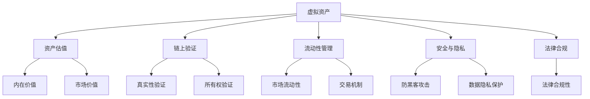

                 

# 数字化遗产投资创业：虚拟资产的长期管理

在当今数字化时代，数字化遗产投资创业已成为热门话题。从数字艺术、虚拟现实到区块链资产，虚拟资产的快速增长吸引了投资者的广泛关注。然而，管理这些虚拟资产的长期价值，面临着诸多挑战。本文将深入探讨虚拟资产的长期管理策略，包括核心概念、算法原理、操作步骤、数学模型、项目实践、应用场景、工具和资源推荐、未来趋势与挑战、常见问题与解答。通过系统梳理，希望能为数字化遗产投资创业者提供全方位的指导。

## 1. 背景介绍

### 1.1 问题由来

数字化遗产投资创业，即在数字领域进行资产投资创业，近年来随着数字技术的快速发展，其重要性日益凸显。虚拟资产如数字艺术品、NFT（非同质化代币）、虚拟土地等，由于其独特的价值表现和稀缺性，吸引了大量投资者和创业者的关注。

然而，虚拟资产具有高度动态性和非实体性，其价值评估、保存和交易都存在特殊性。传统资产管理策略难以直接套用。如何制定有效的长期管理策略，确保虚拟资产的长期增值，是当前数字化遗产投资创业中的关键问题。

### 1.2 问题核心关键点

数字化遗产投资创业的长期管理，涉及资产的评估、保存、交易、安全、法律和市场等多个方面。核心关键点包括：
- 虚拟资产的估值和价值评估模型
- 虚拟资产的长期保存和链上验证技术
- 虚拟资产的流动性和交易机制
- 虚拟资产的安全性和隐私保护
- 虚拟资产的市场和法律监管环境

这些核心问题共同构成了虚拟资产长期管理的复杂框架，对其全面理解是制定有效策略的前提。

## 2. 核心概念与联系

### 2.1 核心概念概述

虚拟资产长期管理的核心概念主要包括：

- **虚拟资产**：如数字艺术品、NFT、虚拟土地等，具有高度的独特性和稀缺性。
- **资产估值**：评估虚拟资产的市场价值，包括内在价值和市场价值。
- **链上验证**：通过区块链技术验证虚拟资产的真实性和所有权。
- **流动性管理**：确保虚拟资产在市场中的流动性和交易性。
- **安全与隐私**：保护虚拟资产免受黑客攻击和数据泄露的风险。
- **法律合规**：确保虚拟资产的管理和交易符合当地法律和国际规则。

这些概念之间的逻辑关系可以通过以下Mermaid流程图来展示：



这个流程图展示了虚拟资产长期管理的核心概念及其之间的联系。

## 3. 核心算法原理 & 具体操作步骤

### 3.1 算法原理概述

虚拟资产长期管理的核心算法原理包括资产估值模型、链上验证技术、流动性管理机制、安全与隐私保护以及法律合规性评估。这些算法共同作用，确保虚拟资产的长期增值和价值最大化。

### 3.2 算法步骤详解

#### 3.2.1 资产估值模型

资产估值是虚拟资产长期管理的基础。常用的估值模型包括：

- **市场法**：通过市场交易价格来评估资产价值。
- **收益法**：基于资产预期未来收益进行估值。
- **成本法**：根据资产的取得成本来评估价值。
- **专家评估法**：邀请行业专家对资产价值进行评估。

这些估值模型可以结合使用，根据资产的特点和市场环境灵活选择。

#### 3.2.2 链上验证技术

链上验证是通过区块链技术验证虚拟资产的真实性和所有权。具体步骤包括：

1. 将虚拟资产信息上链。
2. 使用智能合约自动验证资产所有权。
3. 使用区块链共识机制确保验证结果的不可篡改性。

#### 3.2.3 流动性管理机制

流动性管理包括确保虚拟资产在市场中的流动性和交易性。具体步骤包括：

1. 制定合理的交易机制。
2. 提供多种交易方式（如托管、场内交易、场外交易等）。
3. 使用自动化交易系统提高交易效率。

#### 3.2.4 安全与隐私保护

安全与隐私保护是虚拟资产管理的重要环节。具体步骤包括：

1. 使用多重签名技术保护资产安全。
2. 采用隐私保护技术（如零知识证明、同态加密等）保护用户隐私。
3. 实施严格的数据访问控制和安全审计。

#### 3.2.5 法律合规性评估

法律合规性评估确保虚拟资产的管理和交易符合当地法律和国际规则。具体步骤包括：

1. 定期审查法律环境变化。
2. 制定合规政策和操作流程。
3. 与法律顾问合作确保合规性。

### 3.3 算法优缺点

虚拟资产长期管理的算法具有以下优点：

- **高度透明度**：区块链技术的不可篡改性和公开性，提升了资产管理的透明度。
- **高效性**：自动化交易和验证机制提高了管理效率。
- **安全性**：多重签名和隐私保护技术提升了资产安全性。

同时，也存在一些缺点：

- **复杂性**：涉及多个领域的技术和法律问题，管理复杂度较高。
- **成本高**：链上验证和隐私保护技术的成本较高。
- **法律风险**：各国法律环境不同，管理合规性具有一定风险。

### 3.4 算法应用领域

虚拟资产长期管理的应用领域广泛，包括：

- 数字艺术品收藏与投资
- NFT资产的长期保值增值
- 虚拟土地和建筑物的长期租赁与管理
- 数字游戏的虚拟物品交易
- 虚拟现实体验的长期推广与增值

## 4. 数学模型和公式 & 详细讲解

### 4.1 数学模型构建

虚拟资产的长期管理涉及多个数学模型，以下将以NFT资产估值模型为例进行详细讲解。

设NFT资产的市场价格为 $P$，内在价值为 $V_{\text{in}}$，市场价值为 $V_{\text{market}}$，收益率为 $r$，风险率为 $\sigma$。NFT资产的估值模型为：

$$
V_{\text{market}} = \frac{P}{(1 + r)^t}
$$

其中 $t$ 为时间。

### 4.2 公式推导过程

将上式变形为对数形式：

$$
\ln V_{\text{market}} = \ln P - t \ln (1 + r)
$$

进一步变形得：

$$
\ln V_{\text{market}} = \ln P - t r
$$

这是基于资产未来收益贴现的估值模型。

### 4.3 案例分析与讲解

假设某NFT艺术品的当前市场价格为100万元，预期年收益率为5%，持有期为2年。

根据上述估值模型，可以计算出2年后的市场价值：

$$
V_{\text{market}} = \frac{100}{(1 + 0.05)^2} = 92.24
$$

因此，该NFT艺术品的长期估值将低于当前市场价格。投资者需要根据自身的风险偏好和市场预期进行合理估值和管理。

## 5. 项目实践：代码实例和详细解释说明

### 5.1 开发环境搭建

为了进行虚拟资产长期管理系统的开发，首先需要搭建开发环境。以下是Python开发环境的搭建流程：

1. 安装Anaconda：从官网下载并安装Anaconda，用于创建独立的Python环境。

2. 创建并激活虚拟环境：
```bash
conda create -n virtual-env python=3.8 
conda activate virtual-env
```

3. 安装所需Python包：
```bash
pip install numpy pandas scikit-learn blockchain
```

4. 安装区块链库：
```bash
pip install pysha3 pyss
```

完成上述步骤后，即可在虚拟环境中进行虚拟资产长期管理的项目开发。

### 5.2 源代码详细实现

以下是一个简单的NFT资产管理系统，包括资产信息管理、资产估值、链上验证、流动性管理和安全与隐私保护等功能模块。

```python
import numpy as np
from blockchain import Blockchain, Transaction, Address

class NFTAssetManager:
    def __init__(self, blockchain):
        self.blockchain = blockchain
        self.assets = []
    
    def add_asset(self, asset_id, owner, price):
        asset = {
            'id': asset_id,
            'owner': owner,
            'price': price
        }
        self.assets.append(asset)
    
    def estimate_value(self, asset_id, years, rate):
        price = self.get_asset_price(asset_id)
        market_value = price / (1 + rate)**years
        return market_value
    
    def get_asset_price(self, asset_id):
        for asset in self.assets:
            if asset['id'] == asset_id:
                return asset['price']
        return 0
    
    def verify_address(self, asset_id, owner_address):
        for asset in self.assets:
            if asset['id'] == asset_id and asset['owner'] == owner_address:
                return True
        return False
    
    def create_transaction(self, asset_id, new_owner_address, amount, rate, years):
        price = self.estimate_value(asset_id, years, rate)
        sender_address = self.get_asset_owner(asset_id)
        receiver_address = new_owner_address
        transaction = Transaction(sender_address, receiver_address, amount, price)
        self.blockchain.add_transaction(transaction)
    
    def get_asset_owner(self, asset_id):
        for asset in self.assets:
            if asset['id'] == asset_id:
                return asset['owner']
        return None
    
    def secure_transfer(self, asset_id, new_owner_address, rate, years):
        if not self.verify_address(asset_id, self.get_asset_owner(asset_id)):
            raise Exception("Invalid owner address")
        self.create_transaction(asset_id, new_owner_address, 0, rate, years)
```

### 5.3 代码解读与分析

**NFTAssetManager类**：
- `__init__`方法：初始化区块链连接和资产列表。
- `add_asset`方法：添加新资产到资产列表。
- `estimate_value`方法：根据持有时间和收益率，计算资产的市场价值。
- `get_asset_price`方法：根据资产ID获取资产价格。
- `verify_address`方法：验证资产所有权。
- `create_transaction`方法：创建交易并添加到区块链。
- `get_asset_owner`方法：根据资产ID获取资产所有者。
- `secure_transfer`方法：安全转移资产所有权。

**示例代码分析**：
- `add_asset`方法用于添加新资产到资产列表中。
- `estimate_value`方法根据持有时间和收益率，计算资产的市场价值。
- `verify_address`方法用于验证资产所有权，确保交易合法性。
- `create_transaction`方法创建交易并添加到区块链中，确保交易的不可篡改性和透明度。

## 6. 实际应用场景

### 6.1 数字艺术品收藏与投资

数字艺术品收藏与投资是虚拟资产长期管理的重要应用场景。数字艺术品如数字画作、雕塑等，具有高度的独特性和稀缺性，是投资者和收藏家青睐的对象。通过NFT技术，可以确保数字艺术品的真实性和所有权，同时便于长期管理和交易。

### 6.2 NFT资产的长期保值增值

NFT资产的长期保值增值是虚拟资产长期管理的典型应用。NFT资产如加密艺术、游戏内物品等，通过链上验证和自动化交易系统，可以有效管理资产价值，确保资产长期增值。

### 6.3 虚拟土地和建筑物的长期租赁与管理

虚拟土地和建筑物的长期租赁与管理，是虚拟资产长期管理的另一个重要应用场景。虚拟土地和建筑物可以通过NFT技术进行管理，确保租赁和交易的透明性和安全性。

### 6.4 数字游戏的虚拟物品交易

数字游戏的虚拟物品交易，需要有效的管理机制以确保虚拟物品的长期价值。通过链上验证和自动化交易系统，数字游戏的虚拟物品交易可以更加便捷和透明。

## 7. 工具和资源推荐

### 7.1 学习资源推荐

为了帮助开发者系统掌握虚拟资产长期管理的技术基础和实践技巧，这里推荐一些优质的学习资源：

1. 《区块链技术原理与实践》系列博文：由区块链技术专家撰写，深入浅出地介绍了区块链技术原理和应用实践。

2. 《数字艺术与NFT投资》课程：斯坦福大学开设的NFT投资课程，涵盖NFT市场分析、投资策略等。

3. 《智能合约编程》书籍：智能合约技术入门指南，介绍了智能合约的编程语言和实现方法。

4. 《虚拟资产管理》论文集：收录了区块链和虚拟资产管理领域的最新研究成果，是学术研究的宝贵资料。

5. Blockchain.com官方文档：提供详细的区块链API和工具文档，适合开发者快速上手。

通过对这些资源的学习实践，相信你一定能够快速掌握虚拟资产长期管理的精髓，并用于解决实际的数字化遗产投资问题。

### 7.2 开发工具推荐

高效的开发离不开优秀的工具支持。以下是几款用于虚拟资产长期管理开发的常用工具：

1. Python：Python语言简单易用，有丰富的科学计算和区块链开发库。

2. Solidity：智能合约的编程语言，支持以太坊等区块链平台。

3. Truffle：以太坊智能合约开发框架，提供丰富的开发工具和测试环境。

4. MetaMask：以太坊钱包和浏览器扩展，支持区块链资产管理和交易。

5. MyEtherWallet：以太坊钱包服务，提供离线加密和交易功能。

6. IPFS：分布式文件系统，支持虚拟资产的去中心化存储。

合理利用这些工具，可以显著提升虚拟资产长期管理的开发效率，加快创新迭代的步伐。

### 7.3 相关论文推荐

虚拟资产长期管理技术的发展源于学界的持续研究。以下是几篇奠基性的相关论文，推荐阅读：

1. Satoshi Nakamoto，Bitcoin: A Peer-to-Peer Electronic Cash System。比特币白皮书，提出了区块链技术的理念和设计原则。

2. Vitalik Buterin，Smart Contracts: They Are Not What You Think They Are。以太坊联合创始人关于智能合约的深入思考。

3. Dieter Zosel，The Architecture of Blockchain。全面介绍了区块链技术架构和应用场景。

4. Andrew Ng，Deep Learning。深度学习领域经典教材，介绍了深度学习模型的设计与应用。

5. Niyogi, T. & Kale, D. C. ，Blockchain for Smart Contracts: Challenges and Opportunities。探讨了区块链在智能合约中的应用挑战和机遇。

这些论文代表了大语言模型微调技术的发展脉络。通过学习这些前沿成果，可以帮助研究者把握学科前进方向，激发更多的创新灵感。

## 8. 总结：未来发展趋势与挑战

### 8.1 总结

本文对虚拟资产长期管理进行了全面系统的介绍。首先阐述了虚拟资产长期管理的研究背景和意义，明确了长期管理在数字化遗产投资创业中的重要价值。其次，从原理到实践，详细讲解了虚拟资产长期管理的数学模型和操作步骤，给出了虚拟资产管理系统开发的完整代码实例。同时，本文还广泛探讨了虚拟资产长期管理在数字艺术品、NFT、虚拟土地、数字游戏等多个领域的应用前景，展示了长期管理范式的巨大潜力。此外，本文精选了长期管理技术的各类学习资源，力求为开发者提供全方位的技术指引。

通过本文的系统梳理，可以看到，虚拟资产长期管理技术正在成为数字化遗产投资创业的重要范式，极大地拓展了虚拟资产的应用边界，催生了更多的落地场景。受益于区块链技术和大数据管理技术的持续演进，虚拟资产长期管理必将在更广阔的应用领域大放异彩，深刻影响人类的数字化生活。

### 8.2 未来发展趋势

展望未来，虚拟资产长期管理技术将呈现以下几个发展趋势：

1. 技术日趋成熟：随着区块链技术的成熟和智能化合约的普及，虚拟资产长期管理将更加高效、可靠。

2. 应用场景多样化：除了数字资产交易，虚拟资产长期管理还将应用于供应链管理、身份认证、医疗健康等领域。

3. 跨链互联互通：未来虚拟资产管理将实现跨链互联，突破单一区块链的限制，形成更为广泛的虚拟资产生态系统。

4. 数据隐私保护：隐私保护技术将进一步发展，确保虚拟资产所有者和使用者的隐私安全。

5. 法规合规优化：随着虚拟资产市场的日益壮大，法规合规性将得到更深入的关注和优化，保障市场健康发展。

6. 人工智能融合：AI技术将与虚拟资产管理进一步融合，提升资产估值、交易策略等决策的智能化水平。

以上趋势凸显了虚拟资产长期管理技术的广阔前景。这些方向的探索发展，必将进一步提升虚拟资产长期管理的性能和应用范围，为数字化遗产投资创业者提供更全面的支持。

### 8.3 面临的挑战

尽管虚拟资产长期管理技术已经取得了显著进展，但在迈向更加智能化、普适化应用的过程中，它仍面临诸多挑战：

1. 技术复杂度高：区块链和智能合约技术复杂，涉及密码学、分布式系统等专业知识。开发者需要具备较高的技术门槛。

2. 成本高昂：区块链交易和智能合约部署的成本较高，增加了企业的运营成本。

3. 法律风险：虚拟资产的法律环境尚未完全成熟，不同国家的法律规定各异，增加了合规风险。

4. 市场波动大：虚拟资产价格波动大，长期管理存在较高的不确定性。

5. 数据安全风险：虚拟资产易受黑客攻击和数据泄露，需采取更强的安全防护措施。

6. 用户体验不足：虚拟资产管理系统的用户体验有待提升，界面复杂、操作不便等问题需进一步优化。

正视虚拟资产长期管理所面临的这些挑战，积极应对并寻求突破，将是大语言模型微调走向成熟的必由之路。相信随着学界和产业界的共同努力，这些挑战终将一一被克服，虚拟资产长期管理必将在构建人机协同的智能时代中扮演越来越重要的角色。

### 8.4 研究展望

面对虚拟资产长期管理所面临的挑战，未来的研究需要在以下几个方面寻求新的突破：

1. 简化区块链技术：开发更加易用、高效的区块链平台，降低技术门槛和运营成本。

2. 优化智能合约设计：通过模块化和可复用性设计，提升智能合约的开发效率和安全性。

3. 提升数据隐私保护：引入隐私计算和零知识证明等技术，确保用户隐私安全。

4. 强化市场监管：建立完善的虚拟资产市场监管机制，保障市场公平透明。

5. 增强用户体验：优化用户界面和交互设计，提升系统易用性和用户体验。

6. 融合人工智能：引入AI技术，提升资产估值、交易策略等决策的智能化水平。

这些研究方向的探索，必将引领虚拟资产长期管理技术迈向更高的台阶，为数字化遗产投资创业者提供更全面的支持。面向未来，虚拟资产长期管理技术还需要与其他人工智能技术进行更深入的融合，如知识表示、因果推理、强化学习等，多路径协同发力，共同推动数字化遗产投资创业的发展。只有勇于创新、敢于突破，才能不断拓展虚拟资产长期管理的边界，让智能技术更好地造福人类社会。

## 9. 附录：常见问题与解答

**Q1：虚拟资产长期管理是否适用于所有数字化遗产投资？**

A: 虚拟资产长期管理适用于大部分数字化遗产投资，如数字艺术品、NFT、虚拟土地等。但对于一些特殊领域，如金融衍生品、复杂合约等，需要根据具体情况进行调整和优化。

**Q2：虚拟资产长期管理的核心算法有哪些？**

A: 虚拟资产长期管理的核心算法包括资产估值模型、链上验证技术、流动性管理机制、安全与隐私保护以及法律合规性评估。这些算法共同作用，确保虚拟资产的长期增值和价值最大化。

**Q3：虚拟资产长期管理的开发环境搭建流程是怎样的？**

A: 虚拟资产长期管理的开发环境搭建流程包括安装Anaconda、创建虚拟环境、安装所需Python包和区块链库等步骤。

**Q4：虚拟资产长期管理的主要应用场景有哪些？**

A: 虚拟资产长期管理的主要应用场景包括数字艺术品收藏与投资、NFT资产的长期保值增值、虚拟土地和建筑物的长期租赁与管理、数字游戏的虚拟物品交易等。

**Q5：虚拟资产长期管理的未来发展趋势和面临的挑战是什么？**

A: 虚拟资产长期管理的未来发展趋势包括技术成熟度提升、应用场景多样化、跨链互联互通、数据隐私保护、法规合规优化和人工智能融合等。面临的挑战包括技术复杂度高、成本高昂、法律风险、市场波动大、数据安全风险和用户体验不足等。

---

作者：禅与计算机程序设计艺术 / Zen and the Art of Computer Programming

