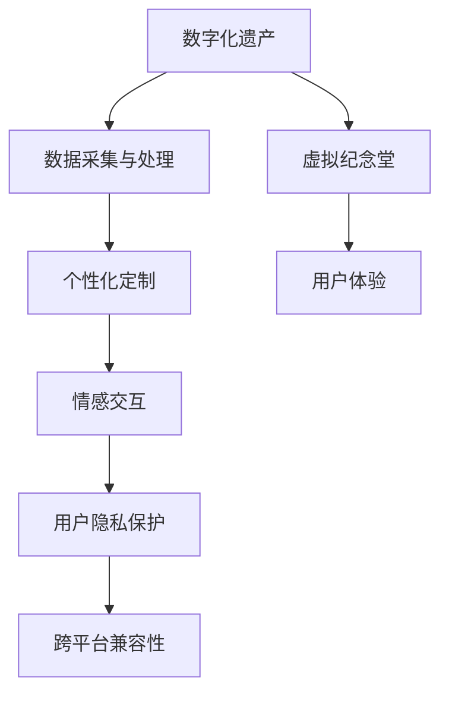

                 

# 数字化遗产虚拟纪念堂创业：永恒的在线追思空间

## 1. 背景介绍

随着互联网的普及和数字化技术的发展，数字遗产在现代社会中的地位日益重要。人们越来越希望通过数字化方式保存和传承亲人的记忆，以此作为对逝者永久的怀念。与此同时，传统的线下纪念堂逐渐面临空间限制、时间消逝等挑战。因此，数字化遗产虚拟纪念堂应运而生，利用互联网和数字化技术，建立永久的、可在线访问的追思空间，为人们提供一种新的、创新的纪念方式。

### 1.1 问题由来

数字化遗产虚拟纪念堂的创业初衷，源自于数字化时代对传统纪念方式的需求变化。传统线下纪念堂往往受制于地理、时间、空间等因素，使得人们难以随时随地访问和维护对逝者的追思。数字化技术为解决这一问题提供了新的可能，通过建立虚拟纪念堂，人们可以在任何时间、任何地点，以多种形式缅怀亲人，留存记忆，传承情感。

### 1.2 问题核心关键点

数字化遗产虚拟纪念堂的核心关键点主要包括以下几个方面：

1. **数据采集与处理**：如何高效地采集和处理各种类型的数字化遗产信息，如文字、图片、视频、音频等，是技术实现的基础。
2. **个性化定制**：如何根据用户的个性化需求，定制虚拟纪念堂的界面和功能，提供量身定制的服务。
3. **情感交互**：如何在虚拟空间中实现情感的深度交互，让用户与逝者之间建立起持续的情感联系。
4. **用户隐私保护**：如何在提供个性化服务的同时，确保用户隐私和数据安全。
5. **跨平台兼容性**：如何让虚拟纪念堂在多个平台（如PC、手机、平板等）上无缝运行，提供良好的用户体验。

### 1.3 问题研究意义

数字化遗产虚拟纪念堂的创业，对于推动数字化遗产的发展，具有重要意义：

1. **传承与弘扬**：通过数字化手段保存和传承文化遗产，弘扬中华民族的传统美德，增强民族凝聚力。
2. **创新纪念方式**：为传统纪念方式注入新的活力，提供更加多样、便捷的追思方式。
3. **社会教育**：利用数字化纪念空间进行社会教育，提高公众对文化遗产保护和传承的意识。
4. **经济发展**：数字遗产虚拟纪念堂的创业，可带动相关产业链的发展，包括数字化技术、文化创意产业等。

## 2. 核心概念与联系

### 2.1 核心概念概述

在数字化遗产虚拟纪念堂的创业中，涉及多个核心概念：

- **数字化遗产**：通过数字化技术采集和处理的各类遗产信息，如文字、图片、视频、音频等。
- **虚拟纪念堂**：利用互联网和数字化技术，建立永久的、可在线访问的追思空间。
- **个性化定制**：根据用户的个性化需求，定制虚拟纪念堂的界面和功能，提供量身定制的服务。
- **情感交互**：在虚拟空间中实现情感的深度交互，让用户与逝者之间建立起持续的情感联系。
- **用户隐私保护**：确保用户隐私和数据安全。
- **跨平台兼容性**：在多个平台（如PC、手机、平板等）上无缝运行，提供良好的用户体验。

这些核心概念之间存在着密切的联系，共同构成了数字化遗产虚拟纪念堂的技术实现框架。以下是一个Mermaid流程图，展示了这些概念之间的联系：



## 3. 核心算法原理 & 具体操作步骤

### 3.1 算法原理概述

数字化遗产虚拟纪念堂的实现涉及多个算法和步骤，主要包括数据采集与处理、个性化定制、情感交互、用户隐私保护和跨平台兼容性等。以下是对这些核心算法的概述：

1. **数据采集与处理**：
   - 利用爬虫技术，自动采集互联网上的各类数字化遗产信息，如文字内容、图片、视频、音频等。
   - 使用OCR技术对文字进行识别，利用计算机视觉技术对图片进行标注和分类。
   - 利用音频处理技术对音频进行降噪和增强，利用视频处理技术对视频进行剪辑和转码。

2. **个性化定制**：
   - 通过用户界面设计，实现对虚拟纪念堂界面的个性化定制，如颜色、字体、布局等。
   - 利用机器学习和自然语言处理技术，根据用户的输入和行为，推荐个性化的内容和服务。

3. **情感交互**：
   - 利用自然语言处理技术，实现用户与虚拟纪念堂之间的情感交互，如聊天机器人、语音助手等。
   - 利用增强现实(AR)和虚拟现实(VR)技术，提供沉浸式的追思体验，让用户感受到亲人的存在。

4. **用户隐私保护**：
   - 利用加密技术和安全协议，确保用户数据传输和存储的安全。
   - 在虚拟纪念堂中设置隐私设置选项，用户可以控制个人信息的可见性和处理方式。

5. **跨平台兼容性**：
   - 使用Web技术实现虚拟纪念堂在PC、手机、平板等平台上的无缝运行。
   - 利用移动应用开发技术，开发专门的移动应用，提升用户体验。

### 3.2 算法步骤详解

#### 3.2.1 数据采集与处理算法步骤

1. **采集数字化遗产信息**：
   - 利用爬虫技术，自动化采集各类数字化遗产信息。
   - 利用OCR技术，对采集到的文字进行识别和提取。
   - 利用计算机视觉技术，对图片进行标注和分类。
   - 利用音频处理技术，对音频进行降噪和增强。
   - 利用视频处理技术，对视频进行剪辑和转码。

2. **数据清洗与处理**：
   - 对采集到的数据进行清洗，去除重复和无用的信息。
   - 利用自然语言处理技术，对文本进行分词、词性标注等预处理。
   - 利用计算机视觉技术，对图片进行边缘检测、特征提取等处理。
   - 利用音频处理技术，对音频进行降噪、增益调节等处理。
   - 利用视频处理技术，对视频进行帧率调整、压缩等处理。

3. **数据存储与索引**：
   - 利用数据库技术，对清洗后的数据进行存储。
   - 利用搜索引擎技术，对数据进行索引和搜索，方便用户查询和浏览。

#### 3.2.2 个性化定制算法步骤

1. **用户界面设计**：
   - 根据用户需求，设计虚拟纪念堂的界面和功能。
   - 利用UI设计工具，实现界面的可视化设计和渲染。

2. **个性化推荐算法**：
   - 利用机器学习技术，根据用户的行为和偏好，推荐个性化的内容和服务。
   - 利用自然语言处理技术，对用户输入进行情感分析，推荐相关的文本、图片和视频。

3. **用户行为记录与分析**：
   - 记录用户在虚拟纪念堂中的行为，如浏览时间、点击次数等。
   - 利用数据分析技术，对用户行为进行分析，优化个性化推荐算法。

#### 3.2.3 情感交互算法步骤

1. **聊天机器人开发**：
   - 利用自然语言处理技术，开发聊天机器人，实现与用户的交互。
   - 利用语音识别技术，实现语音交互功能，如语音识别、语音合成等。

2. **情感分析与反馈**：
   - 利用情感分析技术，对用户输入进行情感分析，判断用户情绪。
   - 根据情感分析结果，提供相应的情感反馈和互动。

3. **沉浸式体验**：
   - 利用增强现实(AR)和虚拟现实(VR)技术，提供沉浸式的追思体验，如虚拟现实追思室、增强现实照片等。

#### 3.2.4 用户隐私保护算法步骤

1. **数据加密与传输**：
   - 利用加密技术，对用户数据进行加密，确保数据传输的安全。
   - 利用安全协议，对数据传输进行加密和验证，防止数据泄露。

2. **隐私设置选项**：
   - 在虚拟纪念堂中设置隐私设置选项，用户可以控制个人信息的可见性和处理方式。
   - 利用权限控制技术，确保用户隐私设置的生效。

#### 3.2.5 跨平台兼容性算法步骤

1. **Web技术开发**：
   - 使用Web技术，开发虚拟纪念堂的前端页面和后端服务。
   - 利用前端框架，实现虚拟纪念堂的响应式设计。

2. **移动应用开发**：
   - 使用移动应用开发技术，开发专门的移动应用。
   - 利用移动应用开发工具，实现跨平台的开发和部署。

3. **多平台集成**：
   - 利用API接口，实现虚拟纪念堂在多个平台上的无缝集成。
   - 利用移动应用集成技术，实现虚拟纪念堂与移动应用的整合。

### 3.3 算法优缺点

数字化遗产虚拟纪念堂的算法具有以下优点：

1. **高效数据采集与处理**：利用自动化技术，可以高效地采集和处理各类数字化遗产信息。
2. **个性化服务**：利用机器学习和自然语言处理技术，可以实现个性化的内容和服务推荐。
3. **情感深度交互**：利用聊天机器人和增强现实技术，可以实现深度的情感交互和沉浸式体验。
4. **跨平台兼容性**：利用Web技术和移动应用开发技术，可以实现虚拟纪念堂在多个平台上的无缝运行。

同时，这些算法也存在一些缺点：

1. **数据隐私问题**：在数据采集和存储过程中，可能存在数据隐私泄露的风险。
2. **技术复杂度**：数字化遗产虚拟纪念堂的实现涉及多种技术，技术实现难度较大。
3. **用户习惯培养**：用户需要逐步适应虚拟纪念堂的使用方式，培养新的使用习惯。

### 3.4 算法应用领域

数字化遗产虚拟纪念堂的算法应用领域非常广泛，可以应用于以下几个方面：

1. **个人与家庭**：为个人和家庭用户提供永久的、可在线访问的追思空间，保存和传承家族的数字化遗产。
2. **学校与教育机构**：为学校和教育机构提供数字化的纪念空间，保存和传承学生的成长历程和校园生活。
3. **博物馆与文化机构**：为博物馆和文化机构提供数字化的纪念空间，保存和传承文化遗产和历史文物。
4. **企业与组织**：为企业和组织提供数字化的纪念空间，保存和传承企业的历史和发展历程。
5. **公益与慈善机构**：为公益和慈善机构提供数字化的纪念空间，保存和传承社会的爱心和善举。

## 4. 数学模型和公式 & 详细讲解 & 举例说明

### 4.1 数学模型构建

数字化遗产虚拟纪念堂的实现涉及多个数学模型，以下是对主要数学模型的构建：

1. **数据采集与处理模型**：
   - 文字识别模型：利用OCR技术，对采集到的文字内容进行识别和提取。
   - 图片标注模型：利用计算机视觉技术，对图片进行标注和分类。
   - 音频降噪模型：利用音频处理技术，对音频进行降噪和增强。
   - 视频剪辑模型：利用视频处理技术，对视频进行剪辑和转码。

2. **个性化定制模型**：
   - 用户行为分析模型：利用数据分析技术，对用户行为进行分析，优化个性化推荐算法。

3. **情感交互模型**：
   - 聊天机器人模型：利用自然语言处理技术，开发聊天机器人，实现与用户的交互。
   - 情感分析模型：利用情感分析技术，对用户输入进行情感分析，判断用户情绪。

4. **用户隐私保护模型**：
   - 数据加密模型：利用加密技术，对用户数据进行加密，确保数据传输的安全。

5. **跨平台兼容性模型**：
   - Web技术开发模型：使用Web技术，开发虚拟纪念堂的前端页面和后端服务。
   - 移动应用开发模型：使用移动应用开发技术，开发专门的移动应用。

### 4.2 公式推导过程

#### 4.2.1 文字识别模型公式推导

文字识别模型利用OCR技术，对采集到的文字内容进行识别和提取。以下是对文字识别模型的公式推导：

设输入的文字序列为 $x = (x_1, x_2, \ldots, x_n)$，输出识别结果序列为 $y = (y_1, y_2, \ldots, y_n)$，则文字识别模型的目标是最小化交叉熵损失函数：

$$
\mathcal{L} = -\frac{1}{n}\sum_{i=1}^n \log P(y_i|x_i)
$$

其中 $P(y_i|x_i)$ 为模型对第 $i$ 个文字的识别概率，可以利用机器学习模型（如CNN、RNN等）进行训练。

#### 4.2.2 图片标注模型公式推导

图片标注模型利用计算机视觉技术，对图片进行标注和分类。以下是对图片标注模型的公式推导：

设输入的图片序列为 $I = (I_1, I_2, \ldots, I_n)$，输出标注结果序列为 $T = (T_1, T_2, \ldots, T_n)$，则图片标注模型的目标是最小化交叉熵损失函数：

$$
\mathcal{L} = -\frac{1}{n}\sum_{i=1}^n \log P(T_i|I_i)
$$

其中 $P(T_i|I_i)$ 为模型对第 $i$ 个图片进行标注的概率，可以利用深度学习模型（如CNN、RNN等）进行训练。

#### 4.2.3 音频降噪模型公式推导

音频降噪模型利用音频处理技术，对音频进行降噪和增强。以下是对音频降噪模型的公式推导：

设输入的音频序列为 $A = (A_1, A_2, \ldots, A_n)$，输出降噪后的音频序列为 $\hat{A} = (\hat{A}_1, \hat{A}_2, \ldots, \hat{A}_n)$，则音频降噪模型的目标是最小化均方误差损失函数：

$$
\mathcal{L} = \frac{1}{n}\sum_{i=1}^n ||A_i - \hat{A}_i||^2
$$

其中 $||\cdot||$ 为音频信号的欧几里得范数，可以利用数字信号处理技术进行训练。

#### 4.2.4 视频剪辑模型公式推导

视频剪辑模型利用视频处理技术，对视频进行剪辑和转码。以下是对视频剪辑模型的公式推导：

设输入的视频序列为 $V = (V_1, V_2, \ldots, V_n)$，输出剪辑后的视频序列为 $\tilde{V} = (\tilde{V}_1, \tilde{V}_2, \ldots, \tilde{V}_n)$，则视频剪辑模型的目标是最小化均方误差损失函数：

$$
\mathcal{L} = \frac{1}{n}\sum_{i=1}^n ||V_i - \tilde{V}_i||^2
$$

其中 $||\cdot||$ 为视频信号的欧几里得范数，可以利用视频编码技术进行训练。

### 4.3 案例分析与讲解

#### 4.3.1 文字识别案例

假设我们采集到了一段古文，需要对其中的文字进行识别。我们可以使用现有的OCR模型，如Tesseract或百度OCR，将其作为预训练模型，然后利用自定义数据进行微调。具体步骤如下：

1. **数据准备**：准备一批已标注的古文图片数据集。
2. **模型微调**：使用预训练的OCR模型作为初始化参数，利用自定义数据集进行微调，调整模型参数。
3. **模型评估**：在测试集上评估模型的识别准确率，并进行调整。

#### 4.3.2 图片标注案例

假设我们需要对一组历史照片进行标注，可以将其作为图片标注任务。具体步骤如下：

1. **数据准备**：准备一批已标注的历史照片数据集。
2. **模型训练**：利用计算机视觉模型（如ResNet、Inception等）进行训练，调整模型参数。
3. **模型评估**：在测试集上评估模型的标注准确率，并进行调整。

#### 4.3.3 音频降噪案例

假设我们需要对一段历史录音进行降噪处理，可以将其作为音频降噪任务。具体步骤如下：

1. **数据准备**：准备一批已标注的历史录音数据集。
2. **模型训练**：利用音频降噪模型（如DenoiseNet、Wave-U-Net等）进行训练，调整模型参数。
3. **模型评估**：在测试集上评估模型的降噪效果，并进行调整。

#### 4.3.4 视频剪辑案例

假设我们需要对一段历史录像进行剪辑，可以将其作为视频剪辑任务。具体步骤如下：

1. **数据准备**：准备一批已标注的历史录像数据集。
2. **模型训练**：利用视频剪辑模型（如CNN+LSTM等）进行训练，调整模型参数。
3. **模型评估**：在测试集上评估模型的剪辑效果，并进行调整。

## 5. 项目实践：代码实例和详细解释说明

### 5.1 开发环境搭建

要进行数字化遗产虚拟纪念堂的开发，首先需要搭建开发环境。以下是使用Python进行Web开发的环境配置流程：

1. 安装Anaconda：从官网下载并安装Anaconda，用于创建独立的Python环境。

2. 创建并激活虚拟环境：
```bash
conda create -n web-env python=3.8 
conda activate web-env
```

3. 安装Web开发工具包：
```bash
pip install flask sqlalchemy flask-wtf flask-cors
```

4. 安装各类辅助工具：
```bash
pip install markdown requests gunicorn
```

5. 安装Git版本控制系统：
```bash
sudo apt-get install git
```

完成上述步骤后，即可在`web-env`环境中开始Web开发实践。

### 5.2 源代码详细实现

以下是使用Flask框架实现数字化遗产虚拟纪念堂的Web开发代码实现：

```python
from flask import Flask, render_template, request
from flask_sqlalchemy import SQLAlchemy
from flask_wtf import FlaskForm
from wtforms import StringField, SubmitField
from wtforms.validators import DataRequired
from markdown import markdown
import requests

app = Flask(__name__)
app.config['SQLALCHEMY_DATABASE_URI'] = 'sqlite:///digital_memorial.db'
app.config['SECRET_KEY'] = 'your-secret-key'
db = SQLAlchemy(app)

class DigitalMemorial(db.Model):
    id = db.Column(db.Integer, primary_key=True)
    name = db.Column(db.String(100), nullable=False)
    content = db.Column(db.Text, nullable=False)
    date = db.Column(db.DateTime, default=db.func.current_timestamp())

class DigitalMemorialForm(FlaskForm):
    name = StringField('Name', validators=[DataRequired()])
    content = StringField('Content', validators=[DataRequired()])
    submit = SubmitField('Submit')

@app.route('/')
def index():
    memorials = DigitalMemorial.query.all()
    return render_template('index.html', memorials=memorials)

@app.route('/submit', methods=['POST'])
def submit():
    form = DigitalMemorialForm()
    if form.validate_on_submit():
        name = form.name.data
        content = form.content.data
        memorial = DigitalMemorial(name=name, content=markdown(content))
        db.session.add(memorial)
        db.session.commit()
        return 'Memorial submitted successfully!'
    return render_template('submit.html', form=form)

@app.route('/<id>')
def view(id):
    memorial = DigitalMemorial.query.get_or_404(id)
    return render_template('view.html', memorial=memorial)

if __name__ == '__main__':
    app.run(debug=True)
```

在这个代码中，我们使用了Flask框架进行Web开发，并利用SQLAlchemy进行数据库操作。用户可以通过表单提交数字化遗产信息，并在虚拟纪念堂中查看和浏览。

### 5.3 代码解读与分析

以下是代码中关键部分的解读和分析：

**DigitalMemorial类**：
- `id`：数字遗产ID，作为主键。
- `name`：数字遗产名称，如人物名字、历史事件等。
- `content`：数字遗产内容，如文字内容、图片、视频、音频等。
- `date`：数字遗产上传时间，由数据库自动记录。

**DigitalMemorialForm类**：
- `name`：输入数字遗产名称，必填。
- `content`：输入数字遗产内容，必填。
- `submit`：提交按钮，用于提交数字遗产信息。

**路由和视图函数**：
- `index`函数：展示所有数字遗产信息。
- `submit`函数：接收用户提交的数字遗产信息，并保存到数据库中。
- `view`函数：展示指定ID的数字遗产信息。

## 6. 实际应用场景

### 6.1 智能客服系统

基于数字化遗产虚拟纪念堂的技术，可以开发智能客服系统，为在线客服提供永久的、可在线访问的追思空间，保存和传承用户的数字遗产。具体应用场景如下：

1. **客户追思服务**：利用虚拟纪念堂保存客户的追思信息，如客户的个人信息、家族历史、重要事件等。
2. **个性化服务**：根据客户的追思信息，提供个性化的客服服务，如情感支持、纪念日提醒等。
3. **用户交互**：利用聊天机器人和语音助手，与客户进行情感交流，提供深度的情感支持。

### 6.2 智慧医疗系统

基于数字化遗产虚拟纪念堂的技术，可以开发智慧医疗系统，为医生和患者提供永久的、可在线访问的追思空间，保存和传承医疗信息。具体应用场景如下：

1. **病历追思**：利用虚拟纪念堂保存患者的病历信息，如疾病史、治疗记录、护理日志等。
2. **医生追思**：利用虚拟纪念堂保存医生的医疗记录，如手术记录、诊断报告、病例分析等。
3. **情感支持**：根据病历信息，提供个性化的情感支持，如心理辅导、康复指导等。

### 6.3 智能教育系统

基于数字化遗产虚拟纪念堂的技术，可以开发智能教育系统，为教师和学生提供永久的、可在线访问的追思空间，保存和传承教育信息。具体应用场景如下：

1. **学生追思**：利用虚拟纪念堂保存学生的学习记录，如成绩单、作业、项目报告等。
2. **教师追思**：利用虚拟纪念堂保存教师的教学记录，如课程大纲、教学笔记、学生反馈等。
3. **个性化教育**：根据学生的追思信息，提供个性化的教育服务，如个性化推荐、情感辅导等。

## 7. 工具和资源推荐

### 7.1 学习资源推荐

为了帮助开发者系统掌握数字化遗产虚拟纪念堂的技术基础和实践技巧，以下是一些优质的学习资源：

1. **《数字化遗产：理论、实践与未来》系列博文**：由数字化遗产专家撰写，深入浅出地介绍了数字化遗产的理论基础和实践方法。

2. **Coursera《数字化遗产保护与管理》课程**：由数字化遗产保护领域知名学者开设，全面介绍了数字化遗产保护与管理的知识和方法。

3. **《数字遗产管理与保护》书籍**：介绍数字化遗产管理与保护的理论和实践，提供丰富的案例和应用实例。

4. **DIGITAL HERITAGE CONSORTIUM（数字遗产联盟）**：国际数字遗产保护和管理的权威组织，提供最新的研究进展和实践指南。

通过对这些资源的学习实践，相信你一定能够快速掌握数字化遗产虚拟纪念堂的核心技术和实现方法，并用于解决实际的数字化遗产问题。

### 7.2 开发工具推荐

高效的开发离不开优秀的工具支持。以下是几款用于数字化遗产虚拟纪念堂开发的常用工具：

1. **Flask**：基于Python的开源Web框架，灵活易用，适合快速开发Web应用。
2. **SQLAlchemy**：Python的ORM框架，支持多种数据库，方便进行数据库操作。
3. **WTForms**：Python表单库，提供强大的表单验证和数据处理功能。
4. **Markdown**：轻量级的文本编辑器，适合处理格式化文本。
5. **Git**：版本控制系统，方便代码管理和版本控制。
6. **Gunicorn**：Python Web服务器的选择，适合在生产环境中部署Web应用。

合理利用这些工具，可以显著提升数字化遗产虚拟纪念堂的开发效率，加快创新迭代的步伐。

### 7.3 相关论文推荐

数字化遗产虚拟纪念堂的研究源于学界的持续研究。以下是几篇奠基性的相关论文，推荐阅读：

1. **《数字化遗产保护与管理的理论与实践》**：介绍数字化遗产保护与管理的理论和实践，探讨数字化遗产的保存与传承方法。
2. **《数字化遗产的数据采集、存储与访问》**：探讨数字化遗产的数据采集、存储与访问技术，提供实用的解决方案。
3. **《基于Web技术的数字化遗产管理系统》**：介绍基于Web技术的数字化遗产管理系统，提供系统设计和实现方法。
4. **《数字化遗产的情感分析与支持》**：利用自然语言处理技术，对数字化遗产进行情感分析，提供情感支持服务。

这些论文代表了大数字化遗产虚拟纪念堂的研究方向，通过学习这些前沿成果，可以帮助研究者把握学科前进方向，激发更多的创新灵感。

## 8. 总结：未来发展趋势与挑战

### 8.1 总结

本文对数字化遗产虚拟纪念堂的创业进行了全面系统的介绍。首先阐述了数字化遗产虚拟纪念堂的创业初衷和研究背景，明确了虚拟纪念堂在数字化时代的价值和意义。其次，从原理到实践，详细讲解了数字化遗产虚拟纪念堂的核心算法和操作步骤，给出了Web开发和实践的完整代码实例。同时，本文还探讨了虚拟纪念堂在智能客服、智慧医疗、智能教育等多个领域的应用前景，展示了虚拟纪念堂的广泛适用性。

通过本文的系统梳理，可以看到，数字化遗产虚拟纪念堂的创业，正在成为数字化遗产领域的重要范式，极大地拓展了数字遗产的应用边界，提升了数字遗产的保存和传承能力。未来，伴随数字化遗产技术的不断演进，数字化遗产虚拟纪念堂必将在更多的领域得到应用，为数字化时代带来深远的影响。

### 8.2 未来发展趋势

展望未来，数字化遗产虚拟纪念堂的发展趋势主要包括以下几个方面：

1. **技术创新**：利用最新的AI技术和机器学习算法，提升数字化遗产的采集、处理和存储能力。
2. **用户交互**：通过增强现实和虚拟现实技术，提供沉浸式的追思体验，增强用户情感互动。
3. **跨平台兼容性**：通过Web和移动应用开发技术，实现虚拟纪念堂在多个平台上的无缝运行。
4. **个性化服务**：利用个性化推荐和情感分析技术，提供量身定制的服务，增强用户体验。
5. **数据安全和隐私保护**：加强数据加密和安全协议的应用，确保用户隐私和数据安全。
6. **多领域应用**：拓展虚拟纪念堂在智能客服、智慧医疗、智能教育等多个领域的应用，提升数字化遗产的普适性。

### 8.3 面临的挑战

尽管数字化遗产虚拟纪念堂的发展前景广阔，但在实施过程中，仍面临以下挑战：

1. **数据采集与处理**：数字化遗产数据的采集与处理涉及大量技术，技术实现难度较大。
2. **用户习惯培养**：用户需要逐步适应虚拟纪念堂的使用方式，培养新的使用习惯。
3. **数据隐私保护**：在数据采集和存储过程中，可能存在数据隐私泄露的风险。
4. **跨平台兼容性**：实现虚拟纪念堂在多个平台上的无缝运行，需要处理不同平台的技术差异。
5. **用户体验提升**：提升用户体验，增强用户情感互动，需要不断优化系统功能和界面设计。
6. **技术创新与突破**：需要不断探索新的技术方法和工具，提升系统的稳定性和可扩展性。

### 8.4 研究展望

未来，数字化遗产虚拟纪念堂的研究方向主要包括以下几个方面：

1. **技术融合**：将数字化遗产技术与虚拟现实、增强现实、区块链等技术进行深度融合，提升数字化遗产的保存和传承能力。
2. **智能化服务**：利用AI技术和机器学习算法，提供智能化、个性化的数字化遗产服务，增强用户体验。
3. **多模态交互**：利用多模态交互技术，如语音、图像、视频等，提供多样化的数字化遗产体验。
4. **用户隐私保护**：加强用户隐私保护技术的应用，确保用户数据的安全和隐私。
5. **跨文化应用**：拓展数字化遗产虚拟纪念堂在跨文化、跨语言环境中的应用，提升数字化遗产的普适性。

这些研究方向将进一步推动数字化遗产虚拟纪念堂的技术演进和应用普及，为数字化时代带来更广泛的影响。相信通过学界和产业界的共同努力，数字化遗产虚拟纪念堂必将在数字化时代大放异彩，成为人类记忆传承的重要工具。

## 9. 附录：常见问题与解答

**Q1：如何处理数字化遗产的数据采集与处理？**

A: 数据采集与处理是数字化遗产虚拟纪念堂的核心技术之一。以下是一些常见的数据采集与处理方法：

1. **爬虫技术**：利用爬虫技术，自动化采集互联网上的数字化遗产信息，如文字内容、图片、视频、音频等。
2. **OCR技术**：利用OCR技术，对采集到的文字内容进行识别和提取。
3. **计算机视觉技术**：利用计算机视觉技术，对图片进行标注和分类。
4. **音频处理技术**：利用音频处理技术，对音频进行降噪和增强。
5. **视频处理技术**：利用视频处理技术，对视频进行剪辑和转码。

**Q2：如何实现用户个性化定制？**

A: 用户个性化定制是数字化遗产虚拟纪念堂的重要功能之一。以下是一些常见的用户个性化定制方法：

1. **界面设计**：根据用户需求，设计虚拟纪念堂的界面和功能，如颜色、字体、布局等。
2. **自然语言处理**：利用自然语言处理技术，对用户输入进行情感分析，推荐个性化的内容和服务。
3. **机器学习**：利用机器学习技术，根据用户的行为和偏好，推荐个性化的内容和服务。
4. **数据可视化**：利用数据可视化技术，展示用户的数字化遗产信息，增强用户情感体验。

**Q3：如何确保用户数据安全和隐私保护？**

A: 用户数据安全和隐私保护是数字化遗产虚拟纪念堂的关键问题之一。以下是一些常见的数据安全和隐私保护方法：

1. **数据加密**：利用加密技术，对用户数据进行加密，确保数据传输的安全。
2. **安全协议**：利用安全协议，对数据传输进行加密和验证，防止数据泄露。
3. **隐私设置选项**：在虚拟纪念堂中设置隐私设置选项，用户可以控制个人信息的可见性和处理方式。
4. **权限控制**：利用权限控制技术，确保用户隐私设置的生效。

**Q4：如何实现跨平台兼容性？**

A: 跨平台兼容性是数字化遗产虚拟纪念堂的重要功能之一。以下是一些常见的跨平台兼容性方法：

1. **Web技术开发**：使用Web技术，开发虚拟纪念堂的前端页面和后端服务。
2. **移动应用开发**：使用移动应用开发技术，开发专门的移动应用。
3. **API接口**：利用API接口，实现虚拟纪念堂在多个平台上的无缝集成。
4. **多平台测试**：在多个平台进行测试，确保虚拟纪念堂的跨平台兼容性。

**Q5：如何利用数字化遗产虚拟纪念堂提供个性化服务？**

A: 利用数字化遗产虚拟纪念堂，可以提供个性化的服务，以下是一些常见的方法：

1. **情感支持**：根据数字化遗产信息，提供情感支持，如心理辅导、纪念日提醒等。
2. **个性化推荐**：利用机器学习技术，根据用户的行为和偏好，推荐个性化的内容和服务。
3. **虚拟互动**：利用增强现实和虚拟现实技术，提供沉浸式的追思体验，增强用户情感互动。

---

作者：禅与计算机程序设计艺术 / Zen and the Art of Computer Programming

