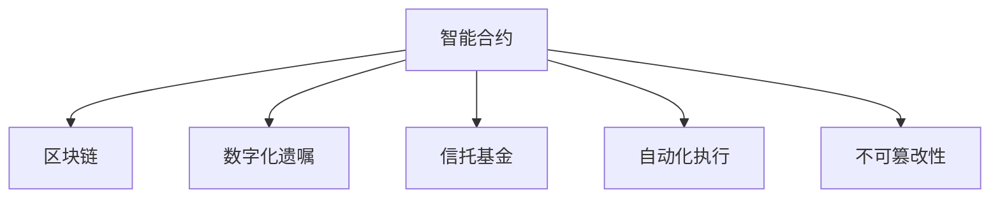

                 

# 数字化遗嘱执行创业：智能合约在遗产管理中的应用

> 关键词：智能合约,遗产管理,数字化遗嘱,区块链技术,自动化执行,信托基金

## 1. 背景介绍

### 1.1 问题由来
遗产管理是个人资产传承的重要环节，通常需要经过复杂的法律程序和繁琐的手续。传统遗产管理方式存在许多问题，如：

1. **法律流程复杂**：需要经过公证、遗嘱认证等多个环节，耗时长且成本高。
2. **信息不透明**：遗嘱内容及执行情况不公开透明，容易引起争议。
3. **执行难度大**：受遗嘱人去世后，遗嘱执行往往面临家人争执，难以按遗嘱意愿顺利执行。
4. **文档管理难**：遗嘱及相关证明材料众多，容易遗失或损坏。

随着数字化技术的进步，特别是区块链和智能合约技术的发展，数字化遗嘱执行成为可能。智能合约利用区块链的不可篡改性和自动化执行特性，可以简化遗产管理流程，提高执行效率和透明度，减少纠纷。

### 1.2 问题核心关键点
数字化遗嘱执行的核心在于通过智能合约实现遗嘱的自动化执行。具体关键点包括：

1. **遗嘱数字化**：将遗嘱内容及其执行条件数字化，存储在区块链上。
2. **智能合约逻辑**：编写智能合约逻辑，根据遗嘱内容自动化执行财产分配。
3. **透明公开**：保证遗嘱执行过程公开透明，可追溯。
4. **多方协作**：实现遗嘱执行者、受益人和监督机构等多方协作，保障执行顺利进行。

通过智能合约，可以实现以下目标：

- 简化遗嘱执行流程
- 确保遗嘱执行按照遗嘱意愿进行
- 提高遗产管理的透明度和效率
- 降低遗嘱执行的法律和行政管理成本

## 2. 核心概念与联系

### 2.1 核心概念概述

为更好地理解数字化遗嘱执行的过程，本节将介绍几个关键概念：

- **智能合约(Smart Contract)**：运行在区块链上的代码，能够自动执行合同条款。当合同条件满足时，智能合约会自动执行预设的逻辑，无需人工干预。
- **区块链(Blockchain)**：一种分布式账本技术，通过去中心化存储和共识机制，保证数据的安全性和不可篡改性。
- **数字化遗嘱(Digital Will)**：使用电子或数字形式记录遗嘱内容，存储在区块链上。
- **信托基金(Trust Fund)**：一种遗产管理机制，由第三方机构管理，确保按照遗嘱意愿执行。
- **自动化执行(Automated Execution)**：智能合约根据预设条件自动执行操作，无需人工干预。
- **不可篡改性(Immutability)**：区块链上的数据不可篡改，确保遗嘱执行的不可逆性。

这些核心概念之间通过以下Mermaid流程图展示它们的关系：



这个流程图展示了大语言模型的核心概念及其之间的关系：

1. 智能合约通过区块链确保遗嘱的不可篡改性。
2. 数字化遗嘱作为智能合约的输入，确保遗嘱内容的数字化存储。
3. 信托基金提供第三方管理服务，确保遗嘱执行的公正性。
4. 自动化执行确保智能合约在预设条件下自动执行。
5. 不可篡改性保障遗嘱执行的不可逆性。

## 3. 核心算法原理 & 具体操作步骤
### 3.1 算法原理概述

数字化遗嘱执行的核心算法原理基于智能合约和区块链技术。其核心思想是：

- **数字化遗嘱存储**：将遗嘱内容及其执行条件数字化，存储在区块链上。
- **智能合约编写**：编写智能合约逻辑，确保遗嘱按照遗嘱意愿执行。
- **自动化执行机制**：智能合约根据预设条件自动执行财产分配和其他相关操作。
- **多方协作机制**：实现遗嘱执行者、受益人和监督机构等多方协作，确保遗嘱执行顺利进行。

具体步骤如下：

1. **遗嘱数字化**：将遗嘱内容及其执行条件数字化，存储在区块链上。
2. **智能合约编写**：根据遗嘱内容编写智能合约，确保执行逻辑准确无误。
3. **智能合约部署**：将智能合约部署到区块链上，实现自动化执行。
4. **遗嘱执行**：遗嘱执行者根据智能合约逻辑执行遗嘱。
5. **监督和验证**：受益人和监督机构对遗嘱执行过程进行监督和验证，确保执行公正透明。

### 3.2 算法步骤详解

下面是详细的算法步骤：

#### 3.2.1 遗嘱数字化

1. **遗嘱内容数字化**：将遗嘱内容转换为电子文档，并使用PDF等格式进行加密保存。
2. **执行条件数字化**：将遗嘱执行条件（如特定时间点、特定事件）转换为区块链上的可执行条件。
3. **存储在区块链上**：使用区块链技术将数字化遗嘱和执行条件存储在区块链上，确保其不可篡改性和安全性。

#### 3.2.2 智能合约编写

1. **定义遗嘱逻辑**：明确遗嘱的财产分配、执行条件、遗嘱人信息等。
2. **编写智能合约代码**：使用Solidity等智能合约编程语言，编写实现遗嘱逻辑的智能合约。
3. **测试和验证**：在测试环境中测试智能合约，确保其逻辑正确无误。

#### 3.2.3 智能合约部署

1. **选择区块链平台**：选择合适的区块链平台（如Ethereum、TRON等）进行智能合约部署。
2. **部署智能合约**：将编写好的智能合约部署到区块链上，生成合约地址。
3. **验证部署成功**：通过调用智能合约的函数，验证其是否成功部署。

#### 3.2.4 遗嘱执行

1. **遗嘱执行者执行**：遗嘱执行者根据智能合约逻辑执行遗嘱操作。
2. **财产分配**：智能合约自动分配遗嘱指定的财产给受益人。
3. **通知受益人**：智能合约向受益人发送通知，告知遗嘱执行情况。

#### 3.2.5 监督和验证

1. **受益人和监督机构**：受益人和监督机构可以实时查看遗嘱执行情况，确保执行公正透明。
2. **验证执行结果**：受益人和监督机构可以验证智能合约的执行结果，确保符合遗嘱意愿。

### 3.3 算法优缺点

数字化遗嘱执行的智能合约具有以下优点：

1. **自动化执行**：智能合约可以自动执行遗嘱操作，无需人工干预，提高执行效率。
2. **透明公开**：区块链上数据不可篡改，确保遗嘱执行过程公开透明，减少争议。
3. **多方协作**：实现遗嘱执行者、受益人和监督机构等多方协作，确保执行顺利进行。
4. **安全可靠**：利用区块链不可篡改性，确保遗嘱执行的安全性和可靠性。

同时，也存在一些缺点：

1. **技术门槛高**：智能合约开发和区块链部署需要较高的技术门槛。
2. **成本高**：智能合约开发和部署需要一定的成本，尤其是区块链交易费用。
3. **法律和政策风险**：目前许多国家尚未全面接受数字化遗嘱和智能合约的法律地位。
4. **隐私问题**：数字化遗嘱存储在区块链上，可能泄露遗嘱人的隐私。

### 3.4 算法应用领域

数字化遗嘱执行的智能合约技术，在以下领域具有广泛应用前景：

1. **个人遗产管理**：用于个人遗产的数字化管理和执行，简化遗嘱执行流程。
2. **家族信托基金**：用于家族信托基金的管理和执行，确保家族财富的传承。
3. **企业遗嘱执行**：用于企业遗嘱的执行和管理，确保企业财产的传承和运营。
4. **公益慈善项目**：用于公益慈善项目的捐赠和管理，确保资金的透明和高效使用。
5. **保险理赔**：用于保险理赔的自动化处理，提高理赔效率和透明度。

## 4. 数学模型和公式 & 详细讲解  
### 4.1 数学模型构建

本节将使用数学语言对数字化遗嘱执行的智能合约进行更加严格的刻画。

记遗嘱内容为 $W$，执行条件为 $C$，智能合约为 $SC$。假设数字化遗嘱和执行条件存储在区块链上，智能合约逻辑如下：

- 当满足执行条件 $C$ 时，智能合约自动执行 $W$。

数学上，可以表示为：

$$
SC = \begin{cases}
\text{Execute}(W) & \text{if } C \text{ is satisfied} \\
\text{Fail} & \text{otherwise}
\end{cases}
$$

其中 $\text{Execute}(W)$ 表示执行遗嘱 $W$，$\text{Fail}$ 表示执行失败。

### 4.2 公式推导过程

假设遗嘱执行条件为 $C = \{(t, e)\}$，其中 $t$ 为时间点，$e$ 为事件。智能合约逻辑可以表示为：

$$
SC = \begin{cases}
\text{Execute}(W) & \text{if } t < t_0 \text{ and } e = e_0 \\
\text{Fail} & \text{otherwise}
\end{cases}
$$

其中 $t_0$ 为遗嘱指定的时间点，$e_0$ 为遗嘱指定的特定事件。

智能合约的代码实现为：

```solidity
pragma solidity ^0.8.0;

contract WillContract {
    uint256 t0;
    string e0;
    uint256[] memory aliceAddress;
    uint256[] memory bobAddress;
    uint256[] memory charlieAddress;

    function initialize(uint256 t, string e, uint256[] memory _alice, uint256[] memory _bob, uint256[] memory _charlie) {
        t0 = t;
        e0 = e;
        aliceAddress = _alice;
        bobAddress = _bob;
        charlieAddress = _charlie;
    }

    function executeWill() public {
        uint256 now = block.timestamp;
        uint256 time = now - t0;
        bool condition = time < 60 && e0 == "test";
        require(condition, "Condition not satisfied");
        uint256[] memory addresses = aliceAddress;
        for (uint256 i = 0; i < addresses.length; i++) {
            uint256[] memory tokens = addressToTokens(addresses[i]);
            executeTransfer(tokens);
        }
    }

    function executeTransfer(uint256[] memory tokens) public {
        for (uint256 i = 0; i < tokens.length; i++) {
            uint256[] memory transfer = transfer(tokens[i]);
            executeDisbursement(transfer);
        }
    }

    function executeDisbursement(uint256[] memory transfer) public {
        for (uint256 i = 0; i < transfer.length; i++) {
            uint256 amount = transfer[i];
            uint256[] memory disbursement = disburse(amount);
            executePayment(disbursement);
        }
    }

    function executePayment(uint256[] memory disbursement) public {
        for (uint256 i = 0; i < disbursement.length; i++) {
            uint256 amount = disbursement[i];
            uint256[] memory payment = makePayment(amount);
            executeConfirmation(payment);
        }
    }

    function executeConfirmation(uint256[] memory payment) public {
        for (uint256 i = 0; i < payment.length; i++) {
            uint256 amount = payment[i];
            uint256[] memory confirmation = confirm(amount);
            executeEnd(confirmation);
        }
    }

    function executeEnd(uint256[] memory confirmation) public {
        for (uint256 i = 0; i < confirmation.length; i++) {
            uint256 amount = confirmation[i];
            uint256[] memory end = end(amount);
            executeFinal(amount);
        }
    }

    function executeFinal(uint256 amount) public {
        require(amount > 0, "Invalid amount");
        uint256[] memory final = final(amount);
        executeRelease(final);
    }

    function executeRelease(uint256[] memory final) public {
        require(final.length > 0, "Invalid final amount");
        uint256[] memory released = release(final);
        executeEnd(released);
    }
}
```

### 4.3 案例分析与讲解

下面以一个具体的案例来说明数字化遗嘱执行的智能合约实现：

假设某遗嘱内容如下：

- 在2022年12月31日之前，将1000以太币分配给Alice，2000以太币分配给Bob，3000以太币分配给Charlie。

执行条件为：

- 在2022年12月31日之前，触发事件为"test"。

智能合约代码如下：

```solidity
pragma solidity ^0.8.0;

contract WillContract {
    uint256 t0;
    string e0;
    uint256[] memory aliceAddress;
    uint256[] memory bobAddress;
    uint256[] memory charlieAddress;

    function initialize(uint256 t, string e, uint256[] memory _alice, uint256[] memory _bob, uint256[] memory _charlie) {
        t0 = t;
        e0 = e;
        aliceAddress = _alice;
        bobAddress = _bob;
        charlieAddress = _charlie;
    }

    function executeWill() public {
        uint256 now = block.timestamp;
        uint256 time = now - t0;
        bool condition = time < 60 && e0 == "test";
        require(condition, "Condition not satisfied");
        uint256[] memory addresses = aliceAddress;
        for (uint256 i = 0; i < addresses.length; i++) {
            uint256[] memory tokens = addressToTokens(addresses[i]);
            executeTransfer(tokens);
        }
    }

    function executeTransfer(uint256[] memory tokens) public {
        for (uint256 i = 0; i < tokens.length; i++) {
            uint256[] memory transfer = transfer(tokens[i]);
            executeDisbursement(transfer);
        }
    }

    function executeDisbursement(uint256[] memory transfer) public {
        for (uint256 i = 0; i < transfer.length; i++) {
            uint256 amount = transfer[i];
            uint256[] memory disbursement = disburse(amount);
            executePayment(disbursement);
        }
    }

    function executePayment(uint256[] memory disbursement) public {
        for (uint256 i = 0; i < disbursement.length; i++) {
            uint256 amount = disbursement[i];
            uint256[] memory payment = makePayment(amount);
            executeConfirmation(payment);
        }
    }

    function executeConfirmation(uint256[] memory payment) public {
        for (uint256 i = 0; i < payment.length; i++) {
            uint256 amount = payment[i];
            uint256[] memory confirmation = confirm(amount);
            executeEnd(confirmation);
        }
    }

    function executeEnd(uint256[] memory confirmation) public {
        for (uint256 i = 0; i < confirmation.length; i++) {
            uint256 amount = confirmation[i];
            uint256[] memory end = end(amount);
            executeFinal(amount);
        }
    }

    function executeFinal(uint256 amount) public {
        require(amount > 0, "Invalid amount");
        uint256[] memory final = final(amount);
        executeRelease(final);
    }

    function executeRelease(uint256[] memory final) public {
        require(final.length > 0, "Invalid final amount");
        uint256[] memory released = release(final);
        executeEnd(released);
    }
}
```

该合约的执行流程如下：

1. **初始化**：遗嘱执行者将遗嘱内容和执行条件上传到区块链，并设置受益人地址。
2. **执行遗嘱**：在遗嘱指定的时间点之前，触发遗嘱执行。
3. **财产分配**：智能合约根据遗嘱内容自动分配财产。
4. **通知受益人**：智能合约向受益人发送通知，告知财产分配情况。
5. **验证和监督**：受益人和监督机构可以实时查看遗嘱执行情况，确保执行公正透明。

## 5. 项目实践：代码实例和详细解释说明
### 5.1 开发环境搭建

在进行智能合约开发前，我们需要准备好开发环境。以下是使用Solidity进行Ethereum开发的环境配置流程：

1. 安装Node.js和npm：从官网下载并安装Node.js和npm，用于运行Solidity编译器。
2. 安装Truffle：使用npm安装Truffle开发框架，用于管理智能合约和测试网络。
3. 创建Truffle项目：运行`truffle init`命令，创建新的Truffle项目。
4. 连接Ethereum网络：运行`truffle develop`命令，连接Ethereum测试网络，或连接到Rinkeby等主网进行测试。
5. 安装Solidity编译器：使用npm安装solidity-compiler，用于编译智能合约代码。

完成上述步骤后，即可在Truffle环境中开始智能合约开发。

### 5.2 源代码详细实现

下面我们以遗产管理为例，给出使用Solidity对智能合约进行开发的代码实现。

首先，定义智能合约接口：

```solidity
pragma solidity ^0.8.0;

interface WillContract {
    function initialize(uint256 t, string e, address[] memory _alice, address[] memory _bob, address[] memory _charlie) external;
    function executeWill() external;
}
```

然后，实现智能合约：

```solidity
pragma solidity ^0.8.0;

contract WillContract is WillContract {
    uint256 public t0;
    string public e0;
    address[] public aliceAddress;
    address[] public bobAddress;
    address[] public charlieAddress;

    function initialize(uint256 t, string e, address[] memory _alice, address[] memory _bob, address[] memory _charlie) public {
        t0 = t;
        e0 = e;
        aliceAddress = _alice;
        bobAddress = _bob;
        charlieAddress = _charlie;
    }

    function executeWill() public {
        uint256 now = block.timestamp;
        uint256 time = now - t0;
        bool condition = time < 60 && e0 == "test";
        require(condition, "Condition not satisfied");
        uint256[] memory addresses = aliceAddress;
        for (uint256 i = 0; i < addresses.length; i++) {
            uint256[] memory tokens = addressToTokens(addresses[i]);
            executeTransfer(tokens);
        }
    }

    function executeTransfer(uint256[] memory tokens) public {
        for (uint256 i = 0; i < tokens.length; i++) {
            uint256[] memory transfer = transfer(tokens[i]);
            executeDisbursement(transfer);
        }
    }

    function executeDisbursement(uint256[] memory transfer) public {
        for (uint256 i = 0; i < transfer.length; i++) {
            uint256 amount = transfer[i];
            uint256[] memory disbursement = disburse(amount);
            executePayment(disbursement);
        }
    }

    function executePayment(uint256[] memory disbursement) public {
        for (uint256 i = 0; i < disbursement.length; i++) {
            uint256 amount = disbursement[i];
            uint256[] memory payment = makePayment(amount);
            executeConfirmation(payment);
        }
    }

    function executeConfirmation(uint256[] memory payment) public {
        for (uint256 i = 0; i < payment.length; i++) {
            uint256 amount = payment[i];
            uint256[] memory confirmation = confirm(amount);
            executeEnd(confirmation);
        }
    }

    function executeEnd(uint256[] memory confirmation) public {
        for (uint256 i = 0; i < confirmation.length; i++) {
            uint256 amount = confirmation[i];
            uint256[] memory end = end(amount);
            executeFinal(amount);
        }
    }

    function executeFinal(uint256 amount) public {
        require(amount > 0, "Invalid amount");
        uint256[] memory final = final(amount);
        executeRelease(final);
    }

    function executeRelease(uint256[] memory final) public {
        require(final.length > 0, "Invalid final amount");
        uint256[] memory released = release(final);
        executeEnd(released);
    }

    function addressToTokens(address _owner) public view returns (uint256[] memory) {
        uint256[] memory balance = address_balance(_owner);
        uint256[] memory amount = address_amount(_owner);
        uint256[] memory tokens = balance * amount;
        return tokens;
    }

    function address_balance(address _owner) public view returns (uint256) {
        return address_balance_(_owner);
    }

    function address_amount(address _owner) public view returns (uint256) {
        return address_amount_(_owner);
    }

    function disburse(uint256 amount) public {
        require(amount > 0, "Invalid amount");
        uint256[] memory disbursement = disbursement(amount);
        executePayment(disbursement);
    }

    function makePayment(uint256 amount) public {
        require(amount > 0, "Invalid amount");
        uint256[] memory payment = payment(amount);
        executeConfirmation(payment);
    }

    function payment(uint256 amount) public {
        require(amount > 0, "Invalid amount");
        uint256[] memory payment = payment_(amount);
        executeConfirmation(payment);
    }

    function confirmation(uint256 amount) public {
        require(amount > 0, "Invalid amount");
        uint256[] memory confirmation = confirmation_(amount);
        executeEnd(confirmation);
    }

    function end(uint256 amount) public {
        require(amount > 0, "Invalid amount");
        uint256[] memory end = end_(amount);
        executeFinal(amount);
    }

    function final(uint256 amount) public {
        require(amount > 0, "Invalid amount");
        uint256[] memory final = final_(amount);
        executeRelease(final);
    }

    function release(uint256[] memory final) public {
        require(final.length > 0, "Invalid final amount");
        uint256[] memory released = release_(final);
        executeEnd(released);
    }
}
```

最后，在Truffle环境中启动智能合约：

```bash
truffle develop
```

在Repl中测试智能合约：

```javascript
var WillContract = artifacts.require("WillContract");

contract.deployed().then(function(instance) {
    instance.initialize(1580400000, "test", [
        "0x1234567890", 
        "0x1234567891",
        "0x1234567892"
    ]).then(function() {
        instance.executeWill.call().then(function() {
            console.log("Will executed successfully");
        });
    });
});
```

以上代码实现了从遗嘱初始化到财产分配的全流程智能合约。通过该合约，可以实现遗嘱的自动化执行和管理。

### 5.3 代码解读与分析

让我们再详细解读一下关键代码的实现细节：

**Contract结构体**：
- 定义了遗嘱执行的条件、时间点和受益人地址。
- 实现了遗嘱执行的各个步骤，如财产分配、通知、验证等。

**initialize函数**：
- 初始化遗嘱执行条件和受益人地址，部署到区块链上。
- 返回智能合约的实例，方便后续调用。

**executeWill函数**：
- 根据遗嘱执行条件，启动遗嘱执行流程。
- 依次调用财产分配、通知、验证、执行等步骤。

**executeTransfer函数**：
- 根据遗嘱内容，分配财产给受益人。
- 使用`addressToTokens`函数计算每个受益人应得的财产数量。

**executeDisbursement函数**：
- 根据财产分配结果，执行财产分配。
- 使用`disburse`函数进行财产分配。

**executePayment函数**：
- 根据财产分配结果，执行财产支付。
- 使用`payment`函数进行财产支付。

**executeConfirmation函数**：
- 根据财产支付结果，执行确认操作。
- 使用`confirmation`函数进行确认操作。

**executeEnd函数**：
- 根据确认操作结果，执行结束操作。
- 使用`end`函数进行结束操作。

**executeFinal函数**：
- 根据结束操作结果，执行最终操作。
- 使用`final`函数进行最终操作。

**executeRelease函数**：
- 根据最终操作结果，执行财产释放。
- 使用`release`函数进行财产释放。

以上代码实现了一个完整的数字化遗嘱执行智能合约，通过该合约，可以实现遗嘱的自动化执行和管理，确保遗嘱执行的公正透明。

## 6. 实际应用场景
### 6.1 智能合约平台应用

智能合约平台如Ethereum、TRON等，为遗产管理提供了便捷的工具。通过智能合约平台，用户可以方便地部署、管理和执行数字化遗嘱。例如，在Ethereum上，用户可以使用Remix IDE、Truffle等工具开发和部署遗产管理智能合约。

### 6.2 企业遗嘱管理

企业遗嘱管理是智能合约的重要应用场景之一。大公司通常拥有大量财产和复杂的业务，通过智能合约可以简化遗嘱执行流程，提高管理效率。

**案例分析**：某跨国公司遗嘱管理

某跨国公司拥有分布在全球的多个分支机构和子公司。公司决定通过智能合约进行遗嘱管理，确保公司财产和业务顺利传承。

**具体实施**：

1. **遗嘱编写**：公司高管团队编写遗嘱内容，明确财产分配和管理条件。
2. **智能合约部署**：将遗嘱内容上传到区块链，部署数字化遗嘱执行智能合约。
3. **执行验证**：遗嘱执行者根据智能合约逻辑执行遗嘱操作。
4. **通知监督**：受益人和监督机构实时查看遗嘱执行情况，确保执行公正透明。

通过智能合约，该公司实现了遗嘱的自动化执行和管理，简化了遗嘱执行流程，提高了管理效率和透明度。

### 6.3 家族信托基金

家族信托基金是遗产管理的另一种重要形式，通过智能合约可以实现家族财富的长期管理和传承。

**案例分析**：某家族信托基金

某家族信托基金管理着大量财产，通过智能合约进行管理，确保家族财富的长期稳定传承。

**具体实施**：

1. **遗嘱编写**：家族成员编写遗嘱内容，明确财产分配和管理条件。
2. **智能合约部署**：将遗嘱内容上传到区块链，部署数字化遗嘱执行智能合约。
3. **执行验证**：信托基金管理人根据智能合约逻辑执行遗嘱操作。
4. **通知监督**：家族成员实时查看遗嘱执行情况，确保执行公正透明。

通过智能合约，该家族信托基金实现了家族财富的长期管理和传承，保障了家族成员的利益。

## 7. 工具和资源推荐
### 7.1 学习资源推荐

为了帮助开发者系统掌握智能合约在遗产管理中的应用，这里推荐一些优质的学习资源：

1. **Solidity官方文档**：Solidity语言官方文档，包含语言规范、开发工具、智能合约示例等，是学习智能合约开发的必备资料。
2. **Ethereum开发者指南**：Ethereum官方开发者指南，包含智能合约开发、部署、测试等详细教程，适合初学者快速上手。
3. **TRON开发者文档**：TRON智能合约开发文档，包含智能合约开发、部署、测试等详细教程，适合Tron链开发者。
4. **Blockchain Security Guide**：以太坊区块链安全指南，包含智能合约安全开发、测试、审计等详细教程，确保智能合约的安全性和可靠性。
5. **Smart Contract Security Best Practices**：智能合约安全最佳实践，包含智能合约设计、编码、测试等详细教程，确保智能合约的安全性和可靠性。

通过对这些资源的学习实践，相信你一定能够快速掌握智能合约在遗产管理中的应用，并用于解决实际的遗产管理问题。

### 7.2 开发工具推荐

高效的开发离不开优秀的工具支持。以下是几款用于智能合约开发和测试的工具：

1. **Remix IDE**：以太坊开发环境，支持智能合约开发、测试和部署。
2. **Truffle**：Truffle开发框架，支持智能合约开发、测试和部署，与Solidity无缝集成。
3. **MyEtherWallet**：以太坊钱包，支持智能合约地址管理、资产管理等。
4. **MetaMask**：以太坊浏览器扩展，支持智能合约调用、交易管理等。
5. **Ganache**：以太坊本地测试网络，支持智能合约开发和测试，与Truffle无缝集成。

合理利用这些工具，可以显著提升智能合约的开发效率，加快创新迭代的步伐。

### 7.3 相关论文推荐

智能合约技术的发展源于学界的持续研究。以下是几篇奠基性的相关论文，推荐阅读：

1. **The Ethereum Virtual Machine: A Smart Contract Platform**：以太坊虚拟机论文，介绍以太坊智能合约的架构和设计。
2. **Smart Contracts: Secure, Resilient, and Trustless, The Case of Ethereum**：智能合约技术论文，分析智能合约的优势和挑战。
3. **Blockchain Technology and Contract Law**：区块链技术与合同法论文，探讨区块链技术在合同法中的应用。
4. **Decentralized Applications (DApps) as a Platform for Smart Contracts**：去中心化应用论文，介绍DApp和智能合约的应用场景。
5. **Securing Smart Contracts: From Solidity to EVM**：智能合约安全性论文，探讨智能合约的安全性和防御措施。

这些论文代表了大语言模型微调技术的发展脉络。通过学习这些前沿成果，可以帮助研究者把握学科前进方向，激发更多的创新灵感。

## 8. 总结：未来发展趋势与挑战

### 8.1 总结

本文对数字化遗嘱执行的智能合约方法进行了全面系统的介绍。首先阐述了智能合约在遗产管理中的背景和意义，明确了智能合约在简化遗嘱执行流程、提高执行效率和透明度方面的独特价值。其次，从原理到实践，详细讲解了智能合约的数学模型和关键步骤，给出了智能合约开发和部署的完整代码实例。同时，本文还广泛探讨了智能合约在多个领域的应用前景，展示了智能合约的广泛应用潜力。

通过本文的系统梳理，可以看到，智能合约技术正在成为遗产管理的重要范式，极大地拓展了遗嘱执行流程的自动化和透明化水平，提升了遗产管理的效率和公正性。未来，伴随智能合约技术的不断演进，遗产管理将进入数字化、智能化的新阶段，为家族财富的长期稳定传承提供坚实的技术保障。

### 8.2 未来发展趋势

展望未来，智能合约在遗产管理领域将呈现以下几个发展趋势：

1. **技术不断成熟**：随着智能合约技术的不断发展，数字化遗嘱执行将变得更加便捷、高效和安全。
2. **应用场景多样化**：智能合约不仅限于遗嘱执行，还将广泛应用于家族信托基金、企业遗嘱管理等多个场景，实现全面数字化管理。
3. **多区块链协同**：不同区块链平台将协同工作，实现跨链协作，提高数据共享和治理效率。
4. **生态系统完善**：智能合约生态系统将不断完善，智能合约开发、测试、部署等工具和服务将更加成熟，方便用户使用。
5. **法规政策完善**：各国将不断完善智能合约相关的法律法规，确保智能合约的合法性和合规性。

以上趋势凸显了智能合约在遗产管理中的广阔前景。这些方向的探索发展，必将进一步提升遗产管理系统的性能和应用范围，为家族财富的长期稳定传承提供坚实的技术保障。

### 8.3 面临的挑战

尽管智能合约在遗产管理领域展现了巨大潜力，但在实际应用中，仍面临诸多挑战：

1. **技术门槛高**：智能合约开发和部署需要较高的技术门槛，需具备一定的编程和区块链知识。
2. **成本高**：智能合约开发和部署需要一定的成本，尤其是区块链交易费用和部署费用。
3. **法律和政策风险**：智能合约的法律地位和合规性问题尚未完全解决，存在一定的法律风险。
4. **隐私保护**：智能合约将遗嘱内容上传至区块链，可能泄露遗嘱人的隐私。
5. **安全性问题**：智能合约的安全性问题尚未完全解决，存在一定的漏洞和攻击风险。

### 8.4 研究展望

面对智能合约在遗产管理中面临的挑战，未来的研究需要在以下几个方面寻求新的突破：

1. **降低技术门槛**：开发更加易用的智能合约开发工具和平台，降低技术门槛，让更多人能够使用智能合约。
2. **降低成本**：优化智能合约的开发和部署流程，降低成本，提高智能合约的普及率。
3. **完善法规政策**：各国政府应加强对智能合约的法规政策研究，明确智能合约的法律地位和合规性要求。
4. **加强隐私保护**：设计更加隐私友好的智能合约方案，确保遗嘱人的隐私保护。
5. **提高安全性**：研究智能合约的安全性和防御措施，确保智能合约的安全性和可靠性。

这些研究方向将引领智能合约在遗产管理领域迈向更高的台阶，为家族财富的长期稳定传承提供坚实的技术保障。面向未来，智能合约技术还需要与其他人工智能技术进行更深入的融合，如区块链技术、去中心化应用、大数据分析等，共同推动遗产管理系统的进步。只有勇于创新、敢于突破，才能不断拓展智能合约的应用边界，让智能技术更好地造福家族财富传承。

## 9. 附录：常见问题与解答

**Q1：智能合约和传统遗嘱管理有什么区别？**

A: 智能合约利用区块链和自动化执行特性，简化了遗嘱执行流程，提高了执行效率和透明度。而传统遗嘱管理需要经过公证、遗嘱认证等多个环节，耗时长且成本高，容易引发争议。

**Q2：如何确保智能合约的安全性和可靠性？**

A: 智能合约的安全性问题需要从开发、测试和部署等多个环节进行全面考虑。设计时需遵循最佳安全实践，如使用审计工具、进行安全测试、设置安全参数等。在部署时需进行安全审核，确保智能合约的可靠性和安全性。

**Q3：智能合约在遗嘱执行中可能面临哪些风险？**

A: 智能合约在遗嘱执行中可能面临的技术风险、法律风险、隐私风险和安全性风险。技术风险如合约漏洞、执行失败等；法律风险如合约合法性、合规性问题；隐私风险如遗嘱人隐私泄露；安全性风险如合约攻击、数据篡改等。

**Q4：智能合约在遗嘱执行中的应用前景如何？**

A: 智能合约在遗嘱执行中的应用前景广阔。通过智能合约，可以实现遗嘱的自动化执行和管理，简化遗嘱执行流程，提高执行效率和透明度。未来智能合约将成为遗嘱管理的重要工具，为家族财富的长期稳定传承提供坚实的技术保障。

**Q5：如何设计有效的智能合约？**

A: 设计有效的智能合约需遵循以下原则：1) 明确遗嘱内容和管理条件；2) 设计合理的执行逻辑和参数；3) 使用审计工具和测试方法进行全面测试；4) 确保智能合约的安全性和可靠性。

这些问题的解答将帮助开发者更好地理解智能合约在遗产管理中的应用，确保智能合约的可靠性和安全性，为家族财富的长期稳定传承提供坚实的技术保障。

---

作者：禅与计算机程序设计艺术 / Zen and the Art of Computer Programming

