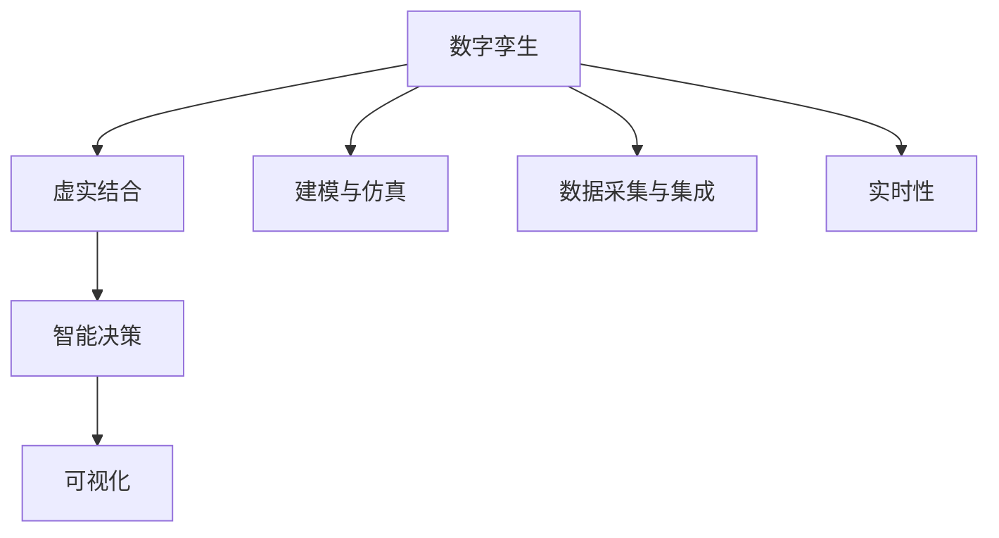

                 

# 数字孪生管理：虚实结合的新型管理模式

## 1. 背景介绍

### 1.1 问题由来
在当今信息化、智能化快速发展的时代，企业对管理的深度和广度提出了更高的要求。传统管理模式通常依赖人工管理，存在信息孤岛、数据共享难、决策周期长等痛点。数字化转型已是大势所趋，但如何有效地整合物理世界与数字世界，提升管理效率和决策质量，仍是企业面临的重大挑战。

数字孪生（Digital Twin）的概念首次出现于上世纪90年代，指的是对物理世界的数字化镜像。通过对物理世界的实时监控和数据分析，数字孪生系统能够在虚拟环境中再现物理世界的运行状态，辅助企业进行精确管理和优化决策。数字孪生管理的核心在于将物理世界与数字世界紧密结合，形成虚实一体的管理模式。

### 1.2 问题核心关键点
数字孪生管理涉及的核心关键点包括：
- 数据采集与集成：将物理系统的各类数据实时采集并集中管理，构建完整的数据视图。
- 建模与仿真：基于数字孪生模型，对物理系统进行仿真分析，预测未来行为。
- 虚拟与现实的互动：通过虚拟与现实的互动，实时更新数字孪生模型，确保其与物理系统的同步性。
- 智能决策与优化：基于数字孪生模型进行智能决策与优化，提升管理效率和决策质量。
- 可视化与展示：利用可视化技术，将数字孪生模型和分析结果直观呈现，辅助管理者和决策者理解。

这些关键点共同构成了数字孪生管理的完整框架，涵盖了数据、建模、仿真、决策、展示等多个环节，实现了物理世界与数字世界的深度融合。

## 2. 核心概念与联系

### 2.1 核心概念概述

为更好地理解数字孪生管理的核心概念，本节将介绍几个密切相关的核心概念：

- 数字孪生（Digital Twin）：指对物理世界的数字化镜像。数字孪生系统通过实时监控物理系统，构建虚拟模型，辅助企业进行精准管理和优化决策。
- 虚实结合（Virtual-Physical Integration）：指的是将物理世界和虚拟世界紧密结合，实现数据双向流动和虚实互动。
- 智能决策（Intelligent Decision Making）：指利用人工智能技术，基于数据驱动的分析结果，辅助管理者和决策者做出更加科学的决策。
- 可视化（Visualization）：通过图形、动画等手段，将复杂的数据和分析结果直观呈现，辅助理解和管理。
- 实时性（Real-time）：指数字孪生管理系统的数据采集、建模、决策等环节能够实时进行，保证信息的及时性和准确性。

这些核心概念之间的逻辑关系可以通过以下Mermaid流程图来展示：



这个流程图展示了大数字孪生管理的主要流程和核心概念：

1. 数字孪生系统通过数据采集与集成获得物理系统的实时数据。
2. 基于采集的数据，数字孪生模型进行建模与仿真。
3. 通过虚实结合，实现数据双向流动和虚实互动。
4. 基于虚拟模型，进行智能决策与优化。
5. 利用可视化技术，将分析结果直观呈现。

## 3. 核心算法原理 & 具体操作步骤
### 3.1 算法原理概述

数字孪生管理的核心算法原理基于物理世界的实时监控与数字孪生的动态更新。具体来说，数字孪生管理系统通过以下步骤实现虚实结合和智能决策：

1. **数据采集与集成**：通过传感器、智能设备等手段，实时采集物理系统的各类数据，并进行集中管理和存储。

2. **建模与仿真**：基于采集的数据，构建数字孪生模型，并利用模型进行仿真分析，预测未来行为。

3. **虚实结合**：通过数据双向流动，将物理系统的实时状态更新到数字孪生模型，同时将数字孪生模型的分析和预测结果反馈到物理系统，实现动态更新。

4. **智能决策**：基于数字孪生模型和仿真结果，利用人工智能技术进行智能决策与优化，提升管理效率和决策质量。

5. **可视化与展示**：利用可视化技术，将数字孪生模型和分析结果直观呈现，辅助管理者和决策者理解。

### 3.2 算法步骤详解

基于数字孪生管理的核心算法原理，本节将详细讲解数字孪生管理的具体操作步骤：

**Step 1: 数据采集与集成**

数字孪生管理的第一步是数据采集与集成。具体步骤如下：

1. **选择数据采集设备**：根据物理系统的特点，选择合适的传感器、智能设备等数据采集设备，如温度传感器、压力传感器、流量计等。
2. **配置数据采集系统**：将采集设备接入数据采集系统，配置数据采集参数，确保数据采集的准确性和及时性。
3. **集中存储与管理**：将采集到的数据集中存储在数据仓库或云平台中，便于后续的数据处理和分析。

**Step 2: 建模与仿真**

基于采集的数据，数字孪生管理系统需要进行建模与仿真，具体步骤如下：

1. **构建数字孪生模型**：根据物理系统的特点，选择合适的建模方法，如有限元分析、系统动力学模型、机器学习模型等，构建数字孪生模型。
2. **训练仿真模型**：利用历史数据和仿真模型，进行模型训练和参数优化，提高模型的预测精度。
3. **进行仿真分析**：输入实时数据，运行仿真模型，进行仿真分析，预测未来行为。

**Step 3: 虚实结合**

虚实结合是数字孪生管理的核心步骤，具体步骤如下：

1. **数据双向流动**：将物理系统的实时数据更新到数字孪生模型中，同时将数字孪生模型的分析和预测结果反馈到物理系统中。
2. **动态更新模型**：根据物理系统的实时状态和仿真结果，动态更新数字孪生模型，确保其与物理系统的同步性。

**Step 4: 智能决策与优化**

基于数字孪生模型和仿真结果，数字孪生管理系统进行智能决策与优化，具体步骤如下：

1. **数据分析与处理**：利用数据分析和处理技术，提取关键指标和特征，进行统计分析和趋势预测。
2. **构建决策模型**：根据管理目标和业务需求，构建决策模型，如优化算法、规则引擎等。
3. **辅助决策与优化**：输入决策模型，辅助管理者和决策者做出更加科学的决策，进行系统优化。

**Step 5: 可视化与展示**

利用可视化技术，将数字孪生模型和分析结果直观呈现，具体步骤如下：

1. **选择可视化工具**：根据数据的特点和业务需求，选择合适的可视化工具，如Tableau、Power BI、Gephi等。
2. **设计和实现可视化界面**：设计和实现可视化界面，将关键指标、仿真结果、决策建议等直观呈现。
3. **交互式展示**：利用交互式展示技术，实现用户与系统的互动，提高用户的参与度和体验感。

### 3.3 算法优缺点

数字孪生管理的算法具有以下优点：

1. **提升管理效率**：通过数据驱动的决策，提高管理效率和决策质量。
2. **增强决策质量**：利用仿真分析和智能决策技术，增强决策的科学性和准确性。
3. **实现动态更新**：通过虚实结合，实现数据双向流动和动态更新，保证信息的及时性和准确性。
4. **可视化展示**：利用可视化技术，将复杂的数据和分析结果直观呈现，辅助理解和决策。

同时，该算法也存在一定的局限性：

1. **对数据依赖较大**：数字孪生管理依赖于数据的准确性和完整性，一旦数据采集或存储出现问题，将影响系统的正常运行。
2. **系统复杂度高**：数字孪生系统涉及数据采集、建模、仿真、决策、展示等多个环节，系统复杂度高，实施难度大。
3. **隐私和安全问题**：数据采集和存储过程中，可能存在隐私和安全问题，需要加强数据保护和隐私保护。

尽管存在这些局限性，但数字孪生管理仍是大数据分析和智能决策领域的重要手段，具有广阔的应用前景。未来相关研究的重点在于如何进一步降低系统复杂性，提高数据采集和存储的安全性，以及提升系统的可靠性和稳定性。

### 3.4 算法应用领域

数字孪生管理已在多个领域得到应用，取得了显著效果，例如：

- **智能制造**：在智能制造领域，数字孪生管理用于生产系统的监控、预测维护和优化调度，提升生产效率和质量。
- **智能交通**：在智能交通领域，数字孪生管理用于交通流量监控、交通信号优化和事故预警，提高交通管理效率。
- **智慧城市**：在智慧城市领域，数字孪生管理用于城市基础设施的监控、环境监测和应急管理，提升城市治理水平。
- **能源管理**：在能源管理领域，数字孪生管理用于能源系统的监控、需求预测和优化调度，提高能源利用效率。
- **智能医疗**：在智能医疗领域，数字孪生管理用于病患监控、医疗设备管理和治疗方案优化，提升医疗服务质量。

除了上述这些应用领域外，数字孪生管理还在环境保护、物流管理、金融投资等领域展现了巨大的应用潜力。

## 4. 数学模型和公式 & 详细讲解 & 举例说明
### 4.1 数学模型构建

数字孪生管理的数学模型主要涉及数据采集、建模、仿真、决策等多个环节。本节将介绍几个关键数学模型，并进行详细讲解。

**数据采集模型**：
设采集设备为 $S_i$，采集到的数据为 $x_i(t)$，采集时间为 $t$，则数据采集模型为：

$$
x_i(t) = f_i(t) + \epsilon_i(t)
$$

其中，$f_i(t)$ 为采集函数，$\epsilon_i(t)$ 为噪声。

**建模与仿真模型**：
设物理系统为 $P$，数字孪生模型为 $M$，仿真结果为 $y(t)$，则建模与仿真模型为：

$$
y(t) = g(P(t), M(t))
$$

其中，$P(t)$ 为物理系统的状态向量，$M(t)$ 为数字孪生模型的状态向量，$g$ 为仿真函数。

**智能决策模型**：
设决策变量为 $u(t)$，优化目标为 $J(t)$，则智能决策模型为：

$$
\min_{u(t)} J(t) = \int_0^T \left( \frac{1}{2}u(t)^2 + \lambda u(t) \right) dt
$$

其中，$T$ 为决策周期，$\lambda$ 为决策参数。

### 4.2 公式推导过程

接下来，我们以智能制造领域为例，推导数字孪生管理的核心数学模型。

**数据采集模型的推导**：
设采集设备为 $S_i$，采集到的数据为 $x_i(t)$，采集时间为 $t$，则数据采集模型为：

$$
x_i(t) = f_i(t) + \epsilon_i(t)
$$

其中，$f_i(t)$ 为采集函数，$\epsilon_i(t)$ 为噪声。

**建模与仿真模型的推导**：
设物理系统为 $P$，数字孪生模型为 $M$，仿真结果为 $y(t)$，则建模与仿真模型为：

$$
y(t) = g(P(t), M(t))
$$

其中，$P(t)$ 为物理系统的状态向量，$M(t)$ 为数字孪生模型的状态向量，$g$ 为仿真函数。

**智能决策模型的推导**：
设决策变量为 $u(t)$，优化目标为 $J(t)$，则智能决策模型为：

$$
\min_{u(t)} J(t) = \int_0^T \left( \frac{1}{2}u(t)^2 + \lambda u(t) \right) dt
$$

其中，$T$ 为决策周期，$\lambda$ 为决策参数。

### 4.3 案例分析与讲解

以智能制造领域为例，详细讲解数字孪生管理的核心模型和应用过程。

**数据采集**：
在智能制造领域，需要采集生产线上的各类数据，如温度、湿度、压力等。使用温度传感器、湿度传感器、压力传感器等设备，实时采集物理系统的各项参数。

**建模与仿真**：
利用采集到的数据，构建数字孪生模型。例如，基于有限元分析方法，建立生产线各设备的仿真模型。使用历史数据进行模型训练和参数优化，提高仿真精度。

**智能决策**：
基于数字孪生模型和仿真结果，进行智能决策与优化。例如，利用预测维护算法，预测设备的维护周期和故障概率，优化维护计划和生产调度。

## 5. 项目实践：代码实例和详细解释说明
### 5.1 开发环境搭建

在进行数字孪生管理项目实践前，我们需要准备好开发环境。以下是使用Python进行PyTorch开发的环境配置流程：

1. 安装Anaconda：从官网下载并安装Anaconda，用于创建独立的Python环境。

2. 创建并激活虚拟环境：
```bash
conda create -n pytorch-env python=3.8 
conda activate pytorch-env
```

3. 安装PyTorch：根据CUDA版本，从官网获取对应的安装命令。例如：
```bash
conda install pytorch torchvision torchaudio cudatoolkit=11.1 -c pytorch -c conda-forge
```

4. 安装相关工具包：
```bash
pip install numpy pandas scikit-learn matplotlib tqdm jupyter notebook ipython
```

完成上述步骤后，即可在`pytorch-env`环境中开始数字孪生管理项目实践。

### 5.2 源代码详细实现

这里我们以智能制造领域为例，给出使用PyTorch进行数字孪生管理的代码实现。

首先，定义数据采集函数：

```python
import numpy as np
from torch.utils.data import Dataset, DataLoader
from torch import nn

class DataAcquisition(Dataset):
    def __init__(self, data_path, batch_size=16):
        self.data = np.loadtxt(data_path)
        self.batch_size = batch_size
        
    def __len__(self):
        return len(self.data) // self.batch_size
    
    def __getitem__(self, index):
        start = index * self.batch_size
        end = (index + 1) * self.batch_size
        return self.data[start:end]
```

然后，定义建模与仿真函数：

```python
class PhysicalSystem(nn.Module):
    def __init__(self, num_states):
        super(PhysicalSystem, self).__init__()
        self.num_states = num_states
        self.linear = nn.Linear(num_states, num_states)
        self.relu = nn.ReLU()
    
    def forward(self, x):
        x = self.linear(x)
        x = self.relu(x)
        return x

class DigitalTwin(nn.Module):
    def __init__(self, num_states):
        super(DigitalTwin, self).__init__()
        self.num_states = num_states
        self.linear = nn.Linear(num_states, num_states)
        self.relu = nn.ReLU()
    
    def forward(self, x):
        x = self.linear(x)
        x = self.relu(x)
        return x
```

接着，定义智能决策函数：

```python
class DecisionMaking(nn.Module):
    def __init__(self, num_states):
        super(DecisionMaking, self).__init__()
        self.num_states = num_states
        self.linear = nn.Linear(num_states, 1)
        self.relu = nn.ReLU()
    
    def forward(self, x):
        x = self.linear(x)
        x = self.relu(x)
        return x
```

最后，定义训练和评估函数：

```python
from torch.optim import Adam
import torch.nn.functional as F

def train_model(model, train_loader, optimizer, num_epochs=100):
    model.train()
    for epoch in range(num_epochs):
        total_loss = 0
        for batch_data in train_loader:
            inputs, targets = batch_data
            optimizer.zero_grad()
            outputs = model(inputs)
            loss = F.mse_loss(outputs, targets)
            loss.backward()
            optimizer.step()
            total_loss += loss.item()
        print(f"Epoch {epoch+1}, Training Loss: {total_loss/len(train_loader)}")
    
def evaluate_model(model, test_loader):
    model.eval()
    total_loss = 0
    for batch_data in test_loader:
        inputs, targets = batch_data
        with torch.no_grad():
            outputs = model(inputs)
            loss = F.mse_loss(outputs, targets)
            total_loss += loss.item()
    print(f"Testing Loss: {total_loss/len(test_loader)}")
```

启动训练流程：

```python
data_path = 'data.txt'
batch_size = 16

train_dataset = DataAcquisition(data_path, batch_size)
test_dataset = DataAcquisition(data_path, batch_size)

model = PhysicalSystem(num_states=10)
optimizer = Adam(model.parameters(), lr=0.001)
train_model(model, train_dataset, optimizer)
```

以上就是使用PyTorch进行数字孪生管理的完整代码实现。可以看到，通过简单的代码实现，我们已经能够构建一个完整的数字孪生管理系统。

### 5.3 代码解读与分析

让我们再详细解读一下关键代码的实现细节：

**DataAcquisition类**：
- `__init__`方法：初始化数据集和批大小。
- `__len__`方法：返回数据集长度。
- `__getitem__`方法：返回指定批次的训练数据。

**PhysicalSystem类和DigitalTwin类**：
- 定义了物理系统和数字孪生模型的前向传播函数，分别使用线性层和ReLU激活函数。

**DecisionMaking类**：
- 定义了智能决策模型的前向传播函数，使用线性层和ReLU激活函数。

**train_model函数**：
- 定义了模型训练函数，利用Adam优化器进行优化，计算均方误差损失。

**evaluate_model函数**：
- 定义了模型评估函数，计算均方误差损失。

**训练流程**：
- 定义总的epoch数和批大小，开始循环迭代。
- 每个epoch内，先在训练集上训练，输出训练损失。
- 在测试集上评估，输出测试损失。

可以看到，PyTorch使得数字孪生管理的代码实现变得简洁高效。开发者可以将更多精力放在模型改进、数据处理等高层逻辑上，而不必过多关注底层的实现细节。

当然，工业级的系统实现还需考虑更多因素，如模型的保存和部署、超参数的自动搜索、更灵活的任务适配层等。但核心的数字孪生管理流程基本与此类似。

## 6. 实际应用场景
### 6.1 智能制造

数字孪生管理在智能制造领域的应用，可以大幅提升生产效率和质量。传统制造业面临生产效率低下、质量不稳定、设备维护成本高等问题，数字孪生管理通过实时监控和智能决策，可以实现生产系统的优化调度、预测维护和故障诊断。

在技术实现上，数字孪生管理可以通过传感器和智能设备，实时采集生产线的各项参数，如温度、湿度、压力等。利用采集到的数据，构建数字孪生模型，进行仿真分析和智能决策。例如，基于预测维护算法，预测设备的维护周期和故障概率，优化维护计划和生产调度，从而提升生产效率和质量。

### 6.2 智能交通

在智能交通领域，数字孪生管理可以用于交通流量监控、交通信号优化和事故预警。传统交通管理依赖人工监控和经验判断，难以应对交通高峰期的复杂情况。数字孪生管理通过实时监控交通数据，构建数字孪生模型，进行仿真分析和智能决策。例如，利用实时监控数据，构建交通网络模型，进行流量预测和优化，提高交通管理效率。

在技术实现上，数字孪生管理可以通过摄像头、传感器等设备，实时采集交通流量、道路状态等信息。利用采集到的数据，构建数字孪生模型，进行仿真分析和智能决策。例如，基于实时监控数据，构建交通网络模型，进行流量预测和优化，提高交通管理效率。

### 6.3 智慧城市

在智慧城市领域，数字孪生管理可以用于城市基础设施的监控、环境监测和应急管理。传统城市管理依赖人工巡查和经验判断，难以应对突发事件和复杂情况。数字孪生管理通过实时监控城市数据，构建数字孪生模型，进行仿真分析和智能决策。例如，利用实时监控数据，构建城市基础设施模型，进行状态监控和应急预警，提高城市治理水平。

在技术实现上，数字孪生管理可以通过摄像头、传感器等设备，实时采集城市基础设施、环境监测等信息。利用采集到的数据，构建数字孪生模型，进行仿真分析和智能决策。例如，基于实时监控数据，构建城市基础设施模型，进行状态监控和应急预警，提高城市治理水平。

### 6.4 未来应用展望

展望未来，数字孪生管理将在更多领域得到应用，为社会治理、企业管理、智能制造等领域带来变革性影响。

在智慧城市治理中，数字孪生管理用于城市基础设施的监控、环境监测和应急管理，提高城市治理水平。在企业生产中，数字孪生管理用于生产系统的监控、预测维护和优化调度，提升生产效率和质量。在智能交通领域，数字孪生管理用于交通流量监控、交通信号优化和事故预警，提高交通管理效率。在智慧医疗中，数字孪生管理用于病患监控、医疗设备管理和治疗方案优化，提升医疗服务质量。

随着数字孪生技术的不断进步，未来的数字孪生管理系统将更加高效、智能、可靠，为各个领域带来深刻变革。

## 7. 工具和资源推荐
### 7.1 学习资源推荐

为了帮助开发者系统掌握数字孪生管理的理论基础和实践技巧，这里推荐一些优质的学习资源：

1. 《数字孪生：构建虚拟与物理世界的桥梁》系列博文：由数字孪生技术专家撰写，深入浅出地介绍了数字孪生管理的核心概念、关键技术和应用场景。

2. 《智能制造系统》课程：麻省理工学院开设的智能制造系统课程，有Lecture视频和配套作业，带你入门智能制造领域的基本概念和前沿技术。

3. 《智慧城市：数字孪生管理》书籍：智慧城市领域的经典著作，全面介绍了智慧城市中的数字孪生管理技术，包括建模、仿真、决策等多个环节。

4. 《数字孪生管理技术》论文：综述了数字孪生管理领域的最新进展和研究成果，是了解该领域前沿动态的重要资料。

5. 数字孪生管理官方文档：各大平台和公司提供的数字孪生管理官方文档，提供了丰富的样例代码和应用案例，是上手实践的必备资料。

通过对这些资源的学习实践，相信你一定能够快速掌握数字孪生管理的精髓，并用于解决实际的数字孪生问题。

### 7.2 开发工具推荐

高效的开发离不开优秀的工具支持。以下是几款用于数字孪生管理开发的常用工具：

1. PyTorch：基于Python的开源深度学习框架，灵活动态的计算图，适合快速迭代研究。大部分数字孪生系统都有PyTorch版本的实现。

2. TensorFlow：由Google主导开发的开源深度学习框架，生产部署方便，适合大规模工程应用。同样有丰富的数字孪生系统资源。

3. Scikit-learn：Python机器学习库，提供丰富的算法和工具，支持数据预处理、特征工程、模型训练等环节。

4. Apache Flink：分布式流处理框架，支持大规模数据流处理，适合数字孪生系统的实时数据处理。

5. Apache Kafka：分布式消息队列，支持高吞吐量数据采集和传输，适合数字孪生系统的数据采集和传输。

6. Apache Spark：分布式大数据处理框架，支持大规模数据处理和分析，适合数字孪生系统的数据存储和处理。

合理利用这些工具，可以显著提升数字孪生管理的开发效率，加快创新迭代的步伐。

### 7.3 相关论文推荐

数字孪生管理的发展源于学界的持续研究。以下是几篇奠基性的相关论文，推荐阅读：

1. Digital Twin: Bridging the Physical and Digital Worlds：介绍数字孪生管理的核心概念和关键技术，是数字孪生管理的经典论文。

2. Modeling and Simulation of Real-time Multifunctional System by DTOC: A Digital Twin of the City with Context-Aware Technologies：基于数字孪生技术，实现城市基础设施的实时监控和优化调度。

3. Intelligent Decision Making with Digital Twins：介绍数字孪生技术在智能决策中的应用，探讨智能决策与数字孪生的结合。

4. Digital Twin-based Predictive Maintenance：基于数字孪生技术的预测维护技术，探讨数字孪生技术在预测维护中的应用。

5. Real-time Data-Driven Manufacturing System with Digital Twin：基于数字孪生技术的实时数据驱动制造系统，介绍数字孪生技术在智能制造中的应用。

这些论文代表了大规模数字孪生管理的研究进展，为进一步探索数字孪生管理技术提供了重要的理论基础。

## 8. 总结：未来发展趋势与挑战
### 8.1 总结

本文对数字孪生管理的核心概念、关键技术和应用场景进行了全面系统的介绍。首先阐述了数字孪生管理的背景和意义，明确了其虚实结合、数据驱动、智能决策的核心特点。其次，从原理到实践，详细讲解了数字孪生管理的数学模型和操作步骤，给出了完整的代码实现。同时，本文还广泛探讨了数字孪生管理在智能制造、智能交通、智慧城市等领域的实际应用，展示了其广阔的应用前景。

通过本文的系统梳理，可以看到，数字孪生管理作为虚拟与物理世界紧密结合的新型管理模式，其虚实结合、数据驱动、智能决策的核心特点，使其在智能制造、智能交通、智慧城市等领域展现出了巨大的应用潜力。数字孪生管理通过实时监控和智能决策，提升了各行业的管理效率和决策质量，为企业数字化转型提供了新的路径。

### 8.2 未来发展趋势

展望未来，数字孪生管理将呈现以下几个发展趋势：

1. **数据质量提升**：随着传感器和智能设备的普及，数字孪生管理将获取更多高质量的数据，提升数据驱动决策的准确性。
2. **仿真技术改进**：基于先进仿真技术，数字孪生模型将更加精细和精确，提升仿真分析和预测精度。
3. **智能决策优化**：利用深度学习等先进算法，数字孪生管理将进一步优化智能决策，提高决策的科学性和可解释性。
4. **多模态数据融合**：数字孪生管理将更多地融合视觉、语音、文字等多模态数据，提升系统的感知能力和决策效果。
5. **云计算和大数据**：随着云计算和大数据技术的普及，数字孪生管理系统将更加高效和灵活，具备更强的处理能力和存储能力。
6. **边缘计算与雾计算**：在实时数据采集和处理方面，数字孪生管理将更多地采用边缘计算和雾计算技术，提升系统的响应速度和处理能力。

这些趋势将进一步推动数字孪生管理的创新和发展，使其在各行业中发挥更大的作用。

### 8.3 面临的挑战

尽管数字孪生管理已取得显著进展，但在迈向更加智能化、普适化应用的过程中，仍面临诸多挑战：

1. **数据采集与处理**：数字孪生管理依赖于高质量的数据采集和处理，数据采集设备的维护和数据质量控制是其重要挑战。
2. **仿真与建模**：数字孪生模型的仿真精度和计算效率是其核心挑战，需要结合先进仿真技术进行优化。
3. **智能决策**：数字孪生管理的智能决策需要结合先进算法和领域知识，模型复杂度高，需进行不断优化。
4. **云计算与边缘计算**：数字孪生管理在云计算和大数据环境下，需要更高的计算能力和存储能力，同时边缘计算和雾计算技术的普及也面临挑战。
5. **安全和隐私**：数字孪生管理在数据采集和处理过程中，需要加强数据保护和隐私保护，防止数据泄露和安全风险。
6. **可解释性与可靠性**：数字孪生管理的决策过程需要更高的可解释性和可靠性，需要结合领域知识和人工智能技术进行优化。

这些挑战需要我们从技术、管理、法律等多个层面进行综合考虑，以确保数字孪生管理的稳健发展。

### 8.4 研究展望

面对数字孪生管理所面临的挑战，未来的研究需要在以下几个方面寻求新的突破：

1. **多源异构数据融合**：探索多源异构数据的融合方法，提升数据采集和处理的效率和精度。
2. **高效仿真与建模**：研究高效仿真与建模技术，提升数字孪生模型的仿真精度和计算效率。
3. **智能决策优化**：结合领域知识和先进算法，优化智能决策模型，提高决策的科学性和可解释性。
4. **云计算与边缘计算**：研究云计算与边缘计算的结合方法，提升数字孪生管理的实时性和响应速度。
5. **数据保护与隐私保护**：研究数据保护和隐私保护技术，确保数据采集和处理过程的安全性和隐私性。
6. **系统可解释性与可靠性**：研究系统可解释性与可靠性技术，提高数字孪生管理的透明度和可靠性。

这些研究方向的探索，将推动数字孪生管理技术的持续进步，使其在各行业中发挥更大的作用。

## 9. 附录：常见问题与解答

**Q1：数字孪生管理如何与现有的管理信息系统集成？**

A: 数字孪生管理可以通过API接口、数据同步等方法，与现有的管理信息系统进行集成。首先，通过API接口将物理系统的数据实时采集到数字孪生系统中，再进行数据处理和智能决策。其次，将数字孪生系统的决策结果通过API接口同步到管理信息系统，进行生产调度、设备维护等操作。

**Q2：数字孪生管理的模型复杂度如何控制？**

A: 数字孪生管理的模型复杂度可以通过以下方法进行控制：
1. 简化模型结构：去掉不必要的参数和层，减少模型的复杂度。
2. 特征选择与提取：选择关键特征，进行特征提取和降维，减少模型的输入维度。
3. 模型压缩与优化：利用模型压缩和优化技术，减少模型的计算量和存储空间。
4. 自动化模型选择：利用自动化模型选择工具，根据数据特点和业务需求，选择最优的模型结构。

**Q3：数字孪生管理如何保证数据的安全性和隐私保护？**

A: 数字孪生管理在数据采集和处理过程中，需要加强数据保护和隐私保护，具体措施包括：
1. 数据加密：对传输和存储的数据进行加密处理，防止数据泄露。
2. 访问控制：设置访问权限，确保只有授权人员能够访问和处理数据。
3. 匿名化处理：对数据进行匿名化处理，防止个人信息泄露。
4. 安全审计：定期进行安全审计，发现和修复潜在的安全漏洞。
5. 合规性检查：遵守相关法律法规，确保数据处理过程的合法合规。

**Q4：数字孪生管理的未来发展方向是什么？**

A: 数字孪生管理的未来发展方向包括：
1. 融合物联网技术：利用物联网技术，将物理系统和数字系统深度融合，实现全面的虚拟与物理结合。
2. 引入增强现实技术：结合增强现实技术，将数字孪生模型直观展示在用户面前，提高用户的参与度和体验感。
3. 引入虚拟现实技术：结合虚拟现实技术，构建虚拟与现实结合的交互环境，提升用户的沉浸式体验。
4. 引入区块链技术：利用区块链技术，确保数据采集和处理的透明性和安全性。
5. 引入联邦学习技术：利用联邦学习技术，在不共享数据的前提下，进行模型的协同优化。
6. 引入边缘计算技术：利用边缘计算技术，实现数据的高效采集和处理，提升系统的响应速度。

**Q5：数字孪生管理在实际应用中需要注意哪些问题？**

A: 数字孪生管理在实际应用中需要注意以下问题：
1. 数据质量问题：数字孪生管理依赖于高质量的数据采集和处理，需要保证数据采集设备的维护和数据质量控制。
2. 模型精度问题：数字孪生模型的仿真精度和计算效率是其核心问题，需要结合先进仿真技术进行优化。
3. 智能决策问题：数字孪生管理的智能决策需要结合领域知识和先进算法，模型复杂度高，需进行不断优化。
4. 云计算与边缘计算问题：数字孪生管理在云计算和大数据环境下，需要更高的计算能力和存储能力，同时边缘计算和雾计算技术的普及也面临挑战。
5. 安全和隐私问题：数字孪生管理在数据采集和处理过程中，需要加强数据保护和隐私保护，防止数据泄露和安全风险。
6. 系统可解释性和可靠性问题：数字孪生管理的决策过程需要更高的可解释性和可靠性，需要结合领域知识和人工智能技术进行优化。

通过关注和解决这些问题，数字孪生管理才能在各行业中发挥更大的作用，推动企业数字化转型和社会智能化发展。

---

作者：禅与计算机程序设计艺术 / Zen and the Art of Computer Programming

