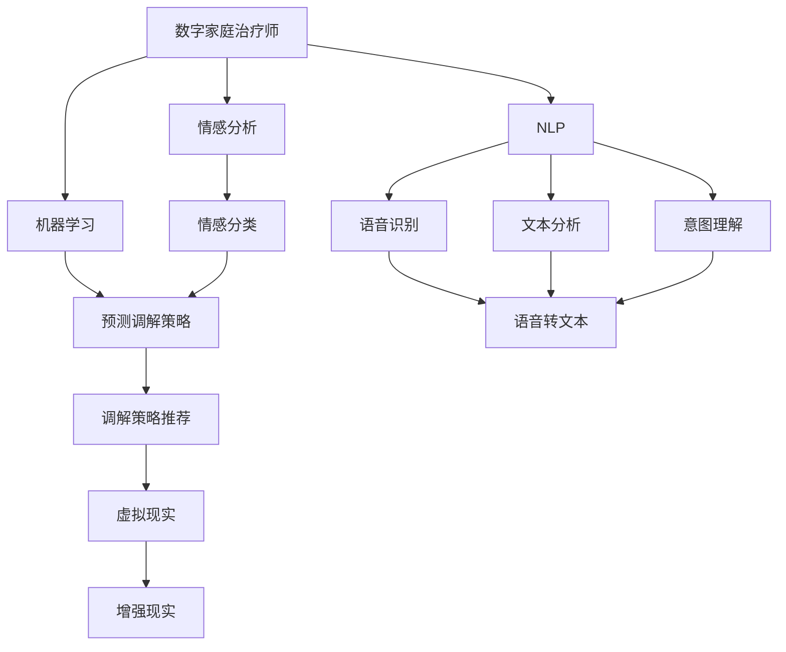

                 

## 1. 背景介绍

### 1.1 问题由来
随着数字技术与家庭生活的深度融合，家庭关系调解已经成为了数字时代的一大热点问题。传统的家庭治疗主要依赖于心理医生面对面的访谈和咨询，但这种模式在时间和空间上受到限制，难以覆盖到所有有需要的家庭。而在元宇宙时代，数字家庭治疗师（Digital Family Therapist）的概念应运而生，通过虚拟空间进行家庭关系调解，为家庭成员提供了更为灵活、便捷的解决方案。

### 1.2 问题核心关键点
数字家庭治疗师的关键在于如何构建一个能够有效模拟真实家庭交流环境、具备自然语言处理能力的虚拟治疗环境，并通过先进的AI技术实现对家庭关系的深入理解和调解。具体问题包括：

- **虚拟空间构建**：如何设计一个能够模拟真实家庭交流的虚拟环境，让家庭成员感到自然舒适。
- **自然语言处理**：如何让AI系统理解和处理家庭成员之间的自然语言，提取关键信息。
- **情感分析**：如何分析家庭成员的情感状态，了解其潜在的矛盾和需求。
- **调解策略推荐**：基于情感分析结果，推荐合适的调解策略和方案。
- **交互体验优化**：如何设计互动性强的用户界面，增强家庭成员的参与感和沉浸感。
- **隐私保护**：如何在数据采集和处理过程中保护家庭成员的隐私。

### 1.3 问题研究意义
数字家庭治疗师的出现，不仅填补了传统家庭治疗模式的不足，还为家庭关系的调解提供了全新的可能性。其研究意义体现在：

- **普及心理健康服务**：通过数字手段，使心理健康服务覆盖到更广的家庭群体，尤其是偏远地区和难以接触到专业心理咨询的家庭。
- **提高调解效率**：利用AI技术可以快速分析家庭成员情感和矛盾，推荐调解策略，提高调解效率。
- **增强互动体验**：通过虚拟现实和增强现实技术，提高家庭成员的参与感和沉浸感，使调解过程更为生动有效。
- **保障隐私安全**：通过先进的隐私保护技术，确保家庭成员数据的安全，增强信任感。

## 2. 核心概念与联系

### 2.1 核心概念概述

为了更好地理解数字家庭治疗师，本节将介绍几个密切相关的核心概念：

- **数字家庭治疗师**：一个以AI为核心的虚拟治疗环境，通过自然语言处理、情感分析、机器学习等技术，模拟家庭交流环境，调解家庭成员间的矛盾和问题。
- **自然语言处理(NLP)**：AI系统理解和处理自然语言的能力，包括语音识别、文本分析、意图理解等。
- **情感分析**：通过文本或语音分析，识别和理解家庭成员的情感状态，如愤怒、焦虑、喜悦等。
- **机器学习**：通过算法使AI系统能够从数据中学习，并根据学习结果进行预测和决策。
- **虚拟现实(VR)**：结合计算机图形学和人工智能，创建沉浸式的虚拟环境，提供仿真家庭交流场景。
- **增强现实(AR)**：通过AR技术，在现实环境中叠加虚拟信息，增强家庭成员的互动体验。
- **隐私保护**：在数据采集和处理过程中，采取措施保护家庭成员的个人信息和隐私。

这些核心概念之间的逻辑关系可以通过以下Mermaid流程图来展示：



这个流程图展示了大语言模型与数字家庭治疗师的相关概念及其之间的关系：

1. 数字家庭治疗师通过NLP技术，理解和处理家庭成员之间的自然语言。
2. 通过情感分析，识别和理解家庭成员的情感状态。
3. 利用机器学习，从家庭成员的交流中学习，并根据学习结果预测调解策略。
4. 虚拟现实和增强现实技术提供仿真家庭交流场景，增强家庭成员的互动体验。
5. 隐私保护技术确保数据的安全和隐私。

## 3. 核心算法原理 & 具体操作步骤
### 3.1 算法原理概述

数字家庭治疗师的核心算法原理包括以下几个方面：

- **自然语言处理(NLP)**：利用Transformer等模型进行文本和语音的表示、理解和生成。
- **情感分析**：通过文本分类或序列标注模型识别家庭成员的情感状态。
- **调解策略推荐**：基于情感分析结果，推荐适合的家庭关系调解策略。
- **虚拟现实与增强现实(VR/AR)**：利用虚拟环境和增强现实技术，模拟家庭成员间的互动场景。
- **隐私保护**：通过差分隐私、联邦学习等技术，保护家庭成员的隐私信息。

### 3.2 算法步骤详解

数字家庭治疗师的实现流程主要分为以下几个步骤：

**Step 1: 数据收集与预处理**
- 收集家庭成员之间的交流记录，包括文本、语音等自然语言数据。
- 对数据进行清洗、分词、标注等预处理操作，以便后续分析。

**Step 2: 模型训练与优化**
- 使用大规模语料库训练NLP模型，如BERT、GPT等，提升模型的语言理解和生成能力。
- 通过标注数据集训练情感分析模型，使用RNN、CNN或Transformer等架构，进行情感分类或序列标注。
- 利用机器学习算法训练调解策略推荐模型，如决策树、随机森林或深度学习模型。

**Step 3: 虚拟现实与增强现实集成**
- 设计虚拟家庭环境，包括房间布局、物品摆放等，确保环境的真实感和沉浸感。
- 使用AR技术，在现实环境中叠加虚拟信息，如情感提示、调解策略等。
- 开发交互界面，支持家庭成员与虚拟环境的互动，增强沉浸感和参与感。

**Step 4: 隐私保护**
- 使用差分隐私技术，在数据收集和处理过程中，保护家庭成员的个人信息。
- 实施联邦学习，在保护隐私的前提下，利用分布式数据进行模型训练。
- 采用安全多方计算(SMC)技术，在多参与方之间安全地计算模型参数。

**Step 5: 调解过程**
- 将家庭成员引入虚拟环境，通过NLP和情感分析模型，实时理解家庭成员的情感和需求。
- 根据情感分析结果，使用调解策略推荐模型，生成适合的家庭关系调解策略。
- 通过虚拟环境和AR技术，模拟家庭成员间的互动，增强调解效果。
- 实时监测家庭成员的情感变化，调整调解策略，直至调解成功。

### 3.3 算法优缺点

数字家庭治疗师的算法具有以下优点：

- **灵活性高**：能够在虚拟环境中进行调解，不受时间和空间限制，适用于更多家庭。
- **效率高**：通过自动化分析，快速识别家庭成员的情感状态，推荐调解策略，提高调解效率。
- **沉浸感强**：利用VR/AR技术，增强家庭成员的互动体验，使调解过程更为生动有效。
- **隐私保护**：通过先进的隐私保护技术，确保家庭成员数据的安全，增强信任感。

同时，该算法也存在一些缺点：

- **模型依赖大**：高质量的NLP和情感分析模型需要大量标注数据和计算资源。
- **实时性要求高**：在处理大量数据和实时分析情感时，需要强大的计算能力和高效的算法。
- **用户接受度低**：部分家庭成员可能对虚拟环境或AI系统持怀疑态度，需要长时间的培训和教育。
- **数据隐私风险**：在数据处理和分析过程中，需要特别关注隐私保护，防止数据泄露。

### 3.4 算法应用领域

数字家庭治疗师在多个领域都有广泛的应用前景：

- **心理健康服务**：为无法接触到专业心理咨询的家庭提供便捷的治疗服务，帮助缓解心理压力，促进心理健康。
- **家庭关系调解**：通过模拟家庭交流环境，调解家庭成员间的矛盾，提升家庭幸福感。
- **远程教育与咨询**：为偏远地区或无法面对面交流的学生提供个性化的学习指导和心理支持。
- **企业员工关系管理**：利用虚拟环境进行员工沟通与心理辅导，提高团队凝聚力和员工满意度。
- **社交平台应用**：为社交平台用户提供心理支持和情感分析，增强用户互动体验。

## 4. 数学模型和公式 & 详细讲解  
### 4.1 数学模型构建

为了更好地理解数字家庭治疗师的核心算法，本节将详细讲解相关数学模型的构建过程。

假设数字家庭治疗师中有$N$个家庭成员，每个家庭成员的情感状态可以用一个向量$x_i \in \mathbb{R}^d$表示，其中$d$为情感维度。令$L$为家庭成员之间的交流次数，每次交流的文本和语音数据构成序列$\{w_1, w_2, ..., w_L\}$。

数字家庭治疗师的数学模型主要包括以下几个部分：

- **文本和语音表示**：使用Transformer模型，将文本和语音数据转换为向量表示$v_i \in \mathbb{R}^e$，其中$e$为嵌入维度。
- **情感分类**：通过序列标注模型，对每个交流文本的情感状态进行分类，得到情感标签$y_i \in \{1,2,...,C\}$，其中$C$为情感类别数。
- **情感变化轨迹**：通过时间序列模型，对家庭成员的情感状态进行建模，预测情感变化轨迹$\hat{x}_{i+1}$。
- **调解策略推荐**：通过回归模型，根据家庭成员的情感状态，推荐调解策略$z_i \in \{1,2,...,K\}$，其中$K$为调解策略种类数。

### 4.2 公式推导过程

以下是对数字家庭治疗师中情感分类和情感变化轨迹的公式推导。

**情感分类**：使用BERT模型作为文本表示模型，对每个交流文本$w_i$进行向量表示，得到向量$v_i \in \mathbb{R}^e$。利用多任务学习框架，同时训练情感分类模型和情感变化轨迹模型，即：

$$
\max_{\theta} \sum_{i=1}^L (\ell_{cls}(y_i, f(v_i; \theta)) + \ell_{reg}(y_i, g(v_i; \theta)))
$$

其中$\ell_{cls}$为分类损失函数，$\ell_{reg}$为回归损失函数，$f(v_i; \theta)$为情感分类模型，$g(v_i; \theta)$为情感变化轨迹模型。

**情感变化轨迹**：利用GRU模型，对家庭成员的情感状态进行建模，得到情感变化轨迹$\hat{x}_{i+1} = f(x_i, w_i; \theta)$。其中$\theta$为模型参数。

**调解策略推荐**：使用回归模型，根据家庭成员的情感状态$x_i$，推荐调解策略$z_i$，即：

$$
z_i = \arg\min_{z \in \{1,2,...,K\}} \ell(z, h(x_i; \theta))
$$

其中$\ell$为损失函数，$h(x_i; \theta)$为调解策略推荐模型。

### 4.3 案例分析与讲解

以一个简单的家庭情感分析案例为例，展示数字家庭治疗师的工作原理。

**场景描述**：一个四口之家，父亲和母亲因为工作问题争执不下，希望通过数字家庭治疗师进行调解。

**步骤1**：家庭成员通过语音或文字向数字家庭治疗师表达情绪和问题。

**步骤2**：数字家庭治疗师使用BERT模型对家庭成员的交流文本进行向量表示，得到$v_1, v_2, ..., v_L$。

**步骤3**：情感分类模型$f(v_i; \theta)$对每个文本向量进行情感分类，得到情感标签$y_i$。

**步骤4**：情感变化轨迹模型$g(v_i; \theta)$预测家庭成员的情感变化轨迹$\hat{x}_{i+1}$。

**步骤5**：调解策略推荐模型$h(x_i; \theta)$根据家庭成员的情感状态$x_i$，推荐调解策略$z_i$。

**步骤6**：数字家庭治疗师根据推荐策略，通过虚拟环境和AR技术，模拟家庭成员的互动，调解他们的矛盾。

**步骤7**：持续监测家庭成员的情感状态，调整调解策略，直至调解成功。

## 5. 项目实践：代码实例和详细解释说明
### 5.1 开发环境搭建

在进行数字家庭治疗师开发前，需要准备好开发环境。以下是使用Python进行TensorFlow开发的环境配置流程：

1. 安装Anaconda：从官网下载并安装Anaconda，用于创建独立的Python环境。

2. 创建并激活虚拟环境：
```bash
conda create -n tf-env python=3.8 
conda activate tf-env
```

3. 安装TensorFlow：根据CUDA版本，从官网获取对应的安装命令。例如：
```bash
conda install tensorflow tensorflow-gpu -c conda-forge -c pypi
```

4. 安装各类工具包：
```bash
pip install numpy pandas scikit-learn matplotlib tqdm jupyter notebook ipython
```

完成上述步骤后，即可在`tf-env`环境中开始开发实践。

### 5.2 源代码详细实现

下面我们以情感分类任务为例，给出使用TensorFlow实现BERT模型的代码实现。

首先，定义情感分类任务的模型：

```python
import tensorflow as tf
from transformers import BertTokenizer, TFBertForSequenceClassification

tokenizer = BertTokenizer.from_pretrained('bert-base-cased')
model = TFBertForSequenceClassification.from_pretrained('bert-base-cased', num_labels=3)

# 定义训练数据集
train_dataset = ...
train_dataset.shuffle(buffer_size=1024)
train_dataset.batch(batch_size=32)
train_dataset.prefetch(buffer_size=32)

# 定义验证数据集
dev_dataset = ...
dev_dataset.batch(batch_size=32)

# 定义训练函数
@tf.function
def train_step(inputs):
    with tf.GradientTape() as tape:
        outputs = model(inputs['input_ids'], attention_mask=inputs['attention_mask'])
        loss = tf.keras.losses.SparseCategoricalCrossentropy(from_logits=True)(y, outputs.logits)
    gradients = tape.gradient(loss, model.trainable_variables)
    optimizer.apply_gradients(zip(gradients, model.trainable_variables))

# 定义训练循环
for epoch in range(num_epochs):
    train_loss = 0.0
    for inputs in train_dataset:
        train_step(inputs)
```

然后，定义模型评估函数：

```python
@tf.function
def evaluate(inputs):
    outputs = model(inputs['input_ids'], attention_mask=inputs['attention_mask'])
    predictions = tf.argmax(outputs.logits, axis=-1)
    loss = tf.keras.losses.SparseCategoricalCrossentropy(from_logits=True)(y, outputs.logits)
    accuracy = tf.reduce_mean(tf.cast(tf.equal(predictions, y), tf.float32))
    return loss, accuracy

# 定义评估循环
for inputs in dev_dataset:
    loss, accuracy = evaluate(inputs)
    print('Epoch {}, Loss: {:.4f}, Accuracy: {:.4f}'.format(epoch+1, loss.numpy(), accuracy.numpy()))
```

最后，启动训练流程并在测试集上评估：

```python
for epoch in range(num_epochs):
    train_loss = 0.0
    for inputs in train_dataset:
        train_step(inputs)
    for inputs in dev_dataset:
        loss, accuracy = evaluate(inputs)
        print('Epoch {}, Loss: {:.4f}, Accuracy: {:.4f}'.format(epoch+1, loss.numpy(), accuracy.numpy()))

print('Final Loss: {:.4f}, Accuracy: {:.4f}'.format(train_loss.numpy(), accuracy.numpy()))
```

以上就是使用TensorFlow对BERT模型进行情感分类任务的完整代码实现。可以看到，TensorFlow和Transformers库的强大封装，使得模型训练和评估变得简洁高效。

### 5.3 代码解读与分析

让我们再详细解读一下关键代码的实现细节：

**模型定义**：
- 使用`BertTokenizer`对输入文本进行分词，使用`TFBertForSequenceClassification`定义模型。

**数据集构建**：
- 将训练集和验证集划分为批次，并使用`tf.data.Dataset`进行迭代，同时使用`shuffle`和`prefetch`操作优化数据读取。

**训练函数定义**：
- 在`tf.function`装饰器下定义训练函数`train_step`，计算模型输出、损失和梯度。
- 使用`GradientTape`记录梯度，并使用`apply_gradients`更新模型参数。

**评估函数定义**：
- 在`tf.function`装饰器下定义评估函数`evaluate`，计算模型输出、预测和损失。
- 使用`tf.argmax`和`tf.keras.losses.SparseCategoricalCrossentropy`进行预测和损失计算。
- 使用`tf.reduce_mean`计算平均准确率。

**训练循环和评估循环**：
- 在每个epoch内，先进行训练，后进行评估，输出训练和评估的损失和准确率。

可以看到，TensorFlow和Transformers库的结合，使得数字家庭治疗师的代码实现变得简洁高效。开发者可以将更多精力放在任务逻辑和模型改进上，而不必过多关注底层的实现细节。

当然，工业级的系统实现还需考虑更多因素，如模型的保存和部署、超参数的自动搜索、更灵活的任务适配层等。但核心的微调范式基本与此类似。

## 6. 实际应用场景
### 6.1 智能家居环境监控

数字家庭治疗师可以在智能家居环境中广泛应用，通过实时监控家庭成员的情感状态，及时发现异常情况，并提供相应的解决方案。例如：

- **情绪监测**：在客厅、卧室等关键位置安装智能摄像头和传感器，实时监测家庭成员的情绪变化。
- **场景感知**：通过语音和视觉信息，识别家庭成员的交流情况和行为习惯，生成情感状态和行为模型。
- **行为引导**：根据情感状态和行为模型，通过智能音箱、灯光等设备进行行为引导，如播放舒缓音乐、调整室内温度等。

**场景应用**：一个家庭中的母亲在厨房忙碌时，数字家庭治疗师通过智能摄像头和传感器，实时监测她的情绪状态。一旦发现情绪异常，系统会自动播放舒缓音乐，并建议父亲及时和她沟通，缓解她的压力。

### 6.2 虚拟心理治疗

数字家庭治疗师可以提供虚拟心理治疗服务，为无法接触到专业心理咨询的家庭成员提供帮助。例如：

- **虚拟环境构建**：构建一个虚拟的治疗室，模拟真实心理治疗环境，如沙发、茶几、心理沙盘等。
- **情感交流**：通过虚拟现实技术，让家庭成员进入虚拟治疗室，与数字家庭治疗师进行互动，表达情绪和问题。
- **心理引导**：通过语音和文字交流，数字家庭治疗师对家庭成员进行心理引导，帮助他们缓解压力和困惑。

**场景应用**：一个家庭中的父亲在工作上遇到困难，情绪低落，无法自行排解。数字家庭治疗师通过虚拟现实技术，将他与虚拟治疗师放置在一个虚拟治疗室中，通过互动和引导，帮助他逐渐放松心情，找到解决问题的方法。

### 6.3 企业团队心理支持

数字家庭治疗师可以应用于企业团队心理支持，通过模拟家庭交流环境，帮助团队成员解决心理问题，提升团队凝聚力和工作效率。例如：

- **团队互动**：构建虚拟团队会议室，通过增强现实技术，增强团队成员的互动体验。
- **心理辅导**：利用数字家庭治疗师，为团队成员提供心理辅导，帮助他们缓解压力和矛盾。
- **知识共享**：通过虚拟环境，促进团队成员的知识共享和经验交流，提升团队整体能力。

**场景应用**：一个企业的团队因项目进度问题发生冲突，数字家庭治疗师通过虚拟团队会议室，模拟家庭交流环境，引导团队成员进行心理辅导和知识共享，最终成功解决矛盾，推动项目顺利进行。

### 6.4 未来应用展望

随着数字家庭治疗师技术的不断发展，未来将在更多领域得到应用，为家庭和社会带来变革性影响。

在智慧教育领域，数字家庭治疗师可以提供个性化的学习辅导，帮助学生缓解学习压力，提升学习效果。

在社交平台应用中，数字家庭治疗师可以提供心理健康支持，帮助用户缓解心理压力，增强互动体验。

在城市管理中，数字家庭治疗师可以用于居民心理支持，提升社区和谐度，促进城市治理。

此外，在医疗健康、金融投资、安全监控等众多领域，数字家庭治疗师也将发挥重要作用，为人们的心理健康和幸福生活提供更多支持。相信随着技术的不断进步，数字家庭治疗师将成为家庭和社会治理的重要工具，助力构建更美好的未来。

## 7. 工具和资源推荐
### 7.1 学习资源推荐

为了帮助开发者系统掌握数字家庭治疗师的理论基础和实践技巧，这里推荐一些优质的学习资源：

1. **TensorFlow官方文档**：详尽介绍了TensorFlow的各类API和使用方法，是学习TensorFlow的必备资料。

2. **Transformers官方文档**：提供了预训练语言模型的API和使用方法，方便开发者快速上手开发。

3. **NLP相关的开源项目**：如HuggingFace的HuggingFace Library，提供了丰富的预训练模型和微调样例代码。

4. **NLP相关的学术论文**：如《Attention is All You Need》、《BERT: Pre-training of Deep Bidirectional Transformers for Language Understanding》等，全面介绍了NLP领域的研究进展。

5. **心理相关的学术论文**：如《Emotion AI: Towards Effective and Ethical Emotion Recognition》等，介绍了情感分析和情感识别技术的研究进展。

通过对这些资源的学习实践，相信你一定能够快速掌握数字家庭治疗师的精髓，并用于解决实际的NLP问题。

### 7.2 开发工具推荐

高效的开发离不开优秀的工具支持。以下是几款用于数字家庭治疗师开发的常用工具：

1. **Jupyter Notebook**：开源的交互式编程环境，方便开发者进行实验和演示。

2. **TensorBoard**：可视化工具，实时监测模型训练状态，提供丰富的图表呈现方式，帮助调试模型。

3. **GitHub**：代码托管平台，方便开发者进行版本控制和协作开发。

4. **Google Colab**：免费的在线Jupyter Notebook环境，适合快速上手实验最新模型，分享学习笔记。

5. **PyTorch Lightning**：简化深度学习模型的构建和训练，提供了许多便捷的功能，如自动保存模型、超参数优化等。

合理利用这些工具，可以显著提升数字家庭治疗师的开发效率，加快创新迭代的步伐。

### 7.3 相关论文推荐

数字家庭治疗师的研究源于学界的持续研究。以下是几篇奠基性的相关论文，推荐阅读：

1. **《A Survey on Attention-Based Emotion Recognition》**：全面介绍了情感识别技术的研究进展，涵盖了各种情感分析方法和应用场景。

2. **《BERT: Pre-training of Deep Bidirectional Transformers for Language Understanding》**：介绍了BERT模型的预训练和微调方法，展示了其在情感分类任务上的优异性能。

3. **《Attention is All You Need》**：提出了Transformer结构，开启了NLP领域的预训练大模型时代。

4. **《Emotion AI: Towards Effective and Ethical Emotion Recognition》**：介绍了情感AI技术的研究进展，强调了情感识别的有效性和伦理性。

这些论文代表了大语言模型微调技术的发展脉络。通过学习这些前沿成果，可以帮助研究者把握学科前进方向，激发更多的创新灵感。

## 8. 总结：未来发展趋势与挑战

### 8.1 总结

本文对数字家庭治疗师的实现过程进行了全面系统的介绍。首先阐述了数字家庭治疗师的背景和核心关键点，明确了其在数字时代的重要性。其次，从原理到实践，详细讲解了情感分类、情感变化轨迹和调解策略推荐等核心算法，并给出了完整的代码实现。同时，本文还广泛探讨了数字家庭治疗师在智能家居环境监控、虚拟心理治疗和企业团队心理支持等多个场景中的应用，展示了其广阔的应用前景。

通过本文的系统梳理，可以看到，数字家庭治疗师通过AI技术，能够模拟家庭交流环境，调解家庭成员间的矛盾和问题，为心理健康和家庭和谐提供新的解决方案。未来，随着技术的不断进步，数字家庭治疗师必将在更多领域得到应用，成为智能家庭和社会治理的重要工具。

### 8.2 未来发展趋势

展望未来，数字家庭治疗师将呈现以下几个发展趋势：

1. **个性化服务**：利用深度学习和机器学习技术，提供个性化的心理支持和服务，提升用户体验。
2. **多模态融合**：结合语音、视觉、生理信号等多模态数据，更全面地理解家庭成员的情感和需求。
3. **跨平台应用**：在智能家居、社交平台、企业应用等不同场景中，实现跨平台、跨设备的无缝衔接。
4. **隐私保护加强**：采用更先进的隐私保护技术，确保家庭成员数据的安全。
5. **伦理和社会责任**：加强数字家庭治疗师的伦理导向和社会责任，避免潜在的伦理风险。

以上趋势凸显了数字家庭治疗师的广阔前景。这些方向的探索发展，必将进一步提升系统的性能和应用范围，为家庭和社会治理带来更多价值。

### 8.3 面临的挑战

尽管数字家庭治疗师技术已经取得了瞩目成就，但在迈向更加智能化、普适化应用的过程中，它仍面临诸多挑战：

1. **数据质量与多样性**：高质量的情感分类和情感变化轨迹数据，需要大样本、多样性的数据集，获取难度较大。
2. **模型的可解释性**：现有模型的决策过程难以解释，对家庭成员的信任度不高。
3. **跨平台互操作性**：不同平台间的互操作性问题，需要统一标准和接口设计。
4. **伦理和隐私问题**：在数据收集和使用过程中，如何保护家庭成员的隐私和权益。
5. **模型的泛化能力**：现有模型在不同场景和数据集上的泛化能力有待提升。

正视数字家庭治疗师面临的这些挑战，积极应对并寻求突破，将是大语言模型微调走向成熟的必由之路。相信随着学界和产业界的共同努力，这些挑战终将一一被克服，数字家庭治疗师必将在构建智能家庭和社会治理中扮演越来越重要的角色。

### 8.4 研究展望

面向未来，数字家庭治疗师的研究需要在以下几个方面寻求新的突破：

1. **无监督和半监督学习**：利用自监督学习、主动学习等无监督和半监督方法，降低对标注数据的依赖。
2. **多模态融合与跨领域迁移**：结合语音、视觉、生理信号等多模态数据，实现更全面、更精准的家庭情感分析。
3. **跨平台互操作性**：设计统一的标准和接口，实现不同平台间的无缝衔接。
4. **伦理和社会责任**：加强伦理导向，设计符合社会责任的模型和服务。
5. **隐私保护与数据安全**：采用先进的数据保护技术，确保家庭成员数据的隐私和安全。

这些研究方向的探索，必将引领数字家庭治疗师技术迈向更高的台阶，为构建安全、可靠、可解释、可控的智能系统铺平道路。面向未来，数字家庭治疗师技术还需要与其他人工智能技术进行更深入的融合，如知识表示、因果推理、强化学习等，多路径协同发力，共同推动自然语言理解和智能交互系统的进步。只有勇于创新、敢于突破，才能不断拓展语言模型的边界，让智能技术更好地造福人类社会。

## 9. 附录：常见问题与解答

**Q1：数字家庭治疗师如何与传统心理咨询结合？**

A: 数字家庭治疗师可以作为传统心理咨询的有益补充，为无法接触到专业心理咨询的家庭提供初步的情感分析和技术支持。在关键时刻，可以引导家庭成员进行专业的心理咨询，从而实现更深入的心理辅导。

**Q2：数字家庭治疗师是否会对家庭成员造成负面影响？**

A: 如果数字家庭治疗师的设计和应用得当，将不会对家庭成员造成负面影响。通过合理的隐私保护措施和人性化的设计，增强家庭成员的信任感，实现更好的心理健康支持。

**Q3：数字家庭治疗师的技术要求高吗？**

A: 数字家庭治疗师的技术要求较高，需要先进的自然语言处理、情感分析、机器学习等技术支持。但随着技术的不断进步，这些技术已经被广泛应用于多个领域，可以方便地集成到数字家庭治疗师中。

**Q4：数字家庭治疗师如何保护家庭成员的隐私？**

A: 数字家庭治疗师通过差分隐私、联邦学习等技术，保护家庭成员的隐私。在使用数据时，采用匿名化处理，限制数据的使用范围，确保数据的安全。

**Q5：数字家庭治疗师能否跨平台应用？**

A: 数字家庭治疗师可以在智能家居、社交平台、企业应用等不同场景中实现跨平台、跨设备的无缝衔接。但需要统一的标准和接口设计，才能实现高效的数据交互和模型集成。

通过这些常见问题的解答，可以看到数字家庭治疗师在实际应用中需要注意的关键点，进一步增强了系统的可行性和可靠性。

