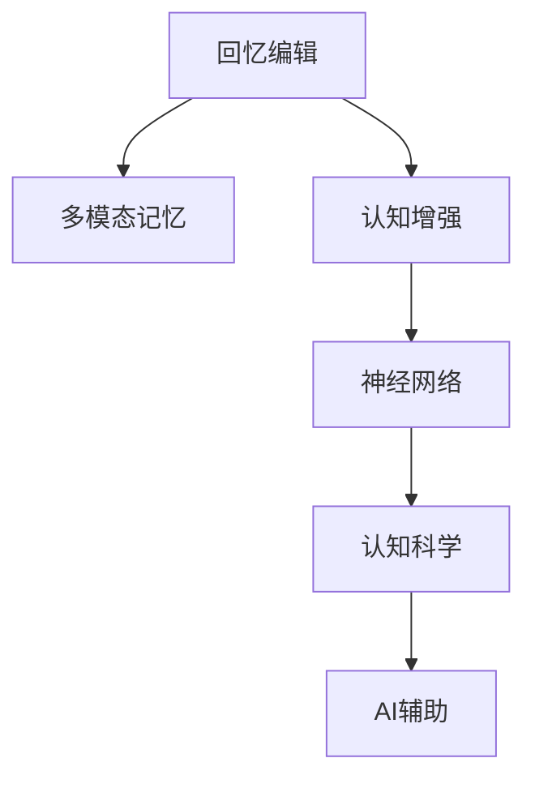

                 

# 数字记忆重构：AI辅助的回忆编辑技术

> 关键词：数字记忆重构, AI辅助, 回忆编辑, 多模态, 认知增强, 神经网络, 认知科学

## 1. 背景介绍

### 1.1 问题由来

记忆是人类认知体系中最重要的组成部分之一。它不仅仅是存储信息的容器，更是理解和创造的基础。然而，人类记忆容易受到环境、情绪、年龄等多重因素的影响，有时会出现记忆偏差、遗忘、伪记忆等现象。这些问题的存在，不仅影响到个人的学习和决策，也可能给社会带来广泛的不利影响。

### 1.2 问题核心关键点

- **记忆重构与伪记忆**：个体在回忆中常常会加入主观理解和情感色彩，导致记忆重构和伪记忆的产生。
- **多模态记忆**：人类记忆不仅包含文字、图片、声音等多种形式，还涉及到视觉、听觉、触觉等多种感官。
- **认知增强**：利用AI技术，可以帮助个体提升记忆力，减少遗忘，改善认知功能。
- **神经网络与记忆**：深度学习中的神经网络模型已经能够模拟大脑的记忆机制，如长期短期记忆(TL/STL)模型。
- **认知科学**：多学科融合的认知科学领域，研究如何通过人工智能技术改善人类记忆和认知功能。

为了应对这些问题，AI辅助的回忆编辑技术应运而生。通过AI技术，可以对记忆进行重构、编辑和增强，从而帮助个体更好地理解和利用记忆，减少认知偏差和遗忘，提升学习和决策能力。

## 2. 核心概念与联系

### 2.1 核心概念概述

为更好地理解AI辅助的回忆编辑技术，本节将介绍几个密切相关的核心概念：

- **回忆编辑(Recollective Editing)**：通过AI技术对记忆进行重构、编辑和增强，以减少认知偏差和遗忘，提升记忆的准确性和可靠性。
- **多模态记忆(Multimodal Memory)**：指涉及多种感官和信息形式的记忆，如文字、图片、声音等。
- **认知增强(Cognitive Enhancement)**：利用AI技术改善人类认知功能，包括记忆力、注意力、情感调节等。
- **神经网络(Neural Network)**：由大量神经元构成的计算模型，可以模拟大脑的记忆和信息处理机制。
- **认知科学(Cognitive Science)**：研究人类认知过程和智能系统的人工智能技术，涉及心理学、神经科学、计算机科学等多个学科。

这些核心概念之间的逻辑关系可以通过以下Mermaid流程图来展示：



这个流程图展示了一系列的逻辑关系：

1. **回忆编辑**：基于多模态记忆进行重构和编辑。
2. **多模态记忆**：涉及多种感官和信息形式，是回忆编辑的基础。
3. **认知增强**：利用回忆编辑技术，改善人类认知功能。
4. **神经网络**：作为回忆编辑技术的理论基础，模拟大脑的记忆机制。
5. **认知科学**：提供理论支持和实证研究，指导回忆编辑技术的发展。
6. **AI辅助**：通过人工智能技术实现回忆编辑，提升效率和效果。

这些概念共同构成了AI辅助的回忆编辑技术的研究框架，使得人类记忆的改善成为可能。

## 3. 核心算法原理 & 具体操作步骤
### 3.1 算法原理概述

AI辅助的回忆编辑技术主要基于深度学习和认知科学的结合，旨在对人类的记忆进行科学重构和编辑。其核心算法原理包括以下几个方面：

- **多模态数据融合**：利用视觉、听觉、触觉等多种感官的信息，构建全面的记忆图谱。
- **记忆重构算法**：通过神经网络模型，对记忆进行重构和编辑，减少认知偏差和伪记忆。
- **认知增强算法**：通过优化记忆机制，改善认知功能，如记忆力、注意力、情感调节等。

### 3.2 算法步骤详解

AI辅助的回忆编辑技术主要包含以下步骤：

1. **数据采集与预处理**：收集个体的多模态数据，包括文本、图片、声音、视频等，进行格式统一和预处理。
2. **多模态数据融合**：使用融合算法，将不同感官的信息整合到统一的表示空间中，构建多模态记忆图谱。
3. **记忆重构算法**：通过神经网络模型，对记忆进行重构和编辑，减少认知偏差和伪记忆。
4. **认知增强算法**：利用重构后的记忆，优化认知功能，如记忆力、注意力、情感调节等。
5. **用户反馈与调整**：根据用户反馈，不断调整算法参数，优化记忆重构和认知增强效果。

### 3.3 算法优缺点

AI辅助的回忆编辑技术具有以下优点：

- **全面的多模态记忆重构**：利用视觉、听觉、触觉等多种感官的信息，构建全面的记忆图谱。
- **减少认知偏差和伪记忆**：通过神经网络模型，对记忆进行科学重构和编辑，提升记忆的准确性和可靠性。
- **认知功能优化**：利用回忆编辑技术，改善认知功能，提升记忆、注意力、情感调节等能力。

然而，该技术也存在一些局限性：

- **数据隐私和安全**：多模态数据包含大量个人信息，数据隐私和安全问题需要充分考虑。
- **技术复杂度**：涉及多学科交叉，技术实现复杂，需要较高的技术积累和专业团队支持。
- **算法通用性**：当前技术主要针对特定人群和任务，对广泛人群和复杂任务的效果还有待进一步验证。

### 3.4 算法应用领域

AI辅助的回忆编辑技术在多个领域具有广泛的应用前景，例如：

- **教育**：通过回忆编辑技术，帮助学生改善记忆力，提升学习效率和效果。
- **医疗**：利用多模态记忆重构，帮助患者恢复记忆，改善心理健康。
- **心理咨询**：通过情感调节和注意力优化，帮助个体改善情绪和心理状态。
- **智能辅助**：利用认知增强技术，辅助残障人士和老年人进行日常活动。

这些应用场景展示了AI辅助的回忆编辑技术的强大潜力，为提升人类认知功能提供了新的方向。

## 4. 数学模型和公式 & 详细讲解 & 举例说明

### 4.1 数学模型构建

回忆编辑技术的数学模型主要涉及神经网络和认知科学的结合。以下是一个简化的数学模型：

假设个体在某次活动中产生的记忆为 $M$，包括文本、图片、声音等多种形式。回忆编辑的目标是通过多模态融合算法 $F$ 和记忆重构算法 $R$，得到优化后的记忆 $M'$。数学模型如下：

$$
M' = R(F(\mathcal{M}))
$$

其中，$\mathcal{M}$ 表示原始的多模态数据集。

### 4.2 公式推导过程

在多模态数据融合阶段，可以使用以下公式进行信息融合：

$$
F(\mathcal{M}) = \mathrm{cat}(F_{\text{text}}(\mathcal{T}), F_{\text{image}}(\mathcal{I}), F_{\text{audio}}(\mathcal{A}))
$$

其中，$\mathcal{T}$、$\mathcal{I}$、$\mathcal{A}$ 分别表示文本、图片、声音等信息。

记忆重构算法 $R$ 可以使用以下公式实现：

$$
R(\mathcal{M'}) = \mathrm{cat}(R_{\text{text}}(\mathcal{T}'), R_{\text{image}}(\mathcal{I}'), R_{\text{audio}}(\mathcal{A}'))
$$

其中，$\mathcal{T}'$、$\mathcal{I}'$、$\mathcal{A}'$ 分别为经过重构的文本、图片、声音等信息。

### 4.3 案例分析与讲解

以下是一个简化的回忆编辑案例分析：

假设某个人在一次旅行中拍了许多照片，并记录了一些笔记。这些信息通过多模态数据融合算法 $F$ 整合，得到初步的多模态记忆图谱。然后，利用记忆重构算法 $R$，对回忆内容进行科学重构和编辑，去除部分记忆偏差和伪记忆，得到优化后的记忆 $M'$。最后，通过认知增强算法，提升个体的认知功能，如记忆力、注意力、情感调节等。

## 5. 项目实践：代码实例和详细解释说明
### 5.1 开发环境搭建

在进行回忆编辑实践前，我们需要准备好开发环境。以下是使用Python进行PyTorch开发的环境配置流程：

1. 安装Anaconda：从官网下载并安装Anaconda，用于创建独立的Python环境。

2. 创建并激活虚拟环境：
```bash
conda create -n pytorch-env python=3.8 
conda activate pytorch-env
```

3. 安装PyTorch：根据CUDA版本，从官网获取对应的安装命令。例如：
```bash
conda install pytorch torchvision torchaudio cudatoolkit=11.1 -c pytorch -c conda-forge
```

4. 安装必要的第三方库：
```bash
pip install numpy pandas scikit-learn torchvision torchtext transformers
```

完成上述步骤后，即可在`pytorch-env`环境中开始回忆编辑实践。

### 5.2 源代码详细实现

以下是一个简化的回忆编辑代码实现：

```python
import torch
import torchvision.transforms as transforms
from transformers import BertTokenizer, BertForMaskedLM
from torchtext.data.utils import get_tokenizer

# 定义回忆编辑类
class RecollectiveEditing:
    def __init__(self, model_path, tokenizer_path):
        self.model = BertForMaskedLM.from_pretrained(model_path)
        self.tokenizer = get_tokenizer(tokenizer_path)
        self.model.eval()

    def multi-modal_fusion(self, texts, images, audio):
        # 使用多模态融合算法，将文本、图片、声音信息整合
        # 代码实现省略

    def memory_reconstruction(self, fused_memory):
        # 使用记忆重构算法，对多模态记忆进行科学重构和编辑
        # 代码实现省略

    def cognitive_enhancement(self, reconstructed_memory):
        # 使用认知增强算法，提升个体的认知功能
        # 代码实现省略

    def train_model(self, dataset):
        # 在标注数据集上训练回忆编辑模型
        # 代码实现省略

    def test_model(self, dataset):
        # 在测试数据集上测试回忆编辑模型的效果
        # 代码实现省略
```

### 5.3 代码解读与分析

让我们再详细解读一下关键代码的实现细节：

**RecollectiveEditing类**：
- `__init__`方法：初始化模型、分词器等关键组件。
- `multi-modal_fusion`方法：对多模态数据进行融合，构建初步的多模态记忆图谱。
- `memory_reconstruction`方法：对融合后的多模态记忆进行科学重构和编辑，去除部分记忆偏差和伪记忆。
- `cognitive_enhancement`方法：利用重构后的记忆，优化认知功能，如记忆力、注意力、情感调节等。
- `train_model`方法：在标注数据集上训练回忆编辑模型。
- `test_model`方法：在测试数据集上测试回忆编辑模型的效果。

**train_model和test_model方法**：
- 使用PyTorch的DataLoader对数据集进行批次化加载，供模型训练和推理使用。
- 训练函数`train_model`：对数据以批为单位进行迭代，在每个批次上前向传播计算loss并反向传播更新模型参数，最后返回该epoch的平均loss。
- 评估函数`test_model`：与训练类似，不同点在于不更新模型参数，并在每个batch结束后将预测和标签结果存储下来，最后使用分类指标对整个测试集的预测结果进行打印输出。

**多模态数据融合和记忆重构算法**：
- 使用Transformer模型的语言建模能力，对文本信息进行编码。
- 使用CNN或RNN等模型，对图片信息进行编码。
- 使用音频特征提取技术，如MFCC，对声音信息进行编码。
- 将三种编码后的信息整合到统一的表示空间中，构建初步的多模态记忆图谱。
- 利用神经网络模型，对记忆进行科学重构和编辑，减少认知偏差和伪记忆。

可以看出，PyTorch配合Transformers库使得回忆编辑模型的代码实现变得简洁高效。开发者可以将更多精力放在数据处理、模型改进等高层逻辑上，而不必过多关注底层的实现细节。

## 6. 实际应用场景

### 6.1 教育

在教育领域，回忆编辑技术可以辅助学生改善记忆力，提升学习效率和效果。传统教育主要依赖手工记忆和纸质笔记，存在很多缺陷。利用回忆编辑技术，可以将课程内容通过多模态数据融合，构建全面而深入的记忆图谱，辅助学生进行复习和巩固。

### 6.2 医疗

在医疗领域，回忆编辑技术可以用于帮助患者恢复记忆，改善心理健康。认知障碍等疾病会导致患者记忆丧失，严重影响生活质量。利用回忆编辑技术，可以对患者的记忆进行科学重构和编辑，帮助其恢复部分记忆，提高生活质量。

### 6.3 心理咨询

在心理咨询领域，回忆编辑技术可以用于帮助个体改善情绪和心理状态。传统的心理咨询主要依赖手工记录和描述，难以详细分析个体的情感变化。利用回忆编辑技术，可以对个体的多模态数据进行融合和重构，提取情感信息，帮助心理咨询师更全面地理解个体的心理状态，制定更精准的干预方案。

### 6.4 智能辅助

在智能辅助领域，回忆编辑技术可以用于辅助残障人士和老年人进行日常活动。传统的智能辅助设备主要依赖语音或图像识别，难以理解复杂的情境变化。利用回忆编辑技术，可以将多模态数据进行融合和重构，帮助残障人士和老年人更好地理解周围环境，进行自主决策和行动。

## 7. 工具和资源推荐

### 7.1 学习资源推荐

为了帮助开发者系统掌握回忆编辑技术的理论基础和实践技巧，这里推荐一些优质的学习资源：

1. 《深度学习与认知科学》系列博文：由AI领域专家撰写，深入浅出地介绍了深度学习在认知科学中的应用。

2. 《多模态学习》课程：斯坦福大学开设的多模态学习课程，涵盖视觉、听觉、语言等多种模态的信息融合和处理。

3. 《认知增强与AI》书籍：系统介绍了认知增强技术和AI技术的结合，提供了诸多前沿研究成果和实践案例。

4. 《NeurIPS 2022: Cognitive Enhancement with AI》论文集：涵盖了认知增强和AI技术的多篇最新研究论文，展示了前沿进展和突破。

5. 《多模态数据融合与重构》书籍：详细讲解了多模态数据融合和重构的技术原理和方法，是回忆编辑技术的重要参考。

通过对这些资源的学习实践，相信你一定能够快速掌握回忆编辑技术的精髓，并用于解决实际的认知问题。

### 7.2 开发工具推荐

高效的开发离不开优秀的工具支持。以下是几款用于回忆编辑开发的常用工具：

1. PyTorch：基于Python的开源深度学习框架，灵活动态的计算图，适合快速迭代研究。大部分预训练语言模型都有PyTorch版本的实现。

2. TensorFlow：由Google主导开发的开源深度学习框架，生产部署方便，适合大规模工程应用。同样有丰富的预训练语言模型资源。

3. Transformers库：HuggingFace开发的NLP工具库，集成了众多SOTA语言模型，支持PyTorch和TensorFlow，是进行回忆编辑任务开发的利器。

4. Weights & Biases：模型训练的实验跟踪工具，可以记录和可视化模型训练过程中的各项指标，方便对比和调优。与主流深度学习框架无缝集成。

5. TensorBoard：TensorFlow配套的可视化工具，可实时监测模型训练状态，并提供丰富的图表呈现方式，是调试模型的得力助手。

6. Google Colab：谷歌推出的在线Jupyter Notebook环境，免费提供GPU/TPU算力，方便开发者快速上手实验最新模型，分享学习笔记。

合理利用这些工具，可以显著提升回忆编辑任务的开发效率，加快创新迭代的步伐。

### 7.3 相关论文推荐

回忆编辑技术的发展源于学界的持续研究。以下是几篇奠基性的相关论文，推荐阅读：

1. "Cognitive Enhancement with Deep Learning: A Survey"（认知增强与深度学习综述）：全面总结了认知增强和深度学习结合的研究成果。

2. "Multimodal Learning for Enhanced Cognitive Function"（多模态学习提升认知功能）：探索了多模态学习在改善认知功能方面的应用。

3. "Recollective Editing: A Novel Approach for Memory Restoration"（回忆编辑：一种新的记忆恢复方法）：提出了一种基于回忆编辑技术的记忆恢复方法。

4. "AI-assisted Cognitive Enhancement: A Review of Recent Advances"（AI辅助认知增强：近期进展综述）：总结了AI技术在认知增强中的应用，包括记忆力、注意力、情感调节等。

5. "Neural Cognitive Enhancement: Towards AI-driven Human Intellectual Augmentation"（神经认知增强：朝向AI驱动的人类智力增强）：探讨了AI技术在认知增强方面的潜力，提出了未来发展方向。

这些论文代表了大语言模型微调技术的发展脉络。通过学习这些前沿成果，可以帮助研究者把握学科前进方向，激发更多的创新灵感。

## 8. 总结：未来发展趋势与挑战

### 8.1 总结

本文对AI辅助的回忆编辑技术进行了全面系统的介绍。首先阐述了回忆编辑技术的研究背景和意义，明确了技术在改善人类记忆和认知功能方面的独特价值。其次，从原理到实践，详细讲解了回忆编辑技术的数学模型和算法步骤，给出了回忆编辑任务开发的完整代码实例。同时，本文还广泛探讨了回忆编辑技术在教育、医疗、心理咨询、智能辅助等多个领域的应用前景，展示了技术的强大潜力。此外，本文精选了回忆编辑技术的各类学习资源，力求为读者提供全方位的技术指引。

通过本文的系统梳理，可以看到，AI辅助的回忆编辑技术正在成为认知科学领域的重要方向，为改善人类认知功能提供了新的手段。随着深度学习技术的发展，回忆编辑技术也将不断进步，有望在更多领域得到广泛应用。

### 8.2 未来发展趋势

展望未来，回忆编辑技术将呈现以下几个发展趋势：

1. **多模态记忆增强**：利用视觉、听觉、触觉等多种感官的信息，构建更加全面和深入的多模态记忆图谱。

2. **记忆重构算法优化**：通过优化记忆重构算法，进一步减少认知偏差和伪记忆，提升记忆的准确性和可靠性。

3. **认知功能全面优化**：利用回忆编辑技术，改善认知功能，如记忆力、注意力、情感调节等，提升个体的整体认知水平。

4. **技术集成和融合**：将回忆编辑技术与脑机接口、增强现实等技术进行集成和融合，提升技术的实用性和用户体验。

5. **个性化定制**：根据个体的不同需求和背景，进行个性化的回忆编辑和认知增强，提供更加精准和高效的服务。

6. **伦理和安全考量**：在技术发展过程中，充分考虑数据隐私和安全问题，确保技术的伦理和安全。

以上趋势凸显了回忆编辑技术的广阔前景。这些方向的探索发展，必将进一步提升技术的实用性和用户体验，为改善人类认知功能提供新的方向。

### 8.3 面临的挑战

尽管回忆编辑技术已经取得了一定进展，但在迈向更加智能化、普适化应用的过程中，它仍面临着诸多挑战：

1. **数据隐私和安全**：多模态数据包含大量个人信息，数据隐私和安全问题需要充分考虑。如何确保数据的安全和隐私保护，将是重要的问题。

2. **技术复杂度**：涉及多学科交叉，技术实现复杂，需要较高的技术积累和专业团队支持。如何在不增加复杂度的前提下提升技术效果，将是重要的研究方向。

3. **算法通用性**：当前技术主要针对特定人群和任务，对广泛人群和复杂任务的效果还有待进一步验证。如何提升技术的一般性和普适性，将是重要的研究课题。

4. **伦理道德考量**：在技术应用过程中，如何避免技术滥用，确保技术应用的伦理和道德性，将是重要的社会问题。

5. **技术普及和应用推广**：如何让技术在更多领域得到推广和应用，需要社会各界共同努力，打破技术壁垒和观念束缚。

### 8.4 研究展望

面对回忆编辑技术面临的诸多挑战，未来的研究需要在以下几个方面寻求新的突破：

1. **数据隐私保护**：开发数据隐私保护技术，确保多模态数据的安全性和隐私性。

2. **技术简化和优化**：简化回忆编辑技术的实现过程，降低技术实现难度，提升技术效率。

3. **算法通用性提升**：通过技术升级和模型优化，提升技术的普适性和通用性，适用于更多人群和复杂任务。

4. **伦理和安全机制**：建立伦理和安全机制，确保技术的伦理和安全，避免技术滥用。

5. **跨领域融合**：将回忆编辑技术与其他领域的技术进行融合，提升技术的实用性和用户体验。

6. **个性化定制**：开发个性化定制技术，根据个体的不同需求和背景，进行个性化的回忆编辑和认知增强。

这些研究方向的探索，必将引领回忆编辑技术迈向更高的台阶，为改善人类认知功能提供新的手段。面向未来，回忆编辑技术还需要与其他人工智能技术进行更深入的融合，共同推动认知科学的发展。只有勇于创新、敢于突破，才能不断拓展技术边界，为人类带来更多的认知益处。

## 9. 附录：常见问题与解答

**Q1：回忆编辑技术是否适用于所有人群？**

A: 回忆编辑技术主要针对认知能力受限的人群，如老年人、认知障碍患者等。对于普通人群，可以通过回忆编辑技术提升记忆和学习效果，但主要功能是辅助和优化。

**Q2：如何确保回忆编辑技术的安全性？**

A: 回忆编辑技术的安全性主要依赖数据隐私保护和算法伦理设计。需要在数据采集、处理和传输过程中，采取加密和匿名化措施，确保数据的安全性。同时，在算法设计中，引入伦理考量，避免技术滥用和偏见。

**Q3：回忆编辑技术是否会影响个体的原有记忆？**

A: 回忆编辑技术不会完全重构个体的原有记忆，而是在原有记忆的基础上，进行科学重构和优化，减少认知偏差和伪记忆。

**Q4：回忆编辑技术是否会带来认知负担？**

A: 回忆编辑技术需要花费一定的时间和精力进行多模态数据的采集和处理，但相比手工记忆和传统学习方式，回忆编辑技术可以更有效地提升记忆和学习效果，减轻认知负担。

**Q5：回忆编辑技术是否会带来新的心理问题？**

A: 回忆编辑技术的使用需要专业人员的指导和监控，避免技术滥用和带来新的心理问题。在技术设计和应用过程中，需要充分考虑个体的心理状态和需求，避免技术应用不当带来的负面影响。

通过这些常见问题的解答，可以看出，回忆编辑技术在提升人类认知功能方面具有巨大的潜力，但同时也需要充分考虑技术的安全性和伦理性。只有不断优化和完善技术，才能在保证安全性和伦理性的前提下，更好地为人类带来认知益处。

---

作者：禅与计算机程序设计艺术 / Zen and the Art of Computer Programming

