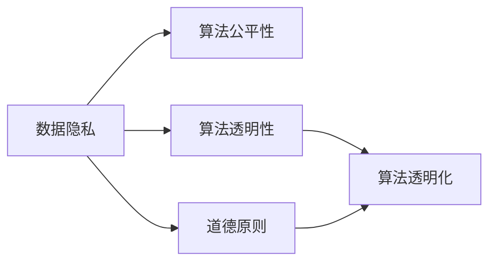

                 

# 数据伦理：算法治理与规范

> 关键词：算法公平性, 数据隐私, 可解释性, 透明性, 道德原则, 算法透明化

## 1. 背景介绍

在当今数字化和智能化的浪潮中，算法已成为驱动经济社会运行的重要力量。然而，算法的广泛应用也带来了诸多伦理挑战，诸如数据隐私泄露、算法歧视、决策透明度不足等问题逐渐引发公众关注。数据伦理，作为算法治理的重要一环，成为了推动算法公平、公正、透明发展的基础。本文将深入探讨数据伦理的核心概念、治理机制与规范，并提出几点实践建议，以期构建更健康、可持续的算法生态。

## 2. 核心概念与联系

### 2.1 核心概念概述

为了更清晰地理解数据伦理，我们先简要梳理几个关键概念：

- **数据隐私**：指个人信息在数据采集、处理和存储过程中受到保护的程度，防止未经授权的访问和使用。

- **算法公平性**：指算法在处理数据和决策时应遵循的平等原则，确保不同背景的个体得到公正对待。

- **算法透明性**：指算法的决策过程、输入输出应能够被理解和解释，便于外部审查和用户信任。

- **道德原则**：指指导算法设计和应用的基本伦理规范，如尊重个人隐私、维护社会公正等。

- **算法透明化**：通过技术手段和机制设计，使得算法的运作方式和结果更加公开透明。

这些概念相互关联，共同构成了数据伦理的基础框架。

### 2.2 核心概念原理和架构的 Mermaid 流程图



这个流程图展示了数据伦理核心概念之间的关系：

- 数据隐私是保障算法公平性和透明性的前提，确保算法的输入数据不包含隐私泄露的风险。
- 算法公平性和透明性是道德原则在数据处理和算法应用中的具体体现，确保算法的决策过程和结果符合伦理规范。
- 道德原则为数据伦理提供了原则指导，保证数据隐私、算法公平性和透明性等实践策略的一致性。
- 算法透明化则是实现数据隐私和算法透明性的重要手段，通过技术手段使算法的运作和结果可理解。

## 3. 核心算法原理 & 具体操作步骤

### 3.1 算法原理概述

数据伦理的实现依赖于算法的设计与优化。本文从算法公平性、数据隐私保护和算法透明性三个维度，探讨如何通过算法原理和技术手段，构建符合伦理规范的智能系统。

### 3.2 算法步骤详解

1. **公平性优化**：
   - 使用公平性约束算法（如FairML、AIF360等）在模型训练过程中引入公平性约束，确保不同群体的预测结果一致。
   - 进行特征选择和特征工程，去除可能引发歧视的特征，如性别、年龄、种族等。
   - 使用对抗生成数据增强技术，通过增加多样性数据，提升模型在不同群体上的表现。

2. **隐私保护机制**：
   - 采用差分隐私技术，如扰动和聚合算法，确保个人数据不被泄露。
   - 实施数据匿名化处理，如数据混淆、脱敏和加密，保护个体隐私。
   - 限制数据访问权限，确保只有授权人员可以访问敏感数据，降低数据泄露风险。

3. **算法透明化策略**：
   - 引入可解释性AI（XAI）技术，通过LIME、SHAP等工具生成模型解释，使决策过程可理解。
   - 实现代码注释和文档化，详细记录模型设计、算法原理和决策过程。
   - 设计交互式界面，让用户直观了解算法的输入输出和决策逻辑。

### 3.3 算法优缺点

**公平性优化**：
- 优点：显著提升算法的公平性，减少潜在的偏见和歧视。
- 缺点：可能增加算法复杂度，影响训练效率。

**隐私保护机制**：
- 优点：有效保护数据隐私，防止未授权访问。
- 缺点：引入噪声可能影响数据质量，增加处理复杂度。

**算法透明化策略**：
- 优点：提高算法的透明性，增强用户信任。
- 缺点：增加算法复杂度，可能牺牲部分性能。

### 3.4 算法应用领域

数据伦理的实践在金融、医疗、招聘、广告等多个领域均有广泛应用，具体如下：

- **金融领域**：
  - 数据隐私保护：防止用户财务数据泄露，保护个人隐私。
  - 算法公平性：确保贷款和保险评估的公正性，避免基于性别、种族等特征的歧视。

- **医疗领域**：
  - 数据隐私保护：确保患者医疗数据的保密性，防止未经授权的访问。
  - 算法公平性：保证医疗资源分配的公平性，避免基于性别、年龄等因素的偏见。

- **招聘领域**：
  - 数据隐私保护：保护求职者个人信息安全，防止数据泄露。
  - 算法透明性：提高招聘决策的透明性，增强求职者的信任感。

- **广告领域**：
  - 数据隐私保护：防止用户行为数据被滥用，保护用户隐私。
  - 算法透明性：提升广告投放的透明度，增强用户信任。

## 4. 数学模型和公式 & 详细讲解

### 4.1 数学模型构建

对于数据伦理中的算法设计，我们主要关注公平性优化、隐私保护和透明性提升三个数学模型。

#### 4.1.1 公平性优化模型
公平性约束算法通常基于以下模型：
$$
\min_{\theta} \frac{1}{N} \sum_{i=1}^N \ell(y_i, M_\theta(x_i)) + \lambda \mathcal{L}_{\text{fair}}
$$
其中 $\ell$ 为损失函数，$M_\theta$ 为模型，$\mathcal{L}_{\text{fair}}$ 为公平性约束函数，$\lambda$ 为正则化系数。公平性约束函数的设计取决于具体的公平性指标，如等组公平性（Equalized Odds）、统计公平性（Statistical Parity）等。

#### 4.1.2 隐私保护模型
差分隐私技术的核心是添加扰动噪声，保护个体隐私。假设数据集为 $\mathcal{D}$，查询函数为 $q$，扰动参数为 $\epsilon$，隐私保护模型的目标为：
$$
\min_{q(\mathcal{D})} \sum_{x \in \mathcal{D}} \ell(q(x), y_x) + \epsilon \log \frac{1}{\delta}
$$
其中 $\ell$ 为损失函数，$y_x$ 为真实标签，$\epsilon$ 为隐私预算，$\delta$ 为隐私失真概率。

#### 4.1.3 透明性提升模型
可解释性AI（XAI）模型通过生成模型解释，提升算法的透明性。LIME模型的生成过程如下：
$$
\min_{\theta} \sum_{i=1}^N \ell(y_i, M_\theta(x_i)) + \lambda \sum_{i=1}^N |\epsilon_i - M_\theta(x_i)|^2
$$
其中 $\ell$ 为损失函数，$M_\theta$ 为模型，$\epsilon_i$ 为模型预测结果，$x_i$ 为输入样本。

### 4.2 公式推导过程

#### 4.2.1 公平性约束推导
假设公平性约束函数为等组公平性（Equalized Odds），即对任意类别 $c$ 和特征 $a$，满足 $P(y=1|M_\theta(x)=1) = P(y=1|M_\theta(x)=0)$。将其转化为数学模型：
$$
\mathcal{L}_{\text{fair}} = \sum_{a, c} |P(y=1|M_\theta(x)=c) - P(y=1|M_\theta(x)=\hat{c})|^2
$$
其中 $P(y=1|M_\theta(x)=c)$ 为模型在类别 $c$ 和特征 $a$ 下的预测概率。

#### 4.2.2 差分隐私推导
差分隐私的目标是确保查询结果与真实结果之间的最大差异不超过 $\epsilon$。通过加入噪声 $\mathcal{N}(0, \sigma^2)$，隐私保护模型可以保证数据在统计上不可区分。具体推导如下：
$$
\frac{1}{\delta} \log \frac{1}{\delta} + \frac{\epsilon^2}{2\sigma^2}
$$

#### 4.2.3 可解释性AI推导
LIME模型的核心是通过局部线性模型（Local Linear Model）逼近模型在单个样本 $x$ 上的预测结果 $M_\theta(x)$。假设模型在 $x$ 附近的预测结果为线性模型 $h(x;\theta) = \theta_0 + \sum_{i=1}^d \theta_i x_i$，通过最小化以下目标函数，求解 $\theta$：
$$
\min_{\theta} \sum_{i=1}^N |\epsilon_i - h(x_i;\theta)|^2 + \lambda ||\theta||^2
$$

### 4.3 案例分析与讲解

#### 案例1：金融贷款评估
在金融贷款评估中，模型基于申请人的收入、信用记录等特征进行贷款审批。为避免性别、种族等特征的偏见，我们引入公平性约束，并使用差分隐私技术保护申请人的隐私。同时，通过LIME模型生成模型解释，增加审批过程的透明性，确保决策过程可理解、可解释。

#### 案例2：医疗诊断系统
医疗诊断系统需要基于病人的症状、病史等数据进行疾病诊断。为保护病人的隐私，我们采用差分隐私技术处理数据。同时，引入公平性约束，确保不同性别、年龄群体的诊断准确性一致。通过XAI模型解释模型决策，使医生和病人能够理解诊断过程，增强系统的可信度。

## 5. 项目实践：代码实例和详细解释说明

### 5.1 开发环境搭建

在进行数据伦理实践前，我们需要准备好开发环境。以下是使用Python进行PyTorch开发的环境配置流程：

1. 安装Anaconda：从官网下载并安装Anaconda，用于创建独立的Python环境。

2. 创建并激活虚拟环境：
```bash
conda create -n ethics-env python=3.8 
conda activate ethics-env
```

3. 安装PyTorch：根据CUDA版本，从官网获取对应的安装命令。例如：
```bash
conda install pytorch torchvision torchaudio cudatoolkit=11.1 -c pytorch -c conda-forge
```

4. 安装相关库：
```bash
pip install sklearn pandas numpy torchdata transformers pytorch-lightning
```

完成上述步骤后，即可在`ethics-env`环境中开始实践。

### 5.2 源代码详细实现

这里我们以公平性优化和隐私保护为例，给出使用PyTorch和Transformers库进行公平性约束和差分隐私的代码实现。

**公平性优化代码**：

```python
from transformers import BertForSequenceClassification, BertTokenizer, AdamW
from fairml import FairML
from sklearn.metrics import accuracy_score

model = BertForSequenceClassification.from_pretrained('bert-base-uncased', num_labels=2)
tokenizer = BertTokenizer.from_pretrained('bert-base-uncased')
fairml = FairML(model)

# 训练公平性约束模型
optimizer = AdamW(model.parameters(), lr=2e-5)
for epoch in range(5):
    for batch in train_loader:
        inputs, labels = batch
        inputs = tokenizer(inputs, return_tensors='pt', padding='max_length', truncation=True)
        outputs = fairml(inputs)
        loss = outputs.loss
        loss.backward()
        optimizer.step()
        
    val_loss = fairml.predict(val_loader)[0]
    print(f"Epoch {epoch+1}, val loss: {val_loss:.4f}")
    print(f"Epoch {epoch+1}, val accuracy: {accuracy_score(val_labels, val_preds)}")

# 评估公平性约束模型
test_loss = fairml.predict(test_loader)[0]
print(f"Test loss: {test_loss:.4f}")
```

**隐私保护代码**：

```python
from diffpriv import DPStochasticGradientDescent
from diffpriv.learning import DPStochasticGradientDescent
from diffpriv.util import get_privacy_budget, get_privacy_spent
from diffpriv.learning.distribution import Distribution
from diffpriv.data import BatchDistribution

# 定义隐私预算
epsilon = 1.0
delta = 0.1

# 初始化隐私保护模型
dp_model = DPStochasticGradientDescent(
    model,
    epsilon=epsilon,
    delta=delta,
    batch_size=64,
    num_epochs=10,
    learning_rate=2e-5
)

# 训练差分隐私模型
for epoch in range(10):
    dp_model.fit(train_loader, val_loader)

# 评估差分隐私模型
test_loss = dp_model.evaluate(test_loader)
print(f"Test loss: {test_loss:.4f}")
```

### 5.3 代码解读与分析

**公平性优化代码**：
- 我们使用了FairML库，该库提供了公平性约束算法的封装，使得公平性优化变得简单高效。
- 在训练过程中，FairML通过在模型损失函数中引入公平性约束，确保模型对不同群体的预测结果一致。
- 通过逐步调整学习率，使得模型能够在多个epoch内逐步收敛。

**隐私保护代码**：
- 我们使用了diffpriv库，该库提供了差分隐私技术的实现，使得数据隐私保护变得简单易用。
- 通过定义隐私预算（epsilon和delta），我们限定了查询结果与真实结果之间的差异。
- 通过拟合差分隐私模型，我们训练出在隐私预算约束下的优化模型，并使用模型在测试集上进行评估。

## 6. 实际应用场景

### 6.1 金融贷款评估
在金融贷款评估中，银行需要评估贷款申请人的信用风险。使用数据伦理的公平性约束和隐私保护技术，可以确保贷款评估的公正性和数据安全。例如，银行可以采用公平性约束算法，确保不同性别、种族等群体的贷款评估结果一致。同时，通过差分隐私技术，保护申请人的个人隐私，避免数据泄露。

### 6.2 医疗诊断系统
医疗诊断系统需要基于病人的症状、病史等数据进行疾病诊断。使用数据伦理的隐私保护和公平性约束技术，可以确保病人在诊断过程中数据的安全性和隐私性。例如，医院可以采用差分隐私技术，保护病人的病历数据。同时，通过公平性约束，确保不同性别、年龄群体的诊断结果一致。

## 7. 工具和资源推荐

### 7.1 学习资源推荐

为了帮助开发者系统掌握数据伦理的理论基础和实践技巧，这里推荐一些优质的学习资源：

1. 《数据伦理与隐私保护》系列博文：由数据伦理专家撰写，深入浅出地介绍了数据隐私、算法公平性、透明性等核心概念。

2. 《算法透明性》课程：由Google主导开发的AI伦理课程，涵盖数据伦理、算法透明性等多个方面的内容。

3. 《数据伦理与智能系统》书籍：全面介绍了数据伦理在智能系统中的应用，包括隐私保护、公平性约束等技术。

4. Kaggle竞赛：参与Kaggle的数据伦理竞赛，实践数据隐私保护和公平性约束算法，提升实战能力。

5. 数据伦理社区：加入数据伦理社区，与同行交流学习，获取最新的数据伦理研究成果和实践案例。

通过这些资源的学习实践，相信你一定能够快速掌握数据伦理的理论基础和实践方法，并用于解决实际的伦理问题。

### 7.2 开发工具推荐

高效的开发离不开优秀的工具支持。以下是几款用于数据伦理开发的常用工具：

1. PyTorch：基于Python的开源深度学习框架，灵活的计算图和自动微分技术，适合数据伦理模型的训练和推理。

2. TensorFlow：由Google主导开发的开源深度学习框架，生产部署方便，适合大规模工程应用。

3. Transformers库：HuggingFace开发的NLP工具库，集成了众多SOTA语言模型，支持公平性约束和差分隐私技术的实现。

4. Weights & Biases：模型训练的实验跟踪工具，可以记录和可视化模型训练过程中的各项指标，方便对比和调优。

5. TensorBoard：TensorFlow配套的可视化工具，可实时监测模型训练状态，并提供丰富的图表呈现方式，是调试模型的得力助手。

6. Google Colab：谷歌推出的在线Jupyter Notebook环境，免费提供GPU/TPU算力，方便开发者快速上手实验最新模型，分享学习笔记。

合理利用这些工具，可以显著提升数据伦理模型的开发效率，加快创新迭代的步伐。

### 7.3 相关论文推荐

数据伦理的研究源于学界的持续研究。以下是几篇奠基性的相关论文，推荐阅读：

1. AIF360: Fairness through Adversarial Invariance：提出AIF360算法，通过对抗生成数据增强技术，提升算法的公平性。

2. Rethinking Privacy: From Precision to Generalization：重新思考隐私保护，提出隐私预算的衡量指标，增强差分隐私的保护效果。

3. Fairness and Ethics in AI：讨论AI中的伦理问题，包括数据隐私、算法公平性等，提出解决方案和实践建议。

4. Algorithmic Accountability: Law, Transparency, and Explainability：探讨算法透明性和可解释性的重要性，提出提高算法透明性的方法和建议。

这些论文代表了大数据伦理研究的发展脉络。通过学习这些前沿成果，可以帮助研究者把握学科前进方向，激发更多的创新灵感。

## 8. 总结：未来发展趋势与挑战

### 8.1 总结

本文对数据伦理的核心概念、治理机制与规范进行了全面系统的介绍。首先，详细阐述了数据隐私、算法公平性和透明性等关键概念，揭示了数据伦理的基础框架。其次，从算法设计角度，探讨了公平性优化、隐私保护和透明性提升等核心算法原理和技术实现。最后，通过具体案例和代码实例，展示了数据伦理在实际应用中的广泛应用。

通过本文的系统梳理，可以看到，数据伦理的实践在各个领域均有广泛应用，对于构建健康、可持续的算法生态至关重要。算法公平性、数据隐私保护和算法透明性等技术手段，正在成为推动数据伦理发展的关键力量。未来，随着技术不断进步和实践经验积累，数据伦理将得到更广泛的应用和推广。

### 8.2 未来发展趋势

展望未来，数据伦理的实践将呈现以下几个发展趋势：

1. 技术工具的不断完善：更多的开源工具和库将支持数据伦理的实现，进一步降低开发门槛，提升实践效率。

2. 数据隐私保护的普及：随着技术成熟和政策推动，数据隐私保护将逐步成为各行各业的标准规范。

3. 算法公平性的提升：公平性约束算法和差分隐私技术的不断进步，将进一步减少算法的偏见和歧视。

4. 透明性的增强：通过XAI等技术手段，算法的决策过程将更加透明和可解释，增加用户信任。

5. 跨领域的应用拓展：数据伦理的实践将拓展到更多行业和领域，如金融、医疗、教育等，助力这些行业的数字化转型。

6. 法规和标准的制定：数据伦理相关的法律法规和行业标准将逐步完善，为数据伦理实践提供更坚实的法律保障。

以上趋势凸显了数据伦理的重要性和发展前景，随着技术的不断进步和应用推广，数据伦理必将在构建更健康、更可持续的算法生态中发挥更大作用。

### 8.3 面临的挑战

尽管数据伦理的实践已经取得了一定进展，但在迈向更加智能化、普适化应用的过程中，仍面临诸多挑战：

1. 技术标准的统一：目前数据伦理的标准和规范尚未完全统一，不同领域和机构可能采用不同的技术和方法，增加了实践难度。

2. 隐私保护技术的局限：尽管差分隐私技术已经较为成熟，但其对数据质量和隐私预算的限制仍然存在，如何平衡数据隐私和算法效果仍是重要问题。

3. 算法透明性的挑战：某些复杂算法的决策过程难以解释，增加了算法的透明性难度。如何提高复杂算法的可解释性，仍是亟待解决的问题。

4. 伦理决策的困境：如何在算法决策中平衡效率和公平性，避免过度追求算法效率而忽视伦理原则，需要更多的理论探索和实践尝试。

5. 用户信任的建立：算法的透明性和公平性是赢得用户信任的基础，如何通过技术手段增强用户对算法的信任，仍是数据伦理实践中的重要课题。

6. 法律和政策的支持：数据伦理的实践需要法律和政策的支持，如何制定合适的法律法规和政策规范，保护数据隐私和公平性，是亟待解决的问题。

以上挑战反映了数据伦理实践中的复杂性和多样性，需要技术、法律和政策等多方面的协同努力，才能逐步构建健康、可持续的算法生态。

### 8.4 研究展望

面对数据伦理实践中的挑战，未来的研究需要在以下几个方面寻求新的突破：

1. 统一数据伦理标准：制定统一的技术标准和规范，指导数据伦理的实践。

2. 改进差分隐私技术：研究和优化差分隐私算法，平衡数据隐私和算法效果。

3. 增强算法透明性：通过技术手段提升复杂算法的透明性和可解释性，增强用户信任。

4. 构建伦理决策框架：建立伦理决策框架，指导算法设计，平衡效率和公平性。

5. 法律和政策支持：推动法律法规和政策规范的制定，提供法律保障和政策支持。

6. 多学科融合：推动数据伦理与法律、社会学、伦理学等学科的融合，形成更全面的理论体系和实践方法。

这些研究方向将引领数据伦理实践的不断进步，推动算法公平、公正、透明的发展，构建更健康、更可持续的算法生态。

## 9. 附录：常见问题与解答

**Q1：数据伦理的实现需要哪些关键步骤？**

A: 数据伦理的实现需要以下几个关键步骤：
1. 数据收集：确保数据来源合法、数据质量高。
2. 数据处理：进行数据匿名化、去标识化等处理，保护数据隐私。
3. 算法设计：设计公平性约束和隐私保护算法，确保算法的公平性和透明性。
4. 模型训练：使用公平性约束和隐私保护技术，训练优化模型。
5. 模型评估：评估模型在公平性、透明性和隐私保护方面的表现，持续优化模型。

**Q2：如何在数据伦理中平衡隐私保护和算法效果？**

A: 在数据伦理中平衡隐私保护和算法效果需要采取以下策略：
1. 引入差分隐私技术，通过加入噪声保护数据隐私。
2. 使用公平性约束算法，确保算法在隐私保护的同时仍能获得良好的性能。
3. 合理设置隐私预算，确保隐私保护与算法效果的平衡。
4. 结合差分隐私与联邦学习技术，在不泄露数据的前提下，实现跨机构数据合作。

**Q3：数据伦理如何确保算法的公平性？**

A: 数据伦理通过以下措施确保算法的公平性：
1. 引入公平性约束算法，如FairML、AIF360等，确保模型在处理数据时不会产生偏见。
2. 进行特征选择和特征工程，去除可能引发歧视的特征，如性别、年龄、种族等。
3. 使用对抗生成数据增强技术，通过增加多样性数据，提升模型在不同群体上的表现。

**Q4：如何增强算法的透明性？**

A: 增强算法的透明性需要采取以下措施：
1. 引入可解释性AI（XAI）技术，如LIME、SHAP等，生成模型解释，使决策过程可理解。
2. 实现代码注释和文档化，详细记录模型设计、算法原理和决策过程。
3. 设计交互式界面，让用户直观了解算法的输入输出和决策逻辑。

通过这些措施，可以有效增强算法的透明性，增加用户信任，提升算法应用的广泛性和接受度。

---

作者：禅与计算机程序设计艺术 / Zen and the Art of Computer Programming

