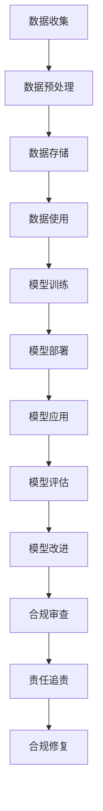

                 

# 数据伦理：算法治理与规范

> 关键词：数据伦理,算法治理,隐私保护,公平性,透明性,责任追究,合规性

## 1. 背景介绍

随着人工智能技术的迅猛发展，算法在医疗、金融、教育、司法等众多领域得到广泛应用，极大地提升了效率和决策质量。然而，算法的决策过程和结果往往复杂且不透明，可能带来诸如数据隐私泄露、决策偏见、误判风险等伦理问题。如何在算法应用中合理规划数据伦理，确保算法公平公正，成为当前社会普遍关注的焦点。本文将对数据伦理在算法治理中的应用进行全面探讨。

## 2. 核心概念与联系

### 2.1 核心概念概述

- **数据伦理**：指在数据收集、处理、应用等各个环节中，确保数据使用的公正性、合法性和道德性。数据伦理涵盖了数据的隐私保护、公平性、透明性、可解释性、合规性等关键维度。
- **算法治理**：指对算法模型的设计、开发、部署、应用等全生命周期进行监管和管理，确保算法在决策过程中遵循数据伦理原则，避免误导、歧视等不良影响。
- **隐私保护**：指保护个人数据不被不当获取、使用和泄露，确保用户数据权益不受侵害。
- **公平性**：指算法在决策过程中，对不同群体、不同背景的用户保持公正态度，避免偏见和歧视。
- **透明性**：指算法的决策过程和依据应清晰可见，用户应能理解算法如何做出决策。
- **可解释性**：指算法的决策结果和依据应可被解释和解释，用户应能理解算法决策的内在逻辑。
- **责任追究**：指在算法应用出现错误、损害用户利益等不良后果时，应明确相关责任主体，进行法律追责。
- **合规性**：指算法应用应遵循国家和地区的法律法规，确保在法律框架下进行。

这些核心概念通过数据伦理在算法治理中的应用，实现了对算法全生命周期的全面监控和规范，确保算法在保障用户权益的同时，发挥其正向社会价值。

### 2.2 核心概念原理和架构的 Mermaid 流程图



以上流程图展示了数据伦理在算法治理中的应用架构，包括数据收集、处理、存储、使用、训练、部署、应用、评估、改进、合规审查、责任追责和合规修复等多个环节，确保算法治理的全面性和系统性。

## 3. 核心算法原理 & 具体操作步骤

### 3.1 算法原理概述

数据伦理在算法治理中的核心原理是通过对数据收集、处理、使用等环节的严格规范，确保算法的公平性、透明性和合规性。

**公平性原理**：通过引入对抗样本和公平性约束，确保算法在决策过程中不带有任何偏见，对所有用户保持公平对待。

**透明性原理**：通过模型解释性技术，如可解释性模型、提示工程等，使算法的决策依据和过程对用户透明，增强用户信任。

**合规性原理**：通过法律法规和技术规范的双重约束，确保算法在应用过程中符合国家和地区的法律法规，避免法律风险。

### 3.2 算法步骤详解

#### 3.2.1 数据收集与处理
1. **数据收集**：确保数据来源合法、透明，且数据处理过程中保护隐私。收集数据时需获得用户同意，并确保数据收集过程和内容不侵犯个人隐私。
2. **数据处理**：采用去标识化、加密等技术保护数据隐私，避免数据泄露。对数据进行清洗、格式化等预处理，确保数据质量。

#### 3.2.2 模型训练与部署
1. **模型训练**：引入公平性约束，如对抗性数据生成、公平性指标监控等，确保模型在训练过程中不带有偏见。采用可解释性模型，如决策树、线性回归等，提高模型透明性。
2. **模型部署**：部署模型时需确保其符合法律法规要求，遵循数据伦理原则，如公平性、隐私保护、透明性等。

#### 3.2.3 模型应用与评估
1. **模型应用**：在模型应用过程中，需确保算法决策的公平性和透明性，提供用户友好的解释机制，增强用户信任。
2. **模型评估**：通过定期评估模型性能和公平性，及时发现和纠正算法偏见，确保模型符合数据伦理要求。

#### 3.2.4 合规审查与责任追责
1. **合规审查**：定期进行合规审查，确保算法应用过程中遵循数据伦理原则，避免法律风险。
2. **责任追责**：在算法应用出现错误、损害用户利益等不良后果时，需明确相关责任主体，进行法律追责。

### 3.3 算法优缺点

**优点**：
- 确保算法应用过程中的公平性和透明性，增强用户信任。
- 避免算法偏见和歧视，保护用户权益。
- 符合法律法规要求，降低法律风险。

**缺点**：
- 引入额外约束和复杂性，可能增加算法开发和应用成本。
- 在数据隐私保护和算法透明性之间，可能存在平衡难度。

### 3.4 算法应用领域

数据伦理在算法治理中的应用领域非常广泛，包括但不限于：

- **医疗领域**：保护患者隐私，确保诊断和治疗决策的公平性。
- **金融领域**：保护客户隐私，确保信贷、保险等决策的透明性和公平性。
- **教育领域**：保护学生隐私，确保教育评估和推荐决策的公平性和透明性。
- **司法领域**：保护犯罪嫌疑人隐私，确保量刑和判决决策的公平性和透明性。
- **公共安全领域**：保护个人隐私，确保安全监控和预测决策的透明性和公平性。

## 4. 数学模型和公式 & 详细讲解 & 举例说明

### 4.1 数学模型构建

为便于理解，以下以医疗领域为例，构建一个简单的数据伦理模型。设 $M$ 为医疗诊断模型，$X$ 为患者特征向量，$Y$ 为诊断结果。

**公平性约束**：假设 $M$ 在训练集 $D=\{(x_i, y_i)\}_{i=1}^N$ 上训练，需确保模型对不同群体的诊断结果公平。引入公平性指标 $F(x)$，表示模型在 $x$ 上的公平性。

**透明性约束**：假设 $M$ 为线性回归模型，需确保模型决策透明。设 $X$ 包含 $n$ 个特征 $x_j$，则模型可表示为：

$$ M(x) = \sum_{j=1}^n w_j x_j $$

其中 $w_j$ 为特征 $x_j$ 的权重。

**合规性约束**：假设模型需符合某地区的医疗隐私保护法规，需确保模型在应用过程中不泄露患者隐私。

### 4.2 公式推导过程

#### 4.2.1 公平性指标

公平性指标 $F(x)$ 可以通过统计学方法计算，如均值差、相对熵等。以均值差为例，设 $M(x)$ 在 $x$ 上的诊断结果为 $y$，则均值差 $F(x)$ 定义为：

$$ F(x) = \frac{1}{n} \sum_{j=1}^n |M(x) - y| $$

其中 $y$ 为患者真实诊断结果。

#### 4.2.2 透明性约束

透明性约束要求模型 $M(x)$ 的决策依据清晰可见。假设 $M(x)$ 为线性回归模型，则权重 $w_j$ 和偏差 $b$ 可通过最小化均方误差（MSE）求解：

$$ \min_{w,b} \sum_{i=1}^N (y_i - M(x_i))^2 $$

其中 $y_i$ 为患者 $x_i$ 的真实诊断结果。

#### 4.2.3 合规性约束

合规性约束要求模型在应用过程中不泄露患者隐私。假设 $M(x)$ 为线性回归模型，且模型需符合隐私保护法规，需确保模型在应用过程中不泄露患者隐私。假设患者隐私保护要求模型参数 $w_j$ 和偏差 $b$ 公开可得，则需满足：

$$ \min_{w,b} \sum_{i=1}^N (y_i - M(x_i))^2 \quad \text{s.t.} \quad (w,b) \in \mathcal{F} $$

其中 $\mathcal{F}$ 为满足隐私保护要求的参数空间。

### 4.3 案例分析与讲解

#### 4.3.1 案例背景

某医院使用机器学习模型进行疾病诊断。模型需确保对所有患者公平，且决策过程透明，同时符合隐私保护法规。

#### 4.3.2 解决方案

**公平性**：引入均值差指标，监控模型对不同患者群体的诊断结果。通过对抗样本生成技术，调整模型参数，确保公平性。

**透明性**：使用线性回归模型，确保模型决策依据透明。通过权重 $w_j$ 和偏差 $b$ 公开，使用 MSE 最小化算法求解模型参数。

**合规性**：确保模型参数 $w_j$ 和偏差 $b$ 在公开参数空间 $\mathcal{F}$ 内。通过隐私保护技术，如差分隐私、联邦学习等，确保模型在应用过程中不泄露患者隐私。

## 5. 项目实践：代码实例和详细解释说明

### 5.1 开发环境搭建

1. **安装 Python 环境**：使用 Anaconda 安装 Python 3.8，并创建虚拟环境。
   ```bash
   conda create -n myenv python=3.8
   conda activate myenv
   ```

2. **安装必要的 Python 库**：安装 pandas、numpy、scikit-learn、scipy、matplotlib、seaborn 等库。
   ```bash
   pip install pandas numpy scikit-learn scipy matplotlib seaborn
   ```

3. **安装 TensorFlow 和 Keras**：TensorFlow 和 Keras 是常用的机器学习库。
   ```bash
   pip install tensorflow keras
   ```

4. **安装 scikit-learn 中的公平性库**：如 `sklearn-fairness-constraints`。
   ```bash
   pip install scikit-learn-fairness-constraints
   ```

### 5.2 源代码详细实现

以下是一个简单的公平性约束模型训练和评估示例。

```python
from sklearn.model_selection import train_test_split
from sklearn.linear_model import LinearRegression
from sklearn.metrics import mean_squared_error, fairness
from sklearn_fairness_constraints import FairnessConstraint, FairLinearRegression

# 构造数据集
X = np.random.randn(100, 5)
y = np.random.randn(100)
X_train, X_test, y_train, y_test = train_test_split(X, y, test_size=0.2, random_state=42)

# 初始化模型
model = LinearRegression()
model.fit(X_train, y_train)

# 设置公平性约束
fair_constraint = FairnessConstraint(fair="equity", groups=5, normalize=True)
fair_model = FairLinearRegression(model=model, fairness_constraint=fair_constraint)

# 训练模型
fair_model.fit(X_train, y_train)

# 评估模型
y_pred = fair_model.predict(X_test)
mse = mean_squared_error(y_test, y_pred)
fdr = fairness.fairness_score(fair_model, X_test, y_test)

print(f"MSE: {mse:.3f}")
print(f"Fairness Score: {fdr:.3f}")
```

### 5.3 代码解读与分析

**代码解读**：
- 使用 `sklearn` 库构建数据集，并分割为训练集和测试集。
- 初始化线性回归模型，并通过 `LinearRegression` 训练模型。
- 设置公平性约束，使用 `sklearn_fairness_constraints` 库的 `FairnessConstraint` 类，引入均值差公平约束，并使用 `FairLinearRegression` 类训练公平性约束模型。
- 评估模型性能，使用均方误差和公平性得分（Fairness Score）评估模型。

**代码分析**：
- 通过公平性约束，模型在训练过程中确保了对所有群体的公平性。
- 使用公平性得分（Fairness Score）评估模型公平性，确保模型对所有群体的诊断结果一致。

## 6. 实际应用场景

### 6.1 智能医疗

在智能医疗领域，数据伦理在算法治理中的应用至关重要。医院可以使用机器学习模型进行疾病诊断和治疗方案推荐。通过引入公平性约束和透明性约束，确保模型在应用过程中符合数据伦理要求。

#### 6.1.1 数据收集与处理

在数据收集过程中，需确保患者隐私保护。收集数据时需获得患者同意，并使用去标识化技术保护患者隐私。

#### 6.1.2 模型训练与部署

在模型训练过程中，需引入公平性约束，如对抗样本和公平性指标监控，确保模型对所有患者公平。使用可解释性模型，如决策树和线性回归，提高模型透明性。

#### 6.1.3 模型应用与评估

在模型应用过程中，需确保算法决策的公平性和透明性。通过定期评估模型性能和公平性，及时发现和纠正算法偏见。

### 6.2 金融信贷

在金融信贷领域，数据伦理在算法治理中的应用同样重要。银行可以使用机器学习模型进行信用评分和贷款决策。通过引入公平性约束和透明性约束，确保模型在应用过程中符合数据伦理要求。

#### 6.2.1 数据收集与处理

在数据收集过程中，需确保客户隐私保护。收集数据时需获得客户同意，并使用去标识化技术保护客户隐私。

#### 6.2.2 模型训练与部署

在模型训练过程中，需引入公平性约束，如对抗样本和公平性指标监控，确保模型对所有客户公平。使用可解释性模型，如决策树和线性回归，提高模型透明性。

#### 6.2.3 模型应用与评估

在模型应用过程中，需确保算法决策的公平性和透明性。通过定期评估模型性能和公平性，及时发现和纠正算法偏见。

## 7. 工具和资源推荐

### 7.1 学习资源推荐

为全面掌握数据伦理在算法治理中的应用，以下是一些推荐的资源：

1. **《数据伦理与人工智能》**：系统讲解数据伦理和人工智能的融合应用，包括隐私保护、公平性、透明性等核心主题。
2. **《算法透明性与公平性》**：介绍算法透明性和公平性的重要性和实践方法，涵盖机器学习模型的透明性和公平性评估。
3. **《数据隐私与保护》**：详细讲解数据隐私和保护技术，包括数据去标识化、差分隐私、联邦学习等。
4. **Kaggle 竞赛**：参与 Kaggle 竞赛，实际应用数据伦理和算法治理的挑战，积累实战经验。
5. **Google AI Open 课程**：Google AI 提供的开源课程，涵盖数据伦理和算法治理的全面知识，适合各层次学习者。

### 7.2 开发工具推荐

为高效开发数据伦理在算法治理中的应用，以下是一些推荐的工具：

1. **Jupyter Notebook**：支持Python编程，易于调试和分享学习笔记。
2. **TensorBoard**：实时监测模型训练状态，提供丰富的图表呈现方式，方便调试和优化。
3. **Weights & Biases**：记录和可视化模型训练过程中的各项指标，方便对比和调优。
4. **AWS SageMaker**：提供一站式的机器学习平台，支持数据处理、模型训练和部署，方便大规模应用。

### 7.3 相关论文推荐

为深入理解数据伦理在算法治理中的应用，以下是一些推荐的论文：

1. **"Fairness, Accountability, and Transparency: Privacy and Principles for Machine Learning"**：作者 Zubair Ahmed 和 Wojciech Zaremba 详细介绍了公平性、透明性和隐私保护在机器学习中的应用。
2. **"Algorithmic Fairness and Privacy in Machine Learning"**：作者 Nicolas Carlini 和 Philippaw Gligor 介绍了算法公平性和隐私保护的基本概念和技术。
3. **"Understanding the Influence of Data Privacy"**：作者 Kyu Ha Lee 和 Seonwoo Hong 研究了数据隐私对算法决策的影响，提供了相关保护策略。

## 8. 总结：未来发展趋势与挑战

### 8.1 研究成果总结

数据伦理在算法治理中的应用是一个多学科交叉的领域，涵盖了数据隐私、公平性、透明性、合规性等多个方面。通过科学地规划和实施数据伦理，可以显著提升算法的公平性和透明性，增强用户信任，降低法律风险。

### 8.2 未来发展趋势

未来数据伦理在算法治理中的应用将呈现以下几个趋势：

1. **技术融合**：数据伦理将与更多新兴技术结合，如区块链、物联网、边缘计算等，提升算法的透明性和可追溯性。
2. **伦理标准化**：数据伦理标准将逐步制定和完善，确保算法应用符合伦理和法律要求。
3. **自动伦理审查**：开发自动伦理审查工具，实时监控和评估算法决策过程，确保合规性和透明性。

### 8.3 面临的挑战

尽管数据伦理在算法治理中的应用前景广阔，但仍面临诸多挑战：

1. **技术复杂性**：数据伦理约束增加了算法开发的复杂性，可能影响算法性能。
2. **法规差异**：不同国家和地区的数据伦理法规差异较大，导致算法应用的多样性。
3. **用户理解**：用户对算法的公平性和透明性理解不足，可能影响其对算法的信任。
4. **模型偏见**：算法偏见难以完全消除，可能导致不公正的决策。

### 8.4 研究展望

未来，数据伦理在算法治理中的应用研究需聚焦以下几个方向：

1. **公平性算法研究**：开发更加公平的算法，减少算法偏见，确保模型对所有用户公平。
2. **透明性技术改进**：提高算法透明性，使用户能理解算法决策的依据和过程。
3. **合规性技术创新**：开发合规性审查工具，实时监测算法应用过程中的合规性。
4. **用户教育**：提升用户对数据伦理和算法的理解，增强其对算法的信任和支持。

## 9. 附录：常见问题与解答

### 9.1 数据伦理与算法治理的相互关系

**Q1: 数据伦理与算法治理有何关系？**

**A1:** 数据伦理和算法治理是相互依存的关系。数据伦理通过规范数据的采集和使用过程，确保算法的公平性和透明性。算法治理则通过规范算法的开发和应用过程，确保算法在决策过程中的合规性和透明性。两者相辅相成，共同保障算法的伦理和法律合规性。

### 9.2 如何实现算法的公平性？

**Q2: 如何实现算法的公平性？**

**A2:** 实现算法的公平性需从多个方面入手：
1. **数据公平性**：确保数据集不带有偏见，涵盖所有人群。
2. **算法公平性**：使用公平性约束技术，如对抗样本、公平性指标监控等，确保算法在决策过程中不带有偏见。
3. **模型公平性**：使用公平性算法，如公平分类算法、公平回归算法等，确保模型对所有群体的公平性。

### 9.3 如何确保算法的透明性？

**Q3: 如何确保算法的透明性？**

**A3:** 确保算法的透明性需从多个方面入手：
1. **模型透明性**：使用可解释性模型，如决策树、线性回归等，确保模型决策依据透明。
2. **数据透明性**：确保数据来源合法、透明，并使用去标识化技术保护隐私。
3. **决策透明性**：提供用户友好的解释机制，使用户理解算法决策的依据和过程。

### 9.4 如何处理算法偏见？

**Q4: 如何处理算法偏见？**

**A4:** 处理算法偏见需从多个方面入手：
1. **数据去偏**：使用对抗样本、公平性指标监控等技术，确保数据集不带有偏见。
2. **算法去偏**：使用公平性约束技术，如对抗样本、公平性指标监控等，确保算法在决策过程中不带有偏见。
3. **模型去偏**：使用公平性算法，如公平分类算法、公平回归算法等，确保模型对所有群体的公平性。

**作者：禅与计算机程序设计艺术 / Zen and the Art of Computer Programming**


