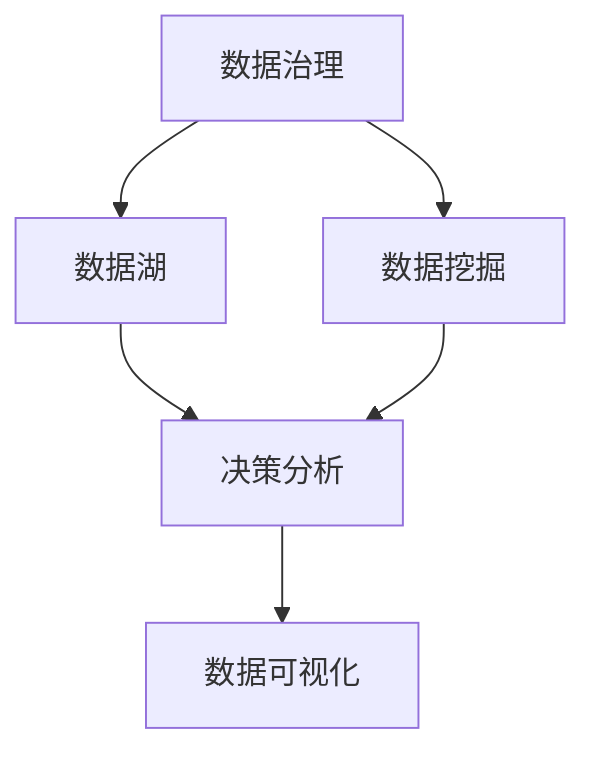

                 

# 数据驱动决策：现代管理者的必备技能

## 1. 背景介绍

### 1.1 问题由来
在信息时代，数据已经成为企业最宝贵的资产之一。然而，面对海量且复杂的数据，许多管理者仍然无法有效利用数据来进行科学决策。这不仅浪费了宝贵的数据资源，更会导致企业在竞争中错失良机。

### 1.2 问题核心关键点
数据驱动决策的本质在于通过系统的数据收集、处理和分析，辅助管理者进行科学决策。其核心要素包括：

- 数据收集：从企业内部运营、外部市场、社交媒体等渠道获取数据。
- 数据存储：通过数据库、数据湖等技术，保障数据的有效存储和访问。
- 数据分析：利用统计学、机器学习等方法，从数据中提取有价值的信息。
- 数据可视化：将数据结果转化为直观的图表、报表等，便于管理者理解和决策。
- 决策支持：将数据分析结果与企业战略相结合，制定科学的决策方案。

数据驱动决策能够帮助企业快速响应市场变化，优化运营效率，降低风险，提高竞争力。然而，这一过程也面临诸多挑战，包括数据质量、隐私保护、技术门槛等。

### 1.3 问题研究意义
掌握数据驱动决策的技能，对于现代管理者至关重要。通过科学、系统的数据管理，管理者能够：

- 提升决策准确性：依据数据进行客观决策，减少主观偏见。
- 优化运营效率：利用数据分析揭示流程中的瓶颈和优化点。
- 降低运营风险：通过数据监控和预警，及时发现并应对潜在问题。
- 加速产品迭代：基于客户反馈和市场数据，快速调整产品策略。
- 增强客户关系：通过数据分析洞察客户需求，提供更个性化的服务。

掌握数据驱动决策的技能，不仅可以提升管理者的决策能力，更能够为企业带来长期的竞争优势和业务增长。

## 2. 核心概念与联系

### 2.1 核心概念概述

为更好地理解数据驱动决策，本节将介绍几个核心概念：

- 数据治理(Data Governance)：确保数据的质量、完整性和一致性，制定数据使用规范。
- 数据湖(Data Lake)：用于存储和分析海量异构数据的集中式数据存储平台。
- 数据挖掘(Data Mining)：通过统计学、机器学习等方法，从数据中发现规律和模式。
- 决策分析(Decision Analytics)：利用数据挖掘结果，辅助管理者制定决策。
- 数据可视化(Data Visualization)：将数据结果转化为直观的图表、报表，便于理解。

这些核心概念之间的逻辑关系可以通过以下Mermaid流程图来展示：



这个流程图展示了一系列数据驱动决策的核心步骤：

1. 通过数据治理，确保数据的质量和规范性。
2. 使用数据湖集中存储数据，便于后续分析。
3. 利用数据挖掘技术，发现数据中的规律和模式。
4. 基于数据挖掘结果，辅助决策分析，制定决策方案。
5. 通过数据可视化，将决策结果直观展示，便于理解。

这些概念共同构成了数据驱动决策的全流程，使得管理者能够科学、系统地利用数据进行决策。

## 3. 核心算法原理 & 具体操作步骤
### 3.1 算法原理概述

数据驱动决策的核心在于通过系统的数据收集、处理和分析，辅助管理者进行科学决策。其核心思想是：

- 通过数据治理，确保数据的准确性、完整性和一致性。
- 利用数据湖，集中存储和管理海量异构数据。
- 运用数据挖掘技术，从数据中提取有价值的信息和知识。
- 结合决策分析，将数据挖掘结果应用于具体决策场景。
- 通过数据可视化，将决策结果直观展示，辅助管理者理解和决策。

### 3.2 算法步骤详解

数据驱动决策的过程主要包括以下几个步骤：

**Step 1: 数据收集**

- 从企业内部运营、外部市场、社交媒体等渠道，获取所需数据。
- 数据格式可能包括结构化数据、半结构化数据和无结构化数据。

**Step 2: 数据存储与管理**

- 利用数据湖技术，集中存储和管理数据。
- 采用数据分区、索引、元数据管理等技术，提高数据访问效率和数据质量。

**Step 3: 数据清洗与预处理**

- 去除重复、缺失、异常数据。
- 进行数据格式转换和标准化处理。

**Step 4: 数据挖掘与模型构建**

- 运用统计学、机器学习等方法，从数据中提取有价值的信息和模式。
- 构建分类、回归、聚类等模型，用于预测和分析。

**Step 5: 决策分析与方案制定**

- 将数据挖掘结果应用于具体决策场景。
- 利用决策树、贝叶斯网络、线性规划等方法，辅助制定决策方案。

**Step 6: 数据可视化与结果展示**

- 将数据挖掘和决策分析结果转化为直观的图表、报表等。
- 利用Tableau、PowerBI、D3.js等工具，实现数据可视化。

### 3.3 算法优缺点

数据驱动决策的优势在于能够通过科学、系统的数据管理，提升决策的准确性和效率。其具体优点包括：

- 提高决策准确性：依据数据进行客观决策，减少主观偏见。
- 优化运营效率：利用数据分析揭示流程中的瓶颈和优化点。
- 降低运营风险：通过数据监控和预警，及时发现并应对潜在问题。
- 加速产品迭代：基于客户反馈和市场数据，快速调整产品策略。
- 增强客户关系：通过数据分析洞察客户需求，提供更个性化的服务。

然而，数据驱动决策也存在一定的局限性：

- 数据质量问题：数据收集和处理中的错误可能导致决策偏差。
- 隐私保护问题：企业需要平衡数据利用和隐私保护之间的关系。
- 技术门槛较高：数据治理、数据湖、数据挖掘等技术复杂，需要专业技能。

尽管存在这些局限性，但数据驱动决策仍然是现代企业管理中不可或缺的重要工具。

### 3.4 算法应用领域

数据驱动决策技术在多个领域已经得到了广泛应用，例如：

- 企业运营管理：通过数据挖掘和决策分析，优化生产流程，提高运营效率。
- 市场分析：利用市场数据和客户反馈，调整市场策略，提升市场竞争力。
- 产品开发：基于客户需求和市场趋势，快速迭代产品设计，提升产品竞争力。
- 客户关系管理：通过数据分析洞察客户需求，提供个性化服务，增强客户满意度。
- 财务分析：利用财务数据进行风险预测和投资决策，优化财务结构。

此外，数据驱动决策技术在智能制造、智慧城市、医疗健康等众多领域也有广泛应用，为传统行业数字化转型提供了新的方向。

## 4. 数学模型和公式 & 详细讲解 & 举例说明
### 4.1 数学模型构建

假设企业有$m$个客户，每个客户的历史行为数据包括购买次数、购买金额、浏览记录等。我们希望构建一个分类模型，预测新客户的购买行为。设$x_i$为第$i$个客户的特征向量，$y_i$为客户的购买行为（0表示未购买，1表示购买），则数学模型可以表示为：

$$
P(y_i|x_i; \theta) = \frac{1}{1 + \exp(-z_i)}
$$

其中$z_i = \theta^T x_i$，$\theta$为模型参数。

### 4.2 公式推导过程

将概率模型扩展为多类别分类模型，可得：

$$
P(y_i|x_i; \theta) = \frac{\exp(z_i \cdot \theta)}{\sum_j \exp(z_j \cdot \theta)}
$$

其中$y_i$为$i$个类别的one-hot编码。

通过最大化对数似然函数：

$$
L(\theta) = \sum_i \log P(y_i|x_i; \theta)
$$

可以最小化模型预测与实际标签之间的差距，从而优化模型参数。具体推导过程如下：

$$
L(\theta) = -\sum_i y_i \log P(y_i|x_i; \theta) - (1-y_i) \log P(1-y_i|x_i; \theta)
$$

对$L(\theta)$求导，得：

$$
\frac{\partial L(\theta)}{\partial \theta} = \sum_i (y_i - P(y_i|x_i; \theta)) x_i
$$

因此，模型参数$\theta$的更新公式为：

$$
\theta \leftarrow \theta - \eta \frac{\partial L(\theta)}{\partial \theta}
$$

其中$\eta$为学习率。

### 4.3 案例分析与讲解

以下是一个简单的实际案例，利用数据驱动决策技术进行客户购买行为预测：

1. **数据收集**：收集企业所有客户的购买记录、浏览记录、历史评价等信息。
2. **数据存储**：使用数据湖技术集中存储和组织数据。
3. **数据清洗**：处理缺失值、异常值，转换数据格式。
4. **数据挖掘**：构建决策树模型，利用特征选择和特征提取技术，提取有价值的信息。
5. **模型训练**：使用训练集数据，训练决策树模型，调整模型参数，确保模型准确性。
6. **决策分析**：利用测试集数据，评估模型性能，优化模型参数。
7. **数据可视化**：通过图表展示模型的预测结果，辅助管理者理解决策结果。

通过这个案例，可以看到数据驱动决策技术的应用流程，从数据收集、存储到模型训练、评估和可视化，每一步都需要精细的设计和执行。

## 5. 项目实践：代码实例和详细解释说明
### 5.1 开发环境搭建

在进行数据驱动决策实践前，我们需要准备好开发环境。以下是使用Python进行Scikit-learn开发的环境配置流程：

1. 安装Anaconda：从官网下载并安装Anaconda，用于创建独立的Python环境。

2. 创建并激活虚拟环境：
```bash
conda create -n data-governance python=3.8 
conda activate data-governance
```

3. 安装Scikit-learn和其他依赖库：
```bash
conda install scikit-learn pandas numpy matplotlib seaborn sklearn
```

4. 安装Jupyter Notebook：
```bash
conda install jupyter notebook
```

5. 安装JupyterLab：
```bash
conda install jupyterlab
```

完成上述步骤后，即可在`data-governance`环境中开始数据驱动决策实践。

### 5.2 源代码详细实现

这里我们以客户购买行为预测为例，给出使用Scikit-learn进行数据驱动决策的PyTorch代码实现。

首先，定义客户特征和标签：

```python
import pandas as pd
from sklearn.model_selection import train_test_split
from sklearn.preprocessing import StandardScaler

# 假设有一个包含客户信息的CSV文件
data = pd.read_csv('customer_data.csv')

# 提取特征和标签
features = ['age', 'income', 'education', 'purchasing_frequency', 'browsing_time']
target = 'purchase'
X = data[features]
y = data[target]

# 数据标准化
scaler = StandardScaler()
X = scaler.fit_transform(X)
```

然后，构建和训练模型：

```python
from sklearn.ensemble import RandomForestClassifier
from sklearn.metrics import accuracy_score
from sklearn.model_selection import cross_val_score

# 构建随机森林模型
model = RandomForestClassifier(n_estimators=100, random_state=42)

# 训练模型
X_train, X_test, y_train, y_test = train_test_split(X, y, test_size=0.2, random_state=42)
model.fit(X_train, y_train)

# 预测和评估
y_pred = model.predict(X_test)
accuracy = accuracy_score(y_test, y_pred)
print(f"Accuracy: {accuracy:.2f}")
```

最后，进行结果可视化：

```python
import matplotlib.pyplot as plt
import seaborn as sns

# 绘制混淆矩阵
confusion_matrix = pd.crosstab(y_test, y_pred, normalize=True)
plt.figure(figsize=(8, 6))
sns.heatmap(confusion_matrix, annot=True, fmt='.2f', cmap='Blues')
plt.title('Confusion Matrix')
plt.xlabel('Predicted')
plt.ylabel('Actual')

# 绘制ROC曲线
y_pred_proba = model.predict_proba(X_test)[:, 1]
fpr, tpr, _ = roc_curve(y_test, y_pred_proba)
plt.figure(figsize=(8, 6))
plt.plot(fpr, tpr, label='ROC Curve')
plt.plot([0, 1], [0, 1], 'k--')
plt.xlabel('False Positive Rate')
plt.ylabel('True Positive Rate')
plt.title('Receiver Operating Characteristic')
plt.legend()

# 绘制ROC曲线和AUC
auc = roc_auc_score(y_test, y_pred_proba)
plt.figure(figsize=(8, 6))
plt.plot(fpr, tpr, label=f'AUC = {auc:.2f}')
plt.xlabel('False Positive Rate')
plt.ylabel('True Positive Rate')
plt.title('Receiver Operating Characteristic')
plt.legend()
```

以上就是一个完整的客户购买行为预测的代码实现，包括数据预处理、模型训练、评估和可视化。

### 5.3 代码解读与分析

让我们再详细解读一下关键代码的实现细节：

**特征选择**：
- 首先从数据集中提取了五个特征，包括年龄、收入、教育程度、购买频率和浏览时间。
- 使用`StandardScaler`对特征进行了标准化处理，以便更好地训练模型。

**模型训练**：
- 构建了一个随机森林模型，并使用`train_test_split`方法将数据集划分为训练集和测试集。
- 使用`fit`方法训练模型，并使用`predict`方法进行预测。

**模型评估**：
- 使用`accuracy_score`计算了模型在测试集上的准确率。
- 使用`confusion_matrix`绘制了混淆矩阵，评估模型的分类效果。
- 使用`roc_curve`和`roc_auc_score`计算了模型的ROC曲线和AUC值，进一步评估模型的性能。

可以看到，使用Scikit-learn进行数据驱动决策的过程非常简单，开发者可以快速上手并实现自己的数据驱动决策模型。

## 6. 实际应用场景
### 6.1 智能制造

在智能制造领域，数据驱动决策技术能够优化生产流程，提高生产效率和产品质量。例如，通过实时监测生产设备的运行状态，预测设备故障，提前进行维护，避免停机损失。同时，利用历史生产数据，优化生产排程和库存管理，减少浪费，提高资源利用率。

### 6.2 智慧城市

智慧城市建设需要大量数据支持，包括交通流量、环境监测、能源消耗等。数据驱动决策技术能够帮助城市管理者实时掌握城市运行状态，优化交通、能源等资源配置。例如，通过实时分析交通数据，优化交通信号灯，减少拥堵；通过环境监测数据，优化城市绿化和清洁计划；通过能源消耗数据，优化能源使用和调度。

### 6.3 金融风险管理

金融行业面临着复杂多变的外部环境，数据驱动决策技术能够帮助金融机构预测市场趋势，识别风险点，制定应对策略。例如，通过分析历史交易数据和市场数据，预测股票价格和市场波动；通过分析客户行为数据，识别潜在风险客户，优化风险管理策略；通过分析宏观经济数据，预测宏观经济走势，制定投资策略。

### 6.4 未来应用展望

随着数据驱动决策技术的不断发展，未来将有更多的应用场景涌现，为各行各业带来深远影响。

- 医疗健康：通过分析患者数据和医疗记录，制定个性化治疗方案，提高治疗效果。
- 教育培训：通过分析学生数据和学习行为，优化课程设计和教学方法，提升教育效果。
- 环境监测：通过分析环境数据和气候变化趋势，制定环境保护措施，提升环境治理能力。
- 人力资源管理：通过分析员工数据和绩效考核结果，优化人员配置和培训计划，提升人力资源管理水平。

## 7. 工具和资源推荐
### 7.1 学习资源推荐

为了帮助开发者系统掌握数据驱动决策的理论基础和实践技巧，这里推荐一些优质的学习资源：

1. 《数据科学导论》：由国内外知名专家联合撰写，涵盖数据科学基础知识和前沿技术，是学习数据驱动决策的入门必读。
2. 《Python数据分析与可视化》：利用Python进行数据处理和可视化的实战教程，适合初学者入门。
3. Coursera《数据科学基础》课程：由Johns Hopkins大学开设，系统讲解数据科学的基础知识和实践技能。
4. Kaggle平台：提供海量数据集和机器学习竞赛，适合实战练习和经验积累。
5. DataCamp：提供在线数据科学课程，涵盖数据处理、统计分析、机器学习等多个主题。

通过对这些资源的学习实践，相信你一定能够快速掌握数据驱动决策的精髓，并用于解决实际的数据驱动决策问题。

### 7.2 开发工具推荐

高效的开发离不开优秀的工具支持。以下是几款用于数据驱动决策开发的常用工具：

1. Jupyter Notebook：开源的交互式计算平台，支持Python、R等多种编程语言，适合数据科学项目开发。
2. PyTorch：基于Python的开源深度学习框架，支持动态图和静态图计算，适合数据科学项目中的模型训练和推理。
3. Pandas：强大的数据处理库，支持数据清洗、数据处理和数据分析，是数据科学项目中的重要工具。
4. Scikit-learn：开源的机器学习库，提供了丰富的算法和模型，适合数据科学项目中的模型构建和评估。
5. Tableau：商业化的数据可视化工具，支持复杂的数据报表和可视化，适合数据科学项目中的结果展示和决策支持。

合理利用这些工具，可以显著提升数据驱动决策任务的开发效率，加快创新迭代的步伐。

### 7.3 相关论文推荐

数据驱动决策技术的发展源于学界的持续研究。以下是几篇奠基性的相关论文，推荐阅读：

1. K-Means算法：经典的数据聚类算法，利用数据点之间的距离关系，将数据分为若干群组。
2. 线性回归：经典的回归分析方法，用于预测连续型数据。
3. 决策树算法：基于树形结构进行分类和回归的算法，简单易懂，易于实现。
4. 随机森林算法：利用多棵决策树进行集成学习，提升分类和回归的准确性。
5. 神经网络：用于解决复杂的分类和回归问题的算法，近年来在深度学习领域取得了重大进展。

这些论文代表了大数据驱动决策技术的发展脉络。通过学习这些前沿成果，可以帮助研究者把握学科前进方向，激发更多的创新灵感。

## 8. 总结：未来发展趋势与挑战
### 8.1 总结

本文对数据驱动决策技术进行了全面系统的介绍。首先阐述了数据驱动决策的背景和意义，明确了其在提升企业决策能力、优化运营效率等方面的独特价值。其次，从原理到实践，详细讲解了数据驱动决策的数学模型、操作步骤和关键技术，给出了数据驱动决策任务开发的完整代码实例。同时，本文还广泛探讨了数据驱动决策技术在智能制造、智慧城市、金融风险管理等多个行业领域的应用前景，展示了数据驱动决策技术的广阔前景。

通过本文的系统梳理，可以看到，数据驱动决策技术正在成为现代企业管理中的重要工具，极大地提升了企业的决策能力和运营效率。未来，伴随数据驱动决策技术的持续演进，企业将能够更科学、更系统地利用数据，实现业务的智能化、自动化和持续优化。

### 8.2 未来发展趋势

展望未来，数据驱动决策技术将呈现以下几个发展趋势：

1. 数据质量提升：随着数据治理技术的不断进步，数据质量将得到显著提升，为数据驱动决策提供更可靠的数据基础。
2. 实时性增强：通过流式计算和大数据技术，数据驱动决策将具备更强的实时性和动态响应能力。
3. 多模态融合：将结构化数据、半结构化数据和无结构化数据融合在一起，提升数据驱动决策的全面性和深度。
4. 跨领域应用：数据驱动决策技术将不仅仅应用于单个领域，而是跨领域、跨行业进行综合应用，提升整体效率和价值。
5. 自动化决策：利用人工智能技术，实现部分或全部决策的自动化，减少人工干预，提高决策效率。

以上趋势凸显了数据驱动决策技术的广阔前景。这些方向的探索发展，必将进一步提升数据驱动决策技术的应用广度和深度，为企业带来更大的业务价值。

### 8.3 面临的挑战

尽管数据驱动决策技术已经取得了显著成就，但在迈向更加智能化、普适化应用的过程中，它仍面临着诸多挑战：

1. 数据质量问题：数据收集和处理中的错误可能导致决策偏差。
2. 数据隐私问题：企业需要平衡数据利用和隐私保护之间的关系。
3. 数据存储问题：海量数据存储和管理带来巨大的技术挑战。
4. 数据孤岛问题：不同系统间的数据难以整合，形成数据孤岛。
5. 技术门槛较高：数据驱动决策技术复杂，需要专业技能和知识。

尽管存在这些挑战，但数据驱动决策仍然是现代企业管理中不可或缺的重要工具。企业需要不断探索和优化数据驱动决策技术，以应对未来复杂多变的数据环境。

### 8.4 研究展望

面对数据驱动决策技术所面临的挑战，未来的研究需要在以下几个方面寻求新的突破：

1. 提升数据治理能力：通过自动化的数据清洗和质量评估技术，提升数据质量。
2. 优化数据存储和管理：利用分布式计算和大数据技术，提高数据存储和管理的效率和可扩展性。
3. 实现跨领域数据融合：通过数据集成和标准化技术，实现跨领域数据的高效融合和应用。
4. 开发自动化决策系统：利用人工智能技术，实现部分或全部决策的自动化，提升决策效率和准确性。
5. 加强数据隐私保护：在数据利用和隐私保护之间找到平衡点，确保数据安全和使用合规。

这些研究方向将为数据驱动决策技术带来新的突破，进一步提升其在企业中的应用价值。

## 9. 附录：常见问题与解答
----------------------------------------------------------------

**Q1：数据驱动决策是否适用于所有行业？**

A: 数据驱动决策技术在大多数行业都能发挥作用，尤其是数据密集型行业。然而，对于某些领域，如物理实验、生物医药等，数据驱动决策的适用性有限。

**Q2：如何确保数据的质量和完整性？**

A: 通过数据治理技术，可以确保数据的质量和完整性。数据治理包括数据清洗、数据标准化、数据验证等多个环节，通过自动化工具和人工审核相结合，提高数据质量。

**Q3：数据驱动决策需要哪些技术支持？**

A: 数据驱动决策需要以下技术支持：

1. 数据治理：确保数据的质量、完整性和一致性。
2. 数据湖：集中存储和管理海量数据。
3. 数据挖掘：从数据中提取有价值的信息和模式。
4. 决策分析：利用数据挖掘结果，辅助决策制定。
5. 数据可视化：将决策结果直观展示，辅助决策理解。

**Q4：数据驱动决策的实际应用有哪些？**

A: 数据驱动决策的实际应用包括：

1. 企业运营管理：优化生产流程，提高运营效率。
2. 市场分析：调整市场策略，提升市场竞争力。
3. 产品开发：快速迭代产品设计，提升产品竞争力。
4. 客户关系管理：提供个性化服务，增强客户满意度。
5. 财务分析：优化财务结构，制定投资策略。

**Q5：数据驱动决策技术有哪些优势？**

A: 数据驱动决策技术的优势包括：

1. 提高决策准确性：依据数据进行客观决策，减少主观偏见。
2. 优化运营效率：利用数据分析揭示流程中的瓶颈和优化点。
3. 降低运营风险：通过数据监控和预警，及时发现并应对潜在问题。
4. 加速产品迭代：基于客户反馈和市场数据，快速调整产品策略。
5. 增强客户关系：通过数据分析洞察客户需求，提供个性化服务。

**Q6：数据驱动决策面临哪些挑战？**

A: 数据驱动决策面临的挑战包括：

1. 数据质量问题：数据收集和处理中的错误可能导致决策偏差。
2. 数据隐私问题：企业需要平衡数据利用和隐私保护之间的关系。
3. 数据存储问题：海量数据存储和管理带来巨大的技术挑战。
4. 数据孤岛问题：不同系统间的数据难以整合，形成数据孤岛。
5. 技术门槛较高：数据驱动决策技术复杂，需要专业技能和知识。

**Q7：数据驱动决策的未来发展方向有哪些？**

A: 数据驱动决策的未来发展方向包括：

1. 数据质量提升：通过数据治理技术的不断进步，数据质量将得到显著提升。
2. 实时性增强：通过流式计算和大数据技术，数据驱动决策具备更强的实时性和动态响应能力。
3. 多模态融合：将结构化数据、半结构化数据和无结构化数据融合在一起，提升数据驱动决策的全面性和深度。
4. 跨领域应用：数据驱动决策技术将不仅仅应用于单个领域，而是跨领域、跨行业进行综合应用。
5. 自动化决策：利用人工智能技术，实现部分或全部决策的自动化，减少人工干预，提高决策效率和准确性。

**Q8：数据驱动决策的案例有哪些？**

A: 数据驱动决策的案例包括：

1. 智能制造：优化生产流程，提高生产效率和产品质量。
2. 智慧城市：优化交通、能源等资源配置，提升城市治理能力。
3. 金融风险管理：预测市场趋势，识别风险点，制定应对策略。
4. 医疗健康：制定个性化治疗方案，提高治疗效果。
5. 教育培训：优化课程设计和教学方法，提升教育效果。

通过这些案例，可以看到数据驱动决策技术在实际应用中的广泛应用和巨大价值。

**Q9：数据驱动决策技术的工具和资源有哪些？**

A: 数据驱动决策技术的工具和资源包括：

1. 数据治理：数据清洗、数据标准化、数据验证。
2. 数据湖：集中存储和管理数据。
3. 数据挖掘：从数据中提取有价值的信息和模式。
4. 决策分析：利用数据挖掘结果，辅助决策制定。
5. 数据可视化：将决策结果直观展示，辅助决策理解。
6. 学习资源：《数据科学导论》、《Python数据分析与可视化》、Coursera《数据科学基础》课程、Kaggle平台、DataCamp。
7. 开发工具：Jupyter Notebook、PyTorch、Pandas、Scikit-learn、Tableau。

**Q10：如何提升数据驱动决策的准确性？**

A: 提升数据驱动决策的准确性需要从以下几个方面入手：

1. 数据质量：通过数据治理技术，确保数据的质量和完整性。
2. 数据清洗：去除重复、缺失、异常数据。
3. 数据标准化：对数据进行格式转换和标准化处理。
4. 特征工程：选择和构造有意义的特征，提升模型性能。
5. 模型选择：选择适合的模型，并根据数据特点进行优化。
6. 超参数调优：通过网格搜索、贝叶斯优化等方法，寻找最优模型参数。
7. 模型评估：使用交叉验证、AUC、ROC等指标，评估模型性能。
8. 结果展示：通过图表和报表，直观展示决策结果，辅助决策理解。

通过以上措施，可以显著提升数据驱动决策的准确性和可靠性，为企业带来更高的决策价值。

---

作者：禅与计算机程序设计艺术 / Zen and the Art of Computer Programming

