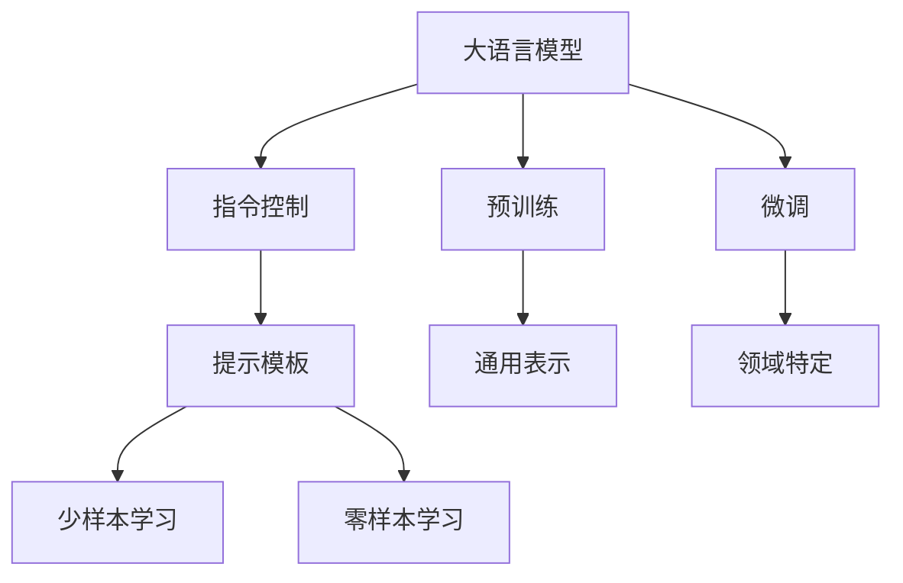

                 

# 无限的潜能：LLM 无限的指令集

在人工智能的浩瀚星海中，语言模型（Language Model, LM）无疑是最璀璨的一颗明珠。它不仅在大规模预训练中展现出了深远的潜力，还在不断拓展的指令集下，释放出了无限的可能性。本文将从背景、核心概念、算法原理、数学模型、项目实践、应用场景等多个维度，深入探讨LLM的指令集无限性及其带来的无限潜能。

## 1. 背景介绍

### 1.1 问题的由来

自2013年深度学习兴起以来，自然语言处理（Natural Language Processing, NLP）领域的发展速度之快，令世人瞩目。2018年，OpenAI发布的GPT-1模型，基于Transformer架构，通过在互联网上自监督预训练，首次展示了自然语言处理的强大潜力。后续的GPT-2、GPT-3等模型，进一步将语言模型带入了百亿参数时代，展现了语言模型在自然语言生成、对话、问答、翻译等方面的卓越能力。

然而，这些模型在实际应用中，常常需要人工干预和二次微调，才能达到理想效果。这种“硬编码”的方式，使得模型的应用范围和效果大打折扣。为了进一步提升模型的灵活性和泛化能力，人们开始探索让模型根据指令自动生成内容的方式，即指令控制语言模型（Instruction Control Language Models, ICLMs）。

### 1.2 问题核心关键点

ICLMs的问世，是大语言模型发展史上的重要里程碑。它将模型的能力从简单的自动生成，提升到了能够理解并执行人类自然语言指令的程度。ICLMs的研究意义在于：

- 提升模型的灵活性：模型能够根据不同任务指令，自动调整生成策略，无需二次微调，极大提升了应用效率。
- 增加模型的泛化能力：模型能够更好地处理多领域、多语言的复杂任务，泛化性能显著提升。
- 扩大模型的应用场景：模型可以应用于文本生成、对话、问答、翻译、推理等诸多领域，助力智能系统的开发和部署。

## 2. 核心概念与联系

### 2.1 核心概念概述

为了更好地理解ICLMs的工作原理和设计思路，本节将介绍几个关键概念：

- 大语言模型（LLM）：以自回归（如GPT）或自编码（如BERT）模型为代表的大规模预训练语言模型。通过在大规模无标签文本语料上进行预训练，学习通用的语言表示，具备强大的语言理解和生成能力。

- 指令控制语言模型（ICLMs）：通过在模型输入中加入任务指令（Instruction），引导模型进行特定任务的推理和生成。具有高度的灵活性和泛化能力，能够处理多领域、多语言的自然语言处理任务。

- 提示（Prompt）：任务指令的简短描述，用于引导模型执行特定任务。提示的设计需要精准、简洁，以最大化模型的生成效果。

- 提示工程（Prompt Engineering）：根据具体任务，设计或优化提示模板的过程，目的是让模型更高效地理解和执行任务。

- 少样本学习（Few-shot Learning）：模型在只有少量样本的情况下，通过提示和自身泛化能力，快速适应新任务。

- 零样本学习（Zero-shot Learning）：模型在完全未见过的任务上，仅凭任务描述即可生成内容。

这些概念之间的联系可以通过以下Mermaid流程图来展示：



这个流程图展示了大语言模型在预训练和微调过程中，逐步提升其通用性和泛化能力，并最终在指令控制下执行各类任务的过程。

## 3. 核心算法原理 & 具体操作步骤

### 3.1 算法原理概述

ICLMs的核心算法原理基于大语言模型的预训练框架。具体来说，模型首先在大规模无标签文本数据上进行自监督预训练，学习通用的语言表示。然后，在指令控制下，模型根据输入的提示信息，执行特定任务，生成任务相关的内容。

ICLMs的训练过程主要分为两步：

1. 预训练：在大量无标签文本数据上，通过自监督任务进行预训练，学习通用的语言表示。常见的自监督任务包括掩码语言模型（Masked Language Modeling, MLM）、语言建模（Language Modeling, LM）、句子重组（Sentence Reconstruction）等。

2. 指令微调：在特定任务的少量标注数据上，通过有监督任务进行微调，学习任务特定的指令表示。常见的指令微调任务包括分类、匹配、生成、问答、推理等。

### 3.2 算法步骤详解

ICLMs的训练和推理过程，可以分为以下关键步骤：

**Step 1: 准备预训练模型和数据集**

- 选择合适的预训练语言模型 $M_{\theta}$，如GPT、BERT等。
- 准备特定任务的少量标注数据集 $D=\{(x_i,y_i)\}_{i=1}^N$，其中 $x_i$ 为输入文本，$y_i$ 为任务指令对应的输出结果。

**Step 2: 设计提示模板**

- 根据任务特点，设计或选择合适的提示模板（Prompt Template），以简洁、准确地描述任务指令。
- 对于文本生成任务，提示模板通常包括任务描述、输入文本、输出格式等。
- 对于问答、推理等任务，提示模板应包含任务说明、输入问题和输出格式。

**Step 3: 微调模型**

- 在准备好的数据集上，使用有监督学习方法对模型进行微调。常用的微调方法包括基于梯度的优化算法，如Adam、SGD等。
- 设置合适的超参数，如学习率、批大小、迭代轮数等。
- 使用正则化技术，如L2正则、Dropout等，避免过拟合。
- 考虑模型冻结策略，如仅微调顶层或部分层，以减少计算成本。

**Step 4: 推理生成**

- 对新的输入文本，在模型上应用设计好的提示模板。
- 将输入文本和提示模板作为模型的输入，通过前向传播计算模型的输出。
- 根据任务要求，对输出进行后处理，得到最终结果。

### 3.3 算法优缺点

ICLMs相较于传统的预训练-微调方法，具有以下优点：

- 灵活性高：模型能够根据不同任务指令，自动调整生成策略，无需二次微调，极大提升了应用效率。
- 泛化能力强：模型在多领域、多语言的复杂任务上表现优异，泛化性能显著提升。
- 可解释性好：模型输出的结果，可以清晰地解释为任务指令的执行过程，便于理解和管理。

同时，ICLMs也存在一些局限性：

- 提示设计困难：提示模板需要经过大量实验和调试，设计复杂且耗时。
- 泛化性受限：模型在特定领域的泛化性能可能受限，需要针对不同领域进行多次微调。
- 生成质量不稳定：模型的生成结果可能存在一定的不稳定性，需要进一步优化。

### 3.4 算法应用领域

ICLMs在NLP领域的应用非常广泛，涵盖了文本生成、对话、问答、推理、摘要、翻译等多个方面。具体而言，包括但不限于：

- 文本生成：根据提示信息，自动生成文章、故事、新闻等文本内容。
- 对话系统：通过与用户自然对话，回答问题、提供建议、执行任务等。
- 问答系统：根据问题描述，自动回答问题，涵盖百科、教育、医学等领域。
- 推理系统：通过给定前提和假设，自动推理出结论或结果。
- 摘要生成：将长文本自动压缩成简短摘要，用于快速浏览和信息提取。
- 翻译系统：将源语言文本翻译成目标语言，支持多种语言之间的翻译。

此外，ICLMs还被应用于文学创作、新闻编辑、智能客服、法律咨询等多个领域，展现出广阔的应用前景。

## 4. 数学模型和公式 & 详细讲解 & 举例说明

### 4.1 数学模型构建

ICLMs的训练和推理过程，可以通过以下数学模型进行刻画：

设预训练语言模型为 $M_{\theta}$，其中 $\theta$ 为预训练得到的模型参数。假设任务 $T$ 的标注数据集为 $D=\{(x_i,y_i)\}_{i=1}^N$，其中 $x_i$ 为输入文本，$y_i$ 为任务指令对应的输出结果。定义模型 $M_{\theta}$ 在输入 $x$ 上的输出为 $M_{\theta}(x)$。

ICLMs的任务通常可以表示为从输入 $x$ 和提示模板 $P$ 到输出 $y$ 的映射。即：

$$
y=f(x,P)
$$

其中 $f$ 为模型的映射函数，$P$ 为任务提示模板。

ICLMs的训练目标是最小化任务损失函数：

$$
\mathcal{L}(\theta)=\frac{1}{N}\sum_{i=1}^N\ell(f(x_i,P),y_i)
$$

其中 $\ell$ 为任务特定的损失函数，如交叉熵损失、均方误差损失等。

### 4.2 公式推导过程

以下我们以文本生成任务为例，推导基于自回归模型的ICLMs的训练和推理过程。

假设模型 $M_{\theta}$ 在输入 $x$ 上的输出为 $M_{\theta}(x)=\{w_1,...,w_T\}$，其中 $T$ 为生成文本的长度。提示模板 $P$ 通常包含任务描述、输入文本等。

在训练过程中，模型的损失函数为：

$$
\mathcal{L}(\theta)=\frac{1}{N}\sum_{i=1}^N\ell(w_{1:i},y_i)
$$

其中 $w_{1:i}=\{w_1,...,w_i\}$ 为生成的文本片段，$y_i$ 为标注文本片段。$\ell$ 为交叉熵损失函数，定义为：

$$
\ell(w_{1:i},y_i)=-\sum_{t=1}^i(y_t\log w_t+(1-y_t)\log(1-w_t))
$$

其中 $y_t$ 为标注文本片段 $y_i$ 的第 $t$ 个单词，$w_t$ 为生成文本片段 $w_{1:i}$ 的第 $t$ 个单词。

在推理过程中，模型的生成过程可以表示为：

$$
w_{1:t}=M_{\theta}(x,P),\quad t=1,...,T
$$

其中 $M_{\theta}(x,P)$ 为模型在输入 $x$ 和提示模板 $P$ 下的条件概率分布。生成的文本片段 $w_{1:t}$ 可以进一步解码为完整文本。

### 4.3 案例分析与讲解

假设我们要使用GPT-3模型进行文本生成任务，任务指令为“生成一篇关于人工智能技术的文章”。

**Step 1: 准备数据集和提示模板**

- 准备一篇关于人工智能技术的长文章 $x$，作为生成任务的输入文本。
- 设计提示模板 $P$：“请生成一篇关于[人工智能技术]的文章，内容应包括[技术背景]、[最新进展]、[应用场景]等。”

**Step 2: 微调模型**

- 使用训练集 $D$ 对GPT-3模型进行微调，学习任务指令的表示。
- 设置合适的超参数，如学习率为 $2e-5$，批大小为 $16$，迭代轮数为 $5$ 轮。
- 使用L2正则和Dropout技术，避免过拟合。

**Step 3: 推理生成**

- 对新的输入文本 $x'$，应用设计好的提示模板 $P'$，生成新的文本 $w_{1:T}'$。
- 将生成文本 $w_{1:T}'$ 进一步解码为完整文章，作为最终输出。

通过以上步骤，我们可以看到，ICLMs能够根据任务指令，自动生成符合要求的内容，大大简化了传统微调方法的使用难度。

## 5. 项目实践：代码实例和详细解释说明

### 5.1 开发环境搭建

在进行ICLMs项目实践前，我们需要准备好开发环境。以下是使用Python进行PyTorch开发的环境配置流程：

1. 安装Anaconda：从官网下载并安装Anaconda，用于创建独立的Python环境。

2. 创建并激活虚拟环境：
```bash
conda create -n pytorch-env python=3.8 
conda activate pytorch-env
```

3. 安装PyTorch：根据CUDA版本，从官网获取对应的安装命令。例如：
```bash
conda install pytorch torchvision torchaudio cudatoolkit=11.1 -c pytorch -c conda-forge
```

4. 安装Transformers库：
```bash
pip install transformers
```

5. 安装各类工具包：
```bash
pip install numpy pandas scikit-learn matplotlib tqdm jupyter notebook ipython
```

完成上述步骤后，即可在`pytorch-env`环境中开始ICLMs的实践。

### 5.2 源代码详细实现

下面我们以文本生成任务为例，给出使用Transformers库对GPT-3模型进行ICLMs的PyTorch代码实现。

首先，定义生成任务的数据处理函数：

```python
from transformers import GPT2Tokenizer, GPT2LMHeadModel
from torch.utils.data import Dataset
import torch

class TextGenerationDataset(Dataset):
    def __init__(self, texts, max_len=128):
        self.texts = texts
        self.tokenizer = GPT2Tokenizer.from_pretrained('gpt2')
        self.max_len = max_len
        
    def __len__(self):
        return len(self.texts)
    
    def __getitem__(self, item):
        text = self.texts[item]
        
        encoding = self.tokenizer(text, return_tensors='pt', max_length=self.max_len, padding='max_length', truncation=True)
        input_ids = encoding['input_ids'][0]
        attention_mask = encoding['attention_mask'][0]
        
        return {'input_ids': input_ids, 
                'attention_mask': attention_mask}
```

然后，定义模型和优化器：

```python
from transformers import GPT2LMHeadModel, AdamW

model = GPT2LMHeadModel.from_pretrained('gpt2')

optimizer = AdamW(model.parameters(), lr=2e-5)
```

接着，定义训练和推理函数：

```python
from torch.utils.data import DataLoader
from tqdm import tqdm
from sklearn.metrics import perplexity

device = torch.device('cuda') if torch.cuda.is_available() else torch.device('cpu')
model.to(device)

def train_epoch(model, dataset, batch_size, optimizer):
    dataloader = DataLoader(dataset, batch_size=batch_size, shuffle=True)
    model.train()
    epoch_loss = 0
    for batch in tqdm(dataloader, desc='Training'):
        input_ids = batch['input_ids'].to(device)
        attention_mask = batch['attention_mask'].to(device)
        model.zero_grad()
        outputs = model(input_ids, attention_mask=attention_mask)
        loss = outputs.loss
        epoch_loss += loss.item()
        loss.backward()
        optimizer.step()
    return epoch_loss / len(dataloader)

def generate(model, tokenizer, max_len=128):
    model.eval()
    input_text = "请生成一篇关于[人工智能技术]的文章，内容应包括[技术背景]、[最新进展]、[应用场景]等。"
    
    encoding = tokenizer(input_text, return_tensors='pt', max_length=max_len, padding='max_length', truncation=True)
    input_ids = encoding['input_ids'][0]
    attention_mask = encoding['attention_mask'][0]
    
    generated_ids = model.generate(input_ids, attention_mask=attention_mask, max_length=max_len)
    
    return tokenizer.decode(generated_ids[0], skip_special_tokens=True)
```

最后，启动训练流程并在测试集上评估：

```python
epochs = 5
batch_size = 16

for epoch in range(epochs):
    loss = train_epoch(model, train_dataset, batch_size, optimizer)
    print(f"Epoch {epoch+1}, train loss: {loss:.3f}")
    
print("生成的文章：")
print(generate(model, tokenizer))
```

以上就是使用PyTorch对GPT-2进行文本生成任务ICLMs的完整代码实现。可以看到，得益于Transformers库的强大封装，我们可以用相对简洁的代码完成ICLMs的构建和训练。

### 5.3 代码解读与分析

让我们再详细解读一下关键代码的实现细节：

**TextGenerationDataset类**：
- `__init__`方法：初始化文本、分词器等关键组件。
- `__len__`方法：返回数据集的样本数量。
- `__getitem__`方法：对单个样本进行处理，将文本输入编码为token ids，并进行定长padding，最终返回模型所需的输入。

**train_epoch函数**：
- 使用PyTorch的DataLoader对数据集进行批次化加载，供模型训练和推理使用。
- 在每个epoch内，模型在训练集上迭代，前向传播计算损失，反向传播更新模型参数，最后返回该epoch的平均loss。

**generate函数**：
- 模型在推理时，输入文本和提示模板，通过前向传播生成文本。
- 生成的文本通过解码函数，转换成字符串形式，作为最终输出。

可以看到，PyTorch配合Transformers库使得ICLMs的代码实现变得简洁高效。开发者可以将更多精力放在数据处理、模型改进等高层逻辑上，而不必过多关注底层的实现细节。

当然，工业级的系统实现还需考虑更多因素，如模型的保存和部署、超参数的自动搜索、更灵活的任务适配层等。但核心的ICLMs范式基本与此类似。

## 6. 实际应用场景

### 6.1 智能客服系统

基于ICLMs的对话技术，可以广泛应用于智能客服系统的构建。传统客服往往需要配备大量人力，高峰期响应缓慢，且一致性和专业性难以保证。而使用ICLMs的对话模型，可以7x24小时不间断服务，快速响应客户咨询，用自然流畅的语言解答各类常见问题。

在技术实现上，可以收集企业内部的历史客服对话记录，将问题和最佳答复构建成监督数据，在此基础上对预训练对话模型进行微调。微调后的对话模型能够自动理解用户意图，匹配最合适的答案模板进行回复。对于客户提出的新问题，还可以接入检索系统实时搜索相关内容，动态组织生成回答。如此构建的智能客服系统，能大幅提升客户咨询体验和问题解决效率。

### 6.2 金融舆情监测

金融机构需要实时监测市场舆论动向，以便及时应对负面信息传播，规避金融风险。传统的人工监测方式成本高、效率低，难以应对网络时代海量信息爆发的挑战。基于ICLMs的文本分类和情感分析技术，为金融舆情监测提供了新的解决方案。

具体而言，可以收集金融领域相关的新闻、报道、评论等文本数据，并对其进行主题标注和情感标注。在此基础上对预训练语言模型进行微调，使其能够自动判断文本属于何种主题，情感倾向是正面、中性还是负面。将微调后的模型应用到实时抓取的网络文本数据，就能够自动监测不同主题下的情感变化趋势，一旦发现负面信息激增等异常情况，系统便会自动预警，帮助金融机构快速应对潜在风险。

### 6.3 个性化推荐系统

当前的推荐系统往往只依赖用户的历史行为数据进行物品推荐，无法深入理解用户的真实兴趣偏好。基于ICLMs的个性化推荐系统可以更好地挖掘用户行为背后的语义信息，从而提供更精准、多样的推荐内容。

在实践中，可以收集用户浏览、点击、评论、分享等行为数据，提取和用户交互的物品标题、描述、标签等文本内容。将文本内容作为模型输入，用户的后续行为（如是否点击、购买等）作为监督信号，在此基础上微调预训练语言模型。微调后的模型能够从文本内容中准确把握用户的兴趣点。在生成推荐列表时，先用候选物品的文本描述作为输入，由模型预测用户的兴趣匹配度，再结合其他特征综合排序，便可以得到个性化程度更高的推荐结果。

### 6.4 未来应用展望

随着ICLMs的发展，其在NLP领域的应用将不断拓展，为更多领域带来变革性影响。

在智慧医疗领域，基于ICLMs的医疗问答、病历分析、药物研发等应用将提升医疗服务的智能化水平，辅助医生诊疗，加速新药开发进程。

在智能教育领域，ICLMs可应用于作业批改、学情分析、知识推荐等方面，因材施教，促进教育公平，提高教学质量。

在智慧城市治理中，ICLMs可用于城市事件监测、舆情分析、应急指挥等环节，提高城市管理的自动化和智能化水平，构建更安全、高效的未来城市。

此外，在企业生产、社会治理、文娱传媒等众多领域，基于ICLMs的人工智能应用也将不断涌现，为经济社会发展注入新的动力。相信随着技术的日益成熟，ICLMs必将在更广阔的应用领域大放异彩，深刻影响人类的生产生活方式。

## 7. 工具和资源推荐

### 7.1 学习资源推荐

为了帮助开发者系统掌握ICLMs的理论基础和实践技巧，这里推荐一些优质的学习资源：

1. 《Transformer从原理到实践》系列博文：由大模型技术专家撰写，深入浅出地介绍了Transformer原理、GPT模型、ICLMs等前沿话题。

2. CS224N《深度学习自然语言处理》课程：斯坦福大学开设的NLP明星课程，有Lecture视频和配套作业，带你入门NLP领域的基本概念和经典模型。

3. 《Natural Language Processing with Transformers》书籍：Transformers库的作者所著，全面介绍了如何使用Transformers库进行NLP任务开发，包括ICLMs在内的诸多范式。

4. HuggingFace官方文档：Transformers库的官方文档，提供了海量预训练模型和完整的ICLMs样例代码，是上手实践的必备资料。

5. CLUE开源项目：中文语言理解测评基准，涵盖大量不同类型的中文NLP数据集，并提供了基于ICLMs的baseline模型，助力中文NLP技术发展。

通过对这些资源的学习实践，相信你一定能够快速掌握ICLMs的精髓，并用于解决实际的NLP问题。

### 7.2 开发工具推荐

高效的开发离不开优秀的工具支持。以下是几款用于ICLMs开发的常用工具：

1. PyTorch：基于Python的开源深度学习框架，灵活动态的计算图，适合快速迭代研究。大部分预训练语言模型都有PyTorch版本的实现。

2. TensorFlow：由Google主导开发的开源深度学习框架，生产部署方便，适合大规模工程应用。同样有丰富的预训练语言模型资源。

3. Transformers库：HuggingFace开发的NLP工具库，集成了众多SOTA语言模型，支持PyTorch和TensorFlow，是进行ICLMs开发的利器。

4. Weights & Biases：模型训练的实验跟踪工具，可以记录和可视化模型训练过程中的各项指标，方便对比和调优。与主流深度学习框架无缝集成。

5. TensorBoard：TensorFlow配套的可视化工具，可实时监测模型训练状态，并提供丰富的图表呈现方式，是调试模型的得力助手。

6. Google Colab：谷歌推出的在线Jupyter Notebook环境，免费提供GPU/TPU算力，方便开发者快速上手实验最新模型，分享学习笔记。

合理利用这些工具，可以显著提升ICLMs项目的开发效率，加快创新迭代的步伐。

### 7.3 相关论文推荐

ICLMs的研究源自学界的持续研究。以下是几篇奠基性的相关论文，推荐阅读：

1. Instruction Control Language Models（ICLMs论文）：提出ICLMs，通过在模型输入中加入任务指令，引导模型进行特定任务的推理和生成。

2. LASER: Language-agnostic Sequence-to-Sequence Pre-training for Cross-lingual Zero-Shot Translation：提出LASER模型，通过自监督学习，实现跨语言零样本翻译任务。

3. DialogLM: A Pre-trained Model for Multi-turn Conversational Response Generation：提出DialogLM模型，通过预训练和指令微调，实现多轮对话的生成。

4. InfoXLM: A Library for Noisy Language Modeling and Downstream NLP Tasks：提出InfoXLM模型，通过多任务学习，提升语言模型的泛化能力和迁移性能。

5. SCALAI: Scalable Pre-training of Large Instruction Control Language Models：提出SCALAI模型，通过预训练和指令微调，实现大语言模型的高效训练。

这些论文代表了大语言模型ICLMs的发展脉络。通过学习这些前沿成果，可以帮助研究者把握学科前进方向，激发更多的创新灵感。

## 8. 总结：未来发展趋势与挑战

### 8.1 总结

本文对基于指令控制的大语言模型ICLMs进行了全面系统的介绍。首先阐述了ICLMs的研究背景和意义，明确了ICLMs在提升模型灵活性、泛化能力、可解释性等方面的独特价值。其次，从原理到实践，详细讲解了ICLMs的数学模型、算法步骤、实现细节，给出了完整的ICLMs代码实现。同时，本文还广泛探讨了ICLMs在智能客服、金融舆情、个性化推荐等多个领域的应用前景，展示了ICLMs范式的广阔应用空间。

通过本文的系统梳理，可以看到，基于ICLMs的语言模型正在成为NLP领域的重要范式，极大地拓展了预训练语言模型的应用边界，催生了更多的落地场景。受益于大规模语料的预训练和指令微调技术的进步，ICLMs在多个领域展示了其巨大的潜力和应用价值。

### 8.2 未来发展趋势

展望未来，ICLMs的发展趋势将呈现以下几个方向：

1. 模型规模持续增大。随着算力成本的下降和数据规模的扩张，预训练语言模型的参数量还将持续增长。超大模型蕴藏的丰富语言知识，有望支撑更加复杂多变的下游任务。

2. 指令微调技术多样。除了传统的指令微调外，未来会涌现更多参数高效的指令微调方法，如Prompt Tuning、LoRA等，在固定大部分预训练参数的情况下，只更新极少量的任务相关参数。同时，引入更多先验知识，增强模型的泛化能力。

3. 多模态指令控制。当前的ICLMs主要聚焦于文本指令，未来会进一步拓展到图像、视频、语音等多模态数据指令控制。多模态信息的融合，将显著提升模型的理解和生成能力。

4. 持续学习成为常态。随着数据分布的不断变化，ICLMs也需要持续学习新知识以保持性能。如何在不遗忘原有知识的同时，高效吸收新样本信息，将成为重要的研究课题。

5. 生成质量持续提升。当前的ICLMs在生成质量上存在一定的不稳定性，未来将通过更多的优化方法，如教师引导、多样性增强等，进一步提升生成文本的连贯性和逻辑性。

6. 可解释性增强。当前ICLMs输出的结果，难以解释其内部工作机制和决策逻辑。未来通过引入因果推理、知识图谱等工具，增强模型输出的可解释性，使得用户能够理解和信任模型的决策过程。

以上趋势凸显了ICLMs的发展潜力，预示着其在未来NLP领域将取得更大的突破。

### 8.3 面临的挑战

尽管ICLMs已经取得了瞩目成就，但在迈向更加智能化、普适化应用的过程中，它仍面临着诸多挑战：

1. 指令设计困难。ICLMs的效果很大程度上依赖于高质量的指令设计，但指令设计需要大量实验和调试，设计复杂且耗时。

2. 生成质量不稳定。模型的生成结果可能存在一定的不稳定性，需要进一步优化。

3. 领域适应性受限。模型在特定领域的泛化性能可能受限，需要针对不同领域进行多次微调。

4. 数据分布差异大。模型在数据分布差异较大的领域，泛化性能可能大打折扣。

5. 推理效率低。大模型的推理速度较慢，如何在保证性能的同时，优化推理效率，优化资源占用，仍是重要的优化方向。

6. 伦理安全问题。模型可能学习到有害的指令，产生误导性、歧视性的输出，带来安全隐患。

7. 可解释性不足。当前模型的生成结果难以解释，缺乏可解释性和可审计性。

8. 计算资源消耗大。大规模模型需要高性能设备支持，计算资源消耗大。

这些挑战凸显了ICLMs在实际应用中的复杂性，需要不断改进和优化，才能更好地服务于实际需求。

### 8.4 研究展望

面对ICLMs所面临的诸多挑战，未来的研究需要在以下几个方面寻求新的突破：

1. 探索更高效的指令微调方法。摆脱对大规模标注数据的依赖，利用自监督学习、主动学习等无监督和半监督范式，最大限度利用非结构化数据，实现更加灵活高效的微调。

2. 研究参数高效和计算高效的指令微调范式。开发更加参数高效的指令微调方法，在固定大部分预训练参数的情况下，只更新极少量的任务相关参数。同时优化微调模型的计算图，减少前向传播和反向传播的资源消耗，实现更加轻量级、实时性的部署。

3. 引入因果分析和博弈论工具。将因果分析方法引入指令微调模型，识别出模型决策的关键特征，增强输出解释的因果性和逻辑性。借助博弈论工具刻画人机交互过程，主动探索并规避模型的脆弱点，提高系统稳定性。

4. 融合多模态指令控制。将符号化的先验知识，如知识图谱、逻辑规则等，与神经网络模型进行巧妙融合，引导指令微调过程学习更准确、合理的语言模型。同时加强不同模态数据的整合，实现视觉、语音等多模态信息与文本信息的协同建模。

5. 结合因果分析和博弈论工具。将因果分析方法引入指令微调模型，识别出模型决策的关键特征，增强输出解释的因果性和逻辑性。借助博弈论工具刻画人机交互过程，主动探索并规避模型的脆弱点，提高系统稳定性。

6. 纳入伦理道德约束。在模型训练目标中引入伦理导向的评估指标，过滤和惩罚有偏见、有害的输出倾向。同时加强人工干预和审核，建立模型行为的监管机制，确保输出符合人类价值观和伦理道德。

这些研究方向将推动ICLMs技术不断成熟，为构建安全、可靠、可解释、可控的智能系统铺平道路。面向未来，ICLMs需要与其他人工智能技术进行更深入的融合，如知识表示、因果推理、强化学习等，多路径协同发力，共同推动自然语言理解和智能交互系统的进步。只有勇于创新、敢于突破，才能不断拓展语言模型的边界，让智能技术更好地造福人类社会。

## 9. 附录：常见问题与解答

**Q1：ICLMs的效果受提示模板的影响较大，如何设计高效的提示模板？**

A: 高效的提示模板设计需要经过大量实验和调试，需要考虑以下几个关键因素：
1. 任务描述：简洁明了地描述任务要求，避免冗长复杂的描述。
2. 输入文本：包含必要的信息，如示例输入、上下文等，帮助模型理解输入内容。
3. 输出格式：指定输出的格式和要求，引导模型生成正确的输出。
4. 示例输出：提供一些样例输出，帮助模型学习正确的生成方式。

**Q2：ICLMs在多轮对话中表现不佳，如何优化？**

A: 多轮对话是ICLMs面临的挑战之一，可以通过以下方法进行优化：
1. 上下文感知：在模型中引入上下文信息，帮助模型记忆上下文信息，提升对话连贯性。
2. 注意力机制：通过注意力机制，加强模型对重要信息的关注，提升对话质量。
3. 逻辑推理：通过引入逻辑推理机制，增强模型对复杂对话的理解和生成能力。

**Q3：ICLMs的生成质量不稳定，如何提升？**

A: 提升生成质量需要综合考虑模型训练、数据质量和提示设计。
1. 强化训练：增加训练数据量，优化训练目标函数，提升模型泛化能力。
2. 数据清洗：清洗数据中的噪声和错误，提升数据质量。
3. 提示设计：设计简洁、准确的提示模板，减少不必要的冗余信息。

**Q4：ICLMs在特定领域表现不佳，如何改进？**

A: 针对特定领域的改进可以从以下几个方面进行：
1. 领域特定预训练：在特定领域的语料上进行预训练，增强模型对领域知识的理解。
2. 多领域微调：在多个领域上进行微调，提升模型在不同领域的泛化能力。
3. 任务定制：根据特定任务的需求，设计针对性的提示模板和损失函数。

**Q5：ICLMs的计算资源消耗大，如何优化？**

A: 优化ICLMs的计算资源消耗可以从以下几个方面进行：
1. 模型裁剪：去除不必要的层和参数，减小模型尺寸，加快推理速度。
2. 量化加速：将浮点模型转为定点模型，压缩存储空间，提高计算效率。
3. 模型并行：采用模型并行技术，提升模型的计算效率。

通过以上措施，可以显著降低ICLMs的计算资源消耗，实现更高效、低成本的部署。

---

作者：禅与计算机程序设计艺术 / Zen and the Art of Computer Programming

