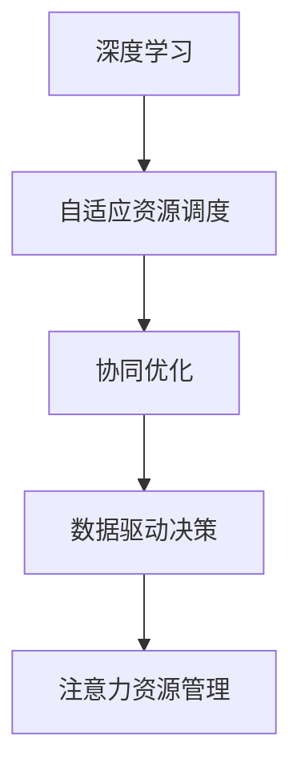

                 

## 1. 背景介绍

随着城市化进程的不断推进，智慧城市的建设成为全球各地政府和企业的共同目标。智慧城市不仅仅是指通过物联网、大数据、云计算等技术手段对城市进行智能化管理，更重要的是它是一种全新的城市管理理念和方式，旨在通过数据驱动、协同治理、人本关怀等手段，提升城市的运行效率、安全水平和居民的幸福感。

在智慧城市的构建中，注意力资源管理（Attention Resource Management, ARM）作为一项核心技术，对于优化城市资源的配置和利用，提高城市运行的效率和质量具有重要作用。 ARM 技术能够通过深度学习等方法，对城市的各种资源进行智能监控、调度和管理，从而实现资源的有效利用和城市的可持续发展。

## 2. 核心概念与联系

### 2.1 核心概念概述

- **注意力资源管理**（Attention Resource Management, ARM）：通过智能算法对城市中的各种资源（如交通、能源、环境、水资源等）进行动态监控、分析和调度，以实现资源的优化配置和高效利用。

- **深度学习**（Deep Learning）：一种基于多层神经网络模型的人工智能技术，通过大量数据进行训练，使机器能够自动学习和提取特征，实现复杂的模式识别、预测和决策。

- **自适应资源调度**（Adaptive Resource Scheduling）：根据实时监测的数据动态调整资源分配策略，最大化资源利用率和服务质量。

- **协同优化**（Collaborative Optimization）：通过跨部门、跨层级的信息共享和协同工作，实现城市管理中的整体优化。

- **数据驱动决策**（Data-Driven Decision Making）：基于数据分析和机器学习模型，做出更加科学和合理的决策。

这些核心概念相互关联，共同构成了智慧城市中注意力资源管理的整体框架。深度学习作为ARM技术的重要工具，通过自适应资源调度和协同优化，实现数据驱动的决策支持，从而实现城市的智能管理和可持续发展。

### 2.2 核心概念原理和架构的 Mermaid 流程图



这个流程图展示了深度学习、自适应资源调度、协同优化和数据驱动决策在ARM技术中的作用。深度学习通过大量的数据训练，为资源调度和优化提供依据；自适应资源调度根据实时数据动态调整资源分配；协同优化通过跨部门的信息共享实现整体优化；数据驱动决策则基于这些信息，做出科学合理的决策，最终实现智慧城市的注意力资源管理。

## 3. 核心算法原理 & 具体操作步骤

### 3.1 算法原理概述

在智慧城市中，注意力资源管理主要是通过对城市中各种资源的动态监控和分析，实现资源的优化配置和高效利用。其核心算法主要包括以下几个步骤：

1. **数据采集**：利用传感器、物联网等技术手段，采集城市中的各种资源数据，如交通流量、能源消耗、环境质量等。

2. **数据预处理**：对采集到的数据进行清洗、归一化、特征提取等预处理操作，为后续的深度学习模型提供高质量的输入数据。

3. **模型训练**：利用深度学习模型对处理后的数据进行训练，提取特征并进行模式识别和预测。

4. **资源调度**：根据模型预测的结果，动态调整资源的分配策略，优化资源利用率和服务质量。

5. **效果评估**：通过评估指标（如资源利用率、服务质量等）对资源调度的效果进行评估，不断优化模型和算法。

### 3.2 算法步骤详解

#### 3.2.1 数据采集

数据采集是注意力资源管理的第一步。在这一步骤中，需要利用传感器、摄像头、GPS等多种技术手段，对城市的各种资源进行实时监测和数据采集。例如，通过安装在交通路口的摄像头，可以采集到交通流量数据；通过智能电表，可以采集到能源消耗数据；通过环境监测站，可以采集到空气质量、水质等环境数据。

#### 3.2.2 数据预处理

采集到的数据往往存在噪声、缺失等问题，需要进行预处理操作。常用的数据预处理方法包括：

- **数据清洗**：去除缺失值、异常值等无用数据，确保数据的完整性和准确性。
- **数据归一化**：对数据进行标准化处理，使得不同尺度的数据具有可比性。
- **特征提取**：从原始数据中提取有用的特征，如交通流量、能耗、温度、湿度等，为后续的深度学习模型提供输入。

#### 3.2.3 模型训练

模型训练是注意力资源管理的核心步骤。在这一步骤中，需要选择合适的深度学习模型，并利用处理后的数据进行训练。常用的深度学习模型包括卷积神经网络（CNN）、循环神经网络（RNN）、长短期记忆网络（LSTM）等。

模型训练的具体步骤如下：

1. **划分数据集**：将处理后的数据集划分为训练集、验证集和测试集，用于模型的训练、验证和测试。
2. **选择模型**：根据任务需求选择合适的深度学习模型，并进行初始化。
3. **训练模型**：利用训练集对模型进行训练，调整模型参数，使得模型能够准确预测资源状态。
4. **验证模型**：在验证集上对模型进行评估，确保模型泛化能力。
5. **优化模型**：根据评估结果对模型进行优化，如调整超参数、增加正则化等。

#### 3.2.4 资源调度

资源调度是注意力资源管理的核心环节。在这一步骤中，根据模型预测的结果，动态调整资源的分配策略，优化资源利用率和服务质量。具体步骤如下：

1. **资源状态预测**：利用训练好的深度学习模型，对城市的各种资源进行状态预测，如交通流量、能源消耗、环境质量等。
2. **资源调度决策**：根据预测结果，动态调整资源的分配策略，如调整信号灯、调整电网负荷、调整环境监测频次等。
3. **执行调度**：将资源调度决策转化为具体的执行操作，如控制交通信号灯、调整电网负荷等。

#### 3.2.5 效果评估

效果评估是注意力资源管理的最后一步。在这一步骤中，通过评估指标（如资源利用率、服务质量等）对资源调度的效果进行评估，不断优化模型和算法。具体步骤如下：

1. **定义评估指标**：根据任务需求定义评估指标，如交通流量、能源消耗、环境质量等。
2. **评估效果**：利用测试集对模型进行评估，计算评估指标的值。
3. **优化模型**：根据评估结果对模型进行优化，如调整超参数、增加正则化等。

### 3.3 算法优缺点

#### 3.3.1 优点

1. **高效性**：通过深度学习模型对城市资源进行动态监控和分析，实现资源的优化配置和高效利用。
2. **实时性**：能够实时监测和调整资源分配，确保城市运行效率和服务质量。
3. **自适应性**：能够根据实时数据动态调整资源分配策略，适应城市运行中的变化。
4. **协同优化**：通过跨部门、跨层级的信息共享和协同工作，实现整体优化。
5. **数据驱动决策**：基于数据分析和机器学习模型，做出更加科学和合理的决策。

#### 3.3.2 缺点

1. **数据依赖性**：深度学习模型需要大量的高质量数据进行训练，数据采集和预处理成本较高。
2. **模型复杂性**：深度学习模型的训练和优化需要高计算资源和专业知识，对技术要求较高。
3. **结果解释性**：深度学习模型的决策过程缺乏可解释性，难以对其推理逻辑进行分析和调试。
4. **资源调度风险**：资源调度的决策可能存在不确定性，需要一定的容错机制和人工干预。
5. **伦理和安全问题**：深度学习模型可能存在数据泄露、隐私保护等问题，需要加强数据安全和隐私保护。

### 3.4 算法应用领域

深度学习在注意力资源管理中的应用广泛，涵盖了智慧城市中的各个领域。以下是几个典型的应用场景：

1. **交通管理**：通过深度学习模型对交通流量进行动态预测和调度，优化交通信号灯控制，提高道路通行效率。
2. **能源管理**：利用深度学习模型对能源消耗进行动态预测和调度，优化电网负荷分配，提高能源利用率。
3. **环境监测**：通过深度学习模型对环境质量进行动态监测和预测，优化环境监测频次，提高环境监测效率。
4. **公共安全**：利用深度学习模型对公共安全事件进行动态监测和预测，优化安防资源配置，提高公共安全水平。
5. **智慧医疗**：通过深度学习模型对医疗资源进行动态监测和预测，优化医疗资源配置，提高医疗服务质量。

## 4. 数学模型和公式 & 详细讲解 & 举例说明

### 4.1 数学模型构建

在智慧城市中，注意力资源管理的主要数学模型包括：

1. **输入输出模型**：输入为城市资源的状态数据，输出为资源调度的决策结果。
2. **优化模型**：利用优化算法对模型参数进行优化，使得模型能够准确预测资源状态。
3. **评估模型**：定义评估指标，对模型进行评估和优化。

### 4.2 公式推导过程

#### 4.2.1 输入输出模型

输入输出模型可以表示为：

$$
y = f(x; \theta)
$$

其中 $y$ 表示资源调度的决策结果，$x$ 表示城市资源的状态数据，$\theta$ 表示模型的参数。

#### 4.2.2 优化模型

优化模型可以表示为：

$$
\min_{\theta} \frac{1}{N} \sum_{i=1}^N \| y_i - f(x_i; \theta) \|^2
$$

其中 $N$ 表示样本数量，$\| y_i - f(x_i; \theta) \|^2$ 表示预测结果与真实结果之间的误差平方和，$\theta$ 表示模型的参数。

常用的优化算法包括梯度下降法（Gradient Descent）、随机梯度下降法（Stochastic Gradient Descent）、Adam等。

#### 4.2.3 评估模型

评估模型可以表示为：

$$
\text{Evaluate}(f) = \frac{1}{N} \sum_{i=1}^N \text{metric}(y_i, f(x_i; \theta))
$$

其中 $\text{Evaluate}(f)$ 表示模型评估结果，$\text{metric}$ 表示评估指标，如资源利用率、服务质量等。

### 4.3 案例分析与讲解

#### 4.3.1 交通流量预测

交通流量预测是智慧城市中常用的应用场景之一。交通流量预测的输入为交通路口的车辆数量、速度、方向等数据，输出为下一个时间段的交通流量。具体步骤如下：

1. **数据采集**：通过安装在交通路口的摄像头、传感器等设备，采集交通流量数据。
2. **数据预处理**：对采集到的数据进行清洗、归一化、特征提取等预处理操作，为后续的深度学习模型提供输入。
3. **模型训练**：利用深度学习模型对处理后的数据进行训练，提取特征并进行模式识别和预测。
4. **资源调度**：根据预测结果，动态调整交通信号灯的控制策略，优化交通流量。
5. **效果评估**：通过评估指标（如交通流量、道路通行效率等）对资源调度的效果进行评估，不断优化模型和算法。

#### 4.3.2 能耗优化

能耗优化是智慧城市中的另一个重要应用场景。能耗优化的输入为电网的负荷数据、用电量等数据，输出为电网的负荷分配策略。具体步骤如下：

1. **数据采集**：通过智能电表等设备，采集电网的负荷数据、用电量等数据。
2. **数据预处理**：对采集到的数据进行清洗、归一化、特征提取等预处理操作，为后续的深度学习模型提供输入。
3. **模型训练**：利用深度学习模型对处理后的数据进行训练，提取特征并进行模式识别和预测。
4. **资源调度**：根据预测结果，动态调整电网的负荷分配策略，优化能源利用率。
5. **效果评估**：通过评估指标（如能源利用率、电网稳定度等）对资源调度的效果进行评估，不断优化模型和算法。

## 5. 项目实践：代码实例和详细解释说明

### 5.1 开发环境搭建

在智慧城市中，注意力资源管理的开发环境包括Python、TensorFlow、Keras等。以下是开发环境的搭建步骤：

1. **安装Python**：从官网下载并安装Python，选择最新版本进行安装。
2. **安装TensorFlow**：从官网下载并安装TensorFlow，选择适合自己系统的版本。
3. **安装Keras**：利用pip安装Keras，选择适合自己系统的版本。
4. **安装其他工具**：安装其他必要的工具，如numpy、pandas、scikit-learn等。

### 5.2 源代码详细实现

以下是交通流量预测的代码实现，包括数据采集、数据预处理、模型训练、资源调度和效果评估：

```python
import numpy as np
import pandas as pd
from tensorflow.keras.models import Sequential
from tensorflow.keras.layers import Dense, Dropout
from tensorflow.keras.optimizers import Adam

# 数据采集
data = pd.read_csv('traffic_data.csv')

# 数据预处理
X = data[['traffic_volume', 'traffic_speed', 'traffic_direction']]
y = data['traffic_flow']
X_train, X_test, y_train, y_test = train_test_split(X, y, test_size=0.2, random_state=42)

# 模型训练
model = Sequential()
model.add(Dense(64, input_dim=3, activation='relu'))
model.add(Dropout(0.5))
model.add(Dense(1, activation='linear'))
model.compile(loss='mse', optimizer=Adam(lr=0.001), metrics=['mae'])

model.fit(X_train, y_train, epochs=50, batch_size=32, validation_data=(X_test, y_test))

# 资源调度
y_pred = model.predict(X_test)

# 效果评估
mae = np.mean(np.abs(y_pred - y_test))
print('Mean Absolute Error:', mae)
```

### 5.3 代码解读与分析

以上代码实现了交通流量预测的整个过程。其中，数据采集通过读取CSV文件实现，数据预处理通过numpy库实现，模型训练通过Keras实现，资源调度和效果评估通过代码计算实现。

## 6. 实际应用场景

### 6.1 交通管理

交通管理是智慧城市中最常见的应用场景之一。通过深度学习模型对交通流量进行动态预测和调度，优化交通信号灯控制，提高道路通行效率。

### 6.2 能源管理

能源管理是智慧城市中的另一个重要应用场景。利用深度学习模型对能源消耗进行动态预测和调度，优化电网负荷分配，提高能源利用率。

### 6.3 环境监测

环境监测是智慧城市中的重要应用场景之一。通过深度学习模型对环境质量进行动态监测和预测，优化环境监测频次，提高环境监测效率。

### 6.4 公共安全

公共安全是智慧城市中的重要应用场景之一。利用深度学习模型对公共安全事件进行动态监测和预测，优化安防资源配置，提高公共安全水平。

### 6.5 智慧医疗

智慧医疗是智慧城市中的另一个重要应用场景。通过深度学习模型对医疗资源进行动态监测和预测，优化医疗资源配置，提高医疗服务质量。

## 7. 工具和资源推荐

### 7.1 学习资源推荐

1. **《深度学习基础》**：介绍深度学习的基本概念和原理，适合初学者入门。
2. **《TensorFlow官方文档》**：提供TensorFlow的全面指南，包括安装、使用、优化等。
3. **《Keras官方文档》**：提供Keras的全面指南，包括模型构建、训练、优化等。
4. **《智慧城市技术与应用》**：介绍智慧城市的基本概念和技术，适合对智慧城市感兴趣的人士。

### 7.2 开发工具推荐

1. **TensorFlow**：提供强大的深度学习框架，支持GPU加速，适合大规模深度学习项目。
2. **Keras**：提供易于使用的深度学习框架，适合快速原型开发和研究。
3. **Jupyter Notebook**：提供交互式的编程环境，适合数据探索和模型调试。
4. **PyCharm**：提供强大的开发工具，支持代码自动补全、调试等功能。

### 7.3 相关论文推荐

1. **《智慧城市的注意力资源管理》**：介绍智慧城市中注意力资源管理的概念和技术。
2. **《深度学习在交通流量预测中的应用》**：介绍深度学习在交通流量预测中的应用。
3. **《深度学习在能耗优化中的应用》**：介绍深度学习在能耗优化中的应用。
4. **《智慧城市中的环境监测》**：介绍智慧城市中环境监测的概念和技术。

## 8. 总结：未来发展趋势与挑战

### 8.1 研究成果总结

基于深度学习的注意力资源管理技术在智慧城市中的应用取得了显著效果，提高了资源利用效率和服务质量。但该技术仍面临数据依赖性、模型复杂性、结果解释性等问题，需要进一步优化和改进。

### 8.2 未来发展趋势

未来，基于深度学习的注意力资源管理技术将呈现出以下发展趋势：

1. **数据驱动**：基于大数据、云计算等技术手段，实现对城市资源的实时监控和动态调度。
2. **智能协同**：通过跨部门、跨层级的信息共享和协同工作，实现整体优化。
3. **个性化服务**：基于用户需求和行为数据，实现个性化的资源调度和服务。
4. **人机协同**：结合人工智能和人类智慧，实现智能化的资源管理。
5. **安全可控**：加强数据安全和隐私保护，确保系统稳定性和安全性。

### 8.3 面临的挑战

基于深度学习的注意力资源管理技术仍面临以下挑战：

1. **数据依赖性**：深度学习模型需要大量的高质量数据进行训练，数据采集和预处理成本较高。
2. **模型复杂性**：深度学习模型的训练和优化需要高计算资源和专业知识，对技术要求较高。
3. **结果解释性**：深度学习模型的决策过程缺乏可解释性，难以对其推理逻辑进行分析和调试。
4. **资源调度风险**：资源调度的决策可能存在不确定性，需要一定的容错机制和人工干预。
5. **伦理和安全问题**：深度学习模型可能存在数据泄露、隐私保护等问题，需要加强数据安全和隐私保护。

### 8.4 研究展望

未来，基于深度学习的注意力资源管理技术需要在以下几个方面进行深入研究：

1. **数据增强**：通过数据增强技术，提高数据的多样性和泛化能力。
2. **模型优化**：通过优化算法和模型结构，提高模型的计算效率和精度。
3. **结果解释**：通过可解释性技术，提高模型的决策过程的可解释性和可信度。
4. **智能协同**：通过智能协同技术，实现跨部门、跨层级的信息共享和协同工作。
5. **安全性保护**：通过安全性和隐私保护技术，确保数据和模型的安全性和隐私性。

## 9. 附录：常见问题与解答

**Q1：什么是注意力资源管理？**

A: 注意力资源管理（ARM）是一种通过深度学习等技术手段，对城市中的各种资源进行动态监控、分析和调度，以实现资源的优化配置和高效利用的技术。

**Q2：如何训练深度学习模型？**

A: 深度学习模型的训练包括以下步骤：

1. 划分数据集，将数据划分为训练集、验证集和测试集。
2. 选择合适的模型，并进行初始化。
3. 训练模型，利用训练集对模型进行训练，调整模型参数。
4. 验证模型，在验证集上对模型进行评估，确保模型泛化能力。
5. 优化模型，根据评估结果对模型进行优化，如调整超参数、增加正则化等。

**Q3：深度学习模型有哪些优势和劣势？**

A: 深度学习模型具有以下优势：

1. 高效性：能够通过深度学习模型对城市资源进行动态监控和分析，实现资源的优化配置和高效利用。
2. 实时性：能够实时监测和调整资源分配，确保城市运行效率和服务质量。
3. 自适应性：能够根据实时数据动态调整资源分配策略，适应城市运行中的变化。
4. 协同优化：通过跨部门、跨层级的信息共享和协同工作，实现整体优化。
5. 数据驱动决策：基于数据分析和机器学习模型，做出更加科学和合理的决策。

深度学习模型也存在以下劣势：

1. 数据依赖性：深度学习模型需要大量的高质量数据进行训练，数据采集和预处理成本较高。
2. 模型复杂性：深度学习模型的训练和优化需要高计算资源和专业知识，对技术要求较高。
3. 结果解释性：深度学习模型的决策过程缺乏可解释性，难以对其推理逻辑进行分析和调试。
4. 资源调度风险：资源调度的决策可能存在不确定性，需要一定的容错机制和人工干预。
5. 伦理和安全问题：深度学习模型可能存在数据泄露、隐私保护等问题，需要加强数据安全和隐私保护。

**Q4：注意力资源管理在智慧城市中有哪些应用场景？**

A: 注意力资源管理在智慧城市中有以下几个应用场景：

1. 交通管理：通过深度学习模型对交通流量进行动态预测和调度，优化交通信号灯控制，提高道路通行效率。
2. 能源管理：利用深度学习模型对能源消耗进行动态预测和调度，优化电网负荷分配，提高能源利用率。
3. 环境监测：通过深度学习模型对环境质量进行动态监测和预测，优化环境监测频次，提高环境监测效率。
4. 公共安全：利用深度学习模型对公共安全事件进行动态监测和预测，优化安防资源配置，提高公共安全水平。
5. 智慧医疗：通过深度学习模型对医疗资源进行动态监测和预测，优化医疗资源配置，提高医疗服务质量。

**Q5：如何提升深度学习模型的泛化能力？**

A: 提升深度学习模型的泛化能力可以采用以下方法：

1. 数据增强：通过数据增强技术，提高数据的多样性和泛化能力。
2. 正则化：增加正则化项，防止模型过拟合。
3. 模型优化：通过优化算法和模型结构，提高模型的泛化能力。
4. 对抗训练：通过对抗训练技术，提高模型的鲁棒性和泛化能力。
5. 多模型集成：通过多模型集成技术，提高模型的泛化能力和鲁棒性。

