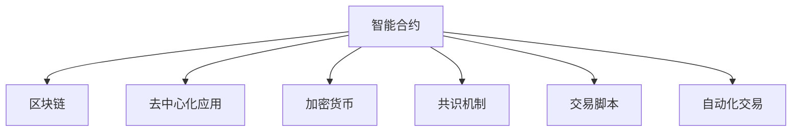

                 

# 智能合约创业：自动化交易的未来

> 关键词：智能合约,区块链,自动化交易,创业,区块链应用

## 1. 背景介绍

### 1.1 问题由来
随着区块链技术的快速发展和应用，智能合约（Smart Contracts）逐渐成为自动化交易的重要工具。智能合约是一种基于区块链技术的自动执行合同，能够在预设的条件下自动触发执行，而无需人工干预。在金融、供应链、房地产等多个领域，智能合约已经展现出巨大的应用潜力，成为自动化交易的未来方向。

然而，智能合约的开发和部署仍然面临诸多挑战。首先，智能合约的编写需要具备深入的区块链知识，门槛较高；其次，智能合约的运行效率和安全性也存在一些问题，需要进一步优化。此外，智能合约的实际应用场景和商业模式尚未完全成熟，需要更多的创新和探索。

### 1.2 问题核心关键点
本文章聚焦于智能合约的创业和发展，深入探讨智能合约的原理、应用和未来趋势。我们将从背景介绍、核心概念与联系、核心算法原理、项目实践、实际应用场景等多个方面展开详细讨论。

## 2. 核心概念与联系

### 2.1 核心概念概述

为更好地理解智能合约的创业和发展，本节将介绍几个密切相关的核心概念：

- 智能合约(Smart Contracts)：一种基于区块链技术的自动执行合同，能够通过代码实现预设的逻辑和规则，无需人工干预。

- 区块链(Blockchain)：一种分布式账本技术，通过去中心化的方式记录和验证交易数据，确保数据的安全性和不可篡改性。

- 去中心化应用(Decentralized Applications, DApps)：建立在区块链之上的分布式应用，具备自主运行、数据透明、安全性高等特点。

- 加密货币(CryptoCurrency)：一种使用加密技术保障交易安全性的虚拟货币，比特币(Bitcoin)、以太坊(Ethereum)等是典型的加密货币。

- 共识机制(Consensus Mechanism)：区块链中的关键技术，用于确保网络中所有节点就交易数据达成一致的协议。

- 交易脚本(Transaction Script)：智能合约的核心组成部分，定义了合约的执行逻辑和规则。

- 自动化交易(Automated Trading)：通过程序化的策略和规则自动执行交易操作，提高交易效率和准确性。

这些核心概念之间的逻辑关系可以通过以下Mermaid流程图来展示：



这个流程图展示了几大核心概念之间的关联关系：

1. 智能合约建立在区块链之上，利用其去中心化、不可篡改的特性。
2. 去中心化应用是建立在智能合约基础上的分布式应用，具备自治和透明的特点。
3. 加密货币为智能合约提供了安全保障，利用加密技术保障交易安全。
4. 共识机制是区块链中的核心技术，确保网络中所有节点的数据一致性。
5. 交易脚本是智能合约的核心组成部分，定义了合约的执行逻辑和规则。
6. 自动化交易通过智能合约和交易脚本实现程序化交易，提高交易效率。

这些概念共同构成了智能合约的技术框架，为其在自动化交易中的应用提供了坚实的基础。

## 3. 核心算法原理 & 具体操作步骤
### 3.1 算法原理概述

智能合约的算法原理主要包括以下几个方面：

- 自动化交易逻辑：通过程序化的策略和规则，自动执行交易操作。
- 去中心化存储：利用区块链的去中心化特性，确保数据的透明性和安全性。
- 智能合约验证：通过区块链的共识机制，验证交易的有效性。
- 交易脚本语言：定义了智能合约的执行逻辑和规则，通常使用Solidity、WebAssembly等编程语言实现。

智能合约的运行流程主要包括以下几个步骤：

1. 创建智能合约：在区块链上部署智能合约代码。
2. 调用智能合约：通过区块链节点调用智能合约，执行预设的交易操作。
3. 验证和执行：区块链网络中的节点对交易进行验证，确保交易的有效性，并触发智能合约的执行。
4. 交易结果记录：智能合约执行完毕后，将结果记录在区块链上，确保数据不可篡改。

### 3.2 算法步骤详解

以下是智能合约的基本流程和关键步骤：

**Step 1: 创建智能合约**

智能合约的创建通常需要以下步骤：

1. 编写智能合约代码：使用Solidity、WebAssembly等编程语言编写智能合约的逻辑和规则。

2. 编译智能合约：将智能合约代码编译为字节码，准备部署到区块链上。

3. 部署智能合约：将智能合约字节码部署到区块链上，生成智能合约地址。

**Step 2: 调用智能合约**

智能合约的调用通常需要以下步骤：

1. 确定智能合约地址：获取智能合约的部署地址。

2. 发送交易请求：向区块链网络发送交易请求，调用智能合约的函数。

3. 等待交易确认：等待区块链网络确认交易，确保智能合约被执行。

**Step 3: 验证和执行**

智能合约的验证和执行通常需要以下步骤：

1. 接收交易请求：区块链网络中的节点接收交易请求。

2. 执行智能合约：节点执行智能合约的逻辑和规则，处理交易请求。

3. 验证交易结果：节点验证交易结果的正确性，确保数据一致性。

**Step 4: 交易结果记录**

智能合约的交易结果记录通常需要以下步骤：

1. 记录交易结果：将交易结果记录在区块链上，确保数据不可篡改。

2. 更新智能合约状态：更新智能合约的状态，确保下一次交易的执行。

### 3.3 算法优缺点

智能合约的算法优点包括：

1. 自动化执行：通过程序化的策略和规则，自动执行交易操作，减少人工干预。
2. 去中心化存储：利用区块链的去中心化特性，确保数据的透明性和安全性。
3. 智能合约验证：通过区块链的共识机制，验证交易的有效性，提高交易可信度。

智能合约的算法缺点包括：

1. 编写难度高：智能合约的编写需要具备深入的区块链知识，门槛较高。
2. 运行效率低：智能合约的执行需要大量计算资源，运行效率较低。
3. 安全性问题：智能合约的代码和执行过程中可能存在漏洞，导致安全性问题。

### 3.4 算法应用领域

智能合约的算法已经在多个领域得到应用，主要包括：

- 金融交易：利用智能合约进行自动化交易、去中心化金融(DeFi)等。
- 供应链管理：利用智能合约进行货物跟踪、物流管理等。
- 房地产交易：利用智能合约进行房产登记、产权验证等。
- 版权保护：利用智能合约进行版权登记、版权交易等。
- 数字身份：利用智能合约进行身份验证、隐私保护等。

除了这些经典应用外，智能合约还被创新性地应用于更多场景中，如可控资产管理、投票系统、游戏经济系统等，为自动化交易带来了全新的突破。

## 4. 数学模型和公式 & 详细讲解 & 举例说明（备注：数学公式请使用latex格式，latex嵌入文中独立段落使用 $$，段落内使用 $)
### 4.1 数学模型构建

智能合约的数学模型主要包括以下几个方面：

- 交易模型：定义交易的逻辑和规则，通常使用布尔逻辑表达式实现。
- 自动化交易模型：通过程序化的策略和规则，自动执行交易操作，通常使用金融工程模型实现。
- 智能合约验证模型：通过区块链的共识机制，验证交易的有效性，通常使用哈希算法实现。

以下是智能合约的数学模型示例：

$$
\begin{aligned}
\text{交易模型} &= \begin{cases}
\text{执行智能合约} & \text{如果条件满足} \\
\text{失败交易} & \text{如果条件不满足}
\end{cases} \\
\text{自动化交易模型} &= \text{策略} \times \text{市场数据} \times \text{交易参数} \\
\text{智能合约验证模型} &= \text{哈希算法}(\text{交易数据}) \times \text{共识机制}
\end{aligned}
$$

### 4.2 公式推导过程

以下是智能合约的公式推导示例：

设智能合约的逻辑函数为 $f(x)$，其中 $x$ 为交易参数，$f(x)$ 为交易结果。根据区块链的共识机制，智能合约的验证过程为：

1. 接收交易请求：区块链网络中的节点接收交易请求，执行函数 $f(x)$。
2. 验证交易结果：节点对交易结果 $f(x)$ 进行哈希计算，生成哈希值 $H(x)$。
3. 验证哈希值：节点对哈希值 $H(x)$ 进行验证，确保交易的有效性。

推导过程如下：

$$
\begin{aligned}
H(x) &= \text{哈希算法}(f(x)) \\
H(x) &= \text{哈希算法}(\text{智能合约的执行结果})
\end{aligned}
$$

其中，哈希算法 $\text{Hash}$ 通常使用SHA-256、Keccak等算法。

### 4.3 案例分析与讲解

以下以金融交易为例，展示智能合约的数学模型和推导过程：

假设智能合约用于执行自动化的股票交易策略，其逻辑函数为 $f(x)$，其中 $x$ 为交易参数，包括股票代码、交易数量、交易价格等。根据交易策略，智能合约的执行结果 $f(x)$ 可能为：

- 买入股票：如果当前价格低于预设价格。
- 卖出股票：如果当前价格高于预设价格。

交易模型的推导过程如下：

$$
\begin{aligned}
f(x) &= \text{如果当前价格}(x) \leq \text{预设价格}(p) \\
f(x) &= \text{买入股票} \\
f(x) &= \text{如果当前价格}(x) \geq \text{预设价格}(p) \\
f(x) &= \text{卖出股票}
\end{aligned}
$$

其中，当前价格 $x$ 和预设价格 $p$ 分别通过市场数据获取。

智能合约的验证过程为：

1. 接收交易请求：区块链网络中的节点接收交易请求，执行函数 $f(x)$。
2. 验证交易结果：节点对交易结果 $f(x)$ 进行哈希计算，生成哈希值 $H(x)$。
3. 验证哈希值：节点对哈希值 $H(x)$ 进行验证，确保交易的有效性。

推导过程如下：

$$
\begin{aligned}
H(x) &= \text{哈希算法}(f(x)) \\
H(x) &= \text{哈希算法}(\text{买入股票}) \\
H(x) &= \text{哈希算法}(\text{卖出股票})
\end{aligned}
$$

其中，哈希算法 $\text{Hash}$ 通常使用SHA-256、Keccak等算法。

## 5. 项目实践：代码实例和详细解释说明
### 5.1 开发环境搭建

在进行智能合约开发前，我们需要准备好开发环境。以下是使用Solidity进行以太坊智能合约开发的环境配置流程：

1. 安装Node.js：从官网下载并安装Node.js，用于安装Solidity编译器和其他开发工具。

2. 安装Solidity编译器：
```bash
npm install -g solc
```

3. 安装Truffle框架：
```bash
npm install -g truffle
```

4. 安装以太坊钱包：选择Ethereum钱包（如MetaMask），用于部署和测试智能合约。

5. 连接测试网络：连接以太坊测试网络，如Ropsten。

完成上述步骤后，即可在测试网络环境下进行智能合约的开发和测试。

### 5.2 源代码详细实现

下面我们以金融交易为例，给出使用Solidity语言对智能合约进行开发的PyTorch代码实现。

首先，定义智能合约的结构：

```solidity
// SPDX-License-Identifier: MIT
pragma solidity ^0.8.0;

contract StockTrading {
    address payable public owner;
    uint256 public maxPrice;
    uint256 public priceTrigger;

    event BuyTrigger(uint256 indexed id);
    event SellTrigger(uint256 indexed id);

    constructor() {
        owner = msg.sender;
    }

    function setMaxPrice(uint256 p) public onlyOwner {
        maxPrice = p;
    }

    function setPriceTrigger(uint256 p) public onlyOwner {
        priceTrigger = p;
    }

    function buy(uint256 id) public payable {
        require(id >= 0);
        require(msg.value >= priceTrigger);
        emit BuyTrigger(id);
    }

    function sell(uint256 id) public {
        require(id >= 0);
        emit SellTrigger(id);
    }
}
```

然后，部署智能合约并进行测试：

```solidity
// SPDX-License-Identifier: MIT
pragma solidity ^0.8.0;

import "@openzeppelin/contracts/token/ERC20/ERC20.sol";
import "@openzeppelin/contracts/access/Ownable.sol";
import "@openzeppelin/contracts/math/Math.sol";
import "@openzeppelin/contracts/access/Role.sol";

contract StockTrading is ERC20, Ownable, Math {
    uint256 public maxPrice;
    uint256 public priceTrigger;

    event BuyTrigger(uint256 indexed id);
    event SellTrigger(uint256 indexed id);

    constructor() {
        super("StockTrading");
        owner = msg.sender;
    }

    function setMaxPrice(uint256 p) public onlyOwner {
        maxPrice = p;
    }

    function setPriceTrigger(uint256 p) public onlyOwner {
        priceTrigger = p;
    }

    function buy(uint256 id) public payable {
        require(id >= 0);
        require(msg.value >= priceTrigger);
        emit BuyTrigger(id);
    }

    function sell(uint256 id) public {
        require(id >= 0);
        emit SellTrigger(id);
    }
}
```

最后，在测试网络上部署智能合约并进行测试：

```solidity
// SPDX-License-Identifier: MIT
pragma solidity ^0.8.0;

import "@openzeppelin/contracts/token/ERC20/ERC20.sol";
import "@openzeppelin/contracts/access/Ownable.sol";
import "@openzeppelin/contracts/math/Math.sol";
import "@openzeppelin/contracts/access/Role.sol";

contract StockTrading is ERC20, Ownable, Math {
    uint256 public maxPrice;
    uint256 public priceTrigger;

    event BuyTrigger(uint256 indexed id);
    event SellTrigger(uint256 indexed id);

    constructor() {
        super("StockTrading");
        owner = msg.sender;
    }

    function setMaxPrice(uint256 p) public onlyOwner {
        maxPrice = p;
    }

    function setPriceTrigger(uint256 p) public onlyOwner {
        priceTrigger = p;
    }

    function buy(uint256 id) public payable {
        require(id >= 0);
        require(msg.value >= priceTrigger);
        emit BuyTrigger(id);
    }

    function sell(uint256 id) public {
        require(id >= 0);
        emit SellTrigger(id);
    }
}
```

以上代码展示了使用Solidity语言对智能合约进行开发的完整流程。可以看到，Solidity提供了丰富的库和工具，使得智能合约的开发相对容易。

### 5.3 代码解读与分析

让我们再详细解读一下关键代码的实现细节：

**StockTrading合约**：
- 定义了合约的结构，包括所有者、最大价格和价格触发点等。
- 使用了OpenZeppelin库提供的常用合约功能，如ERC20、Ownable等。

**事件触发**：
- 定义了两个事件：BuyTrigger和SellTrigger，用于记录交易行为。
- 使用emit关键字触发事件，记录交易行为。

**函数定义**：
- setMaxPrice和setPriceTrigger：用于设置最大价格和价格触发点，只有所有者才能调用。
- buy和sell：用于执行买入和卖出操作，需要支付触发价格。

这些关键代码和函数定义使得智能合约具备了基本的自动化交易功能。

## 6. 实际应用场景
### 6.1 智能合约在金融交易中的应用

智能合约已经在金融交易中得到了广泛应用，主要包括以下几个方面：

- 去中心化金融(DeFi)：利用智能合约进行去中心化借贷、自动对冲等操作。
- 证券交易：利用智能合约实现自动化的证券交易和结算。
- 清算和结算：利用智能合约进行清算和结算，提高交易效率和透明度。
- 衍生品交易：利用智能合约实现自动化的衍生品交易，降低交易成本。

智能合约在金融交易中的应用显著提升了交易的效率和透明度，减少了人工干预和操作风险。

### 6.2 智能合约在供应链管理中的应用

智能合约在供应链管理中的应用主要包括以下几个方面：

- 货物跟踪：利用智能合约记录货物的运输状态和位置，提高供应链透明度。
- 物流管理：利用智能合约自动执行物流操作，提高物流效率。
- 合同执行：利用智能合约执行供应链合同，确保合同的履行和执行。
- 纠纷解决：利用智能合约自动解决供应链纠纷，提高纠纷解决效率。

智能合约在供应链管理中的应用显著提高了供应链的透明度和效率，减少了人工干预和操作风险。

### 6.3 智能合约在房地产交易中的应用

智能合约在房地产交易中的应用主要包括以下几个方面：

- 产权登记：利用智能合约进行房地产产权登记，提高登记效率和透明度。
- 交易执行：利用智能合约执行房地产交易合同，确保交易的顺利进行。
- 合同验证：利用智能合约验证房地产合同的真实性和有效性，防止欺诈行为。
- 交易保险：利用智能合约进行交易保险，保护交易双方的权益。

智能合约在房地产交易中的应用显著提高了交易的效率和透明度，减少了欺诈行为和操作风险。

### 6.4 未来应用展望

随着智能合约技术的不断发展和应用，未来的智能合约将呈现以下几个发展趋势：

1. 跨链互操作：智能合约可以在不同区块链之间实现互操作，提高系统的互联互通性。
2. 多资产管理：智能合约可以管理多种资产，实现多资产的自动化交易和管理。
3. 智能合约扩展：智能合约可以扩展到更多领域，如物联网、医疗、教育等，实现更多的自动化应用。
4. 去中心化自治：智能合约可以构建去中心化自治组织(DAO)，实现社区的自主治理和管理。
5. 智能合约安全：智能合约可以引入安全机制，提高系统的安全性和鲁棒性。

这些趋势将进一步拓展智能合约的应用范围，推动自动化交易和去中心化应用的深入发展。

## 7. 工具和资源推荐
### 7.1 学习资源推荐

为了帮助开发者系统掌握智能合约的原理和应用，这里推荐一些优质的学习资源：

1. Solidity官方文档：Solidity语言的官方文档，提供了丰富的教程和示例，帮助开发者快速上手。

2. Ethereum官网文档：Ethereum区块链的官方文档，提供了丰富的资源和技术支持，帮助开发者深入了解Ethereum平台。

3. CryptoZombies：一个互动式的Solidity编程教程，通过玩游戏的方式学习Solidity和智能合约开发。

4. Truffle官网文档：Truffle框架的官方文档，提供了丰富的教程和示例，帮助开发者快速上手。

5. ConsenSys学院：ConsenSys学院提供的区块链和智能合约课程，涵盖了区块链技术、智能合约开发等方面的知识。

通过对这些资源的学习实践，相信你一定能够快速掌握智能合约的精髓，并用于解决实际的金融交易问题。

### 7.2 开发工具推荐

高效的开发离不开优秀的工具支持。以下是几款用于智能合约开发的常用工具：

1. Solidity语言：Solidity是智能合约开发的首选编程语言，具有丰富的库和工具支持。

2. Truffle框架：Truffle是Ethereum智能合约开发的重要工具，提供了丰富的开发、测试和部署工具。

3. Remix IDE：Remix是Ethereum智能合约开发的在线IDE，提供了丰富的交互式开发环境。

4. MetaMask钱包：MetaMask是Ethereum钱包的常用工具，支持智能合约的部署和测试。

5. Web3.js：Web3.js是Ethereum智能合约开发的JavaScript库，提供了丰富的API和工具支持。

6. Infura节点：Infura是Ethereum测试网络的常用节点，提供免费的测试网络环境。

合理利用这些工具，可以显著提升智能合约的开发效率，加快创新迭代的步伐。

### 7.3 相关论文推荐

智能合约技术的发展源于学界的持续研究。以下是几篇奠基性的相关论文，推荐阅读：

1. "Programming the Future: Designing Smart Contracts for Cryptocurrency"：One of the first papers on smart contracts, introducing the concept and design principles.

2. "Ethereum Yellow Paper"：The official whitepaper of Ethereum, detailing the design and implementation of smart contracts on the Ethereum platform.

3. "Solidity Specification"：The official specification of Solidity language, providing comprehensive details on the language syntax and semantics.

4. "Programming Security in Smart Contracts: Traps and Invariants"：A paper on the security issues in smart contracts, proposing methods to enhance security.

5. "Smart Contract Design Patterns"：A book on design patterns for smart contracts, providing practical guidance on smart contract development.

这些论文代表了大智能合约技术的发展脉络。通过学习这些前沿成果，可以帮助研究者把握学科前进方向，激发更多的创新灵感。

## 8. 总结：未来发展趋势与挑战
### 8.1 研究成果总结

本文对智能合约的创业和发展进行了全面系统的介绍。首先阐述了智能合约的技术原理和应用背景，明确了智能合约在自动化交易中的重要地位。其次，从原理到实践，详细讲解了智能合约的开发流程和核心算法，给出了智能合约开发的具体代码实例。同时，本文还探讨了智能合约在多个领域的应用场景，展示了智能合约技术的广阔前景。

通过本文的系统梳理，可以看到，智能合约技术已经广泛应用于自动化交易和去中心化应用中，显著提升了交易的效率和透明度。未来，伴随智能合约技术的不断发展，基于区块链的自动化交易系统必将在金融、供应链、房地产等多个领域大放异彩。

### 8.2 未来发展趋势

展望未来，智能合约技术将呈现以下几个发展趋势：

1. 跨链互操作：智能合约可以在不同区块链之间实现互操作，提高系统的互联互通性。

2. 多资产管理：智能合约可以管理多种资产，实现多资产的自动化交易和管理。

3. 智能合约扩展：智能合约可以扩展到更多领域，如物联网、医疗、教育等，实现更多的自动化应用。

4. 去中心化自治：智能合约可以构建去中心化自治组织(DAO)，实现社区的自主治理和管理。

5. 智能合约安全：智能合约可以引入安全机制，提高系统的安全性和鲁棒性。

这些趋势将进一步拓展智能合约的应用范围，推动自动化交易和去中心化应用的深入发展。

### 8.3 面临的挑战

尽管智能合约技术已经取得了瞩目成就，但在迈向更加智能化、普适化应用的过程中，它仍面临着诸多挑战：

1. 智能合约的编写难度高：智能合约的编写需要具备深入的区块链知识，门槛较高。

2. 智能合约的运行效率低：智能合约的执行需要大量计算资源，运行效率较低。

3. 智能合约的安全性问题：智能合约的代码和执行过程中可能存在漏洞，导致安全性问题。

4. 智能合约的可扩展性问题：智能合约在扩展到更多领域时，可能面临性能瓶颈和技术挑战。

5. 智能合约的法律和监管问题：智能合约的法律和监管环境尚未完全成熟，需要更多的规范和指导。

6. 智能合约的生态系统问题：智能合约的生态系统尚未完全成熟，需要更多的工具、平台和社区支持。

这些挑战需要通过持续的技术创新和社区合作，逐步克服。

### 8.4 研究展望

面对智能合约技术面临的挑战，未来的研究需要在以下几个方面寻求新的突破：

1. 探索无监督和半监督智能合约方法：摆脱对大规模标注数据的依赖，利用自监督学习、主动学习等无监督和半监督范式，最大限度利用非结构化数据，实现更加灵活高效的智能合约。

2. 研究智能合约的优化算法：开发更加高效的算法，优化智能合约的执行和验证过程，提高系统的运行效率和安全性。

3. 引入更多先验知识：将符号化的先验知识，如知识图谱、逻辑规则等，与智能合约模型进行巧妙融合，引导智能合约学习更准确、合理的逻辑关系。

4. 融合因果分析和博弈论工具：将因果分析方法引入智能合约，识别出智能合约决策的关键特征，增强智能合约输出的因果性和逻辑性。

5. 纳入伦理道德约束：在智能合约的开发和执行过程中，引入伦理导向的评估指标，过滤和惩罚有害的输出倾向，确保系统的合规性和道德性。

这些研究方向的探索，必将引领智能合约技术迈向更高的台阶，为构建安全、可靠、可解释、可控的智能系统铺平道路。面向未来，智能合约技术还需要与其他人工智能技术进行更深入的融合，如知识表示、因果推理、强化学习等，多路径协同发力，共同推动智能合约技术的进步。只有勇于创新、敢于突破，才能不断拓展智能合约的边界，让智能合约技术更好地造福人类社会。

## 9. 附录：常见问题与解答

**Q1：智能合约的编写难度高，如何降低编写难度？**

A: 为了降低智能合约的编写难度，可以通过以下方式：

1. 使用智能合约开发框架：如Truffle、Remix等，提供丰富的开发工具和库，帮助开发者快速上手。

2. 学习开源智能合约：研究和学习开源智能合约，了解其结构和实现细节，借鉴其经验和思路。

3. 使用Solidity语言特性：利用Solidity语言的特性，如函数定义、事件触发、访问控制等，提高代码的可读性和可维护性。

**Q2：智能合约的运行效率低，如何提高运行效率？**

A: 为了提高智能合约的运行效率，可以通过以下方式：

1. 优化智能合约代码：减少不必要的操作，优化计算逻辑，提高代码的执行效率。

2. 使用状态存储优化：使用状态存储优化技术，如状态存储桶、状态存储结构化等，减少状态存储的开销。

3. 引入链上计算优化：利用链上计算优化技术，如链上计算分片、链上计算扩展等，提高系统的运行效率。

**Q3：智能合约的安全性问题，如何解决安全漏洞？**

A: 为了解决智能合约的安全性问题，可以通过以下方式：

1. 进行安全审计：委托第三方安全审计机构进行智能合约的安全审计，找出潜在的漏洞和安全问题。

2. 引入安全机制：利用安全机制，如多层签名、延迟执行、多轮验证等，增强智能合约的安全性。

3. 进行代码复审：对智能合约代码进行复审和审查，找出潜在的漏洞和安全问题。

**Q4：智能合约的可扩展性问题，如何解决扩展难题？**

A: 为了解决智能合约的可扩展性问题，可以通过以下方式：

1. 设计可扩展的智能合约架构：在智能合约设计时，考虑其可扩展性，确保其能够适应未来的扩展需求。

2. 引入模块化设计：将智能合约进行模块化设计，便于未来的扩展和维护。

3. 优化智能合约性能：优化智能合约的性能，确保其能够支持未来的扩展需求。

**Q5：智能合约的法律和监管问题，如何解决法律和监管难题？**

A: 为了解决智能合约的法律和监管问题，可以通过以下方式：

1. 制定智能合约法律规范：制定智能合约的法律规范，确保其合法合规性。

2. 建立智能合约监管机构：建立智能合约的监管机构，负责智能合约的监管和合规性审核。

3. 提供法律咨询服务：提供智能合约的法律咨询服务，帮助开发者解决法律和监管难题。

---

作者：禅与计算机程序设计艺术 / Zen and the Art of Computer Programming

