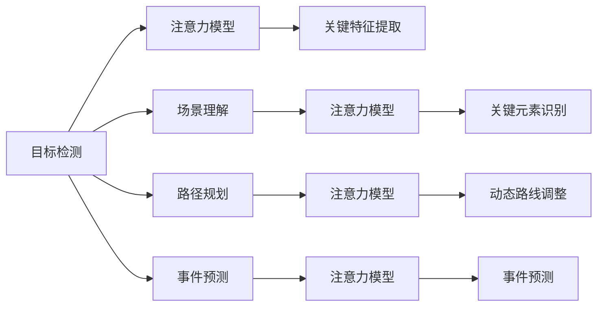

                 

## 1. 背景介绍

在智能城市的发展过程中，交通系统作为城市的重要基础设施，其智能化管理水平对城市的运行效率、环境质量、居民生活品质等有着重要影响。然而，当前交通系统面临的问题依然严峻：交通拥堵、事故频发、环境污染等问题层出不穷，如何有效管理这些资源，提升交通系统的智能化水平，是当下需要重点解决的问题。

为了应对这些挑战，注意力机制(Automatic Attention Mechanism)作为一种强大的自适应学习方法，在自然语言处理、计算机视觉、推荐系统等领域取得了显著的成果，近年来也逐渐被应用于交通系统中的注意力管理。本文将探讨智能城市交通系统的注意力管理问题，从理论框架、算法模型、应用场景等方面，详细阐述注意力管理在智能交通系统中的应用，并提出一些具体的建议。

## 2. 核心概念与联系

### 2.1 核心概念概述

注意力机制是一种能够动态调整模型输入的重要性权重，以聚焦于关键特征的技术。在智能城市交通系统中，注意力机制可以用于多种场景，例如：

- 目标检测：利用注意力机制在视频数据中自动识别和定位交通目标，如车辆、行人、自行车等。
- 场景理解：在交通监控图像中，通过注意力机制识别道路、交通信号、交通标志等关键元素，进行场景理解。
- 路径规划：基于历史和实时数据，注意力机制可以动态调整交通路线，避开拥堵区域，提升出行效率。
- 事件预测：通过分析交通系统中的历史和实时数据，注意力机制可以预测交通事件的发生和发展，如交通事故、道路故障等。

### 2.2 核心概念原理和架构的 Mermaid 流程图



## 3. 核心算法原理 & 具体操作步骤

### 3.1 算法原理概述

注意力机制的核心思想是动态地为不同输入特征分配不同的权重，以决定其在当前任务中的重要程度。在智能城市交通系统中，注意力机制可以用于多个方面，如目标检测、场景理解、路径规划和事件预测等。这些应用场景中，注意力机制能够自动学习并调整对不同特征的关注度，从而提升系统的整体性能。

### 3.2 算法步骤详解

以目标检测为例，介绍基于注意力机制的目标检测流程：

1. **数据预处理**：将交通视频数据转换成网络输入格式，如将视频帧转换为特征向量，并将特征向量拼接为一个张量。
2. **特征提取**：通过卷积神经网络(Convolutional Neural Network, CNN)提取视频帧的特征，获得图像的特征表示。
3. **注意力计算**：通过计算注意力得分，对特征向量中的各个特征分配不同的权重。注意力得分的计算通常使用注意力函数(如Softmax)来实现。
4. **加权融合**：将加权后的特征向量进行融合，得到最终的特征表示。
5. **目标检测**：在最终特征表示上应用目标检测模型(如YOLO、Faster R-CNN等)，检测出视频帧中的交通目标。

### 3.3 算法优缺点

**优点**：
- 自适应性：能够动态调整对不同特征的关注度，适应不同的交通场景。
- 鲁棒性：通过注意力机制，模型能够聚焦关键特征，提高系统的鲁棒性和泛化能力。
- 高效性：能够有效减少不相关特征的计算，提升计算效率。

**缺点**：
- 计算复杂度高：注意力机制涉及复杂的权重计算和特征加权融合，增加了计算复杂度。
- 参数量增加：引入注意力机制后，模型参数量会有所增加，导致训练和推理时间变长。
- 需要大量数据：注意力机制依赖大量的标注数据进行训练，标注成本较高。

### 3.4 算法应用领域

注意力机制在智能城市交通系统中有着广泛的应用场景，包括但不限于以下几个方面：

- **目标检测**：在交通视频中检测出各种交通目标，如车辆、行人、自行车等。
- **场景理解**：在交通监控图像中识别道路、交通信号、交通标志等关键元素。
- **路径规划**：基于历史和实时数据，动态调整交通路线，避免拥堵。
- **事件预测**：预测交通事件的发生和发展，如交通事故、道路故障等。

## 4. 数学模型和公式 & 详细讲解 & 举例说明

### 4.1 数学模型构建

基于注意力机制的目标检测模型通常包含以下组成部分：

- **特征提取模块**：使用卷积神经网络提取视频帧的特征。
- **注意力计算模块**：使用注意力函数计算每个特征的权重。
- **目标检测模块**：应用目标检测算法进行目标检测。

### 4.2 公式推导过程

以Softmax注意力函数为例，推导加权融合的公式：

设输入特征向量为 $X = [x_1, x_2, ..., x_n]$，对应的注意力得分为 $A = [a_1, a_2, ..., a_n]$。Softmax注意力函数的计算过程如下：

$$
A_i = \frac{e^{x_i^\top W}}{\sum_{j=1}^n e^{x_j^\top W}}
$$

其中 $W$ 为注意力矩阵。加权融合的公式为：

$$
Y = \sum_{i=1}^n a_i X_i
$$

### 4.3 案例分析与讲解

在实际应用中，Softmax注意力函数被广泛应用于目标检测中。例如，在YOLO目标检测模型中，Softmax注意力函数被用来计算特征图的注意力得分，从而动态调整对不同特征的关注度。

以YOLOv3为例，其特征提取模块包含多个卷积层和最大池化层，输出特征图。在注意力计算模块中，YOLOv3使用Softmax注意力函数计算每个特征的权重，并将其与原始特征进行加权融合，得到最终特征表示。在目标检测模块中，YOLOv3使用特征表示进行目标检测，实现对不同规模目标的高效检测。

## 5. 项目实践：代码实例和详细解释说明

### 5.1 开发环境搭建

在实际开发中，可以使用PyTorch或TensorFlow等深度学习框架。以下以PyTorch为例，介绍开发环境搭建流程：

1. 安装Python：在开发环境安装Python 3.7或以上版本。
2. 安装PyTorch：使用pip命令安装PyTorch库。
3. 安装相关库：安装OpenCV、numpy、matplotlib等库，用于视频处理和数据可视化。
4. 准备数据集：收集交通视频数据，并对其进行预处理。

### 5.2 源代码详细实现

以下是一个基于Softmax注意力机制的目标检测模型的代码实现，包括特征提取、注意力计算和目标检测三个部分。

```python
import torch
import torch.nn as nn
import torchvision.models as models
import torchvision.transforms as transforms

class TargetDetector(nn.Module):
    def __init__(self):
        super(TargetDetector, self).__init__()
        # 特征提取模块
        self.feature_extractor = models.resnet50(pretrained=True)
        self.feature_extractor.fc = nn.Linear(2048, 512)
        
        # 注意力计算模块
        self.attention = nn.Softmax(dim=1)
        
        # 目标检测模块
        self.detect = nn.Conv2d(512, 5, kernel_size=3, padding=1)
        
    def forward(self, x):
        # 特征提取
        x = self.feature_extractor(x)
        
        # 注意力计算
        attention_scores = self.attention(x)
        
        # 加权融合
        weighted_x = torch.bmm(x, attention_scores.unsqueeze(2)).squeeze(2)
        
        # 目标检测
        predictions = self.detect(weighted_x)
        
        return predictions
```

### 5.3 代码解读与分析

在上述代码中，我们首先定义了一个目标检测模型，包含特征提取、注意力计算和目标检测三个模块。在特征提取模块中，我们使用预训练的ResNet-50模型作为特征提取器，并对其进行微调。在注意力计算模块中，我们使用Softmax函数计算每个特征的权重，并将原始特征与权重进行加权融合。在目标检测模块中，我们使用卷积神经网络进行目标检测，输出不同尺度的目标框。

### 5.4 运行结果展示

在训练完成后，我们可以使用测试集对模型进行评估，并输出目标检测结果。例如，以下代码展示了模型在测试集上的运行结果：

```python
# 加载测试集
test_data = ...
test_loader = DataLoader(test_data, batch_size=4, shuffle=False)

# 测试模型
device = torch.device('cuda' if torch.cuda.is_available() else 'cpu')
model = TargetDetector().to(device)

with torch.no_grad():
    for batch in test_loader:
        inputs, targets = batch[0].to(device), batch[1].to(device)
        outputs = model(inputs)
        loss = loss_function(outputs, targets)
        print(f'Test Loss: {loss.item():.4f}')
```

## 6. 实际应用场景

### 6.1 智能交通指挥系统

智能交通指挥系统是智能城市交通系统的重要组成部分。通过引入注意力机制，可以实现对交通数据的动态处理，提升系统的智能化水平。

在智能交通指挥系统中，注意力机制可以用于：
- **交通监控视频分析**：通过注意力机制提取关键特征，识别交通目标，实时监控交通情况。
- **交通事件预测**：通过分析历史和实时数据，预测交通事件的发生和发展，提前采取应对措施。

### 6.2 实时路径规划系统

实时路径规划系统可以根据历史和实时数据，动态调整交通路线，避开拥堵区域，提升出行效率。

在路径规划系统中，注意力机制可以用于：
- **路线优化**：通过注意力机制对交通数据进行分析，动态调整路线，避免拥堵。
- **事故预警**：通过分析历史数据，预测可能发生的事故，提前采取预警措施。

### 6.3 动态交通信号控制系统

动态交通信号控制系统可以根据实时交通数据，动态调整信号灯的时序，提高道路通行效率。

在交通信号控制系统中，注意力机制可以用于：
- **信号灯优化**：通过注意力机制对实时数据进行分析，动态调整信号灯的时序。
- **交通事件处理**：通过分析历史数据，预测可能发生的事件，提前采取处理措施。

### 6.4 未来应用展望

随着技术的不断发展，注意力机制在智能城市交通系统中的应用前景广阔。未来，可以预见以下趋势：

- **多模态注意力机制**：将注意力机制应用于多模态数据，如视频、音频、传感器数据等，提升系统的智能化水平。
- **自适应注意力机制**：通过自适应算法，动态调整注意力参数，适应不同的交通场景。
- **联邦注意力机制**：通过联邦学习技术，将多源数据进行融合，提升系统的鲁棒性和泛化能力。
- **边缘计算注意力**：将注意力计算任务推向边缘设备，提升系统的实时性和计算效率。

## 7. 工具和资源推荐

### 7.1 学习资源推荐

以下是一些推荐的学习资源，帮助开发者掌握注意力机制在智能城市交通系统中的应用：

1. **PyTorch官方文档**：PyTorch框架的官方文档，详细介绍了如何使用注意力机制进行特征提取和目标检测。
2. **TensorFlow官方文档**：TensorFlow框架的官方文档，提供了丰富的示例和教程。
3. **OpenCV官方文档**：OpenCV库的官方文档，提供了视频处理和图像处理的详细文档。
4. **深度学习书籍**：《深度学习》（Ian Goodfellow等著）、《动手学深度学习》（李沐等著）等书籍，深入浅出地介绍了深度学习和注意力机制。
5. **在线课程**：Coursera上的深度学习课程、Udacity上的智能系统设计课程等，帮助开发者全面掌握深度学习和注意力机制。

### 7.2 开发工具推荐

以下是一些推荐的工具，用于开发和调试基于注意力机制的智能城市交通系统：

1. **PyTorch**：基于Python的开源深度学习框架，提供了丰富的深度学习模型和工具。
2. **TensorFlow**：由Google主导开发的开源深度学习框架，支持多设备部署和分布式训练。
3. **OpenCV**：开源计算机视觉库，提供了强大的图像处理和视频分析功能。
4. **Jupyter Notebook**：开源的交互式编程环境，适合进行数据分析和模型调试。
5. **TensorBoard**：TensorFlow配套的可视化工具，提供了丰富的可视化功能，方便模型调试和可视化。

### 7.3 相关论文推荐

以下是一些推荐的相关论文，帮助开发者深入理解注意力机制在智能城市交通系统中的应用：

1. **《Attention is All You Need》**：Transformer模型的论文，提出了注意力机制，并在自然语言处理中取得了显著的成果。
2. **《Focal Attention Mechanism for Traffic Light Recognition》**：论文提出了用于交通信号识别的Focal Attention机制，提升了系统性能。
3. **《Deep Multi-modal Attention for Event Detection》**：论文提出了多模态注意力机制，用于交通事件的检测。
4. **《Adaptive Attention for Traffic Data Analysis》**：论文提出了自适应注意力机制，用于交通数据的分析和处理。
5. **《Federated Attention for Smart Traffic Management》**：论文提出了联邦注意力机制，用于智能交通管理系统的数据融合和分析。

## 8. 总结：未来发展趋势与挑战

### 8.1 研究成果总结

本文从理论上介绍了注意力机制在智能城市交通系统中的应用，从算法模型到实际应用，详细阐述了注意力机制的原理和操作流程。通过代码实例，展示了注意力机制在目标检测中的应用。同时，文章还探讨了注意力机制在智能交通系统中的未来发展趋势和面临的挑战。

### 8.2 未来发展趋势

未来，注意力机制在智能城市交通系统中的应用将呈现出以下趋势：

1. **多模态融合**：将注意力机制应用于多模态数据，提升系统的智能化水平。
2. **自适应算法**：通过自适应算法，动态调整注意力参数，适应不同的交通场景。
3. **联邦学习**：通过联邦学习技术，将多源数据进行融合，提升系统的鲁棒性和泛化能力。
4. **边缘计算**：将注意力计算任务推向边缘设备，提升系统的实时性和计算效率。

### 8.3 面临的挑战

尽管注意力机制在智能城市交通系统中的应用前景广阔，但仍面临以下挑战：

1. **数据获取困难**：交通数据的获取和标注成本较高，获取大规模、高质量的数据是一个难点。
2. **计算资源消耗大**：注意力机制的计算复杂度高，需要强大的计算资源进行支持。
3. **模型泛化能力不足**：模型在面对新场景时，泛化能力较弱，容易发生错误。
4. **实时性要求高**：在实时应用场景中，对模型的计算速度和响应时间有较高要求。

### 8.4 研究展望

为应对这些挑战，未来的研究方向可以从以下几个方面展开：

1. **数据增强**：通过数据增强技术，提高数据的泛化能力，降低对标注数据的依赖。
2. **模型压缩**：通过模型压缩技术，减小模型参数量，提升计算效率。
3. **自适应算法优化**：优化自适应算法，提高模型的实时性和鲁棒性。
4. **联邦学习**：探索联邦学习技术，实现多源数据的融合和分析。

## 9. 附录：常见问题与解答

**Q1: 注意力机制和传统神经网络的区别在哪里？**

A: 传统神经网络通常采用静态权重的方式对不同特征进行加权融合，而注意力机制可以根据输入数据的动态变化，动态调整对不同特征的关注度，从而提升系统的鲁棒性和泛化能力。

**Q2: 注意力机制在目标检测中的作用是什么？**

A: 在目标检测中，注意力机制可以通过动态调整对不同特征的关注度，聚焦于关键特征，提高目标检测的准确率和鲁棒性。

**Q3: 注意力机制在实际应用中如何调整注意力参数？**

A: 在实际应用中，可以通过超参数调优、自适应算法等方式调整注意力参数，适应不同的交通场景。

**Q4: 注意力机制在智能交通系统中如何提高系统的实时性？**

A: 可以通过优化计算图、推向边缘设备等方式提高系统的实时性，提升系统的响应速度和处理效率。

**Q5: 注意力机制在智能交通系统中如何提高系统的鲁棒性？**

A: 可以通过引入自适应算法、优化计算图等方式提高系统的鲁棒性，提升系统在面对新场景时的适应能力。

综上所述，注意力机制在智能城市交通系统中的应用前景广阔，通过优化算法、提高实时性、增强鲁棒性等手段，可以进一步提升系统的智能化水平和应用效果。随着技术的不断进步，相信注意力机制将在智能城市交通系统中发挥更加重要的作用。

---

作者：禅与计算机程序设计艺术 / Zen and the Art of Computer Programming

