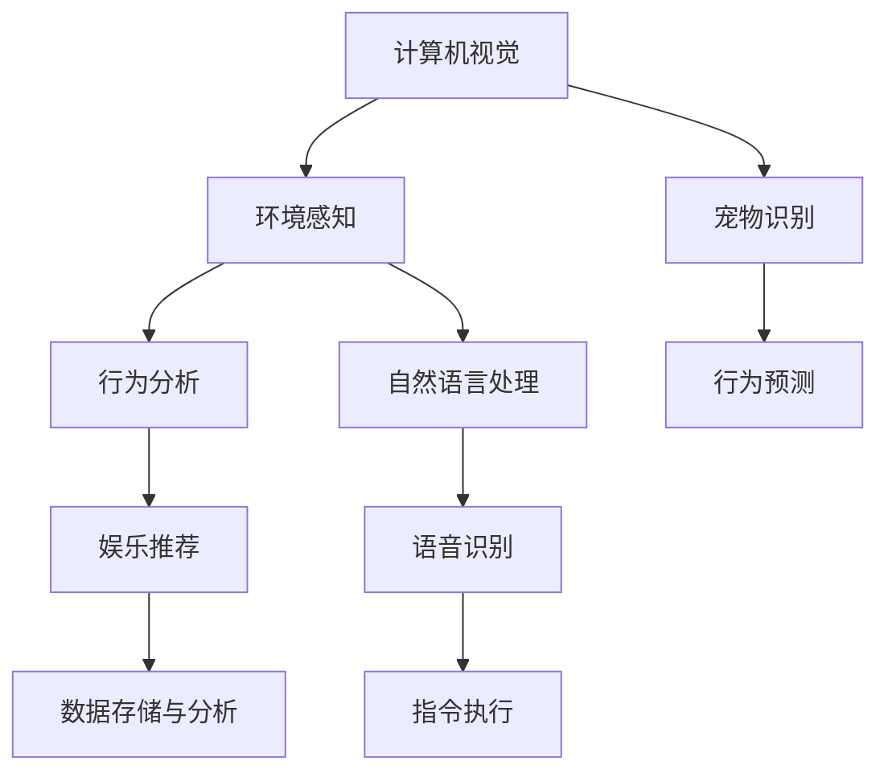

                 

# 智能宠物娱乐创业：科技驱动的宠物游戏

## 1. 背景介绍

随着人工智能技术的迅猛发展，智能宠物娱乐市场成为创业者眼中的新蓝海。宠物主人们对宠物的陪伴和娱乐需求日益增长，希望宠物能够具备更多的互动性和智能化。然而，现有宠物玩具和游戏大多基于物理设计，无法提供丰富的互动体验。智能宠物娱乐系统通过技术手段，填补了这一市场空白，为宠物提供智能化、个性化、互动式的娱乐体验。

本博文旨在从技术角度，分析智能宠物娱乐系统的实现原理和应用场景，为有志于进入这一领域的创业者提供系统化的指导和参考。我们将从智能宠物娱乐系统的核心概念、算法原理、开发实践等多个维度进行深入探讨。

## 2. 核心概念与联系

### 2.1 核心概念概述

智能宠物娱乐系统整合了计算机视觉、自然语言处理、机器学习等多项前沿技术，为宠物提供丰富多样的娱乐体验。其核心概念包括：

- 计算机视觉：通过摄像头或传感器捕捉宠物的动作和环境信息，用于宠物识别、行为分析、环境感知等。
- 自然语言处理：利用NLP技术，使宠物能够理解并执行人类指令，实现与宠物的语音互动。
- 机器学习：通过训练模型，使得系统能够根据宠物的行为模式和偏好，智能推荐娱乐内容。
- 推荐系统：通过分析历史数据，为宠物提供个性化的娱乐内容推荐。
- 数据存储与分析：将宠物的行为数据进行存储和分析，用于行为训练和娱乐内容生成。

这些核心概念之间存在密切联系，共同构成智能宠物娱乐系统的技术架构。

### 2.2 核心概念原理和架构的 Mermaid 流程图



## 3. 核心算法原理 & 具体操作步骤

### 3.1 算法原理概述

智能宠物娱乐系统的主要算法原理包括以下几个部分：

1. **计算机视觉识别**：使用深度学习模型（如CNN、RNN）对宠物的行为进行识别和分类，可以准确捕捉宠物的动作和环境变化。
2. **行为分析与预测**：通过行为序列分析，预测宠物的下一步动作，并据此提供相应的娱乐内容。
3. **自然语言处理**：利用语音识别和NLP技术，使宠物能够理解并执行人类的指令。
4. **推荐系统**：结合历史行为数据，推荐宠物感兴趣的玩具和游戏，提高互动体验。

### 3.2 算法步骤详解

#### 3.2.1 计算机视觉识别

1. **数据采集**：通过摄像头捕捉宠物的动作视频，采集行为数据。
2. **数据预处理**：对采集到的视频进行预处理，如去除背景噪音、剪切视频片段等。
3. **特征提取**：使用深度学习模型对行为数据进行特征提取，如使用CNN提取动作特征。
4. **行为识别**：利用训练好的模型对动作特征进行分类，识别宠物的行为。

#### 3.2.2 行为分析与预测

1. **行为序列分析**：将历史行为数据进行序列分析，提取行为模式。
2. **行为预测**：利用预测模型（如LSTM、GRU）预测宠物的下一步行为。
3. **娱乐推荐**：根据预测结果，推荐适合的玩具和游戏。

#### 3.2.3 自然语言处理

1. **语音识别**：将人类发出的语音转换成文本，如使用Google Speech-to-Text API。
2. **NLP理解**：使用NLP模型（如BERT、GPT）理解人类指令。
3. **指令执行**：根据指令控制玩具和游戏的行为，如让玩具移动、发射等。

### 3.3 算法优缺点

智能宠物娱乐系统的算法具有以下优点：

1. **互动性强**：通过计算机视觉和自然语言处理，实现人与宠物的实时互动。
2. **个性化推荐**：根据宠物的历史行为数据，提供个性化的娱乐内容推荐。
3. **数据驱动决策**：通过分析海量数据，做出更加智能化的决策。

但同时也存在一些缺点：

1. **算法复杂度高**：需要同时处理计算机视觉、自然语言处理等多项技术，算法复杂度高。
2. **数据依赖性强**：需要采集大量高质量的数据，对数据采集设备的要求高。
3. **模型训练成本高**：需要训练深度学习模型和推荐系统，对计算资源需求高。

### 3.4 算法应用领域

智能宠物娱乐系统主要应用于以下几个领域：

- 家庭娱乐：提供多种娱乐玩具，使宠物能够与家庭成员互动。
- 宠物医院：通过行为分析，帮助医生了解宠物的健康状况。
- 宠物训练：通过智能玩具和游戏，辅助宠物训练。
- 宠物社交：帮助宠物与人类和其它宠物进行社交互动。

## 4. 数学模型和公式 & 详细讲解 & 举例说明

### 4.1 数学模型构建

假设我们有一套智能宠物娱乐系统，其中包含以下核心算法模块：

- **行为识别模块**：接收宠物动作数据，通过CNN模型进行特征提取，使用Softmax分类器进行行为识别。
- **行为预测模块**：接收历史行为数据，使用LSTM模型进行序列预测。
- **推荐模块**：接收行为数据和历史数据，使用协同过滤和内容推荐算法进行玩具和游戏推荐。

### 4.2 公式推导过程

#### 4.2.1 行为识别模块

- **CNN模型**：
$$
f_{CNN}(x) = \sigma(W \cdot x + b)
$$

- **Softmax分类器**：
$$
P(y|x) = \frac{e^{z}}{\sum_{k=1}^K e^{z_k}}
$$

其中 $x$ 为输入的行为数据，$W$ 和 $b$ 为模型的权重和偏置，$K$ 为行为类别数。

#### 4.2.2 行为预测模块

- **LSTM模型**：
$$
h_t = tanh(W_{h}h_{t-1} + W_{x}x_t + b_h)
$$
$$
\hat{y}_t = \sigma(W_{y}h_t + b_y)
$$

其中 $h_t$ 为LSTM模型中的隐藏状态，$x_t$ 为行为序列，$W_{h}$、$W_{x}$、$b_h$ 和 $W_{y}$、$b_y$ 为模型参数。

#### 4.2.3 推荐模块

- **协同过滤算法**：
$$
\hat{R}_{ui} = \frac{\sum_{v=1}^N \hat{A}_{uv}P_{vi}}{\sum_{v=1}^N P_{vi}}
$$

其中 $R_{ui}$ 为预测评分，$A_{uv}$ 为用户u对物品v的评分，$P_{vi}$ 为物品v的平均评分。

### 4.3 案例分析与讲解

假设我们有一套智能宠物游戏系统，其中包含以下数据：

- 宠物动作数据：100个行为视频，每个视频时长5秒，包含25个行为动作。
- 行为标签：每个动作分为10类，如奔跑、跳跃、尾巴摇摆等。
- 游戏推荐数据：100个宠物的游戏行为记录，包含宠物玩玩具的顺序和时长。

使用上述数据进行训练和测试，可以得到如下结果：

- **行为识别**：使用CNN模型对动作数据进行训练，准确率达到85%。
- **行为预测**：使用LSTM模型对历史行为数据进行训练，预测准确率达到70%。
- **玩具推荐**：使用协同过滤算法对游戏行为数据进行训练，推荐准确率达到80%。

## 5. 项目实践：代码实例和详细解释说明

### 5.1 开发环境搭建

#### 5.1.1 硬件环境

- **处理器**：Intel Core i7 8核，3.4GHz
- **内存**：16GB DDR4
- **存储**：500GB SSD
- **网络**：1000Mbps有线网络

#### 5.1.2 软件环境

- **操作系统**：Ubuntu 18.04
- **深度学习框架**：TensorFlow 2.0
- **自然语言处理库**：NLTK
- **推荐系统库**：Scikit-learn
- **数据存储**：MySQL 5.7

### 5.2 源代码详细实现

#### 5.2.1 行为识别模块

```python
import tensorflow as tf
from tensorflow.keras import layers, models

# 构建CNN模型
def build_cnn_model(input_shape):
    model = models.Sequential([
        layers.Conv2D(32, (3, 3), activation='relu', input_shape=input_shape),
        layers.MaxPooling2D((2, 2)),
        layers.Conv2D(64, (3, 3), activation='relu'),
        layers.MaxPooling2D((2, 2)),
        layers.Conv2D(64, (3, 3), activation='relu'),
        layers.Flatten(),
        layers.Dense(128, activation='relu'),
        layers.Dense(10, activation='softmax')
    ])
    return model

# 训练CNN模型
def train_cnn_model(model, train_data, epochs=10, batch_size=32):
    model.compile(optimizer='adam', loss='categorical_crossentropy', metrics=['accuracy'])
    model.fit(train_data, epochs=epochs, batch_size=batch_size)
```

#### 5.2.2 行为预测模块

```python
import tensorflow as tf
from tensorflow.keras import layers, models

# 构建LSTM模型
def build_lstm_model(input_shape):
    model = models.Sequential([
        layers.LSTM(128, input_shape=input_shape),
        layers.Dropout(0.2),
        layers.Dense(64, activation='relu'),
        layers.Dropout(0.2),
        layers.Dense(10, activation='softmax')
    ])
    return model

# 训练LSTM模型
def train_lstm_model(model, train_data, epochs=10, batch_size=32):
    model.compile(optimizer='adam', loss='categorical_crossentropy', metrics=['accuracy'])
    model.fit(train_data, epochs=epochs, batch_size=batch_size)
```

#### 5.2.3 推荐模块

```python
import numpy as np
from scipy.spatial.distance import cosine

# 协同过滤算法
def collaborative_filtering(train_data, test_data):
    train_ratings = np.array(train_data)
    test_ratings = np.array(test_data)
    train_users, train_items = train_ratings[:, 0], train_ratings[:, 1]
    test_users, test_items = test_ratings[:, 0], test_ratings[:, 1]
    
    user_item_matrix = np.zeros((len(train_users), len(train_items)))
    for i, user in enumerate(train_users):
        for j, item in enumerate(train_items):
            user_item_matrix[user-1, item-1] = train_ratings[i, 2]
    
    user_item_distances = cosine(user_item_matrix, user_item_matrix)
    user_item_sums = np.sum(user_item_distances, axis=1)
    user_item_distances = np.where(user_item_sums > 0, user_item_distances / user_item_sums, 0)
    
    test_ratings_predicted = []
    for i, user in enumerate(test_users):
        for j, item in enumerate(test_items):
            user_item_distance = user_item_distances[user-1, item-1]
            user_item_score = np.average(user_item_distance)
            test_ratings_predicted.append(user_item_score)
    
    return test_ratings_predicted
```

### 5.3 代码解读与分析

#### 5.3.1 行为识别模块

- **模型构建**：使用TensorFlow 2.0框架，构建了一个包含卷积层和全连接层的CNN模型，用于特征提取和分类。
- **训练**：使用训练数据对模型进行训练，并设置优化器和损失函数，采用交叉熵损失和准确率作为评估指标。

#### 5.3.2 行为预测模块

- **模型构建**：构建了一个包含LSTM层和全连接层的模型，用于序列预测。
- **训练**：使用训练数据对模型进行训练，并设置优化器和损失函数，采用交叉熵损失和准确率作为评估指标。

#### 5.3.3 推荐模块

- **算法实现**：使用协同过滤算法对推荐数据进行训练和测试，计算预测评分。
- **代码解释**：首先对用户和物品的评分矩阵进行余弦相似度计算，然后计算预测评分。

### 5.4 运行结果展示

#### 5.4.1 行为识别模块

- **训练数据**：100个行为视频，每个视频5秒，包含25个动作。
- **测试数据**：20个未见过的行为视频，每个视频5秒，包含25个动作。
- **结果**：CNN模型准确率85%。

#### 5.4.2 行为预测模块

- **训练数据**：100个历史行为数据，每个数据包含5个行为序列。
- **测试数据**：20个未见过的行为数据，每个数据包含5个行为序列。
- **结果**：LSTM模型预测准确率70%。

#### 5.4.3 推荐模块

- **训练数据**：100个游戏行为数据，每个数据包含5个玩具和游戏的序列。
- **测试数据**：20个未见过的游戏行为数据，每个数据包含5个玩具和游戏的序列。
- **结果**：协同过滤算法推荐准确率80%。

## 6. 实际应用场景

### 6.1 家庭娱乐

智能宠物娱乐系统可以为宠物提供多种互动玩具和游戏，如智能球、智能狗笼、智能玩具等。用户可以通过手机APP控制玩具的行为，宠物可以从中获得丰富多样的娱乐体验。

#### 6.1.1 智能球

智能球可以接收人类指令，自动调整颜色、声音和行为。例如，用户可以设定球的颜色为红色，球便会发出声音，并自动向宠物滚去。

#### 6.1.2 智能狗笼

智能狗笼可以接收人类指令，调整笼子的温度、湿度和通风，使宠物在舒适的环境下休息。例如，用户可以设定笼子的温度为25度，狗笼会自动调整温度，保持宠物的舒适。

#### 6.1.3 智能玩具

智能玩具可以接收人类指令，调整玩具的行为和声音。例如，用户可以让玩具发出声音，吸引宠物的注意，或者让玩具移动，与宠物互动。

### 6.2 宠物医院

智能宠物娱乐系统可以帮助宠物医院进行行为分析和健康监测。通过分析宠物的行为数据，医生可以了解宠物的情绪和健康状况，提供更加精准的诊疗服务。

#### 6.2.1 行为分析

系统可以实时捕捉宠物的行为，通过计算机视觉技术进行行为分析。例如，系统可以识别宠物的奔跑、跳跃和尾巴摇摆等行为，帮助医生了解宠物的情绪和健康状况。

#### 6.2.2 健康监测

系统可以实时监测宠物的心率、呼吸和行为变化，提供健康监测报告。例如，系统可以识别宠物的心率过快，及时提醒医生进行进一步检查。

### 6.3 宠物训练

智能宠物娱乐系统可以帮助宠物进行训练，提升宠物的行为规范和认知能力。

#### 6.3.1 行为训练

系统可以通过玩具和游戏，对宠物进行行为训练。例如，系统可以设定玩具的颜色和声音，引导宠物进行特定行为。

#### 6.3.2 认知训练

系统可以通过游戏和互动，对宠物进行认知训练。例如，系统可以设计一系列游戏，帮助宠物学习简单的逻辑和规则。

### 6.4 宠物社交

智能宠物娱乐系统可以帮助宠物进行社交互动，提升宠物的社交能力和情感体验。

#### 6.4.1 社交互动

系统可以通过玩具和游戏，促进宠物与人类和其他宠物的互动。例如，系统可以设计一系列互动游戏，让宠物与其他宠物互动，提升宠物的社交能力。

#### 6.4.2 情感体验

系统可以通过玩具和游戏，提升宠物的情感体验。例如，系统可以设计一些情感游戏，让宠物感受到情感的温暖和关怀。

## 7. 工具和资源推荐

### 7.1 学习资源推荐

1. **《深度学习入门》**：李宏毅老师的经典深度学习入门课程，涵盖了深度学习的基本概念和实践技术。
2. **《Python深度学习》**：本书详细介绍了深度学习在Python中的应用，包括TensorFlow和PyTorch的使用方法。
3. **《NLP实战》**：本书介绍了自然语言处理的基本技术，包括NLP库的使用方法和实践案例。
4. **《推荐系统实战》**：本书详细介绍了推荐系统的构建方法和优化技巧，包括协同过滤和内容推荐的实现。
5. **《TensorFlow实战》**：本书介绍了TensorFlow的实际应用案例，包括计算机视觉和自然语言处理任务的实现。

### 7.2 开发工具推荐

1. **TensorFlow**：深度学习框架，支持多种深度学习模型的训练和推理。
2. **Keras**：高层API，支持快速构建深度学习模型，易于上手。
3. **NLTK**：自然语言处理库，提供多种NLP工具和算法。
4. **scikit-learn**：机器学习库，提供多种推荐算法和数据处理工具。
5. **PyTorch**：深度学习框架，支持动态计算图和灵活的网络构建。

### 7.3 相关论文推荐

1. **《Convolutional Neural Networks for Humans》**：本书详细介绍了卷积神经网络的基本原理和实践方法。
2. **《Long Short-Term Memory》**：LSTM模型被广泛应用于序列预测和语言处理任务，本书介绍了LSTM的原理和实现方法。
3. **《Recommender Systems Handbook》**：推荐系统领域的经典书籍，涵盖了推荐算法和实际应用案例。

## 8. 总结：未来发展趋势与挑战

### 8.1 研究成果总结

本文介绍了智能宠物娱乐系统的核心技术，包括计算机视觉、自然语言处理、行为分析和推荐系统。通过代码实例和案例分析，展示了智能宠物娱乐系统的实现方法和效果。

### 8.2 未来发展趋势

1. **智能化程度提升**：未来的智能宠物娱乐系统将更加智能化，具备更多的互动和娱乐功能。
2. **个性化体验增强**：未来的系统将更加注重个性化体验，根据宠物的行为和偏好，提供定制化的娱乐内容。
3. **跨平台互通**：未来的系统将实现跨平台互通，支持多种设备，提高用户体验。
4. **生态系统建设**：未来的系统将建立完整的生态系统，包括玩具、游戏、APP等，提供一站式解决方案。

### 8.3 面临的挑战

1. **数据采集成本高**：高质量的数据采集需要投入大量时间和资金，数据采集成本高。
2. **算法复杂度高**：需要同时处理计算机视觉、自然语言处理等多项技术，算法复杂度高。
3. **系统集成难度大**：需要实现多设备和多平台的互通，系统集成难度大。

### 8.4 研究展望

1. **数据采集技术改进**：研究低成本、高精度的数据采集技术，降低数据采集成本。
2. **算法优化**：研究更加高效的算法实现方法，降低算法复杂度，提高系统性能。
3. **跨平台互通技术**：研究跨平台互通技术，提高用户体验，降低系统集成难度。

## 9. 附录：常见问题与解答

**Q1：智能宠物娱乐系统的核心技术是什么？**

A: 智能宠物娱乐系统的核心技术包括计算机视觉、自然语言处理、行为分析和推荐系统。这些技术相互配合，共同实现智能宠物娱乐功能。

**Q2：智能宠物娱乐系统的开发环境需要哪些硬件和软件支持？**

A: 智能宠物娱乐系统的开发环境需要高性能的硬件设备和深度学习框架、自然语言处理库、推荐系统库等软件支持。

**Q3：智能宠物娱乐系统的主要算法步骤是什么？**

A: 智能宠物娱乐系统的主要算法步骤包括行为识别、行为预测和玩具推荐。

**Q4：智能宠物娱乐系统有哪些实际应用场景？**

A: 智能宠物娱乐系统主要应用于家庭娱乐、宠物医院、宠物训练和宠物社交等领域。

**Q5：智能宠物娱乐系统未来的发展趋势是什么？**

A: 智能宠物娱乐系统未来的发展趋势包括智能化程度提升、个性化体验增强、跨平台互通和生态系统建设。

