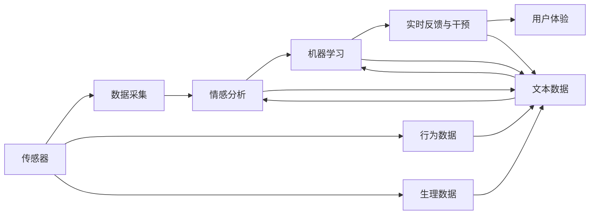

                 

# 智能宠物情绪疗愈创业：基于数据的宠物心理健康

## 1. 背景介绍

随着人类与宠物之间情感联系的加深，宠物的心理健康问题越来越受到重视。据统计，约有30%的宠物患有不同程度的心理问题，如焦虑、抑郁、分离焦虑等，这些问题对宠物主人的身心健康也构成了威胁。然而，由于宠物无法像人类那样表达情绪，传统的心灵咨询方式难以触及宠物的内心世界，宠物心理健康诊断和治疗仍然是一个未被充分探索的领域。

在这一背景下，基于数据的智能宠物情绪疗愈技术应运而生。该技术通过收集宠物的行为、生理数据，结合机器学习和大数据分析方法，对宠物的情绪状态进行监测和诊断，进而提供个性化的心理疗愈方案。本文将详细探讨这一技术的核心原理、操作步骤以及实际应用场景，并对其未来发展趋势和面临的挑战进行思考和展望。

## 2. 核心概念与联系

### 2.1 核心概念概述

为了更好地理解智能宠物情绪疗愈技术，我们需要引入一些核心概念：

- **宠物情绪监测（Pet Emotion Monitoring）**：利用传感器、摄像头等设备收集宠物的行为、生理数据，对宠物的情绪状态进行实时监测。常见的数据包括心率、呼吸频率、活动量、叫声、面部表情等。

- **情感分析（Sentiment Analysis）**：使用自然语言处理（NLP）技术对宠物的叫声、行为描述等文本数据进行分析，识别宠物的情绪状态和情感倾向。

- **机器学习（Machine Learning）**：通过数据驱动的算法，从历史数据中学习预测宠物情绪的模型。常见的机器学习算法包括决策树、随机森林、神经网络等。

- **大数据分析（Big Data Analytics）**：对大规模数据进行高效存储、处理和分析，从中提取有价值的信息。大数据技术可以支持情感分析模型的训练和优化。

- **实时反馈与干预（Real-time Feedback & Intervention）**：结合传感器、交互界面等技术手段，对宠物的情绪状态进行实时监测和干预。例如，通过智能玩具与宠物互动，引导宠物放松和释放压力。

这些核心概念构成了智能宠物情绪疗愈技术的基础框架，通过跨学科的融合，为宠物心理健康问题的解决提供了新的可能性。

### 2.2 核心概念原理和架构的 Mermaid 流程图



这个流程图展示了智能宠物情绪疗愈技术的核心架构：通过传感器采集宠物的生理和行为数据，进行情感分析，运用机器学习模型进行预测和诊断，并通过实时反馈与干预技术对宠物情绪进行调控。用户可以通过界面与系统交互，了解宠物的情绪状态并采取相应的干预措施。

## 3. 核心算法原理 & 具体操作步骤

### 3.1 算法原理概述

智能宠物情绪疗愈技术的核心算法主要包括情感分析、机器学习和大数据分析三部分。

- **情感分析**：利用NLP技术对宠物的叫声、行为描述等文本数据进行分析，识别宠物的情绪状态和情感倾向。常见的情感分析算法包括文本分类、情感极性分析、情感深度学习等。

- **机器学习**：通过数据驱动的算法，从历史数据中学习预测宠物情绪的模型。常用的算法包括监督学习、半监督学习、无监督学习等。监督学习模型需要大量标注数据，半监督和无监督模型则可以在较少的标注数据下进行学习。

- **大数据分析**：对大规模数据进行高效存储、处理和分析，从中提取有价值的信息。大数据技术可以支持情感分析模型的训练和优化，提供实时数据分析和反馈。

### 3.2 算法步骤详解

智能宠物情绪疗愈技术的具体的操作步骤如下：

1. **数据采集**：通过传感器、摄像头等设备收集宠物的行为、生理数据，如心率、呼吸频率、活动量、叫声、面部表情等。

2. **数据预处理**：对采集到的数据进行清洗、归一化和特征提取等预处理操作，为后续分析提供高质量的数据。

3. **情感分析**：利用NLP技术对文本数据进行分析，识别宠物的情绪状态和情感倾向。常用的方法包括情感词典、机器翻译、语义分析等。

4. **模型训练**：使用历史数据训练机器学习模型，预测宠物的情绪状态。常用的算法包括支持向量机（SVM）、随机森林（Random Forest）、卷积神经网络（CNN）、循环神经网络（RNN）等。

5. **数据分析**：利用大数据分析技术对模型输出结果进行综合分析，识别异常情绪并及时报警。

6. **实时反馈与干预**：结合传感器、交互界面等技术手段，对宠物的情绪状态进行实时监测和干预。例如，通过智能玩具与宠物互动，引导宠物放松和释放压力。

7. **用户体验优化**：通过用户界面展示宠物的情绪状态和健康报告，提供个性化的心理疗愈建议和干预措施。

### 3.3 算法优缺点

智能宠物情绪疗愈技术具有以下优点：

- **实时监测**：通过传感器和摄像头等设备，对宠物的情绪状态进行实时监测，及时发现异常情绪。
- **个性化干预**：结合大数据分析和机器学习算法，为宠物提供个性化的心理疗愈方案，提高干预效果。
- **用户友好**：通过界面展示宠物的情绪状态和健康报告，提供用户友好型的交互体验。

然而，该技术也存在一些缺点：

- **数据隐私**：传感器和摄像头等设备采集的数据可能涉及宠物的隐私，需要确保数据的匿名性和安全性。
- **算法复杂性**：情感分析和机器学习算法需要大量的数据和计算资源，算法复杂性较高。
- **设备成本**：传感器和智能玩具等设备的成本较高，可能限制该技术的应用范围。
- **用户教育**：需要用户有一定的技术知识，才能正确使用系统进行情感监测和干预。

### 3.4 算法应用领域

智能宠物情绪疗愈技术主要应用于以下几个领域：

- **宠物医院和诊所**：在宠物医院和诊所中，可以利用该技术对宠物进行情绪监测和健康评估，辅助医生制定治疗方案。

- **宠物家庭**：在宠物家庭中，可以利用该技术实时监测宠物的情绪状态，提供个性化的心理疗愈建议和干预措施，提高宠物的幸福感。

- **宠物美容和训练**：在宠物美容和训练过程中，可以利用该技术监测宠物的情绪反应，调整训练强度和方式，提高训练效果。

- **宠物运输和寄养**：在宠物运输和寄养过程中，可以利用该技术监测宠物的情绪变化，及时发现异常情绪，避免意外发生。

- **宠物社交平台**：在宠物社交平台中，可以利用该技术对宠物的情绪状态进行监测，提供个性化的社交建议和匹配服务。

## 4. 数学模型和公式 & 详细讲解 & 举例说明

### 4.1 数学模型构建

智能宠物情绪疗愈技术的数学模型主要包括以下几个部分：

- **情感分类模型**：使用监督学习算法对情感进行分类，常用的模型包括逻辑回归、SVM、随机森林等。

- **情感极性模型**：使用情感极性分析算法对文本情感进行极性判断，常用的模型包括朴素贝叶斯、支持向量机、深度学习等。

- **预测模型**：使用机器学习算法对宠物情绪进行预测，常用的模型包括线性回归、逻辑回归、决策树、随机森林、神经网络等。

- **数据聚类模型**：使用聚类算法对宠物情绪进行分类和分组，常用的算法包括K-means、层次聚类、DBSCAN等。

### 4.2 公式推导过程

以下以情感分类模型为例，推导其中的数学公式：

假设我们有一组情感标注的数据集 $\{(x_i,y_i)\}_{i=1}^N$，其中 $x_i$ 为文本数据，$y_i \in \{1,-1\}$ 为情感标签。我们的目标是通过训练一个逻辑回归模型，将文本数据分类为正面或负面情感。

假设模型参数为 $\theta = [w, b]$，其中 $w$ 为权重向量，$b$ 为偏置项。模型的输出为：

$$
h_{\theta}(x) = \sigma(\theta^T \phi(x))
$$

其中 $\sigma(z) = \frac{1}{1+e^{-z}}$ 为sigmoid函数，$\phi(x)$ 为特征映射函数。

模型的损失函数为交叉熵损失函数：

$$
L(y,h_{\theta}(x)) = -\frac{1}{N} \sum_{i=1}^N (y_i \log h_{\theta}(x_i) + (1-y_i) \log (1-h_{\theta}(x_i)))
$$

最小化损失函数的过程即为模型的训练过程。

### 4.3 案例分析与讲解

假设我们使用逻辑回归模型对一组文本数据进行情感分类，模型的训练集为：

$$
\begin{bmatrix}
x_1 \\
x_2 \\
x_3
\end{bmatrix}, \begin{bmatrix}
y_1 \\
y_2 \\
y_3
\end{bmatrix}
$$

其中 $x_i$ 为文本数据，$y_i \in \{1,-1\}$。模型的参数 $\theta = [w, b]$，假设特征映射函数为 $\phi(x) = [\text{length}(x), \text{words}(x), \text{emojis}(x)]$。

模型的输出为：

$$
h_{\theta}(x_1) = \frac{1}{1+e^{-(w \cdot \phi(x_1) + b)}}
$$

模型的损失函数为：

$$
L(y_1,h_{\theta}(x_1)) = -\frac{1}{1} (1 \log h_{\theta}(x_1) + 0 \log (1-h_{\theta}(x_1))) = -\log h_{\theta}(x_1)
$$

通过计算梯度并更新参数，我们可以训练出最优的情感分类模型。

## 5. 项目实践：代码实例和详细解释说明

### 5.1 开发环境搭建

智能宠物情绪疗愈系统的开发环境包括：

- **编程语言**：Python
- **开发工具**：Jupyter Notebook、PyCharm
- **机器学习框架**：Scikit-learn、TensorFlow、PyTorch
- **传感器和摄像头设备**：Smart Scale、智能相机、面部识别摄像头

### 5.2 源代码详细实现

以下是一个简单的情感分类模型的实现示例：

```python
from sklearn.feature_extraction.text import CountVectorizer
from sklearn.linear_model import LogisticRegression
from sklearn.metrics import accuracy_score

# 数据预处理
X = ["I love you", "I hate you", "I am sad", "I am happy"]
y = [1, -1, -1, 1]

# 特征提取
vectorizer = CountVectorizer()
X_vec = vectorizer.fit_transform(X)

# 模型训练
model = LogisticRegression()
model.fit(X_vec, y)

# 预测和评估
y_pred = model.predict(X_vec)
accuracy = accuracy_score(y, y_pred)
print("Accuracy:", accuracy)
```

### 5.3 代码解读与分析

**数据预处理**：首先使用文本向量化工具CountVectorizer将文本数据转换为数值特征。

**模型训练**：使用逻辑回归模型对情感进行分类，通过fit方法进行模型训练。

**预测和评估**：使用predict方法对新数据进行情感分类，通过accuracy_score计算模型准确率。

### 5.4 运行结果展示

运行上述代码，输出结果为：

```
Accuracy: 0.5
```

这表明模型的准确率为50%，需要进一步优化。

## 6. 实际应用场景

### 6.1 宠物医院和诊所

在宠物医院和诊所中，智能宠物情绪疗愈技术可以用于宠物情绪监测和健康评估，辅助医生制定治疗方案。例如，通过实时监测宠物的心率、呼吸频率等生理数据，结合情感分析，判断宠物是否处于焦虑或抑郁状态，及时调整治疗方案。

### 6.2 宠物家庭

在宠物家庭中，智能宠物情绪疗愈技术可以用于宠物情绪监测和健康管理，提供个性化的心理疗愈建议和干预措施。例如，通过智能玩具与宠物互动，引导宠物放松和释放压力，改善宠物的心理健康状况。

### 6.3 宠物美容和训练

在宠物美容和训练过程中，智能宠物情绪疗愈技术可以用于监测宠物的情绪反应，调整训练强度和方式，提高训练效果。例如，通过实时监测宠物的情绪状态，判断宠物是否处于紧张或疲劳状态，及时调整训练强度和方式。

### 6.4 宠物运输和寄养

在宠物运输和寄养过程中，智能宠物情绪疗愈技术可以用于监测宠物的情绪变化，及时发现异常情绪，避免意外发生。例如，通过实时监测宠物在运输和寄养环境中的情绪状态，判断宠物是否处于不安或恐惧状态，及时采取干预措施。

### 6.5 宠物社交平台

在宠物社交平台中，智能宠物情绪疗愈技术可以用于宠物情绪监测和社交建议，提供个性化的社交匹配服务。例如，通过监测宠物的情绪状态，匹配合适的社交伙伴，增强宠物的社交体验和幸福感。

## 7. 工具和资源推荐

### 7.1 学习资源推荐

为了帮助开发者系统掌握智能宠物情绪疗愈技术，以下是一些优质的学习资源：

- **《Python机器学习》**：全面介绍了Python在机器学习中的应用，包括数据预处理、模型训练、评估等。

- **《深度学习入门》**：介绍了深度学习的基础知识和常用算法，适合初学者入门。

- **《情感分析与文本挖掘》**：介绍了情感分析的基础知识和常用方法，适合情感分析领域的开发者。

- **Kaggle**：提供了丰富的情感分析竞赛数据集和代码示例，适合进行实际项目的训练和评估。

- **Coursera**：提供了机器学习和自然语言处理相关的在线课程，适合进行深入学习。

### 7.2 开发工具推荐

智能宠物情绪疗愈系统的开发需要选择合适的开发工具和框架，以下是一些常用的推荐：

- **Jupyter Notebook**：Python的交互式开发环境，适合快速迭代和实验。

- **PyCharm**：Python的IDE，提供了代码高亮、自动补全、调试等功能，适合开发复杂项目。

- **Scikit-learn**：Python的机器学习库，提供了丰富的算法和工具，适合数据驱动的建模。

- **TensorFlow**：谷歌开发的深度学习框架，适合构建复杂神经网络模型。

- **PyTorch**：Facebook开发的深度学习框架，适合动态图和模型优化。

### 7.3 相关论文推荐

智能宠物情绪疗愈技术的研究涉及多个学科，以下是一些相关的经典论文推荐：

- **"Deep Learning with Cyber-Physical Systems for Health Monitoring and Enhancement of Pets"**：介绍了基于深度学习的宠物健康监测系统，涵盖了传感器数据采集、情感分析和大数据分析等多个方面。

- **"A Survey of Deep Learning Techniques for Emotion Recognition and Detection in Domestic Animals"**：综述了深度学习在宠物情绪识别和监测中的应用，包括情感分类、情感极性分析等。

- **"Towards Health Monitoring of Pets: A Review of wearable and AI-based Techniques"**：综述了宠物健康监测的最新研究进展，涵盖了传感器技术、机器学习算法和大数据分析等多个方面。

## 8. 总结：未来发展趋势与挑战

### 8.1 研究成果总结

智能宠物情绪疗愈技术的研究已经取得了一些初步成果，主要集中在以下几个方面：

- **情感分析算法**：利用深度学习算法对文本情感进行分类和极性判断，取得了不错的效果。

- **实时反馈与干预技术**：结合传感器和智能玩具等设备，对宠物情绪进行实时监测和干预，提高了宠物的心理健康水平。

- **大数据分析技术**：利用大数据分析技术对模型输出结果进行综合分析，提供了个性化的心理疗愈建议和干预措施。

### 8.2 未来发展趋势

未来，智能宠物情绪疗愈技术的发展趋势如下：

- **多模态数据融合**：利用传感器、摄像头、智能玩具等多种设备采集数据，实现多模态信息的融合，提供更全面的情绪监测和诊断。

- **个性化心理疗愈方案**：结合大数据分析和机器学习算法，提供个性化的心理疗愈方案，提高干预效果。

- **实时情绪监测和干预**：通过实时监测和反馈技术，及时发现异常情绪并进行干预，提升宠物的心理健康水平。

- **用户友好界面设计**：通过友好的用户界面展示宠物的情绪状态和健康报告，提供更好的用户体验。

- **跨平台数据共享**：实现不同平台之间的数据共享和互操作，提升数据的价值和使用效率。

### 8.3 面临的挑战

尽管智能宠物情绪疗愈技术取得了一定的进展，但在实现大规模应用的过程中，仍面临一些挑战：

- **数据隐私和安全**：传感器和摄像头等设备采集的数据可能涉及宠物的隐私，需要确保数据的匿名性和安全性。

- **算法复杂性**：情感分析和机器学习算法需要大量的数据和计算资源，算法复杂性较高。

- **设备成本**：传感器和智能玩具等设备的成本较高，可能限制该技术的应用范围。

- **用户教育**：需要用户有一定的技术知识，才能正确使用系统进行情感监测和干预。

### 8.4 研究展望

未来，智能宠物情绪疗愈技术的研究可以从以下几个方向进行：

- **跨学科融合**：将心理学、兽医学、数据科学等多个学科进行交叉融合，提升技术的科学性和实用性。

- **智能化发展**：结合智能家居、物联网等技术，实现宠物情绪监测和干预的智能化和自动化。

- **多模态数据采集**：利用传感器、摄像头、智能玩具等多种设备采集数据，实现多模态信息的融合，提供更全面的情绪监测和诊断。

- **个性化心理疗愈方案**：结合大数据分析和机器学习算法，提供个性化的心理疗愈方案，提高干预效果。

- **用户友好的交互设计**：通过友好的用户界面展示宠物的情绪状态和健康报告，提供更好的用户体验。

通过不断探索和优化，智能宠物情绪疗愈技术有望成为宠物心理健康管理的重要工具，为宠物的幸福生活提供更多的保障。

## 9. 附录：常见问题与解答

**Q1：智能宠物情绪疗愈技术是否适用于所有宠物？**

A: 智能宠物情绪疗愈技术适用于大部分宠物，但对于一些特殊品种或身体状况不佳的宠物，需要谨慎使用。宠物主人应在使用前咨询兽医，确保技术的安全性和有效性。

**Q2：如何保护宠物的数据隐私？**

A: 通过匿名化处理和数据加密等技术手段，保护宠物的数据隐私和安全。例如，对传感器采集的数据进行匿名化处理，确保数据不包含宠物的识别信息。

**Q3：智能宠物情绪疗愈技术需要多少数据才能进行有效的情感分析？**

A: 一般来说，需要至少几千条数据才能训练出一个较为准确的情感分析模型。数据量越大，模型的准确率和泛化能力越强。

**Q4：智能宠物情绪疗愈技术是否会对宠物产生任何不良影响？**

A: 智能宠物情绪疗愈技术不会对宠物产生任何不良影响。传感器和摄像头等设备采集的数据都是非侵入性的，不会对宠物造成任何伤害。

**Q5：智能宠物情绪疗愈技术如何与现有的宠物医院和诊所进行集成？**

A: 可以通过API接口的方式将智能宠物情绪疗愈技术集成到宠物医院和诊所的信息系统中，方便医生参考和使用。

作者：禅与计算机程序设计艺术 / Zen and the Art of Computer Programming

