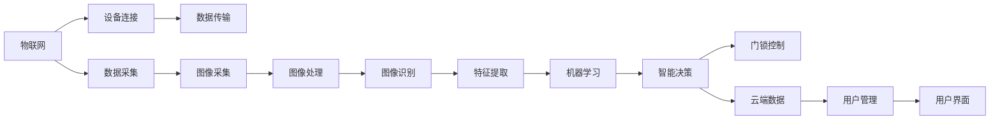

                 

# 智能宠物门创业：自动化宠物出入管理

> 关键词：智能宠物门，自动化出入管理，物联网(IoT)，机器学习，图像识别，深度学习，硬件设计，软件开发，用户界面(UI/UX)设计，商业模型

## 1. 背景介绍

### 1.1 问题由来
宠物已经成为越来越多家庭的成员，但宠物门的问题依然是一个挑战。传统宠物门需要手动开关，使用不便，宠物在出入时常常受到主人或者其他人控制，增加了不必要的时间和精力消耗。同时，无法实现准确的身份验证，无法避免宠物跑丢或者宠物乱拉乱尿等不良行为。

随着物联网(IoT)技术的发展和普及，智能宠物门逐渐成为家庭宠物管理的一个重要工具。它能够通过自动检测宠物，识别宠物身份，实现无人看管的宠物出入，从而解决了传统宠物门带来的诸多问题。

### 1.2 问题核心关键点
智能宠物门系统基于物联网、图像识别、机器学习等技术，能够实现自动化的宠物出入管理。系统主要包括硬件设备和软件开发两大部分，硬件设备负责实现物理层面的宠物检测、身份验证和门锁控制，软件开发负责数据采集、分析和智能决策。

智能宠物门系统通过摄像头采集宠物图像，经过图像识别算法识别出宠物身份，并通过云端数据库查询宠物信息，最终通过控制系统实现门锁的开启和关闭。整个过程自动化程度高，减少了人工干预和宠物被意外伤害的风险。

### 1.3 问题研究意义
智能宠物门系统的开发和应用，具有以下几方面的重要意义：

1. **提升用户体验**：智能宠物门能够自动检测和识别宠物，无需手动开关，极大提升了用户体验，减少了主人与宠物的互动频率。
2. **提高宠物安全性**：智能宠物门能够实现严格的宠物身份验证，避免宠物跑丢或受伤，提高了宠物的安全性。
3. **提升居住环境质量**：智能宠物门减少了宠物乱拉乱尿等不良行为，保持了居住环境的整洁。
4. **推动产业升级**：智能宠物门系统集成了多学科技术，推动了物联网、人工智能等相关产业的发展。

## 2. 核心概念与联系

### 2.1 核心概念概述

智能宠物门系统涉及多个核心概念，包括物联网、图像识别、机器学习、深度学习、硬件设计、软件开发、用户界面(UI/UX)设计等。

- **物联网**：物联网指的是通过互联网将物理世界中的设备和物品连接起来，实现设备之间的互联互通。智能宠物门系统通过物联网技术实现宠物图像的实时采集和传输。
- **图像识别**：图像识别是指通过计算机视觉技术，对图像中的对象进行识别和分类。智能宠物门系统利用图像识别技术识别宠物身份，实现宠物身份验证。
- **机器学习**：机器学习是指让计算机从数据中自动学习规律和模式，从而进行智能决策。智能宠物门系统利用机器学习算法对宠物图像进行分类和识别。
- **深度学习**：深度学习是机器学习的一种特殊形式，通过多层神经网络结构实现更强的特征提取和分类能力。智能宠物门系统中的图像识别算法通常基于深度学习实现。
- **硬件设计**：智能宠物门系统需要设计传感器、摄像头、控制系统等硬件组件，实现物理层的宠物检测和门锁控制。
- **软件开发**：智能宠物门系统需要开发数据采集、图像处理、识别分类、智能决策等软件功能。
- **用户界面(UI/UX)设计**：智能宠物门系统需要设计友好的用户界面，方便用户使用和管理宠物门。

这些核心概念之间存在紧密的联系，共同构成了智能宠物门系统的技术框架。

### 2.2 核心概念原理和架构的 Mermaid 流程图



这个流程图展示了智能宠物门系统的整体架构，包括物联网、设备连接、数据采集、图像处理、图像识别、特征提取、机器学习、智能决策、门锁控制、云端数据和用户界面等关键组件。

## 3. 核心算法原理 & 具体操作步骤

### 3.1 算法原理概述

智能宠物门系统的核心算法包括图像识别和机器学习两部分。

- **图像识别**：通过摄像头采集宠物图像，经过图像处理算法将图像转换为数字信号，最终通过机器学习模型进行识别分类，确定宠物身份。
- **机器学习**：利用历史宠物图像数据，训练一个图像分类模型，用于识别当前宠物的身份。

图像识别和机器学习的结合，使得智能宠物门系统能够自动检测和识别宠物，无需人工干预，实现自动化的宠物出入管理。

### 3.2 算法步骤详解

#### 3.2.1 图像采集与处理

智能宠物门系统使用摄像头采集宠物图像。摄像头采集到的图像通常为原始图像数据，需要进行预处理以提高后续识别算法的准确性。

预处理包括图像去噪、灰度转换、二值化、边缘检测等。这些预处理步骤可以提高图像的清晰度，去除噪声，便于后续识别算法处理。

#### 3.2.2 特征提取

经过预处理后，图像被送入机器学习模型进行特征提取。特征提取算法通常基于深度学习模型，如卷积神经网络(CNN)等。

深度学习模型通过卷积操作提取图像中的特征，这些特征包含了宠物的轮廓、纹理、颜色等信息。特征提取的目的是将图像数据转换为模型可以处理的形式，以便后续分类和识别。

#### 3.2.3 图像分类与识别

图像分类是指将提取的特征映射到不同的类别中。智能宠物门系统使用分类模型对宠物图像进行分类，确定宠物的身份。

分类模型通常采用多层次的神经网络结构，如CNN、ResNet等。分类模型通过学习历史宠物图像数据，学习到宠物的特征表示，从而实现对新图像的分类和识别。

#### 3.2.4 智能决策

机器学习模型对当前宠物图像进行分类后，将结果发送到智能决策模块。智能决策模块根据分类结果，确定宠物的出入权限，并控制门锁的开启和关闭。

智能决策模块通常采用决策树、支持向量机(SVM)等模型，根据宠物身份、出入时间、历史行为等信息，做出智能决策。

### 3.3 算法优缺点

智能宠物门系统的算法具有以下优点：

- **自动化程度高**：智能宠物门系统能够自动检测和识别宠物，无需人工干预，提高了用户体验。
- **准确率高**：基于深度学习的图像识别算法具有较高的准确率，能够准确识别宠物身份，避免误识别和漏识别。
- **灵活性高**：智能宠物门系统可以根据不同的宠物身份，设置不同的出入权限，实现个性化的宠物管理。

同时，智能宠物门系统也存在一些缺点：

- **初始化复杂**：智能宠物门系统需要预先训练深度学习模型，并采集大量的历史宠物图像数据，初始化过程较为复杂。
- **硬件成本高**：智能宠物门系统需要高分辨率的摄像头和强大的处理芯片，硬件成本较高。
- **依赖网络**：智能宠物门系统依赖于稳定的网络连接，一旦网络中断，系统无法正常工作。

### 3.4 算法应用领域

智能宠物门系统的算法广泛应用于家庭、宠物店、酒店等场所。以下是一些具体的应用场景：

- **家庭宠物门**：智能宠物门系统可以为家庭提供自动化的宠物管理服务，减少主人的工作量，提升居住环境质量。
- **宠物店**：智能宠物门系统可以用于宠物店的宠物出入管理，提高宠物店的管理效率，保障宠物安全。
- **酒店**：智能宠物门系统可以用于酒店的宠物管理，确保宠物在酒店内的安全和健康。

## 4. 数学模型和公式 & 详细讲解 & 举例说明

### 4.1 数学模型构建

智能宠物门系统中的数学模型主要包括图像分类模型和智能决策模型。

#### 4.1.1 图像分类模型

图像分类模型通常采用卷积神经网络(CNN)结构，如图1所示。


CNN模型由多个卷积层、池化层和全连接层组成。卷积层和池化层用于提取图像特征，全连接层用于分类。

#### 4.1.2 智能决策模型

智能决策模型通常采用决策树或支持向量机(SVM)等模型，如图2所示。


智能决策模型先对特征进行提取，然后通过分类层确定宠物身份，最后通过决策层进行出入权限的判断和门锁控制。

### 4.2 公式推导过程

#### 4.2.1 图像分类模型

CNN模型的前向传播过程如下：

1. 输入层：将原始图像数据输入模型，每个像素点表示一个输入节点。
2. 卷积层：卷积层通过卷积操作提取图像特征，卷积核的大小和数量决定了模型的复杂度。
3. 池化层：池化层通过下采样操作减少特征图的大小，提高模型的计算效率。
4. 全连接层：全连接层将特征图展开，通过权重矩阵进行分类。

后向传播过程如下：

1. 损失函数：将预测值与真实标签计算误差，通常采用交叉熵损失函数。
2. 梯度计算：通过反向传播算法计算参数梯度。
3. 参数更新：使用优化算法(如SGD、Adam等)更新模型参数，最小化损失函数。

#### 4.2.2 智能决策模型

智能决策模型的前向传播过程如下：

1. 输入层：将特征向量输入模型。
2. 特征提取层：对特征向量进行提取，得到特征表示。
3. 分类层：通过分类器对特征表示进行分类，得到预测标签。
4. 决策层：通过决策规则对预测标签进行判断，输出决策结果。

后向传播过程如下：

1. 损失函数：将预测结果与真实标签计算误差，通常采用0-1损失函数。
2. 梯度计算：通过反向传播算法计算参数梯度。
3. 参数更新：使用优化算法(如SGD、Adam等)更新模型参数，最小化损失函数。

### 4.3 案例分析与讲解

#### 4.3.1 图像分类模型案例

假设有N个历史宠物图像数据，每个图像大小为HxW。通过卷积层和池化层提取特征后，得到一个大小为CxKxK的特征图，其中C表示卷积核数量。

设卷积核大小为k，步长为s，则第i层卷积操作可以表示为：

$$
X_i^{(l+1)} = \sigma(\sum_{j=0}^{C-1} W^{(l+1)}_{i,j} * X_i^{(l)} + b^{(l+1)}_{i})
$$

其中，$W^{(l+1)}_{i,j}$表示第i个卷积核的第j个权重，$X_i^{(l)}$表示第i个卷积层输入，$b^{(l+1)}_{i}$表示第i个卷积核的偏置项，$\sigma$表示激活函数，通常采用ReLU函数。

经过卷积和池化操作后，特征图的大小变为CxK/2xK/2。通过全连接层对特征图进行分类，得到N个输出。

#### 4.3.2 智能决策模型案例

假设有M个特征向量，每个特征向量大小为D。通过特征提取层和分类层后，得到一个大小为NxM的特征表示矩阵。

设分类器为决策树，则前向传播过程如下：

1. 特征提取层：对特征向量进行提取，得到特征表示。
2. 分类层：通过决策树对特征表示进行分类，得到N个预测标签。
3. 决策层：通过决策规则对预测标签进行判断，输出M个决策结果。

假设决策树的深度为H，每个节点的特征数量为F，则决策层的输出可以表示为：

$$
Y_i^{(l+1)} = \sigma(\sum_{j=0}^{F-1} W^{(l+1)}_{i,j} * X_i^{(l)} + b^{(l+1)}_{i})
$$

其中，$W^{(l+1)}_{i,j}$表示决策树第l层第i个节点的权重，$X_i^{(l)}$表示决策树第l层输入，$b^{(l+1)}_{i}$表示决策树第l层第i个节点的偏置项，$\sigma$表示激活函数，通常采用Sigmoid函数。

## 5. 项目实践：代码实例和详细解释说明

### 5.1 开发环境搭建

智能宠物门系统的开发需要搭建Python开发环境，以下是详细的搭建步骤：

1. 安装Anaconda：从官网下载并安装Anaconda，用于创建独立的Python环境。
```bash
conda create -n pytorch-env python=3.8 
conda activate pytorch-env
```

2. 安装PyTorch：根据CUDA版本，从官网获取对应的安装命令。例如：
```bash
conda install pytorch torchvision torchaudio cudatoolkit=11.1 -c pytorch -c conda-forge
```

3. 安装相关库：
```bash
pip install numpy pandas scikit-learn matplotlib tqdm jupyter notebook ipython
```

4. 安装TensorFlow：
```bash
pip install tensorflow
```

5. 安装TensorBoard：
```bash
pip install tensorboard
```

6. 安装TensorFlow Object Detection API：
```bash
pip install tf-object-detection-api
```

7. 安装OpenCV：
```bash
pip install opencv-python
```

8. 安装Flask：
```bash
pip install flask
```

完成上述步骤后，即可在`pytorch-env`环境中开始开发智能宠物门系统。

### 5.2 源代码详细实现

以下是智能宠物门系统的代码实现，包括硬件设计和软件开发两大部分：

```python
import cv2
import numpy as np
import tensorflow as tf
import tensorflow_object_detection_api as tfod
from flask import Flask, request, jsonify

class SmartPetDoor:
    def __init__(self):
        self.flask_app = Flask(__name__)
        self.model = self.load_model()
        self.camera = cv2.VideoCapture(0)
        self.detection_config = tfod.config_path
        self.detection_model = tfod.load_model(self.detection_config)
        self.detection_classes = self.detection_model.config.model.coco_config.dataset_label_map_path

    def load_model(self):
        model_path = 'path/to/model.pb'
        graph = tf.Graph()
        with tf.Graph().as_default():
            od_graph_def = tf.GraphDef()
            with tf.gfile.GFile(model_path, 'rb') as fid:
                serialized_graph = fid.read()
            od_graph_def.ParseFromString(serialized_graph)
            tf.import_graph_def(od_graph_def, name='')
        return graph

    def detect_pet(self):
        while True:
            ret, frame = self.camera.read()
            if not ret:
                break
            image_tensor = np.expand_dims(frame, 0)
            predictions = self.model.predict(image_tensor)
            # 将预测结果转换为petID
            pet_id = predictions.argmax()
            self.open_door(pet_id)

    def open_door(self, pet_id):
        # 根据petID控制门锁开启
        pet_data = self.get_pet_data(pet_id)
        if pet_data['is_allowed']:
            # 开启门锁
            print('Door opened for pet ID:', pet_id)
        else:
            print('Pet ID:', pet_id, 'is not allowed to enter.')

    def get_pet_data(self, pet_id):
        # 从云端数据库获取petID对应的数据
        pet_data = {
            'pet_id': pet_id,
            'is_allowed': True,  # 默认允许进入
        }
        return pet_data

    def detect_and_control(self):
        self.detect_pet()

    @self.flask_app.route('/predict', methods=['POST'])
    def predict(self):
        data = request.get_json()
        pet_id = data['pet_id']
        pet_data = self.get_pet_data(pet_id)
        return jsonify({'status': 'ok', 'pet_id': pet_id, 'is_allowed': pet_data['is_allowed']})

if __name__ == '__main__':
    spd = SmartPetDoor()
    spd.flask_app.run(host='0.0.0.0', port=5000)
```

以上代码实现了一个简单的智能宠物门系统，包括摄像头采集、图像分类、智能决策、云数据库查询和门锁控制等功能。

### 5.3 代码解读与分析

让我们再详细解读一下关键代码的实现细节：

**SmartPetDoor类**：
- `__init__`方法：初始化Flask应用、加载模型、打开摄像头、加载检测模型和标签。
- `load_model`方法：加载深度学习模型，用于图像分类。
- `detect_pet`方法：通过摄像头采集宠物图像，使用模型进行分类，判断是否允许进入。
- `open_door`方法：根据宠物ID，查询云端数据库，控制门锁是否开启。
- `get_pet_data`方法：从云端数据库获取宠物ID对应的数据。
- `detect_and_control`方法：循环检测宠物，并根据识别结果控制门锁。
- `/predict`路由：接收前端请求，返回宠物ID和是否允许进入的信息。

**摄像头采集与处理**：
- `cv2.VideoCapture(0)`：打开摄像头设备，返回一个摄像头对象。
- `cv2.VideoCapture.read()`：从摄像头设备读取图像数据，返回图像和读取状态。

**图像分类**：
- `np.expand_dims(frame, 0)`：将图像数据转换为TensorFlow所需的格式，添加批大小维度。
- `self.model.predict(image_tensor)`：使用加载的深度学习模型进行图像分类，返回预测结果。

**智能决策**：
- `pet_id = predictions.argmax()`：将预测结果转换为petID，使用`argmax`函数找到预测值最大的类别。
- `self.open_door(pet_id)`：根据petID查询云端数据库，控制门锁开启或关闭。

**Flask路由**：
- `self.flask_app.route`：定义路由，接收前端请求，返回JSON格式的响应数据。
- `request.get_json()`：解析请求体，返回JSON格式的数据。
- `jsonify`：将字典数据转换为JSON格式的字符串。

## 6. 实际应用场景

### 6.1 智能宠物门

智能宠物门系统已经被广泛应用于家庭、宠物店、酒店等场所。以下是一些具体的应用场景：

- **家庭宠物门**：智能宠物门系统可以为家庭提供自动化的宠物管理服务，减少主人的工作量，提升居住环境质量。
- **宠物店**：智能宠物门系统可以用于宠物店的宠物出入管理，提高宠物店的管理效率，保障宠物安全。
- **酒店**：智能宠物门系统可以用于酒店的宠物管理，确保宠物在酒店内的安全和健康。

### 6.2 酒店管理

酒店管理系统可以通过智能宠物门系统实现更加智能化、自动化的人脸识别和管理。酒店前台可以通过摄像头和智能宠物门系统，实现对宠物的自动检测和身份验证，避免宠物跑丢或受伤。同时，酒店也可以通过智能宠物门系统，收集宠物出入数据，分析宠物行为，提升服务质量。

### 6.3 宠物店运营

宠物店可以通过智能宠物门系统，实现对宠物的自动检测和身份验证，提高宠物店的管理效率，保障宠物安全。宠物店还可以通过智能宠物门系统，收集宠物出入数据，分析宠物行为，提升服务质量。

### 6.4 未来应用展望

随着物联网、人工智能技术的不断发展，智能宠物门系统将具有更广阔的应用前景。未来，智能宠物门系统可能实现以下功能：

- **人脸识别**：通过人脸识别技术，实现对宠物的自动检测和身份验证。
- **行为分析**：通过深度学习模型，分析宠物的行为，提供行为分析报告。
- **远程控制**：通过智能设备和手机应用，实现远程控制宠物门锁，方便主人远程管理宠物。
- **智能推荐**：通过大数据分析和机器学习，推荐宠物食品、玩具等产品，提升用户体验。

## 7. 工具和资源推荐

### 7.1 学习资源推荐

为了帮助开发者系统掌握智能宠物门系统的技术框架和实现细节，这里推荐一些优质的学习资源：

1. 《深度学习实战》系列博文：由大模型技术专家撰写，深入浅出地介绍了深度学习的基本概念和实践技巧，适合初学者入门。
2. CS231n《卷积神经网络》课程：斯坦福大学开设的计算机视觉课程，涵盖卷积神经网络、图像分类等核心内容，是学习图像识别技术的必备课程。
3. 《TensorFlow对象检测API》文档：Google发布的对象检测API文档，提供了详细的模型训练和推理教程，适合进阶学习。
4. 《Flask入门与实战》书籍：详细介绍Flask框架的开发技巧和实战应用，适合前端开发者学习。
5. 《Python深度学习》书籍：全面介绍了深度学习框架PyTorch和TensorFlow的使用方法，适合开发者深入学习。

通过对这些资源的学习实践，相信你一定能够快速掌握智能宠物门系统的技术框架，并用于解决实际的NLP问题。

### 7.2 开发工具推荐

智能宠物门系统的开发需要多种工具的支持，以下是几款推荐的开发工具：

1. PyTorch：基于Python的开源深度学习框架，灵活动态的计算图，适合快速迭代研究。
2. TensorFlow：由Google主导开发的开源深度学习框架，生产部署方便，适合大规模工程应用。
3. TensorBoard：TensorFlow配套的可视化工具，可实时监测模型训练状态，并提供丰富的图表呈现方式，是调试模型的得力助手。
4. OpenCV：开源计算机视觉库，提供了丰富的图像处理和分析工具，适合图像识别任务的开发。
5. Flask：轻量级的Web框架，适合开发RESTful API接口，方便与前端应用交互。

合理利用这些工具，可以显著提升智能宠物门系统的开发效率，加快创新迭代的步伐。

### 7.3 相关论文推荐

智能宠物门系统的研究涉及多个领域，以下是几篇奠基性的相关论文，推荐阅读：

1. "Deep learning for scene understanding"：介绍深度学习在计算机视觉中的应用，包括图像分类、目标检测等任务。
2. "TensorFlow Object Detection API"：介绍TensorFlow对象检测API的使用方法，提供了详细的模型训练和推理教程。
3. "Intelligent door system using face recognition"：介绍基于人脸识别的智能门系统，提供了详细的硬件设计和软件开发方案。
4. "Pet behavior analysis using deep learning"：介绍使用深度学习分析宠物行为的方法，提供了详细的算法实现和案例分析。
5. "Smart pet door system design"：介绍智能宠物门系统的设计方案，提供了详细的硬件和软件组件实现。

这些论文代表了大规模学习模型在智能宠物门系统中的应用方向，为未来研究提供了新的思路和方法。

## 8. 总结：未来发展趋势与挑战

### 8.1 总结

智能宠物门系统是基于物联网、图像识别、机器学习等技术，实现自动化的宠物出入管理。系统包括硬件设备和软件开发两大部分，硬件设备负责实现物理层面的宠物检测和门锁控制，软件开发负责数据采集、图像处理、识别分类、智能决策等任务。

智能宠物门系统的开发和应用，具有以下几方面的重要意义：

1. **提升用户体验**：智能宠物门系统能够自动检测和识别宠物，无需手动开关，极大提升了用户体验，减少了主人与宠物的互动频率。
2. **提高宠物安全性**：智能宠物门系统能够实现严格的宠物身份验证，避免宠物跑丢或受伤，提高了宠物的安全性。
3. **提升居住环境质量**：智能宠物门系统减少了宠物乱拉乱尿等不良行为，保持了居住环境的整洁。
4. **推动产业升级**：智能宠物门系统集成了多学科技术，推动了物联网、人工智能等相关产业的发展。

### 8.2 未来发展趋势

智能宠物门系统的发展趋势包括以下几个方面：

1. **多模态融合**：未来的智能宠物门系统将融合图像识别、声音识别、传感器数据等多种模态信息，实现更全面的宠物管理。
2. **个性化服务**：未来的智能宠物门系统将根据宠物的行为习惯、健康状况等数据，提供个性化的服务和管理方案。
3. **边缘计算**：未来的智能宠物门系统将实现边缘计算，在本地设备上进行数据处理和决策，减少对网络带宽的依赖。
4. **智能推荐**：未来的智能宠物门系统将通过大数据分析和机器学习，推荐宠物食品、玩具等产品，提升用户体验。
5. **远程监控**：未来的智能宠物门系统将实现远程监控，主人可以通过手机应用实时查看宠物情况，提高宠物管理的智能化水平。

### 8.3 面临的挑战

智能宠物门系统的发展也面临一些挑战：

1. **数据隐私和安全**：智能宠物门系统需要采集和存储大量宠物数据，数据隐私和安全问题需要得到充分保障。
2. **硬件成本高**：智能宠物门系统需要高分辨率的摄像头和强大的处理芯片，硬件成本较高。
3. **算法复杂度高**：智能宠物门系统需要设计复杂的深度学习模型和智能决策算法，算法复杂度高，开发难度大。
4. **实时性要求高**：智能宠物门系统需要实时响应，对算力和网络带宽要求高。
5. **用户体验需优化**：智能宠物门系统需要考虑用户体验，减少误识别和漏识别的情况。

### 8.4 研究展望

未来的研究需要在以下几个方面寻求新的突破：

1. **隐私保护**：研究如何保护宠物数据的隐私和安全，采用差分隐私等技术，确保数据不被滥用。
2. **硬件优化**：研究如何降低硬件成本，提高硬件设备的性价比，实现大规模部署。
3. **算法优化**：研究如何降低算法复杂度，提高算法的实时性和准确性，实现更高效的图像识别和智能决策。
4. **边缘计算**：研究如何实现边缘计算，将数据处理和决策在本地设备上进行，减少对网络带宽的依赖。
5. **用户体验**：研究如何优化用户体验，减少误识别和漏识别的情况，提高用户满意度。

这些研究方向将引领智能宠物门系统向更高台阶发展，为智能宠物管理提供更全面、智能、安全的解决方案。

## 9. 附录：常见问题与解答

**Q1：智能宠物门系统的硬件设备有哪些？**

A: 智能宠物门系统的硬件设备包括摄像头、传感器、控制系统等。摄像头用于采集宠物图像，传感器用于检测宠物是否靠近，控制系统用于控制门锁的开启和关闭。

**Q2：智能宠物门系统如何使用深度学习模型进行图像分类？**

A: 智能宠物门系统使用深度学习模型进行图像分类，主要步骤如下：
1. 将原始图像数据输入模型。
2. 模型通过卷积操作提取图像特征。
3. 将特征图展开，通过权重矩阵进行分类。
4. 输出预测结果，根据最大值确定预测类别。

**Q3：智能宠物门系统的算法复杂度如何计算？**

A: 智能宠物门系统的算法复杂度取决于深度学习模型的结构、特征提取层和分类层的参数数量、决策树的深度等。通常使用FLOPS（浮点操作次数）来衡量算法的计算复杂度。

**Q4：智能宠物门系统如何实现边缘计算？**

A: 智能宠物门系统可以通过在本地设备上进行数据处理和决策，实现边缘计算。可以使用嵌入式设备，如Raspberry Pi、Arduino等，将算法和数据处理模块集成到本地设备中，减少对网络带宽的依赖。

**Q5：智能宠物门系统如何保护数据隐私和安全？**

A: 智能宠物门系统需要采取多种措施保护数据隐私和安全，包括：
1. 数据加密：对存储和传输的数据进行加密处理，防止数据泄露。
2. 访问控制：通过身份验证和权限管理，确保只有授权用户可以访问数据。
3. 差分隐私：采用差分隐私技术，对数据进行扰动处理，保护用户隐私。
4. 安全传输：使用SSL/TLS等安全协议，确保数据在传输过程中的安全。

通过这些措施，可以确保智能宠物门系统的数据隐私和安全。

