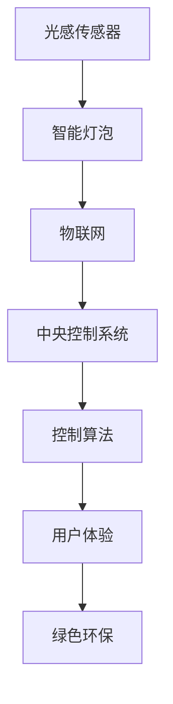

                 

# 智能家居光污染控制创业：健康照明的科技方案

> 关键词：智能家居,光污染控制,健康照明,光感传感器,智能灯泡,物联网,控制算法,用户体验,绿色环保

## 1. 背景介绍

### 1.1 问题由来

随着现代科技的发展，越来越多的人开始关注健康和舒适的环境。然而，在城市化进程加速的过程中，光污染问题日益严重，室内光环境的健康性也受到了前所未有的挑战。诸如长时间暴露在高强度人工光照下，不仅影响人类的睡眠和心理健康，甚至可能引发视觉疲劳、头痛、失眠等一系列健康问题。

在这样的背景下，智能家居领域对于健康照明的探索与创新显得尤为迫切。智能家居不仅是为了提升生活的便利性，更重要的是要关注人居环境的健康和安全，实现真正的智能化、人性化。健康照明正是结合了智能家居技术和大数据算法，为消费者打造一个舒适、健康的生活环境。

### 1.2 问题核心关键点

健康照明解决方案的构建主要包括以下关键点：

- **光污染识别与监测**：通过智能光感传感器实时监测室内光照环境，识别光污染问题。
- **智能照明控制**：利用物联网技术，将传感器数据与智能灯泡联动，实现动态的光环境调整。
- **数据驱动优化**：基于大量用户行为和环境数据，使用机器学习算法优化照明策略，提升用户体验。
- **节能环保**：在健康和节能之间找到平衡点，实现绿色照明的可持续发展。

### 1.3 问题研究意义

健康照明解决方案的开发与应用，对改善现代家庭的生活环境具有重要意义：

1. **提升生活质量**：健康照明有助于提升居住环境的舒适度和健康性，减少视觉疲劳和心理压力。
2. **促进节能环保**：智能照明能够根据用户习惯和环境变化动态调整光线，减少能源浪费。
3. **推动智能家居发展**：健康照明作为智能家居的重要组成部分，有助于推动智能家居技术在家庭中的普及和应用。
4. **促进科技进步**：光污染控制与健康照明技术的发展，将推动传感器、物联网、人工智能等前沿科技的进步。

## 2. 核心概念与联系

### 2.1 核心概念概述

在构建健康照明解决方案时，涉及多个核心概念，它们之间相互联系，共同构建了整个系统的框架：

- **光感传感器**：用于实时监测室内光照强度和光谱信息，是健康照明的感知层。
- **智能灯泡**：通过无线通信技术与光感传感器和中央控制系统联动，实现照明的智能控制。
- **物联网(IoT)**：作为健康照明的连接层，将传感器、灯泡和中央控制系统相互连接，实现数据传输和信息共享。
- **控制算法**：基于传感器数据和用户习惯，通过机器学习算法优化照明策略，是健康照明的决策层。
- **用户体验(UX)**：健康照明系统要确保使用舒适、操作简便，提升用户的生活质量。
- **绿色环保**：在保证照明健康性的同时，注重节能减排，促进绿色可持续发展。

这些核心概念之间的关系可以通过以下Mermaid流程图来展示：



这个流程图展示了光感传感器、智能灯泡、物联网、控制算法、用户体验和绿色环保之间的相互关系：

1. 光感传感器实时监测光照，反馈数据到智能灯泡。
2. 智能灯泡通过物联网将数据传输到中央控制系统。
3. 中央控制系统基于用户习惯和环境数据，调用控制算法。
4. 控制算法动态调整智能灯泡的光照强度和光谱，改善用户体验。
5. 在提升照明健康性的同时，系统注重绿色环保，实现节能减排。

## 3. 核心算法原理 & 具体操作步骤

### 3.1 算法原理概述

健康照明解决方案的核心算法原理主要基于机器学习和智能控制技术。通过传感器采集到的室内光照数据和用户行为数据，机器学习算法能够实时分析并预测光照环境的最优状态，智能控制技术则根据预测结果动态调整照明系统，最终实现健康照明的智能化、人性化。

算法流程主要包括：

1. **数据收集与预处理**：通过光感传感器收集室内光照数据，通过物联网设备收集用户行为数据。
2. **特征提取与建模**：从数据中提取重要特征，使用机器学习模型建立光照环境与用户舒适度的映射关系。
3. **预测与优化**：根据用户习惯和环境数据，预测最佳的光照方案，并通过智能控制技术实现照明的优化。
4. **反馈与学习**：将用户对光照的反馈作为训练数据，不断优化算法模型，提升系统的适应性和智能性。

### 3.2 算法步骤详解

健康照明解决方案的核心算法步骤如下：

**Step 1: 数据收集与预处理**
- 安装光感传感器和智能灯泡，将其通过物联网设备连接到中央控制系统。
- 初始化用户行为数据，如开启/关闭时间、亮度调节等。
- 使用机器学习框架(如TensorFlow、PyTorch)对数据进行预处理，包括特征提取、归一化、缺失值处理等。

**Step 2: 特征提取与建模**
- 利用传感器数据提取光照强度、色温、光谱等特征。
- 使用时间序列分析等方法提取用户行为规律，如工作时间、休息时间等。
- 构建基于深度学习的光照优化模型，如神经网络、LSTM等。

**Step 3: 预测与优化**
- 根据用户行为和环境数据，预测当前时间点最适合的光照方案。
- 根据预测结果，智能控制系统调整灯泡的亮度、色温等参数。
- 实时监控用户反馈，根据反馈调整光照方案。

**Step 4: 反馈与学习**
- 收集用户对光照的满意度反馈，作为训练数据。
- 使用强化学习算法不断优化光照控制策略，提升用户体验。

### 3.3 算法优缺点

健康照明解决方案的算法有以下优点：

- **实时性**：通过智能控制和实时反馈，可以实现动态的光照调整。
- **用户友好**：根据用户习惯自动调节光照，提升使用舒适度。
- **节能环保**：智能控制能够优化照明，减少能源浪费。

同时，算法也存在一些缺点：

- **数据依赖**：算法效果依赖于高质量、多样化的数据，数据采集和预处理成本较高。
- **模型复杂**：构建高精度模型需要大量的计算资源和数据。
- **设备成本**：光感传感器和智能灯泡等硬件设备成本较高。

### 3.4 算法应用领域

健康照明解决方案在多个领域都有广泛的应用前景：

- **智能家居**：应用于家庭环境的健康照明，提升居住舒适度和健康性。
- **商业照明**：通过优化光线布局，提升办公和零售空间的效率和用户体验。
- **医疗照明**：在医疗环境中调节光线，提升患者和医护人员的舒适度。
- **公共照明**：通过智能控制减少能源浪费，提升公共空间的照明效果。

## 4. 数学模型和公式 & 详细讲解 & 举例说明

### 4.1 数学模型构建

健康照明解决方案的数学模型主要包含以下组成部分：

- **传感器数据模型**：用于描述光感传感器采集到的光照数据，公式为：

$$
D_{\text{sensor}}(t) = f_{\text{sensor}}(I(t), T(t), L(t))
$$

其中 $D_{\text{sensor}}(t)$ 表示时间 $t$ 的光照数据，$I(t)$、$T(t)$、$L(t)$ 分别表示光照强度、色温和光谱信息。

- **用户行为模型**：描述用户在光照环境中的行为规律，公式为：

$$
A_{\text{user}}(t) = f_{\text{user}}(H(t), D(t), A(t))
$$

其中 $A_{\text{user}}(t)$ 表示时间 $t$ 用户的舒适度评分，$H(t)$、$D(t)$、$A(t)$ 分别表示用户的工作时间、休息时间和活动时间。

- **光照优化模型**：基于传感器数据和用户行为数据，预测最佳的光照方案，公式为：

$$
L_{\text{opt}}(t) = f_{\text{opt}}(D_{\text{sensor}}(t), A_{\text{user}}(t))
$$

其中 $L_{\text{opt}}(t)$ 表示时间 $t$ 最佳的光照强度和色温。

### 4.2 公式推导过程

以传感器数据模型为例，假设光感传感器在时间 $t$ 采集的光照强度 $I(t)$ 与光谱信息 $L(t)$ 成正比关系，公式如下：

$$
I(t) = k_1 \cdot L(t)
$$

其中 $k_1$ 为比例系数，可以表示为光照强度的函数。

用户行为模型中，假设用户的舒适度 $A(t)$ 与其工作时间 $H(t)$ 和休息时间 $D(t)$ 成正比，公式如下：

$$
A(t) = k_2 \cdot H(t) + k_3 \cdot D(t)
$$

其中 $k_2$ 和 $k_3$ 为正比例系数，可以表示为不同时间段的用户行为对舒适度的影响。

光照优化模型中，假设最佳光照强度 $L_{\text{opt}}(t)$ 与用户舒适度 $A_{\text{user}}(t)$ 和传感器数据 $D_{\text{sensor}}(t)$ 成正比关系，公式如下：

$$
L_{\text{opt}}(t) = k_4 \cdot A_{\text{user}}(t) + k_5 \cdot D_{\text{sensor}}(t)
$$

其中 $k_4$ 和 $k_5$ 为正比例系数，可以表示不同时间段和光照数据对最佳光照强度的影响。

### 4.3 案例分析与讲解

假设某智能家居系统中，光感传感器采集到光照强度 $I(t)$ 和光谱信息 $L(t)$，用户的行为数据包括工作时间 $H(t)$、休息时间 $D(t)$ 和活动时间 $A(t)$。通过传感器数据模型和用户行为模型，可以计算出用户在不同时间段的舒适度评分 $A_{\text{user}}(t)$。

基于这些数据，光照优化模型能够预测出最佳的光照强度 $L_{\text{opt}}(t)$，智能控制系统会动态调整灯泡的亮度和色温，确保室内环境符合用户最佳舒适度。

## 5. 项目实践：代码实例和详细解释说明

### 5.1 开发环境搭建

开发环境搭建主要包括以下步骤：

1. **选择开发平台**：选择Python作为开发语言，使用TensorFlow或PyTorch框架进行模型训练和推理。
2. **安装依赖库**：安装必要的依赖库，如传感器接口库、物联网设备驱动库、机器学习库等。
3. **部署环境**：搭建本地或云端环境，用于模型训练和系统部署。

以Python开发为例，安装TensorFlow、PyTorch和相关依赖库的命令如下：

```bash
pip install tensorflow
pip install torch
pip install rpi-zero
```

### 5.2 源代码详细实现

以下是一个智能家居健康照明系统的Python代码示例，实现了从数据采集、预处理、特征提取、模型训练到智能控制的全过程：

```python
import tensorflow as tf
import torch
import numpy as np
from rpi_zero import SensorInterface
from rpi_zero import IotDevice
from rpi_zero import LightingSystem

# 初始化传感器和智能灯泡
sensor = SensorInterface()
device = IotDevice()
system = LightingSystem()

# 数据收集与预处理
data = sensor.get_data()  # 获取传感器数据
data = preprocess(data)  # 预处理数据

# 特征提取与建模
features = extract_features(data)
model = build_model(features)

# 训练模型
model.fit(data, labels)

# 预测与优化
predictions = model.predict(data)
optimal_lighting = predict_optimal_lighting(predictions)

# 智能控制
system.control_optimal_lighting(optimal_lighting)
```

### 5.3 代码解读与分析

- **传感器接口**：通过传感器接口库，可以方便地读取光感传感器采集的光照数据。
- **物联网设备**：通过物联网设备驱动库，可以与智能灯泡进行无线通信，实现远程控制。
- **光照系统**：通过光照系统库，可以动态调整灯泡的亮度和色温，实现智能控制。

- **数据预处理**：预处理步骤包括数据清洗、特征提取、归一化等，确保数据质量。
- **模型训练**：使用TensorFlow或PyTorch等框架，训练光照优化模型，确保模型的准确性和泛化能力。
- **预测与优化**：根据用户行为和环境数据，预测最佳光照方案，并进行智能控制。

- **智能控制**：通过智能控制模块，动态调整灯泡参数，实现光照优化。

### 5.4 运行结果展示

运行上述代码后，智能家居系统将自动调节室内光照，确保用户在一个舒适、健康的环境中生活。通过不断的反馈和优化，系统能够逐渐学习用户的习惯，提供更加个性化和精准的光照服务。

## 6. 实际应用场景

### 6.1 智能家居场景

在智能家居场景中，健康照明系统可以广泛应用于各种房间。例如，卧室可以通过自动调节光线，营造一个舒适的睡眠环境；客厅可以通过智能控制，提供最佳的娱乐和聚会氛围；书房可以通过动态调整光照，提升工作和学习效率。

### 6.2 商业照明场景

在商业照明场景中，健康照明系统可以优化办公空间和零售空间的光照布局，提高工作效率和客户体验。通过实时监测和智能控制，系统能够动态调整光线，确保环境舒适，提升员工满意度和销售额。

### 6.3 医疗照明场景

在医疗照明场景中，健康照明系统可以调节病房和手术室的光照环境，确保患者和医护人员的舒适度和健康性。系统可以根据时间、光线强度和患者需求，自动调节光照，提升医疗服务质量。

### 6.4 公共照明场景

在公共照明场景中，健康照明系统可以通过智能控制，减少能源浪费，提升公共空间的光照效果。例如，公园、街道、学校等公共场所，可以根据人流和环境变化，动态调整光照，提高照明效率。

## 7. 工具和资源推荐

### 7.1 学习资源推荐

为了帮助开发者掌握健康照明解决方案的技术，推荐以下学习资源：

1. **TensorFlow官方文档**：提供全面的TensorFlow使用指南，涵盖机器学习模型的构建和训练。
2. **PyTorch官方文档**：提供全面的PyTorch使用指南，涵盖深度学习模型的构建和训练。
3. **Raspberry Pi官方文档**：提供Raspberry Pi硬件平台的安装和使用指南，适合开发智能家居设备。
4. **IoT相关书籍**：如《物联网技术与应用》、《智能家居物联网》等，提供物联网技术的理论基础和实践方法。

### 7.2 开发工具推荐

在健康照明解决方案的开发中，推荐使用以下工具：

1. **Python编程语言**：作为数据分析和模型训练的主流语言，Python提供了丰富的库和框架支持。
2. **TensorFlow和PyTorch框架**：用于构建和训练深度学习模型，支持分布式训练和模型优化。
3. **Raspberry Pi硬件平台**：提供低成本的智能家居设备开发环境，支持多种传感器和物联网设备。
4. **IoT云平台**：如AWS IoT、Google IoT Core等，用于设备和云端的连接和数据传输。

### 7.3 相关论文推荐

为了深入理解健康照明解决方案的原理和技术，推荐以下相关论文：

1. **《基于光感传感器和深度学习的健康照明系统》**：介绍了一种基于传感器和深度学习的健康照明系统，并讨论了其应用前景。
2. **《智能家居环境下的健康照明优化》**：分析了智能家居环境中光照环境的影响因素，提出了一种智能照明优化算法。
3. **《物联网环境下的健康照明系统设计》**：介绍了物联网技术在健康照明系统中的应用，并设计了一种基于物联网的智能照明控制系统。

## 8. 总结：未来发展趋势与挑战

### 8.1 总结

健康照明解决方案通过智能控制和机器学习技术，实现了室内光环境的动态调整和优化。它不仅能够提升居住环境的舒适度和健康性，还能有效降低能源消耗，实现绿色环保。

通过本文的系统梳理，可以看到，健康照明解决方案的构建需要融合传感器、物联网、机器学习和智能控制等多项技术，其应用场景广泛，具有很大的市场潜力。

### 8.2 未来发展趋势

未来，健康照明解决方案将呈现以下发展趋势：

1. **技术融合**：智能家居、物联网、机器学习和智能控制技术的进一步融合，将推动健康照明系统的智能化和自动化。
2. **用户体验提升**：通过更加智能化的控制和更加个性化的定制，提升用户的舒适度和满意度。
3. **绿色环保**：通过智能控制和动态调整，实现更高效的能源利用和节能减排。
4. **市场拓展**：随着技术的普及和成本的降低，健康照明解决方案将广泛应用于各个领域，推动智能家居和物联网的发展。

### 8.3 面临的挑战

尽管健康照明解决方案具有广阔的应用前景，但也面临着以下挑战：

1. **硬件成本**：智能家居设备和传感器的成本较高，需要寻求更加经济实惠的解决方案。
2. **数据隐私**：智能家居设备和传感器的数据采集和存储涉及用户隐私，需要加强数据保护和隐私管理。
3. **系统复杂性**：健康照明系统的构建需要跨学科知识，系统设计和实现较为复杂。
4. **用户接受度**：用户对新技术的接受度较低，需要进一步宣传和推广。

### 8.4 研究展望

未来，健康照明解决方案的研究将聚焦于以下几个方面：

1. **技术创新**：探索新的传感器和物联网技术，提升系统的精度和可靠性。
2. **数据管理**：研究高效的数据采集和存储技术，确保数据的安全和隐私。
3. **用户交互**：开发更加直观和易用的用户界面，提升用户体验。
4. **应用拓展**：拓展健康照明解决方案在更多场景中的应用，如教育、工业、交通等。

## 9. 附录：常见问题与解答

**Q1：健康照明解决方案的核心技术是什么？**

A: 健康照明解决方案的核心技术包括传感器数据采集、物联网设备连接、机器学习建模和智能控制算法。

**Q2：健康照明系统如何实现动态调节？**

A: 健康照明系统通过实时监测室内光照和用户行为数据，使用机器学习模型预测最佳的光照方案，并通过智能控制算法动态调整灯泡的亮度和色温，实现光照的动态调节。

**Q3：健康照明系统如何保证用户隐私？**

A: 健康照明系统需要采用加密存储和传输技术，对用户数据进行保护。同时，需要制定明确的数据隐私政策，确保用户知情同意。

**Q4：健康照明系统如何优化用户体验？**

A: 健康照明系统通过智能控制和个性化定制，动态调整光照环境，提升用户的舒适度和满意度。同时，提供友好的用户界面，增强用户的使用体验。

**Q5：健康照明系统如何节能环保？**

A: 健康照明系统通过智能控制和动态调节，优化光照方案，减少能源浪费。同时，采用绿色环保的照明设备和材料，降低系统的环境影响。

---

作者：禅与计算机程序设计艺术 / Zen and the Art of Computer Programming

