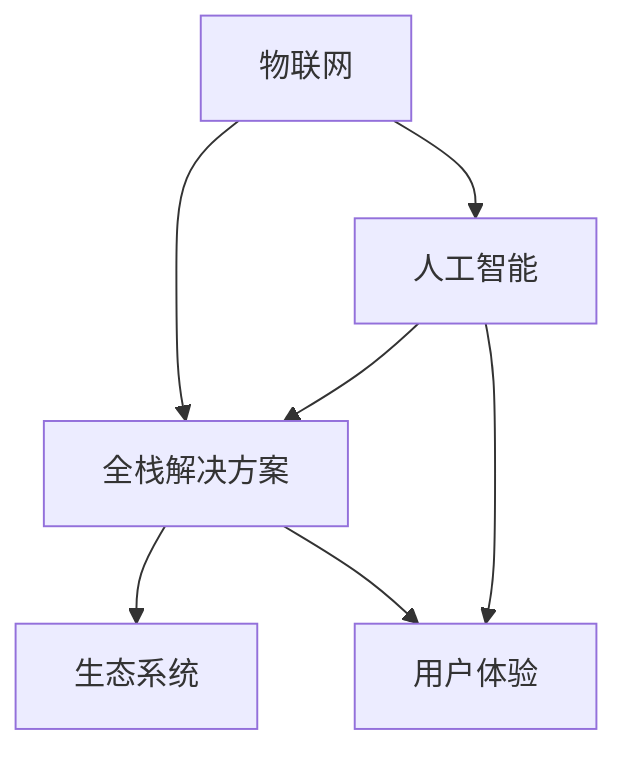

                 

# 智能家居创业：打造未来生活方式

## 1. 背景介绍

随着人工智能技术的迅速发展，智能家居行业正经历着前所未有的变革。传统的家居设备逐渐被智能化、自动化、互联化的智能设备所取代，用户的家庭生活正逐渐变得更加便捷、舒适和智慧。然而，智能家居创业并非易事，需要深厚的技术储备、前瞻的商业模式和强大的市场推动力。本文将全面分析智能家居创业的关键要素，帮助有意创业者全方位了解智能家居的商机与挑战。

### 1.1 智能家居现状与趋势

智能家居作为新兴的智能产业，正在逐步改变人们的生活方式。智能照明、智能安防、智能家电、智能温控、智能健康监测等技术，极大地提升了人们的生活品质和家庭安全。当前，智能家居正朝着个性化、全面化、场景化的方向发展，并呈现出以下趋势：

- **智能化普及率提升**：智能家居设备正在迅速普及，智能音箱、智能照明、智能门锁等产品已经成为普通家庭标配。
- **全屋互联**：家居设备之间的互联互通，提升了家庭智能化的整体效率。
- **语音控制**：语音识别和自然语言处理技术的进步，让语音控制成为未来智能家居的重要交互方式。
- **生态系统多样化**：各大厂商纷纷建立自己的智能生态系统，如苹果的HomeKit、谷歌的Google Assistant等。
- **隐私与安全**：智能家居数据隐私和设备安全问题成为关注焦点，用户隐私保护和数据安全成为企业必须重视的问题。

### 1.2 创业机会与挑战

智能家居市场拥有巨大的潜力和商业机会，但也面临着技术壁垒、用户教育、市场竞争等挑战。这些挑战要求创业者具备较强的技术实力、市场洞察力和商业策划能力。创业者可以通过以下方式抓住商机：

- **技术创新**：开发创新的智能家居产品，如智能情绪监测设备、智能健康管理系统等。
- **用户体验优化**：注重用户体验，提高产品易用性和互动性。
- **市场细分**：聚焦细分市场，如高端别墅市场、养老社区、教育机构等。
- **生态合作**：与其他厂商建立合作关系，打造一站式智能家居解决方案。
- **服务延伸**：提供附加服务，如智能家居维护、设备升级等增值服务。

## 2. 核心概念与联系

### 2.1 核心概念概述

要深刻理解智能家居创业，需掌握以下核心概念：

- **智能家居**：指的是通过传感器、嵌入式系统、网络和人工智能等技术，实现家居设备的自动化、智能化和互联化。
- **物联网(IoT)**：智能家居是物联网在家庭领域的应用，实现家居设备的互联互通。
- **人工智能**：智能家居的核心驱动力，用于自动化控制、数据分析、场景识别和语音识别等。
- **全栈解决方案**：提供包括设备、软件、服务在内的整体解决方案，确保系统稳定、高效、安全。
- **生态系统**：智能家居厂商建立自己的生态系统，如苹果的HomeKit、谷歌的Google Assistant等。
- **用户体验**：智能家居产品的易用性、互动性和可访问性，是吸引用户的重要因素。

### 2.2 核心概念联系

这些概念之间相互依存、相互促进，共同构建了智能家居生态系统。物联网为智能家居设备互联提供了基础，人工智能技术为其智能化提供了动力，全栈解决方案确保了系统的可靠性，生态系统为设备互联和互通提供了标准和平台，用户体验则直接影响产品的市场接受度。

以下是一个简化的Mermaid流程图，展示了这些概念之间的联系：



## 3. 核心算法原理 & 具体操作步骤

### 3.1 算法原理概述

智能家居创业的核心在于构建高效、智能、安全的家庭自动化系统。在这一过程中，算法原理是关键。核心算法包括物联网通信协议、设备感知与控制、用户行为预测与推荐、数据分析与处理等。

- **物联网通信协议**：如MQTT、Zigbee等，用于设备之间的数据交换。
- **设备感知与控制**：通过传感器、摄像头等设备，实现对环境的实时感知和设备控制。
- **用户行为预测与推荐**：使用机器学习模型，根据用户历史行为数据预测用户需求，推荐合适的家居场景。
- **数据分析与处理**：对收集到的数据进行分析和处理，优化设备性能和用户体验。

### 3.2 算法步骤详解

智能家居创业涉及的算法步骤包括需求分析、系统设计、算法实现、系统测试和部署维护等环节。

#### 3.2.1 需求分析

需求分析是智能家居创业的第一步，需考虑以下几个方面：

- **用户需求**：了解目标用户的痛点和需求，如自动化控制、节能环保、便捷生活等。
- **场景应用**：分析智能家居在不同场景下的应用，如家庭安全、老人照护、儿童成长等。
- **技术可行性**：评估技术实现的可行性，选择合适的技术栈和框架。

#### 3.2.2 系统设计

系统设计需综合考虑技术实现、用户需求和商业化需求。设计过程中需关注以下几个方面：

- **架构设计**：选择合适的架构模式，如微服务架构、事件驱动架构等。
- **功能模块**：确定系统的功能模块，如智能照明、智能安防、智能温控等。
- **数据处理**：设计数据存储和处理流程，确保数据安全和高效。
- **接口设计**：设计系统接口，包括API、消息队列、事件触发机制等。

#### 3.2.3 算法实现

算法实现阶段需选择适当的技术框架和算法模型。主要包括以下步骤：

- **框架选择**：选择合适的开发框架，如Spring Boot、Django等。
- **算法模型**：根据需求选择适当的算法模型，如神经网络、决策树、支持向量机等。
- **数据预处理**：对数据进行预处理，如特征提取、数据清洗、归一化等。
- **模型训练**：使用训练数据对模型进行训练，调整超参数，优化模型性能。
- **模型评估**：使用测试数据对模型进行评估，确保模型的泛化能力。

#### 3.2.4 系统测试

系统测试是确保系统质量和可靠性的关键环节，需进行以下测试：

- **单元测试**：对系统各模块进行单元测试，确保模块功能正确。
- **集成测试**：对系统各模块进行集成测试，确保模块间协同工作。
- **系统测试**：对系统进行全面测试，确保系统整体功能正常。
- **压力测试**：对系统进行压力测试，确保系统在高负载下稳定运行。
- **安全测试**：对系统进行安全测试，确保系统数据和隐私安全。

#### 3.2.5 部署维护

系统部署维护是智能家居创业的后期工作，需关注以下几个方面：

- **系统部署**：选择合适的云平台，进行系统部署。
- **监控管理**：对系统进行实时监控，及时发现和解决系统问题。
- **数据备份**：定期备份系统数据，确保数据安全。
- **用户支持**：提供用户支持和帮助，解决用户在使用过程中遇到的问题。
- **系统升级**：定期对系统进行升级，提升系统性能和功能。

### 3.3 算法优缺点

智能家居创业的核心算法具有以下优点：

- **高效率**：自动化控制和智能化管理，提高了家庭管理的效率。
- **高安全性**：数据加密和安全认证技术，保障了用户数据安全。
- **高可靠性**：系统设计和测试，确保了系统的高可靠性。
- **高灵活性**：模块化设计，方便后续功能扩展和升级。

同时，也存在以下缺点：

- **技术门槛高**：需要掌握多种技术，包括物联网、人工智能、云计算等。
- **用户教育成本高**：用户需要花费时间学习如何使用智能家居设备。
- **硬件设备成本高**：高端智能家居设备价格较高，普通家庭难以承受。
- **数据隐私问题**：智能家居设备收集大量用户数据，数据隐私和安全问题需高度重视。
- **市场竞争激烈**：智能家居市场竞争激烈，需有差异化策略才能脱颖而出。

### 3.4 算法应用领域

智能家居创业的核心算法在多个领域得到了广泛应用，包括但不限于：

- **智能照明**：通过智能照明系统，实现房间亮度、颜色、场景的自动化控制。
- **智能安防**：通过智能摄像头、门锁、报警系统等，实现家庭安全监控和报警。
- **智能家电**：通过智能冰箱、洗衣机、空调等家电，实现设备自动化控制和节能环保。
- **智能温控**：通过智能温控系统，实现房间温度的自动化控制和节能环保。
- **智能健康监测**：通过智能手环、智能体脂秤等设备，实现健康数据的监测和分析。
- **智能家居场景**：通过场景识别和推荐技术，实现家庭场景的智能切换和自动化管理。

## 4. 数学模型和公式 & 详细讲解 & 举例说明

### 4.1 数学模型构建

智能家居创业涉及的数学模型包括数据分析模型、用户行为预测模型和场景识别模型等。这些模型通常使用机器学习和深度学习技术构建。

#### 4.1.1 数据分析模型

数据分析模型用于对智能家居系统收集的数据进行分析，识别数据中的模式和趋势。常用的数学模型包括统计分析模型和机器学习模型。

- **统计分析模型**：如均值、方差、标准差等，用于描述数据的分布特征。
- **机器学习模型**：如线性回归、决策树、随机森林等，用于对数据进行分类和预测。

#### 4.1.2 用户行为预测模型

用户行为预测模型用于分析用户的历史行为数据，预测用户未来的需求和行为。常用的数学模型包括时间序列分析和神经网络模型。

- **时间序列分析**：如ARIMA模型，用于预测时间序列数据的变化趋势。
- **神经网络模型**：如RNN、LSTM等，用于对序列数据进行预测和分类。

#### 4.1.3 场景识别模型

场景识别模型用于识别用户的行为场景，实现场景的智能切换和自动化管理。常用的数学模型包括支持向量机、深度学习模型等。

- **支持向量机**：用于对场景进行分类和识别。
- **深度学习模型**：如卷积神经网络、循环神经网络等，用于识别复杂的场景特征。

### 4.2 公式推导过程

以下以智能照明系统的控制模型为例，推导其数学公式。

假设智能照明系统有n个照明设备，每个设备有2个状态（开/关），智能家居系统需要根据用户的行为数据，预测出最佳的控制方案。设用户行为向量为 $x=[x_1,x_2,...,x_m]$，设备状态向量为 $y=[y_1,y_2,...,y_n]$，其中 $x_i$ 表示用户行为是否发生，$y_i$ 表示设备状态是否变化。

智能照明系统的控制目标为最小化控制成本，即最小化 $C(x,y)$，其中 $C$ 为控制成本函数。目标函数可表示为：

$$
\min_{x,y} C(x,y)
$$

在求解过程中，可以使用动态规划、线性规划等方法。例如，使用线性规划求解最小控制成本：

$$
\begin{aligned}
\min_{x,y} & \quad c^T y \\
s.t. & \quad Ax \leq b \\
& \quad y \geq 0
\end{aligned}
$$

其中 $A$ 为控制约束矩阵，$b$ 为控制约束向量，$c$ 为控制成本向量。

### 4.3 案例分析与讲解

#### 4.3.1 智能照明系统

智能照明系统通过传感器和控制器实现房间照明的自动化控制。具体实现过程如下：

1. **传感器数据采集**：采集房间光照强度、人员进出信息等数据。
2. **数据分析与处理**：对传感器数据进行分析，识别光照强度变化趋势。
3. **场景识别**：根据光照强度和人员进出信息，识别当前场景，如起床、午休、睡眠等。
4. **控制方案生成**：根据场景识别结果，生成最佳的控制方案，如调整灯光亮度和颜色。
5. **设备控制**：通过控制器对照明设备进行控制，实现自动化照明管理。

#### 4.3.2 智能安防系统

智能安防系统通过摄像头、门锁、报警器等设备，实现家庭安全监控和报警。具体实现过程如下：

1. **摄像头数据采集**：采集摄像头拍摄的实时视频流。
2. **行为识别**：通过图像处理和深度学习模型，识别视频中的人脸和行为。
3. **报警处理**：根据行为识别结果，判断是否需要报警，发出报警信号。
4. **紧急联系人通知**：在发生紧急情况时，自动通知紧急联系人，实现远程监控。
5. **日志记录**：记录所有报警和监控数据，方便事后分析。

## 5. 项目实践：代码实例和详细解释说明

### 5.1 开发环境搭建

智能家居创业的开发环境搭建需考虑以下几个方面：

1. **操作系统选择**：建议选择Linux或macOS操作系统，以便进行编程和开发。
2. **开发工具安装**：安装开发工具如Visual Studio Code、Eclipse、PyCharm等。
3. **云平台选择**：选择适合的云平台，如AWS、阿里云、腾讯云等。
4. **开发环境配置**：配置开发环境，包括Python、Java、Git等。
5. **数据处理工具**：安装数据处理工具如Hadoop、Spark、SQL等。

### 5.2 源代码详细实现

以下是智能照明系统的Python代码实现，使用TensorFlow框架进行数据分析和控制。

```python
import tensorflow as tf
import numpy as np

# 传感器数据采集
def sensor_data(sample_rate, duration):
    # 模拟传感器数据采集
    return np.random.randn(duration) * sample_rate

# 数据分析与处理
def data_analysis(data):
    # 使用统计分析模型
    mean = np.mean(data)
    std = np.std(data)
    return mean, std

# 场景识别
def scene_recognition(data):
    # 使用深度学习模型
    model = tf.keras.Sequential([
        tf.keras.layers.Dense(64, activation='relu', input_shape=(1,)),
        tf.keras.layers.Dense(1, activation='sigmoid')
    ])
    model.compile(optimizer='adam', loss='binary_crossentropy')
    model.fit(data, labels)
    prediction = model.predict(data)
    return prediction

# 控制方案生成
def control_plan(recognition_result):
    # 根据场景识别结果生成控制方案
    if recognition_result > 0.5:
        control = 'open'
    else:
        control = 'close'
    return control

# 设备控制
def control_device(control):
    # 控制照明设备
    if control == 'open':
        light = True
    else:
        light = False
    return light

# 主函数
def main():
    # 数据采集
    data = sensor_data(sample_rate=0.1, duration=1000)
    
    # 数据分析与处理
    mean, std = data_analysis(data)
    
    # 场景识别
    recognition_result = scene_recognition(data)
    
    # 控制方案生成
    control = control_plan(recognition_result)
    
    # 设备控制
    light = control_device(control)
    
    print(f'照明设备状态：{light}')

if __name__ == '__main__':
    main()
```

### 5.3 代码解读与分析

#### 5.3.1 传感器数据采集

传感器数据采集函数 `sensor_data` 模拟了传感器数据采集过程。通过随机生成传感器的数据，模拟实际应用中的光照强度变化。

#### 5.3.2 数据分析与处理

数据分析与处理函数 `data_analysis` 使用了统计分析模型，计算数据的均值和标准差，用于分析光照强度的变化趋势。

#### 5.3.3 场景识别

场景识别函数 `scene_recognition` 使用了深度学习模型，通过卷积神经网络对传感器数据进行分类，识别当前场景。

#### 5.3.4 控制方案生成

控制方案生成函数 `control_plan` 根据场景识别结果，生成最佳的控制方案。

#### 5.3.5 设备控制

设备控制函数 `control_device` 根据控制方案，控制照明设备的状态。

## 6. 实际应用场景

### 6.1 智能照明

智能照明系统可以为用户提供便捷的照明控制，通过智能传感器和控制器实现房间亮度的自动化控制。

- **场景识别**：通过传感器和摄像头，识别房间内的光照强度和人员活动。
- **照明控制**：根据场景识别结果，自动调节灯光亮度和颜色。
- **场景记忆**：记录用户的常用场景，如起床、午休、睡眠等，自动切换到对应场景。

### 6.2 智能安防

智能安防系统通过摄像头、门锁、报警器等设备，实现家庭安全监控和报警。

- **行为监控**：通过摄像头和传感器，实时监控房间内的人员活动。
- **异常检测**：检测异常行为，如陌生人进入、物品移动等。
- **报警处理**：在检测到异常行为时，自动触发报警，通知用户或联系紧急联系人。
- **历史分析**：记录所有报警和监控数据，生成报警报告，方便事后分析。

### 6.3 智能温控

智能温控系统通过智能温控器和传感器，实现房间温度的自动化控制。

- **温度采集**：通过传感器实时采集房间内的温度数据。
- **温控策略**：根据温度数据和用户行为，生成最佳温控策略。
- **温控执行**：通过温控器自动调节房间温度，实现节能环保。
- **用户反馈**：记录用户对温度的反馈，调整温控策略，提升用户体验。

### 6.4 未来应用展望

未来智能家居市场将呈现以下几个趋势：

- **更智能化**：通过更先进的传感器和算法，实现更高的自动化和智能化。
- **更个性化**：根据用户的行为数据，提供个性化的家居控制方案。
- **更互联化**：实现设备之间的互联互通，打造智能家居生态系统。
- **更安全化**：通过数据加密和安全认证技术，保障用户数据的安全。
- **更便捷化**：通过语音控制、手势识别等技术，实现更便捷的家居控制。
- **更环保化**：通过节能技术，实现更环保的家居管理。

## 7. 工具和资源推荐

### 7.1 学习资源推荐

为了帮助创业者系统掌握智能家居的技术和商业模式，这里推荐一些优质的学习资源：

1. **《智能家居技术与应用》书籍**：系统介绍了智能家居技术的原理和应用。
2. **《智能家居创业指南》课程**：涵盖智能家居创业的各个方面，包括技术、市场、融资等。
3. **《物联网与智能家居》课程**：介绍物联网和智能家居的基础知识和最新技术。
4. **智能家居开源项目**：如OpenHAB、Home Assistant等，可以学习和参考。
5. **智能家居行业报告**：如Gartner、IDC等，了解行业发展趋势和市场需求。

### 7.2 开发工具推荐

智能家居创业的开发工具众多，这里推荐几款常用的工具：

1. **Visual Studio Code**：轻量级的代码编辑器，支持智能提示、代码高亮等功能。
2. **PyCharm**：Python开发工具，支持TensorFlow、PyTorch等深度学习框架。
3. **Eclipse**：Java开发工具，支持Java、Kotlin等语言。
4. **Git**：版本控制系统，支持分布式协作开发。
5. **Docker**：容器化技术，方便系统部署和扩展。
6. **AWS**：云平台，提供各种云服务和解决方案。

### 7.3 相关论文推荐

智能家居创业涉及的技术和算法领域众多，以下是几篇奠基性的相关论文，推荐阅读：

1. **《智能家居系统的设计与实现》**：介绍了智能家居系统的设计与实现。
2. **《基于物联网的智能家居系统》**：介绍物联网在智能家居中的应用。
3. **《深度学习在智能家居中的应用》**：介绍了深度学习在智能家居中的各种应用。
4. **《智能家居隐私保护与安全技术》**：介绍智能家居隐私保护和安全的最新技术。
5. **《智能家居的机器学习算法》**：介绍机器学习在智能家居中的应用。

## 8. 总结：未来发展趋势与挑战

### 8.1 研究成果总结

智能家居创业涉及的技术和算法复杂多样，本文系统介绍了核心算法原理和具体操作步骤，并提供了详细代码实例和分析。通过对智能家居创业的全面分析，帮助创业者了解智能家居市场的商机与挑战。

### 8.2 未来发展趋势

智能家居市场将呈现以下几个趋势：

1. **更智能化**：通过更先进的传感器和算法，实现更高的自动化和智能化。
2. **更个性化**：根据用户的行为数据，提供个性化的家居控制方案。
3. **更互联化**：实现设备之间的互联互通，打造智能家居生态系统。
4. **更安全化**：通过数据加密和安全认证技术，保障用户数据的安全。
5. **更便捷化**：通过语音控制、手势识别等技术，实现更便捷的家居控制。
6. **更环保化**：通过节能技术，实现更环保的家居管理。

### 8.3 面临的挑战

智能家居创业面临的挑战主要包括：

1. **技术壁垒高**：需要掌握多种技术，如物联网、人工智能、深度学习等。
2. **用户教育成本高**：用户需要花费时间学习如何使用智能家居设备。
3. **硬件设备成本高**：高端智能家居设备价格较高，普通家庭难以承受。
4. **数据隐私问题**：智能家居设备收集大量用户数据，数据隐私和安全问题需高度重视。
5. **市场竞争激烈**：智能家居市场竞争激烈，需有差异化策略才能脱颖而出。

### 8.4 研究展望

智能家居创业的未来研究可以集中在以下几个方向：

1. **低成本智能家居**：开发低成本的智能家居设备，普及智能家居市场。
2. **跨平台兼容性**：开发跨平台兼容性强的智能家居系统，实现设备之间的互通。
3. **数据隐私保护**：加强数据隐私保护技术，保障用户数据安全。
4. **用户体验优化**：提高智能家居设备的易用性和互动性。
5. **生态系统合作**：与其他厂商建立合作关系，打造智能家居生态系统。
6. **服务延伸**：提供附加服务，如智能家居维护、设备升级等增值服务。

智能家居创业是未来家居行业的重要趋势，需要广大创业者共同努力，推动智能家居技术的普及和应用。通过不断的技术创新和商业探索，智能家居市场必将迎来更广阔的发展前景。

---

作者：禅与计算机程序设计艺术 / Zen and the Art of Computer Programming

