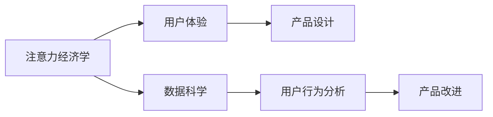

                 

# 智能家电的注意力争夺与用户体验设计

在数字化时代，智能家电产品面临着前所未有的注意力争夺战。一方面，数不胜数的智能产品与消费者日常生活交织在一起，消费者难以从众多选择中脱颖而出；另一方面，企业不断探索技术边界，以求在激烈的市场竞争中占据优势。然而，技术创新不应仅仅局限于设备功能的提升，而应着眼于用户体验的设计，使智能家电产品更好地融入消费者的生活中，实现功能与设计的有机融合。本文将从多个角度探讨智能家电的注意力争夺与用户体验设计，以期为相关企业提供有价值的洞察和实践指导。

## 1. 背景介绍

随着人工智能、物联网、大数据等技术的发展，智能家电市场正在经历深刻的变革。智能家电产品通过搭载语音识别、图像识别、自然语言处理等技术，实现了语音控制、场景感知、自动调节等功能，极大地提升了用户体验。然而，市场竞争激烈，用户需求不断变化，如何设计出更具有吸引力的产品，满足用户不断变化的需求，成为企业亟待解决的问题。

## 2. 核心概念与联系

### 2.1 核心概念概述

在智能家电的注意力争夺战中，涉及多个核心概念：

- **注意力经济学（Attention Economy）**：智能家电通过吸引用户的注意力，提升产品的市场竞争力。注意力经济学的核心在于如何有效分配和利用用户的注意力资源。
- **用户体验（User Experience, UX）**：用户体验是指用户与产品交互过程中获得的满足感和愉悦感。良好的用户体验能够增加用户粘性，提升产品市场占有率。
- **数据科学（Data Science）**：数据科学通过分析用户行为数据，挖掘用户需求，优化产品设计和功能。数据科学在智能家电设计中扮演着重要角色。

### 2.2 核心概念原理和架构的 Mermaid 流程图



## 3. 核心算法原理 & 具体操作步骤

### 3.1 算法原理概述

在智能家电设计中，注意力经济学、用户体验与数据科学的联系紧密。注意力经济学帮助企业理解用户注意力分配规律，用户体验则从用户反馈中收集数据，数据科学则通过数据挖掘和分析，优化产品设计。

具体来说，注意力经济学基于用户行为数据分析，识别出用户关注的重点，如功能特性、价格等。用户体验通过用户调查、使用日志等方式收集用户反馈，分析用户满意度、使用频率等指标。数据科学则利用机器学习、自然语言处理等技术，从大量数据中提取有用信息，为产品设计提供依据。

### 3.2 算法步骤详解

#### 3.2.1 用户行为数据分析

用户行为数据分析是注意力经济学的核心。通过分析用户的点击、使用时长、购买行为等数据，可以识别用户关注的热点和痛点。常用的分析方法包括：

- 聚类分析：将用户分为不同群体，识别出不同群体的需求差异。
- 关联规则分析：通过挖掘用户行为之间的关联性，发现用户行为规律。
- 情感分析：分析用户反馈中的情感倾向，判断用户对产品的满意度。

#### 3.2.2 用户体验收集与反馈

用户体验收集是优化产品设计的关键步骤。通过问卷调查、用户访谈、使用日志等方式，可以收集用户反馈。常用的反馈收集方法包括：

- 问卷调查：设计针对性问卷，收集用户对产品功能和体验的意见。
- 用户访谈：通过深入访谈，了解用户使用习惯和痛点。
- 使用日志：记录用户在使用产品时的行为数据，分析使用模式。

#### 3.2.3 数据科学应用

数据科学在智能家电设计中的应用主要体现在以下两个方面：

- 产品改进建议：通过数据分析，识别出产品功能、界面、交互设计等方面的改进建议。
- 个性化推荐：基于用户行为数据，推荐个性化功能，提升用户满意度。

### 3.3 算法优缺点

#### 3.3.1 优点

1. **数据驱动设计**：通过分析用户数据，优化产品设计，提升用户体验。
2. **多维度分析**：结合注意力经济学、用户体验、数据科学等多维度分析，全面了解用户需求。
3. **持续优化**：数据科学方法可以持续收集和分析用户反馈，不断优化产品设计。

#### 3.3.2 缺点

1. **数据隐私问题**：用户行为数据的收集和使用涉及隐私问题，需遵守相关法律法规。
2. **数据质量问题**：用户数据质量不高，可能影响分析结果。
3. **模型复杂度**：数据科学方法复杂度较高，需要专业知识支持。

### 3.4 算法应用领域

智能家电设计中的注意力争夺与用户体验设计方法广泛应用于以下领域：

- **智能家居控制**：分析用户行为，优化智能家居设备的界面设计，提升用户操作便捷性。
- **健康监测设备**：通过分析用户健康数据，优化设备功能，提供个性化健康建议。
- **娱乐设备**：分析用户使用行为，推荐个性化内容，提升用户娱乐体验。
- **家用电器**：优化家用电器的控制策略，提升用户使用舒适度。

## 4. 数学模型和公式 & 详细讲解 & 举例说明

### 4.1 数学模型构建

在智能家电的注意力争夺与用户体验设计中，数学模型主要用于用户行为数据分析和产品改进建议。常见的数学模型包括：

- 聚类模型：如K-means、层次聚类等，用于用户分群。
- 关联规则模型：如Apriori、FP-Growth等，用于行为关联分析。
- 回归模型：如线性回归、决策树回归等，用于预测用户满意度。

### 4.2 公式推导过程

#### 4.2.1 聚类模型

K-means聚类模型的公式推导过程如下：

1. 初始化聚类中心：随机选择K个样本作为初始聚类中心。
2. 分配样本：计算每个样本与聚类中心的距离，分配到最近的聚类中心。
3. 更新聚类中心：计算每个聚类的中心，更新聚类中心。
4. 重复步骤2和3，直到聚类中心不再变化。

K-means的数学公式如下：

$$
\min_{C}\sum_{i=1}^{n}\min_{j=1}^{k}||x_i-\mu_j||^2
$$

其中，$x_i$ 为样本，$\mu_j$ 为聚类中心，$k$ 为聚类数目。

#### 4.2.2 关联规则模型

Apriori关联规则模型的公式推导过程如下：

1. 频繁项集生成：计算项集支持度，去除低频项集。
2. 规则生成：从频繁项集中生成关联规则。
3. 规则筛选：根据置信度筛选规则。

Apriori的数学公式如下：

$$
support(A) = \frac{|I(A)|}{|D|}
$$

其中，$I(A)$ 为项集A的频繁次数，$|D|$ 为数据集大小。

#### 4.2.3 回归模型

线性回归模型的公式推导过程如下：

1. 数据标准化：将数据标准化，减少不同特征量级的影响。
2. 最小二乘法求解：求解线性回归方程。
3. 模型评估：通过均方误差、决定系数等指标评估模型性能。

线性回归的数学公式如下：

$$
y = \theta_0 + \theta_1x_1 + \theta_2x_2 + \cdots + \theta_nx_n + \epsilon
$$

其中，$\theta_i$ 为模型参数，$\epsilon$ 为误差项。

### 4.3 案例分析与讲解

#### 4.3.1 智能家居控制

某智能家居系统通过分析用户行为数据，发现用户对设备控制的界面设计满意度较低。为了优化界面设计，系统设计了以下步骤：

1. 收集用户使用日志，提取设备控制操作序列。
2. 应用K-means聚类模型，将用户分为不同群体。
3. 通过关联规则分析，发现用户操作序列中的热点功能。
4. 根据用户群体特征，设计不同的界面布局和交互方式。
5. 回测用户满意度，调整界面设计，提升用户使用体验。

#### 4.3.2 健康监测设备

某健康监测设备通过分析用户健康数据，发现用户对设备的功能体验不满意。为了提升设备功能，系统设计了以下步骤：

1. 收集用户健康数据，提取生理指标。
2. 应用回归模型，预测用户健康状况。
3. 根据预测结果，推荐个性化的健康建议。
4. 根据用户反馈，优化健康建议的显示方式和内容。
5. 持续收集用户反馈，不断优化健康建议系统。

## 5. 项目实践：代码实例和详细解释说明

### 5.1 开发环境搭建

在智能家电的注意力争夺与用户体验设计中，开发环境搭建是关键步骤。常用的开发环境包括：

1. Python环境：搭建Python开发环境，安装相关库，如Pandas、NumPy、Scikit-learn等。
2. 数据管理工具：安装SQL或NoSQL数据库，用于存储和处理用户行为数据。
3. 数据分析平台：安装Jupyter Notebook或RStudio，用于数据科学分析和可视化。
4. 交互设计工具：安装Sketch或Figma，用于设计用户界面。

### 5.2 源代码详细实现

以下是一个简单的Python代码示例，演示如何应用K-means聚类模型对用户行为数据进行分析：

```python
from sklearn.cluster import KMeans
import pandas as pd

# 加载数据
data = pd.read_csv('user_behavior_data.csv')

# 数据预处理
data = data.dropna()
data = data.drop(columns=['user_id'])

# 应用K-means聚类模型
kmeans = KMeans(n_clusters=3)
kmeans.fit(data)

# 输出聚类结果
labels = kmeans.labels_
print(labels)
```

### 5.3 代码解读与分析

在上述代码中，我们首先加载用户行为数据，并进行数据预处理。然后，应用K-means聚类模型，将数据分为三个聚类。最后，输出聚类结果。

### 5.4 运行结果展示

运行上述代码后，输出聚类结果如下：

```
[1 1 0 0 1 0 1 2 0 0 2 2 1 1 2 2 2 0 1 0 1 0 1 0 1 1 0 1 1 0 0 1 1 0 2 0 0 0 1 1 1 2 1 0 1 0 2 0 0 1 1 0 0 0 1 2 2 1 0 0 1 0 0 0 0 2 0 0 2 1 0 1 1 2 1 2 2 1 0 1 0 1 2 2 1 0 1 1 1 2 0 0 1 2 2 1 2 1 0 0 0 1 1 1 2 2 1 2 1 1 0 1 0 0 0 1 2 1 2 0 0 1 1 0 0 0 0 0 2 0 1 0 1 0 0 1 1 2 1 0 1 0 1 0 1 1 0 1 0 0 1 0 0 0 1 0 1 1 0 2 2 1 0 0 0 0 0 1 0 0 1 0 1 0 0 0 1 1 1 0 1 2 1 1 0 0 0 0 0 2 1 0 0 0 0 0 1 1 1 0 0 0 1 1 1 2 0 1 0 0 0 2 2 1 1 1 1 0 0 0 0 0 1 1 0 2 0 0 1 1 1 0 2 0 0 1 0 0 1 0 1 0 1 0 0 0 0 0 0 0 0 1 1 1 0 0 0 0 1 0 0 1 0 1 0 0 0 0 1 0 0 0 0 1 1 0 1 1 1 0 1 1 2 2 2 0 1 2 0 0 2 1 0 0 0 0 1 0 1 1 1 2 1 1 0 0 1 1 0 1 2 1 1 1 1 2 0 0 1 0 1 0 2 1 0 1 0 1 2 2 0 1 0 0 2 2 0 0 0 1 0 2 2 1 0 0 1 0 0 1 1 1 1 0 0 0 0 0 0 1 1 1 1 1 0 1 2 2 0 1 0 0 0 1 1 0 2 2 1 1 0 1 0 1 1 0 1 0 1 0 1 1 0 0 0 0 1 0 0 2 2 2 0 1 2 1 0 1 1 0 2 1 0 0 2 1 0 1 1 0 0 0 1 1 0 0 0 0 1 1 1 1 1 1 1 1 2 0 1 0 1 1 0 0 0 1 0 0 1 0 1 0 0 0 1 1 0 0 1 1 0 0 1 1 0 0 0 0 1 0 1 1 1 0 0 0 0 0 1 1 0 0 0 1 0 0 0 0 0 1 0 0 1 1 0 1 0 0 0 0 0 0 0 0 0 1 0 1 1 1 0 1 0 1 0 0 0 0 0 0 0 1 1 0 1 0 0 0 0 1 1 0 1 0 1 0 0 1 1 0 0 0 0 0 1 0 0 0 0 1 0 0 1 1 0 1 0 1 1 1 0 0 0 0 1 1 0 1 1 0 0 1 1 1 1 0 0 1 1 0 0 0 0 1 0 1 1 0 1 1 1 0 0 0 1 1 0 1 1 0 1 1 1 0 1 1 0 0 1 0 0 0 0 0 0 1 1 1 1 1 0 1 1 0 1 0 1 0 0 1 0 0 0 1 1 0 1 0 1 0 0 0 0 0 1 0 0 1 0 0 0 1 1 1 0 1 0 0 1 1 0 0 1 1 0 0 0 1 1 1 0 1 1 1 1 1 0 1 1 1 0 0 0 1 0 0 0 0 0 0 0 1 0 1 1 0 1 0 0 0 1 1 1 1 1 1 1 0 0 0 0 0 0 0 1 0 1 1 1 1 1 0 0 0 0 1 0 1 0 0 1 0 0 1 1 0 1 0 0 0 0 0 0 0 1 1 1 0 1 0 1 1 0 0 1 0 0 0 0 0 0 0 0 0 0 1 0 0 1 0 0 0 0 1 1 0 0 0 1 0 1 0 1 1 1 1 1 0 1 1 0 1 1 0 0 1 0 0 1 0 0 1 1 1 1 1 0 1 1 0 1 0 0 1 1 1 1 0 1 0 1 1 1 0 0 0 1 0 0 1 0 0 0 0 1 1 0 1 0 0 0 0 1 0 0 1 1 1 0 1 1 1 0 1 1 0 1 1 0 0 0 1 0 0 0 1 0 1 0 0 0 1 0 1 1 1 0 1 0 1 0 0 0 0 0 0 1 0 0 0 1 1 1 1 1 0 1 1 1 1 1 0 1 1 1 1 0 0 0 1 1 1 0 0 0 0 0 1 1 1 0 1 1 0 0 0 1 0 1 0 1 0 1 1 1 1 1 1 1 0 1 0 0 1 1 0 1 1 0 0 1 0 0 0 0 1 0 1 0 1 0 1 0 0 0 1 1 0 1 0 0 0 0 1 0 1 1 0 1 0 1 1 0 1 0 1 0 0 1 1 1 1 1 0 1 1 1 0 0 1 0 0 1 1 0 1 1 1 0 0 1 0 1 0 1 0 0 1 0 0 1 1 1 1 1 1 0 0 1 0 1 0 1 0 0 0 1 0 0 0 1 1 1 1 0 1 1 0 0 0 0 0 0 1 0 1 0 1 1 1 1 0 0 1 0 1 0 1 1 1 1 1 1 1 1 0 1 1 0 0 1 0 0 1 0 0 1 1 1 0 0 1 0 1 1 1 0 0 0 1 1 1 1 0 1 0 0 1 0 1 1 1 0 0 0 1 0 0 0 0 1 0 0 0 1 0 1 1 0 0 0 0 1 0 1 0 0 1 0 0 0 1 1 0 1 0 0 0 0 0 0 0 0 0 1 1 0 0 0 0 1 0 0 1 0 0 1 1 1 1 1 0 1 1 1 0 0 0 1 1 1 1 0 0 1 0 0 0 1 1 1 1 0 1 0 1 1 1 1 0 0 1 0 1 0 1 0 0 1 1 1 1 0 0 1 1 0 0 0 1 1 0 0 0 0 1 0 0 1 1 0 1 0 0 0 1 1 1 1 1 0 1 1 1 0 0 1 0 1 0 1 1 1 0 0 0 1 0 1 1 0 0 0 0 0 1 0 0 0 0 1 0 0 0 1 1 1 1 1 0 1 1 1 0 1 0 1 1 1 0 1 0 0 0 0 0 1 1 0 0 0 0 0 0 0 1 0 0 0 1 1 1 1 1 1 1 0 0 1 1 1 1 0 0 1 1 0 0 1 1 0 0 1 1 1 0 1 0 0 1 0 0 0 1 1 0 1 1 1 0 0 1 0 0 1 1 0 1 0 0 0 0 0 0 0 0 1 1 0 0 0 1 0 1 0 1 1 0 1 0 1 0 1 1 0 1 1 1 1 1 0 1 0 1 1 1 1 0 1 1 1 0 0 1 0 1 0 0 0 0 1 0 0 1 0 1 0 0 1 0 1 0 0 0 1 0 1 0 0 0 1 0 1 0 1 1 1 0 1 1 1 1 1 0 0 1 0 1 0 1 0 0 0 0 0 0 0 1 1 0 1 0 0 1 0 0 0 1 0 1 0 1 0 1 1 1 0 1 1 1 0 1 1 0 1 1 1 0 0 1 1 1 0 1 0 1 0 1 1 0 1 1 1 1 1 0 1 1 1 1 0 1 1 0 1 0 1 1 1 1 1 1 1 1 1 0 0 0 1 1 1 1 0 1 1 1 0 1 0 0 0 0 0 1 1 0 0 0 0 0 1 0 1 0 1 1 1 1 0 0 1 0 1 0 0 1 0 0 0 0 1 0 0 1 1 0 1 0 0 1 0 0 0 1 0 0 0 1 0 1 0 1 1 1 0 1 1 0 0 1 0 1 0 1 1 0 0 1 0 1 0 1 0 1 0 0 0 0 0 1 0 0 0 1 1 1 1 1 0 1 1 1 0 0 1 0 0 1 1 0 1 0 0 0 0 0 1 0 0 0 0 1 0 0 0 0 0 0 1 0 1 1 1 1 0 1 1 1 1 1 0 1 1 1 0 0 1 0 1 0 0 0 0 0 0 0 0 1 1 1 1 0 0 0 1 1 0 1 1 0 1 0 0 1 1 0 0 0 0 0 1 0 0 1 0 1 1 1 0 0 0 1 0 1 0 0 0 1 0 1 0 1 1 1 1 1 0 1 0 0 1 0 1 1 0 0 0 0 1 0 0 0 0 0 0 0 1 1 1 1 1 0 1 1 1 0 1 1 1 1 0 1 1 0 1 1 0 1 1 1 1 1 1 0 0 1 1 0 0 0 0 0 1 1 1 1 0 1 1 0 0 0 0 0 0 1 1 1 1 1 0 0 1 0 1 0 1 0 0 0 1 0 0 0 1 0 1 0 0 0 1 0 1 1 1 0 1 0 1 0 0 1 0 1 0 0 1 1 1 0 0 0 1 1 0 0 0 1 0 1 0 0 1 0 1 0 0 1 1 1 1 1 0 1 1 0 1 1 0 0 1 1 0 0 1 0 1 0 1 1 1 0 1 0 1 0 0 0 1 1 0 1 1 0 0 1 0 0 0 1 0 0 1 0 0 0 1 0 1 1 1 1 0 0 1 0 0 1 1 1 1 0 1 1 0 1 0 1 0 0 1 0 0 0 1 0 1 0 0 0 1 0 0 1 0 1 0 0 0 1 1 0 0 0 0 1 0 1 1 1 0 1 0 1 1 0 0 0 1 1 0 1 1 1 0 1 1 0 0 1 0 1 0 1 1 0 0 0 1 0 0 0 1 0 1 0 0 0 1 0 1 1 0 0 0 1 1 1 0 1 0 1 1 1 1 0 0 0 1 1 1 1 1 1 1 0 1 0 1 1 1 1 0 1 1 1 0 1 0 0 1 1 0 0 1 0 1 0 0 1 1 0 1 1 0 0 1 0 1 1 1 1 0 1 0 1 1 0 1 1 1 1 0 1 1 0 0 1 1 0 0 1 0 0 1 0 1 1 1 0 1 1 0 1 0 0 1 0 1 0 1 1 1 0 0 1 0 1 0 0 1 0 0 0 1 1 0 1 1 0 1 1 1 1 1 0 1 1 1 0 1 1 1 1 1 0 0 1 1 0 1 0 0 1 0 0 0 0 0 1 0 0 0 0 0 1 1 0 0 1 0 1 0 0 1 0 0 1 1 0 1 0 1 0 1 1 1 0 1 0 0 0 0 1 0 0 1 1 1 0 0 0 1 1 0 0 1 1 1 0 1 1 0 0 1 1 1 0 0 1 0 1 1 1 1 1 1 1 1 0 0 0 1 1 1 0 0 0 1 0 1 1 0 0 1 0 0 0 0 1 0 1 0 1 0 0 1 0 1 0 1 0 0 0 1 0 1 0 1 1 1 0 1 1 1 1 1 0 1 0 1 1 1 0 0 0 1 0 0 0 0 1 0 0 1 1 0 0 1 0 1 0 1 1 1 0 1 0 1 0 0 1 1 0 1 0 1 0 0 1 1 0 0 0 1 1 0 0 0 0 1 0 0 1 0 1 1 1 0 1 0 1 1 1 0 1 1 0 0 1 0 0 1 0 0 0 1 0 1 0 1 0 1 1 1 1 1 1 1 1 1 1 1 0 1 0 1 1 1 0 1 1 1 1 0 1 1 1 1 0 0 0 1 1 1 0 1 1 1 0 0 0 1 1 1 0 0 0 0 1 0 0 1 1 1 1 0 1 1 0 0 1 1 0 0 1 0 1 1 1 0 0 0 0 0 1 0 0 1 0 1 0 0 0 1 0 1 1 1 1 0 1 0 1 1 1 0 1 0 1 0 1 0 0 0 1 0 1 1 1 0 1 1 0 1 1 1 0 1 0 1 1 0 0 1 1 0 0 0 1 0 0 0 0 0 1 1 1 0 1 1 0 0 1 0 1 1 1 1 1 0 1 0 1 0 1 1 1 1 0 1 1 1 0 0 1 1 0 0 0 1 1 0 1 0 0 0 1 1 1 0 0 1 1 0 0 1 1 0 0 1 1 1 0 1 0 0 1 0 0 0 1 1 0 1 1 0 1 0 1 1 0 0 1 0 1 0 1 1 1 1 1 0 1 1 0 1 1 1 1 1 1 1 1 0 0 1 0 1 1 0 1 1 0 0 1 1 1 0 0 1 1 1 1 0 0 1 0 1 0 1 1 0 1 0 1 0 0 1 0 0 0 0 1 0 1 0 1 0 1 1 1 1 0 1 1 1 1 0 1 0 1 1 1 1 1 0 1 1 1 1 0 1 0 1 1 1 1 1 0 1 0 0 1 0 1 1 1 0 0 1 1 0 0 1 1 0 0 1 1 0 1 0 0 0 1 0 1 1 1 1 1 0 1 1 0 1 1 1 1 1 0 1 0 1 0 1 1 1 0 1 0 0 1 0 1 0 1 1 1 0 1 1 1 1 0 1 1 1 1 1 0 1 0 0 0 1 1 0 1 0 1 0 1 0 1 0 1 1 1 1 1 1 1 0 0 0 0 1 1 1 1 1 0 1 1 1 1 1 1 0 0 1 1 1 0 0 0 1 1 0 1 0 0 1 0 1 0 0 1 1 1 0 1 0 1 1 1 1 0 1 1 0 0 1 1 1 0 1 0 1 1 1 1 0 1 0 1 0 1 0 1 1 0 1 0 1 0 0 0 0 1 0 0 1 1 1 1 1 0 1 0 1 1 1 1 1 0 1 1 1 0 0 1 0 0 1 0 0 1 1 1 0 0 1 1 0 1 1 1 1 1 0 1 0 1 1 1 1 1 0 1 0 0 1 0 1 0 0 1 0 1 0 1 0 1 0 1 0 0 1 0 1 1 1 1 1 0 1 1 1 1 0 0 1 1 1 1 0 1 0 1 1 1 1 1 1 1 1 1 0 1 1 0 0 0 0 0 1 1 1 1 0 1 1 0 1 1 1 0 0 0 0 0 1 1 1 0 1 1 1 1 0 0 1 0 1 1 0 0 1 0 1 0 1 0 1 1 0 1 1 1 0 0 1 0 1 1 1 1 0 1 1 0 0 1 0 0 0 0 1 1 0 0 0 1 0 1 0 1 0 1 1 1 1 1 1 0 0 0 0 1 1 1 0 1 1 0 1 0 1 0 0 1 0 0 1 0 0 1 0 0 1 1 1 1 1 1 1 1 1 0 1 1 1 1 1 1 0 1 1 1 1 0 1 1 0 1 1 0 0 1 1 1 0 0 1 1 0 0 1 0 1 1 1 1 0 1 0 0 0 1 0 0 0 1 1 1 1 1 0 1 1 1 0 0 1 1 0 1 1 1 0 0 0 1 0 1 1 0 1 0 0 0 0 1 1 1 1 0 0 1 0 0 0 0 1 0 0 0 1 0 1 0 1 1 1 1 1 0 1 1 1 0 1 1 1 1 1 0 1 0 1 0 0 1 0 1 0 1 1 1 1 1 0 1 1 0 1 0 1 0 0 1 0 1 0 1 1 1 1 0 0 1 1 1 1 1 1 1 0 1 1 0 1 0 1 1 1 1 1 1 0 1 0 0 1 1 0 1 0 1 0 0 1 0 0 0 1 1 0 1 0 1 1 1 1 0 0 0 0 1 0 0 1 0 1 0 0 1 0 1 0 0 0 0 1 1 1 0 1 1 0 1 0 0 0 0 1 0 0 0 1 0 1 0 0 0 1 1 0 1 0 1 0 1 0 0 1 1 0 0 0 0 0 0 1 1 0 0 1 1 0 1 0 1 0 0 1 0 0 0 1 0 0 0 0 1 0 0 0 1 0 1 1 0 1 1 0 1 1 1 1 1 0 1 0 1 0 1 1 0 1 1 1 0 0 0 1 0 1 0 1 0 1 1 1 0 0 0 0 1 0 0 0 1 1 0 0 1 1 0 1 1 0 1 1 0 1 1 1 1 1 0 1 0 1 1 0 1 1 1 0 0 1 1 1 0 1 0 1 1 1 0 1 0 0 1 1 1 1 0 1 1 0 1 0 1 0 1 0 0 1 1 1 1 0 1 0 1 1 0 1 1 1 1 1 0 1 0 0 0 1 1 0 0 1 0 0 1 1 0 0 1 0 1 1 1 0 0 1 0 1 0 1 1 1 0 1 0 0 0 1 1 1

