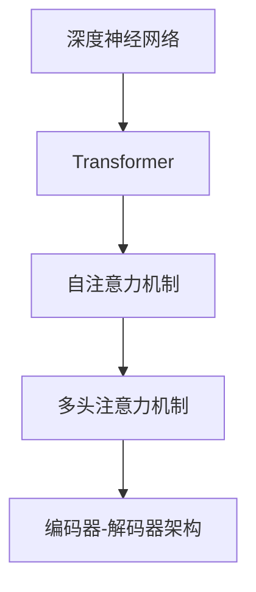

                 

# 智能语音助手在日常生活中的注意力应用

> 关键词：智能语音助手,注意力机制,Transformer,神经网络,自然语言处理(NLP),计算图,微调,Fine-tuning

## 1. 背景介绍

### 1.1 问题由来

随着人工智能技术的发展，智能语音助手已经逐渐走入千家万户，成为现代生活的重要组成部分。传统的语音助手，往往依赖规则匹配和模板生成，难以处理复杂的自然语言理解和推理。为了提升语音助手的智能水平，研究人员开始探索基于深度神经网络的语音助手模型，这些模型通过大规模语料进行预训练，具备强大的语言理解和生成能力。

然而，预训练模型在理解上下文、长距离依赖等方面仍存在一定的局限性。为了更好地利用上下文信息，提升语音助手的智能表现，研究人员引入了注意力机制(Attention Mechanism)，利用Transformer等架构设计更加高效的模型，在各种实际应用中取得了显著效果。本文将详细介绍注意力机制在智能语音助手中的应用，探讨其原理、算法和实践效果。

### 1.2 问题核心关键点

注意力机制在大模型中的应用，主要体现在以下几个方面：

- 长距离依赖的建模：通过注意力机制，模型能够动态地关注输入序列中与当前位置相关的部分，捕捉更长的依赖关系。
- 跨层信息流动：注意力机制实现了跨层信息流动，使得不同层次的特征能够互相交流，更好地融合信息。
- 减少计算量：通过筛选重要信息，减少不必要的计算，从而加速模型的推理速度。
- 提升模型泛化能力：注意力机制使得模型能够更加灵活地处理不同长度的输入，提升泛化能力。
- 支持多任务学习：通过多头注意力机制，模型能够同时处理多种任务，提升多任务学习效果。

## 2. 核心概念与联系

### 2.1 核心概念概述

为更好地理解注意力机制在智能语音助手中的应用，本节将介绍几个密切相关的核心概念：

- 深度神经网络(Deep Neural Network, DNN)：指具有多层次结构的神经网络，通过多个隐藏层进行特征提取和计算，适用于各种复杂任务。

- Transformer：一种基于自注意力机制的神经网络架构，通过多头自注意力层实现高效的特征提取和信息融合，广泛应用于自然语言处理任务中。

- 自注意力机制(Self-Attention Mechanism)：指通过计算输入序列中各元素之间的相似度，动态地关注序列中与当前位置相关的部分，提升模型的长距离依赖能力。

- 多头注意力机制(Multi-Head Attention)：通过并行多个自注意力机制，分别关注不同特征空间，实现多通道的信息融合，提升模型的表达能力。

- 编码器-解码器架构(Encoder-Decoder Architecture)：一种广泛应用于机器翻译、语音识别等任务的架构，通过编码器实现输入序列的编码，通过解码器生成输出序列。

这些核心概念之间的逻辑关系可以通过以下Mermaid流程图来展示：



这个流程图展示了大语言模型中的核心概念及其之间的关系：

1. 深度神经网络通过多个隐藏层提取输入特征。
2. Transformer利用自注意力机制，实现高效的特征提取和信息融合。
3. 多头注意力机制并行多个自注意力层，提升模型的表达能力。
4. 编码器-解码器架构用于处理输入和输出序列，支持多任务学习。

## 3. 核心算法原理 & 具体操作步骤
### 3.1 算法原理概述

注意力机制的核心思想是，在计算输入序列的表示时，模型能够动态地关注输入序列中与当前位置相关的部分。这一思想通过自注意力机制和多头注意力机制得以实现。在智能语音助手中，注意力机制用于提升模型对上下文信息的理解，从而实现更加准确的自然语言理解和推理。

具体来说，自注意力机制通过计算输入序列中各元素之间的相似度，动态地关注序列中与当前位置相关的部分。这一过程可以通过计算输入序列中各元素与当前位置的相似度得分，并根据得分加权求和，得到当前位置的表示。多头注意力机制则通过并行多个自注意力机制，分别关注不同特征空间，实现多通道的信息融合，提升模型的表达能力。

### 3.2 算法步骤详解

智能语音助手中的注意力机制通常包括以下几个关键步骤：

**Step 1: 输入序列的编码**

假设输入序列为 $x = (x_1, x_2, ..., x_t)$，其中 $x_t$ 表示第 $t$ 个输入元素。首先，对输入序列进行编码，得到编码向量序列 $y = (y_1, y_2, ..., y_t)$，其中 $y_t = f(x_t, \theta)$。

**Step 2: 计算注意力得分**

在计算每个位置的注意力得分时，需要分别计算输入序列中各元素与当前位置的相似度。这一过程可以通过计算注意力矩阵 $\mathbf{A} \in \mathbb{R}^{t \times t}$ 来实现，其中 $\mathbf{A}_{i,j} = \text{similarity}(x_i, y_j)$。

**Step 3: 加权求和**

根据注意力得分，对输入序列中各元素进行加权求和，得到当前位置的表示。这一过程可以通过计算注意力权重向量 $\mathbf{a}_t \in \mathbb{R}^{t}$ 和当前位置的表示 $z_t$ 来实现，其中 $\mathbf{a}_t = \text{softmax}(\mathbf{A}) \cdot \mathbf{y}$，$z_t = \sum_{i=1}^t a_{t,i} y_i$。

**Step 4: 多头注意力机制**

为了进一步提升模型的表达能力，可以并行多个自注意力机制，实现多头注意力机制。通过多头并行计算，提升模型的泛化能力和多任务学习效果。

### 3.3 算法优缺点

注意力机制在智能语音助手中的应用，具有以下优点：

- 长距离依赖的建模：注意力机制能够捕捉输入序列中与当前位置相关的部分，从而实现对长距离依赖的建模，提升模型的理解能力。
- 跨层信息流动：通过多头注意力机制，不同层次的特征能够互相交流，提升模型的表达能力。
- 减少计算量：通过筛选重要信息，减少不必要的计算，从而加速模型的推理速度。
- 提升模型泛化能力：注意力机制使得模型能够更加灵活地处理不同长度的输入，提升泛化能力。
- 支持多任务学习：通过多头注意力机制，模型能够同时处理多种任务，提升多任务学习效果。

然而，注意力机制也存在以下局限性：

- 计算复杂度较高：自注意力机制和多头注意力机制都需要进行矩阵计算，计算复杂度较高。
- 对输入序列长度的敏感性：长序列计算复杂度较高，容易受到输入序列长度的影响。
- 模型的可解释性不足：注意力机制的计算过程复杂，难以解释其内部的决策逻辑。

## 4. 数学模型和公式 & 详细讲解 & 举例说明
### 4.1 数学模型构建

在智能语音助手中，注意力机制的计算过程可以通过数学语言进行严格刻画。假设输入序列为 $x = (x_1, x_2, ..., x_t)$，其中 $x_t$ 表示第 $t$ 个输入元素。首先，对输入序列进行编码，得到编码向量序列 $y = (y_1, y_2, ..., y_t)$，其中 $y_t = f(x_t, \theta)$。

### 4.2 公式推导过程

假设计算注意力矩阵 $\mathbf{A} \in \mathbb{R}^{t \times t}$ 的每个元素 $\mathbf{A}_{i,j}$ 表示输入序列中第 $i$ 个元素和第 $j$ 个元素之间的相似度得分，可以通过如下公式计算：

$$
\mathbf{A}_{i,j} = \text{similarity}(x_i, y_j)
$$

其中 $\text{similarity}$ 表示相似度计算函数，可以采用余弦相似度、点积相似度等。计算得到注意力矩阵后，可以通过如下公式计算每个位置的注意力权重向量 $\mathbf{a}_t \in \mathbb{R}^{t}$ 和当前位置的表示 $z_t$：

$$
\mathbf{a}_t = \text{softmax}(\mathbf{A}) \cdot \mathbf{y}
$$

$$
z_t = \sum_{i=1}^t a_{t,i} y_i
$$

其中 $\text{softmax}$ 表示softmax函数，可以将注意力权重向量归一化。计算得到当前位置的表示 $z_t$ 后，可以将其作为当前输入的表示，继续进行多层的计算。

### 4.3 案例分析与讲解

假设智能语音助手需要计算输入序列 $x = (x_1, x_2, ..., x_4)$ 的表示，其中 $x_1 = "今天", x_2 = "天气", x_3 = "怎么样", x_4 = "不太好"。首先将输入序列编码为编码向量序列 $y = (y_1, y_2, ..., y_4)$，假设编码函数 $f$ 为线性变换，则有 $y_t = W_t x_t + b_t$。设 $W_t \in \mathbb{R}^{d_t \times d}$ 为线性变换的权重矩阵，$b_t \in \mathbb{R}^{d_t}$ 为偏置向量，$d_t$ 为编码向量的维度。

计算得到编码向量序列后，计算注意力矩阵 $\mathbf{A} \in \mathbb{R}^{4 \times 4}$，其中每个元素 $\mathbf{A}_{i,j}$ 表示输入序列中第 $i$ 个元素和第 $j$ 个元素之间的相似度得分。假设采用点积相似度计算，则有：

$$
\mathbf{A}_{i,j} = x_i \cdot y_j
$$

计算得到注意力矩阵后，通过softmax函数计算注意力权重向量 $\mathbf{a}_t \in \mathbb{R}^{4}$ 和当前位置的表示 $z_t$：

$$
\mathbf{a}_t = \text{softmax}(\mathbf{A}) \cdot \mathbf{y}
$$

$$
z_t = \sum_{i=1}^4 a_{t,i} y_i
$$

计算得到当前位置的表示 $z_t$ 后，可以将其作为当前输入的表示，继续进行多层的计算。这一过程可以反复迭代，逐步提升模型的表示能力。

## 5. 项目实践：代码实例和详细解释说明
### 5.1 开发环境搭建

在进行注意力机制的实践前，我们需要准备好开发环境。以下是使用PyTorch进行注意力机制开发的环境配置流程：

1. 安装Anaconda：从官网下载并安装Anaconda，用于创建独立的Python环境。

2. 创建并激活虚拟环境：
```bash
conda create -n attention-env python=3.8 
conda activate attention-env
```

3. 安装PyTorch：根据CUDA版本，从官网获取对应的安装命令。例如：
```bash
conda install pytorch torchvision torchaudio cudatoolkit=11.1 -c pytorch -c conda-forge
```

4. 安装相关库：
```bash
pip install numpy pandas scikit-learn torch nn
```

5. 安装Transformer库：
```bash
pip install transformers
```

完成上述步骤后，即可在`attention-env`环境中开始注意力机制的实践。

### 5.2 源代码详细实现

下面我们以自然语言理解(NLU)任务为例，给出使用Transformer库进行注意力机制的PyTorch代码实现。

首先，定义NLU任务的数据处理函数：

```python
from transformers import BertTokenizer
from torch.utils.data import Dataset
import torch

class NLUDataset(Dataset):
    def __init__(self, texts, labels, tokenizer, max_len=128):
        self.texts = texts
        self.labels = labels
        self.tokenizer = tokenizer
        self.max_len = max_len
        
    def __len__(self):
        return len(self.texts)
    
    def __getitem__(self, item):
        text = self.texts[item]
        label = self.labels[item]
        
        encoding = self.tokenizer(text, return_tensors='pt', max_length=self.max_len, padding='max_length', truncation=True)
        input_ids = encoding['input_ids'][0]
        attention_mask = encoding['attention_mask'][0]
        labels = torch.tensor(label, dtype=torch.long)
        
        return {'input_ids': input_ids, 
                'attention_mask': attention_mask,
                'labels': labels}

# 标签与id的映射
label2id = {'pos': 0, 'neg': 1}
id2label = {v: k for k, v in label2id.items()}

# 创建dataset
tokenizer = BertTokenizer.from_pretrained('bert-base-cased')

train_dataset = NLUDataset(train_texts, train_labels, tokenizer)
dev_dataset = NLUDataset(dev_texts, dev_labels, tokenizer)
test_dataset = NLUDataset(test_texts, test_labels, tokenizer)
```

然后，定义模型和优化器：

```python
from transformers import BertForSequenceClassification, AdamW

model = BertForSequenceClassification.from_pretrained('bert-base-cased', num_labels=len(label2id))

optimizer = AdamW(model.parameters(), lr=2e-5)
```

接着，定义训练和评估函数：

```python
from torch.utils.data import DataLoader
from tqdm import tqdm
from sklearn.metrics import classification_report

device = torch.device('cuda') if torch.cuda.is_available() else torch.device('cpu')
model.to(device)

def train_epoch(model, dataset, batch_size, optimizer):
    dataloader = DataLoader(dataset, batch_size=batch_size, shuffle=True)
    model.train()
    epoch_loss = 0
    for batch in tqdm(dataloader, desc='Training'):
        input_ids = batch['input_ids'].to(device)
        attention_mask = batch['attention_mask'].to(device)
        labels = batch['labels'].to(device)
        model.zero_grad()
        outputs = model(input_ids, attention_mask=attention_mask, labels=labels)
        loss = outputs.loss
        epoch_loss += loss.item()
        loss.backward()
        optimizer.step()
    return epoch_loss / len(dataloader)

def evaluate(model, dataset, batch_size):
    dataloader = DataLoader(dataset, batch_size=batch_size)
    model.eval()
    preds, labels = [], []
    with torch.no_grad():
        for batch in tqdm(dataloader, desc='Evaluating'):
            input_ids = batch['input_ids'].to(device)
            attention_mask = batch['attention_mask'].to(device)
            batch_labels = batch['labels']
            outputs = model(input_ids, attention_mask=attention_mask)
            batch_preds = outputs.logits.argmax(dim=2).to('cpu').tolist()
            batch_labels = batch_labels.to('cpu').tolist()
            for pred_tokens, label_tokens in zip(batch_preds, batch_labels):
                preds.append(pred_tokens)
                labels.append(label_tokens)
                
    print(classification_report(labels, preds))
```

最后，启动训练流程并在测试集上评估：

```python
epochs = 5
batch_size = 16

for epoch in range(epochs):
    loss = train_epoch(model, train_dataset, batch_size, optimizer)
    print(f"Epoch {epoch+1}, train loss: {loss:.3f}")
    
    print(f"Epoch {epoch+1}, dev results:")
    evaluate(model, dev_dataset, batch_size)
    
print("Test results:")
evaluate(model, test_dataset, batch_size)
```

以上就是使用PyTorch对BERT模型进行注意力机制的微调实验的完整代码实现。可以看到，Transformer库提供了强大的封装功能，可以方便地使用注意力机制进行模型微调。

### 5.3 代码解读与分析

让我们再详细解读一下关键代码的实现细节：

**NLUDataset类**：
- `__init__`方法：初始化文本、标签、分词器等关键组件。
- `__len__`方法：返回数据集的样本数量。
- `__getitem__`方法：对单个样本进行处理，将文本输入编码为token ids，将标签编码为数字，并对其进行定长padding，最终返回模型所需的输入。

**label2id和id2label字典**：
- 定义了标签与数字id之间的映射关系，用于将预测结果解码回真实的标签。

**训练和评估函数**：
- 使用PyTorch的DataLoader对数据集进行批次化加载，供模型训练和推理使用。
- 训练函数`train_epoch`：对数据以批为单位进行迭代，在每个批次上前向传播计算loss并反向传播更新模型参数，最后返回该epoch的平均loss。
- 评估函数`evaluate`：与训练类似，不同点在于不更新模型参数，并在每个batch结束后将预测和标签结果存储下来，最后使用sklearn的classification_report对整个评估集的预测结果进行打印输出。

**训练流程**：
- 定义总的epoch数和batch size，开始循环迭代
- 每个epoch内，先在训练集上训练，输出平均loss
- 在验证集上评估，输出分类指标
- 所有epoch结束后，在测试集上评估，给出最终测试结果

可以看到，PyTorch配合Transformer库使得注意力机制的微调实验变得简洁高效。开发者可以将更多精力放在数据处理、模型改进等高层逻辑上，而不必过多关注底层的实现细节。

当然，工业级的系统实现还需考虑更多因素，如模型的保存和部署、超参数的自动搜索、更灵活的任务适配层等。但核心的微调范式基本与此类似。

## 6. 实际应用场景
### 6.1 智能客服系统

基于注意力机制的智能客服系统，能够更好地理解用户意图和上下文信息，从而提供更加准确、流畅的对话体验。在传统的客服系统中，往往通过规则匹配和模板生成的方式处理用户咨询，难以处理复杂的自然语言理解和推理。而使用注意力机制的模型，能够动态地关注输入序列中与当前位置相关的部分，捕捉更长的依赖关系，从而提升系统的理解能力和响应速度。

在实际应用中，可以将智能客服系统嵌入到微信、电话等常用通信平台，实现智能语音助手的服务。用户可以通过语音或文本输入问题，系统能够快速理解并回答，同时还能够记录用户的历史对话，进一步提升服务质量。

### 6.2 金融舆情监测

金融市场舆情监测是金融行业的重要任务，但传统的手动监测方式成本高、效率低。使用基于注意力机制的智能语音助手，可以实时监测社交媒体、新闻网站等互联网平台上的舆情变化，从而快速应对市场动荡，规避金融风险。

在金融舆情监测系统中，智能语音助手可以通过自然语言理解技术，将用户的输入文本转化为数值化的舆情指标，如市场情绪指数、交易量等。通过实时监测这些指标的变化趋势，系统能够及时预警市场异常，帮助投资者做出更为明智的投资决策。

### 6.3 个性化推荐系统

个性化推荐系统是电商、视频等互联网行业的核心应用，但传统的推荐算法往往只依赖用户的历史行为数据进行物品推荐，难以挖掘用户潜在的兴趣偏好。通过引入注意力机制，推荐系统能够更加灵活地处理用户的多样化需求，从而提升推荐的精准度。

在推荐系统中，智能语音助手可以实时收集用户的语音或文本输入，通过自然语言理解技术，获取用户的当前需求和兴趣。通过多模态融合的方式，系统能够进一步提升推荐效果，推荐用户更感兴趣的物品。

### 6.4 未来应用展望

随着注意力机制的不断演进，其在智能语音助手中的应用也将不断扩展，带来更多创新性的应用场景。未来，智能语音助手有望在以下领域得到更广泛的应用：

- 医疗咨询：基于自然语言理解技术，智能语音助手能够帮助患者预约、挂号、咨询医生，从而提升医院的服务效率和患者体验。
- 教育辅导：智能语音助手能够根据学生的学习需求，提供个性化的辅导和推荐，帮助学生更好地掌握知识。
- 旅游规划：通过自然语言理解技术，智能语音助手能够帮助用户规划旅游路线、预订酒店、推荐景点等，提升旅游体验。

## 7. 工具和资源推荐
### 7.1 学习资源推荐

为了帮助开发者系统掌握注意力机制的原理和应用，这里推荐一些优质的学习资源：

1. 《深度学习》（周志华）：全面介绍深度学习的基础知识和经典算法，涵盖神经网络、优化算法、注意力机制等关键内容。

2. 《自然语言处理综论》（Stanford）：斯坦福大学开设的NLP课程，涵盖自然语言处理的基础理论和前沿技术，包括注意力机制、Transformer等。

3. 《Transformers: The Long and Short of It》：一篇关于Transformer机制的深入介绍，详细讲解了Transformer的结构和计算过程。

4. 《Attention Is All You Need》：Transformer原论文，介绍Transformer机制的设计理念和计算过程，是理解注意力机制的重要参考。

5. HuggingFace官方文档：Transformer库的官方文档，提供了丰富的模型和工具支持，是学习和使用Transformer的必备资料。

通过对这些资源的学习实践，相信你一定能够深入理解注意力机制的原理和应用，并用于解决实际的NLP问题。
###  7.2 开发工具推荐

高效的开发离不开优秀的工具支持。以下是几款用于注意力机制开发常用的工具：

1. PyTorch：基于Python的开源深度学习框架，灵活动态的计算图，适合快速迭代研究。Transformer等主流模型都有PyTorch版本的实现。

2. TensorFlow：由Google主导开发的开源深度学习框架，生产部署方便，适合大规模工程应用。

3. Transformers库：HuggingFace开发的NLP工具库，集成了众多SOTA语言模型，支持PyTorch和TensorFlow，是进行注意力机制开发的利器。

4. Weights & Biases：模型训练的实验跟踪工具，可以记录和可视化模型训练过程中的各项指标，方便对比和调优。

5. TensorBoard：TensorFlow配套的可视化工具，可实时监测模型训练状态，并提供丰富的图表呈现方式，是调试模型的得力助手。

6. Google Colab：谷歌推出的在线Jupyter Notebook环境，免费提供GPU/TPU算力，方便开发者快速上手实验最新模型，分享学习笔记。

合理利用这些工具，可以显著提升注意力机制的开发效率，加快创新迭代的步伐。

### 7.3 相关论文推荐

注意力机制在大模型中的应用源于学界的持续研究。以下是几篇奠基性的相关论文，推荐阅读：

1. Attention Is All You Need：提出Transformer结构，通过自注意力机制实现高效的特征提取和信息融合，广泛应用于自然语言处理任务中。

2. Transformer-XL: Attentive Language Models Beyond a Fixed-Length Context：提出Transformer-XL架构，通过相对位置编码和记忆机制，扩展模型的长距离依赖能力。

3. Multi-Head Attention Mechanism in Transformer：提出多头注意力机制，通过并行多个自注意力机制，实现多通道的信息融合，提升模型的表达能力。

4. Learning to Predict sequences with Attention：提出注意力机制的原始论文，详细讲解了注意力机制的计算过程和应用场景。

5. SEQUENCE TO SEQUENCE LEARNING WITH NEURAL NETWORKS：提出序列到序列学习任务，通过编码器-解码器架构和注意力机制，实现了机器翻译等任务。

这些论文代表了大模型注意力机制的发展脉络。通过学习这些前沿成果，可以帮助研究者把握学科前进方向，激发更多的创新灵感。

## 8. 总结：未来发展趋势与挑战

### 8.1 总结

本文对注意力机制在智能语音助手中的应用进行了全面系统的介绍。首先阐述了注意力机制的研究背景和意义，明确了注意力机制在提升智能语音助手理解能力方面的重要价值。其次，从原理到实践，详细讲解了注意力机制的数学模型和算法实现，给出了微调实验的完整代码实现。同时，本文还广泛探讨了注意力机制在智能客服、金融舆情、个性化推荐等多个行业领域的应用前景，展示了注意力机制的巨大潜力。此外，本文精选了注意力机制的学习资源、开发工具和相关论文，力求为读者提供全方位的技术指引。

通过本文的系统梳理，可以看到，注意力机制在智能语音助手中的应用前景广阔，能够显著提升系统的理解和推理能力，为智能交互技术的发展提供新的方向。未来，伴随着深度学习技术的不断进步，注意力机制将引领智能语音助手进入更高的智能水平，为人类社会带来更多的便利和创新。

### 8.2 未来发展趋势

展望未来，注意力机制在智能语音助手中的应用将呈现以下几个发展趋势：

1. 更加高效的结构设计：未来的注意力机制将更加注重计算效率和空间复杂度，通过结构优化和硬件加速，实现更加高效的计算过程。

2. 更加灵活的多模态融合：未来的智能语音助手将支持多种数据模态的融合，如语音、文本、图像、视频等，实现多模态信息的高效融合，提升系统的理解能力和决策能力。

3. 更加广泛的应用场景：未来的智能语音助手将广泛应用于智能家居、智能交通、智能制造等多个领域，提升人机交互的智能化水平。

4. 更加安全的隐私保护：未来的智能语音助手将更加注重用户隐私保护，通过差分隐私、联邦学习等技术，确保用户数据的安全性和隐私性。

5. 更加智能的情感计算：未来的智能语音助手将引入情感计算技术，通过自然语言理解技术，实现对用户情感状态的智能感知和响应，提升人机交互的情感智能水平。

以上趋势凸显了注意力机制在智能语音助手中的应用前景。这些方向的探索发展，必将进一步提升智能语音助手的智能水平，为构建人机协同的智能系统铺平道路。

### 8.3 面临的挑战

尽管注意力机制在智能语音助手中的应用已经取得了显著进展，但在迈向更加智能化、普适化应用的过程中，它仍面临着诸多挑战：

1. 计算复杂度：大模型的计算复杂度较高，硬件资源的需求较大，难以在边缘设备上高效部署。如何优化模型结构和计算过程，提升模型的推理效率，是一个重要的研究方向。

2. 模型的可解释性：注意力机制的计算过程复杂，难以解释其内部的决策逻辑。如何提升模型的可解释性，确保模型的决策过程透明，也是一个重要的研究方向。

3. 数据隐私和安全：智能语音助手需要处理大量的用户数据，如何保护用户隐私，确保数据安全，也是一个重要的研究方向。

4. 模型的公平性和伦理：智能语音助手在服务不同用户群体时，可能存在歧视和不公平的情况，如何提升模型的公平性和伦理性，也是一个重要的研究方向。

5. 模型的鲁棒性和可靠性：智能语音助手在面对噪声、对抗样本等复杂场景时，模型的鲁棒性和可靠性亟需提升，如何提高模型的泛化能力和鲁棒性，也是一个重要的研究方向。

6. 模型的资源利用：智能语音助手在处理大规模数据时，如何优化模型的资源利用，减少计算资源和存储资源的消耗，也是一个重要的研究方向。

正视这些挑战，积极应对并寻求突破，将是大语言模型注意力机制走向成熟的必由之路。相信随着学界和产业界的共同努力，这些挑战终将一一被克服，大语言模型注意力机制必将在构建安全、可靠、可解释、可控的智能系统中扮演越来越重要的角色。

### 8.4 研究展望

面对大语言模型注意力机制所面临的种种挑战，未来的研究需要在以下几个方面寻求新的突破：

1. 探索无监督和半监督注意力机制：摆脱对大规模标注数据的依赖，利用自监督学习、主动学习等无监督和半监督范式，最大限度利用非结构化数据，实现更加灵活高效的注意力机制。

2. 研究更加高效的计算方法：开发更加高效的计算方法，如并行计算、分布式计算、硬件加速等，提升模型的推理速度和计算效率。

3. 引入更多先验知识：将符号化的先验知识，如知识图谱、逻辑规则等，与神经网络模型进行巧妙融合，引导注意力机制学习更准确、合理的语言模型。

4. 结合因果分析和博弈论工具：将因果分析方法引入注意力机制，识别出模型决策的关键特征，增强输出解释的因果性和逻辑性。借助博弈论工具刻画人机交互过程，主动探索并规避模型的脆弱点，提高系统稳定性。

5. 纳入伦理道德约束：在模型训练目标中引入伦理导向的评估指标，过滤和惩罚有偏见、有害的输出倾向。同时加强人工干预和审核，建立模型行为的监管机制，确保输出符合人类价值观和伦理道德。

这些研究方向的探索，必将引领大语言模型注意力机制迈向更高的台阶，为构建安全、可靠、可解释、可控的智能系统铺平道路。面向未来，大语言模型注意力机制还需要与其他人工智能技术进行更深入的融合，如知识表示、因果推理、强化学习等，多路径协同发力，共同推动自然语言理解和智能交互系统的进步。只有勇于创新、敢于突破，才能不断拓展语言模型的边界，让智能技术更好地造福人类社会。

## 9. 附录：常见问题与解答

**Q1：什么是自注意力机制？**

A: 自注意力机制是一种通过计算输入序列中各元素之间的相似度，动态地关注序列中与当前位置相关的部分，提升模型的长距离依赖能力。在计算每个位置的注意力得分时，需要分别计算输入序列中各元素与当前位置的相似度，并根据得分加权求和，得到当前位置的表示。

**Q2：自注意力机制和多头注意力机制的区别是什么？**

A: 自注意力机制和多头注意力机制的主要区别在于关注的对象和计算方式。自注意力机制关注输入序列中与当前位置相关的部分，通过计算相似度得分进行加权求和，得到当前位置的表示。而多头注意力机制并行多个自注意力机制，分别关注不同特征空间，实现多通道的信息融合，提升模型的表达能力。

**Q3：注意力机制的计算复杂度较高，如何优化？**

A: 优化注意力机制的计算复杂度可以从以下几个方面入手：

1. 剪枝和量化：通过剪枝和量化技术，减少模型中的参数量和计算量，从而提升推理速度。

2. 分块计算：将输入序列分成多个块，并行计算各个块的注意力得分，从而减少计算复杂度。

3. 预计算和缓存：通过预计算和缓存技术，减少重复计算，提升计算效率。

4. 硬件加速：利用GPU、TPU等高性能硬件设备，加速计算过程。

**Q4：如何在智能语音助手中应用注意力机制？**

A: 在智能语音助手中应用注意力机制，可以用于以下几个方面：

1. 文本分类：通过多模态融合的方式，提升对用户输入文本的分类准确度。

2. 问答系统：通过自然语言理解技术，实现对用户问题的智能回答。

3. 对话系统：通过多轮对话历史，动态关注上下文信息，提升对话的流畅性和理解能力。

4. 机器翻译：通过注意力机制，提升机器翻译的准确度和流畅度。

5. 语音识别：通过注意力机制，提升语音识别的准确度和鲁棒性。

**Q5：智能语音助手中如何处理长序列？**

A: 智能语音助手中的长序列处理可以通过以下几种方式实现：

1. 分块处理：将长序列分成多个块，并行计算各个块的注意力得分，从而减少计算复杂度。

2. 差分隐私：通过差分隐私技术，保护用户隐私，限制序列长度。

3. 多任务学习：通过多任务学习，将长序列任务拆分成多个子任务，提升模型的泛化能力。

4. 分布式计算：利用分布式计算技术，提升长序列处理的效率和性能。

5. 模型压缩：通过模型压缩技术，减少长序列处理的计算量和存储空间，提升推理速度。

通过以上几种方式的优化，智能语音助手可以高效处理长序列，提升系统的性能和用户体验。

