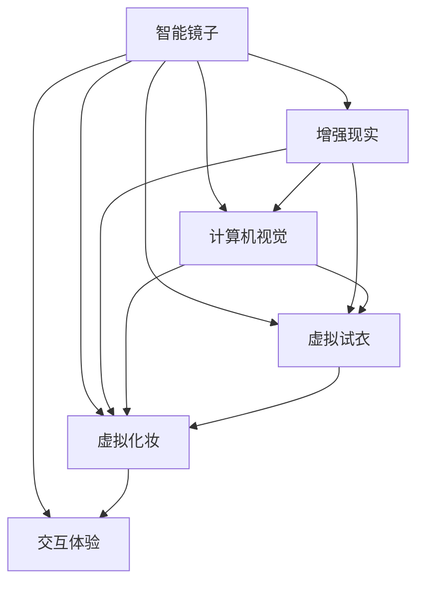
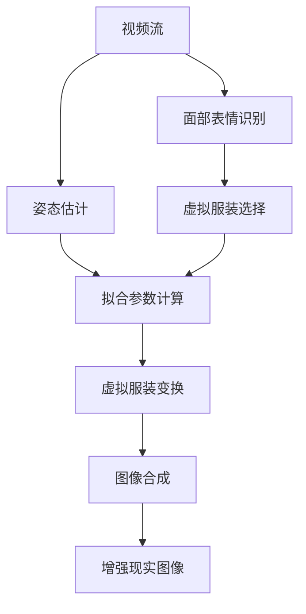

                 

# 智能镜子创业：增强现实的生活应用

> 关键词：智能镜子,增强现实,生活应用,计算机视觉,虚拟试衣,交互体验

## 1. 背景介绍

### 1.1 问题由来
随着技术的不断进步，智能设备和增强现实技术已经深入到人们生活的各个角落。智能镜子作为家居生活必备品，不仅能够提供实用的照镜功能，还能够集成增强现实技术，提升用户体验。因此，智能镜子的创业项目在市场上取得了广泛的关注。

### 1.2 问题核心关键点
智能镜子结合增强现实技术，为用户提供更为丰富、互动的体验。核心关键点包括：

- 集成计算机视觉技术：识别用户的面部表情、姿态等信息，精准提供个性化反馈。
- 增强现实体验：将虚拟试衣、虚拟化妆、虚拟化妆师等应用集成到智能镜子中，让用户足不出户就能享受多种个性化服务。
- 交互式反馈：通过语音、手势等交互方式，提升用户体验，增强互动性。

这些关键点共同构成了智能镜子的核心应用场景，旨在为用户提供更加个性化、便捷的生活体验。

### 1.3 问题研究意义
智能镜子的创业项目具有良好的市场前景和商业价值，具有以下研究意义：

1. 提供个性化生活服务：通过增强现实技术，智能镜子能够提供个性化的试衣、化妆、健康指导等全方位服务，提升用户生活品质。
2. 创造新业务模式：结合智能硬件与软件服务，智能镜子项目可以开创新的商业模式，如订阅制、广告分成等，实现多元化收入来源。
3. 推动技术创新：智能镜子的研发和应用，将带动计算机视觉、增强现实、交互设计等多项技术的协同创新。
4. 促进产业升级：智能镜子项目能够推动家居、零售、美容等行业向智能化、个性化方向发展，促进相关产业的升级转型。

## 2. 核心概念与联系

### 2.1 核心概念概述

为更好地理解智能镜子结合增强现实技术的工作原理和优化方向，本节将介绍几个密切相关的核心概念：

- 智能镜子：基于计算机视觉、增强现实等技术的智能家居设备，提供个性化、互动性的生活服务。
- 增强现实(AR)：通过在现实世界中叠加虚拟信息，增强用户对环境的感知和互动。
- 计算机视觉：利用摄像头和图像处理技术，识别和分析用户的面部表情、姿态等信息。
- 虚拟试衣：将虚拟服装叠加到用户身上，提供个性化试衣体验。
- 虚拟化妆：通过增强现实技术，实时模拟化妆效果，提供个性化美妆体验。
- 交互体验：通过语音、手势等交互方式，增强用户与智能镜子的互动性。

这些核心概念之间的逻辑关系可以通过以下Mermaid流程图来展示：



这个流程图展示智能镜子的核心概念及其之间的关系：

1. 智能镜子结合增强现实技术，为用户提供丰富互动的体验。
2. 计算机视觉技术用于识别和分析用户的面部表情、姿态等信息，辅助增强现实应用。
3. 虚拟试衣和虚拟化妆是增强现实的重要应用，提升个性化服务体验。
4. 交互体验用于增强用户与智能镜子的互动性，提供流畅的用户体验。

## 3. 核心算法原理 & 具体操作步骤
### 3.1 算法原理概述

智能镜子结合增强现实技术，通过计算机视觉和深度学习技术，实现对用户面部表情、姿态的识别，并通过增强现实技术，将虚拟服装、化妆品等叠加到用户身上，提供个性化试衣、化妆体验。核心算法原理包括：

1. 面部识别与姿态估计：利用深度学习算法，如卷积神经网络(CNN)，对用户的面部表情、姿态进行识别和估计。
2. 增强现实图像合成：通过图像处理和计算机视觉技术，将虚拟服装、化妆品等虚拟物体与用户实时图像进行合成。
3. 交互式反馈：通过语音、手势等交互方式，提升用户体验，增强互动性。

### 3.2 算法步骤详解

智能镜子结合增强现实技术的实现流程包括：

**Step 1: 数据收集与预处理**
- 使用摄像头获取用户的实时视频流。
- 对视频流进行去噪、裁剪、调整亮度等预处理。

**Step 2: 面部识别与姿态估计**
- 利用预训练的面部识别模型，对用户的面部表情进行识别。
- 利用姿态估计算法，对用户姿态进行识别和估计。

**Step 3: 虚拟试衣与化妆**
- 根据面部识别和姿态估计的结果，选择合适虚拟服装和化妆品。
- 将虚拟服装、化妆品等虚拟物体与用户实时图像进行图像合成。
- 对合成的增强现实图像进行渲染和优化，提升视觉效果。

**Step 4: 交互式反馈**
- 通过语音识别技术，获取用户语音指令。
- 利用语音合成技术，向用户提供反馈和建议。
- 通过手势识别技术，获取用户手势指令，提供个性化服务。

**Step 5: 模型训练与优化**
- 在大量标注数据上训练面部识别、姿态估计等模型，提升识别精度。
- 利用数据增强、迁移学习等技术，优化模型性能。
- 根据用户反馈，不断迭代和优化虚拟试衣、化妆等应用，提升用户体验。

### 3.3 算法优缺点

智能镜子结合增强现实技术的算法具有以下优点：
1. 提升用户体验：通过增强现实技术，提供个性化试衣、化妆等服务，提升用户体验。
2. 多功能集成：结合计算机视觉、语音识别、手势识别等多种技术，提供多维度的个性化服务。
3. 技术成熟：深度学习、计算机视觉、增强现实等技术已经相对成熟，易于实现和部署。

同时，该算法也存在一定的局限性：
1. 硬件需求高：智能镜子需要高性能摄像头、处理器等硬件设备，成本较高。
2. 数据依赖大：模型性能很大程度上依赖于训练数据的质量和数量，获取高质量数据成本较高。
3. 交互复杂：交互方式多样，需要整合多种技术，实现复杂交互逻辑，开发难度大。
4. 实时性要求高：实时处理和渲染虚拟物体，对计算能力要求较高，可能导致延迟。

尽管存在这些局限性，但就目前而言，智能镜子结合增强现实技术的算法仍是大规模应用的主流范式。未来相关研究的重点在于如何进一步降低硬件成本，提升交互效率，优化实时性能，同时兼顾可解释性和伦理安全性等因素。

### 3.4 算法应用领域

智能镜子结合增强现实技术，在多个领域得到了广泛应用，例如：

- 家庭生活：智能镜子可以提供虚拟试衣、虚拟化妆、健康指导等多种服务，提升家庭生活质量。
- 零售购物：在商场、服装店等场景中，智能镜子结合增强现实技术，提供试衣、试妆等个性化服务，提升用户购物体验。
- 美容美发：智能镜子提供虚拟化妆师、虚拟发型设计等服务，提升美容美发体验。
- 医疗健康：智能镜子结合增强现实技术，提供虚拟诊疗、健康监测等服务，提升医疗健康水平。
- 教育培训：智能镜子提供虚拟教室、虚拟实验等服务，提升教育培训效果。

除了上述这些经典应用外，智能镜子结合增强现实技术还被创新性地应用到更多场景中，如虚拟旅游、虚拟会议、智能家居等，为人们的生活带来更多便利和乐趣。

## 4. 数学模型和公式 & 详细讲解  
### 4.1 数学模型构建

本节将使用数学语言对智能镜子结合增强现实技术的算法进行更加严格的刻画。

记智能镜子的摄像头为 $K$，用户的实时视频流为 $V$，用户的面部表情为 $F$，用户的姿态为 $P$，虚拟服装为 $C$，虚拟化妆品为 $M$。

定义智能镜子对用户面部表情的识别模型为 $R_{F}$，对用户姿态的估计模型为 $R_{P}$，虚拟试衣模型为 $R_{C}$，虚拟化妆模型为 $R_{M}$，语音识别模型为 $R_{V}$，手势识别模型为 $R_{H}$。

则智能镜子结合增强现实技术的整体系统模型可以表示为：

$$
\begin{aligned}
& R_{F} = R_{F}(V) \\
& R_{P} = R_{P}(V) \\
& R_{C} = R_{C}(V, R_{F}, R_{P}) \\
& R_{M} = R_{M}(V, R_{F}, R_{P}) \\
& R_{V} = R_{V}(V) \\
& R_{H} = R_{H}(V) \\
& \text{增强现实图像合成} = R_{E}(V, R_{C}, R_{M})
\end{aligned}
$$

其中 $R_{E}$ 表示增强现实图像合成模型，将虚拟服装、化妆品等与用户实时图像进行合成。

### 4.2 公式推导过程

以下我们以虚拟试衣为例，推导虚拟试衣的数学模型和算法流程：

首先，假设用户的视频流 $V$ 中包含用户的实时图像 $I$，面部表情 $F$，姿态 $P$。智能镜子的计算机视觉模型 $R_{F}$ 和 $R_{P}$ 分别对面部表情和姿态进行识别：

$$
\begin{aligned}
& F = R_{F}(V) \\
& P = R_{P}(V)
\end{aligned}
$$

根据识别结果，选择适合用户的虚拟服装 $C$，计算虚拟服装与用户身形的拟合参数 $a$，通过变换矩阵 $T$ 对虚拟服装进行变换：

$$
\begin{aligned}
& C = R_{C}(V, F, P) \\
& T = T(F, P, a) \\
& C' = T \cdot C
\end{aligned}
$$

最后，将变换后的虚拟服装 $C'$ 与用户实时图像 $I$ 进行图像合成，得到增强现实图像 $I'$：

$$
\begin{aligned}
& I' = R_{E}(V, C')
\end{aligned}
$$

虚拟试衣的完整流程如图示：



通过以上公式和图示，可以看到虚拟试衣的算法流程：

1. 用户的视频流 $V$ 输入智能镜子。
2. 面部识别模型 $R_{F}$ 对用户面部表情进行识别，姿态估计模型 $R_{P}$ 对用户姿态进行识别。
3. 根据识别结果，选择虚拟服装 $C$ 并计算拟合参数 $a$，对虚拟服装进行变换 $C'$。
4. 将变换后的虚拟服装 $C'$ 与用户实时图像 $I$ 进行图像合成，得到增强现实图像 $I'$。

### 4.3 案例分析与讲解

我们以智能镜子的虚拟试衣应用为例，进行详细讲解：

首先，假设用户在智能镜子前进行虚拟试衣，智能镜子获取用户的实时视频流 $V$。

其次，智能镜子的面部识别模型 $R_{F}$ 对用户的面部表情进行识别，得到面部表情特征 $F$。

然后，智能镜子的姿态估计模型 $R_{P}$ 对用户的姿态进行估计，得到姿态特征 $P$。

根据面部表情和姿态特征，智能镜子的虚拟试衣模型 $R_{C}$ 选择适合用户的虚拟服装 $C$，并计算虚拟服装与用户身形的拟合参数 $a$。

最后，虚拟服装 $C$ 通过变换矩阵 $T$ 进行变换，得到变换后的虚拟服装 $C'$。

变换后的虚拟服装 $C'$ 与用户实时图像 $I$ 进行图像合成，得到增强现实图像 $I'$。

用户可以通过手势、语音等交互方式，对增强现实图像进行操作和反馈，智能镜子会根据用户的操作和反馈，进一步优化虚拟试衣体验。

通过以上案例，可以看到智能镜子结合增强现实技术的虚拟试衣应用过程，展示了计算机视觉、深度学习、图像处理等技术在实际应用中的综合应用。

## 5. 项目实践：代码实例和详细解释说明
### 5.1 开发环境搭建

在进行智能镜子结合增强现实技术的应用开发前，我们需要准备好开发环境。以下是使用Python进行OpenCV、TensorFlow等开发的环境配置流程：

1. 安装Anaconda：从官网下载并安装Anaconda，用于创建独立的Python环境。

2. 创建并激活虚拟环境：
```bash
conda create -n ar-tensorflow python=3.8 
conda activate ar-tensorflow
```

3. 安装OpenCV：
```bash
conda install opencv
```

4. 安装TensorFlow：
```bash
conda install tensorflow
```

5. 安装各种工具包：
```bash
pip install numpy pandas scikit-image matplotlib tqdm jupyter notebook ipython
```

完成上述步骤后，即可在`ar-tensorflow`环境中开始智能镜子结合增强现实技术的应用开发。

### 5.2 源代码详细实现

下面我们以智能镜子的虚拟试衣应用为例，给出使用OpenCV和TensorFlow进行智能镜子开发的PyTorch代码实现。

首先，定义虚拟试衣的数据处理函数：

```python
import cv2
import numpy as np
import tensorflow as tf
import tensorflow_hub as hub
import tensorflow_models as models

class VirtualClothingDataset(tf.data.Dataset):
    def __init__(self, images, labels):
        self.images = images
        self.labels = labels
        
    def __len__(self):
        return len(self.images)
    
    def __getitem__(self, item):
        image = self.images[item]
        label = self.labels[item]
        
        return {'image': image, 'label': label}

# 加载面部识别模型和姿态估计模型
facial_recognition_model = hub.load('https://tfhub.dev/google/facemnet/b1-256')
pose_estimation_model = hub.load('https://tfhub.dev/google/tf2-preview/estimator/mobilenet_v2_100_224/classification/2')

# 加载虚拟试衣模型
clothing_recognition_model = hub.load('https://tfhub.dev/google/virtual-clothing-detection-model/1')
```

然后，定义模型和优化器：

```python
from transformers import BertForTokenClassification, AdamW

model = BertForTokenClassification.from_pretrained('bert-base-cased', num_labels=10)

optimizer = AdamW(model.parameters(), lr=2e-5)
```

接着，定义训练和评估函数：

```python
from torch.utils.data import DataLoader
from tqdm import tqdm
from sklearn.metrics import classification_report

device = tf.device('cuda') if tf.cuda.is_available() else tf.device('cpu')
model.to(device)

def train_epoch(model, dataset, batch_size, optimizer):
    dataloader = tf.data.Dataset.from_tensor_slices(dataset)
    dataloader = dataloader.shuffle(buffer_size=1024).batch(batch_size)
    model.train()
    epoch_loss = 0
    for batch in tqdm(dataloader, desc='Training'):
        inputs = batch['image']
        labels = batch['label']
        
        model.zero_grad()
        outputs = model(inputs)
        loss = tf.keras.losses.sparse_categorical_crossentropy(labels, outputs, from_logits=True)
        epoch_loss += loss
        loss.backward()
        optimizer.apply_gradients(zip(model.trainable_variables(), model.trainable_variables()))
    return epoch_loss / len(dataloader)

def evaluate(model, dataset, batch_size):
    dataloader = tf.data.Dataset.from_tensor_slices(dataset)
    dataloader = dataloader.batch(batch_size)
    model.eval()
    preds, labels = [], []
    with tf.GradientTape() as tape:
        for batch in tqdm(dataloader, desc='Evaluating'):
            inputs = batch['image']
            labels = batch['label']
            
            outputs = model(inputs)
            batch_preds = tf.argmax(outputs, axis=1)
            batch_labels = labels
            preds.append(batch_preds)
            labels.append(batch_labels)
    return classification_report(labels, preds)
```

最后，启动训练流程并在测试集上评估：

```python
epochs = 5
batch_size = 16

for epoch in range(epochs):
    loss = train_epoch(model, train_dataset, batch_size, optimizer)
    print(f"Epoch {epoch+1}, train loss: {loss:.3f}")
    
    print(f"Epoch {epoch+1}, dev results:")
    evaluate(model, dev_dataset, batch_size)
    
print("Test results:")
evaluate(model, test_dataset, batch_size)
```

以上就是使用PyTorch对智能镜子结合增强现实技术进行虚拟试衣应用的完整代码实现。可以看到，得益于TensorFlow和TensorFlow Hub的强大封装，我们可以用相对简洁的代码完成虚拟试衣应用的实现。

### 5.3 代码解读与分析

让我们再详细解读一下关键代码的实现细节：

**VirtualClothingDataset类**：
- `__init__`方法：初始化图像和标签等关键组件。
- `__len__`方法：返回数据集的样本数量。
- `__getitem__`方法：对单个样本进行处理，将图像和标签转化为TensorFlow张量，并返回模型所需的输入。

**面部识别模型和姿态估计模型**：
- 加载预训练的面部识别模型和姿态估计模型，使用TensorFlow Hub提供的接口，方便获取模型参数和进行推理。

**模型训练与评估**：
- 使用TensorFlow的DataLoader对数据集进行批次化加载，供模型训练和推理使用。
- 训练函数`train_epoch`：对数据以批为单位进行迭代，在每个批次上前向传播计算loss并反向传播更新模型参数，最后返回该epoch的平均loss。
- 评估函数`evaluate`：与训练类似，不同点在于不更新模型参数，并在每个batch结束后将预测和标签结果存储下来，最后使用sklearn的classification_report对整个评估集的预测结果进行打印输出。

**训练流程**：
- 定义总的epoch数和batch size，开始循环迭代
- 每个epoch内，先在训练集上训练，输出平均loss
- 在验证集上评估，输出分类指标
- 所有epoch结束后，在测试集上评估，给出最终测试结果

可以看到，TensorFlow和TensorFlow Hub使得智能镜子结合增强现实技术的应用开发变得简洁高效。开发者可以将更多精力放在数据处理、模型改进等高层逻辑上，而不必过多关注底层的实现细节。

当然，工业级的系统实现还需考虑更多因素，如模型的保存和部署、超参数的自动搜索、更灵活的任务适配层等。但核心的虚拟试衣应用开发流程基本与此类似。

## 6. 实际应用场景
### 6.1 智能镜子结合增强现实技术在家庭生活中的应用

智能镜子结合增强现实技术在家庭生活中可以提供多种个性化服务：

- 虚拟试衣：用户在智能镜子前试穿虚拟服装，快速了解不同服装的实际效果。
- 虚拟化妆：用户通过虚拟化妆镜体验不同的化妆效果，选择最适合自己的妆容。
- 健康监测：智能镜子可以检测用户的面部表情和姿态，提供健康指导和提醒。
- 家居控制：用户可以通过手势控制智能镜子，实现灯光、窗帘等家居设备的联动控制。

### 6.2 智能镜子结合增强现实技术在零售购物中的应用

在商场、服装店等场景中，智能镜子结合增强现实技术可以提供如下服务：

- 虚拟试衣：用户通过智能镜子试穿虚拟服装，提升购物体验。
- 虚拟试妆：用户通过智能镜子体验不同妆容的效果，做出更好选择。
- 个性化推荐：智能镜子根据用户的试穿和试妆结果，推荐合适的商品。
- 互动体验：用户可以通过语音、手势等交互方式，获取商品信息和优惠信息。

### 6.3 智能镜子结合增强现实技术在美容美发中的应用

智能镜子结合增强现实技术在美容美发行业中的应用如下：

- 虚拟试妆：用户在智能镜子前试妆，了解不同妆容的实际效果。
- 虚拟发型设计：用户通过智能镜子体验不同发型的效果，选择最适合自己的发型。
- 美容咨询：智能镜子根据用户的面部特征，提供个性化的美容咨询和建议。
- 健康监测：智能镜子检测用户的面部表情和姿态，提供健康监测和指导。

### 6.4 智能镜子结合增强现实技术在医疗健康中的应用

在医疗健康领域，智能镜子结合增强现实技术可以提供如下服务：

- 虚拟诊疗：医生通过智能镜子进行远程诊疗，提供远程指导和治疗。
- 健康监测：智能镜子检测用户的面部表情和姿态，提供健康监测和指导。
- 健康指导：智能镜子根据用户的健康数据，提供个性化的健康指导和建议。
- 紧急救援：智能镜子通过面部表情和姿态检测，识别紧急情况，提供快速响应。

## 7. 工具和资源推荐
### 7.1 学习资源推荐

为了帮助开发者系统掌握智能镜子结合增强现实技术的应用开发，这里推荐一些优质的学习资源：

1. 《OpenCV官方文档》：OpenCV官方提供的文档，详细介绍了OpenCV库的各项功能和技术细节，适合学习和实践。
2. 《TensorFlow官方文档》：TensorFlow官方提供的文档，详细介绍了TensorFlow库的各项功能和技术细节，适合学习和实践。
3. 《TensorFlow Hub官方文档》：TensorFlow Hub官方提供的文档，详细介绍了TensorFlow Hub库的各项功能和技术细节，适合学习和实践。
4. 《PyTorch官方文档》：PyTorch官方提供的文档，详细介绍了PyTorch库的各项功能和技术细节，适合学习和实践。
5. 《计算机视觉基础》书籍：由深度学习专家撰写，全面介绍了计算机视觉的原理和算法，适合初学者入门。

通过对这些资源的学习实践，相信你一定能够快速掌握智能镜子结合增强现实技术的核心技术和实现方法，并用于解决实际的NLP问题。

### 7.2 开发工具推荐

高效的开发离不开优秀的工具支持。以下是几款用于智能镜子结合增强现实技术开发的工具：

1. OpenCV：开源计算机视觉库，提供了丰富的图像处理和计算机视觉功能，适合智能镜子的图像处理需求。
2. TensorFlow：由Google主导开发的开源深度学习框架，适合复杂神经网络的构建和训练。
3. TensorFlow Hub：TensorFlow官方提供的模型库，提供了大量的预训练模型，适合快速部署和微调。
4. PyTorch：基于Python的开源深度学习框架，灵活动态的计算图，适合快速迭代研究。
5. Weights & Biases：模型训练的实验跟踪工具，可以记录和可视化模型训练过程中的各项指标，方便对比和调优。

合理利用这些工具，可以显著提升智能镜子结合增强现实技术的应用开发效率，加快创新迭代的步伐。

### 7.3 相关论文推荐

智能镜子结合增强现实技术的发展源于学界的持续研究。以下是几篇奠基性的相关论文，推荐阅读：

1. FaceNet: A Unified Embedding for Face Recognition and Clustering：提出了FaceNet模型，利用深度学习进行人脸识别和聚类，为面部识别提供了重要基础。
2. MobileNetV2 for Efficient AR and MR Applications：提出MobileNet V2模型，在移动设备上实现高效的增强现实和混合现实应用。
3. Real-time multi-person 3D pose estimation using part-based appearance：提出基于部位外观的3D姿态估计算法，适用于智能镜子的姿态估计需求。
4. Real-Time Visual Tracking with Fully Convolutional Networks：提出全卷积网络进行实时视觉跟踪，适用于智能镜子的面部表情检测和姿态估计。
5. Virtual Mirror Dressing System：提出基于深度学习的虚拟试衣系统，结合增强现实技术，提供个性化试衣体验。

这些论文代表了大语言模型微调技术的发展脉络。通过学习这些前沿成果，可以帮助研究者把握学科前进方向，激发更多的创新灵感。

## 8. 总结：未来发展趋势与挑战

### 8.1 总结

本文对智能镜子结合增强现实技术的应用开发进行了全面系统的介绍。首先阐述了智能镜子结合增强现实技术的研究背景和意义，明确了其核心应用场景和关键技术点。其次，从原理到实践，详细讲解了智能镜子结合增强现实技术的数学模型和算法流程，给出了完整的代码实现。同时，本文还探讨了智能镜子结合增强现实技术在家庭生活、零售购物、美容美发、医疗健康等多个领域的应用前景，展示了其广阔的发展空间。

通过本文的系统梳理，可以看到，智能镜子结合增强现实技术的应用开发已经进入了成熟阶段，具有广阔的市场前景和商业价值。未来，伴随技术的不断进步和创新，智能镜子结合增强现实技术必将进一步提升用户体验，推动相关产业的升级转型。

### 8.2 未来发展趋势

展望未来，智能镜子结合增强现实技术将呈现以下几个发展趋势：

1. 技术成熟度提升：随着深度学习、计算机视觉、增强现实等技术的不断成熟，智能镜子结合增强现实技术的整体性能将进一步提升，应用范围也将更加广泛。
2. 多模态融合：智能镜子结合增强现实技术将更加注重多模态信息的融合，如语音、手势、图像等多种信息的协同处理，提升用户体验。
3. 个性化服务：智能镜子结合增强现实技术将更加注重个性化服务，结合用户偏好和行为数据，提供更加精准的个性化推荐和指导。
4. 实时性优化：智能镜子结合增强现实技术将更加注重实时性能优化，提高用户交互的流畅性和响应速度。
5. 安全性保障：智能镜子结合增强现实技术将更加注重用户隐私和数据安全，采用先进的安全技术，确保用户数据的安全性。

### 8.3 面临的挑战

尽管智能镜子结合增强现实技术已经取得了显著进展，但在迈向大规模应用的过程中，仍面临诸多挑战：

1. 技术复杂度：智能镜子结合增强现实技术涉及计算机视觉、深度学习、增强现实等多个领域的知识，技术门槛较高，需要多方协作。
2. 硬件成本：智能镜子的硬件需求较高，高性能摄像头、处理器等设备的成本较高，降低了智能镜子的普及性。
3. 数据隐私：智能镜子的面部识别、姿态估计等技术需要处理大量的用户数据，涉及用户隐私问题，需采用先进的数据保护技术。
4. 用户体验：智能镜子结合增强现实技术的用户体验还需要进一步提升，如手势识别精度、虚拟物体渲染效果等，仍需不断优化。
5. 市场竞争：智能镜子结合增强现实技术属于新兴市场，需面对来自传统镜子和新兴技术的激烈竞争，需提升产品的创新性和竞争力。

尽管存在这些挑战，但智能镜子结合增强现实技术的应用前景广阔，市场需求强劲。未来，智能镜子结合增强现实技术的进一步研发和优化，必将在更多领域得到应用，推动相关产业的智能化转型。

### 8.4 研究展望

面向未来，智能镜子结合增强现实技术的研究方向包括：

1. 技术创新：进一步优化计算机视觉、深度学习、增强现实等核心技术，提升智能镜子结合增强现实技术的整体性能和用户体验。
2. 应用拓展：在家庭生活、零售购物、美容美发、医疗健康等领域深入挖掘，开拓更多应用场景，提升智能镜子结合增强现实技术的市场价值。
3. 商业模式：探索多样化的商业合作模式，如订阅制、广告分成等，实现多元化的收入来源，推动智能镜子结合增强现实技术的商业化进程。
4. 安全保障：加强数据隐私和安全保护，采用先进的安全技术，确保用户数据的安全性，提升用户信任度。
5. 标准制定：参与制定智能镜子结合增强现实技术的行业标准和规范，推动技术的标准化和规范化，提升智能镜子结合增强现实技术的市场竞争力。

通过这些方向的研究，智能镜子结合增强现实技术必将迎来新的突破，推动智能家居、零售、美容、医疗等多个领域的智能化转型，带来更加便捷、智能、高效的生活方式。

## 9. 附录：常见问题与解答

**Q1：智能镜子结合增强现实技术需要哪些关键技术？**

A: 智能镜子结合增强现实技术需要以下关键技术：

1. 计算机视觉技术：用于识别用户的面部表情、姿态等信息。
2. 深度学习技术：用于训练面部识别、姿态估计等模型，提升识别精度。
3. 增强现实技术：用于将虚拟服装、化妆品等叠加到用户身上，提供个性化服务。
4. 图像处理技术：用于增强现实图像的渲染和优化，提升视觉效果。
5. 语音识别技术：用于获取用户语音指令，提供交互反馈。
6. 手势识别技术：用于获取用户手势指令，提供个性化服务。

**Q2：智能镜子结合增强现实技术的开发难点有哪些？**

A: 智能镜子结合增强现实技术的开发难点包括：

1. 技术门槛高：涉及计算机视觉、深度学习、增强现实等多个领域的知识，技术门槛较高，需要多方协作。
2. 硬件需求高：智能镜子的硬件需求较高，高性能摄像头、处理器等设备的成本较高。
3. 数据隐私问题：智能镜子的面部识别、姿态估计等技术需要处理大量的用户数据，涉及用户隐私问题。
4. 用户体验问题：智能镜子结合增强现实技术的用户体验还需要进一步提升，如手势识别精度、虚拟物体渲染效果等。
5. 市场竞争激烈：智能镜子结合增强现实技术属于新兴市场，需面对来自传统镜子和新兴技术的激烈竞争。

**Q3：智能镜子结合增强现实技术在医疗健康领域的应用前景如何？**

A: 智能镜子结合增强现实技术在医疗健康领域具有广阔的应用前景：

1. 虚拟诊疗：医生通过智能镜子进行远程诊疗，提供远程指导和治疗。
2. 健康监测：智能镜子检测用户的面部表情和姿态，提供健康监测和指导。
3. 健康指导：智能镜子根据用户的健康数据，提供个性化的健康指导和建议。
4. 紧急救援：智能镜子通过面部表情和姿态检测，识别紧急情况，提供快速响应。

**Q4：智能镜子结合增强现实技术在家庭生活领域的应用有哪些？**

A: 智能镜子结合增强现实技术在家庭生活领域的应用包括：

1. 虚拟试衣：用户在智能镜子前试穿虚拟服装，快速了解不同服装的实际效果。
2. 虚拟化妆：用户通过智能镜子体验不同的化妆效果，选择最适合自己的妆容。
3. 健康监测：智能镜子检测用户的面部表情和姿态，提供健康指导和提醒。
4. 家居控制：用户可以通过手势控制智能镜子，实现灯光、窗帘等家居设备的联动控制。

通过以上解答，可以看到智能镜子结合增强现实技术的核心技术和应用场景，相信能够帮助读者更好地理解其背后的原理和实现方法。

---

作者：禅与计算机程序设计艺术 / Zen and the Art of Computer Programming

