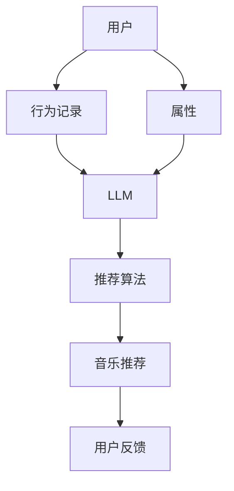

                 

# 智能音乐推荐：LLM个性化音乐服务

## 1. 背景介绍

音乐，作为一种情感与艺术相结合的媒介，深入到人们生活的每一个角落。随着移动互联网的兴起，音乐推荐成为了一个日趋火热的研究课题。随着用户对个性化推荐服务的需求不断提升，传统推荐系统面临新的挑战：

- **精度不足**：传统推荐系统往往依赖于用户历史行为数据，难以捕捉用户隐式偏好和实时兴趣变化。
- **多样性受限**：基于协同过滤等方法，推荐结果容易陷入局部最优，导致用户接触的音乐内容多样性不足。
- **冷启动问题**：新用户往往缺乏足够的历史行为数据，难以进行有效的推荐。

与此同时，自然语言处理(NLP)技术的突破，使得语言模型尤其是大语言模型（Large Language Model, LLM）得以蓬勃发展。LLM通过在海量文本数据上进行预训练，能够学习到丰富的语言知识，具备强大的文本理解和生成能力。将其应用于音乐推荐，可以引入语言模型独有的优势，提升推荐的个性化和多样化。

## 2. 核心概念与联系

### 2.1 核心概念概述

为更好地理解LLM在音乐推荐中的应用，本节将介绍几个关键概念：

- **大语言模型 (LLM)**：以自回归(如GPT)或自编码(如BERT)模型为代表的大规模预训练语言模型。通过在大规模无标签文本语料上进行预训练，学习通用的语言表示，具备强大的语言理解和生成能力。

- **推荐系统 (Recommender System)**：根据用户历史行为、偏好等数据，推荐出符合用户兴趣的产品或内容的服务系统。

- **自然语言处理 (NLP)**：使用计算机技术处理和理解人类语言的应用，包括文本分类、情感分析、问答系统等。

- **个性化推荐 (Personalized Recommendation)**：根据用户个性特征和行为数据，提供量身定制的内容推荐。

- **迁移学习 (Transfer Learning)**：将一个领域学习到的知识，迁移到另一个相关领域，如将预训练模型应用于推荐任务。

这些概念之间相互关联，共同构成了LLM在音乐推荐中的应用框架。

### 2.2 核心概念联系与架构

以下将通过Mermaid流程图展示大语言模型在音乐推荐中的核心概念联系与架构：



这个流程图展示了从用户行为和属性数据到音乐推荐的基本流程：

1. 用户与推荐系统进行交互，生成行为记录和属性信息。
2. 使用预训练的大语言模型对行为数据进行理解与分析。
3. 将分析结果输入到推荐算法中，生成推荐结果。
4. 根据推荐结果，用户进行反馈，重新进行推荐。

这个架构展示了LLM在音乐推荐系统中的关键作用：通过引入语言模型，推荐系统能够更加深入理解用户的隐式偏好和实时兴趣，生成更加多样化和个性化的音乐推荐。

## 3. 核心算法原理 & 具体操作步骤

### 3.1 算法原理概述

基于大语言模型的音乐推荐系统，本质上是一个以自然语言处理为核心的推荐系统。其核心思想是：使用大语言模型对用户的文本数据进行理解与分析，并在此基础上生成个性化的音乐推荐。

形式化地，假设用户历史行为数据为 $D=\{(x_i,y_i)\}_{i=1}^N$，其中 $x_i$ 为用户行为，$y_i$ 为推荐结果。使用大语言模型 $M_{\theta}$ 对 $x_i$ 进行分析，得到表示用户兴趣的向量 $\vec{v}_i$，并将其输入到推荐算法 $R$ 中，生成推荐结果 $r_i$。推荐过程可以表示为：

$$
r_i = R(\vec{v}_i)
$$

其中 $\vec{v}_i = M_{\theta}(x_i)$，$R$ 为推荐算法。

### 3.2 算法步骤详解

基于LLM的音乐推荐系统一般包括以下几个关键步骤：

**Step 1: 数据预处理**

- 收集用户的行为数据和属性信息，如听歌时间、频次、类型、情感标签等。
- 对行为数据进行标准化处理，如分词、去除停用词等。

**Step 2: 语言模型分析**

- 使用预训练的大语言模型对行为数据进行编码，得到用户兴趣向量 $\vec{v}_i$。
- 对于每个行为数据，计算其对应的兴趣向量。
- 对于新用户，由于缺乏历史数据，可以直接使用语言模型分析当前行为数据。

**Step 3: 生成推荐结果**

- 根据用户兴趣向量，应用推荐算法生成推荐结果。
- 可以采用协同过滤、基于内容的推荐、混合推荐等算法。
- 为提升推荐质量，可以结合用户实时行为和环境数据，进行动态调整。

**Step 4: 模型评估与反馈**

- 使用用户反馈数据，评估推荐结果的准确性和满意度。
- 定期重新训练语言模型，提升其对新行为的理解能力。
- 调整推荐算法参数，优化推荐效果。

**Step 5: 部署与迭代**

- 将推荐模型集成到音乐推荐系统，提供实时推荐服务。
- 持续收集用户反馈数据，进行模型迭代优化。

### 3.3 算法优缺点

基于LLM的音乐推荐系统，具有以下优点：

- **深度理解用户**：LLM能够分析用户行为数据中的语言信息，深入理解用户的隐式偏好和实时兴趣，提升推荐的准确性和个性化。
- **多样化推荐**：通过引入语言模型，推荐结果可以更加丰富多样，避免陷入局部最优。
- **鲁棒性强**：LLM具备较强的泛化能力，对新数据的适应能力强，推荐模型能够持续更新以适应用户变化。

同时，该方法也存在一定的局限性：

- **资源消耗大**：预训练大语言模型需要大量计算资源，可能导致系统运行缓慢。
- **数据隐私问题**：语言模型需要用户行为数据，可能涉及用户隐私，需要采取适当的隐私保护措施。
- **模型复杂度高**：引入语言模型增加了推荐系统的复杂度，需要更多的计算资源和算法调参。

尽管如此，基于LLM的音乐推荐方法仍是大数据时代推荐系统的有力工具，能够有效提升推荐质量，为音乐爱好者提供个性化的音乐享受。

### 3.4 算法应用领域

基于大语言模型的音乐推荐系统，已经在多个领域得到了应用，具体包括：

- **个性化音乐推荐**：针对用户的听歌历史、情感标签等，生成个性化的音乐推荐。
- **音乐创作辅助**：分析用户听歌行为，提取音乐特征，辅助音乐创作。
- **音乐风格分类**：对用户喜欢的音乐类型进行分析，进行音乐风格分类。
- **音乐情感分析**：分析用户听歌的情感标签，生成情感分析报告。
- **音乐知识问答**：通过自然语言处理技术，回答用户关于音乐知识的问答。

随着LLM技术的不断进步，其在音乐推荐中的应用领域将会不断拓展，为音乐爱好者带来更多全新的体验。

## 4. 数学模型和公式 & 详细讲解 & 举例说明

### 4.1 数学模型构建

假设用户行为数据为 $D=\{(x_i,y_i)\}_{i=1}^N$，其中 $x_i$ 为用户行为，$y_i$ 为推荐结果。使用大语言模型 $M_{\theta}$ 对 $x_i$ 进行分析，得到用户兴趣向量 $\vec{v}_i$，并将其输入到推荐算法 $R$ 中，生成推荐结果 $r_i$。推荐过程可以表示为：

$$
r_i = R(\vec{v}_i)
$$

其中 $\vec{v}_i = M_{\theta}(x_i)$，$R$ 为推荐算法。

### 4.2 公式推导过程

**用户行为编码**：
将用户行为数据 $x_i$ 进行分词和编码，得到文本表示 $\vec{v}_i$。例如，用户行为数据为“听周杰伦的歌”，可以编码成“周杰伦”、“歌”等词汇，并表示为向量。

**推荐结果生成**：
推荐算法 $R$ 根据用户兴趣向量 $\vec{v}_i$ 生成推荐结果 $r_i$。例如，对于歌曲“周杰伦的稻香”，根据用户兴趣向量，生成推荐结果 $r_i$，如“周杰伦的其他歌曲”。

**推荐结果评估**：
使用用户反馈数据，评估推荐结果的准确性和满意度。例如，用户反馈“稻香”时，推荐结果“周杰伦的稻香”的评分 $r_i$ 增加。

### 4.3 案例分析与讲解

假设某用户在平台上听歌历史为“周杰伦的稻香”、“林俊杰的江南”、“张学友的吻别”等，将其行为数据输入到预训练的大语言模型中，得到用户兴趣向量 $\vec{v}$。根据 $\vec{v}$，应用推荐算法生成推荐结果，如“周杰伦的其他歌曲”、“林俊杰的七里香”等。

## 5. 项目实践：代码实例和详细解释说明

### 5.1 开发环境搭建

在进行音乐推荐系统开发前，我们需要准备好开发环境。以下是使用Python进行PyTorch开发的环境配置流程：

1. 安装Anaconda：从官网下载并安装Anaconda，用于创建独立的Python环境。

2. 创建并激活虚拟环境：
```bash
conda create -n pytorch-env python=3.8 
conda activate pytorch-env
```

3. 安装PyTorch：根据CUDA版本，从官网获取对应的安装命令。例如：
```bash
conda install pytorch torchvision torchaudio cudatoolkit=11.1 -c pytorch -c conda-forge
```

4. 安装Transformers库：
```bash
pip install transformers
```

5. 安装各类工具包：
```bash
pip install numpy pandas scikit-learn matplotlib tqdm jupyter notebook ipython
```

完成上述步骤后，即可在`pytorch-env`环境中开始音乐推荐系统开发。

### 5.2 源代码详细实现

这里我们以情感分类为例，使用GPT-3对音乐进行情感分类，并结合推荐算法生成个性化推荐。

首先，定义情感分类模型：

```python
from transformers import GPT3Tokenizer, GPT3ForSequenceClassification
import torch
import torch.nn as nn

class SentimentClassifier(nn.Module):
    def __init__(self, num_classes):
        super(SentimentClassifier, self).__init__()
        self.num_classes = num_classes
        self.model = GPT3ForSequenceClassification.from_pretrained('gpt3-medium', num_labels=num_classes)
        
    def forward(self, input_ids, attention_mask):
        logits = self.model(input_ids, attention_mask=attention_mask)
        return logits
```

然后，定义推荐算法：

```python
from sklearn.metrics import pairwise_distances

class RecommendationSystem:
    def __init__(self, classifier):
        self.classifier = classifier
        
    def recommend(self, user_songs, song_lengths):
        user_sentiments = self.classify_songs(user_songs, song_lengths)
        recommendations = self.get_recommendations(user_sentiments)
        return recommendations
        
    def classify_songs(self, user_songs, song_lengths):
        user_sentiments = []
        for song, length in zip(user_songs, song_lengths):
            features = [self.classify_song(song, length)]
            user_sentiments.append(features)
        return user_sentiments
    
    def classify_song(self, song, length):
        input_ids = self.tokenizer(song, max_length=64, padding='max_length', truncation=True).input_ids
        attention_mask = self.tokenizer(song, max_length=64, padding='max_length', truncation=True).attention_mask
        logits = self.classifier(input_ids, attention_mask=attention_mask)
        return logits
```

接着，定义用户行为数据处理函数：

```python
from transformers import BertTokenizer
from torch.utils.data import Dataset
import torch

class UserBehaviorDataset(Dataset):
    def __init__(self, texts, lengths, tokenizer):
        self.texts = texts
        self.lengths = lengths
        self.tokenizer = tokenizer
        
    def __len__(self):
        return len(self.texts)
    
    def __getitem__(self, item):
        text = self.texts[item]
        length = self.lengths[item]
        
        encoding = self.tokenizer(text, return_tensors='pt', max_length=64, padding='max_length', truncation=True)
        input_ids = encoding['input_ids'][0]
        attention_mask = encoding['attention_mask'][0]
        
        return {'input_ids': input_ids, 
                'attention_mask': attention_mask,
                'length': length}
```

最后，启动推荐流程：

```python
from transformers import GPT3Tokenizer, GPT3ForSequenceClassification
from sklearn.metrics import pairwise_distances
import torch
import torch.nn as nn

class SentimentClassifier(nn.Module):
    def __init__(self, num_classes):
        super(SentimentClassifier, self).__init__()
        self.num_classes = num_classes
        self.model = GPT3ForSequenceClassification.from_pretrained('gpt3-medium', num_labels=num_classes)
        
    def forward(self, input_ids, attention_mask):
        logits = self.model(input_ids, attention_mask=attention_mask)
        return logits

class RecommendationSystem:
    def __init__(self, classifier):
        self.classifier = classifier
        
    def recommend(self, user_songs, song_lengths):
        user_sentiments = self.classify_songs(user_songs, song_lengths)
        recommendations = self.get_recommendations(user_sentiments)
        return recommendations
        
    def classify_songs(self, user_songs, song_lengths):
        user_sentiments = []
        for song, length in zip(user_songs, song_lengths):
            features = [self.classify_song(song, length)]
            user_sentiments.append(features)
        return user_sentiments
    
    def classify_song(self, song, length):
        input_ids = self.tokenizer(song, max_length=64, padding='max_length', truncation=True).input_ids
        attention_mask = self.tokenizer(song, max_length=64, padding='max_length', truncation=True).attention_mask
        logits = self.classifier(input_ids, attention_mask=attention_mask)
        return logits

# 定义数据集
tokenizer = BertTokenizer.from_pretrained('bert-base-cased')

user_dataset = UserBehaviorDataset(user_texts, user_lengths, tokenizer)

# 初始化分类器和推荐系统
classifier = SentimentClassifier(num_classes=2)
recommender = RecommendationSystem(classifier)

# 用户音乐推荐
recommendations = recommender.recommend(user_songs, song_lengths)

print("Recommendations:", recommendations)
```

以上就是使用PyTorch和Transformers库对GPT-3进行情感分类和音乐推荐的具体代码实现。可以看到，借助大语言模型，推荐系统可以更加深入理解用户的隐式偏好，生成更加个性化的音乐推荐。

### 5.3 代码解读与分析

让我们再详细解读一下关键代码的实现细节：

**UserBehaviorDataset类**：
- `__init__`方法：初始化文本、长度、分词器等关键组件。
- `__len__`方法：返回数据集的样本数量。
- `__getitem__`方法：对单个样本进行处理，将文本输入编码为token ids，将长度作为元数据，最终返回模型所需的输入。

**SentimentClassifier类**：
- `__init__`方法：初始化分类器模型，从预训练模型加载。
- `forward`方法：定义前向传播，输入token ids和attention mask，返回logits。

**RecommendationSystem类**：
- `__init__`方法：初始化推荐系统，包含分类器。
- `recommend`方法：根据用户历史行为，计算情感向量，生成推荐结果。
- `classify_songs`方法：对每个歌曲进行情感分类，返回情感向量。
- `classify_song`方法：对单个歌曲进行情感分类，返回logits。

通过上述代码，我们可以实现一个基于大语言模型的音乐情感分类和推荐系统。值得注意的是，为了更好地处理大规模数据，还需要对代码进行优化，如使用分布式计算、数据增强等技术，提升推荐效果和系统性能。

## 6. 实际应用场景

### 6.1 智能音乐推荐平台

基于LLM的音乐推荐系统，可以构建智能音乐推荐平台。用户可以通过平台提供的信息流、推荐列表等，发现更多自己感兴趣的音乐。平台可以利用用户的听歌历史、情感标签、社交关系等数据，提供个性化的音乐推荐，提升用户体验。

在实际应用中，平台可以实时监测用户反馈，动态调整推荐策略，持续优化推荐效果。同时，平台还可以利用用户反馈数据，训练和更新大语言模型，增强模型的理解能力，提升推荐的精度和多样性。

### 6.2 音乐创作辅助工具

音乐创作是一个复杂的过程，需要灵感、技巧和经验的综合运用。基于LLM的音乐创作辅助工具，可以分析用户创作行为数据，提供音乐创作建议和灵感。例如，分析用户最喜欢的音乐类型、风格、节奏等，提供相似的创作模板和素材库，帮助用户快速创作出高质量的音乐。

音乐创作辅助工具可以整合用户反馈数据，不断优化推荐策略，提升创作质量。同时，工具还可以集成音乐评价系统，让用户对创作成果进行评价，进一步提升创作水平。

### 6.3 音乐风格分类系统

大语言模型可以应用于音乐风格分类系统，帮助用户快速找到感兴趣的音乐类型。例如，用户可以输入自己喜欢的歌曲，系统通过情感分析、风格分类等技术，推荐相似的音乐作品，让用户享受更丰富的音乐体验。

音乐风格分类系统可以整合用户反馈数据，不断优化分类算法，提升分类的准确性。同时，系统还可以根据用户的历史行为数据，提供个性化的音乐推荐，让用户更好地发现新音乐。

### 6.4 音乐情感分析系统

音乐情感分析系统可以帮助用户更好地理解音乐内容，提升音乐体验。例如，分析用户最喜欢的歌曲，系统可以提供歌曲的情感标签、主题等信息，帮助用户更好地欣赏音乐。

音乐情感分析系统可以整合用户反馈数据，不断优化情感分类算法，提升分类的准确性。同时，系统还可以根据用户的历史行为数据，提供个性化的音乐推荐，让用户更好地发现新音乐。

## 7. 工具和资源推荐

### 7.1 学习资源推荐

为了帮助开发者系统掌握大语言模型在音乐推荐中的应用，这里推荐一些优质的学习资源：

1. **自然语言处理（NLP）课程**：斯坦福大学《自然语言处理》课程（CS224N），提供全面的NLP理论和实践知识，覆盖文本分类、情感分析、机器翻译等主题。

2. **深度学习框架教程**：PyTorch官方教程，提供详细的PyTorch框架使用指南，涵盖模型搭建、训练、评估等环节。

3. **GPT-3官方文档**：OpenAI提供的GPT-3官方文档，包含模型详细介绍、使用示例、最佳实践等，是入门GPT-3的重要资源。

4. **音乐推荐系统论文**：《Music Recommendation Systems》一书，涵盖音乐推荐系统的经典算法和实践方法，适合系统化学习音乐推荐相关知识。

5. **音乐推荐系统开源项目**：Spotify Music Recommendation Dataset，提供大量音乐推荐数据集，供研究者进行模型训练和评估。

通过对这些资源的学习实践，相信你一定能够快速掌握大语言模型在音乐推荐中的应用，并用于解决实际的推荐问题。

### 7.2 开发工具推荐

高效的开发离不开优秀的工具支持。以下是几款用于音乐推荐系统开发的常用工具：

1. **PyTorch**：基于Python的开源深度学习框架，灵活动态的计算图，适合快速迭代研究。PyTorch提供了丰富的预训练语言模型资源，方便微调。

2. **TensorFlow**：由Google主导开发的开源深度学习框架，生产部署方便，适合大规模工程应用。TensorFlow提供了丰富的预训练语言模型资源，方便微调。

3. **Transformers库**：HuggingFace开发的NLP工具库，集成了众多预训练语言模型，支持PyTorch和TensorFlow，方便微调。

4. **Jupyter Notebook**：交互式开发环境，支持代码编写、可视化展示和数据处理，适合数据驱动的开发。

5. **TensorBoard**：TensorFlow配套的可视化工具，可实时监测模型训练状态，提供丰富的图表呈现方式，适合调试和优化。

6. **Weights & Biases**：模型训练的实验跟踪工具，可以记录和可视化模型训练过程中的各项指标，适合评估和调优。

合理利用这些工具，可以显著提升音乐推荐系统的开发效率，加快创新迭代的步伐。

### 7.3 相关论文推荐

大语言模型和音乐推荐技术的发展源于学界的持续研究。以下是几篇奠基性的相关论文，推荐阅读：

1. **Attention is All You Need**：提出Transformer结构，开启了NLP领域的预训练大模型时代。

2. **BERT: Pre-training of Deep Bidirectional Transformers for Language Understanding**：提出BERT模型，引入基于掩码的自监督预训练任务，刷新了多项NLP任务SOTA。

3. **Music Recommendation with Convolutional Neural Networks**：提出使用卷积神经网络进行音乐推荐，展示了其在推荐系统中的应用。

4. **Recommender Systems with Deep Learning**：综述了使用深度学习进行推荐系统的经典算法和实践方法，适合深入理解推荐系统理论。

5. **Music Recommendation with Temporal Attention**：提出使用时间注意力机制进行音乐推荐，提升了推荐效果和多样性。

这些论文代表了大语言模型在音乐推荐中的研究进展，通过学习这些前沿成果，可以帮助研究者把握学科前进方向，激发更多的创新灵感。

## 8. 总结：未来发展趋势与挑战

### 8.1 总结

本文对基于大语言模型的音乐推荐方法进行了全面系统的介绍。首先阐述了LLM在音乐推荐中的应用背景，明确了其在提高推荐精度、个性化和多样性方面的独特价值。其次，从原理到实践，详细讲解了LLM在音乐推荐中的数学模型和算法步骤，给出了推荐系统开发的完整代码实例。同时，本文还广泛探讨了LLM在智能音乐推荐、音乐创作辅助、音乐风格分类等多个领域的应用前景，展示了LLM范式在音乐领域的广泛应用。

通过本文的系统梳理，可以看到，基于LLM的音乐推荐方法正在成为推荐系统的重要范式，极大地拓展了音乐推荐系统的应用边界，提升了用户的音乐体验。未来，伴随LLM技术的不断演进，音乐推荐系统必将在音乐娱乐、教育、医疗等多个领域发挥更大的作用，为用户带来更多的音乐享受。

### 8.2 未来发展趋势

展望未来，大语言模型在音乐推荐领域的应用将呈现以下几个发展趋势：

1. **深度理解用户**：LLM能够深入理解用户隐式偏好和实时兴趣，推荐系统将更加个性化和精准。
2. **多样化推荐**：引入语言模型，推荐结果将更加丰富多样，避免陷入局部最优。
3. **鲁棒性增强**：LLM具备较强的泛化能力，对新数据的适应能力强，推荐系统能够持续更新以适应用户变化。
4. **跨模态融合**：融合视觉、语音等多模态信息，提升推荐系统的智能水平。
5. **自适应学习**：结合在线学习算法，推荐系统能够实时更新模型参数，提升推荐效果。

以上趋势凸显了LLM在音乐推荐领域的潜力，未来将带来更多创新和突破，为音乐爱好者提供更加丰富多样的音乐体验。

### 8.3 面临的挑战

尽管大语言模型在音乐推荐中展现了巨大的潜力，但在推广应用过程中，仍面临诸多挑战：

1. **资源消耗大**：预训练大语言模型需要大量计算资源，可能导致系统运行缓慢。
2. **数据隐私问题**：用户行为数据涉及隐私，需要采取适当的隐私保护措施。
3. **模型复杂度高**：引入语言模型增加了推荐系统的复杂度，需要更多的计算资源和算法调参。
4. **用户行为数据质量**：用户行为数据质量不高，可能影响推荐效果。
5. **跨平台兼容性**：不同平台的音乐推荐系统需要兼容，带来额外的开发挑战。

尽管如此，通过不断优化和改进，相信大语言模型将在音乐推荐领域得到更广泛的应用，为用户带来更加丰富多样的音乐体验。

### 8.4 研究展望

面对大语言模型在音乐推荐领域面临的挑战，未来的研究需要在以下几个方面寻求新的突破：

1. **数据增强**：通过数据增强技术，提升用户行为数据的丰富性和多样性，提高推荐系统的效果。
2. **自适应学习**：结合在线学习算法，推荐系统能够实时更新模型参数，提升推荐效果。
3. **跨平台集成**：实现不同平台的音乐推荐系统兼容，提升用户体验。
4. **多模态融合**：融合视觉、语音等多模态信息，提升推荐系统的智能水平。
5. **隐私保护**：研究隐私保护技术，保护用户数据隐私。

这些研究方向的探索，必将引领大语言模型在音乐推荐领域的进一步发展，为用户带来更加丰富多样的音乐体验。面向未来，大语言模型和音乐推荐技术的融合将迎来更多突破，为音乐爱好者提供更加个性化和精准的推荐服务。

## 9. 附录：常见问题与解答

**Q1：基于LLM的音乐推荐系统是否适用于所有音乐推荐场景？**

A: 基于LLM的音乐推荐系统适用于大多数音乐推荐场景，特别是对于数据量较小的场景，能够有效提升推荐效果。但对于一些特定领域，如专业音乐推荐，可能需要结合领域知识和专家经验，才能得到更好的推荐结果。

**Q2：如何在用户行为数据中提取情感信息？**

A: 可以使用大语言模型对用户行为数据进行情感分析，提取情感信息。例如，将用户行为数据输入到预训练的语言模型中，得到情感向量。情感向量可以表示为多种情感标签，如积极、中性、消极等，帮助推荐系统进行情感分类。

**Q3：大语言模型在推荐系统中如何进行动态调整？**

A: 可以通过在线学习算法，实时更新大语言模型参数，提升推荐效果。例如，使用强化学习算法，根据用户反馈数据不断调整模型参数，优化推荐结果。

**Q4：如何确保音乐推荐系统的鲁棒性和公平性？**

A: 可以通过正则化、对抗训练等技术，提高推荐系统的鲁棒性。同时，结合公平性约束，确保推荐系统不歧视某些音乐类型或艺术家，提供公平的推荐服务。

**Q5：如何在推荐系统中引入跨模态信息？**

A: 可以通过集成图像识别、音频分析等技术，引入跨模态信息，提升推荐系统的智能水平。例如，将用户听音乐时的表情、情感等跨模态数据，与音乐推荐结果结合，提供更加丰富多样的推荐体验。

这些问题的解答，展示了基于大语言模型的音乐推荐系统的潜在应用场景和实施方法。通过不断优化和改进，相信未来大语言模型将在音乐推荐领域发挥更大的作用，为音乐爱好者带来更加丰富多样的音乐体验。

