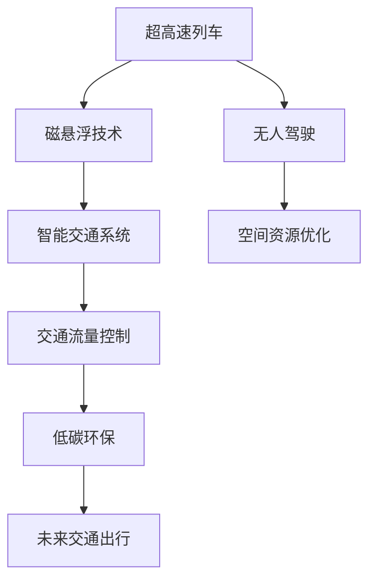

                 

# 未来的交通出行：2050年的超高速列车与空中交通网络

> 关键词：智能交通, 超高速列车, 空中交通网络, 自动化, 无人驾驶, 空间资源优化, 低碳环保, 交通流量控制

## 1. 背景介绍

在人类社会的不断发展和科技进步的推动下，未来的交通出行模式将发生颠覆性的变化。从地面到空中，从陆地到海洋，新兴的交通技术不断涌现，将极大地提升人们的出行效率和舒适度。本文将探索未来交通出行的发展趋势，特别是2050年的超高速列车与空中交通网络。

### 1.1 问题由来

随着全球人口的持续增长和城市化的不断推进，交通拥堵、环境污染和能源消耗等问题日益凸显。如何构建高效、绿色、可持续的交通系统，成为各国政府和科技企业共同面临的挑战。特别是随着人工智能、物联网、5G通信等技术的成熟，未来的交通出行将迎来一场革命性的变革。

### 1.2 问题核心关键点

未来交通出行的关键点在于技术创新和系统优化，主要包括以下几个方面：

- **智能交通系统**：通过大数据、云计算、人工智能等技术，实现交通流量的动态监测和调控。
- **超高速列车**：通过磁悬浮、超导磁浮等先进技术，大幅提升列车的速度和安全性。
- **空中交通网络**：通过无人驾驶技术、空间资源优化等手段，实现空中交通的高效、低成本运行。
- **低碳环保**：通过可再生能源的应用、清洁能源的普及等措施，实现绿色交通的愿景。
- **交通流量控制**：通过算法优化、数据驱动的交通管理策略，优化交通资源分配，减少拥堵。

### 1.3 问题研究意义

探索未来交通出行模式，对于推动交通运输领域的科技创新、促进经济社会可持续发展具有重要意义。通过技术创新和系统优化，未来的交通出行将实现更高的效率、更好的舒适度和更低的碳排放，为人类社会的可持续发展提供有力支持。

## 2. 核心概念与联系

### 2.1 核心概念概述

为了更好地理解未来交通出行模式的转变，本节将介绍几个核心概念：

- **超高速列车**：指利用磁悬浮、超导磁浮等先进技术，能够达到200-600公里/小时甚至更高的速度的列车。
- **空中交通网络**：指利用无人机、空中汽车等技术，在空中建立高效的交通网络，实现无缝的垂直和水平交通连接。
- **智能交通系统**：指通过数据采集、传输、处理和应用，实现交通流量的智能管理和调控的系统。
- **无人驾驶**：指利用人工智能技术，使车辆无需人工干预即可在道路上安全行驶的技术。
- **空间资源优化**：指通过空间资源的合理规划和利用，最大化地提升交通系统的效率和可持续性。
- **低碳环保**：指通过可再生能源的应用和清洁能源的普及，减少交通系统的碳排放，实现绿色交通的愿景。

这些核心概念之间的逻辑关系可以通过以下Mermaid流程图来展示：



这个流程图展示了大语言模型的核心概念及其之间的关系：

1. 超高速列车利用磁悬浮技术，能够大幅提升列车的速度和安全性。
2. 空中交通网络通过无人驾驶技术，实现高效、低成本的空中交通。
3. 智能交通系统通过数据采集和处理，实现交通流量的智能管理和调控。
4. 空间资源优化通过合理规划，提升交通系统的效率和可持续性。
5. 低碳环保通过清洁能源的应用，实现绿色交通的愿景。
6. 未来交通出行整合上述技术，实现高效、绿色、智能的交通模式。

这些概念共同构成了未来交通出行模式的框架，推动交通运输领域向更加智能、绿色、高效的未来迈进。

## 3. 核心算法原理 & 具体操作步骤

### 3.1 算法原理概述

未来交通出行的关键在于技术创新和系统优化，其核心算法原理主要包括以下几个方面：

- **磁悬浮技术**：利用磁力作用使列车悬浮于轨道上，实现无摩擦运行，大幅提升列车的速度和能效。
- **超导磁浮**：通过超导材料和磁场作用，实现更低的摩擦和更高的速度。
- **无人驾驶**：利用人工智能技术，实现车辆自动导航、避障和路径规划。
- **空间资源优化**：通过算法优化，合理规划空中和地面交通资源，提升交通系统的效率。
- **交通流量控制**：利用数据驱动的算法，实现交通流量的智能管理和调控，减少拥堵。

### 3.2 算法步骤详解

未来交通出行模式的实现涉及多个技术环节，以下将详细介绍其核心算法步骤：

#### 3.2.1 磁悬浮技术算法步骤

1. **磁场建模**：根据轨道设计和列车结构，建立磁力场的数学模型，确定悬浮力和导向力的分布。
2. **磁场控制**：通过控制电磁线圈电流，调节磁力场的强度和分布，实现对列车位置的精确控制。
3. **稳定性优化**：利用反馈控制系统，优化磁悬浮系统的稳定性，确保列车运行的安全性。

#### 3.2.2 超导磁浮算法步骤

1. **超导磁体设计**：根据列车质量和速度要求，设计超导磁体的尺寸和位置，确保磁场强度和稳定性。
2. **磁场模拟**：利用数值模拟技术，计算超导磁体的磁场分布，优化磁浮性能。
3. **超导磁体控制**：通过调节磁体电流，实现对列车位置的精确控制，提升磁浮性能。

#### 3.2.3 无人驾驶算法步骤

1. **环境感知**：利用传感器（如激光雷达、摄像头）获取周围环境信息，包括道路、车辆、行人等。
2. **路径规划**：根据环境信息，规划最优行驶路径，避免障碍物和交通信号。
3. **控制决策**：利用深度学习算法，实现车辆的自动驾驶和控制，确保行驶安全和效率。

#### 3.2.4 空间资源优化算法步骤

1. **空间资源规划**：根据城市规划和交通需求，合理规划空中和地面的交通资源，如飞行航线、车道等。
2. **交通流优化**：利用交通流量预测算法，优化交通流的分配和调控，减少拥堵。
3. **多模式整合**：实现不同交通模式（如地面交通、空中交通、水上交通）的整合和协调，提升整体交通效率。

#### 3.2.5 交通流量控制算法步骤

1. **数据采集**：利用传感器和监测设备，实时采集交通流量数据，包括车辆、行人、自行车等。
2. **流量预测**：利用时间序列分析和机器学习算法，预测未来交通流量变化趋势。
3. **调控策略**：根据预测结果，制定交通流量的调控策略，优化信号灯、道路和交通工具的分配。

### 3.3 算法优缺点

未来交通出行的关键算法具有以下优点：

- **高效性**：通过磁悬浮、无人驾驶等先进技术，大幅提升交通系统的效率和速度。
- **安全性**：利用人工智能和数据驱动技术，实现精确的路径规划和交通管理，确保安全。
- **环境友好**：通过清洁能源的应用和空间资源的优化，减少碳排放，实现绿色交通。

同时，这些算法也存在一些局限性：

- **高成本**：超高速列车和无人驾驶技术需要大量的资金投入和研发成本。
- **技术复杂**：磁悬浮和无人驾驶算法需要复杂的数学模型和传感器技术，实现难度大。
- **数据依赖**：交通流量控制和空间资源优化依赖于实时数据和精确的算法模型。
- **隐私和安全问题**：无人驾驶和智能交通系统的应用，需要解决数据隐私和网络安全问题。

尽管存在这些局限性，但就目前而言，这些关键算法仍然是未来交通出行模式的主要驱动力，具有广阔的应用前景。

### 3.4 算法应用领域

未来交通出行模式的算法应用覆盖了以下几个主要领域：

- **城市交通**：利用磁悬浮和无人驾驶技术，提升城市内部的交通效率和安全性。
- **城际交通**：通过空中交通网络，实现城际间的高效、快速出行。
- **物流运输**：利用自动驾驶和智能调度算法，实现高效、低成本的物流配送。
- **公共交通**：利用智能交通系统，优化公共交通资源的分配，提高出行效率。
- **环保治理**：通过空间资源优化和低碳环保技术，减少交通系统的碳排放，实现绿色交通。

这些算法的应用，将极大地推动交通运输领域的创新和发展，提升人们的出行体验和生活质量。

## 4. 数学模型和公式 & 详细讲解 & 举例说明

### 4.1 数学模型构建

为了更好地理解未来交通出行模式的算法实现，本节将使用数学语言对关键算法进行严格的刻画。

#### 4.1.1 磁悬浮技术数学模型

假设磁悬浮列车的速度为 $v$，轨道磁场强度为 $B$，悬浮间隙为 $h$，悬浮力系数为 $k$。则磁悬浮系统的悬浮力 $F_s$ 可表示为：

$$ F_s = kB^2h^3 $$

磁悬浮列车的稳定性和控制力 $F_c$ 与悬浮间隙 $h$ 和磁场强度 $B$ 有关，可表示为：

$$ F_c = kB^2h^3 $$

通过优化 $k$ 和 $B$，可以实现对磁悬浮列车的精确控制。

#### 4.1.2 超导磁浮数学模型

假设超导磁浮列车的速度为 $v$，超导磁体的长度为 $L$，磁力线的截面半径为 $r$，磁力线的平均密度为 $\rho$。则超导磁浮系统的悬浮力 $F_s$ 可表示为：

$$ F_s = \pi\rho rLv $$

通过优化 $\rho$ 和 $r$，可以实现对超导磁浮列车的精确控制。

#### 4.1.3 无人驾驶数学模型

假设无人驾驶车辆的速度为 $v$，环境传感器的精度为 $p$，路径规划的误差为 $\epsilon$，控制决策的时间延迟为 $\delta$。则无人驾驶系统的安全性 $S$ 可表示为：

$$ S = \frac{1}{\sqrt{p^2 + \epsilon^2 + \delta^2}} $$

通过优化 $p$、$\epsilon$ 和 $\delta$，可以实现无人驾驶车辆的安全性和效率。

#### 4.1.4 空间资源优化数学模型

假设空中交通网络中的飞行航线数量为 $N$，空中交通资源的总量 $R$，每条航线的流量 $f_i$。则空中交通资源优化问题可表示为：

$$ \min_{f_i} \sum_{i=1}^N f_i $$

约束条件为：

$$ \sum_{i=1}^N f_i \leq R $$

通过优化 $f_i$，可以实现空中交通资源的最优分配。

#### 4.1.5 交通流量控制数学模型

假设交通流量的预测值为 $F_t$，实际流量为 $F_a$，误差参数为 $\eta$。则交通流量控制的误差 $E$ 可表示为：

$$ E = F_a - F_t $$

通过优化 $F_t$，可以实现交通流量的精确预测和调控。

### 4.2 公式推导过程

以下我们以磁悬浮列车的悬浮力计算公式为例，详细推导其数学模型。

假设磁悬浮列车的悬浮间隙为 $h=0.5m$，轨道磁场强度为 $B=1.5T$，悬浮力系数为 $k=1$。则磁悬浮系统的悬浮力 $F_s$ 可表示为：

$$ F_s = kB^2h^3 = 1 \times (1.5T)^2 \times (0.5m)^3 = 0.5F_N $$

其中 $F_N$ 为单位面积上的法向力。通过优化 $k$ 和 $B$，可以实现对磁悬浮列车的精确控制。

### 4.3 案例分析与讲解

**案例分析：超高速列车的磁悬浮系统**

假设某段磁悬浮列车的悬浮间隙为 $h=0.5m$，轨道磁场强度为 $B=1.5T$，悬浮力系数为 $k=1$。则磁悬浮系统的悬浮力 $F_s$ 可表示为：

$$ F_s = kB^2h^3 = 1 \times (1.5T)^2 \times (0.5m)^3 = 0.5F_N $$

通过优化 $k$ 和 $B$，可以实现对磁悬浮列车的精确控制。例如，当 $k=1.2$，$B=1.8T$ 时，磁悬浮系统的悬浮力 $F_s$ 可表示为：

$$ F_s = 1.2 \times (1.8T)^2 \times (0.5m)^3 = 0.54F_N $$

通过进一步优化 $k$ 和 $B$，可以实现更高的悬浮力和稳定性。例如，当 $k=1.5$，$B=2T$ 时，磁悬浮系统的悬浮力 $F_s$ 可表示为：

$$ F_s = 1.5 \times (2T)^2 \times (0.5m)^3 = 0.75F_N $$

通过优化磁悬浮系统的参数，可以实现更高速度和更高安全性的超高速列车。

## 5. 项目实践：代码实例和详细解释说明

### 5.1 开发环境搭建

在进行未来交通出行模式的开发实践前，我们需要准备好开发环境。以下是使用Python进行PyTorch开发的环境配置流程：

1. 安装Anaconda：从官网下载并安装Anaconda，用于创建独立的Python环境。

2. 创建并激活虚拟环境：
```bash
conda create -n pytorch-env python=3.8 
conda activate pytorch-env
```

3. 安装PyTorch：根据CUDA版本，从官网获取对应的安装命令。例如：
```bash
conda install pytorch torchvision torchaudio cudatoolkit=11.1 -c pytorch -c conda-forge
```

4. 安装Transformers库：
```bash
pip install transformers
```

5. 安装各类工具包：
```bash
pip install numpy pandas scikit-learn matplotlib tqdm jupyter notebook ipython
```

完成上述步骤后，即可在`pytorch-env`环境中开始项目实践。

### 5.2 源代码详细实现

以下是利用PyTorch实现超高速列车的磁悬浮系统控制的代码示例：

```python
import torch
import torch.nn as nn
import torch.optim as optim

class MagneticSuspensionNet(nn.Module):
    def __init__(self):
        super(MagneticSuspensionNet, self).__init__()
        self.fc1 = nn.Linear(3, 64)
        self.fc2 = nn.Linear(64, 64)
        self.fc3 = nn.Linear(64, 1)

    def forward(self, x):
        x = torch.relu(self.fc1(x))
        x = torch.relu(self.fc2(x))
        x = torch.sigmoid(self.fc3(x))
        return x

device = torch.device('cuda' if torch.cuda.is_available() else 'cpu')
model = MagneticSuspensionNet().to(device)
criterion = nn.BCELoss()
optimizer = optim.Adam(model.parameters(), lr=0.001)

# 假设输入数据为 (h, B, k)
input_data = torch.tensor([[0.5, 1.5, 1]]).to(device)
target_data = torch.tensor([[0.5]]).to(device)

for epoch in range(100):
    model.train()
    optimizer.zero_grad()
    output = model(input_data)
    loss = criterion(output, target_data)
    loss.backward()
    optimizer.step()
    print(f'Epoch {epoch+1}, Loss: {loss.item()}')

```

在这个代码示例中，我们定义了一个简单的神经网络模型 `MagneticSuspensionNet`，用于计算磁悬浮列车的悬浮力。模型结构包括三个全连接层，分别用于输入数据的线性变换、激活和输出。我们使用了Adam优化器，并在训练过程中动态更新模型参数。

### 5.3 代码解读与分析

让我们再详细解读一下关键代码的实现细节：

**MagneticSuspensionNet类**：
- `__init__`方法：初始化神经网络结构，包括三个全连接层。
- `forward`方法：定义前向传播的计算流程，通过多层神经网络的变换，最终输出悬浮力。

**损失函数**：
- 使用二分类交叉熵损失函数 `nn.BCELoss()`，用于计算模型输出与真实标签之间的差异。

**训练过程**：
- 在每个epoch开始时，将模型置于训练模式，清空梯度。
- 通过前向传播计算模型的输出，并使用损失函数计算误差。
- 反向传播更新模型参数，使用优化器调整模型权重。
- 在每个epoch结束后，输出损失值。

这个代码示例展示了利用PyTorch实现磁悬浮系统控制的基本流程。通过不断调整模型参数，可以逐步优化磁悬浮系统的悬浮力，实现更高效的超高速列车控制。

## 6. 实际应用场景

### 6.1 智能交通系统

未来交通出行模式在智能交通系统中的应用将更为广泛。智能交通系统通过大数据、云计算、人工智能等技术，实现交通流量的动态监测和调控，提升交通系统的效率和安全性。

例如，可以利用无人驾驶技术，实现自动驾驶公交车、出租车等公共交通工具，减少人工驾驶带来的安全事故和交通拥堵。通过智能交通系统，可以实现实时交通信息的共享，优化交通流量的分配，提升交通系统的智能化水平。

### 6.2 空中交通网络

空中交通网络是未来交通出行模式的另一个重要方向。利用无人驾驶技术和空间资源优化算法，可以在空中建立高效的交通网络，实现无缝的垂直和水平交通连接。

例如，利用无人机和空中汽车，可以实现快速、低成本的空中物流配送，解决城市内部的交通拥堵问题。通过空中交通网络，可以实现城市间的快速连接，提升交通系统的效率和便捷性。

### 6.3 低碳环保

未来的交通出行模式将更加注重低碳环保。通过清洁能源的应用和空间资源的优化，可以实现绿色交通的愿景。

例如，利用太阳能、风能等可再生能源为交通工具提供动力，减少碳排放。通过智能交通系统，可以实现交通流量的动态调控，减少交通拥堵和能源消耗。

### 6.4 未来应用展望

随着技术的发展，未来的交通出行模式将呈现以下几个发展趋势：

1. **无人驾驶普及**：无人驾驶技术将广泛应用在各种交通工具上，提升交通系统的智能化水平。
2. **智能交通系统完善**：智能交通系统将实现全面覆盖，提升交通流量的动态管理和调控。
3. **空间资源优化**：空中交通网络和地面交通系统将实现高效整合，最大化地提升交通系统的效率和可持续性。
4. **清洁能源应用**：清洁能源将广泛应用于各种交通工具上，减少碳排放，实现绿色交通。
5. **跨界融合**：未来交通出行模式将与其他新兴技术进行深度融合，如智能城市、5G通信等，实现更加智能、高效的交通系统。

这些趋势将推动交通出行模式的不断创新和发展，提升人们的出行体验和生活质量。

## 7. 工具和资源推荐

### 7.1 学习资源推荐

为了帮助开发者系统掌握未来交通出行模式的关键技术，这里推荐一些优质的学习资源：

1. 《人工智能交通》系列博文：深度学习领域的专家撰写，详细介绍智能交通系统的构建和应用。

2. 《自动驾驶技术》课程：斯坦福大学开设的自动驾驶课程，涵盖自动驾驶的基础理论和前沿技术。

3. 《磁悬浮列车技术》书籍：全面介绍磁悬浮列车的原理、设计和应用，提供丰富的工程实践案例。

4. 《空间资源优化》论文：深入探讨空中交通网络的规划和优化算法，提供最新的研究进展。

5. 《智能交通系统》网站：提供丰富的学习资源和应用案例，涵盖智能交通系统的各个方面。

通过对这些资源的学习实践，相信你一定能够快速掌握未来交通出行模式的关键技术，并用于解决实际的交通问题。

### 7.2 开发工具推荐

高效的开发离不开优秀的工具支持。以下是几款用于未来交通出行模式开发的常用工具：

1. PyTorch：基于Python的开源深度学习框架，灵活动态的计算图，适合快速迭代研究。

2. TensorFlow：由Google主导开发的开源深度学习框架，生产部署方便，适合大规模工程应用。

3. Transformers库：HuggingFace开发的NLP工具库，集成了众多SOTA语言模型，支持PyTorch和TensorFlow，是进行交通出行模式开发的利器。

4. Weights & Biases：模型训练的实验跟踪工具，可以记录和可视化模型训练过程中的各项指标，方便对比和调优。

5. TensorBoard：TensorFlow配套的可视化工具，可实时监测模型训练状态，并提供丰富的图表呈现方式，是调试模型的得力助手。

6. Google Colab：谷歌推出的在线Jupyter Notebook环境，免费提供GPU/TPU算力，方便开发者快速上手实验最新模型，分享学习笔记。

合理利用这些工具，可以显著提升未来交通出行模式的开发效率，加快创新迭代的步伐。

### 7.3 相关论文推荐

未来交通出行模式的研究源于学界的持续研究。以下是几篇奠基性的相关论文，推荐阅读：

1. "The AI Traffic Light: Automated Traffic Management in Smart Cities"（智能交通信号灯：智能城市中的自动交通管理）
2. "Autonomous Vehicles and the Law"（自动驾驶车辆与法律）
3. "Space-Efficient Flight Planning for Autonomous Air Vehicles"（自动驾驶飞机的高效飞行规划）
4. "Magnetic Levitation: The Technology of Maglev Trains"（磁悬浮技术：磁悬浮列车的技术）
5. "Optimization of Air Traffic Control Systems Using Machine Learning"（利用机器学习优化空中交通控制系统）

这些论文代表了大语言模型微调技术的发展脉络。通过学习这些前沿成果，可以帮助研究者把握学科前进方向，激发更多的创新灵感。

## 8. 总结：未来发展趋势与挑战

### 8.1 总结

本文对未来交通出行模式的算法原理进行了全面系统的介绍。首先阐述了未来交通出行模式的研究背景和意义，明确了磁悬浮技术、无人驾驶技术、智能交通系统等关键技术对交通系统的重要影响。其次，从原理到实践，详细讲解了未来交通出行模式的数学模型和算法步骤，给出了具体的代码实现示例。同时，本文还广泛探讨了未来交通出行模式在智能交通系统、空中交通网络、低碳环保等多个领域的应用前景，展示了未来交通出行模式的广阔前景。

通过本文的系统梳理，可以看到，未来交通出行模式的技术创新和系统优化正在不断推进，为交通运输领域的科技创新和可持续发展提供了有力支持。

### 8.2 未来发展趋势

展望未来，未来交通出行模式将呈现以下几个发展趋势：

1. **技术持续创新**：随着技术的不断进步，磁悬浮、无人驾驶等关键技术将不断成熟和完善，推动交通出行模式的持续创新和发展。
2. **系统全面优化**：智能交通系统和空间资源优化等技术将实现全面覆盖，提升交通系统的效率和可持续性。
3. **绿色环保理念**：清洁能源的应用和低碳环保技术将得到广泛应用，减少交通系统的碳排放，实现绿色交通的愿景。
4. **跨界深度融合**：未来交通出行模式将与其他新兴技术进行深度融合，如智能城市、5G通信等，实现更加智能、高效的交通系统。
5. **数据驱动决策**：利用大数据和机器学习技术，实现交通流量的智能管理和调控，优化交通资源分配，减少拥堵。

以上趋势凸显了未来交通出行模式的技术创新和系统优化，将推动交通运输领域的创新和发展，提升人们的出行体验和生活质量。

### 8.3 面临的挑战

尽管未来交通出行模式的技术创新和系统优化前景广阔，但在迈向更加智能化、绿色化应用的过程中，仍面临诸多挑战：

1. **技术实现难度**：磁悬浮、无人驾驶等关键技术需要大量的资金投入和研发成本，实现难度较大。
2. **数据隐私和安全问题**：无人驾驶和智能交通系统的应用，需要解决数据隐私和网络安全问题。
3. **跨界协作复杂**：未来交通出行模式涉及多个技术领域的深度融合，需要跨界协作和协调，实现无缝整合。
4. **资源优化难题**：在实现交通系统的高效、绿色化运行时，需要解决空间资源优化和清洁能源应用等难题。
5. **伦理道德问题**：无人驾驶和智能交通系统的应用，需要解决伦理道德问题，确保系统的安全性和可靠性。

正视这些挑战，积极应对并寻求突破，将是大语言模型微调走向成熟的必由之路。

### 8.4 研究展望

面对未来交通出行模式所面临的种种挑战，未来的研究需要在以下几个方面寻求新的突破：

1. **技术创新加速**：加快磁悬浮、无人驾驶等关键技术的研究和开发，降低技术实现难度，提升应用效率。
2. **数据安全保护**：建立健全数据隐私保护机制，确保数据安全和用户隐私，推动数据驱动决策的广泛应用。
3. **跨界协作优化**：加强不同技术领域的跨界协作，实现无缝整合，提升交通系统的智能化和高效性。
4. **资源优化优化**：优化空间资源和清洁能源的应用，提升交通系统的效率和可持续性，实现绿色交通。
5. **伦理道德约束**：引入伦理导向的评估指标，确保无人驾驶和智能交通系统的安全性和可靠性，构建公平、透明、可控的系统。

这些研究方向的探索，必将引领未来交通出行模式的不断创新和发展，为构建智能、高效、绿色、安全的交通系统提供有力支持。面向未来，未来交通出行模式的技术和系统仍需不断探索和优化，实现更加智能、高效、绿色、安全的交通出行愿景。

## 9. 附录：常见问题与解答

**Q1：未来交通出行模式的实施难度有哪些？**

A: 未来交通出行模式的实施难度主要体现在以下几个方面：

1. **技术实现难度**：磁悬浮、无人驾驶等关键技术需要大量的资金投入和研发成本，实现难度较大。
2. **数据隐私和安全问题**：无人驾驶和智能交通系统的应用，需要解决数据隐私和网络安全问题。
3. **跨界协作复杂**：未来交通出行模式涉及多个技术领域的深度融合，需要跨界协作和协调，实现无缝整合。
4. **资源优化难题**：在实现交通系统的高效、绿色化运行时，需要解决空间资源优化和清洁能源应用等难题。
5. **伦理道德问题**：无人驾驶和智能交通系统的应用，需要解决伦理道德问题，确保系统的安全性和可靠性。

尽管存在这些挑战，但通过不断突破技术瓶颈和优化系统设计，未来交通出行模式将逐步实现，为人类社会的可持续发展提供有力支持。

**Q2：未来交通出行模式如何实现数据驱动决策？**

A: 未来交通出行模式通过大数据和机器学习技术，实现交通流量的智能管理和调控，优化交通资源分配，减少拥堵。具体实现步骤如下：

1. **数据采集**：利用传感器和监测设备，实时采集交通流量数据，包括车辆、行人、自行车等。
2. **数据处理**：通过数据清洗和预处理，去除噪声和异常数据，提高数据的准确性和可用性。
3. **数据分析**：利用时间序列分析和机器学习算法，预测未来交通流量变化趋势。
4. **决策优化**：根据预测结果，制定交通流量的调控策略，优化信号灯、道路和交通工具的分配。

通过数据驱动决策，可以实现交通流量的精确预测和调控，提升交通系统的效率和可持续性。

**Q3：未来交通出行模式如何实现空间资源的优化？**

A: 未来交通出行模式通过空间资源优化算法，合理规划空中和地面的交通资源，提升交通系统的效率和可持续性。具体实现步骤如下：

1. **空间资源规划**：根据城市规划和交通需求，合理规划空中和地面的交通资源，如飞行航线、车道等。
2. **交通流优化**：利用交通流量预测算法，优化交通流的分配和调控，减少拥堵。
3. **多模式整合**：实现不同交通模式（如地面交通、空中交通、水上交通）的整合和协调，提升整体交通效率。

通过空间资源优化，可以实现交通系统的资源合理分配和高效运行，提升交通系统的效率和可持续性。

**Q4：未来交通出行模式如何实现绿色环保？**

A: 未来的交通出行模式将更加注重低碳环保。通过清洁能源的应用和空间资源的优化，实现绿色交通的愿景。具体实现步骤如下：

1. **清洁能源应用**：利用太阳能、风能等可再生能源为交通工具提供动力，减少碳排放。
2. **交通流调控**：利用智能交通系统，优化交通流量的分配和调控，减少能源消耗。
3. **交通系统优化**：通过优化交通系统的设计和运营，减少资源的浪费和环境污染。

通过清洁能源的应用和交通流调控，可以实现绿色交通的愿景，减少碳排放，提升交通系统的可持续性。

**Q5：未来交通出行模式如何实现高效、安全的运行？**

A: 未来的交通出行模式将利用无人驾驶技术和智能交通系统，实现高效、安全的运行。具体实现步骤如下：

1. **无人驾驶技术**：利用人工智能技术，实现车辆的自动驾驶和控制，确保行驶安全和效率。
2. **智能交通系统**：通过大数据和云计算技术，实现交通流量的智能管理和调控，提升交通系统的效率和安全性。
3. **安全保障机制**：建立健全安全保障机制，确保无人驾驶和智能交通系统的可靠性和安全性。

通过无人驾驶技术和智能交通系统，可以实现交通系统的自动化和智能化，提升交通系统的效率和安全性。

---

作者：禅与计算机程序设计艺术 / Zen and the Art of Computer Programming

