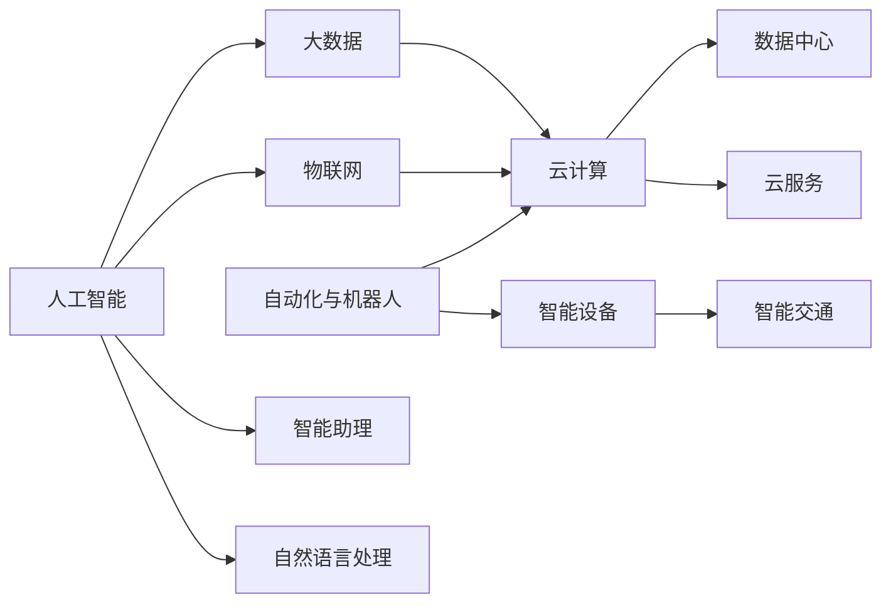

                 

# 未来的工作方式：2050年的职业选择与就业趋势

## 1. 背景介绍

### 1.1 问题由来
随着科技的迅猛发展，特别是人工智能、大数据、云计算、物联网等新兴技术的兴起，未来的工作方式正在经历翻天覆地的变化。这些技术的融合与创新，不仅极大地提高了工作效率，也深刻影响了职业选择的趋势和就业市场的动态。

### 1.2 问题核心关键点
未来职业选择与就业趋势的核心在于理解和掌握新兴技术的发展方向及其对各行各业的影响。这包括：
- **人工智能**：机器学习、深度学习、自然语言处理等技术的普及，将推动智能助理、自动化、智能制造等领域的发展。
- **大数据**：数据挖掘、数据治理、数据可视化等技术的进步，将使企业更加依赖数据驱动的决策。
- **云计算**：云计算平台的普及，将改变企业的IT基础设施建设与运维模式，推动云计算工程师、云安全、云架构师等职位的需求增长。
- **物联网**：智能设备、物联网生态系统的构建，将催生智能设备工程师、物联网系统架构师等新兴职位。
- **自动化与机器人**：工业自动化、服务机器人、智能交通等领域的快速发展，将需要更多的技术支持和专业人员。

### 1.3 问题研究意义
理解和掌握未来职业选择与就业趋势，对于个人职业规划、教育培训、政策制定等方面都具有重要意义：
- **个人职业发展**：帮助个人明确未来职业发展的方向，及时调整学习与技能提升计划。
- **教育培训**：指导教育机构更新课程内容，培养符合未来市场需求的复合型人才。
- **政策制定**：为政府和企业提供科学决策依据，推动政策制定与实施。

## 2. 核心概念与联系

### 2.1 核心概念概述

- **人工智能（AI）**：通过机器学习、深度学习等技术模拟人类智能行为，实现自主决策和问题解决。
- **大数据（Big Data）**：涉及数据采集、存储、处理、分析等，用于支持企业决策和优化运营。
- **云计算（Cloud Computing）**：通过互联网提供计算、存储、网络等服务，实现资源共享与灵活调度。
- **物联网（IoT）**：连接物理世界的设备与系统，实现设备互联、数据共享和智能控制。
- **自动化与机器人**：通过机器人和自动化技术替代人工，实现效率提升和成本降低。

这些技术之间的联系与交互构成了未来工作方式的核心。通过这些技术的融合与创新，将实现更高效、更智能、更环保的工作方式。

### 2.2 核心概念原理和架构的 Mermaid 流程图



这个流程图展示了人工智能、大数据、云计算、物联网、自动化与机器人等核心概念之间的联系与架构。

## 3. 核心算法原理 & 具体操作步骤

### 3.1 算法原理概述

未来职业选择与就业趋势的核心算法原理主要涉及以下几个方面：
- **机器学习与深度学习**：通过数据训练模型，实现自主决策和预测。
- **自然语言处理（NLP）**：理解和生成自然语言，实现人机交互。
- **数据挖掘与分析**：从大量数据中提取有价值的信息，支持决策和优化。
- **云平台管理**：通过云平台实现资源管理和调度，提高效率和可靠性。
- **物联网技术**：实现设备与系统的互联，推动智能控制和自动化。

### 3.2 算法步骤详解

1. **数据采集与处理**：
    - 收集行业相关的数据，如业务数据、用户数据、设备数据等。
    - 使用ETL工具进行数据清洗和转换，确保数据质量和一致性。
    - 使用大数据平台进行数据存储和管理，确保数据安全与高可用性。

2. **模型训练与优化**：
    - 使用机器学习或深度学习算法进行模型训练，优化模型性能。
    - 使用交叉验证、超参数调优等技术提升模型准确率和鲁棒性。
    - 将模型部署到云平台，实现灵活调度和高效计算。

3. **应用与集成**：
    - 将训练好的模型集成到实际应用中，实现智能决策、自动化控制等功能。
    - 通过API接口或微服务架构实现系统间的互联互通。
    - 使用物联网技术实现设备与系统的互联，推动智能控制和自动化。

4. **监测与优化**：
    - 实时监测系统性能和数据质量，及时发现和解决问题。
    - 根据业务需求和用户反馈，不断优化模型和系统。
    - 使用数据分析工具进行趋势分析和预测，指导未来决策。

### 3.3 算法优缺点

未来职业选择与就业趋势的算法具有以下优点：
- **高效性**：通过自动化和大数据技术，实现高效的数据处理和决策支持。
- **灵活性**：通过云计算平台，实现资源共享与灵活调度，适应业务变化。
- **智能化**：通过人工智能技术，实现自主决策和问题解决，提升工作效率和质量。

同时，也存在以下缺点：
- **高技术门槛**：需要具备较高的技术水平和专业技能，门槛较高。
- **数据安全与隐私**：涉及大量敏感数据，需要严格的数据保护和隐私政策。
- **技术依赖性强**：依赖于先进的技术工具和平台，一旦技术失效或停机，将影响正常工作。

### 3.4 算法应用领域

未来职业选择与就业趋势的算法广泛应用于以下几个领域：
- **智能制造**：通过自动化与机器人技术，实现生产线的智能控制和优化。
- **智慧医疗**：通过人工智能和大数据技术，实现精准诊断和治疗。
- **智慧城市**：通过物联网和云计算技术，实现城市管理的智能化和精细化。
- **金融科技**：通过大数据分析和人工智能技术，实现风险控制和精准营销。
- **智能交通**：通过物联网和自动驾驶技术，实现智能交通和智慧出行。

## 4. 数学模型和公式 & 详细讲解 & 举例说明

### 4.1 数学模型构建

未来职业选择与就业趋势的数学模型主要包括以下几个部分：
- **机器学习模型**：如线性回归、逻辑回归、支持向量机、决策树、随机森林等。
- **深度学习模型**：如卷积神经网络（CNN）、循环神经网络（RNN）、长短期记忆网络（LSTM）、生成对抗网络（GAN）等。
- **数据挖掘模型**：如关联规则、聚类分析、异常检测等。
- **云平台管理模型**：如资源调度、负载均衡、安全性管理等。
- **物联网技术模型**：如设备互联、数据传输、智能控制等。

### 4.2 公式推导过程

以线性回归模型为例，其数学公式为：

$$
y = \theta_0 + \theta_1 x_1 + \theta_2 x_2 + \ldots + \theta_n x_n + \epsilon
$$

其中，$y$为预测值，$\theta_0$为截距，$\theta_1, \theta_2, \ldots, \theta_n$为系数，$x_1, x_2, \ldots, x_n$为自变量，$\epsilon$为误差项。

### 4.3 案例分析与讲解

假设有一个智能工厂，使用机器学习模型对生产线的故障进行预测和维护。首先，通过数据采集和处理，收集生产线的故障数据，包括传感器数据、设备状态等。然后，使用线性回归模型进行故障预测，模型公式为：

$$
P(\text{故障}) = \theta_0 + \theta_1 T + \theta_2 P + \theta_3 E + \ldots
$$

其中，$P(\text{故障})$为故障发生的概率，$T$为时间，$P$为压力，$E$为能耗，$\theta_0, \theta_1, \theta_2, \ldots$为系数。通过模型训练和优化，可以预测生产线未来的故障发生概率，从而提前进行维护，避免停机损失。

## 5. 项目实践：代码实例和详细解释说明

### 5.1 开发环境搭建

以下是使用Python进行机器学习项目开发的开发环境配置流程：

1. 安装Anaconda：从官网下载并安装Anaconda，用于创建独立的Python环境。

2. 创建并激活虚拟环境：
```bash
conda create -n ml-env python=3.7 
conda activate ml-env
```

3. 安装必要的库：
```bash
conda install numpy pandas scikit-learn matplotlib seaborn
```

4. 安装机器学习框架：
```bash
pip install tensorflow keras tensorflow-addons
```

完成上述步骤后，即可在`ml-env`环境中进行机器学习项目开发。

### 5.2 源代码详细实现

下面以智能工厂生产线故障预测为例，给出使用TensorFlow进行机器学习项目开发的PyTorch代码实现。

```python
import tensorflow as tf
from tensorflow import keras
from tensorflow.keras import layers
from sklearn.model_selection import train_test_split
from sklearn.preprocessing import StandardScaler
import pandas as pd

# 读取数据
data = pd.read_csv('production_line_faults.csv')

# 数据预处理
features = data.drop('fault', axis=1)
labels = data['fault']
features, val_features, labels, val_labels = train_test_split(features, labels, test_size=0.2, random_state=42)

# 数据标准化
scaler = StandardScaler()
features = scaler.fit_transform(features)
val_features = scaler.transform(val_features)

# 模型构建
model = keras.Sequential([
    layers.Dense(64, activation='relu', input_shape=(features.shape[1],)),
    layers.Dense(32, activation='relu'),
    layers.Dense(1, activation='sigmoid')
])

# 模型编译
model.compile(optimizer='adam', loss='binary_crossentropy', metrics=['accuracy'])

# 模型训练
history = model.fit(features, labels, epochs=10, validation_data=(val_features, val_labels))

# 模型评估
test_features = scaler.transform(data[['T', 'P', 'E']])
test_labels = data['fault']
test_loss, test_acc = model.evaluate(test_features, test_labels)
print(f'Test accuracy: {test_acc}')
```

### 5.3 代码解读与分析

让我们再详细解读一下关键代码的实现细节：

**数据预处理**：
- 使用`pandas`库读取数据文件。
- 使用`train_test_split`函数将数据集分为训练集和验证集。
- 使用`StandardScaler`对数据进行标准化处理，确保数据在模型训练中的稳定性。

**模型构建**：
- 使用`keras.Sequential`定义模型结构，包含两个隐藏层和一个输出层。
- 使用`Dense`层实现全连接网络，激活函数使用ReLU和sigmoid。
- 使用`compile`方法编译模型，设置优化器、损失函数和评估指标。

**模型训练**：
- 使用`fit`方法训练模型，设置训练轮数和验证集。
- 使用`history`记录模型训练过程中的各项指标。

**模型评估**：
- 使用`evaluate`方法评估模型在测试集上的性能。
- 输出测试集上的准确率。

## 6. 实际应用场景

### 6.1 智能制造

智能制造领域将广泛应用机器学习和大数据技术，通过自动化与机器人技术实现生产线的智能控制和优化。智能制造系统可以实时监测设备状态，预测设备故障，提前进行维护，提高生产效率和质量。

### 6.2 智慧医疗

智慧医疗领域将通过人工智能和大数据技术实现精准诊断和治疗。智能医疗系统可以自动分析医疗影像，识别疾病风险，提供个性化诊疗方案，提升医疗服务质量和效率。

### 6.3 智慧城市

智慧城市领域将通过物联网和云计算技术实现城市管理的智能化和精细化。智慧城市系统可以实时监测交通流量、环境污染等城市运行数据，提供智能决策支持，提升城市治理水平。

### 6.4 金融科技

金融科技领域将通过大数据分析和人工智能技术实现风险控制和精准营销。金融科技系统可以实时监测市场动态，预测风险趋势，提供精准的金融产品推荐，提升金融服务质量和客户满意度。

### 6.5 智能交通

智能交通领域将通过物联网和自动驾驶技术实现智能交通和智慧出行。智能交通系统可以实时监测交通流量，优化交通信号，预测交通拥堵，提升交通安全和出行效率。

## 7. 工具和资源推荐

### 7.1 学习资源推荐

为了帮助开发者系统掌握未来职业选择与就业趋势的理论基础和实践技巧，这里推荐一些优质的学习资源：

1. **Coursera《机器学习》课程**：由斯坦福大学Andrew Ng教授主讲的经典课程，涵盖机器学习的基本概念和经典算法。
2. **Kaggle机器学习竞赛**：通过参加Kaggle比赛，提升实战经验，学习最新的算法和模型。
3. **DeepLearning.AI《深度学习专项课程》**：由深度学习领域的权威专家主讲的专项课程，涵盖深度学习的基础和前沿技术。
4. **TensorFlow官方文档**：TensorFlow的官方文档，提供了丰富的学习资源和样例代码。
5. **HuggingFace官方博客**：HuggingFace的官方博客，涵盖最新的自然语言处理技术进展和应用案例。

### 7.2 开发工具推荐

高效的开发离不开优秀的工具支持。以下是几款用于未来职业选择与就业趋势开发的工具：

1. **Jupyter Notebook**：强大的交互式开发环境，适合进行数据探索和算法实验。
2. **PyCharm**：功能强大的IDE，支持Python开发，提供代码调试和测试工具。
3. **Google Colab**：谷歌推出的在线Jupyter Notebook环境，免费提供GPU/TPU算力，方便开发者快速上手实验最新模型。
4. **GitHub**：代码托管平台，提供版本控制和协作开发功能，便于共享和维护代码。
5. **TensorBoard**：TensorFlow配套的可视化工具，可实时监测模型训练状态，并提供丰富的图表呈现方式。

### 7.3 相关论文推荐

未来职业选择与就业趋势的发展源于学界的持续研究。以下是几篇奠基性的相关论文，推荐阅读：

1. **《深度学习》（Ian Goodfellow、Yoshua Bengio和Aaron Courville著）**：全面介绍了深度学习的基本概念、算法和应用，是深度学习领域的经典教材。
2. **《大数据分析》（Joel Dean著）**：探讨了大数据分析的基本概念、技术和应用，提供了丰富的案例和实践指南。
3. **《云计算架构》（Yaniv Barak、Eyal Kalinik、Kefi K立方体K和Shoshan Avital著）**：全面介绍了云计算的基本概念、架构和技术，提供了实用的指导和案例。
4. **《物联网：原理与应用》（Nobel奖得主Seyhan Cem Sayginer和Odakar Bodur著）**：全面介绍了物联网的基本概念、技术和应用，提供了丰富的案例和实践指南。
5. **《自动驾驶技术》（Sebastian Thrun著）**：探讨了自动驾驶技术的基本概念、算法和应用，提供了实用的指导和案例。

这些论文代表了大数据、人工智能、云计算、物联网等领域的发展脉络。通过学习这些前沿成果，可以帮助研究者把握学科前进方向，激发更多的创新灵感。

## 8. 总结：未来发展趋势与挑战

### 8.1 总结

本文对未来职业选择与就业趋势进行了全面系统的介绍。首先阐述了未来职业选择与就业趋势的研究背景和意义，明确了人工智能、大数据、云计算、物联网等新兴技术在各个行业中的应用。其次，从原理到实践，详细讲解了未来职业选择与就业趋势的数学原理和关键步骤，给出了未来职业选择与就业趋势项目开发的完整代码实例。同时，本文还广泛探讨了未来职业选择与就业趋势在智能制造、智慧医疗、智慧城市、金融科技、智能交通等多个行业领域的应用前景，展示了未来职业选择与就业趋势的广阔前景。

通过本文的系统梳理，可以看到，未来职业选择与就业趋势正在迎来新的变革，这些技术的融合与创新将极大地提高工作效率，改变人们的工作方式，推动社会进步和经济发展。未来职业选择与就业趋势需要开发者根据具体行业和应用场景，不断迭代和优化模型、数据和算法，方能得到理想的效果。

### 8.2 未来发展趋势

展望未来，未来职业选择与就业趋势将呈现以下几个发展趋势：

1. **技术融合**：随着人工智能、大数据、云计算、物联网等技术的不断融合，未来工作方式将更加智能和高效。
2. **个性化服务**：通过数据分析和个性化算法，提供量身定制的个性化服务，提升用户体验。
3. **自动化与机器人**：自动化与机器人技术的应用将不断拓展，实现更多领域的智能化和自动化。
4. **人机协作**：通过人机协作技术，实现人与机器的深度合作，提升工作效率和质量。
5. **智能化管理**：通过智能化管理技术，实现企业的智能化运营和管理，提升企业竞争力。

### 8.3 面临的挑战

尽管未来职业选择与就业趋势在发展过程中展现了巨大的潜力，但也面临着诸多挑战：

1. **技术门槛高**：未来职业选择与就业趋势的技术涉及多个领域，需要较高的技术水平和专业技能。
2. **数据安全和隐私**：未来职业选择与就业趋势需要处理大量的敏感数据，数据安全和隐私保护问题亟待解决。
3. **技术依赖性强**：未来职业选择与就业趋势依赖于先进的技术工具和平台，技术失效或停机将影响正常工作。
4. **知识更新快**：未来职业选择与就业趋势的技术更新速度快，开发者需要不断学习和更新知识，保持竞争力。

### 8.4 研究展望

面对未来职业选择与就业趋势所面临的挑战，未来的研究需要在以下几个方面寻求新的突破：

1. **技术普适性**：开发更普适的技术，使得不同背景和技能的人员都能使用。
2. **数据安全与隐私保护**：研究数据安全和隐私保护技术，确保数据安全与隐私。
3. **人机协作**：研究人机协作技术，提升人与机器的协作效率和质量。
4. **智能化管理**：研究智能化管理技术，提升企业的智能化运营和管理水平。

这些研究方向的探索，必将引领未来职业选择与就业趋势迈向更高的台阶，为构建安全、可靠、高效、智能的未来工作方式提供新的技术路径。

## 9. 附录：常见问题与解答

**Q1：未来职业选择与就业趋势是否适用于所有行业？**

A: 未来职业选择与就业趋势的技术适用于大多数行业，尤其是涉及大量数据、自动化、智能化的领域。但一些传统行业，如农业、手工艺等，可能需要结合行业特点进行适当的技术改造和应用。

**Q2：未来职业选择与就业趋势的技术门槛是否较高？**

A: 是的，未来职业选择与就业趋势的技术涉及多个领域，需要较高的技术水平和专业技能。但随着技术的普及和工具的完善，技术门槛将逐渐降低。

**Q3：未来职业选择与就业趋势是否容易受到技术变化的影响？**

A: 是的，未来职业选择与就业趋势依赖于先进的技术工具和平台，技术变化将直接影响其应用效果。因此，持续的技术学习与跟进是必要的。

**Q4：未来职业选择与就业趋势的个性化服务是否容易实现？**

A: 是的，通过大数据分析和个性化算法，可以实现个性化服务的快速部署和优化。但需要充分收集用户数据，并确保数据安全和隐私保护。

**Q5：未来职业选择与就业趋势的自动化与机器人技术是否容易实现？**

A: 是的，自动化与机器人技术在制造业、服务业等领域已经得到广泛应用。但需要结合具体应用场景进行技术改造和优化，以实现最佳效果。

**Q6：未来职业选择与就业趋势的人机协作是否容易实现？**

A: 是的，人机协作技术已经取得显著进展，但在一些高复杂度的任务中，仍然需要人工干预和辅助。因此，人机协作需要结合具体应用场景进行设计和实现。

---

作者：禅与计算机程序设计艺术 / Zen and the Art of Computer Programming

