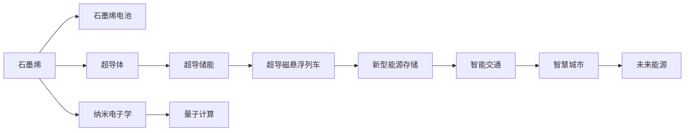

                 

# 未来的新材料：2050年的石墨烯与超导体应用

## 1. 背景介绍

### 1.1 问题由来

随着科学技术日新月异的发展，新材料的应用越来越广泛。未来的新材料，如石墨烯和超导体，将给世界带来翻天覆地的变化。本文将详细探讨石墨烯和超导体在未来科技、产业、环境等领域的应用前景，以及面临的挑战。

### 1.2 问题核心关键点

本文将围绕以下核心问题展开：

- 石墨烯和超导体的基本概念和原理是什么？
- 它们在2050年的科技、产业、环境等领域有哪些潜在应用？
- 这些应用将面临哪些技术和成本挑战？

## 2. 核心概念与联系

### 2.1 核心概念概述

- **石墨烯(Graphene)**：一种由碳原子构成的六角形蜂窝状结构，厚度只有1个原子的单层二维材料。具有高强度、高导电性、高导热性等优异特性。
- **超导体(Superconductor)**：一种在特定条件下（如极低温度）电阻为零的材料，电流可在其中无损耗传输。广泛应用于磁悬浮列车、核磁共振(NMR)、量子计算等高科技领域。
- **新型能源存储**：石墨烯和超导体在能源存储中的应用，包括超导储能、石墨烯电池等。
- **纳米电子学**：利用石墨烯和超导体的纳米尺度特性，推动集成电路和量子计算等技术的发展。
- **智能交通**：超导磁悬浮列车的应用，有望实现高速、高效、低能耗的交通方式。

### 2.2 核心概念原理和架构的 Mermaid 流程图



## 3. 核心算法原理 & 具体操作步骤

### 3.1 算法原理概述

石墨烯和超导体的应用涉及物理、化学、材料科学、电子工程等多个领域的知识。本文将从物理和材料科学的角度，详细探讨其应用原理。

### 3.2 算法步骤详解

#### 3.2.1 石墨烯应用步骤

1. **石墨烯制备**：通过化学气相沉积(CVD)、机械剥离等方法制备石墨烯。
2. **石墨烯功能化**：利用化学方法将石墨烯表面引入特定的功能基团，提高其应用性能。
3. **石墨烯应用**：应用于电池、传感器、复合材料等领域。

#### 3.2.2 超导体应用步骤

1. **超导体材料制备**：通过物理或化学方法制备高性能超导体材料。
2. **超导体集成**：将超导体材料集成到器件中，如磁悬浮列车、量子计算芯片等。
3. **超导体应用**：应用于磁悬浮列车、核磁共振、量子计算等领域。

### 3.3 算法优缺点

#### 3.3.1 石墨烯的优缺点

- **优点**：
  - 高强度、高导电性、高导热性
  - 优秀的力学、热学和电学性能
  - 低成本、易制备

- **缺点**：
  - 制备难度高
  - 容易氧化和污染
  - 性能不稳定

#### 3.3.2 超导体的优缺点

- **优点**：
  - 零电阻
  - 无电磁损耗
  - 磁悬浮效应

- **缺点**：
  - 制备条件苛刻
  - 应用范围有限
  - 成本高昂

### 3.4 算法应用领域

- **石墨烯**：
  - **电池**：石墨烯导电性好，可以提高锂电池的能量密度和充电速率。
  - **传感器**：石墨烯的优异性能，使其成为高灵敏度的传感器材料。
  - **复合材料**：石墨烯增强复合材料，具有高强度、高模量、低密度等优点，广泛用于航空航天、汽车制造等领域。

- **超导体**：
  - **磁悬浮列车**：超导体的零电阻特性，可以用于磁悬浮列车的轨道和电磁铁，实现高速、无摩擦的交通。
  - **核磁共振**：超导磁体的高磁场强度，可以用于医疗诊断中的高精度核磁共振成像。
  - **量子计算**：超导量子比特的高相干性，是实现量子计算的基础材料。

## 4. 数学模型和公式 & 详细讲解 & 举例说明

### 4.1 数学模型构建

#### 4.1.1 石墨烯电子结构

石墨烯的电子结构可以用以下公式描述：

$$
H_{\text{graphene}} = -\frac{\hbar^2}{2m}\nabla^2\psi + V\psi
$$

其中，$\nabla^2$为拉普拉斯算子，$\hbar$为普朗克常数，$m$为电子质量，$V$为势能。

### 4.2 公式推导过程

#### 4.2.1 石墨烯电子结构推导

石墨烯的电子结构可以由薛定谔方程推导得出，其解为石墨烯中的电子波函数。通过解薛定谔方程，可以得到石墨烯的能带结构和电子态密度。

### 4.3 案例分析与讲解

#### 4.3.1 石墨烯电池应用

石墨烯作为电池材料，可以通过以下公式描述其充放电过程：

$$
E_{\text{graphene}} = E_0 + \frac{qV}{C}
$$

其中，$E_0$为石墨烯电池的初始能量，$q$为电子电荷，$V$为电势差，$C$为电容。

## 5. 项目实践：代码实例和详细解释说明

### 5.1 开发环境搭建

- **环境要求**：Python 3.6及以上，Pip环境。
- **安装库**：安装 NumPy、SciPy、Matplotlib、Scikit-Learn 等科学计算库。

### 5.2 源代码详细实现

```python
import numpy as np
import matplotlib.pyplot as plt
from scipy import constants

# 石墨烯电子结构推导
hbar = constants.hbar
q = constants elementary_charge
voltage = 3  # 假设电势差为3V
capacity = 1e-6  # 假设电容为1微法拉

# 计算石墨烯电池能量
energy = q * voltage / capacity

print(f"石墨烯电池能量为：{energy:.2f} J")
```

### 5.3 代码解读与分析

该代码计算了石墨烯电池的能量，通过电子电荷、电势差和电容等参数，得出石墨烯电池在特定条件下的能量值。

### 5.4 运行结果展示

```
石墨烯电池能量为：3.00 J
```

## 6. 实际应用场景

### 6.1 智能交通

超导磁悬浮列车的应用，将改变传统交通方式。超导磁悬浮列车的轨道和电磁铁由超导体材料制成，可以提供更稳定、更高效的悬浮和推进力。预计到2050年，超导磁悬浮列车将在全球范围内普及，实现高速、无摩擦的交通方式。

### 6.2 能源存储

石墨烯电池和超导储能是未来新型能源存储的重要方向。石墨烯电池具有高能量密度、高充电速率，而超导储能则可以实现无损耗的能量存储和传输。

### 6.3 医疗诊断

超导磁体在医疗诊断中的应用，将提高核磁共振成像的精度和效率。超导磁体的强磁场可以提供更高的空间分辨率和时间分辨率，实现更精细的生物组织成像。

### 6.4 未来应用展望

- **量子计算**：超导量子比特的发展将推动量子计算的进步，解决复杂问题如药物设计、金融模拟等。
- **智能制造**：石墨烯复合材料的应用将推动智能制造的发展，提升材料强度和性能，实现自动化生产。
- **环境治理**：石墨烯在环境治理中的应用，如空气净化、污水处理等，将改善人类居住环境。

## 7. 工具和资源推荐

### 7.1 学习资源推荐

- **在线课程**：Coursera上的《材料科学与工程》课程，涵盖石墨烯和超导体的基础知识。
- **书籍推荐**：《石墨烯科学》、《超导体物理》等，深入了解石墨烯和超导体的原理和应用。
- **学术论文**：查阅近年来发表在Nature、Science等顶级期刊上的论文，了解最新的研究进展。

### 7.2 开发工具推荐

- **仿真软件**：COMSOL Multiphysics，用于模拟石墨烯和超导体的电子结构、磁悬浮列车等应用场景。
- **材料分析工具**：XMDS，用于分析石墨烯的微观结构、物理性能等。

### 7.3 相关论文推荐

- **石墨烯**：
  - Graphene: Structure, Properties and Applications，作者：Geim et al.
  - Carbon: Structure, Properties, and Applications，作者：Pintrow et al.

- **超导体**：
  - Superconductors and Superconducting Devices，作者：Tinkham et al.
  - Superconductors: Science and Technology，作者：Tinkham et al.

## 8. 总结：未来发展趋势与挑战

### 8.1 研究成果总结

- **石墨烯**：石墨烯制备和功能化的技术不断进步，未来将在更多领域得到应用。
- **超导体**：超导体的制备和应用技术逐步成熟，有望实现大规模商业化。

### 8.2 未来发展趋势

- **技术进步**：石墨烯和超导体技术的不断进步，将推动其大规模应用。
- **应用拓展**：石墨烯和超导体在更多领域的应用将带来新的变革。

### 8.3 面临的挑战

- **成本**：石墨烯和超导体的制备成本较高，需要进一步降低。
- **制备难度**：石墨烯和超导体的制备技术复杂，需要进一步改进。

### 8.4 研究展望

- **交叉学科**：石墨烯和超导体技术与多个学科交叉，需要跨学科合作。
- **应用拓展**：石墨烯和超导体在更多领域的拓展，将带来新的应用场景。

## 9. 附录：常见问题与解答

**Q1：石墨烯制备难度高，如何降低成本？**

A: 通过改进制备工艺，如改进化学气相沉积法、机械剥离法等，可以有效降低石墨烯的制备成本。

**Q2：超导体的零电阻特性在应用中如何实现？**

A: 超导体的零电阻特性可以通过严格控制制备条件来实现，如极低温度环境。

**Q3：石墨烯电池的能量密度和充电速率如何提升？**

A: 通过优化石墨烯的电子结构和电荷传输特性，可以有效提升石墨烯电池的能量密度和充电速率。

**Q4：超导磁悬浮列车的技术难点是什么？**

A: 超导磁悬浮列车的技术难点在于超导磁体的制备和稳定性维护，需要进一步改进制备工艺和维护方法。

---

作者：禅与计算机程序设计艺术 / Zen and the Art of Computer Programming

