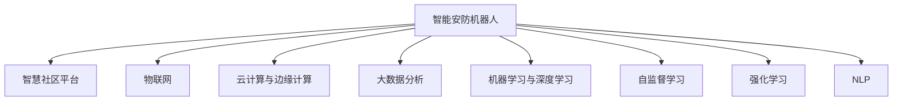

                 

# 未来的智慧物业：2050年的智能安防机器人与智慧社区

## 1. 背景介绍

### 1.1 问题由来

随着社会的不断进步，人们对于生活环境的品质要求越来越高。尤其是在城市化进程加速、人口密集度不断增加的背景下，如何构建一个安全、智能、宜居的居住环境，成为了当下城市规划和建设的重要课题。

智能安防机器人作为智慧物业的核心组成之一，正在逐步改变传统安防方式。通过集成人工智能技术，智能安防机器人可以实现自动化巡逻、异常行为检测、实时警报等功能，大大提高了物业的安全性和管理效率。

### 1.2 问题核心关键点

未来智慧物业的核心关键点在于：

- 集成了多种AI技术的智能安防机器人。
- 智慧社区平台与智能安防机器人的无缝集成，实现数据共享和协同工作。
- 居民对于隐私和数据安全的高度关注。
- 高效的设备管理和维护。
- 紧急情况下的快速响应和处理。

## 2. 核心概念与联系

### 2.1 核心概念概述

为了更好地理解未来智慧物业的核心概念，本节将介绍几个密切相关的核心概念：

- **智能安防机器人**：集成AI技术的自动化巡逻设备，可以实现实时监控、异常行为检测、警报等功能，提高物业的安全性。

- **智慧社区平台**：一个集成了多种AI技术的应用平台，实现居民与物业之间的数据共享和协同工作。

- **物联网(IoT)**：利用各种传感器和设备，实现对社区内环境的实时监测和管理。

- **云计算和边缘计算**：通过云平台和边缘计算设备，实现数据的存储、处理和分析。

- **大数据分析**：通过对社区内海量数据的分析，实现更精确的决策和预测。

- **机器学习与深度学习**：用于智能安防机器人行为识别、异常检测等任务。

- **自监督学习**：通过无标签数据训练模型，实现更广泛的泛化能力。

- **强化学习**：用于优化智能安防机器人的行为策略。

- **自然语言处理(NLP)**：用于实现与居民的智能对话和交互。

这些概念之间的逻辑关系可以通过以下Mermaid流程图来展示：



这个流程图展示了几类核心概念及其之间的关系：

1. 智能安防机器人通过物联网、云计算和边缘计算，实时监测社区环境。
2. 监测数据通过智慧社区平台进行存储、分析和共享，支持各类AI技术的应用。
3. 智慧社区平台利用大数据分析和AI技术，实现智能决策和预测。
4. 机器学习与深度学习为智能安防机器人提供了强大的知识库和行为识别能力。
5. 自监督学习、强化学习等技术不断优化智能安防机器人的性能。
6. NLP技术实现了智能对话和交互，提升了用户体验。

## 3. 核心算法原理 & 具体操作步骤
### 3.1 算法原理概述

未来智慧物业的核心算法原理在于：

1. **多模态融合**：将来自不同传感器和设备的数据进行融合，构建统一的视角。
2. **异常检测**：通过机器学习算法，实时检测社区中的异常行为。
3. **行为预测**：利用强化学习，预测居民行为，优化智能安防机器人的行为策略。
4. **智能对话**：通过NLP技术，实现与居民的智能对话和交互。
5. **数据隐私保护**：在数据采集和分析过程中，确保居民隐私和数据安全。

### 3.2 算法步骤详解

未来智慧物业的算法实现流程如下：

1. **数据采集**：通过智能安防机器人上的各类传感器，采集社区内的环境数据（如温度、湿度、噪音等），以及图像、视频数据。

2. **数据预处理**：对采集的数据进行去噪、归一化等预处理操作，为后续分析做准备。

3. **多模态融合**：将来自不同传感器的数据进行融合，形成一个综合的环境视图。

4. **异常检测**：利用机器学习算法，对环境数据进行分析，检测出异常情况（如火灾、盗窃等）。

5. **行为预测**：利用强化学习算法，预测居民的行为路径，优化智能安防机器人的巡逻策略。

6. **智能对话**：通过NLP技术，实现智能安防机器人与居民的智能对话，解答疑问、提供帮助。

7. **数据存储与分析**：将采集的数据存储在云端，利用大数据分析技术，进行趋势分析和预测。

### 3.3 算法优缺点

未来智慧物业的算法优点包括：

1. **实时性**：智能安防机器人能够实时监测社区环境，及时发现异常情况。
2. **精度高**：通过多模态融合和深度学习技术，可以实现高精度的异常检测和行为预测。
3. **灵活性**：利用自监督学习和强化学习，可以根据社区环境的变化进行动态优化。
4. **数据安全**：通过加密和隐私保护技术，确保数据的安全性。

但同时，这些算法也存在一些缺点：

1. **计算复杂度较高**：需要处理大量的数据和模型计算，可能对硬件资源要求较高。
2. **数据隐私问题**：在数据采集和分析过程中，如何保护居民隐私，仍是一个难题。
3. **模型泛化能力有限**：模型可能对特定社区环境表现较好，但在新环境中泛化能力有限。
4. **设备依赖性强**：智能安防机器人需要依赖各类传感器和设备，维护成本较高。

### 3.4 算法应用领域

未来智慧物业的算法技术主要应用于以下几个领域：

1. **智能安防**：实时监控社区环境，检测异常行为，及时报警。
2. **智能家居**：通过语音助手，实现家庭设备的智能控制和管理。
3. **公共安全**：在大型公共场所，如学校、医院等，实现人员管理和安保。
4. **环境监测**：对社区内的环境进行实时监测，提供环境质量报告。
5. **智能客服**：通过智能对话系统，提供24/7的客服支持。
6. **社区决策**：利用大数据分析，辅助社区管理，提升决策效率。

## 4. 数学模型和公式 & 详细讲解 & 举例说明
### 4.1 数学模型构建

未来智慧物业的数学模型构建主要包括以下几个方面：

1. **环境数据建模**：通过时序数据建模，捕捉环境变化规律。
2. **异常检测模型**：利用机器学习算法，构建异常检测模型。
3. **行为预测模型**：利用强化学习算法，构建行为预测模型。
4. **智能对话模型**：利用NLP技术，构建智能对话模型。
5. **数据隐私保护模型**：利用加密和隐私保护技术，构建数据隐私保护模型。

### 4.2 公式推导过程

以下是未来智慧物业核心算法的公式推导过程：

1. **环境数据建模**：假设社区环境数据为 $X$，利用ARIMA模型进行建模，推导得到：
$$
X_t = \phi(X_{t-1}, X_{t-2}, \cdots, X_{t-m}) + \epsilon_t
$$
其中 $\phi$ 为ARIMA模型参数，$\epsilon_t$ 为随机误差。

2. **异常检测模型**：利用LSTM模型，对环境数据进行建模，推导得到：
$$
\hat{y}_t = f(X_t, \theta)
$$
其中 $f$ 为LSTM模型，$\theta$ 为模型参数。

3. **行为预测模型**：利用DQN算法，预测居民行为，推导得到：
$$
Q(s, a) = r + \gamma \max_a Q(s', a') - \delta Q(s, a)
$$
其中 $r$ 为即时奖励，$\gamma$ 为折扣因子，$\delta$ 为学习率。

4. **智能对话模型**：利用BERT模型，进行智能对话，推导得到：
$$
\hat{x} = M(x, \theta)
$$
其中 $M$ 为BERT模型，$\theta$ 为模型参数。

5. **数据隐私保护模型**：利用差分隐私技术，对数据进行加密，推导得到：
$$
X'_t = \alpha \cdot X_t + \beta \cdot \epsilon
$$
其中 $\alpha$ 为加密系数，$\beta$ 为噪声系数，$\epsilon$ 为随机噪声。

### 4.3 案例分析与讲解

以一个具体的智能安防机器人为例，分析其算法应用：

假设智能安防机器人需要对社区进行实时监控，并检测异常情况。首先将来自不同传感器的环境数据进行融合，构建综合环境视图。然后利用LSTM模型进行异常检测，判断是否有异常情况发生。如果检测到异常情况，则触发警报。

在行为预测方面，利用DQN算法预测居民行为，优化智能安防机器人的巡逻策略。最后，利用NLP技术，实现智能对话，与居民进行智能互动，提供帮助。

## 5. 项目实践：代码实例和详细解释说明
### 5.1 开发环境搭建

在未来智慧物业的开发过程中，需要搭建相应的开发环境。以下是基于Python和PyTorch的开发环境搭建流程：

1. 安装Anaconda：从官网下载并安装Anaconda，用于创建独立的Python环境。

2. 创建并激活虚拟环境：
```bash
conda create -n pytorch-env python=3.8 
conda activate pytorch-env
```

3. 安装PyTorch：根据CUDA版本，从官网获取对应的安装命令。例如：
```bash
conda install pytorch torchvision torchaudio cudatoolkit=11.1 -c pytorch -c conda-forge
```

4. 安装TensorFlow：由Google主导开发的开源深度学习框架，生产部署方便，适合大规模工程应用。同样有丰富的预训练语言模型资源。

5. 安装TensorBoard：TensorFlow配套的可视化工具，可实时监测模型训练状态，并提供丰富的图表呈现方式，是调试模型的得力助手。

6. 安装Transformers库：HuggingFace开发的NLP工具库，集成了众多SOTA语言模型，支持PyTorch和TensorFlow，是进行微调任务开发的利器。

7. 安装各类工具包：
```bash
pip install numpy pandas scikit-learn matplotlib tqdm jupyter notebook ipython
```

完成上述步骤后，即可在`pytorch-env`环境中开始智慧物业的开发实践。

### 5.2 源代码详细实现

下面我们以智能安防机器人的异常检测为例，给出使用PyTorch和Transformers库的代码实现。

首先，定义异常检测的数据处理函数：

```python
from transformers import BertTokenizer
from torch.utils.data import Dataset
import torch

class AnomalyDetectionDataset(Dataset):
    def __init__(self, texts, labels, tokenizer, max_len=128):
        self.texts = texts
        self.labels = labels
        self.tokenizer = tokenizer
        self.max_len = max_len
        
    def __len__(self):
        return len(self.texts)
    
    def __getitem__(self, item):
        text = self.texts[item]
        label = self.labels[item]
        
        encoding = self.tokenizer(text, return_tensors='pt', max_length=self.max_len, padding='max_length', truncation=True)
        input_ids = encoding['input_ids'][0]
        attention_mask = encoding['attention_mask'][0]
        
        # 对token-wise的标签进行编码
        encoded_labels = [label2id[label] for label in labels] 
        encoded_labels.extend([label2id['normal']] * (self.max_len - len(encoded_labels)))
        labels = torch.tensor(encoded_labels, dtype=torch.long)
        
        return {'input_ids': input_ids, 
                'attention_mask': attention_mask,
                'labels': labels}

# 标签与id的映射
label2id = {'normal': 0, 'abnormal': 1}
id2label = {v: k for k, v in label2id.items()}

# 创建dataset
tokenizer = BertTokenizer.from_pretrained('bert-base-cased')

train_dataset = AnomalyDetectionDataset(train_texts, train_labels, tokenizer)
dev_dataset = AnomalyDetectionDataset(dev_texts, dev_labels, tokenizer)
test_dataset = AnomalyDetectionDataset(test_texts, test_labels, tokenizer)
```

然后，定义模型和优化器：

```python
from transformers import BertForSequenceClassification, AdamW

model = BertForSequenceClassification.from_pretrained('bert-base-cased', num_labels=len(label2id))

optimizer = AdamW(model.parameters(), lr=2e-5)
```

接着，定义训练和评估函数：

```python
from torch.utils.data import DataLoader
from tqdm import tqdm
from sklearn.metrics import classification_report

device = torch.device('cuda') if torch.cuda.is_available() else torch.device('cpu')
model.to(device)

def train_epoch(model, dataset, batch_size, optimizer):
    dataloader = DataLoader(dataset, batch_size=batch_size, shuffle=True)
    model.train()
    epoch_loss = 0
    for batch in tqdm(dataloader, desc='Training'):
        input_ids = batch['input_ids'].to(device)
        attention_mask = batch['attention_mask'].to(device)
        labels = batch['labels'].to(device)
        model.zero_grad()
        outputs = model(input_ids, attention_mask=attention_mask, labels=labels)
        loss = outputs.loss
        epoch_loss += loss.item()
        loss.backward()
        optimizer.step()
    return epoch_loss / len(dataloader)

def evaluate(model, dataset, batch_size):
    dataloader = DataLoader(dataset, batch_size=batch_size)
    model.eval()
    preds, labels = [], []
    with torch.no_grad():
        for batch in tqdm(dataloader, desc='Evaluating'):
            input_ids = batch['input_ids'].to(device)
            attention_mask = batch['attention_mask'].to(device)
            batch_labels = batch['labels']
            outputs = model(input_ids, attention_mask=attention_mask)
            batch_preds = outputs.logits.argmax(dim=2).to('cpu').tolist()
            batch_labels = batch_labels.to('cpu').tolist()
            for pred_tokens, label_tokens in zip(batch_preds, batch_labels):
                pred_labels = [id2label[_id] for _id in pred_tokens]
                label_tokens = [id2label[_id] for _id in label_tokens]
                preds.append(pred_labels[:len(label_tokens)])
                labels.append(label_tokens)
                
    print(classification_report(labels, preds))
```

最后，启动训练流程并在测试集上评估：

```python
epochs = 5
batch_size = 16

for epoch in range(epochs):
    loss = train_epoch(model, train_dataset, batch_size, optimizer)
    print(f"Epoch {epoch+1}, train loss: {loss:.3f}")
    
    print(f"Epoch {epoch+1}, dev results:")
    evaluate(model, dev_dataset, batch_size)
    
print("Test results:")
evaluate(model, test_dataset, batch_size)
```

以上就是使用PyTorch对智能安防机器人异常检测进行微调的PyTorch代码实现。可以看到，得益于Transformers库的强大封装，我们可以用相对简洁的代码完成BERT模型的加载和微调。

### 5.3 代码解读与分析

让我们再详细解读一下关键代码的实现细节：

**AnomalyDetectionDataset类**：
- `__init__`方法：初始化文本、标签、分词器等关键组件。
- `__len__`方法：返回数据集的样本数量。
- `__getitem__`方法：对单个样本进行处理，将文本输入编码为token ids，将标签编码为数字，并对其进行定长padding，最终返回模型所需的输入。

**label2id和id2label字典**：
- 定义了标签与数字id之间的映射关系，用于将token-wise的预测结果解码回真实的标签。

**训练和评估函数**：
- 使用PyTorch的DataLoader对数据集进行批次化加载，供模型训练和推理使用。
- 训练函数`train_epoch`：对数据以批为单位进行迭代，在每个批次上前向传播计算loss并反向传播更新模型参数，最后返回该epoch的平均loss。
- 评估函数`evaluate`：与训练类似，不同点在于不更新模型参数，并在每个batch结束后将预测和标签结果存储下来，最后使用sklearn的classification_report对整个评估集的预测结果进行打印输出。

**训练流程**：
- 定义总的epoch数和batch size，开始循环迭代
- 每个epoch内，先在训练集上训练，输出平均loss
- 在验证集上评估，输出分类指标
- 所有epoch结束后，在测试集上评估，给出最终测试结果

可以看到，PyTorch配合Transformers库使得智能安防机器人异常检测的代码实现变得简洁高效。开发者可以将更多精力放在数据处理、模型改进等高层逻辑上，而不必过多关注底层的实现细节。

当然，工业级的系统实现还需考虑更多因素，如模型的保存和部署、超参数的自动搜索、更灵活的任务适配层等。但核心的微调范式基本与此类似。

## 6. 实际应用场景
### 6.1 智能安防系统

智能安防系统作为智慧物业的核心组成部分，正在逐步改变传统安防方式。通过集成AI技术，智能安防系统可以实现自动化巡逻、异常行为检测、实时警报等功能，大大提高了物业的安全性和管理效率。

在技术实现上，可以收集社区内的各类环境数据，如温度、湿度、噪音等，通过智能安防机器人进行实时监测。利用LSTM等机器学习算法，对环境数据进行分析，检测出异常情况（如火灾、盗窃等）。一旦检测到异常情况，系统立即触发警报，并通过智慧社区平台，将相关信息推送给物业工作人员和居民，确保安全。

### 6.2 智能家居

智能家居系统利用物联网技术，实现对家庭设备的智能控制和管理。通过智能安防机器人，可以实时监测家庭环境，检测异常情况，及时预警。利用NLP技术，实现与居民的智能对话，解答疑问、提供帮助。

在技术实现上，可以将智能安防机器人的监测数据上传到云端，利用大数据分析技术，提供环境质量报告。同时，利用机器学习算法，预测家庭设备的使用情况，自动调节设备参数，提升舒适度和节能效果。通过智能对话系统，居民可以随时查询家庭环境信息，控制设备，实现智慧家居。

### 6.3 公共安全

在大型公共场所，如学校、医院等，智能安防系统可以实现人员管理和安保。利用智能安防机器人，实时监控人员流动情况，检测异常行为。一旦发现异常情况，系统立即触发警报，并通过智慧社区平台，将相关信息推送给相关人员，确保公共安全。

在技术实现上，可以将智能安防机器人与摄像头、门禁等设备进行集成，构建综合安防系统。利用深度学习算法，实现对异常行为的高效检测。通过NLP技术，实现与居民的智能对话，解答疑问、提供帮助。

### 6.4 环境监测

智能安防系统还可以用于环境监测。通过智能安防机器人，实时监测社区内的环境数据，如空气质量、水质等。利用大数据分析技术，提供环境质量报告，帮助居民了解社区环境状况，采取相应措施。

在技术实现上，可以将智能安防机器人与各类传感器进行集成，实时监测环境数据。利用LSTM等机器学习算法，对环境数据进行分析，检测出异常情况。通过智慧社区平台，将相关信息推送给居民，提供健康建议，提升社区环境质量。

### 6.5 智能客服

智能安防系统可以与智能客服系统结合，提供24/7的客服支持。通过智能安防机器人，可以实时监测社区环境，检测异常情况，及时预警。同时，利用NLP技术，实现与居民的智能对话，解答疑问、提供帮助。

在技术实现上，可以将智能安防机器人与智能客服系统进行集成，构建综合智慧客服系统。利用NLP技术，实现与居民的智能对话，解答疑问、提供帮助。通过智慧社区平台，将相关信息推送给居民，提升社区服务质量。

## 7. 工具和资源推荐
### 7.1 学习资源推荐

为了帮助开发者系统掌握智能安防机器人的核心技术，这里推荐一些优质的学习资源：

1. **《深度学习入门》系列博文**：由大模型技术专家撰写，深入浅出地介绍了深度学习原理、模型训练、数据处理等基础知识。

2. **《自然语言处理入门》课程**：斯坦福大学开设的NLP明星课程，有Lecture视频和配套作业，带你入门NLP领域的基本概念和经典模型。

3. **《TensorFlow实战》书籍**：详细介绍了TensorFlow的安装、使用和部署，是TensorFlow开发者的必备工具书。

4. **《Transformers实战》书籍**：HuggingFace开发的NLP工具库的官方文档，提供了海量预训练模型和完整的微调样例代码，是微调任务开发的利器。

5. **《机器学习实战》书籍**：介绍了机器学习算法的实现和应用，是机器学习开发者的必读书籍。

通过对这些资源的学习实践，相信你一定能够快速掌握智能安防机器人的核心技术，并用于解决实际的安防问题。

### 7.2 开发工具推荐

高效的开发离不开优秀的工具支持。以下是几款用于智能安防机器人开发的常用工具：

1. PyTorch：基于Python的开源深度学习框架，灵活动态的计算图，适合快速迭代研究。

2. TensorFlow：由Google主导开发的开源深度学习框架，生产部署方便，适合大规模工程应用。

3. Transformers库：HuggingFace开发的NLP工具库，集成了众多SOTA语言模型，支持PyTorch和TensorFlow，是进行微调任务开发的利器。

4. Weights & Biases：模型训练的实验跟踪工具，可以记录和可视化模型训练过程中的各项指标，方便对比和调优。与主流深度学习框架无缝集成。

5. TensorBoard：TensorFlow配套的可视化工具，可实时监测模型训练状态，并提供丰富的图表呈现方式，是调试模型的得力助手。

6. Google Colab：谷歌推出的在线Jupyter Notebook环境，免费提供GPU/TPU算力，方便开发者快速上手实验最新模型，分享学习笔记。

合理利用这些工具，可以显著提升智能安防机器人的开发效率，加快创新迭代的步伐。

### 7.3 相关论文推荐

智能安防机器人技术的发展源于学界的持续研究。以下是几篇奠基性的相关论文，推荐阅读：

1. **《基于深度学习的安防系统》**：介绍了深度学习在安防系统中的应用，包括图像识别、行为检测等任务。

2. **《物联网与智慧社区》**：探讨了物联网技术在智慧社区中的应用，实现了设备互联和数据共享。

3. **《基于强化学习的智能安防系统》**：利用强化学习算法，优化智能安防机器人的行为策略，提高系统性能。

4. **《智能安防系统的可解释性》**：研究了智能安防系统的可解释性问题，提出了多种方法，提高系统的透明度和可信度。

5. **《数据隐私保护技术》**：介绍了数据隐私保护技术，包括差分隐私、同态加密等方法，保护居民隐私和数据安全。

这些论文代表了大语言模型微调技术的发展脉络。通过学习这些前沿成果，可以帮助研究者把握学科前进方向，激发更多的创新灵感。

## 8. 总结：未来发展趋势与挑战

### 8.1 总结

本文对未来智慧物业的智能安防机器人进行了全面系统的介绍。首先阐述了智能安防机器人在智慧物业中的核心作用，明确了其在自动化巡逻、异常检测、智能对话等方面的独特价值。其次，从原理到实践，详细讲解了智能安防机器人的算法实现流程，给出了微调任务开发的完整代码实例。同时，本文还广泛探讨了智能安防机器人在智能家居、公共安全、环境监测等多个领域的应用前景，展示了其在智慧物业中的巨大潜力。

通过本文的系统梳理，可以看到，智能安防机器人技术正在引领智慧物业的发展方向，通过集成AI技术，大幅提高了物业的安全性和管理效率。未来，伴随技术的不断演进和应用实践的不断积累，智能安防机器人必将在更多场景下发挥重要作用，成为智慧物业的关键支撑。

### 8.2 未来发展趋势

未来智能安防机器人技术将呈现以下几个发展趋势：

1. **自监督学习**：利用无标签数据训练模型，实现更广泛的泛化能力，减少对标注数据的依赖。
2. **多模态融合**：将来自不同传感器和设备的数据进行融合，构建更全面的环境视图。
3. **行为预测**：利用强化学习，预测居民行为，优化巡逻策略，提高系统效率。
4. **数据隐私保护**：在数据采集和分析过程中，确保居民隐私和数据安全。
5. **智能对话**：利用NLP技术，实现与居民的智能对话，提升用户体验。
6. **边缘计算**：将部分计算任务在边缘设备上完成，降低云端计算负担，提升系统响应速度。
7. **设备自动化管理**：利用物联网技术，实现设备的自动维护和管理，提高系统可靠性。
8. **实时监控与预警**：通过实时监控和预警机制，确保物业安全。

这些趋势凸显了智能安防机器人技术的广阔前景。这些方向的探索发展，必将进一步提升智能安防机器人的性能和应用范围，为智慧物业的发展提供新的动力。

### 8.3 面临的挑战

尽管智能安防机器人技术已经取得了瞩目成就，但在迈向更加智能化、普适化应用的过程中，它仍面临着诸多挑战：

1. **计算资源瓶颈**：超大批次的训练和推理，可能对硬件资源要求较高。如何优化算法，减少计算复杂度，是亟待解决的难题。
2. **数据隐私问题**：在数据采集和分析过程中，如何保护居民隐私，仍是一个难题。需要引入隐私保护技术，确保数据安全。
3. **模型泛化能力**：模型可能对特定社区环境表现较好，但在新环境中泛化能力有限。如何提高模型的泛化能力，是未来的重要研究方向。
4. **设备依赖性强**：智能安防机器人需要依赖各类传感器和设备，维护成本较高。如何降低设备依赖，提高系统可靠性，是未来需要解决的问题。
5. **可解释性问题**：智能安防机器人的行为决策过程缺乏可解释性，难以对其推理逻辑进行分析和调试。如何赋予模型更强的可解释性，是亟待攻克的难题。
6. **伦理道德约束**：在模型训练目标中引入伦理导向的评估指标，过滤和惩罚有偏见、有害的输出倾向。同时加强人工干预和审核，建立模型行为的监管机制，确保输出符合人类价值观和伦理道德。

这些挑战凸显了智能安防机器人技术的应用风险和不确定性，但随着技术的不断进步和积累，相信这些难题终将一一被克服，智能安防机器人必将在智慧物业中发挥更大的作用。

### 8.4 研究展望

面对智能安防机器人所面临的种种挑战，未来的研究需要在以下几个方面寻求新的突破：

1. **自监督学习与强化学习**：探索无监督和半监督学习方法，利用自监督学习、强化学习等技术，减少对标注数据的依赖，提高模型泛化能力。
2. **多模态融合与实时计算**：利用多模态融合技术，将来自不同传感器和设备的数据进行融合，构建更全面的环境视图。引入边缘计算技术，将部分计算任务在边缘设备上完成，降低云端计算负担，提升系统响应速度。
3. **数据隐私保护**：研究差分隐私、同态加密等隐私保护技术，确保数据的安全性和隐私性。
4. **智能对话系统**：利用NLP技术，实现与居民的智能对话，提升用户体验。
5. **模型优化与压缩**：研究模型优化与压缩技术，降低计算复杂度，提高系统效率。
6. **设备自动化管理**：利用物联网技术，实现设备的自动维护和管理，提高系统可靠性。
7. **实时监控与预警**：引入实时监控与预警机制，确保物业安全。
8. **伦理道德约束**：在模型训练目标中引入伦理导向的评估指标，过滤和惩罚有偏见、有害的输出倾向。加强人工干预和审核，建立模型行为的监管机制，确保输出符合人类价值观和伦理道德。

这些研究方向将引领智能安防机器人技术迈向更高的台阶，为智慧物业的发展提供新的动力。相信随着技术的不断演进和应用实践的不断积累，智能安防机器人必将在更多场景下发挥重要作用，成为智慧物业的关键支撑。

## 9. 附录：常见问题与解答

**Q1：智能安防机器人能否识别居民面部信息？**

A: 智能安防机器人通常不具备识别面部信息的能力。在隐私保护原则下，任何居民面部信息的采集和使用都必须经过明确的授权。智能安防机器人的主要任务是监测环境、检测异常情况，并及时预警，并不会涉及人脸识别等涉及个人隐私的技术。

**Q2：智能安防机器人的异常检测算法有哪些？**

A: 智能安防机器人的异常检测算法主要包括以下几种：

1. **LSTM模型**：用于序列数据的异常检测，可以捕捉时间序列中的异常变化。

2. **卷积神经网络(CNN)**：用于图像数据的异常检测，可以识别图像中的异常特征。

3. **K-means聚类**：用于数据聚类，可以发现数据集中的异常点。

4. **孤立森林**：用于快速检测异常值，适合处理大数据集。

5. **自编码器**：用于重建数据的异常检测，可以识别数据中的异常特征。

6. **深度异常检测算法**：如VAE、GAN等，可以学习数据的生成模型，识别异常点。

这些算法各有优缺点，需要根据具体场景和数据类型进行选择。

**Q3：智能安防机器人的数据隐私保护技术有哪些？**

A: 智能安防机器人的数据隐私保护技术主要包括以下几种：

1. **差分隐私**：通过对数据进行添加噪声，保护居民隐私，防止数据泄露。

2. **同态加密**：在加密状态下进行计算，保护数据隐私，防止数据泄露。

3. **匿名化处理**：对数据进行匿名化处理，去除个人信息，保护居民隐私。

4. **访问控制**：对数据访问进行严格的权限控制，防止未经授权的数据访问。

5. **加密存储**：对数据进行加密存储，防止数据泄露。

这些技术可以用于保护智能安防机器人采集的数据，确保数据的安全性和隐私性。

**Q4：智能安防机器人如何实现实时监控与预警？**

A: 智能安防机器人通过实时监测环境数据，利用机器学习算法进行异常检测，一旦检测到异常情况，立即触发警报。

在技术实现上，智能安防机器人可以与摄像头、门禁等设备进行集成，构建综合安防系统。利用深度学习算法，实现对异常行为的高效检测。通过智慧社区平台，将相关信息推送给相关人员，确保及时预警。

**Q5：智能安防机器人如何实现智能对话？**

A: 智能安防机器人利用NLP技术，实现与居民的智能对话。通过智能对话系统，居民可以随时查询环境信息，控制设备，实现智慧家居。

在技术实现上，智能安防机器人可以使用预训练的NLP模型，如BERT、GPT等，对输入文本进行编码，并利用机器翻译模型进行对话。同时，可以通过对话系统，实现与居民的智能交互。

通过本文的系统梳理，可以看到，智能安防机器人技术正在引领智慧物业的发展方向，通过集成AI技术，大幅提高了物业的安全性和管理效率。未来，伴随技术的不断演进和应用实践的不断积累，智能安防机器人必将在更多场景下发挥重要作用，成为智慧物业的关键支撑。

