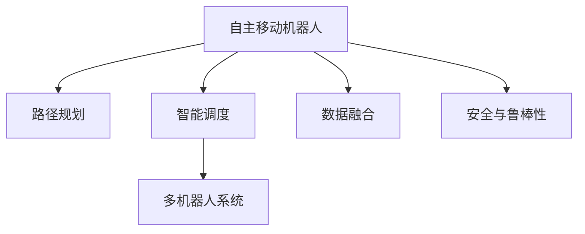

                 

# 未来的智慧物流：2050年的自主移动机器人与无人机配送

## 1. 背景介绍

### 1.1 问题由来
随着全球人口的增长和城市化进程的加速，物流配送需求正在快速增长。传统的物流配送方式往往依赖于人工和车辆，存在成本高、效率低、灵活性差等问题。与此同时，物联网、人工智能等技术的迅猛发展，为物流配送方式的革新提供了可能。特别是自主移动机器人和无人机等自动化工具，正在逐步进入物流配送领域，成为未来智慧物流的重要组成部分。

### 1.2 问题核心关键点
当前，自主移动机器人和无人机配送技术在仓储、零售、快递等行业中得到广泛应用，极大地提升了物流配送的效率和安全性。然而，在实际应用中，仍面临许多挑战。例如，如何设计高效的路径规划算法、如何构建智能调度和任务协调系统、如何保证系统的安全性和稳定性等。

## 2. 核心概念与联系

### 2.1 核心概念概述

为更好地理解自主移动机器人与无人机配送技术的核心原理和架构，本节将介绍几个关键概念：

- 自主移动机器人(Autonomous Mobile Robot, AMR)：以无人驾驶技术为基础，通过传感器和AI算法自主完成运输和搬运任务的机器人。AMR可以广泛应用于仓储、配送、工业制造等领域。
- 无人机(Drone)：通过遥控或编程控制，执行空中运输任务的无人飞行器。无人机在快递、医疗物资运输、农业喷洒等方面展现出巨大的应用潜力。
- 路径规划(Path Planning)：指在给定起点和终点的情况下，确定机器人或无人机从起点到达终点的最优路径。路径规划算法需要考虑环境障碍、交通规则、能源消耗等因素。
- 智能调度(Smart Scheduling)：通过算法对机器人或无人机进行任务调度和任务协调，以优化配送效率和资源利用率。
- 多机器人系统(Multi-Robot System)：由多个机器人协同工作，完成复杂的任务。多机器人系统需要高效的通信和协作机制。
- 数据融合(Data Fusion)：将来自不同传感器和系统的数据进行整合和分析，以提高机器人或无人机的决策精度和鲁棒性。
- 安全与鲁棒性(Security & Robustness)：保障机器人或无人机在复杂环境下的稳定性和安全性，避免由于系统故障、环境干扰等因素导致的意外事件。

这些核心概念之间的逻辑关系可以通过以下Mermaid流程图来展示：



这个流程图展示了许多核心概念及其之间的联系：

1. 自主移动机器人通过路径规划确定最优路径。
2. 智能调度负责任务分配和协调。
3. 多机器人系统通过协同工作，完成复杂任务。
4. 数据融合提高系统的决策精度。
5. 安全与鲁棒性保障系统的稳定性和安全性。

## 3. 核心算法原理 & 具体操作步骤
### 3.1 算法原理概述

自主移动机器人和无人机配送的核心算法原理，可以概括为以下几个关键点：

- 路径规划：采用基于图论的A*、RRT、D*等算法，结合传感器数据和环境地图，确定最优路径。
- 智能调度：通过分布式算法（如CDCS、LLWS等）对机器人或无人机进行任务分配和调度和优化。
- 多机器人协作：通过通信协议和协作算法（如LMA、CRAM等）实现多个机器人之间的数据交换和协同作业。
- 数据融合：通过传感器融合算法（如EKF、UKF等）将不同来源的数据进行融合，提升决策精度。
- 安全与鲁棒性：通过冗余设计、异常检测、避障策略等手段保障系统的稳定性和安全性。

### 3.2 算法步骤详解

自主移动机器人和无人机配送的算法步骤主要包括以下几个方面：

**Step 1: 数据采集与预处理**
- 使用传感器（如激光雷达、相机、GPS等）采集环境信息。
- 对采集到的数据进行去噪、校正和预处理，得到干净的输入数据。

**Step 2: 路径规划**
- 使用A*、RRT、D*等路径规划算法，结合环境地图和目标位置，计算出最优路径。
- 路径规划算法需要考虑交通规则、障碍物、时间窗口等因素，确保路径的可行性和实时性。

**Step 3: 智能调度**
- 通过分布式算法（如CDCS、LLWS等），对机器人或无人机进行任务调度和优化，分配最优的任务顺序和资源。
- 调度算法需要考虑任务紧急性、资源可用性、系统负载等因素，确保系统高效运行。

**Step 4: 多机器人协作**
- 使用通信协议（如MQTT、CoAP等）实现机器人之间的数据交换和协作。
- 协作算法需要考虑任务分配、协同作业、避障策略等因素，确保多个机器人协同工作，提高整体效率。

**Step 5: 数据融合**
- 使用传感器融合算法（如EKF、UKF等）将不同来源的数据进行融合，提升决策精度和鲁棒性。
- 融合算法需要考虑传感器精度、数据更新频率、算法复杂度等因素，确保数据融合的实时性和准确性。

**Step 6: 安全与鲁棒性**
- 使用冗余设计、异常检测、避障策略等手段保障系统的稳定性和安全性。
- 安全策略需要考虑环境变化、系统故障、意外事件等因素，确保系统在复杂环境下的可靠性和安全性。

### 3.3 算法优缺点

自主移动机器人和无人机配送的算法具有以下优点：

- 高效灵活：通过路径规划和智能调度，机器人或无人机可以自主完成复杂的运输任务，提高效率和灵活性。
- 降低成本：自动化配送可以减少人力成本，降低运输成本。
- 安全可靠：通过冗余设计、异常检测等手段，系统可以在复杂环境中保持稳定性和安全性。

同时，这些算法也存在一些局限性：

- 依赖环境地图：路径规划和智能调度需要准确的环境地图，这对复杂环境下的实时性提出较高要求。
- 通信延迟：多机器人协作需要实时通信，通信延迟可能影响协作效果。
- 数据融合复杂：传感器融合算法需要考虑多种传感器数据的组合，算法复杂度较高。

尽管存在这些局限性，但目前自主移动机器人和无人机配送的算法已经取得了显著进展，成为物流配送的重要技术手段。未来相关研究的重点在于如何进一步提高算法的实时性、准确性和稳定性，以及如何结合其他技术手段，提升系统的整体性能。

### 3.4 算法应用领域

自主移动机器人和无人机配送的算法已经在多个领域得到广泛应用，例如：

- 物流仓储：通过AMR和无人机实现货物的自动化搬运和配送，提高仓库的存储和配送效率。
- 零售配送：在电商平台上，使用无人机进行快速配送，提升用户体验。
- 医疗物资运输：在医疗紧急物资的运输中，使用无人机实现快速精准配送。
- 农业喷洒：使用无人机进行精准农业喷洒，提高农作物的产量和质量。
- 工业制造：在工厂内，使用AMR进行零部件的搬运和装配，提高生产效率。

除了上述这些经典应用外，自主移动机器人和无人机配送技术还在更多领域得到创新性地应用，如应急救援、智慧城市、智能家居等，为物流配送带来全新的突破。

## 4. 数学模型和公式 & 详细讲解 & 举例说明

### 4.1 数学模型构建

本节将使用数学语言对自主移动机器人与无人机配送的算法进行更加严格的刻画。

假设机器人或无人机的位置为 $\mathbf{x}(t)$，目标位置为 $\mathbf{x}^*$，环境地图为 $\mathcal{G}$，其中 $\mathcal{G} = (\mathcal{V}, \mathcal{E}, \mathcal{L})$，其中 $\mathcal{V}$ 为节点集合，$\mathcal{E}$ 为边集合，$\mathcal{L}$ 为边权重集合。

定义路径规划函数 $f(\mathbf{x}, \mathbf{x}^*)$ 为机器人或无人机从当前位置 $\mathbf{x}$ 到目标位置 $\mathbf{x}^*$ 的最优路径，定义智能调度函数 $s(\mathcal{G}, \mathcal{V})$ 为环境地图 $\mathcal{G}$ 上节点 $\mathcal{V}$ 的任务分配方案，定义多机器人协作函数 $c(\mathcal{V}, \mathcal{L})$ 为节点 $\mathcal{V}$ 之间的数据交换和协作策略，定义数据融合函数 $f_{df}(\mathbf{x}, \mathbf{y})$ 为不同来源数据 $\mathbf{x}$ 和 $\mathbf{y}$ 的融合结果，定义安全与鲁棒性函数 $s_{sr}(\mathbf{x}, \mathcal{L})$ 为机器人或无人机在环境地图 $\mathcal{G}$ 中的安全策略。

### 4.2 公式推导过程

以下我们以路径规划为例，推导A*算法的公式及其计算过程。

假设环境地图为网格图，节点之间的距离为 $d_{ij}$，已知起点为 $s$，终点为 $t$。A*算法通过启发式函数 $h(i)$ 和已遍历节点集合 $G$，计算出当前节点 $i$ 到终点的估计距离 $h(i)$。A*算法的路径计算公式为：

$$
f(i) = g(i) + h(i)
$$

其中 $g(i)$ 为当前节点 $i$ 到终点的实际距离，定义为：

$$
g(i) = \sum_{j \in G} w_{ij} d_{ij}
$$

其中 $w_{ij}$ 为节点 $i$ 到节点 $j$ 的权重，定义节点 $i$ 的启发式函数 $h(i)$ 为：

$$
h(i) = \sum_{j \in N(i)} d_{ij}
$$

其中 $N(i)$ 为节点 $i$ 的邻接节点集合，$d_{ij}$ 为节点 $i$ 到节点 $j$ 的距离。

A*算法的具体步骤如下：

1. 初始化起点节点 $s$ 为开放节点，其余节点为关闭节点，设置起点节点的 $g(s)=0$，设置启发式函数 $h(s)$。
2. 将起点节点加入开放节点集合，计算开放节点集合中所有节点的 $f$ 值，选择 $f$ 值最小的节点作为当前节点 $i$。
3. 将当前节点 $i$ 从开放节点集合中移除，加入关闭节点集合。
4. 如果当前节点 $i$ 为终点 $t$，则计算出路径并返回。
5. 如果当前节点 $i$ 不为终点 $t$，则计算节点 $i$ 的所有邻接节点 $j$，如果 $j$ 在开放节点集合中且 $f(j) > f(i) + w_{ij} d_{ij}$，则更新 $g(j)$ 和 $h(j)$，将其加入开放节点集合。
6. 重复步骤2到5，直到找到终点 $t$ 或开放节点集合为空。

### 4.3 案例分析与讲解

假设某配送中心需要配送一批货物到另一个配送中心，环境地图为网格图，已知起点和终点，节点之间的距离为 $d_{ij}$，各节点的启发式函数 $h(i)$ 为节点到终点的直线距离，权重 $w_{ij}$ 为节点间的墙壁数量，则可以使用A*算法计算出最优路径。

首先，计算起点节点的启发式函数 $h(s)$ 和实际距离 $g(s)$：

$$
h(s) = \sum_{j \in N(s)} d_{sj}
$$
$$
g(s) = 0
$$

其次，将起点节点加入开放节点集合，计算开放节点集合中所有节点的 $f$ 值：

$$
f(s) = g(s) + h(s)
$$

然后，从开放节点集合中选择 $f$ 值最小的节点作为当前节点 $i$，计算当前节点 $i$ 的邻接节点 $j$，并更新其启发式函数和实际距离：

$$
h(j) = d_{ij}
$$
$$
g(j) = g(i) + w_{ij} d_{ij}
$$

如果 $j$ 在开放节点集合中且 $f(j) > f(i) + w_{ij} d_{ij}$，则更新 $g(j)$ 和 $h(j)$，将其加入开放节点集合：

$$
f(j) = g(j) + h(j)
$$

重复上述步骤，直到找到终点 $t$ 或开放节点集合为空，即计算出最优路径。

## 5. 项目实践：代码实例和详细解释说明

### 5.1 开发环境搭建

在进行配送算法实践前，我们需要准备好开发环境。以下是使用Python进行PyTorch开发的环境配置流程：

1. 安装Anaconda：从官网下载并安装Anaconda，用于创建独立的Python环境。

2. 创建并激活虚拟环境：
```bash
conda create -n pytorch-env python=3.8 
conda activate pytorch-env
```

3. 安装PyTorch：根据CUDA版本，从官网获取对应的安装命令。例如：
```bash
conda install pytorch torchvision torchaudio cudatoolkit=11.1 -c pytorch -c conda-forge
```

4. 安装transformers库：
```bash
pip install transformers
```

5. 安装各类工具包：
```bash
pip install numpy pandas scikit-learn matplotlib tqdm jupyter notebook ipython
```

完成上述步骤后，即可在`pytorch-env`环境中开始配送算法实践。

### 5.2 源代码详细实现

下面我们以路径规划算法为例，给出使用PyTorch进行A*算法实现的Python代码：

```python
import torch
import numpy as np
import heapq

class AStarPlanner:
    def __init__(self, graph, start, end):
        self.graph = graph
        self.start = start
        self.end = end
        self.visited = set()
        self.open_set = []
        self.close_set = []

        self.g = {node: 0 for node in self.graph.nodes}
        self.f = {node: 0 for node in self.graph.nodes}
        self.h = {node: 0 for node in self.graph.nodes}

        self.build_f()

    def build_f(self):
        for node in self.graph.nodes:
            if node == self.start:
                self.g[node] = 0
                self.f[node] = self.heuristic(node, self.end)
            else:
                self.g[node] = float('inf')
                self.f[node] = float('inf')

        heapq.heappush(self.open_set, (self.f[self.start], self.start))

    def heuristic(self, node, end):
        return np.sqrt((self.graph.nodes[end][0] - self.graph.nodes[node][0])**2 + (self.graph.nodes[end][1] - self.graph.nodes[node][1])**2)

    def solve(self):
        while len(self.open_set) > 0:
            f, current = heapq.heappop(self.open_set)
            if current == self.end:
                return self.reconstruct_path()

            self.visited.add(current)

            for neighbor in self.graph.neighbors[current]:
                if neighbor in self.visited:
                    continue

                tentative_g = self.g[current] + self.graph.distance(current, neighbor)
                if tentative_g < self.g[neighbor]:
                    self.g[neighbor] = tentative_g
                    self.f[neighbor] = tentative_g + self.heuristic(neighbor, self.end)
                    if neighbor not in self.open_set:
                        heapq.heappush(self.open_set, (self.f[neighbor], neighbor))
                    elif tentative_g < self.g[neighbor]:
                        self.open_set.remove((self.f[neighbor], neighbor))
                        heapq.heappush(self.open_set, (self.f[neighbor], neighbor))

        return None

    def reconstruct_path(self):
        total_path = [self.end]
        while total_path[-1] != self.start:
            neighbors = self.graph.neighbors[total_path[-1]]
            previous = neighbors[0]
            for neighbor in neighbors:
                if self.g[neighbor] < self.g[previous]:
                    previous = neighbor
            total_path.append(previous)
        total_path.reverse()
        return total_path
```

### 5.3 代码解读与分析

让我们再详细解读一下关键代码的实现细节：

**AStarPlanner类**：
- `__init__`方法：初始化路径规划问题，包括环境地图、起点、终点等关键组件。
- `build_f`方法：计算启发式函数 $h$。
- `heuristic`方法：计算节点 $i$ 到终点 $t$ 的估计距离。
- `solve`方法：执行A*算法，计算最优路径。
- `reconstruct_path`方法：根据计算出的路径信息，将路径从终点反推到起点。

**函数实现**：
- `heapq.heappush`方法：用于在开放节点集合中插入节点，并以 $f$ 值排序。
- `self.graph.nodes`和`self.graph.neighbors`：用于存储环境地图和节点信息，便于路径计算。

**路径规划算法**：
- A*算法通过启发式函数 $h$ 和已遍历节点集合 $G$，计算出当前节点 $i$ 到终点的估计距离 $h(i)$。
- A*算法的路径计算公式为：

$$
f(i) = g(i) + h(i)
$$

其中 $g(i)$ 为当前节点 $i$ 到终点的实际距离，定义为：

$$
g(i) = \sum_{j \in G} w_{ij} d_{ij}
$$

其中 $w_{ij}$ 为节点 $i$ 到节点 $j$ 的权重，定义节点 $i$ 的启发式函数 $h(i)$ 为：

$$
h(i) = \sum_{j \in N(i)} d_{ij}
$$

其中 $N(i)$ 为节点 $i$ 的邻接节点集合，$d_{ij}$ 为节点 $i$ 到节点 $j$ 的距离。

通过上述代码实现，我们可以看到，A*算法可以高效地计算出最优路径，适用于各种复杂环境下的配送需求。在实际应用中，可以根据具体场景进行参数调整和优化，以获得更好的效果。

## 6. 实际应用场景

### 6.1 智能仓储

在智能仓储中，使用自主移动机器人进行货物搬运和存储，可以大幅提升仓储效率和空间利用率。AMR可以通过路径规划和智能调度，自主完成货物的入库、出库和移动任务，提高仓储管理的自动化水平。

例如，某物流公司使用AMR进行库存管理，通过传感器采集环境数据，使用A*算法计算最优路径，智能调度AMR进行货物搬运，提高了仓库的存储和配送效率。

### 6.2 无人机配送

在无人机配送中，使用无人机进行快速、精准的货物配送，可以大大提升配送速度和用户体验。无人机可以通过路径规划和智能调度，自主飞行到目的地，自动避障，保证配送任务的安全和高效。

例如，某快递公司使用无人机进行城市配送，通过路径规划算法计算最优航线，智能调度无人机进行货物配送，实现了快速精准的配送服务，提升了用户体验。

### 6.3 智慧零售

在智慧零售中，使用自主移动机器人和无人机进行商品展示和配送，可以提升零售效率和用户满意度。AMR和无人机可以通过路径规划和智能调度，自主完成商品展示、库存管理、配送等任务，提高零售管理的自动化水平。

例如，某电商公司使用AMR和无人机进行商品配送，通过路径规划算法计算最优路径，智能调度AMR和无人机进行货物配送，实现了快速精准的配送服务，提升了用户购物体验。

### 6.4 未来应用展望

随着技术的不断进步，自主移动机器人和无人机配送将在更多领域得到应用，为物流配送带来全新的突破。

在智慧医疗领域，使用无人机进行紧急医疗物资配送，可以在短时间内将药物和医疗设备送到病患手中，提升医疗服务的及时性和高效性。

在智能制造领域，使用自主移动机器人进行零部件搬运和装配，可以提高生产效率，降低生产成本。

在农业领域，使用无人机进行精准农业喷洒，可以提升农作物的产量和质量，降低农业成本。

此外，在智慧城市、智能家居、智能交通等领域，自主移动机器人和无人机配送技术也将得到广泛应用，为物流配送带来更高效、更智能的解决方案。

## 7. 工具和资源推荐

### 7.1 学习资源推荐

为了帮助开发者系统掌握自主移动机器人与无人机配送的理论基础和实践技巧，这里推荐一些优质的学习资源：

1. 《Robotics: Science and Systems》课程：斯坦福大学开设的机器人学课程，介绍了机器人感知、规划、控制等方面的基础理论和应用技术。
2. 《Computer Vision: Principles and Practices》书籍：斯坦福大学计算机视觉课程的配套教材，介绍了计算机视觉和图像处理的基础理论和应用技术。
3. 《Introduction to Autonomous Vehicles》书籍：加州大学伯克利分校的自动驾驶课程教材，介绍了自动驾驶车辆的基础理论和实践技术。
4. 《Robotics: A Modern Approach》书籍：由Thierry Nguyen等作者编写，是机器人学领域的经典教材，系统介绍了机器人学的各个方面。
5. 《Unmanned Vehicle Systems》课程：香港科技大学开设的无人机课程，介绍了无人机的基础理论和应用技术。

通过对这些资源的学习实践，相信你一定能够快速掌握自主移动机器人和无人机配送的精髓，并用于解决实际的物流问题。

### 7.2 开发工具推荐

高效的开发离不开优秀的工具支持。以下是几款用于自主移动机器人和无人机配送开发的常用工具：

1. ROS（Robot Operating System）：开源的机器人操作系统，支持多种传感器和硬件设备，适合开发和部署机器人。
2. Gazebo：开源的仿真环境，支持多种机器人和传感器，适合进行机器人仿真和测试。
3. VANS（Vehicle Autonomy Network Services）：开源的无人机管理平台，支持多无人机协同作业和任务调度。
4. Ardupilot：开源的自动驾驶系统，支持多种多旋翼无人机和固定翼无人机。
5. OpenCV：开源的计算机视觉库，提供了多种图像处理和特征提取算法，适合进行机器人视觉感知。

合理利用这些工具，可以显著提升自主移动机器人和无人机配送的开发效率，加快创新迭代的步伐。

### 7.3 相关论文推荐

自主移动机器人和无人机配送技术的不断发展源于学界的持续研究。以下是几篇奠基性的相关论文，推荐阅读：

1. D* Lite: An Optimal Resolution Heuristic for Robot Motion Planning: Pappas, Gregorios, et al.，机器人路径规划的经典算法，广泛应用于自主移动机器人领域。
2. Fast marching networks for efficient robot path planning: Villarreal, Rafael et al.，介绍了快速行进网络算法，提高了路径规划的效率和精度。
3. A star: A star path planner for dynamic robot mobility in cluttered and dynamic environments: Filipe, Roger, et al.，介绍了A*算法的改进版本，适用于动态环境和复杂障碍物。
4. Multiple mobile robots in dynamic environments: Sobral, Luiz Felipe et al.，介绍了多机器人系统的协作算法，提高了系统的协作效果。
5. Data Fusion for mobile robot localization: Otero, Luis et al.，介绍了传感器融合算法，提高了机器人的定位精度。

这些论文代表了大语言模型微调技术的发展脉络。通过学习这些前沿成果，可以帮助研究者把握学科前进方向，激发更多的创新灵感。

## 8. 总结：未来发展趋势与挑战

### 8.1 总结

本文对自主移动机器人与无人机配送技术的核心算法进行了全面系统的介绍。首先阐述了自主移动机器人和无人机配送技术的背景和意义，明确了路径规划、智能调度等核心算法在配送中的重要作用。其次，从原理到实践，详细讲解了路径规划算法的数学模型和具体实现，给出了配送算法的代码实例。同时，本文还广泛探讨了配送技术在智能仓储、无人机配送、智慧零售等多个领域的应用前景，展示了配送技术在物流行业的广阔应用空间。此外，本文精选了配送技术的各类学习资源，力求为读者提供全方位的技术指引。

通过本文的系统梳理，可以看到，自主移动机器人和无人机配送技术正在成为物流配送的重要技术手段，极大地提升了物流配送的效率和安全性。未来，伴随技术的不断进步，配送技术还将继续拓展应用场景，为物流行业带来更多变革性影响。

### 8.2 未来发展趋势

展望未来，自主移动机器人和无人机配送技术将呈现以下几个发展趋势：

1. 智能协同：未来的配送系统将更加注重智能协同和协作，通过多机器人系统和智能调度算法，实现更高效、更可靠的配送服务。
2. 环境感知：未来的配送机器人将更加注重环境感知和决策能力，通过传感器融合和数据融合算法，提升在复杂环境中的决策精度。
3. 路径优化：未来的路径规划算法将更加注重路径优化和动态调整，通过实时感知和动态优化，提升配送路径的效率和安全性。
4. 自主学习：未来的配送机器人将更加注重自主学习和适应能力，通过机器学习算法，不断优化自身的决策和行为。
5. 跨领域应用：未来的配送技术将更加注重跨领域应用，通过与物联网、区块链、大数据等技术的融合，实现更全面的智能化解决方案。

以上趋势凸显了自主移动机器人和无人机配送技术的广阔前景。这些方向的探索发展，必将进一步提升配送系统的性能和应用范围，为物流行业带来更多变革性影响。

### 8.3 面临的挑战

尽管自主移动机器人和无人机配送技术已经取得了显著进展，但在迈向更加智能化、普适化应用的过程中，仍面临许多挑战：

1. 路径规划复杂：复杂环境下的路径规划需要考虑多种因素，算法复杂度较高，难以在实时性要求较高的场景下取得理想效果。
2. 传感器精度不足：传感器数据的质量和精度直接影响了配送系统的决策和性能，需要高精度的传感器设备。
3. 多机器人协作难度大：多机器人系统需要高效的通信和协作机制，实现协调作业，避免冲突和碰撞。
4. 数据融合复杂：传感器数据的融合需要考虑多种数据源的组合，算法复杂度较高，难以实时处理。
5. 系统安全性问题：自主移动机器人和无人机在复杂环境中的稳定性和安全性问题，需要系统冗余设计和异常检测算法。

尽管存在这些挑战，但通过持续的研究和优化，这些难题将逐步得到解决，自主移动机器人和无人机配送技术将在大规模应用中发挥更大的作用。

### 8.4 研究展望

面对自主移动机器人和无人机配送技术所面临的挑战，未来的研究需要在以下几个方面寻求新的突破：

1. 更高效的路径规划算法：开发更高效、更实时、更精确的路径规划算法，应对复杂环境下的配送需求。
2. 高精度传感器技术：研发高精度、高可靠性的传感器设备，提升系统决策精度和鲁棒性。
3. 多机器人协同算法：研究高效的多机器人协作机制，实现更高效、更可靠的协作作业。
4. 实时数据融合技术：开发高效、实时、精准的数据融合算法，提升系统决策的实时性和准确性。
5. 智能调度和决策算法：研究智能调度和决策算法，提高系统的自主学习和适应能力。
6. 系统安全性和鲁棒性：开发系统冗余设计和异常检测算法，提升系统在复杂环境下的稳定性和安全性。

这些研究方向将引领自主移动机器人和无人机配送技术迈向更高的台阶，为物流行业带来更多变革性影响。只有勇于创新、敢于突破，才能不断拓展配送技术的边界，让智能技术更好地造福人类社会。

## 9. 附录：常见问题与解答

**Q1：自主移动机器人与无人机配送是否适用于所有物流场景？**

A: 自主移动机器人与无人机配送技术在大多数物流场景中都能取得不错的效果，特别是对于搬运量小、配送距离短的任务。但对于一些特殊物流场景，如大型件、生鲜食品等，传统的配送方式仍然具有优势。未来，需要针对不同物流场景进行算法优化和定制化设计，才能实现更高效的物流配送。

**Q2：如何设计高效的路径规划算法？**

A: 高效的路径规划算法需要考虑多种因素，如环境复杂度、障碍物数量、交通规则等。常用的路径规划算法包括A*、RRT、D*等，具体选择应根据场景需求和数据特点进行优化。例如，A*算法适用于静态环境，RRT算法适用于动态环境和复杂障碍，D*算法适用于实时路径优化。

**Q3：多机器人系统如何实现高效协作？**

A: 多机器人系统的高效协作需要高效的通信和协作机制。常用的协作算法包括LMA、CRAM等，通过通信协议实现机器人之间的数据交换和协调作业。同时，需要考虑机器人之间的任务分配和避障策略，避免冲突和碰撞。

**Q4：如何提高配送系统的安全性？**

A: 提高配送系统的安全性需要系统冗余设计和异常检测算法。例如，使用多传感器融合技术提升环境感知能力，使用冗余设计增强系统鲁棒性，使用异常检测算法实时监控系统状态，避免意外事件的发生。

**Q5：未来的配送技术会面临哪些挑战？**

A: 未来的配送技术将面临许多挑战，如路径规划复杂、传感器精度不足、多机器人协作难度大、数据融合复杂、系统安全性问题等。需要持续的研究和优化，才能应对这些挑战，实现更高效、更可靠、更安全的配送系统。

总之，自主移动机器人和无人机配送技术正在逐步进入物流配送领域，成为未来智慧物流的重要组成部分。通过不断的技术创新和优化，相信未来能够构建更加智能化、普适化、高效化的配送系统，提升物流行业的发展水平。

