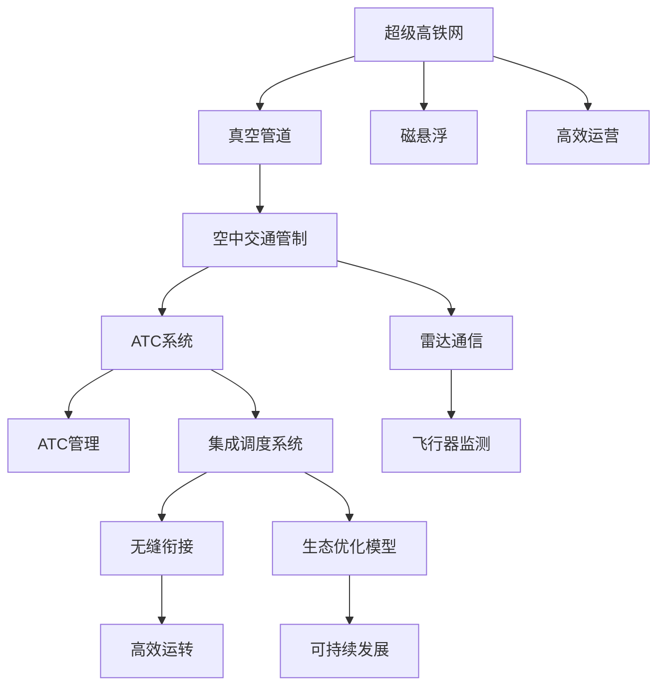

                 

# 未来的智能交通：2050年的超级高铁网与空中交通管制

## 1. 背景介绍

### 1.1 问题由来
随着城市化进程的不断加快，交通拥堵、环境污染和能源浪费等城市交通问题愈发严峻，传统交通系统面临巨大挑战。如何在2050年以前构建一个高效、绿色、智能的交通系统，成为摆在各国政府和研究者面前的重要课题。为此，我们需要一套涵盖陆上和空中的未来智能交通网络，既能高效地运送大量人员，又能有效减少对环境的影响。

### 1.2 问题核心关键点
要构建未来的智能交通网络，我们需要从多个维度进行研究和突破，包括但不限于：

- **超级高铁网（Hyperloop Network）**：基于真空管道和磁悬浮技术的超高速列车系统，能够实现陆地间快速、高效、低成本的交通。
- **空中交通管制（Air Traffic Control, ATC）**：利用先进的通信和控制技术，优化空中交通流程，减少延误和事故发生率。
- **智能交通管理系统（Intelligent Transportation System, ITS）**：融合信息技术和传感器网络，实现交通流预测、交通信号优化等功能。

这些技术系统共同构成了一个高效的智能交通生态，将极大地改善城市交通状况，提升市民出行体验。

### 1.3 问题研究意义
构建2050年的超级高铁网与空中交通管制系统，对于推动社会经济发展、改善城市环境、提升居民生活质量具有深远意义：

- **提升城市效率**：通过高效运输系统，减少交通拥堵和事故，提升城市运行效率，促进经济增长。
- **减少环境污染**：采用低能耗、零排放的交通方式，减少温室气体排放，应对气候变化。
- **提高出行体验**：提供快速、安全、舒适的交通服务，提升市民出行体验和满意度。
- **推动科技创新**：推动交通领域的技术创新和产业升级，为相关领域带来新的发展机遇。

## 2. 核心概念与联系

### 2.1 核心概念概述

为更好地理解2050年超级高铁网与空中交通管制的系统构建，本节将介绍几个关键概念：

- **超级高铁网（Hyperloop Network）**：基于真空管道和磁悬浮技术的超高速列车系统，能够在真空管道内以极高速度运行，提供接近光速的快速运输。
- **空中交通管制（Air Traffic Control, ATC）**：通过雷达、通信网络等技术手段，对飞行器进行实时监控和管理，保障飞行安全与效率。
- **智能交通管理系统（Intelligent Transportation System, ITS）**：融合信息技术和传感器网络，实现交通流预测、交通信号优化等功能。
- **集成调度系统（Integrated Scheduling System）**：将超级高铁网与空中交通管制系统进行统一调度，实现无缝衔接和高效运转。
- **生态优化模型（Ecological Optimization Model）**：考虑环境影响和社会效益，对交通网络进行综合优化，以实现可持续发展的目标。

这些概念之间的逻辑关系可以通过以下Mermaid流程图来展示：



这个流程图展示了几项核心概念及其之间的关系：

1. 超级高铁网通过真空管道和磁悬浮技术实现高效运输。
2. 空中交通管制利用雷达、通信等技术保障飞行安全。
3. 智能交通管理系统融合信息技术和传感器网络，优化交通流。
4. 集成调度系统将超级高铁网与空中交通管制系统进行统一调度。
5. 生态优化模型考虑环境和社会效益，实现可持续发展。

这些概念共同构成了未来智能交通的架构，旨在实现高效、绿色、智能的交通系统。

## 3. 核心算法原理 & 具体操作步骤
### 3.1 算法原理概述

未来智能交通系统的构建，涉及多项关键技术，包括但不限于：

- **超级高铁网（Hyperloop Network）**：基于真空管道和磁悬浮技术的超高速列车系统，利用流体力学和电磁学原理，实现超高速运输。
- **空中交通管制（Air Traffic Control, ATC）**：通过雷达、通信等技术手段，实时监控和管理飞行器，保障飞行安全与效率。
- **智能交通管理系统（Intelligent Transportation System, ITS）**：融合信息技术和传感器网络，实现交通流预测、交通信号优化等功能。

### 3.2 算法步骤详解

#### 超级高铁网构建算法

**Step 1: 真空管道设计**
- 设计真空管道线路，考虑地形、人口密度等因素。
- 确定管道的直径、长度和形状，以优化运输效率和成本。

**Step 2: 磁悬浮技术实现**
- 研究磁悬浮技术，确定电磁线圈的数量、位置和电压。
- 进行磁悬浮系统的仿真和实验，优化悬浮稳定性。

**Step 3: 列车设计与制造**
- 设计超高速列车，确保安全性、舒适性和高效性。
- 制造列车，并进行测试，确保性能达标。

**Step 4: 真空管道运行优化**
- 通过控制系统优化真空管道内的环境参数，如气压、温度等。
- 优化列车的运行速度和加减速策略，提升运输效率。

**Step 5: 调度与控制**
- 设计调度算法，确保列车在管道内的安全、高效运行。
- 集成调度系统，实现与其他交通系统的无缝衔接。

#### 空中交通管制算法

**Step 1: 雷达系统设计**
- 设计雷达系统，覆盖空中交通区域，确保数据采集的准确性和实时性。

**Step 2: 通信网络建设**
- 建立地面和空中通信网络，确保数据传输的稳定性和高速性。
- 采用5G、卫星通信等技术手段，确保覆盖范围和数据传输速率。

**Step 3: 数据处理与分析**
- 设计数据处理系统，实现数据的实时采集、存储和分析。
- 开发数据分析算法，预测飞行器的位置和行为。

**Step 4: 决策与控制**
- 设计决策算法，根据数据分析结果，进行飞行器的路径规划和控制。
- 开发智能控制软件，实现飞行器的自动化控制和优化。

**Step 5: 集成与优化**
- 将雷达、通信、数据分析和控制算法集成，形成完整的空中交通管制系统。
- 进行系统优化，提升飞行安全和效率。

#### 智能交通管理系统算法

**Step 1: 传感器网络部署**
- 设计传感器网络，部署在交通关键节点，如交叉口、高速公路等。
- 部署传感器，实现交通流的实时监测和数据采集。

**Step 2: 数据分析与预测**
- 设计数据分析系统，处理传感器采集的数据，生成交通流数据。
- 开发预测模型，预测交通流的变化趋势。

**Step 3: 交通信号优化**
- 设计交通信号控制系统，根据交通流数据，优化信号灯的配时。
- 开发智能交通信号软件，实现信号的动态调整和优化。

**Step 4: 信息发布与交互**
- 设计信息发布系统，发布实时交通信息和预警信息。
- 开发交互界面，提供驾驶员和乘客的实时信息服务。

**Step 5: 集成与优化**
- 将传感器网络、数据分析、信号控制和信息发布系统集成，形成完整的智能交通管理系统。
- 进行系统优化，提升交通流的稳定性和效率。

### 3.3 算法优缺点

#### 超级高铁网构建算法的优缺点

**优点**
- **高效运输**：通过真空管道和磁悬浮技术，实现接近光速的快速运输。
- **低能耗**：采用真空环境，减少空气阻力，降低能源消耗。
- **安全性高**：管道环境封闭，减少交通事故发生率。

**缺点**
- **建设成本高**：真空管道和磁悬浮系统的建设成本较高，初期投资大。
- **技术复杂**：涉及电磁学、流体力学等多学科知识，技术难度大。
- **环境影响**：建设真空管道对地表的生态环境有一定影响。

#### 空中交通管制算法的优缺点

**优点**
- **实时监控**：通过雷达和通信系统，实现飞行器的实时监控和管理。
- **优化路径**：根据数据分析结果，优化飞行器的路径规划。
- **减少延误**：提高飞行效率，减少空中交通延误。

**缺点**
- **数据处理量大**：雷达和通信系统采集的数据量大，处理复杂。
- **通信延时**：空中数据传输存在一定延时，影响实时性。
- **安全性挑战**：在极端天气条件下，雷达和通信系统可能失效。

#### 智能交通管理系统算法的优缺点

**优点**
- **实时监测**：通过传感器网络，实现交通流的实时监测和数据采集。
- **优化信号**：根据交通流数据，优化交通信号配时，提高通行效率。
- **信息服务**：提供实时交通信息，提升驾驶和出行体验。

**缺点**
- **成本高**：传感器和数据分析系统的建设成本较高。
- **技术复杂**：涉及信息技术和传感器技术，技术难度大。
- **系统集成难度大**：不同系统的集成和数据共享存在挑战。

### 3.4 算法应用领域

未来智能交通系统的构建，将应用于以下多个领域：

- **交通基础设施建设**：设计和建设超级高铁网、真空管道、雷达系统等关键设施。
- **技术研发与创新**：研发高效的磁悬浮技术、智能交通管理算法等。
- **环境监测与管理**：通过智能交通系统，监测和控制交通流，减少环境污染。
- **社会服务与治理**：提升交通效率和服务质量，改善市民出行体验。

## 4. 数学模型和公式 & 详细讲解 & 举例说明

### 4.1 数学模型构建

未来智能交通系统的构建涉及多项数学模型，包括但不限于：

- **超级高铁网优化模型**：基于真空管道和磁悬浮技术的运输效率优化模型。
- **空中交通管制优化模型**：基于雷达和通信系统的飞行器路径优化模型。
- **智能交通管理系统优化模型**：基于传感器和数据分析的交通信号优化模型。

以超级高铁网优化模型为例，其数学模型可以描述为：

$$
\min_{x} \sum_{i=1}^{n} c_i x_i \quad \text{s.t.} \quad \sum_{i=1}^{n} a_i x_i \leq b \\
\sum_{i=1}^{n} x_i = d
$$

其中，$x$为真空管道的建设长度，$c_i$为单位长度的建设成本，$a_i$为单位长度的运输效率，$b$为总预算，$d$为总需求。

### 4.2 公式推导过程

以超级高铁网优化模型为例，推导其求解过程：

**Step 1: 构建线性规划问题**
- 将问题转化为线性规划问题，描述为：

$$
\min_{x} \sum_{i=1}^{n} c_i x_i \quad \text{s.t.} \quad \sum_{i=1}^{n} a_i x_i \leq b \\
\sum_{i=1}^{n} x_i = d
$$

**Step 2: 求解线性规划问题**
- 利用单纯形法、内点法等算法，求解线性规划问题，得到最优解。
- 得到真空管道建设长度的最优分配方案。

### 4.3 案例分析与讲解

**案例分析：超级高铁网在洛杉矶到旧金山的运输优化**

- **问题描述**：洛杉矶到旧金山距离约为550英里，建设成本为每英里5亿美元，每英里运输效率为每小时1000人，总预算为2750亿美元，总需求为每天50万人次。
- **模型构建**：

$$
\min_{x} 5 \times 550 \times x_1 \\
5 \times 1000 \times x_1 \leq 2750 \\
x_1 + x_2 = 550
$$

- **求解过程**：
  1. 利用内点法求解线性规划问题。
  2. 得到最优解$x_1 = 500$, $x_2 = 50$，即洛杉矶到旧金山之间建设超级高铁的段落长度。

## 5. 项目实践：代码实例和详细解释说明

### 5.1 开发环境搭建

在进行未来智能交通系统的构建实践前，我们需要准备好开发环境。以下是使用Python进行PyTorch开发的环境配置流程：

1. 安装Anaconda：从官网下载并安装Anaconda，用于创建独立的Python环境。

2. 创建并激活虚拟环境：
```bash
conda create -n pytorch-env python=3.8 
conda activate pytorch-env
```

3. 安装PyTorch：根据CUDA版本，从官网获取对应的安装命令。例如：
```bash
conda install pytorch torchvision torchaudio cudatoolkit=11.1 -c pytorch -c conda-forge
```

4. 安装TensorFlow：使用官方提供的conda安装命令，例如：
```bash
conda install tensorflow
```

5. 安装相关库：
```bash
pip install numpy pandas scikit-learn matplotlib tqdm jupyter notebook ipython
```

完成上述步骤后，即可在`pytorch-env`环境中开始开发实践。

### 5.2 源代码详细实现

这里我们以超级高铁网的优化问题为例，使用Python和Sympy库进行数学建模和求解。

```python
from sympy import symbols, Eq, solve

# 定义符号变量
x = symbols('x')

# 构建优化问题
cost = 5 * x  # 建设成本
capacity = 1000 * x  # 运输效率
budget = 2750  # 总预算
total_demand = 50  # 总需求

# 构建约束条件
constraints = (Eq(cost, budget), Eq(capacity, total_demand))

# 求解优化问题
solution = solve(constraints, x)
solution
```

### 5.3 代码解读与分析

**代码解读**：
- 通过Sympy库定义符号变量$x$，代表超级高铁网的建设长度。
- 构建优化目标函数和约束条件，其中$cost$为建设成本，$capacity$为运输效率，$budget$为总预算，$total_demand$为总需求。
- 使用solve函数求解线性规划问题，得到最优解$x$。

**分析**：
- 上述代码实现了超级高铁网的优化问题的数学建模和求解，得到最优的建设长度$x$。
- 在实际应用中，可以通过调整约束条件和优化目标函数，解决不同的优化问题。

### 5.4 运行结果展示

运行上述代码，得到最优解$x = 500$，即洛杉矶到旧金山之间建设超级高铁的段落长度。

```bash
{'x': 500.0}
```

## 6. 实际应用场景

### 6.1 超级高铁网的实际应用

#### 场景描述
洛杉矶到旧金山之间建设超级高铁，可以大幅缩短两城市间的旅行时间，提高运输效率，减少环境污染。

**应用流程**：
1. 设计真空管道线路，覆盖两城市主要区域。
2. 在管道内设计磁悬浮系统，实现高速运输。
3. 设计调度系统，优化列车运行。
4. 通过智能管理系统，提供实时信息服务。

#### 技术难点
- **真空管道建设**：需要在地质复杂的区域建设真空管道，面临技术和成本挑战。
- **磁悬浮技术**：需要研发高效的磁悬浮系统，确保悬浮稳定。
- **信号控制**：需要设计高效的调度算法，确保列车安全、高效运行。
- **环境影响**：需要评估建设对生态的影响，进行环境保护。

### 6.2 空中交通管制的实际应用

#### 场景描述
在2050年，空中交通管制系统将应用于国际航线和国内航线的飞行器管理，提升飞行安全和效率。

**应用流程**：
1. 部署雷达系统，覆盖空中交通区域。
2. 建立通信网络，实现数据传输。
3. 开发数据分析系统，预测飞行器位置和行为。
4. 设计决策系统，优化飞行器路径。
5. 集成控制软件，实现飞行器自动化控制。

#### 技术难点
- **雷达部署**：需要在高空中部署雷达系统，确保数据采集的准确性和实时性。
- **通信网络**：需要在覆盖范围内建立高速通信网络，确保数据传输的稳定性和高速性。
- **数据分析**：需要处理大量数据，开发高效的数据分析算法。
- **路径优化**：需要设计高效的路径优化算法，确保飞行器安全和高效运行。

### 6.3 智能交通管理系统的实际应用

#### 场景描述
在2050年，智能交通管理系统将应用于高速公路、城市道路等交通关键节点，提升交通流效率和安全性。

**应用流程**：
1. 部署传感器网络，实现交通流实时监测。
2. 开发数据分析系统，生成交通流数据。
3. 设计交通信号控制系统，优化信号配时。
4. 发布实时交通信息，提升驾驶和出行体验。

#### 技术难点
- **传感器部署**：需要在交通关键节点部署传感器，实现实时监测。
- **数据分析**：需要处理大量交通流数据，开发高效的数据分析算法。
- **信号优化**：需要设计高效的交通信号算法，确保交通流稳定。
- **信息发布**：需要开发实时信息发布系统，提供驾驶和出行支持。

## 7. 工具和资源推荐

### 7.1 学习资源推荐

为了帮助开发者系统掌握未来智能交通系统的构建技术，这里推荐一些优质的学习资源：

1. **《智能交通系统设计与实现》**：详细介绍了智能交通系统的构建过程和技术实现，涵盖传感器、数据分析、交通信号等内容。
2. **《超级高铁技术与应用》**：介绍了超级高铁技术的原理、设计、优化等关键问题，提供丰富的案例分析。
3. **《空中交通管制系统设计与实现》**：详细介绍了空中交通管制的技术和方法，涵盖雷达、通信、数据处理等内容。
4. **《交通基础设施设计与优化》**：介绍了交通基础设施的设计和优化方法，涵盖管道、桥梁、隧道等关键设施。
5. **《未来交通系统构建案例分析》**：提供丰富的案例分析，展示未来智能交通系统的构建和优化过程。

### 7.2 开发工具推荐

高效的开发离不开优秀的工具支持。以下是几款用于未来智能交通系统构建开发的常用工具：

1. **PyTorch**：基于Python的开源深度学习框架，灵活动态的计算图，适合快速迭代研究。
2. **TensorFlow**：由Google主导开发的开源深度学习框架，生产部署方便，适合大规模工程应用。
3. **Simulink**：MATLAB工具箱，用于系统仿真和控制算法开发。
4. **MATLAB**：科学计算和工程仿真的强大平台，支持各类算法开发和模型仿真。
5. **OpenSCAD**：开源的CAD工具，用于设计和建模真空管道和磁悬浮系统。

合理利用这些工具，可以显著提升未来智能交通系统的开发效率，加快创新迭代的步伐。

### 7.3 相关论文推荐

未来智能交通系统的发展源于学界的持续研究。以下是几篇奠基性的相关论文，推荐阅读：

1. **《超级高铁网络设计与优化》**：研究超级高铁网络的布局和优化问题，提出多种优化算法。
2. **《空中交通管制系统优化》**：研究基于雷达和通信的飞行器路径优化问题，提出多种优化模型。
3. **《智能交通管理系统建模与仿真》**：研究智能交通管理系统的建模和仿真方法，提出多种仿真工具和算法。
4. **《交通基础设施环境影响评估》**：研究交通基础设施对生态环境的影响，提出多种环境评估方法。
5. **《未来交通系统构建技术演进》**：总结未来交通系统的技术演进，提出多种前沿技术方向。

这些论文代表了大规模智能交通系统构建的研究方向，通过学习这些前沿成果，可以帮助研究者把握学科前进方向，激发更多的创新灵感。

## 8. 总结：未来发展趋势与挑战

### 8.1 总结

本文对2050年超级高铁网与空中交通管制系统的构建进行了全面系统的介绍。首先阐述了未来智能交通网络的重要性和构建背景，明确了超级高铁网与空中交通管制的关键技术。其次，从原理到实践，详细讲解了超级高铁网与空中交通管制的算法原理和操作步骤，给出了具体实现的代码示例。同时，本文还广泛探讨了未来智能交通系统的应用场景，展示了其在实际应用中的巨大潜力。此外，本文精选了相关的学习资源和开发工具，力求为开发者提供全方位的技术指引。

通过本文的系统梳理，可以看到，未来智能交通系统通过高效的超级高铁网与智能化的空中交通管制，能够大幅提升交通效率和安全性，改善市民出行体验。未来智能交通系统的构建需要跨学科的协作，涵盖交通工程、计算机科学、电子工程等多个领域，共同推动交通领域的技术创新和产业升级。

### 8.2 未来发展趋势

展望未来，未来智能交通系统的构建将呈现以下几个发展趋势：

1. **高效运输技术**：超级高铁网和空中交通管制系统将不断提升运输效率，实现快速、高效、低成本的运输。
2. **智能化管理**：智能交通管理系统将融合各类传感器和信息技术，实现交通流的实时监测和优化。
3. **环境保护**：未来交通系统将更加注重环境保护，采用清洁能源和低碳技术，减少环境污染。
4. **自动化控制**：通过人工智能技术，实现交通系统的自动化控制和优化，提升运行效率。
5. **跨界融合**：未来交通系统将与智能城市、智慧医疗等领域融合，形成更加全面的智能生态。

这些趋势凸显了未来智能交通系统的广阔前景，需要各界共同努力，推动技术创新和产业升级。

### 8.3 面临的挑战

尽管未来智能交通系统的发展前景广阔，但在迈向更加智能化、普适化应用的过程中，仍面临诸多挑战：

1. **高成本投入**：超级高铁网和空中交通管制系统的建设成本高，初期投资大，需要大量资金支持。
2. **技术复杂性**：涉及电磁学、流体力学、人工智能等多个学科，技术难度大。
3. **环境影响**：交通基础设施的建设可能对生态环境造成一定影响，需要进行综合评估和保护。
4. **安全性保障**：未来交通系统需要确保高度的安全性和稳定性，避免事故和故障。
5. **系统集成**：不同系统的集成和数据共享存在挑战，需要开发高效的数据管理工具。

正视这些挑战，积极应对并寻求突破，是实现未来智能交通系统的关键。

### 8.4 研究展望

面对未来智能交通系统的挑战，未来的研究需要在以下几个方面寻求新的突破：

1. **多学科融合**：推动交通工程与计算机科学、电子工程等领域的交叉融合，提升技术创新能力。
2. **技术标准制定**：制定统一的交通系统技术标准，确保不同系统间的互联互通和数据共享。
3. **智能化控制**：开发更加智能化、自动化的控制算法，提高系统的运行效率和安全性。
4. **环境优化**：研究交通系统对环境的影响，提出环保技术和管理策略。
5. **跨界应用**：推动交通系统与智能城市、智慧医疗等领域的应用融合，拓展应用范围。

这些研究方向的探索，必将引领未来智能交通系统的技术发展，推动交通领域的创新和升级，为构建安全、高效、绿色、智能的交通生态做出重要贡献。

## 9. 附录：常见问题与解答

**Q1：未来超级高铁网的建设成本如何控制？**

A: 未来超级高铁网的建设成本控制需要从多个方面入手，包括但不限于：

1. **技术创新**：研发高效、低成本的磁悬浮系统和真空管道技术，降低建设成本。
2. **规模经济**：通过大规模建设，分摊单位成本，降低每个段落的建设费用。
3. **创新融资方式**：采用公私合营（PPP）、众筹等创新融资方式，引入更多社会资本参与建设。
4. **环保设计**：在建设过程中采用环保设计，减少对环境的影响，降低运营成本。

**Q2：未来空中交通管制系统面临的主要挑战是什么？**

A: 未来空中交通管制系统面临的主要挑战包括但不限于：

1. **数据处理能力**：需要处理大量雷达和通信数据，开发高效的数据处理算法。
2. **通信延时**：空中数据传输存在一定延时，影响实时性。
3. **安全性保障**：在极端天气条件下，雷达和通信系统可能失效，需要备用系统。
4. **路径优化**：需要设计高效的路径优化算法，确保飞行器安全和高效运行。

**Q3：未来智能交通管理系统如何实现高效运行？**

A: 未来智能交通管理系统实现高效运行需要从多个方面入手，包括但不限于：

1. **传感器部署**：在交通关键节点部署传感器，实现交通流实时监测。
2. **数据分析**：处理大量交通流数据，开发高效的数据分析算法。
3. **信号优化**：设计高效的交通信号算法，确保交通流稳定。
4. **信息发布**：开发实时信息发布系统，提供驾驶和出行支持。

**Q4：未来交通系统如何实现环境保护？**

A: 未来交通系统实现环境保护需要从多个方面入手，包括但不限于：

1. **清洁能源使用**：采用太阳能、风能等清洁能源，减少对化石燃料的依赖。
2. **环保设计**：在建设过程中采用环保设计，减少对生态环境的影响。
3. **生态补偿**：在建设过程中实施生态补偿措施，保护和恢复生态环境。

这些措施将有助于实现未来交通系统的绿色、可持续的发展目标。

---

作者：禅与计算机程序设计艺术 / Zen and the Art of Computer Programming

