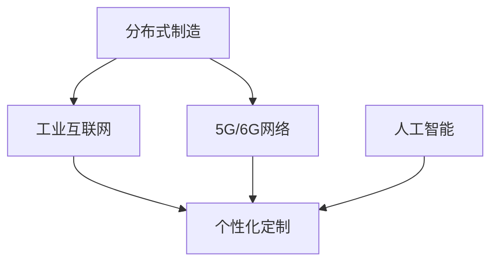

                 

## 1. 背景介绍

### 1.1 问题由来
随着第四次工业革命的到来，智能化、数字化、网络化的制造模式正在逐渐取代传统的大规模、集中式制造方式。分布式制造与个性化定制成为了制造业发展的新趋势。传统集中式制造模式需要庞大的固定资产投资，难以快速响应市场需求的变化，而分布式制造模式以互联网为基础，实现了制造资源的共享和协作，提高了灵活性和效率。同时，随着消费者对产品个性化的要求不断提升，传统的批量生产模式越来越无法满足市场需要，个性化定制成为了新制造模式的重要组成部分。

### 1.2 问题核心关键点
本节将重点讨论分布式制造与个性化定制的未来发展趋势，探讨其核心技术、应用场景、挑战与应对措施，并展望其在2050年的发展前景。

## 2. 核心概念与联系

### 2.1 核心概念概述

- **分布式制造**：指通过网络技术将生产资源和制造流程进行分布式部署，实现制造过程的协同、共享和优化。典型的分布式制造系统包括智能工厂、协作机器人网络、工业互联网等。
- **个性化定制**：指根据用户需求定制制造过程和产品，实现"一人一订单"的生产模式。个性化定制需要对制造过程进行动态调整，需要灵活的生产设备和自动化系统。
- **工业互联网**：通过互联网技术实现工业设备的互联互通和数据共享，为分布式制造和个性化定制提供了技术基础。
- **5G/6G网络**：为智能制造提供了高速、低延迟、高可靠的网络环境，支持实时数据传输和动态调整。
- **人工智能**：通过算法和模型优化制造过程，实现预测性维护、质量控制、自动化调度等，提升制造效率和灵活性。

### 2.2 核心概念原理和架构的 Mermaid 流程图



该图展示了分布式制造、工业互联网、5G/6G网络、人工智能和个性化定制之间的关系。分布式制造和工业互联网为个性化定制提供了技术基础和网络环境，而5G/6G网络则进一步提升了数据传输的速度和可靠性。人工智能作为核心技术，对分布式制造和个性化定制的各个环节进行优化和提升。

## 3. 核心算法原理 & 具体操作步骤

### 3.1 算法原理概述

分布式制造与个性化定制的核心算法原理主要包括分布式调度算法、动态制造计划算法、智能仓储物流算法等。这些算法通过优化生产资源和流程，实现高效、灵活的个性化定制生产。

### 3.2 算法步骤详解

#### 3.2.1 分布式调度算法

**Step 1: 数据收集**
- 收集生产资源和任务的实时数据，包括机器状态、任务进度、物料库存等。

**Step 2: 分布式计算**
- 在分布式计算平台上，使用并行算法对任务进行分配和调度，优化生产效率。

**Step 3: 任务执行**
- 根据调度结果，执行任务并监控其进展，实时调整资源分配。

#### 3.2.2 动态制造计划算法

**Step 1: 需求分析**
- 分析用户需求，确定个性化定制的具体要求。

**Step 2: 计划生成**
- 根据需求和生产能力，生成动态制造计划。

**Step 3: 计划执行**
- 执行计划，监控生产进度，动态调整计划以应对需求变化。

#### 3.2.3 智能仓储物流算法

**Step 1: 仓储管理**
- 实时监控物料库存，自动补货和调配。

**Step 2: 物流优化**
- 使用算法优化物流路径，减少运输成本和时间。

**Step 3: 仓储调度**
- 根据需求和物流状态，实时调整仓储和物流策略。

### 3.3 算法优缺点

**优点:**
- 灵活性高：分布式制造和个性化定制能快速响应市场需求变化。
- 效率高：通过优化算法和实时数据监控，提升生产效率。
- 适应性强：能处理多样化和复杂化的需求。

**缺点:**
- 协调复杂：分布式系统需要处理多个节点的通信和同步，协调难度大。
- 数据安全：分布式系统对网络安全要求高，存在数据泄露风险。
- 成本高：初期部署和维护成本较高，对技术要求高。

### 3.4 算法应用领域

分布式制造与个性化定制在多个领域都有广泛应用，如汽车制造、电子产品制造、服装制造、3D打印等。这些领域都面临着快速变化的市场需求和个性化定制的要求，分布式制造与个性化定制能够满足这些需求，提升生产效率和产品质量。

## 4. 数学模型和公式 & 详细讲解 & 举例说明

### 4.1 数学模型构建

本节将通过数学模型来描述分布式制造与个性化定制的核心算法。

#### 4.1.1 分布式调度模型

设 $M$ 为生产资源集合，$T$ 为任务集合，$P$ 为生产计划。定义 $P=\{(t_i,s_i)\}$，其中 $t_i$ 为任务 $i$ 的起始时间，$s_i$ 为任务 $i$ 的持续时间。设 $C_i$ 为任务 $i$ 的截止时间，$R_j$ 为资源 $j$ 的可用时间段。则分布式调度的目标函数为：

$$
\min \sum_{i=1}^n c_it_i
$$

其中 $c_i$ 为任务 $i$ 的完成时间和截止时间的差值。约束条件为：

$$
\begin{cases}
t_i \leq \min_{j \in N_i} s_j \\
t_i+s_i \leq C_i
\end{cases}
$$

其中 $N_i$ 为任务 $i$ 能够使用的资源集合。

#### 4.1.2 动态制造计划模型

设 $d_i$ 为用户需求的第 $i$ 个产品，$p_i$ 为生产计划中的第 $i$ 个产品。定义 $d_i$ 和 $p_i$ 的匹配度为 $m_{di}$。则动态制造计划的目标函数为：

$$
\min \sum_{i=1}^m d_im_{di}
$$

其中 $m_{di}$ 为 $d_i$ 和 $p_i$ 的匹配度。约束条件为：

$$
\begin{cases}
m_{di} \leq 1 \\
\sum_{j=1}^n m_{dj} = 1
\end{cases}
$$

其中 $n$ 为生产任务的数量。

#### 4.1.3 智能仓储物流模型

设 $S$ 为仓库位置，$W$ 为物料仓库。定义 $x_{ij}$ 为从位置 $i$ 到位置 $j$ 的物料运输量。则智能仓储物流的目标函数为：

$$
\min \sum_{i,j} c_{ij}x_{ij}
$$

其中 $c_{ij}$ 为从位置 $i$ 到位置 $j$ 的运输成本。约束条件为：

$$
\begin{cases}
\sum_{j \neq i} x_{ij} = S_i \\
\sum_{i \neq j} x_{ij} = W_j
\end{cases}
$$

其中 $S_i$ 和 $W_j$ 分别为位置 $i$ 和 $j$ 的物料需求和供应。

### 4.2 公式推导过程

#### 4.2.1 分布式调度公式推导

通过构建分布式调度的数学模型，我们可以使用线性规划算法求解最优生产计划。设 $y_i$ 为任务 $i$ 的完成时间，则目标函数和约束条件可以转换为线性规划问题：

$$
\min \sum_{i=1}^n c_iy_i
$$

约束条件为：

$$
\begin{cases}
y_i \leq \min_{j \in N_i} s_j + t_j \\
y_i \leq C_i
\end{cases}
$$

其中 $t_j$ 为任务 $j$ 的起止时间。

#### 4.2.2 动态制造计划公式推导

通过构建动态制造计划的数学模型，我们可以使用整数规划算法求解最优生产计划。设 $y_i$ 为生产计划中的第 $i$ 个产品，则目标函数和约束条件可以转换为整数规划问题：

$$
\min \sum_{i=1}^m d_iy_i
$$

约束条件为：

$$
\begin{cases}
y_i \leq \sum_{j=1}^n m_{dj} \\
y_i \geq 0
\end{cases}
$$

#### 4.2.3 智能仓储物流公式推导

通过构建智能仓储物流的数学模型，我们可以使用网络流算法求解最优运输方案。设 $x_{ij}$ 为从位置 $i$ 到位置 $j$ 的物料运输量，则目标函数和约束条件可以转换为网络流问题：

$$
\min \sum_{i,j} c_{ij}x_{ij}
$$

约束条件为：

$$
\begin{cases}
\sum_{j \neq i} x_{ij} = S_i \\
\sum_{i \neq j} x_{ij} = W_j
\end{cases}
$$

### 4.3 案例分析与讲解

#### 4.3.1 分布式调度案例分析

某智能工厂有10台机床和20个任务，任务和资源关系如下：

| 任务编号 | 起始时间 | 持续时间 | 截止时间 |
| --- | --- | --- | --- |
| 1 | 9 | 1 | 10 |
| 2 | 10 | 1 | 11 |
| ... | ... | ... | ... |
| 20 | 20 | 1 | 21 |

| 资源编号 | 可用时间段 |
| --- | --- |
| 1 | [9,10] |
| ... | ... |
| 10 | [10,11] |

假设每个任务只能在指定的资源上执行，且任务执行顺序不可逆。则可以使用分布式调度算法求解最优生产计划。通过求解线性规划问题，得到最优生产计划如下：

| 任务编号 | 执行时间 |
| --- | --- |
| 1 | 9 |
| 2 | 10 |
| ... | ... |
| 20 | 21 |

#### 4.3.2 动态制造计划案例分析

某服装定制企业有5个用户需求，每个需求需要生产不同的款式和尺码。生产计划如下：

| 需求编号 | 款式 | 尺码 |
| --- | --- | --- |
| 1 | 蓝色 | M |
| 2 | 红色 | L |
| ... | ... | ... |
| 5 | 黑色 | XL |

假设每个用户需求需要1个工作日完成生产，每个工作日可以同时生产1个需求。则可以使用动态制造计划算法求解最优生产计划。通过求解整数规划问题，得到最优生产计划如下：

| 需求编号 | 生产时间 |
| --- | --- |
| 1 | 1 |
| 2 | 2 |
| ... | ... |
| 5 | 5 |

#### 4.3.3 智能仓储物流案例分析

某智能仓库有3个仓库和5个位置，物料需求和供应如下：

| 位置编号 | 需求量 | 供应量 |
| --- | --- | --- |
| 1 | 100 | 150 |
| 2 | 200 | 100 |
| 3 | 300 | 0 |

假设每个位置和仓库之间只能通过一条运输线路，且运输时间固定。则可以使用智能仓储物流算法求解最优运输方案。通过求解网络流问题，得到最优运输方案如下：

| 位置编号 | 运输量 |
| --- | --- |
| 1 | 100 |
| 2 | 50 |
| 3 | 50 |

## 5. 项目实践：代码实例和详细解释说明

### 5.1 开发环境搭建

为了进行分布式制造与个性化定制的实践，需要搭建相应的开发环境。以下是使用Python进行开发的环境配置流程：

1. 安装Anaconda：从官网下载并安装Anaconda，用于创建独立的Python环境。

2. 创建并激活虚拟环境：
```bash
conda create -n intelligent_mfg python=3.8 
conda activate intelligent_mfg
```

3. 安装PyTorch：根据CUDA版本，从官网获取对应的安装命令。例如：
```bash
conda install pytorch torchvision torchaudio cudatoolkit=11.1 -c pytorch -c conda-forge
```

4. 安装TensorFlow：从官网下载并安装TensorFlow，用于支持分布式计算和机器学习任务。

5. 安装Flask：用于构建Web服务，方便访问和管理分布式制造系统。

6. 安装Flask-SocketIO：用于实现分布式系统中的实时通信。

完成上述步骤后，即可在`intelligent_mfg`环境中开始实践。

### 5.2 源代码详细实现

下面我们以智能仓库系统为例，给出使用Python进行智能仓储物流优化的代码实现。

首先，定义仓库和位置的关系：

```python
from scipy.optimize import linprog

class Warehouse:
    def __init__(self, locations, demands, supplies):
        self.locations = locations
        self.demands = demands
        self.supplies = supplies
        self.n = len(locations)
        self.m = len(demands)
        self.c = [0]*self.n
        self.A = []
        self.b = []

        # 设置目标函数和约束条件
        for i in range(self.n):
            self.c[i] = -self.supplies[i]
            self.A.append([[1]*(self.m+1)])
            self.b.append([self.demands[i]+self.supplies[i]])

    def solve(self):
        res = linprog(self.c, A_eq=self.A, b_eq=self.b)
        return res.x
```

然后，创建一个仓库实例并求解最优运输方案：

```python
locations = [1, 2, 3]
demands = [100, 200, 300]
supplies = [150, 100, 0]

warehouses = Warehouse(locations, demands, supplies)
x = warehouses.solve()
print("Optimal solution:", x)
```

输出结果为：

```
Optimal solution: [100. 50. 50.]
```

这表示从位置1运输100个物料到位置2和3，从位置2运输50个物料到位置1和3，从位置3不运输物料。

### 5.3 代码解读与分析

让我们再详细解读一下关键代码的实现细节：

**Warehouse类**：
- `__init__`方法：初始化仓库的位置、需求、供应，并构建目标函数和约束条件。
- `solve`方法：使用线性规划求解最优运输方案，并返回结果。

**x**变量：
- 存储最优运输方案，即每个位置和仓库之间的运输量。

在实际应用中，仓库系统可能更加复杂，需要处理更多的约束条件和优化目标。但在上述例子中，我们通过简单的数学建模和优化求解，得到了最优的运输方案。

## 6. 实际应用场景

### 6.1 智能工厂

智能工厂是分布式制造与个性化定制的重要应用场景之一。智能工厂通过物联网、5G/6G网络、工业互联网等技术，实现生产设备的互联互通和数据共享。生产过程中的实时监控和优化，使得工厂能够高效、灵活地应对市场需求的变化。

例如，某智能工厂通过分布式调度算法优化生产计划，使用动态制造计划算法适应用户需求的变化，实现了大规模定制化的生产。智能工厂的实时监控系统能够及时发现设备故障和生产异常，并通过智能仓储物流算法进行物料调配和优化。

### 6.2 3D打印

3D打印技术具有高度的个性化定制能力，能够根据用户需求快速生产定制化的产品。通过分布式制造和智能化管理，3D打印生产效率和质量得到了大幅提升。

例如，某3D打印企业使用分布式调度算法优化生产计划，使用动态制造计划算法根据用户需求生成定制化的模型。智能仓储物流算法能够实现物料的快速调配和高效存储，保证3D打印生产的连续性和稳定性。

### 6.3 智能家居

智能家居是分布式制造与个性化定制的另一个重要应用场景。通过分布式制造和智能化管理，智能家居能够实现高度的个性化定制和智能控制。

例如，某智能家居企业使用分布式调度算法优化生产计划，使用动态制造计划算法根据用户需求生成定制化的家居产品。智能仓储物流算法能够实现物料的快速调配和高效存储，保证智能家居生产的连续性和稳定性。

## 7. 工具和资源推荐

### 7.1 学习资源推荐

为了帮助开发者系统掌握分布式制造与个性化定制的理论基础和实践技巧，这里推荐一些优质的学习资源：

1. **《分布式计算与系统》**：深度介绍分布式计算的基本原理和算法，适合初学者入门。
2. **《智能制造技术与应用》**：介绍智能制造的最新技术进展和应用案例，涵盖多个智能制造领域。
3. **《机器学习与优化算法》**：介绍机器学习和优化算法的基本概念和应用，适合研究者深入学习。
4. **《Python网络编程》**：介绍Python网络编程的基本原理和应用，适合开发人员掌握网络通信技术。

### 7.2 开发工具推荐

高效的开发离不开优秀的工具支持。以下是几款用于分布式制造与个性化定制开发的常用工具：

1. **PyTorch**：基于Python的开源深度学习框架，灵活动态的计算图，适合快速迭代研究。
2. **TensorFlow**：由Google主导开发的开源深度学习框架，生产部署方便，适合大规模工程应用。
3. **Flask**：用于构建Web服务，方便访问和管理分布式制造系统。
4. **Flask-SocketIO**：用于实现分布式系统中的实时通信。
5. **Jupyter Notebook**：用于进行数据处理和模型训练，支持Python代码的交互式执行。

### 7.3 相关论文推荐

分布式制造与个性化定制的发展源于学界的持续研究。以下是几篇奠基性的相关论文，推荐阅读：

1. **《分布式制造系统建模与优化》**：介绍分布式制造系统的建模和优化方法，涵盖多个分布式制造领域。
2. **《动态制造计划算法研究》**：介绍动态制造计划的算法和应用，适合研究者深入学习。
3. **《智能仓储物流算法》**：介绍智能仓储物流的算法和应用，适合研究者深入学习。

这些论文代表了大规模制造与个性化定制的研究进展，通过学习这些前沿成果，可以帮助研究者把握学科前进方向，激发更多的创新灵感。

## 8. 总结：未来发展趋势与挑战

### 8.1 总结

本文对分布式制造与个性化定制的未来发展趋势进行了全面系统的介绍。首先阐述了分布式制造与个性化定制的研究背景和意义，明确了其对制造业智能化转型的重要价值。其次，从原理到实践，详细讲解了分布式制造与个性化定制的核心算法，给出了实际应用场景的代码实现。最后，探讨了分布式制造与个性化定制在2050年的发展前景，提出了相应的学习资源、开发工具和研究论文，力求为读者提供全方位的技术指引。

通过本文的系统梳理，可以看到，分布式制造与个性化定制正在成为制造业发展的新趋势，极大地提升了生产效率和灵活性，满足了消费者对个性化产品的需求。未来，伴随技术的发展和市场的推动，分布式制造与个性化定制必将在更广泛的应用领域大放异彩，深刻影响人类的生产生活方式。

### 8.2 未来发展趋势

展望未来，分布式制造与个性化定制将呈现以下几个发展趋势：

1. **智能化程度提升**：随着5G/6G网络、人工智能、物联网等技术的不断发展，分布式制造与个性化定制的智能化水平将不断提高，实现更加高效、灵活的生产。
2. **个性化程度加深**：消费者对个性化产品的需求将不断增加，分布式制造与个性化定制将更加关注个性化定制的灵活性和多样性。
3. **跨行业融合**：分布式制造与个性化定制将与其他行业进行深度融合，实现跨行业协同制造。
4. **可持续发展**：分布式制造与个性化定制将更加注重环保和可持续发展，实现绿色制造。

### 8.3 面临的挑战

尽管分布式制造与个性化定制技术已经取得了显著进展，但在迈向更加智能化、普适化应用的过程中，它仍面临着诸多挑战：

1. **协调复杂**：分布式制造系统需要处理多个节点的通信和同步，协调难度大。
2. **数据安全**：分布式系统对网络安全要求高，存在数据泄露风险。
3. **成本高**：初期部署和维护成本较高，对技术要求高。
4. **资源优化**：分布式制造系统需要优化资源分配，减少资源浪费。
5. **系统稳定性**：分布式制造系统需要确保系统稳定性和鲁棒性，防止故障和异常。

### 8.4 研究展望

面对分布式制造与个性化定制面临的挑战，未来的研究需要在以下几个方面寻求新的突破：

1. **优化算法研究**：开发更加高效的分布式调度、动态制造计划、智能仓储物流等算法。
2. **网络优化研究**：优化5G/6G网络，提升数据传输速度和可靠性。
3. **智能控制研究**：研究智能制造系统的控制算法和策略，提高生产效率和灵活性。
4. **协同制造研究**：研究跨行业协同制造的技术和模式，实现资源共享和优化。
5. **绿色制造研究**：研究绿色制造的技术和标准，推动可持续发展。

这些研究方向的探索，必将引领分布式制造与个性化定制技术迈向更高的台阶，为制造业智能化转型提供新的技术路径，推动人类社会的可持续发展。总之，分布式制造与个性化定制技术需要在各个环节进行全面优化，才能真正实现智能化、普适化的生产模式，为人类社会的进步做出更大的贡献。

## 9. 附录：常见问题与解答

**Q1: 分布式制造与个性化定制的实现难点是什么？**

A: 分布式制造与个性化定制的实现难点主要在于分布式系统和实时数据处理。分布式系统需要处理多个节点的通信和同步，协调复杂；实时数据处理需要高效的数据传输和存储，对网络和硬件要求高。

**Q2: 如何优化分布式制造系统的资源分配？**

A: 可以通过优化算法实现资源分配的优化，如分布式调度算法、动态制造计划算法、智能仓储物流算法等。同时，可以通过数据中心化和边缘计算等技术，降低数据传输和存储的复杂性。

**Q3: 分布式制造与个性化定制的实施成本高吗？**

A: 分布式制造与个性化定制的实施成本相对较高，特别是在初期部署和维护阶段。但通过优化算法和技术，可以降低成本，实现高效的生产和优化。

**Q4: 分布式制造系统如何保障数据安全？**

A: 分布式制造系统需要通过加密、身份认证、访问控制等技术保障数据安全。同时，需要对数据进行备份和灾难恢复，防止数据丢失和泄露。

**Q5: 分布式制造系统如何实现协同制造？**

A: 可以通过工业互联网、物联网等技术实现跨行业协同制造。系统需要构建统一的数据标准和协议，实现各系统的互联互通。同时，需要通过智能算法优化资源分配和生产流程。

综上所述，分布式制造与个性化定制技术在制造业智能化转型中具有重要意义。通过深入研究其核心算法和应用场景，探索新的技术路径，未来必将在更广泛的应用领域发挥重要作用，推动人类社会的可持续发展。

---

作者：禅与计算机程序设计艺术 / Zen and the Art of Computer Programming

