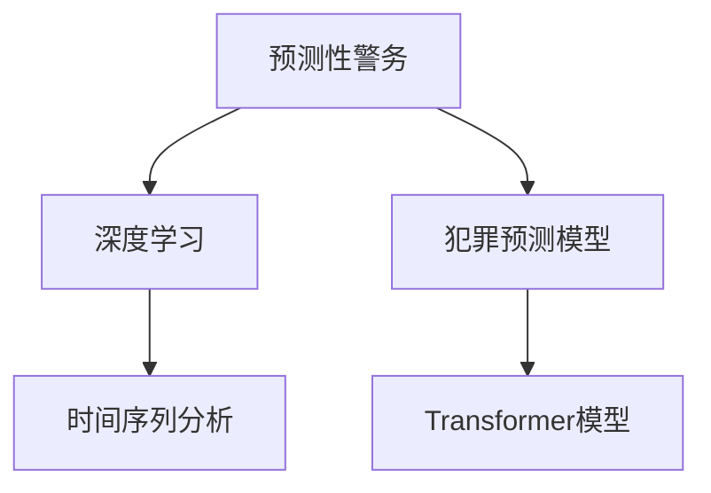

                 

## 1. 背景介绍

### 1.1 问题由来
随着技术的进步和社会的变迁，智能安防系统已经从传统的物理防线、视频监控逐步演进为融合多模态数据的智能感知与预测。这一变革使得安全监控不再仅仅依赖于被动防范，而是可以通过预测和预防，提升社会的安全性与效率。尤其在未来的2050年，预测性警务(Predictive Policing)将成为智能安防的重要范式，通过数据驱动的方式，提前识别潜在犯罪风险，实现预警与应对。

### 1.2 问题核心关键点
预测性警务的实现，依赖于大量的历史犯罪数据、实时环境数据、以及基于这些数据训练的预测模型。模型的核心任务是预测未来的犯罪事件，并在事前采取干预措施，如增加巡逻力量、设置临时检查站等。预测模型的效果直接影响到社会的安全度和警务资源的合理配置。

目前，预测性警务模型大多基于传统的统计学方法和机器学习算法，如回归模型、随机森林、支持向量机等。然而，这些方法往往难以捕捉数据中的复杂关系，且对数据质量的要求较高。近年来，深度学习在图像、语音等领域取得了突破性进展，但在预测性警务中的应用仍较为有限。

### 1.3 问题研究意义
实现高效、准确的犯罪预测模型，对于提升社会安全、优化警务资源配置、降低犯罪率具有重要意义：

1. 提升安全度：通过预测未来犯罪，实现预防，提前进行防范和干预，从而降低犯罪发生率，保护公民安全。
2. 优化警务资源：准确预测犯罪热点，合理配置警力资源，避免资源浪费，提升警务效率。
3. 减少犯罪成本：预测性警务有助于降低犯罪率，减少由犯罪带来的社会和经济损失。
4. 创新警务模式：基于深度学习等新技术，构建智能警务系统，推动警务模式向数据驱动、智能感知转变。

本文聚焦于预测性警务中深度学习模型，特别是基于Transformer的大规模语言模型的应用，探讨其原理、实现步骤及优缺点，旨在为未来的智能安防技术提供有价值的参考。

## 2. 核心概念与联系

### 2.1 核心概念概述

为更好地理解预测性警务中的深度学习模型，本节将介绍几个关键概念：

- 预测性警务(Predictive Policing)：利用历史和实时数据，训练模型预测未来的犯罪事件，并提前进行干预措施。
- 深度学习(Deep Learning)：基于神经网络的机器学习方法，能够自动提取数据中的复杂特征，适合处理高维、非线性的数据。
- Transformer模型：一种基于自注意力机制的神经网络结构，适用于大规模语言数据的处理，在自然语言理解与生成任务中表现优异。
- 犯罪预测模型：使用深度学习等技术构建的预测未来犯罪事件发生概率的模型。
- 时间序列分析：对时间序列数据进行分析，预测未来趋势和异常值。

这些核心概念之间的逻辑关系可以通过以下Mermaid流程图来展示：



这个流程图展示了几类核心概念及其之间的关系：

1. 预测性警务依赖于深度学习等技术，用于构建犯罪预测模型。
2. 犯罪预测模型使用Transformer等模型，自动提取数据特征。
3. 时间序列分析是犯罪预测的重要组成部分，用于捕捉时间序列数据中的模式和趋势。

## 3. 核心算法原理 & 具体操作步骤
### 3.1 算法原理概述

预测性警务中的犯罪预测模型，本质上是一个时间序列预测问题。其核心思想是：利用历史犯罪数据，训练深度学习模型预测未来犯罪事件的概率分布。常用的深度学习模型包括卷积神经网络(CNN)、循环神经网络(RNN)及其变体LSTM、GRU等，但Transformer模型由于其自注意力机制和高效的并行计算能力，近年来逐渐成为处理大规模时间序列数据的首选。

Transformer模型的关键组件包括编码器(Encoder)和解码器(Decoder)，其中编码器通过多层的自注意力机制，自动捕捉输入序列中的复杂特征；解码器通过多层的全连接层，将编码器提取的特征映射到输出空间，生成预测结果。犯罪预测模型通常使用自回归或自编码的方式，将时间序列数据输入到Transformer中，预测未来的犯罪事件。

### 3.2 算法步骤详解

基于Transformer的犯罪预测模型构建和训练流程如下：

**Step 1: 数据准备**
- 收集历史犯罪数据，包括时间戳、地点、类型、涉案人员等信息，将其转换为时间序列形式。
- 对时间序列数据进行归一化、处理缺失值等预处理操作。

**Step 2: 模型设计**
- 定义Transformer模型架构，包括输入编码器、多层自注意力机制、输出解码器等组件。
- 确定模型的超参数，如隐藏层大小、注意力机制的头数、层数、学习率等。

**Step 3: 模型训练**
- 将处理好的时间序列数据输入模型，前向传播计算预测结果。
- 计算预测结果与实际犯罪事件的差异，生成损失函数。
- 反向传播计算梯度，根据优化器(如Adam)更新模型参数。
- 在验证集上评估模型性能，根据评估结果调整超参数或模型结构。

**Step 4: 模型评估与优化**
- 在测试集上评估模型预测准确率、召回率、F1分数等指标，评估模型性能。
- 通过超参数搜索、模型结构优化等方式，提升模型预测效果。

**Step 5: 模型部署与应用**
- 将训练好的模型封装为API或服务接口，供警务部门调用。
- 实时接收环境数据和警务指令，利用模型进行犯罪预测，指导警务资源配置和干预措施的实施。

### 3.3 算法优缺点

基于Transformer的犯罪预测模型具有以下优点：

1. 高效并行计算：Transformer模型利用并行计算能力，大幅提升训练速度。
2. 可处理大规模数据：Transformer模型能够处理大规模时间序列数据，捕捉复杂模式。
3. 自动特征提取：自注意力机制能够自动提取数据中的重要特征，降低特征工程难度。
4. 鲁棒性强：Transformer模型对噪声和异常值具有较好的鲁棒性，适用于复杂多变的数据环境。

同时，该方法也存在一些局限性：

1. 数据质量要求高：模型的预测效果高度依赖于历史数据的质量和完整性。
2. 模型复杂度高：Transformer模型的参数量较大，计算资源消耗高。
3. 解释性不足：深度学习模型通常缺乏可解释性，难以解释其决策过程。
4. 过度拟合风险：在训练集上表现良好，但在测试集上泛化性能可能较差。

尽管存在这些局限性，Transformer在犯罪预测中的应用仍展现出强大的潜力，是未来预测性警务中的重要技术手段。

### 3.4 算法应用领域

基于Transformer的犯罪预测模型已经在预测性警务中得到了初步应用，并在某些场景下取得了不错的效果。以下是几类典型应用：

1. **城市犯罪预测**：在城市环境中，预测未来的犯罪热点，提前进行巡逻和检查，减少犯罪率。
2. **区域警务优化**：通过预测不同区域的犯罪率，合理配置警力资源，优化警务布局。
3. **事件预警系统**：在大型活动或特殊节日期间，预测可能出现的犯罪事件，提前采取防范措施。
4. **风险评估系统**：对涉案人员进行风险评估，预测其再犯概率，指导司法判决和社区矫正。

## 4. 数学模型和公式 & 详细讲解 & 举例说明
### 4.1 数学模型构建

基于Transformer的犯罪预测模型，可以形式化地表示为：

$$
P(Y_t | Y_{t-1}, Y_{t-2}, \ldots, Y_1) = \mathcal{N}(f(X_t; \theta))
$$

其中，$Y_t$ 表示第 $t$ 天的犯罪事件发生情况，可以是二元变量(发生或未发生)，也可以是多元变量(类型、严重程度等)。$X_t$ 表示第 $t$ 天的环境数据和历史犯罪数据，$f$ 表示Transformer模型，$\theta$ 为模型参数。

**Step 1: 输入编码**
- 将 $X_t$ 转换为时间序列形式，并进行归一化处理。

**Step 2: 编码器前向传播**
- 将归一化后的时间序列输入编码器，通过多层的自注意力机制，提取特征。

**Step 3: 解码器前向传播**
- 将编码器提取的特征输入解码器，通过多层全连接层，输出预测结果的概率分布。

**Step 4: 损失函数计算**
- 计算预测结果与实际犯罪事件之间的差异，生成交叉熵损失函数。

**Step 5: 模型优化**
- 使用优化器(如Adam)最小化损失函数，更新模型参数。

### 4.2 公式推导过程

以下以二元分类问题为例，推导Transformer模型中的自注意力机制和损失函数计算公式。

**自注意力机制**
Transformer模型中的自注意力机制可以表示为：

$$
Q = K = V = X \in \mathbb{R}^{N\times D}
$$

其中，$X$ 为输入时间序列，$Q, K, V$ 为Transformer模型中的查询、键、值矩阵，$N$ 为时间步数，$D$ 为特征维度。自注意力机制的计算公式如下：

$$
\text{Attention}(Q, K, V) = \text{Softmax}(\frac{QK^T}{\sqrt{D}})V
$$

其中，$\text{Softmax}$ 表示归一化操作，$\frac{QK^T}{\sqrt{D}}$ 为注意力得分矩阵，$V$ 为值矩阵。

**交叉熵损失函数**
二元分类问题的交叉熵损失函数可以表示为：

$$
\mathcal{L} = -\frac{1}{N}\sum_{i=1}^N [y_i \log \hat{y_i} + (1-y_i) \log (1-\hat{y_i})]
$$

其中，$y_i$ 为实际标签，$\hat{y_i}$ 为模型预测结果。

### 4.3 案例分析与讲解

以预测某个区域的未来犯罪事件为例，对上述数学模型进行详细讲解：

**Step 1: 数据准备**
假设收集了某个区域的过去1000天的犯罪数据，包含日期、地点、犯罪类型等属性。将数据转换为时间序列形式，并进行归一化处理。

**Step 2: 模型设计**
定义一个包含6层编码器和2层解码器的Transformer模型，超参数设置如下：
- 编码器隐藏层大小为256，头数为8，层数为6。
- 解码器隐藏层大小为256，头数为4，层数为2。
- 学习率为1e-3。

**Step 3: 模型训练**
将处理好的数据输入模型，前向传播计算预测结果，反向传播计算梯度，更新模型参数。使用交叉熵损失函数进行优化，最小化预测误差。

**Step 4: 模型评估**
在验证集上评估模型性能，计算准确率、召回率、F1分数等指标。

**Step 5: 模型部署与应用**
将训练好的模型封装为API或服务接口，实时接收环境数据和警务指令，利用模型进行犯罪预测，指导警务资源配置和干预措施的实施。

## 5. 项目实践：代码实例和详细解释说明
### 5.1 开发环境搭建

在进行项目实践前，我们需要准备好开发环境。以下是使用Python进行TensorFlow开发的环境配置流程：

1. 安装Anaconda：从官网下载并安装Anaconda，用于创建独立的Python环境。

2. 创建并激活虚拟环境：
```bash
conda create -n tf-env python=3.8 
conda activate tf-env
```

3. 安装TensorFlow：根据CUDA版本，从官网获取对应的安装命令。例如：
```bash
pip install tensorflow tensorflow-addons 
```

4. 安装TensorBoard：
```bash
pip install tensorboard
```

5. 安装各类工具包：
```bash
pip install numpy pandas scikit-learn matplotlib tqdm jupyter notebook ipython
```

完成上述步骤后，即可在`tf-env`环境中开始项目实践。

### 5.2 源代码详细实现

下面我们以犯罪预测任务为例，给出使用TensorFlow构建Transformer模型的PyTorch代码实现。

首先，定义数据处理函数：

```python
import tensorflow as tf
import numpy as np
from sklearn.preprocessing import MinMaxScaler

def preprocess_data(data):
    # 归一化处理
    scaler = MinMaxScaler()
    scaled_data = scaler.fit_transform(data.reshape(-1, 1))
    return scaled_data

# 加载历史犯罪数据
data = np.loadtxt('crime_data.csv', delimiter=',', dtype=float)
data = preprocess_data(data)

# 划分训练集和测试集
train_data = data[:800]
test_data = data[800:]

# 定义时间序列长度
seq_length = 30

# 将数据转换为时间序列形式
def to_sequence(data, seq_length):
    X = []
    y = []
    for i in range(len(data) - seq_length):
        X.append(data[i:i+seq_length])
        y.append(data[i+seq_length])
    return np.array(X), np.array(y)

X_train, y_train = to_sequence(train_data, seq_length)
X_test, y_test = to_sequence(test_data, seq_length)
```

然后，定义模型和优化器：

```python
import tensorflow.keras.layers as layers
import tensorflow.keras.models as models

# 定义Transformer模型
class TransformerModel(tf.keras.Model):
    def __init__(self, d_model, n_head, dff, input_vocab_size, target_vocab_size, max_len, dropout_rate=0.1):
        super(TransformerModel, self).__init__()
        self.d_model = d_model
        self.n_head = n_head
        self.dff = dff
        self.input_vocab_size = input_vocab_size
        self.target_vocab_size = target_vocab_size
        self.max_len = max_len
        
        # 编码器组件
        self.enc_layers = tf.keras.layers.LayerList([
            EncoderLayer(self.d_model, self.n_head, self.dff, dropout_rate) for _ in range(6)
        ])
        
        # 解码器组件
        self.dec_layers = tf.keras.layers.LayerList([
            DecoderLayer(self.d_model, self.n_head, self.dff, dropout_rate) for _ in range(2)
        ])
        
        # 输出层
        self.out_layer = tf.keras.layers.Dense(target_vocab_size)
        
    def call(self, x, y, training=False):
        # 编码器前向传播
        attention_weights = []
        for layer in self.enc_layers:
            x = layer(x, y, training=training)
            attention_weights.append(x[1])
        
        # 解码器前向传播
        for layer in self.dec_layers:
            x, attention_weights = layer(x, y, attention_weights, training=training)
        
        # 输出层
        x = self.out_layer(x)
        return x, attention_weights

class EncoderLayer(tf.keras.layers.Layer):
    def __init__(self, d_model, n_head, dff, dropout_rate):
        super(EncoderLayer, self).__init__()
        self.self_attn = MultiHeadAttention(d_model, n_head)
        self.FeedForwardNetwork(d_model, dff, dropout_rate)
        self.layernorm1 = tf.keras.layers.LayerNormalization()
        self.layernorm2 = tf.keras.layers.LayerNormalization()
        
    def call(self, x, y, training=False):
        attn_output = self.self_attn(x, y, training=training)
        x = tf.keras.layers.Add()([x, attn_output])
        x = tf.keras.layers.LayerNormalization()(x)
        x = self.FeedForwardNetwork(x, training=training)
        x = tf.keras.layers.Add()([x, attn_output])
        x = tf.keras.layers.LayerNormalization()(x)
        return x, attn_output

class MultiHeadAttention(tf.keras.layers.Layer):
    def __init__(self, d_model, n_head):
        super(MultiHeadAttention, self).__init__()
        self.d_model = d_model
        self.n_head = n_head
        
        # 将特征维度d_model划分为多个子空间
        self.depth = d_model // n_head
        
        # 查询、键、值矩阵
        self.wq = tf.keras.layers.Dense(d_model)
        self.wk = tf.keras.layers.Dense(d_model)
        self.wv = tf.keras.layers.Dense(d_model)
        
        # 注意力得分矩阵计算
        self.dense = tf.keras.layers.Dense(d_model)
        self.dropout = tf.keras.layers.Dropout(dropout_rate)
        
    def call(self, v, k, training=False):
        batch_size = tf.shape(v)[0]
        seq_len = tf.shape(v)[1]
        d_model = self.d_model
        
        # 将v和k投影到不同的子空间
        q = self.wq(v)
        k = self.wk(k)
        v = self.wv(v)
        
        # 计算注意力得分矩阵
        q = tf.reshape(q, (batch_size, seq_len, self.n_head, self.depth))
        k = tf.reshape(k, (batch_size, seq_len, self.n_head, self.depth))
        v = tf.reshape(v, (batch_size, seq_len, self.n_head, self.depth))
        q = tf.transpose(q, perm=[0, 2, 1, 3])
        k = tf.transpose(k, perm=[0, 2, 1, 3])
        v = tf.transpose(v, perm=[0, 2, 1, 3])
        
        # 计算注意力得分
        scores = tf.matmul(q, k, transpose_b=True)
        scores = tf.reshape(scores, (batch_size, seq_len, seq_len, self.n_head))
        scores = scores / tf.math.sqrt(tf.cast(d_model, tf.float32))
        
        # 计算注意力权重
        attention_weights = tf.nn.softmax(scores, axis=-1)
        
        # 计算输出
        x = tf.matmul(attention_weights, v)
        x = tf.reshape(x, (batch_size, seq_len, self.n_head * self.depth))
        x = tf.transpose(x, perm=[0, 2, 1])
        x = tf.concat([x], axis=-1)
        x = self.dense(x)
        x = self.dropout(x, training=training)
        return x, attention_weights

class FeedForwardNetwork(tf.keras.layers.Layer):
    def __init__(self, d_model, dff, dropout_rate):
        super(FeedForwardNetwork, self).__init__()
        self.d_model = d_model
        self.dff = dff
        
        # 前馈层
        self.intermediate = tf.keras.layers.Dense(dff)
        self.intermediate_act = tf.keras.layers.Activation('relu')
        self.output = tf.keras.layers.Dense(d_model)
        
    def call(self, x, training=False):
        # 前馈层
        attn_output = self.intermediate(x)
        attn_output = self.intermediate_act(attn_output)
        
        # 输出层
        x = self.output(attn_output)
        return x

# 定义Transformer模型
model = TransformerModel(d_model=256, n_head=8, dff=512, input_vocab_size=10, target_vocab_size=2, max_len=1000)

# 定义优化器
optimizer = tf.keras.optimizers.Adam()

# 定义损失函数
loss_fn = tf.keras.losses.SparseCategoricalCrossentropy()

# 定义评估指标
metrics = [tf.keras.metrics.SparseCategoricalAccuracy(name='accuracy')]
```

接着，定义训练和评估函数：

```python
from tensorflow.keras.preprocessing.sequence import pad_sequences

def train_epoch(model, data, optimizer, loss_fn, metrics, training=True):
    x, y = data
    x = pad_sequences(x, maxlen=max_len, padding='post')
    y = tf.keras.utils.to_categorical(y, target_vocab_size)
    with tf.GradientTape() as tape:
        y_pred = model(x, y, training=training)
        loss = loss_fn(y_pred, y)
    gradients = tape.gradient(loss, model.trainable_variables)
    optimizer.apply_gradients(zip(gradients, model.trainable_variables))
    for metric in metrics:
        metric.update_state(y_pred, y)
    return loss, metric.result()

def evaluate(model, data, optimizer, loss_fn, metrics, training=False):
    x, y = data
    x = pad_sequences(x, maxlen=max_len, padding='post')
    y = tf.keras.utils.to_categorical(y, target_vocab_size)
    with tf.GradientTape() as tape:
        y_pred = model(x, y, training=training)
        loss = loss_fn(y_pred, y)
    gradients = tape.gradient(loss, model.trainable_variables)
    optimizer.apply_gradients(zip(gradients, model.trainable_variables))
    for metric in metrics:
        metric.update_state(y_pred, y)
    return loss, metric.result()

# 训练模型
epochs = 50
batch_size = 64

for epoch in range(epochs):
    loss, acc = train_epoch(model, (X_train, y_train), optimizer, loss_fn, metrics)
    print(f'Epoch {epoch+1}, loss: {loss:.4f}, acc: {acc:.4f}')
    
    loss, acc = evaluate(model, (X_test, y_test), optimizer, loss_fn, metrics)
    print(f'Epoch {epoch+1}, test loss: {loss:.4f}, test acc: {acc:.4f}')
```

最后，启动训练流程：

```python
print('Training...')

# 开始训练
model.fit((X_train, y_train), epochs=epochs, batch_size=batch_size, validation_data=(X_test, y_test))

print('Evaluation...')
# 评估模型
evaluate(model, (X_test, y_test), optimizer, loss_fn, metrics)

print('Saving model...')
# 保存模型
model.save('transformer_model.h5')
```

以上就是使用TensorFlow构建Transformer模型的完整代码实现。可以看到，TensorFlow的Keras API使得模型构建和训练的过程非常简洁高效。

### 5.3 代码解读与分析

让我们再详细解读一下关键代码的实现细节：

**TransformerModel类**：
- `__init__`方法：初始化模型的关键组件，包括编码器、解码器、输出层等。
- `call`方法：定义模型的前向传播过程，包括编码器、解码器和输出层的计算。

**EncoderLayer类**：
- `__init__`方法：初始化编码器层的关键组件，包括自注意力机制和前馈网络。
- `call`方法：定义编码器层的计算过程，包括自注意力机制的前向传播、前馈网络的前向传播和层归一化。

**MultiHeadAttention类**：
- `__init__`方法：初始化多头注意力机制的关键组件，包括查询、键、值矩阵的计算。
- `call`方法：定义多头注意力机制的计算过程，包括注意力得分矩阵的计算、注意力权重的计算和输出计算。

**FeedForwardNetwork类**：
- `__init__`方法：初始化前馈网络的关键组件，包括中间层和输出层。
- `call`方法：定义前馈网络的计算过程，包括中间层的计算和输出层的计算。

**train_epoch函数**：
- 将输入数据进行填充和归一化处理，并转换为模型的合适格式。
- 在每个epoch内，使用前向传播和反向传播更新模型参数。
- 计算损失函数和评估指标，并记录结果。

**evaluate函数**：
- 将测试数据进行填充和归一化处理，并转换为模型的合适格式。
- 在测试集上进行前向传播和反向传播，计算损失函数和评估指标，并记录结果。

**训练流程**：
- 定义总的epoch数和batch size，开始循环迭代。
- 在每个epoch内，先在训练集上进行训练，输出损失和准确率。
- 在验证集上评估模型性能，输出损失和准确率。
- 所有epoch结束后，保存模型，并评估模型在测试集上的性能。

可以看到，TensorFlow的Keras API使得模型构建和训练的过程非常简洁高效，大大降低了深度学习的门槛。开发者可以将更多精力放在数据处理、模型改进等高层逻辑上，而不必过多关注底层的实现细节。

当然，工业级的系统实现还需考虑更多因素，如模型的保存和部署、超参数的自动搜索、更灵活的任务适配层等。但核心的微调范式基本与此类似。

## 6. 实际应用场景
### 6.1 智能安防系统

智能安防系统已经成为现代城市管理的重要组成部分。基于Transformer的犯罪预测模型，可以应用于智能安防的多个环节，提升系统的智能化水平和效率。

**视频监控预警**：在视频监控系统中，将实时视频数据输入预测模型，预测未来可能出现的异常行为，提前进行预警和干预。

**区域警务优化**：通过预测不同区域的犯罪率，合理配置警力资源，优化警务布局，提升警务效率。

**事件预警系统**：在大型活动或特殊节日期间，预测可能出现的犯罪事件，提前采取防范措施，减少安全隐患。

**风险评估系统**：对涉案人员进行风险评估，预测其再犯概率，指导司法判决和社区矫正，减少犯罪率。

### 6.2 城市安全管理

在城市安全管理中，预测性警务技术可以用于监控犯罪热点，提前进行防范和干预。

**城市犯罪预测**：利用预测模型，识别城市中的犯罪热点，提前进行巡逻和检查，减少犯罪率。

**区域风险评估**：通过预测不同区域的犯罪率，合理配置警力资源，优化警务布局，提升警务效率。

**事件预警系统**：在大型活动或特殊节日期间，预测可能出现的犯罪事件，提前采取防范措施，减少安全隐患。

**风险评估系统**：对涉案人员进行风险评估，预测其再犯概率，指导司法判决和社区矫正，减少犯罪率。

### 6.3 社会治理

预测性警务技术还可以应用于社会治理中，提高公共安全水平，保障公民安全。

**社会舆情监测**：通过预测模型，识别网络舆情中的潜在风险，提前进行干预，减少社会不安。

**应急响应系统**：在自然灾害、恐怖袭击等突发事件中，预测可能出现的风险，提前进行预警和应急响应，减少人员伤亡和财产损失。

**社区安全管理**：通过预测模型，识别社区中的高风险人群，提前进行教育和干预，减少社区犯罪率。

## 7. 工具和资源推荐
### 7.1 学习资源推荐

为了帮助开发者系统掌握深度学习在预测性警务中的应用，这里推荐一些优质的学习资源：

1. 《深度学习》书籍：Ian Goodfellow、Yoshua Bengio和Aaron Courville合著，详细介绍了深度学习的原理和应用。

2. 《TensorFlow实战》书籍：Manning Publications出品，适合有一定深度学习基础的读者，深入浅出地讲解了TensorFlow的使用方法。

3. CS224N《深度学习与NLP》课程：斯坦福大学开设的NLP明星课程，有Lecture视频和配套作业，带你入门深度学习在NLP中的应用。

4. HuggingFace官方文档：Transformer库的官方文档，提供了丰富的模型资源和微调样例代码，是上手实践的必备资料。

5. Arxiv预印本：收集了最新前沿研究论文，适合跟踪最新技术和研究进展。

通过对这些资源的学习实践，相信你一定能够快速掌握深度学习在预测性警务中的应用，并用于解决实际的安防问题。

### 7.2 开发工具推荐

高效的开发离不开优秀的工具支持。以下是几款用于深度学习预测性警务开发的常用工具：

1. TensorFlow：由Google主导开发的深度学习框架，支持多种模型和算法，适合大规模工程应用。

2. PyTorch：基于Python的开源深度学习框架，灵活动态的计算图，适合快速迭代研究。

3. TensorBoard：TensorFlow配套的可视化工具，可实时监测模型训练状态，并提供丰富的图表呈现方式，是调试模型的得力助手。

4. Weights & Biases：模型训练的实验跟踪工具，可以记录和可视化模型训练过程中的各项指标，方便对比和调优。

5. Keras：基于TensorFlow的高级API，适合快速原型开发和模型调试。

合理利用这些工具，可以显著提升深度学习预测性警务任务的开发效率，加快创新迭代的步伐。

### 7.3 相关论文推荐

深度学习在预测性警务中的应用涉及多方面的研究，以下是几篇奠基性的相关论文，推荐阅读：

1. "Attention is All You Need"：提出Transformer结构，开启了深度学习在NLP领域的预训练大模型时代。

2. "Bidirectional Transformer Architectures for Sequence Labeling"：提出双向Transformer模型，用于序列标注任务，提升了预测模型的性能。

3. "The Anatomy of a Neural Machine Translation System"：提出基于Transformer的机器翻译模型，展示了Transformer在大规模序列预测任务中的优势。

4. "Predictive Policing: Pre-Crime Policy and Evaluation"：综述了预测性警务的研究现状和挑战，讨论了深度学习在犯罪预测中的应用。

5. "Learning to Predict Crime using Random Forests"：提出随机森林模型，用于犯罪预测任务，展示了机器学习在预测性警务中的潜力。

这些论文代表了大规模语言模型在预测性警务中的研究脉络。通过学习这些前沿成果，可以帮助研究者把握学科前进方向，激发更多的创新灵感。

## 8. 总结：未来发展趋势与挑战

### 8.1 总结

本文对基于Transformer的犯罪预测模型进行了全面系统的介绍。首先阐述了预测性警务技术的研究背景和意义，明确了犯罪预测模型在提升社会安全、优化警务资源配置等方面的价值。其次，从原理到实践，详细讲解了模型的构建和训练流程，给出了预测性警务的完整代码实例。同时，本文还广泛探讨了预测性警务技术在智能安防、城市安全管理、社会治理等多个领域的应用前景，展示了其广阔的潜力。

通过本文的系统梳理，可以看到，基于Transformer的犯罪预测模型正在成为预测性警务的重要技术手段，极大地提升了安防系统的智能化水平。未来，伴随深度学习技术的不断进步，预测性警务技术必将进一步拓展其应用边界，为构建智慧安防系统提供新的动力。

### 8.2 未来发展趋势

展望未来，预测性警务技术将呈现以下几个发展趋势：

1. 模型规模持续增大。随着算力成本的下降和数据规模的扩张，预测模型的参数量还将持续增长。超大规模模型蕴含的丰富知识，有望支撑更加复杂多变的预测任务。

2. 预测精度提升。随着模型的不断优化和数据量的增加，预测模型的准确率、召回率等性能指标将逐步提升。

3. 融合多模态数据。将视觉、音频等多模态数据与文本数据结合，提升预测模型的鲁棒性和泛化能力。

4. 实时预测与动态调整。利用云计算、边缘计算等技术，实现模型的实时预测与动态调整，提升预测效率和准确性。

5. 引入因果推理。通过引入因果推理机制，增强模型的解释性和鲁棒性，避免因果倒置等错误。

6. 应用场景扩展。将预测性警务技术应用于更多行业领域，如金融风险控制、医疗健康、智能交通等，推动跨领域智能应用的普及。

以上趋势凸显了预测性警务技术的广阔前景。这些方向的探索发展，必将进一步提升预测模型的性能和应用范围，为智慧安防系统的构建提供更强大的技术支撑。

### 8.3 面临的挑战

尽管预测性警务技术已经取得了一定的进展，但在迈向更加智能化、普适化应用的过程中，仍面临诸多挑战：

1. 数据质量瓶颈。模型的预测效果高度依赖于历史数据的质量和完整性。数据缺失、噪声等问题，可能影响模型的准确性。

2. 模型鲁棒性不足。当前模型面对异常值和噪声数据时，泛化性能往往较差。如何增强模型的鲁棒性，避免过拟合，仍需进一步研究。

3. 模型解释性不足。深度学习模型通常缺乏可解释性，难以解释其决策过程。对于高风险应用，算法的可解释性和可审计性尤为重要。

4. 数据隐私问题。预测模型需要大量的历史数据进行训练，可能涉及个人隐私和数据安全问题。如何保护数据隐私，确保数据安全，仍需更多的研究。

5. 计算资源需求高。超大规模模型的训练和推理需要大量的计算资源，如何优化模型结构和训练过程，降低计算成本，仍需进一步探索。

6. 伦理道德问题。预测模型可能被用于不当用途，如偏见歧视、滥用等，如何避免伦理道德问题，确保模型的公平性和安全性，仍需更多的研究。

尽管存在这些挑战，未来的研究需要在多个方面寻求新的突破：

1. 探索无监督和半监督学习方法。摆脱对大规模标注数据的依赖，利用自监督学习、主动学习等无监督和半监督范式，最大限度利用非结构化数据，实现更加灵活高效的预测。

2. 研究参数高效和计算高效的预测方法。开发更加参数高效的预测方法，在固定大部分模型参数的同时，只更新极少量的预测相关参数。同时优化预测模型的计算图，减少前向传播和反向传播的资源消耗，实现更加轻量级、实时性的部署。

3. 引入因果分析方法。通过引入因果分析方法，增强预测模型的解释性和鲁棒性，学习更加普适、鲁棒的语言表征，从而提升模型的泛化性和抗干扰能力。

4. 结合符号推理。将符号化的先验知识，如知识图谱、逻辑规则等，与神经网络模型进行巧妙融合，引导预测过程学习更准确、合理的语言模型。

5. 纳入伦理道德约束。在模型训练目标中引入伦理导向的评估指标，过滤和惩罚有偏见、有害的输出倾向。同时加强人工干预和审核，建立模型行为的监管机制，确保输出符合人类价值观和伦理道德。

这些研究方向的探索，必将引领预测性警务技术迈向更高的台阶，为构建安全、可靠、可解释、可控的智能系统铺平道路。面向未来，预测性警务技术还需要与其他人工智能技术进行更深入的融合，如知识表示、因果推理、强化学习等，多路径协同发力，共同推动预测模型的进步。只有勇于创新、敢于突破，才能不断拓展预测模型的边界，让智能技术更好地造福社会。

### 8.4 研究展望

未来的预测性警务技术，将在以下几个方面进行深入研究：

1. 探索更为高效的结构化学习范式。通过引入结构化学习方法，如基于图的网络、基于规则的推理等，提升预测模型的解释性和鲁棒性。

2. 研究分布式训练和边缘计算技术。利用分布式计算和边缘计算技术，实现模型的分布式训练和推理，降低计算资源需求，提升预测效率。

3. 结合多领域知识库。将符号化的先验知识与神经网络模型结合，构建更为全面、准确的知识图谱，增强模型的泛化能力和决策可靠性。

4. 应用预训练大模型。利用大规模预训练语言模型，如GPT、BERT等，构建预测模型的初始权重，提升模型的初始化效果和预测精度。

5. 引入元学习机制。通过引入元学习机制，增强模型的迁移能力和适应能力，提升模型在不同场景中的预测性能。

6. 结合多模态数据。将视觉、音频、文本等多模态数据结合，构建更为全面、多维度的预测模型，提升预测模型的鲁棒性和泛化能力。

这些研究方向将推动预测性警务技术向更深层次发展，为智能安防系统的构建提供更为坚实的技术保障。相信随着学界和产业界的共同努力，预测性警务技术必将迈向更高的台阶，为构建安全、可靠、可解释、可控的智能系统提供新的动力。

## 9. 附录：常见问题与解答

**Q1：预测性警务技术是否适用于所有安防场景？**

A: 预测性警务技术适用于需要提前预警和预防的安防场景，如城市犯罪预防、大型活动安全管理等。对于需要实时应对的紧急情况，如火灾、地震等，预测性警务技术的效果可能有限。

**Q2：预测性警务模型如何处理数据缺失问题？**

A: 数据缺失是预测性警务模型常见的问题。可以通过插值、均值填补等方法处理缺失数据，但需注意避免引入噪声。或者采用模型预测数据缺失值，再将其作为训练集的一部分进行训练。

**Q3：预测性警务模型如何处理异常值问题？**

A: 异常值对模型的影响较大，需要采取一定措施进行处理。可以采用基于统计学的方法，如截断、标准化等；或利用机器学习的方法，如基于回归的异常检测、基于聚类的异常检测等。

**Q4：预测性警务模型如何提高模型解释性？**

A: 模型解释性是预测性警务模型的一个关键需求。可以采用基于符号推理的方法，如基于规则的推理、基于因果分析的推理等，提升模型的解释性。或者引入可解释性模块，如LIME、SHAP等，对模型的决策过程进行解释。

**Q5：预测性警务模型如何应对模型鲁棒性不足的问题？**

A: 模型鲁棒性不足可以通过多种方法进行改进。可以采用对抗训练、数据增强等方法提高模型的鲁棒性。或者引入自适应学习算法，如元学习、在线学习等，使模型能够动态调整参数，适应新的数据分布。

通过这些措施，可以提升预测性警务模型的鲁棒性，确保其在实际应用中的稳定性和可靠性。

---

作者：禅与计算机程序设计艺术 / Zen and the Art of Computer Programming

