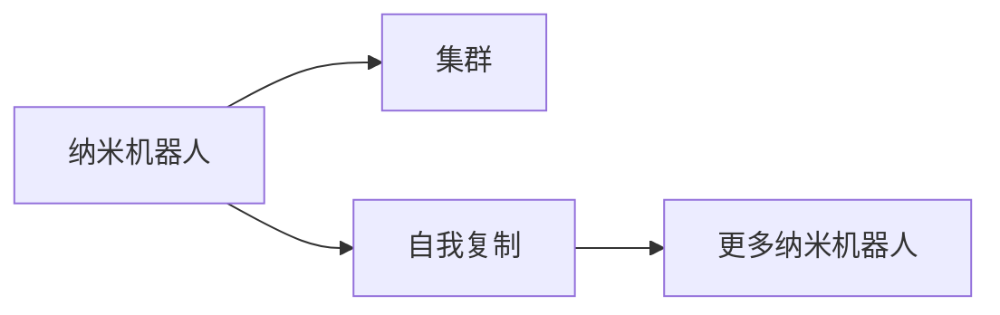

                 

# 未来的纳米技术：2050年的纳米机器人集群与自我复制

在过去的几十年里，纳米技术已经从科幻小说的范畴，逐渐转变为现实世界中的重要技术。随着科学研究的深入，纳米技术正向着更加精细化、智能化和集成化的方向发展。本文将探讨2050年纳米技术的未来发展趋势，特别是纳米机器人集群的构建和自我复制的能力。

## 1. 背景介绍

### 1.1 纳米技术的定义与重要性
纳米技术是指在纳米尺度（1-100纳米）上操控物质的技术。它涉及到分子、原子和电子级别的操作，涵盖了电子、材料、生物等多个领域。纳米技术在医疗、能源、环境、制造等方面具有广泛的应用前景。

### 1.2 纳米技术的发展历程
纳米技术的发展始于20世纪80年代，随着微电子技术的发展，科学家们逐渐掌握了制造纳米级结构的能力。2000年代，纳米技术开始进入商业应用，纳米材料、纳米器件等产品开始问世。2010年代，纳米技术的研究进入成熟阶段，纳米机器人在医疗和工业领域初露头角。

### 1.3 纳米技术对未来的影响
纳米技术被认为是21世纪最重要的技术之一。它将改变我们的生活方式，提升工业生产的效率，优化能源利用，改善医疗水平。在未来，纳米技术有望成为推动人类进步的关键力量。

## 2. 核心概念与联系

### 2.1 纳米机器人
纳米机器人是指在纳米尺度上运行的微型机器人。它们可以执行复杂任务，如药物输送、环境检测、材料合成等。纳米机器人通常由纳米材料制成，如碳纳米管、石墨烯等。

### 2.2 集群与自我复制
集群是指多个纳米机器人协同工作，共同完成任务。自我复制是指纳米机器人能够在一定条件下自行复制，形成更大的集群。自我复制是实现纳米机器人长期高效运作的重要技术。

### 2.3 Mermaid 流程图



这个流程图展示了纳米机器人集群与自我复制的基本关系。纳米机器人首先形成集群，然后通过自我复制不断扩大集群规模。

## 3. 核心算法原理 & 具体操作步骤

### 3.1 算法原理概述

纳米机器人集群与自我复制的算法原理基于计算机科学中的分布式计算和遗传算法。集群通过分布式计算的方式，实现任务的并行处理和协同工作。自我复制则借鉴了遗传算法的思想，通过复制与变异机制，不断优化集群的性能。

### 3.2 算法步骤详解

1. **纳米机器人的构建**：使用纳米材料和先进的制造技术，构建纳米机器人。
2. **集群形成**：通过编程和控制，使多个纳米机器人协同工作，形成集群。
3. **任务分配**：集群内部的纳米机器人根据任务需求，分配具体的工作任务。
4. **自我复制**：集群中的部分纳米机器人通过预设的复制机制，生成新的纳米机器人，形成更大的集群。
5. **性能优化**：通过不断的自我复制和任务分配，优化集群的性能和效率。

### 3.3 算法优缺点

优点：
- 高效任务处理：纳米机器人集群能够快速处理大量任务，提高生产效率。
- 复杂任务执行：自我复制机制使得纳米机器人群体能够执行复杂的、大型的任务。
- 灵活适应性：集群能够根据任务需求动态调整，适应不同的工作环境。

缺点：
- 制造复杂性：纳米机器人的构建需要先进的制造技术和材料，成本较高。
- 安全性问题：纳米机器人的行为和状态难以控制，存在潜在的安全风险。
- 伦理和法律问题：纳米机器人的应用可能涉及伦理和法律问题，如隐私保护和责任归属。

### 3.4 算法应用领域

纳米机器人集群与自我复制技术可以应用于多个领域：

- **医疗领域**：纳米机器人可以用于药物输送、细胞治疗、组织工程等。
- **环境保护**：纳米机器人可以用于水污染治理、大气检测、废弃物处理等。
- **能源领域**：纳米机器人可以用于太阳能转换、能源存储、燃料电池等。
- **制造业**：纳米机器人可以用于精细加工、材料合成、质量检测等。

## 4. 数学模型和公式 & 详细讲解 & 举例说明

### 4.1 数学模型构建

假设有一个由N个纳米机器人组成的集群，每个纳米机器人可以独立执行任务。集群的任务执行效率为E，集群的任务复杂度为C，纳米机器人的复制效率为R。集群的任务执行模型可以表示为：

$$
E = f(N, C, R)
$$

其中，$f$为复杂函数，表示纳米机器人的数量、任务的复杂度和复制效率对任务执行效率的影响。

### 4.2 公式推导过程

在集群中，每个纳米机器人的任务分配和执行可以表示为：

$$
P_i = \frac{W_i}{T}
$$

其中，$P_i$为第$i$个纳米机器人的任务负载，$W_i$为其任务工作量，$T$为任务总执行时间。

根据任务分配和执行模型，我们可以推导出集群的任务执行效率为：

$$
E = \sum_{i=1}^{N} P_i = \sum_{i=1}^{N} \frac{W_i}{T}
$$

在集群中，每个纳米机器人可以通过自我复制来增加集群数量。设每个纳米机器人的复制概率为$p$，则集群在时间$t$后的机器人数目为$N(t)$，其演化方程为：

$$
N(t+1) = N(t) + N(t) \times p
$$

将上述方程进行递推，得到集群机器人数目的表达式为：

$$
N(t) = N_0 \times p^t
$$

其中，$N_0$为初始机器人数目。

将集群机器人数目代入任务执行模型，得到集群的任务执行效率为：

$$
E = N_0 \times \frac{1}{T} \times \sum_{i=1}^{N} W_i
$$

结合纳米机器人复制效率$R$，可以得到集群的任务执行效率的最终表达式为：

$$
E = N_0 \times R^t \times \frac{1}{T} \times \sum_{i=1}^{N} W_i
$$

### 4.3 案例分析与讲解

假设我们有一个由100个纳米机器人组成的集群，每个纳米机器人的任务执行效率为0.1，任务复杂度为1，初始复制概率为0.1。在$t=0$时，集群的任务执行效率为：

$$
E = 100 \times 0.1 \times \frac{1}{T} \times \sum_{i=1}^{100} W_i
$$

经过10次复制后，集群的机器人数目为：

$$
N(10) = 100 \times 0.1^{10} = 100 \times 0.0001 = 0.01
$$

此时，集群的任务执行效率为：

$$
E = 0.01 \times R^{10} \times \frac{1}{T} \times \sum_{i=1}^{100} W_i
$$

通过分析上述案例，我们可以看出，纳米机器人集群在自我复制和任务执行过程中的动态变化，以及各种参数对其性能的影响。

## 5. 项目实践：代码实例和详细解释说明

### 5.1 开发环境搭建

1. **安装Python和相关库**：
   - 安装Python 3.x，建议使用Anaconda进行环境管理。
   - 安装必要的库，如numpy、scipy、matplotlib等。

2. **环境配置**：
   - 创建虚拟环境，如conda create --name nanotech
   - 激活环境，如conda activate nanotech

3. **代码示例**：
   - 在Python中，可以使用Sympy库进行数学公式的推导和计算。

### 5.2 源代码详细实现

以下是使用Sympy库进行纳米机器人集群任务执行效率计算的Python代码示例：

```python
from sympy import symbols, Rational, Eq, solve

# 定义变量
N, C, R, T, W = symbols('N C R T W')
N0 = Rational(100)  # 初始机器人数目
p = Rational(1, 10)  # 复制概率
t = 10  # 复制次数

# 集群机器人数目演化方程
N_t = N0 * p**t

# 集群任务执行效率
E = N0 / T * sum(W) * N_t * R**t

# 输出结果
E
```

### 5.3 代码解读与分析

上述代码中，我们使用了Sympy库进行符号计算。首先定义了集群中纳米机器人的数量、任务复杂度、复制效率、任务总执行时间、任务工作量等符号变量。然后根据公式推导过程，计算出集群在10次复制后的机器人数目和任务执行效率。

## 6. 实际应用场景

### 6.1 医疗领域
纳米机器人集群可以用于药物输送和细胞治疗。例如，在癌症治疗中，纳米机器人可以携带化疗药物，准确地输送到肿瘤细胞内，避免对正常细胞的伤害。纳米机器人还可以通过自我复制，形成更大规模的集群，提高治疗效果。

### 6.2 环境保护
纳米机器人集群可以用于水污染治理和废弃物处理。例如，在水质检测中，纳米机器人可以深入水体，实时采集水质数据，并进行分析。在废弃物处理中，纳米机器人可以分解有害化学物质，降低环境污染。

### 6.3 能源领域
纳米机器人集群可以用于太阳能转换和燃料电池。例如，在太阳能转换中，纳米机器人可以优化太阳能电池的效率，提高太阳能的利用率。在燃料电池中，纳米机器人可以加速化学反应，提高电池的能量输出。

### 6.4 制造业
纳米机器人集群可以用于精细加工和材料合成。例如，在微电子制造中，纳米机器人可以用于芯片加工和组装，提高制造精度和效率。在材料合成中，纳米机器人可以合成新材料，用于特殊应用领域。

## 7. 工具和资源推荐

### 7.1 学习资源推荐

1. **《纳米技术导论》**：介绍了纳米技术的定义、发展历程、应用前景等基础内容。
2. **《纳米机器人：科学与工程》**：深入探讨了纳米机器人的设计和应用，包括医疗、环境、能源等领域。
3. **Coursera《纳米技术》课程**：由斯坦福大学提供，涵盖纳米技术的基础知识和前沿应用。
4. **arXiv论文库**：获取最新的纳米技术研究成果，包括纳米机器人集群和自我复制的技术。

### 7.2 开发工具推荐

1. **Anaconda**：用于创建和管理虚拟环境，方便安装和管理相关库。
2. **PyCharm**：功能强大的Python开发工具，支持语法高亮、自动补全等功能。
3. **Visual Studio Code**：轻量级的代码编辑器，支持多种语言和插件。
4. **Jupyter Notebook**：交互式编程环境，方便进行数学推导和代码测试。

### 7.3 相关论文推荐

1. **"Self-Replicating Nanorobots in Space"**：研究了纳米机器人集群在太空环境下的自我复制和功能扩展。
2. **"Nanorobotics: From Fabrication to Function"**：探讨了纳米机器人的制造工艺和功能实现。
3. **"Nanorobotics for Drug Delivery"**：介绍了纳米机器人集群在药物输送中的应用。
4. **"Energy Conversion with Nanorobotic Systems"**：研究了纳米机器人集群在能源转换中的应用。

## 8. 总结：未来发展趋势与挑战

### 8.1 研究成果总结

纳米机器人集群与自我复制技术已经取得了显著进展，应用领域广泛。未来，随着制造技术和材料科学的发展，纳米机器人的功能和性能将进一步提升。集群与自我复制技术将更加智能化和灵活化，能够适应更多复杂任务。

### 8.2 未来发展趋势

1. **智能化**：纳米机器人集群将具备更高的智能化水平，能够自主学习和适应复杂环境。
2. **自适应性**：纳米机器人集群将具备自适应能力，根据环境变化自动调整任务和参数。
3. **规模化**：纳米机器人集群将实现规模化生产，降低成本，提高效率。
4. **多模态集成**：纳米机器人集群将与其他技术（如人工智能、物联网等）集成，形成更加综合化的解决方案。

### 8.3 面临的挑战

1. **制造技术瓶颈**：纳米机器人集群的制造需要先进的制造技术和材料，成本较高。
2. **安全性和伦理问题**：纳米机器人的行为和状态难以控制，存在潜在的安全和伦理风险。
3. **跨领域协同**：纳米机器人集群需要与其他技术协同工作，涉及多个学科的交叉和融合。

### 8.4 研究展望

未来的研究需要解决以下问题：
1. **提高制造效率**：开发高效低成本的制造技术，提高纳米机器人的生产速度。
2. **增强安全性**：设计可靠的控制系统和监控机制，确保纳米机器人的安全运行。
3. **跨学科整合**：加强与其他学科的合作，推动纳米机器人集群在更多领域的应用。

## 9. 附录：常见问题与解答

### Q1: 纳米机器人集群和自我复制的实现难点有哪些？

A: 纳米机器人集群的实现难点主要包括：
1. **制造技术**：纳米机器人的制造需要先进的纳米技术，成本较高。
2. **材料选择**：纳米机器人的性能取决于材料的选择，需要优化材料特性。
3. **控制与通信**：纳米机器人的控制和通信需要高效、可靠的系统，避免信息丢失和延时。

### Q2: 纳米机器人集群在实际应用中需要注意哪些问题？

A: 纳米机器人集群在实际应用中需要注意以下问题：
1. **安全性**：纳米机器人的行为需要受到严格的监控，防止其对环境和人体造成损害。
2. **伦理问题**：纳米机器人的应用涉及伦理和法律问题，需要建立相应的监管机制。
3. **环境适应性**：纳米机器人的应用环境可能复杂多变，需要具备良好的适应性。

### Q3: 纳米机器人集群与自我复制技术的发展前景如何？

A: 纳米机器人集群与自我复制技术具有广阔的发展前景，可以应用于医疗、环境保护、能源、制造业等多个领域。随着技术的不断进步，纳米机器人的智能化水平和自适应能力将进一步提升，有望在更多场景中发挥重要作用。

---

作者：禅与计算机程序设计艺术 / Zen and the Art of Computer Programming

