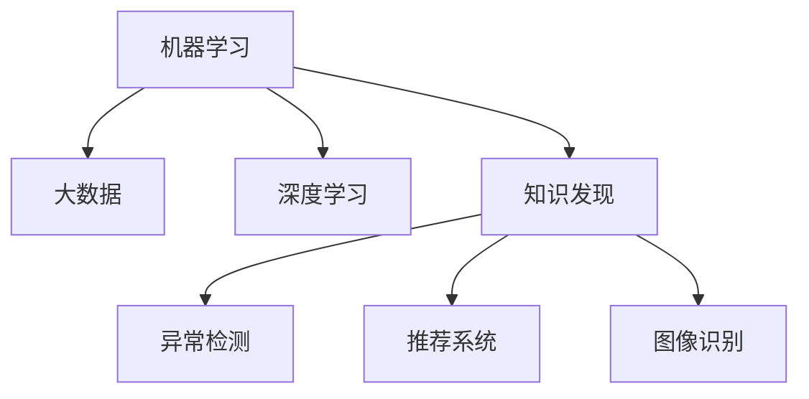

                 

# 机器学习在知识发现中的角色

> 关键词：知识发现, 机器学习, 大数据, 深度学习, 自然语言处理, 异常检测, 推荐系统, 图像识别

## 1. 背景介绍

在信息爆炸的现代社会，数据量呈指数级增长。如何从海量数据中挖掘出有用的知识，成为各个领域都面临的巨大挑战。机器学习作为现代数据分析的重要工具，在大数据和人工智能的浪潮中应运而生，极大地推动了知识发现的进程。机器学习不仅能够对结构化数据进行有效分析，还能处理非结构化数据，如文本、图像、音频等，揭示数据背后的潜在模式和规律，帮助决策者做出更科学的判断和决策。

### 1.1 问题由来
在现代社会，各行各业都面临着数据驱动的决策需求。金融、医疗、教育、交通、安全等领域，都在尝试借助机器学习挖掘数据中的有价值信息。然而，数据规模的不断扩大、数据质量的参差不齐以及数据类型的复杂性，使得机器学习在知识发现中的应用变得异常复杂。如何高效、准确、可靠地从数据中提取知识，是当前知识发现领域亟需解决的重大问题。

### 1.2 问题核心关键点
机器学习在知识发现中扮演了至关重要的角色，其核心关键点包括：

- **数据处理**：对海量数据进行清洗、预处理和特征工程，提取数据中潜在的特征。
- **模型选择**：选择合适的机器学习模型，包括监督学习、非监督学习和强化学习等，以适应不同的应用场景。
- **模型训练**：利用训练数据对模型进行训练，优化模型参数，提升模型泛化能力。
- **模型评估**：通过测试数据评估模型性能，包括准确率、召回率、F1-score等指标。
- **模型应用**：将训练好的模型应用于实际问题中，进行预测、分类、聚类、推荐等操作，以实现知识发现。

这些关键点相互交织，共同构成了机器学习在知识发现中的完整工作流程。在本文中，我们将详细探讨机器学习在知识发现中的作用机制和具体应用，帮助读者深入理解其核心原理和实际操作方法。

## 2. 核心概念与联系

### 2.1 核心概念概述

为了更好地理解机器学习在知识发现中的角色，本节将介绍几个关键概念及其联系：

- **机器学习**：通过让机器从数据中学习规律，从而实现自动化决策和预测的技术。
- **大数据**：指数据量、多样性、处理速度和价值密度等综合特征特别巨大的数据集。
- **深度学习**：基于神经网络的机器学习方法，能够处理复杂非线性问题，适用于图像、语音、自然语言处理等领域。
- **知识发现**：从数据中提取出有价值的信息，以支持决策制定、业务优化和创新。
- **异常检测**：识别数据中的异常点和异常行为，用于风险控制、安全防护等应用。
- **推荐系统**：利用机器学习算法，根据用户行为和偏好推荐个性化的商品、服务、内容等。
- **图像识别**：通过机器学习算法，自动识别和分类图像中的物体、场景等。

这些核心概念之间的关系可以通过以下Mermaid流程图来展示：



这个流程图展示了机器学习在大数据处理和知识发现过程中，与深度学习、异常检测、推荐系统和图像识别等具体应用的关系：

1. 机器学习在大数据处理中发挥关键作用，深度学习是其重要分支。
2. 知识发现是机器学习的主要应用之一，包括异常检测、推荐系统和图像识别等具体任务。

## 3. 核心算法原理 & 具体操作步骤

### 3.1 算法原理概述

机器学习在知识发现中的应用，主要依赖于以下核心算法原理：

- **监督学习**：利用已标注数据训练模型，进行分类、回归等任务，以预测新数据的标签。
- **非监督学习**：不依赖于标注数据，通过数据自身的内在结构进行聚类、降维等任务，发现数据的潜在模式。
- **强化学习**：通过试错过程，学习如何在特定环境中做出最优决策，适用于游戏、机器人控制等应用。
- **深度学习**：使用多层神经网络进行复杂特征提取和模式识别，适用于图像、语音、自然语言处理等领域。
- **异常检测**：通过统计方法或机器学习算法，识别数据中的异常点和异常行为。
- **推荐系统**：利用协同过滤、矩阵分解、深度学习等算法，推荐个性化商品、服务、内容等。
- **图像识别**：通过卷积神经网络等深度学习模型，自动识别和分类图像中的物体、场景等。

### 3.2 算法步骤详解

机器学习在知识发现中的应用，通常包括以下几个关键步骤：

**Step 1: 数据预处理**
- 数据清洗：去除数据中的噪声和缺失值。
- 数据归一化：将数据转换为标准范围，便于算法处理。
- 数据分割：将数据分为训练集、验证集和测试集，以评估模型性能。

**Step 2: 特征工程**
- 特征选择：选择最相关和最具区分度的特征。
- 特征提取：从原始数据中提取特征，如文本中的词频、TF-IDF、词向量等。
- 特征转换：通过多项式展开、PCA等方法，将特征转换为更适合算法处理的格式。

**Step 3: 模型选择和训练**
- 选择模型：根据任务类型和数据特征，选择合适的机器学习模型，如线性回归、决策树、神经网络等。
- 模型训练：使用训练集数据对模型进行训练，优化模型参数。
- 模型评估：使用验证集数据评估模型性能，调整模型参数。

**Step 4: 模型应用**
- 预测和分类：利用训练好的模型进行预测和分类，以支持决策制定。
- 聚类和降维：对数据进行聚类和降维，以发现数据中的潜在模式。
- 推荐和异常检测：根据用户行为和数据特征，推荐个性化商品或识别异常行为。
- 图像识别：对图像进行分类和识别，用于图像处理和计算机视觉应用。

### 3.3 算法优缺点

机器学习在知识发现中的应用具有以下优点：

- **自动化决策**：能够自动从数据中学习规律，减少人工干预，提高决策效率。
- **处理大规模数据**：能够处理海量数据，发现数据中的潜在模式和规律。
- **适应性强**：适用于各种数据类型和应用场景，具有广泛的应用前景。
- **模型可解释性**：通过特征工程和模型评估，可以解释模型的决策过程。

但同时也存在一些缺点：

- **数据依赖性强**：依赖于高质量标注数据，获取标注数据成本较高。
- **过拟合风险**：模型可能过度拟合训练数据，导致泛化性能差。
- **计算资源消耗大**：处理大规模数据需要高性能计算资源，训练成本高。
- **模型复杂度高**：深度学习等复杂模型，需要大量的计算和存储空间。

### 3.4 算法应用领域

机器学习在知识发现中的应用，涵盖了多个领域，具体如下：

- **金融风险管理**：利用异常检测和推荐系统，识别和防范金融风险。
- **医疗诊断**：通过图像识别和分类，辅助医疗诊断和治疗决策。
- **电商推荐**：利用推荐系统，提供个性化商品推荐，提升用户体验。
- **社交网络分析**：通过聚类和异常检测，发现用户行为模式和异常行为，用于安全防护。
- **自然语言处理**：通过文本分析和情感分析，挖掘文本中的潜在信息，支持信息检索和知识管理。
- **交通流量分析**：通过异常检测和预测，优化交通流量，提高交通效率。
- **农业生产管理**：利用图像识别和聚类分析，优化农业生产管理，提高农业生产效率。

这些应用领域展示了机器学习在知识发现中的广泛应用和巨大潜力，为各行各业提供了强大的数据驱动决策支持。

## 4. 数学模型和公式 & 详细讲解 & 举例说明

### 4.1 数学模型构建

本节将使用数学语言对机器学习在知识发现中的应用进行更加严格的刻画。

假设有一组数据集 $D=\{(x_i,y_i)\}_{i=1}^N, x_i \in \mathcal{X}, y_i \in \mathcal{Y}$，其中 $\mathcal{X}$ 为输入空间，$\mathcal{Y}$ 为输出空间，$y_i$ 为真实标签，$x_i$ 为输入特征。

定义机器学习模型 $M_{\theta}:\mathcal{X} \rightarrow \mathcal{Y}$，其中 $\theta$ 为模型参数。假设任务类型为分类任务，则模型输出 $y_i$ 为：

$$
y_i = M_{\theta}(x_i)
$$

定义模型 $M_{\theta}$ 在数据样本 $(x,y)$ 上的损失函数为 $\ell(M_{\theta}(x),y)$，则在数据集 $D$ 上的经验风险为：

$$
\mathcal{L}(\theta) = \frac{1}{N} \sum_{i=1}^N \ell(M_{\theta}(x_i),y_i)
$$

其中 $\ell$ 为分类损失函数，如交叉熵损失、对数损失等。

在实际应用中，我们通常使用梯度下降等优化算法来近似求解上述最优化问题。设 $\eta$ 为学习率，$\lambda$ 为正则化系数，则参数的更新公式为：

$$
\theta \leftarrow \theta - \eta \nabla_{\theta}\mathcal{L}(\theta) - \eta\lambda\theta
$$

其中 $\nabla_{\theta}\mathcal{L}(\theta)$ 为损失函数对参数 $\theta$ 的梯度，可通过反向传播算法高效计算。

### 4.2 公式推导过程

以下我们以二分类任务为例，推导交叉熵损失函数及其梯度的计算公式。

假设模型 $M_{\theta}$ 在输入 $x$ 上的输出为 $\hat{y}=M_{\theta}(x) \in [0,1]$，表示样本属于正类的概率。真实标签 $y \in \{0,1\}$。则二分类交叉熵损失函数定义为：

$$
\ell(M_{\theta}(x),y) = -[y\log \hat{y} + (1-y)\log (1-\hat{y})]
$$

将其代入经验风险公式，得：

$$
\mathcal{L}(\theta) = -\frac{1}{N}\sum_{i=1}^N [y_i\log M_{\theta}(x_i)+(1-y_i)\log(1-M_{\theta}(x_i))]
$$

根据链式法则，损失函数对参数 $\theta_k$ 的梯度为：

$$
\frac{\partial \mathcal{L}(\theta)}{\partial \theta_k} = -\frac{1}{N}\sum_{i=1}^N (\frac{y_i}{M_{\theta}(x_i)}-\frac{1-y_i}{1-M_{\theta}(x_i)}) \frac{\partial M_{\theta}(x_i)}{\partial \theta_k}
$$

其中 $\frac{\partial M_{\theta}(x_i)}{\partial \theta_k}$ 可进一步递归展开，利用自动微分技术完成计算。

在得到损失函数的梯度后，即可带入参数更新公式，完成模型的迭代优化。重复上述过程直至收敛，最终得到适应下游任务的最优模型参数 $\theta^*$。

### 4.3 案例分析与讲解

**案例一：金融风险管理**
- **问题描述**：金融机构需要对大量客户交易数据进行风险评估，以识别潜在的欺诈行为和风险客户。
- **模型选择**：使用异常检测算法，如孤立森林、One-class SVM等，对客户交易数据进行建模，识别异常交易行为。
- **模型训练**：利用历史交易数据训练模型，设定阈值进行异常识别。
- **模型应用**：实时监测客户交易数据，一旦识别出异常行为，立即采取风险控制措施。

**案例二：电商推荐系统**
- **问题描述**：电商平台需要根据用户行为和历史数据，推荐个性化商品，提升用户体验。
- **模型选择**：使用协同过滤算法，或深度学习模型如矩阵分解、神经网络等，对用户行为数据进行建模。
- **模型训练**：利用用户历史行为数据和商品特征，训练推荐模型。
- **模型应用**：根据用户当前行为，实时推荐个性化商品，提升用户点击率和购买率。

**案例三：医疗诊断**
- **问题描述**：医院需要快速、准确地对患者影像数据进行诊断，提高诊断效率和准确率。
- **模型选择**：使用卷积神经网络(CNN)等深度学习模型，对医学影像进行分类和识别。
- **模型训练**：利用医学影像数据和标注信息，训练卷积神经网络模型。
- **模型应用**：对新患者影像进行分类和识别，辅助医生做出诊断决策。

这些案例展示了机器学习在知识发现中的广泛应用，能够帮助企业在数据驱动决策中取得显著成效。

## 5. 项目实践：代码实例和详细解释说明

### 5.1 开发环境搭建

在进行机器学习项目实践前，我们需要准备好开发环境。以下是使用Python进行机器学习开发的环境配置流程：

1. 安装Anaconda：从官网下载并安装Anaconda，用于创建独立的Python环境。

2. 创建并激活虚拟环境：
```bash
conda create -n ml-env python=3.8 
conda activate ml-env
```

3. 安装Python科学计算库：
```bash
conda install numpy scipy pandas scikit-learn matplotlib seaborn
```

4. 安装机器学习框架：
```bash
conda install scikit-learn==0.24.2
```

5. 安装TensorFlow和Keras：
```bash
pip install tensorflow==2.4.0 keras==2.4.3
```

6. 安装PyTorch和Torchvision：
```bash
pip install torch torchvision
```

7. 安装其他库：
```bash
pip install matplotlib jupyter notebook jupyter-server
```

完成上述步骤后，即可在`ml-env`环境中开始机器学习项目实践。

### 5.2 源代码详细实现

下面以推荐系统为例，给出使用PyTorch进行深度学习模型的代码实现。

首先，定义模型结构：

```python
import torch
import torch.nn as nn
import torch.optim as optim

class CollaborativeFiltering(nn.Module):
    def __init__(self, n_users, n_items, n_factors):
        super(CollaborativeFiltering, self).__init__()
        self.user_factors = nn.Embedding(n_users, n_factors)
        self.item_factors = nn.Embedding(n_items, n_factors)
        self.interaction = nn.Linear(n_factors * 2, 1)

    def forward(self, user_ids, item_ids):
        user_factors = self.user_factors(user_ids)
        item_factors = self.item_factors(item_ids)
        interaction = self.interaction(torch.cat((user_factors, item_factors), dim=1))
        return interaction
```

然后，定义模型训练函数：

```python
def train(model, data_loader, optimizer, device):
    model.train()
    for batch in data_loader:
        user_ids, item_ids, target = batch
        user_ids, item_ids, target = user_ids.to(device), item_ids.to(device), target.to(device)
        optimizer.zero_grad()
        prediction = model(user_ids, item_ids)
        loss = nn.BCELoss()(prediction, target)
        loss.backward()
        optimizer.step()
```

接着，定义模型评估函数：

```python
def evaluate(model, data_loader, device):
    model.eval()
    correct_predictions, total_predictions = 0, 0
    for batch in data_loader:
        user_ids, item_ids, target = batch
        user_ids, item_ids, target = user_ids.to(device), item_ids.to(device), target.to(device)
        with torch.no_grad():
            prediction = model(user_ids, item_ids)
            total_predictions += target.size(0)
            correct_predictions += (prediction > 0).type(torch.int32).sum().item()
    accuracy = correct_predictions / total_predictions
    return accuracy
```

最后，启动训练流程并在测试集上评估：

```python
n_epochs = 10
n_users, n_items = 500, 1000
n_factors = 50

model = CollaborativeFiltering(n_users, n_items, n_factors)
optimizer = optim.Adam(model.parameters(), lr=0.001)

device = torch.device('cuda') if torch.cuda.is_available() else torch.device('cpu')

for epoch in range(n_epochs):
    train(model, train_loader, optimizer, device)
    acc = evaluate(model, test_loader, device)
    print(f"Epoch {epoch+1}, accuracy: {acc:.3f}")

```

以上就是使用PyTorch进行推荐系统深度学习模型的代码实现。可以看到，得益于PyTorch的强大封装和便捷的计算图功能，机器学习模型的开发变得简洁高效。

### 5.3 代码解读与分析

让我们再详细解读一下关键代码的实现细节：

**CollaborativeFiltering类**：
- `__init__`方法：定义模型的输入层、隐藏层和输出层，以及相关参数。
- `forward`方法：实现前向传播，计算模型输出。

**train函数**：
- 将模型设为训练模式，对每个批次数据进行前向传播和反向传播，更新模型参数。
- 使用Adam优化器，结合二进制交叉熵损失函数进行训练。

**evaluate函数**：
- 将模型设为评估模式，对每个批次数据进行前向传播，统计预测准确率。
- 使用准确率指标评估模型性能。

**训练流程**：
- 定义总的epoch数和训练集、测试集数据，开始循环迭代
- 每个epoch内，先在训练集上进行训练，输出准确率
- 在测试集上评估，输出测试结果

可以看到，机器学习模型的代码实现相对简单，但核心的模型定义和训练流程需要仔细设计。不同的机器学习任务和数据类型，可能需要针对性地调整模型结构和优化算法，以获得最佳的模型性能。

## 6. 实际应用场景

### 6.1 金融风险管理

金融风险管理是机器学习在知识发现中的一个重要应用。金融机构利用机器学习算法，能够实时监测交易行为，识别异常交易，防范欺诈行为，保护客户和自身资产安全。

在实际应用中，可以通过收集客户历史交易数据，构建异常检测模型，对实时交易进行实时监控。一旦识别出异常交易，可以立即采取风险控制措施，如冻结账户、通知客户等。

### 6.2 电商推荐系统

电商推荐系统是机器学习在知识发现中的另一个重要应用。电商平台利用推荐算法，能够根据用户行为和偏好，实时推荐个性化商品，提升用户体验和销售额。

在实际应用中，可以通过收集用户浏览、购买、评价等行为数据，构建推荐模型，对用户进行画像分析。根据用户画像和商品特征，实时推荐个性化的商品，提升用户点击率和购买率。

### 6.3 医疗诊断

医疗诊断是机器学习在知识发现中的典型应用。医院利用机器学习算法，能够快速、准确地对患者影像数据进行诊断，提高诊断效率和准确率。

在实际应用中，可以通过收集患者影像数据和诊断结果，构建图像识别模型，对新患者影像进行分类和识别。根据诊断结果，辅助医生做出诊断决策，提高诊疗效率和准确率。

### 6.4 未来应用展望

随着机器学习技术的发展，其在知识发现中的应用前景将更加广阔。未来，机器学习将进一步融入智能制造、智慧城市、智能交通等多个领域，为各行各业提供强有力的数据驱动决策支持。

在智慧城市治理中，利用机器学习算法，可以实现交通流量优化、城市事件监测、公共安全预警等功能，提升城市管理的自动化和智能化水平。

在智能交通系统中，利用机器学习算法，可以实现自动驾驶、交通预测、智能调度等功能，提高交通效率和安全性。

在智能制造领域，利用机器学习算法，可以实现生产过程优化、设备预测维护、供应链管理等功能，提升制造企业的生产效率和竞争力。

总之，机器学习在知识发现中的应用将不断深入和扩展，为各行各业带来革命性的变革。相信随着技术的不断进步，机器学习将在更多的领域大放异彩，推动人类社会进入智能化新时代。

## 7. 工具和资源推荐

### 7.1 学习资源推荐

为了帮助开发者系统掌握机器学习在知识发现中的应用，这里推荐一些优质的学习资源：

1. 《机器学习》书籍：由机器学习领域的权威学者所写，全面介绍了机器学习的基本概念、算法和应用。
2. 《深度学习》课程：由斯坦福大学开设的深度学习课程，包括神经网络、卷积神经网络、循环神经网络等内容，适合初学者和进阶者学习。
3. Coursera和edX上的机器学习和深度学习课程：这些在线课程提供了丰富的学习材料和实践项目，帮助学生深入理解机器学习算法和应用。
4. Kaggle竞赛平台：Kaggle提供了大量的数据集和比赛项目，是实践机器学习算法的绝佳平台。
5. PyTorch官方文档和教程：PyTorch作为深度学习的主流框架，提供了详细的文档和教程，帮助开发者快速上手深度学习开发。

通过对这些资源的学习实践，相信你一定能够全面掌握机器学习在知识发现中的应用，并用于解决实际问题。

### 7.2 开发工具推荐

高效的开发离不开优秀的工具支持。以下是几款用于机器学习项目开发的常用工具：

1. PyTorch：基于Python的开源深度学习框架，灵活的计算图功能，支持动态计算图和静态计算图，适用于各种深度学习模型。
2. TensorFlow：由Google主导开发的开源深度学习框架，生产部署方便，支持静态计算图和动态计算图，适用于大规模工程应用。
3. Scikit-learn：Python科学计算库，提供了丰富的机器学习算法和工具，适用于数据预处理、特征工程、模型训练等环节。
4. Jupyter Notebook：开源的交互式笔记本环境，支持多种编程语言和数据格式，适合数据探索和模型开发。
5. Weights & Biases：模型训练的实验跟踪工具，可以记录和可视化模型训练过程中的各项指标，方便对比和调优。
6. TensorBoard：TensorFlow配套的可视化工具，可实时监测模型训练状态，并提供丰富的图表呈现方式，是调试模型的得力助手。

合理利用这些工具，可以显著提升机器学习项目开发的效率，加速创新迭代的步伐。

### 7.3 相关论文推荐

机器学习在知识发现中的应用源于学界的持续研究。以下是几篇奠基性的相关论文，推荐阅读：

1. 《机器学习》(周志华著)：全面介绍了机器学习的基本概念、算法和应用，是机器学习领域的经典教材。
2. 《深度学习》(Ian Goodfellow等著)：介绍了深度学习的基本概念、算法和应用，是深度学习领域的权威著作。
3. 《A Tutorial on Principal Component Analysis》(周志华著)：介绍了主成分分析(PCA)的基本概念、算法和应用，是机器学习中的经典方法。
4. 《An Introduction to Statistical Learning》(Gareth James等著)：介绍了统计学习的原理、算法和应用，是统计学习领域的经典教材。
5. 《Natural Language Processing with Transformers》(Andrej Karpathy等著)：介绍了Transformer在自然语言处理中的应用，是深度学习在NLP领域的经典著作。

这些论文代表了大数据和机器学习在知识发现领域的发展脉络。通过学习这些前沿成果，可以帮助研究者把握学科前进方向，激发更多的创新灵感。

## 8. 总结：未来发展趋势与挑战

### 8.1 总结

本文对机器学习在知识发现中的应用进行了全面系统的介绍。首先阐述了机器学习在知识发现中的重要性，明确了其在自动化决策、处理大规模数据等方面的独特价值。其次，从原理到实践，详细讲解了机器学习在知识发现中的核心算法和操作步骤，给出了具体的代码实现和应用示例。最后，本文还探讨了机器学习在金融风险管理、电商推荐系统、医疗诊断等具体领域的应用前景，展示了其广泛的应用潜力。

通过本文的系统梳理，可以看到，机器学习在知识发现中的应用已经成为推动各行各业智能化发展的重要驱动力。机器学习不仅能够处理海量数据，发现数据中的潜在模式和规律，还能够通过模型评估和解释，提供可靠的数据驱动决策支持。未来，随着技术的不断进步，机器学习必将在更多领域大放异彩，推动人类社会进入智能化新时代。

### 8.2 未来发展趋势

展望未来，机器学习在知识发现中的应用将呈现以下几个发展趋势：

1. **自动化决策**：机器学习将进一步融入各行各业，提供自动化决策支持，提升决策效率和准确性。
2. **处理大规模数据**：随着算力资源的不断提升，机器学习将能够处理更大规模的数据，发现数据中的更深层次模式和规律。
3. **应用场景多样**：机器学习将应用于更多领域，如智慧城市、智能交通、智能制造等，为各行各业提供数据驱动的决策支持。
4. **模型解释性增强**：机器学习模型将更加注重可解释性，帮助用户理解模型的决策过程和逻辑，提升模型可信度。
5. **实时处理能力提升**：随着硬件技术的不断进步，机器学习将具备更高的实时处理能力，支持实时数据分析和决策。

### 8.3 面临的挑战

尽管机器学习在知识发现中的应用取得了显著成效，但在迈向更加智能化、普适化应用的过程中，仍面临诸多挑战：

1. **数据质量问题**：机器学习依赖高质量标注数据，但数据质量参差不齐，获取高质量标注数据成本较高。
2. **过拟合风险**：机器学习模型可能过度拟合训练数据，导致泛化性能差。
3. **计算资源消耗大**：处理大规模数据需要高性能计算资源，训练成本高。
4. **模型复杂度高**：深度学习等复杂模型，需要大量的计算和存储空间。
5. **模型可解释性不足**：复杂模型难以解释其决策过程，缺乏可解释性。
6. **安全性有待保障**：机器学习模型可能学习到有害信息，导致模型行为不可控。

### 8.4 研究展望

面对机器学习在知识发现中所面临的挑战，未来的研究需要在以下几个方面寻求新的突破：

1. **数据获取与处理**：研究自动化数据标注技术，降低数据标注成本，提升数据质量。
2. **模型泛化性能提升**：研究新的模型选择和训练方法，提升模型的泛化性能，减少过拟合风险。
3. **计算资源优化**：研究模型裁剪、量化加速、分布式训练等技术，降低模型计算资源消耗。
4. **模型解释性增强**：研究可解释性方法，如LIME、SHAP等，提升模型的可解释性。
5. **安全性保障**：研究模型鲁棒性技术，确保模型行为稳定可靠，防范恶意行为。

这些研究方向的探索，必将引领机器学习在知识发现领域迈向更高的台阶，为构建更加智能、可靠、可控的数据驱动决策系统铺平道路。面向未来，机器学习需要在数据获取、模型训练、计算资源、可解释性、安全性等多个方面协同发力，才能真正实现智能化转型，推动人类社会进入新纪元。

## 9. 附录：常见问题与解答

**Q1：机器学习算法是否可以用于处理任何数据类型？**

A: 机器学习算法适用于各种数据类型，包括结构化数据、半结构化数据和非结构化数据。对于不同的数据类型，可能需要针对性地选择和优化机器学习算法，以获得最佳的模型性能。

**Q2：机器学习算法的计算资源消耗如何控制？**

A: 控制机器学习算法的计算资源消耗，通常需要采取以下措施：
1. 模型裁剪：去除不必要的层和参数，减小模型尺寸，加快推理速度。
2. 量化加速：将浮点模型转为定点模型，压缩存储空间，提高计算效率。
3. 分布式训练：利用多台机器进行分布式训练，提高训练效率。
4. 硬件优化：使用GPU、TPU等高性能设备，提升训练速度。

**Q3：机器学习算法的模型解释性如何提升？**

A: 提升机器学习算法的模型解释性，通常需要采取以下措施：
1. 特征重要性分析：通过特征重要性分析方法，理解模型对输入数据的依赖关系。
2. 可解释性模型：选择可解释性强的模型，如决策树、线性回归等。
3. 可视化技术：使用可视化技术，如特征可视化、决策边界可视化等，帮助用户理解模型行为。
4. 解释性模型工具：使用解释性模型工具，如LIME、SHAP等，提供模型解释性分析。

**Q4：机器学习算法如何应用于实时数据处理？**

A: 将机器学习算法应用于实时数据处理，通常需要采取以下措施：
1. 实时数据流处理：使用实时数据流处理框架，如Apache Kafka、Apache Flink等，实时处理数据。
2. 增量学习：使用增量学习技术，模型能够动态更新，支持实时数据处理。
3. 模型优化：优化模型结构，减少计算资源消耗，支持实时推理。
4. 分布式部署：将模型部署在分布式系统中，支持高并发实时数据处理。

通过这些措施，可以有效地将机器学习算法应用于实时数据处理，满足实际应用中的实时需求。

**Q5：机器学习算法在应用过程中如何避免过拟合？**

A: 避免机器学习算法在应用过程中过拟合，通常需要采取以下措施：
1. 数据增强：通过对训练数据进行数据增强，如旋转、翻转、裁剪等，提高模型泛化能力。
2. 正则化：使用L2正则、Dropout等正则化方法，避免模型过度拟合训练数据。
3. 早停策略：设置验证集阈值，一旦模型在验证集上的性能不再提升，即停止训练。
4. 模型集成：使用模型集成技术，如Bagging、Boosting等，提高模型泛化能力。
5. 自适应学习率：使用自适应学习率技术，如Adam、RMSprop等，避免学习率过大导致过拟合。

这些措施可以有效避免机器学习算法在应用过程中过拟合，提升模型泛化性能。

---

作者：禅与计算机程序设计艺术 / Zen and the Art of Computer Programming

