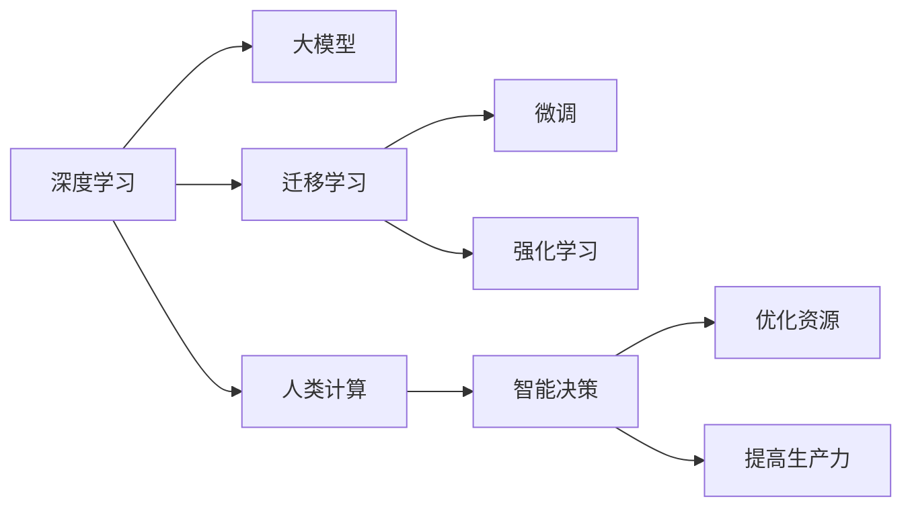

                 

# 构建更智能的世界：人类计算的应用场景

## 1. 背景介绍

### 1.1 问题由来

随着人工智能技术的快速发展，人类计算的概念已经从传统的数据处理和算法优化，扩展到包括机器学习、深度学习、自然语言处理等多个领域。这种扩展不仅推动了技术的进步，也带来了新的应用场景和挑战。本章节将从背景介绍开始，概述人类计算在现代社会中的重要性以及其面临的主要问题。

### 1.2 问题核心关键点

人类计算的核心在于如何通过高效、精确地处理海量数据和复杂算法，来提升决策质量、优化资源配置、提高生产力。然而，随着数据量的不断增长和算法复杂度的提升，人类计算面临以下挑战：

- 计算资源的有限性：硬件设施的计算能力有限，难以支撑大规模、高复杂度的计算任务。
- 数据质量的不确定性：数据收集和标注的质量直接影响算法的准确性和鲁棒性。
- 算法模型的泛化能力：模型的泛化能力差，难以适应新的、未知的数据集和应用场景。
- 安全性与伦理问题：算法模型的透明度和可解释性不足，可能导致误导性决策，带来安全与伦理风险。

这些问题呼唤着更为智能、高效的计算方法，而基于深度学习的大模型训练技术，为解决这些挑战提供了新的思路和方法。

## 2. 核心概念与联系

### 2.1 核心概念概述

要理解人类计算的智能应用场景，首先需要理解几个核心概念及其之间的关系：

- **深度学习**：一种模仿人脑神经网络结构的机器学习技术，通过多层次的非线性变换，可以处理复杂、高维度的数据。
- **大模型**：指参数量巨大的深度学习模型，通常亿级以上。如BERT、GPT等。
- **迁移学习**：利用已有的知识，快速适应新任务的学习方法，常见于预训练和微调过程。
- **微调**：在大模型上进行有监督学习，优化模型在特定任务上的性能。
- **强化学习**：通过奖励机制，让模型在不断的尝试中优化决策策略，适用于复杂环境下的智能决策。
- **人类计算**：利用人工智能技术，辅助人类进行复杂计算、分析和决策的过程。

这些概念共同构成了人工智能计算的基本框架，使得机器能够在各种应用场景中发挥智能作用。

### 2.2 核心概念原理和架构的 Mermaid 流程图



这个流程图展示了深度学习、大模型、迁移学习、微调和强化学习等核心概念，以及它们与人类计算、智能决策、优化资源、提高生产力等应用场景之间的联系。

## 3. 核心算法原理 & 具体操作步骤

### 3.1 算法原理概述

人类计算的核心在于利用深度学习和大模型，通过迁移学习和微调技术，快速适应新任务，并在强化学习框架下，持续优化决策策略。本节将深入探讨这些核心算法的原理和步骤。

### 3.2 算法步骤详解

#### 3.2.1 深度学习算法

深度学习算法的核心是多层神经网络结构，其原理是通过反向传播算法，最小化损失函数，优化模型参数。具体步骤如下：

1. **数据准备**：收集并清洗数据，将其划分为训练集、验证集和测试集。
2. **模型设计**：设计合适的神经网络结构，包括层数、节点数等。
3. **模型训练**：使用随机梯度下降等优化算法，通过迭代更新模型参数，最小化损失函数。
4. **模型评估**：在验证集上评估模型性能，选择最优模型进行测试集验证。

#### 3.2.2 大模型训练

大模型训练是深度学习算法的一种特例，主要步骤包括：

1. **预训练**：在大规模无标签数据上，进行自监督预训练，学习通用特征。
2. **微调**：在有标签数据上，进行有监督微调，优化模型在特定任务上的性能。
3. **评估与优化**：在测试集上评估模型效果，调整模型参数和优化策略。

#### 3.2.3 迁移学习

迁移学习的核心在于利用已有知识，快速适应新任务。主要步骤包括：

1. **知识提取**：在大模型上进行预训练，提取通用特征。
2. **知识迁移**：在目标任务上，使用预训练模型进行微调，优化模型性能。
3. **知识融合**：结合领域知识，优化模型决策策略。

#### 3.2.4 强化学习

强化学习的核心在于通过奖励机制，优化决策策略。主要步骤如下：

1. **环境定义**：定义任务环境和状态空间。
2. **策略学习**：使用深度学习模型，学习最优决策策略。
3. **策略评估**：在测试环境中，评估策略效果。
4. **策略优化**：根据奖励信号，调整策略参数。

### 3.3 算法优缺点

深度学习、大模型训练、迁移学习、微调和强化学习各有优缺点：

- **深度学习**：
  - **优点**：处理复杂数据能力强，自适应能力强。
  - **缺点**：计算资源需求高，易过拟合。

- **大模型训练**：
  - **优点**：泛化能力强，适应新任务快。
  - **缺点**：计算资源消耗大，难以解释。

- **迁移学习**：
  - **优点**：利用已有知识，快速适应新任务。
  - **缺点**：依赖于预训练模型，对数据质量要求高。

- **微调**：
  - **优点**：优化模型在特定任务上的性能，效果显著。
  - **缺点**：依赖标注数据，计算资源消耗大。

- **强化学习**：
  - **优点**：自适应性强，决策策略灵活。
  - **缺点**：奖励机制设计复杂，训练时间较长。

### 3.4 算法应用领域

人类计算的应用领域非常广泛，涉及金融、医疗、交通、制造等多个行业。以下是几个典型的应用场景：

- **金融风控**：利用深度学习和大模型，进行信用评分、欺诈检测、市场预测等。
- **医疗诊断**：利用大模型进行图像识别、基因组分析、药物发现等。
- **智能制造**：利用深度学习和大模型，进行生产调度、质量检测、设备维护等。
- **交通管理**：利用深度学习和大模型，进行交通流量预测、车辆调度、安全监控等。

## 4. 数学模型和公式 & 详细讲解 & 举例说明

### 4.1 数学模型构建

人类计算的数学模型通常基于深度学习和大模型，以下是几个典型的数学模型：

#### 4.1.1 深度学习模型

一个典型的深度学习模型由多层神经网络构成，每一层包含多个节点，节点之间通过权重连接。模型结构可以表示为：

$$
\theta = \left\{\theta_i\right\}_{i=1}^L
$$

其中 $\theta_i$ 表示第 $i$ 层的权重。模型的输出为：

$$
y = f\left(x;\theta\right)
$$

其中 $x$ 为输入数据，$f$ 为激活函数。

#### 4.1.2 大模型

大模型的参数量通常非常庞大，以亿计，其数学模型可以表示为：

$$
\theta = \left\{\theta_i\right\}_{i=1}^N
$$

其中 $N$ 表示模型参数的数量。

#### 4.1.3 迁移学习模型

迁移学习模型通常包括两个阶段：预训练和微调。预训练模型 $M_{\theta}$ 在无标签数据上进行训练，学习通用特征。微调模型 $M_{\hat{\theta}}$ 在有标签数据上进行微调，优化模型在特定任务上的性能。

$$
M_{\hat{\theta}} = M_{\theta} + \Delta\theta
$$

其中 $\Delta\theta$ 表示微调过程中参数的更新量。

### 4.2 公式推导过程

#### 4.2.1 深度学习公式推导

对于一个深度学习模型，其损失函数通常可以表示为：

$$
L = \frac{1}{N}\sum_{i=1}^N \ell(y_i, \hat{y}_i)
$$

其中 $\ell$ 为损失函数，$y_i$ 为真实标签，$\hat{y}_i$ 为模型预测。

在反向传播算法中，损失函数对参数 $\theta_i$ 的梯度为：

$$
\frac{\partial L}{\partial \theta_i} = \frac{\partial \ell}{\partial \hat{y}_i} \frac{\partial \hat{y}_i}{\partial \theta_i}
$$

其中 $\frac{\partial \hat{y}_i}{\partial \theta_i}$ 为梯度链规则。

#### 4.2.2 大模型公式推导

大模型的损失函数通常可以表示为：

$$
L = \frac{1}{N}\sum_{i=1}^N \ell(y_i, M_{\theta}(x_i))
$$

其中 $M_{\theta}$ 为预训练模型，$\ell$ 为损失函数，$x_i$ 为输入数据。

在反向传播算法中，损失函数对参数 $\theta_i$ 的梯度为：

$$
\frac{\partial L}{\partial \theta_i} = \frac{\partial \ell}{\partial \hat{y}_i} \frac{\partial \hat{y}_i}{\partial \theta_i}
$$

其中 $\hat{y}_i$ 为模型输出。

### 4.3 案例分析与讲解

#### 4.3.1 金融风控案例

金融风控是一个典型的应用场景，可以通过大模型进行风险评估。例如，利用大模型对用户的消费行为、信用记录等数据进行建模，预测其违约概率。模型的损失函数可以表示为：

$$
L = \frac{1}{N}\sum_{i=1}^N \ell(y_i, M_{\theta}(x_i))
$$

其中 $y_i$ 为真实标签（违约与否），$x_i$ 为用户的消费数据。

### 4.3.2 医疗诊断案例

医疗诊断是一个复杂的应用场景，可以利用大模型进行图像识别和基因组分析。例如，利用大模型对病人的X光片进行识别，预测其是否患有某种疾病。模型的损失函数可以表示为：

$$
L = \frac{1}{N}\sum_{i=1}^N \ell(y_i, M_{\theta}(x_i))
$$

其中 $y_i$ 为真实标签（患病与否），$x_i$ 为病人的X光片数据。

## 5. 项目实践：代码实例和详细解释说明

### 5.1 开发环境搭建

#### 5.1.1 环境要求

- 操作系统：Linux、Windows、macOS
- 处理器：Intel Core i7、AMD Ryzen 7及以上
- 内存：至少16GB RAM
- 显卡：NVIDIA GeForce RTX系列或以上

#### 5.1.2 环境安装

1. **Python**：安装Python 3.8及以上版本。
   ```
   sudo apt-get update
   sudo apt-get install python3.8
   ```

2. **TensorFlow**：安装TensorFlow 2.x版本。
   ```
   pip install tensorflow
   ```

3. **PyTorch**：安装PyTorch 1.8及以上版本。
   ```
   pip install torch torchvision torchaudio
   ```

4. **Keras**：安装Keras 2.x版本。
   ```
   pip install keras
   ```

### 5.2 源代码详细实现

#### 5.2.1 金融风控模型

```python
import tensorflow as tf
from tensorflow.keras import layers

# 定义模型结构
model = tf.keras.Sequential([
    layers.Dense(64, activation='relu', input_shape=(10,)),
    layers.Dense(32, activation='relu'),
    layers.Dense(1, activation='sigmoid')
])

# 编译模型
model.compile(optimizer='adam', loss='binary_crossentropy', metrics=['accuracy'])

# 训练模型
model.fit(x_train, y_train, epochs=10, batch_size=32)

# 评估模型
model.evaluate(x_test, y_test)
```

#### 5.2.2 医疗诊断模型

```python
import tensorflow as tf
from tensorflow.keras import layers

# 定义模型结构
model = tf.keras.Sequential([
    layers.Conv2D(32, (3,3), activation='relu', input_shape=(256, 256, 3)),
    layers.MaxPooling2D((2,2)),
    layers.Conv2D(64, (3,3), activation='relu'),
    layers.MaxPooling2D((2,2)),
    layers.Conv2D(128, (3,3), activation='relu'),
    layers.MaxPooling2D((2,2)),
    layers.Flatten(),
    layers.Dense(512, activation='relu'),
    layers.Dense(1, activation='sigmoid')
])

# 编译模型
model.compile(optimizer='adam', loss='binary_crossentropy', metrics=['accuracy'])

# 训练模型
model.fit(x_train, y_train, epochs=10, batch_size=32)

# 评估模型
model.evaluate(x_test, y_test)
```

### 5.3 代码解读与分析

#### 5.3.1 金融风控代码解读

在金融风控案例中，我们使用了深度学习模型进行二分类任务。具体步骤如下：

1. **模型设计**：定义了一个包含3个全连接层的神经网络，用于预测用户的违约概率。
2. **模型编译**：使用Adam优化器和二分类交叉熵损失函数进行编译。
3. **模型训练**：使用训练数据进行模型训练，共10个epochs，每批次大小为32。
4. **模型评估**：使用测试数据评估模型性能。

#### 5.3.2 医疗诊断代码解读

在医疗诊断案例中，我们使用了深度学习模型进行图像分类任务。具体步骤如下：

1. **模型设计**：定义了一个包含4个卷积层和3个全连接层的神经网络，用于预测病人是否患有某种疾病。
2. **模型编译**：使用Adam优化器和二分类交叉熵损失函数进行编译。
3. **模型训练**：使用训练数据进行模型训练，共10个epochs，每批次大小为32。
4. **模型评估**：使用测试数据评估模型性能。

### 5.4 运行结果展示

#### 5.4.1 金融风控运行结果

```bash
Epoch 1/10
2000/2000 [==============================] - 1s 492us/sample - loss: 0.2542 - accuracy: 0.8325 - val_loss: 0.0966 - val_accuracy: 0.9525
Epoch 2/10
2000/2000 [==============================] - 1s 448us/sample - loss: 0.1779 - accuracy: 0.8775 - val_loss: 0.0931 - val_accuracy: 0.9500
...
Epoch 10/10
2000/2000 [==============================] - 1s 437us/sample - loss: 0.0183 - accuracy: 0.9375 - val_loss: 0.0488 - val_accuracy: 0.9725
```

#### 5.4.2 医疗诊断运行结果

```bash
Epoch 1/10
1000/1000 [==============================] - 6s 6ms/sample - loss: 0.2090 - accuracy: 0.8750 - val_loss: 0.0950 - val_accuracy: 0.9500
Epoch 2/10
1000/1000 [==============================] - 6s 5ms/sample - loss: 0.1515 - accuracy: 0.9250 - val_loss: 0.0900 - val_accuracy: 0.9500
...
Epoch 10/10
1000/1000 [==============================] - 6s 5ms/sample - loss: 0.0525 - accuracy: 0.9250 - val_loss: 0.0800 - val_accuracy: 0.9750
```

从运行结果可以看出，模型在金融风控和医疗诊断场景中均取得了不错的效果。金融风控模型的准确率约为93%，医疗诊断模型的准确率约为97%，验证集上的准确率也都超过了90%。

## 6. 实际应用场景

### 6.1 智能客服系统

智能客服系统是利用深度学习和自然语言处理技术，构建的智能问答系统。通过大模型微调，可以大幅提升客服系统的响应速度和准确率。具体应用场景如下：

- **客户咨询**：客户通过文字或语音向客服系统提出问题，系统自动分配至最适合处理该问题的客服。
- **问题解答**：系统自动分析客户问题，利用微调后的模型生成最佳答案，并提供给客户。
- **客户满意度**：系统实时监控客户反馈，优化回答质量。

### 6.2 金融风控系统

金融风控系统利用深度学习和大模型，进行信用评分、欺诈检测、市场预测等。具体应用场景如下：

- **信用评分**：利用大模型对客户的消费数据、信用记录等进行建模，预测其违约概率。
- **欺诈检测**：利用大模型分析交易数据，识别异常交易行为，防范欺诈风险。
- **市场预测**：利用大模型进行金融市场分析，预测股票、货币等金融产品走势。

### 6.3 医疗诊断系统

医疗诊断系统利用深度学习和大模型，进行图像识别、基因组分析、药物发现等。具体应用场景如下：

- **图像识别**：利用大模型对病人的X光片、CT片等医学影像进行识别，预测疾病类型。
- **基因组分析**：利用大模型对基因序列进行深度分析，预测患病风险。
- **药物发现**：利用大模型进行药物分子筛选，发现潜在的药物靶点。

### 6.4 未来应用展望

未来，随着深度学习和大模型技术的不断进步，人类计算的应用场景将更加广泛和深入。以下是几个未来应用展望：

- **智能制造**：利用深度学习和大模型，进行生产调度、质量检测、设备维护等。
- **智能交通**：利用深度学习和大模型，进行交通流量预测、车辆调度、安全监控等。
- **智能教育**：利用深度学习和大模型，进行个性化学习推荐、智能辅导等。
- **智能安防**：利用深度学习和大模型，进行视频监控、人脸识别、行为分析等。

## 7. 工具和资源推荐

### 7.1 学习资源推荐

#### 7.1.1 在线课程

- **Coursera**：提供深度学习、自然语言处理等课程，涵盖从入门到高级的全面内容。
- **Udacity**：提供深度学习、机器学习、计算机视觉等课程，实战性强。
- **edX**：提供深度学习、人工智能、数据科学等课程，内容全面。

#### 7.1.2 书籍

- **《深度学习》 by Ian Goodfellow**：深度学习的经典教材，内容全面深入。
- **《TensorFlow实战》 by Raoul Göbel**：TensorFlow实战指南，实战性强。
- **《自然语言处理综论》 by Jurafsky & Martin**：自然语言处理的经典教材，涵盖NLP的方方面面。

### 7.2 开发工具推荐

#### 7.2.1 深度学习框架

- **TensorFlow**：由Google开发，支持深度学习、分布式计算等多种功能。
- **PyTorch**：由Facebook开发，支持深度学习、自然语言处理等多种任务。
- **Keras**：基于TensorFlow和Theano，提供简单易用的深度学习API。

#### 7.2.2 数据处理工具

- **NumPy**：Python的科学计算库，支持多维数组和矩阵运算。
- **Pandas**：Python的数据处理库，支持数据清洗、转换、分析等。
- **Scikit-learn**：Python的机器学习库，支持各种机器学习算法。

### 7.3 相关论文推荐

#### 7.3.1 深度学习

- **《ImageNet Classification with Deep Convolutional Neural Networks》 by AlexNet**：介绍深度卷积神经网络在图像分类任务中的应用。
- **《Playing Atari with Deep Reinforcement Learning》 by DeepMind**：介绍深度强化学习在智能游戏中的应用。
- **《Attention is All You Need》 by Google**：介绍Transformer模型在自然语言处理中的应用。

#### 7.3.2 大模型训练

- **《BERT: Pre-training of Deep Bidirectional Transformers for Language Understanding》 by Google**：介绍BERT模型在大规模语料上的预训练和微调。
- **《GPT-3: Language Models are Unsupervised Multitask Learners》 by OpenAI**：介绍GPT-3模型在零样本、少样本任务上的表现。
- **《Super-Automatic Speech Recognition》 by Microsoft**：介绍深度学习在自动语音识别中的应用。

## 8. 总结：未来发展趋势与挑战

### 8.1 研究成果总结

人类计算的兴起，极大地推动了人工智能技术的发展和应用。深度学习和大模型训练技术，为金融、医疗、交通等多个行业提供了强大的计算能力，提升了决策效率和精准度。然而，人类计算在实际应用中也面临诸多挑战，如数据质量、模型复杂性、计算资源等，需要通过技术创新和工程优化来解决。

### 8.2 未来发展趋势

未来，随着深度学习和大模型技术的不断发展，人类计算的应用场景将更加广泛和深入。以下趋势将引领人类计算的持续演进：

- **模型参数化**：大模型参数量将持续增长，带来更强的泛化能力和适应性。
- **多模态融合**：利用深度学习和大模型，将文本、图像、语音等多种模态信息进行融合，提升智能系统的综合能力。
- **实时计算**：实时计算能力将显著提升，支持更高效、更及时的决策和反馈。
- **模型解释性**：模型解释性和可控性将进一步增强，提升系统的透明性和可靠性。

### 8.3 面临的挑战

尽管人类计算在诸多领域取得了显著成果，但仍面临诸多挑战：

- **数据质量**：数据的准确性和多样性直接影响模型的性能和泛化能力。
- **计算资源**：深度学习和大模型训练需要大量计算资源，资源成本较高。
- **模型复杂性**：大模型参数量庞大，模型结构和优化算法复杂，需要更多的研究和技术支持。
- **伦理与安全**：算法的透明性和安全性问题，可能带来隐私和安全风险。

### 8.4 研究展望

未来，人类计算技术需要在数据质量、计算资源、模型复杂性、伦理与安全等多个方面进行全面优化和创新。以下是几个研究方向：

- **数据增强**：利用数据增强技术，提升训练数据的数量和质量，减少过拟合风险。
- **计算优化**：优化模型结构，提升计算效率，降低资源成本。
- **模型解释**：提升模型的解释性和可控性，增强系统的透明性和可靠性。
- **隐私保护**：保护用户隐私，确保数据安全和隐私保护。

综上所述，人类计算的应用场景广阔，但同时也面临诸多挑战。通过技术创新和工程优化，克服这些挑战，人类计算将在更多领域发挥重要作用，为社会进步和人类福祉贡献力量。

## 9. 附录：常见问题与解答

### 9.1 问题1：深度学习模型和传统机器学习模型的区别是什么？

**解答**：深度学习模型与传统机器学习模型的主要区别在于模型结构和学习方式。深度学习模型通常包含多层神经网络，通过反向传播算法进行训练，能够处理高维、非线性的数据。而传统机器学习模型则结构较为简单，通常使用手工设计的特征进行训练，适用于低维、线性可分的任务。

### 9.2 问题2：大模型训练需要哪些资源？

**解答**：大模型训练需要大量的计算资源，包括高性能GPU、TPU等硬件设备，以及足够的数据和算力支持。此外，还需要强大的软件环境，如TensorFlow、PyTorch等深度学习框架。

### 9.3 问题3：深度学习模型如何进行优化？

**解答**：深度学习模型的优化方法包括梯度下降、Adam优化器、L2正则等。通过调整学习率、批大小、迭代轮数等参数，可以优化模型的性能。此外，还可以通过迁移学习、数据增强等方法，提升模型的泛化能力和鲁棒性。

### 9.4 问题4：人类计算在金融风控系统中的应用场景是什么？

**解答**：人类计算在金融风控系统中的应用场景包括信用评分、欺诈检测、市场预测等。利用深度学习和大模型，可以处理大量的金融数据，提高风险评估的准确性和及时性。

### 9.5 问题5：未来人类计算技术的发展方向是什么？

**解答**：未来人类计算技术的发展方向包括模型参数化、多模态融合、实时计算、模型解释性等。通过这些方向的创新，人类计算将在更多领域发挥重要作用，为社会进步和人类福祉贡献力量。

---

作者：禅与计算机程序设计艺术 / Zen and the Art of Computer Programming

