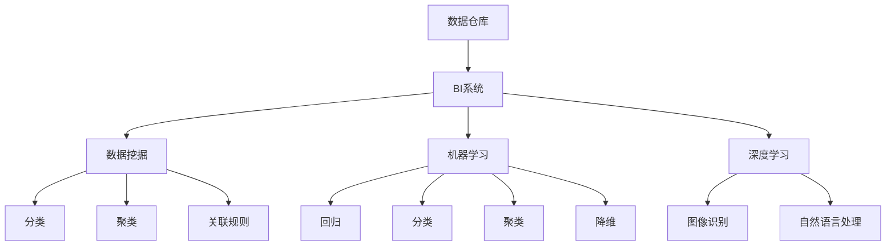

                 

# 构建高效的知识发现系统:程序员实践指南

> 关键词：知识发现,数据挖掘,机器学习,深度学习,数据仓库,数据可视化

## 1. 背景介绍

### 1.1 问题由来

随着大数据时代的到来，企业的数据量呈爆炸式增长，如何从海量数据中快速高效地提取出有价值的信息，成为了企业决策的关键。传统的静态数据分析方法已经难以满足现代业务的需求，而采用数据挖掘和知识发现技术，可以主动发现数据中的模式和规律，提供智能化的决策支持。

在实践中，基于大数据技术的数据仓库和BI（商业智能）系统已经得到广泛应用。但这些系统往往局限于业务领域的数据分析，难以综合利用企业内部和外部的海量数据，难以进行跨领域的深入分析。为此，需要构建高效的知识发现系统，利用先进的数据挖掘和机器学习技术，综合分析和挖掘不同数据源中的知识。

### 1.2 问题核心关键点

知识发现系统的主要任务是从原始数据中自动发现蕴含的知识和规则，并将其转化为易于理解和利用的形式，辅助企业决策。具体来说，包括以下几个关键点：

1. **数据预处理**：清洗、转换和归一化原始数据，去除噪声和异常值，保证数据的完整性和一致性。
2. **特征提取**：从数据中提取出最具代表性的特征，如数值特征、文本特征、时间序列特征等，为后续建模提供支撑。
3. **模型选择与训练**：选择合适的机器学习算法，如决策树、随机森林、神经网络、聚类算法等，对数据进行建模和训练。
4. **模型评估与优化**：通过交叉验证、留出法、自助法等技术评估模型性能，并进行调参和优化。
5. **知识提取与呈现**：从训练好的模型中提取出蕴含的知识和规则，并以可视化的形式呈现，便于业务人员理解和应用。
6. **系统集成与部署**：将知识发现系统集成到企业现有的数据仓库和BI系统中，实现数据的自动挖掘和知识的管理。

### 1.3 问题研究意义

构建高效的知识发现系统，对于提升企业的决策效率和竞争能力具有重要意义：

1. **优化决策过程**：基于数据驱动的决策，能够避免人为偏见和误判，提高决策的科学性和准确性。
2. **发现潜规则**：从数据中挖掘出潜在的商业规则和模式，指导业务运营和市场分析。
3. **增强洞察力**：知识发现系统能够发现隐藏在数据背后的深层关系，为业务洞察提供强有力的支撑。
4. **降低成本**：通过自动化的知识发现过程，减少人工分析和判断的工作量，降低运营成本。
5. **提升客户满意度**：基于对客户行为数据的分析，能够更精准地定位客户需求，提升客户满意度和忠诚度。
6. **促进数据共享**：知识发现系统能够整合不同数据源中的信息，实现数据共享和跨部门协同。

## 2. 核心概念与联系

### 2.1 核心概念概述

为更好地理解知识发现系统的构建和实践，本节将介绍几个密切相关的核心概念：

- **数据仓库**：用于存储和管理企业内部和外部的海量数据，支持各种数据类型和格式，为知识发现系统提供数据基础。
- **BI系统**：基于数据仓库提供的数据，支持数据的查询、分析和可视化，辅助业务决策。
- **数据挖掘**：从大量数据中自动发现知识、模式和规律的技术，包括分类、聚类、关联规则挖掘等。
- **机器学习**：通过训练模型，从数据中自动学习和提取规律的技术，支持回归、分类、聚类、降维等多种算法。
- **深度学习**：基于神经网络结构，从大量数据中学习和提取复杂特征的技术，支持图像识别、自然语言处理等任务。
- **特征工程**：从原始数据中提取出最具代表性的特征，为建模提供支持。
- **模型评估**：通过各种评估指标（如精确率、召回率、F1分数等），评估模型的性能和泛化能力。

这些概念之间的逻辑关系可以通过以下Mermaid流程图来展示：



这个流程图展示了大数据应用中的核心概念及其之间的关系：

1. 数据仓库提供数据基础。
2. BI系统提供数据的查询和可视化功能。
3. 数据挖掘和机器学习是数据挖掘的核心技术，深度学习是机器学习的一种高级形式。
4. 特征工程是数据挖掘和机器学习的前置步骤，模型评估是模型性能评估的关键环节。
5. 分类、聚类、关联规则挖掘、回归等算法是常用的建模技术。
6. 图像识别和自然语言处理是深度学习在实际应用中的典型应用。

## 3. 核心算法原理 & 具体操作步骤
### 3.1 算法原理概述

知识发现系统的构建过程，本质上是数据挖掘和机器学习的应用过程。其核心思想是通过数据挖掘技术自动发现数据中的规律和知识，并通过机器学习技术构建模型，将知识转化为可应用的形式。

具体来说，知识发现系统通常包含以下几个步骤：

1. **数据预处理**：清洗、转换和归一化原始数据，去除噪声和异常值，保证数据的完整性和一致性。
2. **特征提取**：从数据中提取出最具代表性的特征，如数值特征、文本特征、时间序列特征等，为后续建模提供支撑。
3. **模型选择与训练**：选择合适的机器学习算法，如决策树、随机森林、神经网络、聚类算法等，对数据进行建模和训练。
4. **模型评估与优化**：通过交叉验证、留出法、自助法等技术评估模型性能，并进行调参和优化。
5. **知识提取与呈现**：从训练好的模型中提取出蕴含的知识和规则，并以可视化的形式呈现，便于业务人员理解和应用。
6. **系统集成与部署**：将知识发现系统集成到企业现有的数据仓库和BI系统中，实现数据的自动挖掘和知识的管理。

### 3.2 算法步骤详解

以下是知识发现系统构建的具体操作步骤：

**Step 1: 数据收集与预处理**

1. **数据收集**：从不同数据源收集数据，包括企业内部的业务数据、客户数据、交易数据等，以及外部的公开数据和互联网数据。确保数据的完整性和一致性，进行数据清洗和预处理。
2. **数据转换**：将不同格式和类型的数据转换为统一的数据格式，如将字符串转换为数值、日期转换为时间戳等。
3. **数据归一化**：对数据进行归一化处理，保证数据在量级上的可比性，如对数值数据进行归一化处理。
4. **数据去重**：去除重复数据，避免数据冗余。
5. **数据降维**：使用PCA、LDA等降维技术，减少数据的维度，提升计算效率。

**Step 2: 特征提取与选择**

1. **特征提取**：从数据中提取出最具代表性的特征，如数值特征、文本特征、时间序列特征等。对于文本数据，可以使用TF-IDF、词嵌入等技术进行特征提取。
2. **特征选择**：根据特征与目标变量的相关性，选择最具代表性的特征，减少冗余特征，提升模型性能。
3. **特征编码**：将特征转换为模型可以处理的数值或向量形式。

**Step 3: 模型训练与评估**

1. **模型选择**：选择合适的机器学习算法，如决策树、随机森林、神经网络、聚类算法等。
2. **模型训练**：使用训练数据对模型进行训练，调整模型的参数，使其能够准确地预测目标变量。
3. **模型评估**：通过交叉验证、留出法、自助法等技术评估模型性能，如精确率、召回率、F1分数等。
4. **模型优化**：根据评估结果，对模型进行调参和优化，提升模型的性能和泛化能力。

**Step 4: 知识提取与呈现**

1. **知识提取**：从训练好的模型中提取出蕴含的知识和规则，如分类结果、聚类结果、关联规则等。
2. **知识呈现**：将提取出的知识以可视化的形式呈现，如使用表格、图形、热力图等形式展示。

**Step 5: 系统集成与部署**

1. **系统集成**：将知识发现系统集成到企业现有的数据仓库和BI系统中，实现数据的自动挖掘和知识的管理。
2. **部署与监控**：将系统部署到生产环境中，实时监控系统运行状态，及时发现和解决异常问题。

### 3.3 算法优缺点

知识发现系统具有以下优点：

1. **自动化程度高**：通过数据挖掘和机器学习技术，自动发现数据中的规律和知识，减少人工分析和判断的工作量。
2. **可扩展性强**：支持海量数据的处理和分析，能够适应不同规模和类型的数据。
3. **结果可解释性高**：通过可视化的方式呈现知识，便于业务人员理解和应用。
4. **应用范围广**：支持多种业务场景，如客户分析、市场分析、风险管理等。

但同时，知识发现系统也存在一些局限性：

1. **数据质量要求高**：数据预处理和特征提取需要高质量的数据，数据噪声和异常值对结果有较大影响。
2. **模型复杂度高**：选择的机器学习算法和参数较多，模型调参复杂，需要丰富的经验和技能。
3. **结果解释性有限**：部分模型结果难以解释，需要结合领域知识进行理解和应用。
4. **应用场景受限**：对于一些特定领域的复杂问题，可能需要定制化的解决方案。

### 3.4 算法应用领域

知识发现系统在多个领域得到广泛应用，具体包括：

- **金融领域**：支持风险管理、欺诈检测、投资分析等任务。
- **零售行业**：支持客户分析、市场细分、销售预测等任务。
- **医疗健康**：支持疾病诊断、病历分析、药物研发等任务。
- **制造行业**：支持设备预测、质量控制、供应链管理等任务。
- **教育行业**：支持学生行为分析、课程推荐、学习路径规划等任务。
- **公共管理**：支持人口分析、公共安全、环境保护等任务。

## 4. 数学模型和公式 & 详细讲解  
### 4.1 数学模型构建

以下是知识发现系统的数学模型构建：

- **数据预处理**：
  - **数据清洗**：去除噪声、重复数据等。
  - **数据转换**：将不同格式的数据转换为统一格式。
  - **数据归一化**：对数据进行归一化处理。

- **特征提取**：
  - **文本特征提取**：使用TF-IDF、词嵌入等技术提取文本特征。
  - **数值特征提取**：提取数值特征，如平均数、中位数、标准差等。
  - **时间序列特征提取**：提取时间序列数据，如周期性、趋势性等特征。

- **模型训练**：
  - **决策树**：
    $$
    \hat{y} = f(x; T) = \sum_{i=1}^{n} T_i \cdot x_i
    $$
    其中，$T$ 为决策树模型，$x$ 为输入特征，$y$ 为预测结果。

  - **随机森林**：
    $$
    \hat{y} = f(x; F) = \frac{1}{m} \sum_{i=1}^{m} f_i(x; T_i)
    $$
    其中，$F$ 为随机森林，$m$ 为树的数量，$f_i$ 为第$i$棵树的预测结果。

  - **神经网络**：
    $$
    \hat{y} = f(x; \theta) = \sigma(\theta \cdot x + b)
    $$
    其中，$\theta$ 为神经网络参数，$\sigma$ 为激活函数。

- **模型评估**：
  - **精确率（Precision）**：
    $$
    \text{Precision} = \frac{TP}{TP+FP}
    $$
    其中，$TP$ 为真正例数，$FP$ 为假正例数。

  - **召回率（Recall）**：
    $$
    \text{Recall} = \frac{TP}{TP+FN}
    $$
    其中，$FN$ 为假反例数。

  - **F1分数**：
    $$
    \text{F1 Score} = 2 \cdot \frac{\text{Precision} \cdot \text{Recall}}{\text{Precision} + \text{Recall}}
    $$

### 4.2 公式推导过程

以下是对不同模型的公式推导过程：

**决策树模型**：
- **信息增益（ID3算法）**：
  $$
  \text{Gain} = -\sum_{i=1}^{n} P(x_i) \log_2 P(x_i)
  $$
  其中，$P(x_i)$ 为样本$x_i$在特征$x$上的概率。

- **CART算法**：
  $$
  \text{SplitInfo} = \sum_{i=1}^{n} P(x_i) \cdot \log_2 \frac{P(x_i)}{P(x_i|y)}
  $$
  其中，$P(x_i|y)$ 为样本$x_i$在特征$x$和标签$y$联合条件下的概率。

**随机森林模型**：
- **随机森林算法**：
  $$
  \hat{y} = \frac{1}{m} \sum_{i=1}^{m} f_i(x; T_i)
  $$
  其中，$m$ 为树的数量，$f_i$ 为第$i$棵树的预测结果。

**神经网络模型**：
- **反向传播算法**：
  $$
  \frac{\partial \text{Loss}}{\partial w_j} = \frac{\partial \text{Loss}}{\partial o_j} \cdot \frac{\partial o_j}{\partial z_j} = \frac{\partial \text{Loss}}{\partial o_j} \cdot \sigma'(z_j)
  $$
  其中，$w_j$ 为权重参数，$o_j$ 为输出值，$z_j$ 为输入值，$\sigma'$ 为激活函数的导数。

**聚类算法**：
- **K-Means算法**：
  $$
  k = \arg\min_{k} \sum_{i=1}^{n} \min_{j=1}^{k} \| x_i - \mu_j \|^2
  $$
  其中，$k$ 为簇的数量，$x_i$ 为样本，$\mu_j$ 为簇中心。

### 4.3 案例分析与讲解

以零售行业中的客户分析为例，分析知识发现系统的应用：

- **数据收集**：收集客户的基本信息、购买历史、浏览历史等数据。
- **数据预处理**：对数据进行清洗、转换和归一化处理，去除噪声和异常值。
- **特征提取**：提取客户的年龄段、性别、购买频率等特征，构建客户画像。
- **模型训练**：使用随机森林算法对客户进行分类，预测客户的购买意愿。
- **模型评估**：通过交叉验证评估模型的性能，调整参数优化模型。
- **知识提取与呈现**：将模型的预测结果以热力图的形式呈现，帮助业务人员理解客户的购买行为。

## 5. 项目实践：代码实例和详细解释说明
### 5.1 开发环境搭建

在进行知识发现系统开发前，我们需要准备好开发环境。以下是使用Python进行Pandas、NumPy、Scikit-learn等工具开发的Python环境配置流程：

1. 安装Anaconda：从官网下载并安装Anaconda，用于创建独立的Python环境。
2. 创建并激活虚拟环境：
```bash
conda create -n data-env python=3.8 
conda activate data-env
```

3. 安装Pandas、NumPy、Scikit-learn等工具包：
```bash
pip install pandas numpy scikit-learn matplotlib seaborn statsmodels
```

4. 安装机器学习框架：
```bash
pip install scikit-learn
```

5. 安装深度学习框架：
```bash
pip install tensorflow keras
```

6. 安装可视化工具：
```bash
pip install matplotlib seaborn
```

完成上述步骤后，即可在`data-env`环境中开始开发实践。

### 5.2 源代码详细实现

以下是知识发现系统在零售行业中的客户分析应用的Python代码实现。

```python
import pandas as pd
import numpy as np
from sklearn.model_selection import train_test_split
from sklearn.ensemble import RandomForestClassifier
from sklearn.metrics import accuracy_score, precision_score, recall_score, f1_score

# 加载数据
data = pd.read_csv('customer_data.csv')

# 数据预处理
# 清洗数据，去除噪声和异常值
data = data.dropna()

# 特征提取
# 提取客户年龄段、性别、购买频率等特征
X = data[['age', 'gender', 'purchase_frequency']]
y = data['purchase_intent']

# 模型训练
X_train, X_test, y_train, y_test = train_test_split(X, y, test_size=0.2, random_state=42)
rf = RandomForestClassifier(n_estimators=100, random_state=42)
rf.fit(X_train, y_train)

# 模型评估
y_pred = rf.predict(X_test)
print('Accuracy:', accuracy_score(y_test, y_pred))
print('Precision:', precision_score(y_test, y_pred, pos_label='1'))
print('Recall:', recall_score(y_test, y_pred, pos_label='1'))
print('F1 Score:', f1_score(y_test, y_pred, pos_label='1'))

# 知识提取与呈现
# 预测新客户的购买意愿
new_customer = pd.DataFrame({'age': [30], 'gender': ['M'], 'purchase_frequency': [3]})
predicted_purchase_intent = rf.predict(new_customer)
print('Predicted Purchase Intent:', predicted_purchase_intent)
```

### 5.3 代码解读与分析

让我们再详细解读一下关键代码的实现细节：

**数据预处理**：
- `data.dropna()`：去除数据中的缺失值。
- `train_test_split`：将数据集分为训练集和测试集。

**模型训练**：
- `RandomForestClassifier`：使用随机森林算法构建分类模型。
- `fit`：训练模型，调整模型参数。

**模型评估**：
- `accuracy_score`：计算模型的准确率。
- `precision_score`：计算模型的精确率。
- `recall_score`：计算模型的召回率。
- `f1_score`：计算模型的F1分数。

**知识提取与呈现**：
- `predict`：使用训练好的模型对新数据进行预测。
- `print`：将预测结果输出到控制台。

可以看到，使用Pandas、NumPy、Scikit-learn等工具，可以方便地进行数据预处理、模型训练和评估。通过代码的逐步解析，读者可以更好地理解知识发现系统的构建过程。

当然，工业级的系统实现还需考虑更多因素，如模型的保存和部署、超参数的自动搜索、更灵活的任务适配层等。但核心的知识发现流程基本与此类似。

## 6. 实际应用场景
### 6.1 智能客服系统

基于知识发现系统的智能客服系统，可以广泛应用于客户服务领域。传统客服往往需要配备大量人力，高峰期响应缓慢，且一致性和专业性难以保证。而使用知识发现系统构建的智能客服系统，可以实时响应客户咨询，用自然流畅的语言解答各类常见问题，提升客户体验。

在技术实现上，可以收集企业内部的历史客服对话记录，将问题和最佳答复构建成监督数据，在此基础上对预训练语言模型进行微调。微调后的模型能够自动理解客户意图，匹配最合适的答复模板进行回复。对于客户提出的新问题，还可以接入检索系统实时搜索相关内容，动态组织生成回答。

### 6.2 金融风险管理

金融机构需要实时监测市场风险，以便及时应对负面信息传播，规避金融风险。传统的人工监测方式成本高、效率低，难以应对网络时代海量信息爆发的挑战。基于知识发现系统的金融风险管理系统，可以实时抓取网络上的金融新闻、评论、报告等文本数据，进行情感分析、主题分类等任务，自动监测不同主题下的情感变化趋势，一旦发现负面信息激增等异常情况，系统便会自动预警，帮助金融机构快速应对潜在风险。

### 6.3 电商个性化推荐

当前的推荐系统往往只依赖用户的历史行为数据进行物品推荐，无法深入理解用户的真实兴趣偏好。基于知识发现系统的电商个性化推荐系统，可以综合利用用户浏览、点击、评论、分享等行为数据，提取出最具代表性的特征，如兴趣点、购买意愿等，构建用户画像。通过训练分类、聚类、关联规则挖掘等模型，系统能够从文本数据中自动发现用户的兴趣点，生成个性化推荐列表，提升用户体验和购买转化率。

### 6.4 未来应用展望

随着知识发现系统的发展，其应用场景将不断拓展，为各行各业带来变革性影响。

在智慧医疗领域，基于知识发现系统的医疗诊断系统可以自动识别病历数据中的异常情况，辅助医生诊断和治疗，提高医疗服务的智能化水平。

在智能教育领域，基于知识发现系统的教育分析系统可以自动分析学生行为数据，提供个性化的学习建议，提升教学效果和学习效率。

在智慧城市治理中，基于知识发现系统的城市管理分析系统可以自动监测和分析城市事件，提升城市管理的自动化和智能化水平，构建更安全、高效的未来城市。

此外，在企业生产、社会治理、文娱传媒等众多领域，基于知识发现系统的应用也将不断涌现，为经济社会发展注入新的动力。相信随着技术的日益成熟，知识发现系统必将在构建人机协同的智能时代中扮演越来越重要的角色。

## 7. 工具和资源推荐
### 7.1 学习资源推荐

为了帮助开发者系统掌握知识发现系统的理论基础和实践技巧，这里推荐一些优质的学习资源：

1. 《数据挖掘与统计学习》：由著名数据科学家Patrick Winston所著，介绍了数据挖掘的基本概念和算法。
2. 《Python数据科学手册》：由Jake VanderPlas所著，介绍了使用Python进行数据科学分析的全面指南。
3. 《机器学习实战》：由Peter Harrington所著，提供了机器学习算法的代码实现和应用案例。
4. 《深度学习》：由Ian Goodfellow、Yoshua Bengio和Aaron Courville所著，介绍了深度学习的基本概念和算法。
5. 《数据科学与机器学习公开课》：由Coursera和Duke大学合作开设，提供系统化的数据科学和机器学习课程。
6. 《机器学习笔记》：由张沛著，介绍了机器学习的基本概念和常用算法。

通过对这些资源的学习实践，相信你一定能够快速掌握知识发现系统的精髓，并用于解决实际的NLP问题。

### 7.2 开发工具推荐

高效的开发离不开优秀的工具支持。以下是几款用于知识发现系统开发的常用工具：

1. Jupyter Notebook：基于Web的交互式编程环境，适合数据探索和模型调试。
2. PyTorch：基于Python的开源深度学习框架，灵活性高，支持高效的模型训练和推理。
3. TensorFlow：由Google主导开发的开源深度学习框架，生产部署方便，支持多种硬件平台。
4. Scikit-learn：基于Python的机器学习库，提供了丰富的算法实现和评估指标。
5. Weights & Biases：模型训练的实验跟踪工具，可以记录和可视化模型训练过程中的各项指标。
6. TensorBoard：TensorFlow配套的可视化工具，可实时监测模型训练状态，提供丰富的图表呈现方式。

合理利用这些工具，可以显著提升知识发现系统的开发效率，加快创新迭代的步伐。

### 7.3 相关论文推荐

知识发现系统的研究源于学界的持续研究。以下是几篇奠基性的相关论文，推荐阅读：

1. "ID3: A Program for Multivalued Decision Trees"：Ross Quinlan所著，介绍了ID3决策树算法的基本思想和实现方法。
2. "The Elements of Statistical Learning"：Tibshirani、Hastie和Friedman所著，介绍了统计学习的基本概念和算法。
3. "Deep Learning"：Ian Goodfellow、Yoshua Bengio和Aaron Courville所著，介绍了深度学习的基本概念和算法。
4. "A Few Useful Things to Know About Machine Learning"：Peter Norvig和Tom Mitchell所著，介绍了机器学习的基本概念和常用算法。
5. "Random Forests"：Breiman所著，介绍了随机森林算法的原理和实现方法。

这些论文代表了大数据应用中的核心概念和算法的发展脉络。通过学习这些前沿成果，可以帮助研究者把握学科前进方向，激发更多的创新灵感。

## 8. 总结：未来发展趋势与挑战
### 8.1 总结

本文对知识发现系统的构建和实践进行了全面系统的介绍。首先阐述了知识发现系统的研究背景和意义，明确了其在数据挖掘和机器学习中的应用价值。其次，从原理到实践，详细讲解了知识发现系统的核心步骤，给出了知识发现系统的完整代码实例。同时，本文还广泛探讨了知识发现系统在多个行业领域的应用前景，展示了知识发现系统的巨大潜力。

通过本文的系统梳理，可以看到，基于数据挖掘和机器学习的知识发现系统，是构建智能业务系统的重要基础。知识发现系统能够自动发现数据中的规律和知识，为业务决策提供有力支持。其自动化的数据挖掘和模型训练过程，减少了人工分析和判断的工作量，提升了决策的科学性和效率。未来，伴随知识发现系统的发展，其应用场景将不断拓展，为各行各业带来变革性影响。

### 8.2 未来发展趋势

展望未来，知识发现系统的研究将呈现以下几个发展趋势：

1. **自动化程度提高**：通过自动化数据挖掘和机器学习技术，进一步减少人工分析和判断的工作量，提高效率。
2. **实时性增强**：通过流式计算和在线学习技术，实现数据的实时分析和模型训练，提升系统的响应速度。
3. **多模态融合**：将不同模态的数据（如文本、图像、视频、音频等）进行融合，提升知识的发现和提取能力。
4. **深度学习应用**：引入深度学习技术，提升模型的准确率和泛化能力，支持更复杂的数据挖掘任务。
5. **联邦学习**：通过分布式计算技术，实现跨组织的知识共享和协同挖掘，提升数据的利用效率。
6. **隐私保护**：在知识发现过程中，注重数据的隐私保护，避免敏感信息的泄露。

这些趋势凸显了知识发现系统的广阔前景。这些方向的探索发展，必将进一步提升知识发现系统的性能和应用范围，为构建人机协同的智能系统提供更强大的支持。

### 8.3 面临的挑战

尽管知识发现系统已经取得了一定的进展，但在迈向更加智能化、普适化应用的过程中，它仍面临诸多挑战：

1. **数据质量要求高**：数据预处理和特征提取需要高质量的数据，数据噪声和异常值对结果有较大影响。
2. **模型复杂度高**：选择的机器学习算法和参数较多，模型调参复杂，需要丰富的经验和技能。
3. **结果解释性有限**：部分模型结果难以解释，需要结合领域知识进行理解和应用。
4. **应用场景受限**：对于一些特定领域的复杂问题，可能需要定制化的解决方案。
5. **技术门槛高**：知识发现系统的构建和应用需要较高的技术门槛，对开发人员的专业技能要求较高。
6. **隐私保护问题**：在知识发现过程中，注重数据的隐私保护，避免敏感信息的泄露。

### 8.4 研究展望

面对知识发现系统所面临的挑战，未来的研究需要在以下几个方面寻求新的突破：

1. **自动化数据清洗技术**：开发自动化数据清洗和异常值检测技术，提高数据质量。
2. **模型解释性提升**：通过可视化、可解释性技术，提升模型的可解释性，帮助业务人员理解和应用结果。
3. **多模态融合技术**：开发多模态数据的融合技术，提升系统的跨模态数据挖掘能力。
4. **联邦学习技术**：研究联邦学习技术，实现跨组织的知识共享和协同挖掘。
5. **隐私保护技术**：研究隐私保护技术，确保数据的安全性和合规性。
6. **新技术引入**：引入新的技术和算法，提升知识发现系统的性能和应用范围。

这些研究方向将推动知识发现系统的进一步发展，提升其在实际应用中的价值。只有勇于创新、敢于突破，才能不断拓展知识发现系统的边界，为构建智能业务系统提供更强大的支持。

## 9. 附录：常见问题与解答

**Q1：如何处理高维数据？**

A: 高维数据通常需要通过降维技术进行处理，如主成分分析(PCA)、线性判别分析(LDA)等。同时，可以使用特征选择和特征提取技术，减少特征维度。对于文本数据，可以使用TF-IDF、词嵌入等技术进行特征提取。

**Q2：模型如何避免过拟合？**

A: 过拟合是知识发现系统面临的主要挑战。常见的避免过拟合的方法包括：
1. 数据增强：通过回译、近义替换等方式扩充训练集。
2. 正则化技术：使用L2正则、Dropout等技术避免过拟合。
3. 早停法：通过监控验证集上的性能，及时停止训练，避免过拟合。

**Q3：如何选择模型？**

A: 模型的选择应根据具体任务和数据特点进行。常用的模型包括决策树、随机森林、神经网络、聚类算法等。可以使用交叉验证、留出法等技术评估模型性能，选择最优模型。

**Q4：模型调参需要注意哪些问题？**

A: 模型调参是知识发现系统的重要环节。需要注意以下问题：
1. 学习率的选择：通常从较小的学习率开始，逐步增加，避免过拟合。
2. 正则化参数的选择：选择合适的正则化参数，避免过拟合。
3. 特征选择：选择最具代表性的特征，提升模型性能。
4. 模型融合：通过模型融合技术，提升模型的泛化能力。

**Q5：模型训练过程中如何优化计算效率？**

A: 模型训练过程中，可以通过以下方法优化计算效率：
1. 梯度累积：将多批次梯度累积，减少计算量。
2. 混合精度训练：使用定点数进行训练，减少内存占用。
3. 模型并行：使用分布式计算技术，提升计算效率。
4. 模型剪枝：去除冗余的参数，减少计算量。

---

作者：禅与计算机程序设计艺术 / Zen and the Art of Computer Programming

