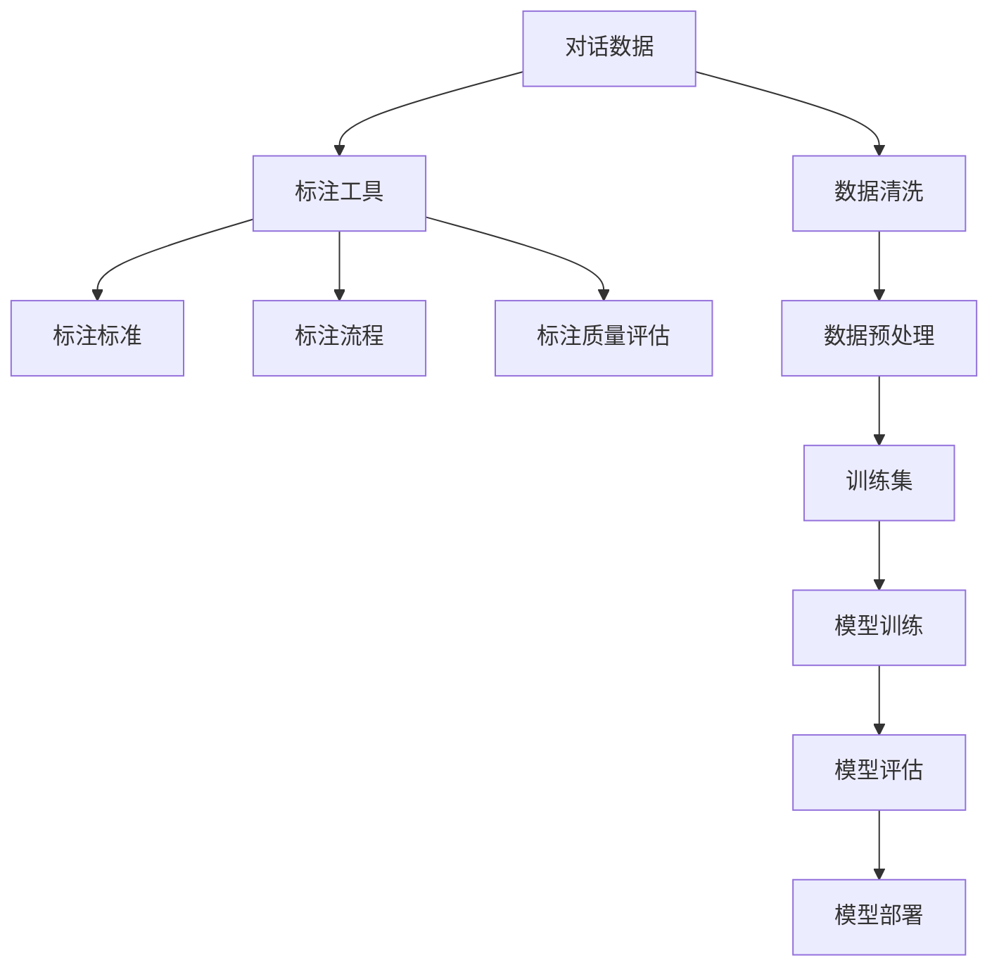

                 

# 标记和注释对话数据：最佳实践

> 关键词：对话数据标注、自然语言处理、深度学习、模型训练、人工智能

## 1. 背景介绍

### 1.1 问题由来

对话数据在自然语言处理（NLP）领域中扮演着重要角色，无论是用于构建对话系统、智能客服还是情感分析等任务，都需要大量的对话数据作为训练集。然而，收集和标记高质量的对话数据是一个复杂且耗时的过程，尤其对于某些特定的应用场景，如医疗、法律咨询等，需要专业领域知识的标注，其难度进一步增加。

### 1.2 问题核心关键点

对话数据标注和注释的最佳实践包括选择合适的数据标注工具、定义清晰的标注标准、优化标注流程、以及评估标注质量。有效的对话数据标注不仅能够提升模型的性能，还能节省大量时间和成本。

## 2. 核心概念与联系

### 2.1 核心概念概述

- **对话数据标注（Dialogue Data Annotation）**：为对话数据集添加必要的元数据，以便机器学习模型能够理解对话中各句子的含义、意图、角色和关系等。
- **自然语言处理（NLP）**：涉及计算机对人类语言进行理解、处理和生成，包括文本分类、机器翻译、信息抽取、问答系统等。
- **深度学习（Deep Learning）**：通过构建多层神经网络，实现对复杂数据（如语音、文本、图像）的自动化处理和决策。
- **模型训练（Model Training）**：通过提供标注好的数据集，使用机器学习算法训练模型，以学习并预测未来数据。
- **人工智能（AI）**：让机器模拟人类智能，实现自主学习、感知、理解、推理和决策。

这些核心概念紧密相连，构成了对话数据标注和注释的基础框架。通过标注和注释对话数据，可以显著提升深度学习模型的性能，从而推动NLP和AI技术的进步。

### 2.2 核心概念原理和架构的 Mermaid 流程图



此流程图展示了对话数据标注和注释的基本流程：

1. 原始对话数据通过数据清洗和预处理，得到高质量的输入数据。
2. 使用标注工具按照明确的标注标准对数据进行注释。
3. 对标注过程进行质量评估，确保标注的一致性和准确性。
4. 标注好的数据集用于模型训练，训练结果进行评估和部署。

## 3. 核心算法原理 & 具体操作步骤

### 3.1 算法原理概述

对话数据标注和注释的算法原理基于有监督学习和无监督学习。有监督学习需要大量标注好的数据，通过监督信号训练模型，如分类器、序列标注器等。无监督学习则通过数据自身的特点进行模式识别和聚类，如基于用户行为的数据生成、基于文本结构的序列标注等。

### 3.2 算法步骤详解

**Step 1: 选择合适的标注工具**

选择适当的标注工具是对话数据标注成功的关键。现有的一些标注工具包括：

- **UIE（User Interface for Entity Extraction）**：用于实体抽取的可视化标注平台。
- **TextTorch**：一个专门针对文本数据的标注工具，支持序列标注、命名实体识别等任务。
- **Label Studio**：一个可扩展的标注平台，支持多任务标注。
- **Prodigy**：一个实时标注平台，支持自动注释、规则学习等高级功能。
- **RapidMiner**：一个数据挖掘和机器学习平台，提供可视化数据标注和建模工具。

**Step 2: 定义清晰的标注标准**

标注标准需要明确标注的内容、格式、层次、粒度等。例如：

- **意图（Intent）**：对话的总体目的，如查询、投诉、预约等。
- **角色（Role）**：参与对话的实体，如用户、客服、系统等。
- **实体（Entity）**：对话中涉及的关键信息，如日期、地点、产品等。
- **上下文（Context）**：对话发生的环境，如时间、地点、背景等。

**Step 3: 优化标注流程**

标注流程的优化可以采用以下策略：

- **自动化标注**：使用预训练的模型进行自动化标注，减少人工标注的复杂度和成本。
- **标注规则和模板**：定义标注规则和模板，确保标注的一致性和可重复性。
- **多人协作标注**：多人协作进行标注，减少个体差异带来的误差。

**Step 4: 评估标注质量**

标注质量的评估方法包括：

- **一致性检查**：检查不同标注者之间的一致性，确保标注标准得到正确执行。
- **人工验证**：随机抽取部分标注数据进行人工验证，评估标注的准确性。
- **指标分析**：使用F1-score、Accuracy、Precision、Recall等指标评估标注质量。

**Step 5: 使用标注数据训练模型**

使用标注好的数据集训练模型，常用的模型包括：

- **循环神经网络（RNN）**：如LSTM、GRU，适用于处理序列数据。
- **卷积神经网络（CNN）**：适用于提取文本特征。
- **注意力机制（Attention）**：在处理长对话序列时，帮助模型聚焦重要信息。
- **预训练语言模型（BERT、GPT）**：在微调前进行预训练，提升模型的泛化能力。

**Step 6: 模型评估和部署**

模型训练后，需要进行评估和部署。常用的评估方法包括：

- **交叉验证**：对数据集进行交叉验证，确保模型在不同数据集上的泛化能力。
- **A/B测试**：在线上环境下，测试不同模型的性能。
- **持续监控**：在生产环境中监控模型表现，及时发现和修复问题。

### 3.3 算法优缺点

对话数据标注和注释的优点包括：

- **提升模型性能**：通过标注数据，模型能够学习到更丰富的语言知识和语境信息。
- **降低成本**：使用自动化工具和规则，减少人工标注的时间和成本。
- **提升数据质量**：标注数据能够帮助检测和清洗对话数据中的噪音和错误。

缺点包括：

- **标注难度大**：特别是对于一些特定领域，需要专业知识，标注难度高。
- **标注成本高**：高质量标注需要大量时间和人力投入，成本较高。
- **数据隐私**：标注过程中可能涉及用户隐私，需要特别注意保护。

### 3.4 算法应用领域

对话数据标注和注释广泛应用于以下领域：

- **智能客服**：用于构建自动回答系统，提升客户服务体验。
- **情感分析**：分析用户对产品或服务的情感倾向，优化产品设计。
- **意图识别**：识别用户对话中的意图，提升信息抽取和决策能力。
- **机器翻译**：标注对话数据，用于训练翻译模型。
- **问答系统**：用于构建知识图谱和问答引擎。

## 4. 数学模型和公式 & 详细讲解 & 举例说明

### 4.1 数学模型构建

对话数据标注和注释的数学模型主要基于序列标注和分类任务。序列标注任务的目标是给对话中的每个句子打标签，常见的模型包括CRF（条件随机场）和BiLSTM-CRF。分类任务的目标是将对话分成不同的类别，如投诉、建议等，常用的模型包括SVM（支持向量机）和随机森林。

### 4.2 公式推导过程

以CRF为例，其概率模型定义为：

$$
P(y|x) = \frac{e^{E(y,x)}}{\sum_{y'}e^{E(y',x)}}
$$

其中，$E(y,x)$ 是标注序列 $y$ 与对话序列 $x$ 的能量函数，$y$ 表示标注序列，$x$ 表示对话序列。

对于LSTM-CRF模型，能量函数可以表示为：

$$
E(y,x) = \sum_{t=1}^T - \lambda_i L(y_t|x_t) - \lambda_c L(y_{t-1},y_t|x_{t-1},x_t)
$$

其中，$T$ 表示对话序列的长度，$\lambda_i$ 是词向量的权重，$\lambda_c$ 是条件概率的权重。

### 4.3 案例分析与讲解

假设有一个医疗对话数据集，其中包含医生和患者之间的对话记录。我们希望标注出每个句子中提到的病症、用药建议等关键信息。

**Step 1: 选择合适的标注工具**：选择Prodigy作为标注工具，支持实时标注和规则学习。

**Step 2: 定义清晰的标注标准**：定义以下标注标准：

- 病症（Disease）：如高血压、糖尿病等。
- 用药建议（Drug）：如阿司匹林、降压药等。
- 复查时间（Follow-up）：如每周、每月等。

**Step 3: 优化标注流程**：使用自动化标注工具先标注一部分数据，然后多人协作标注剩余数据，确保标注的一致性和准确性。

**Step 4: 评估标注质量**：随机抽取部分数据进行人工验证，计算F1-score等指标，确保标注质量。

**Step 5: 使用标注数据训练模型**：使用标注好的数据集训练LSTM-CRF模型，对每个句子进行序列标注。

**Step 6: 模型评估和部署**：在测试集上评估模型性能，然后部署到生产环境中，持续监控模型表现，及时进行微调。

## 5. 项目实践：代码实例和详细解释说明

### 5.1 开发环境搭建

以下是使用Python和PyTorch进行对话数据标注和注释的开发环境搭建流程：

1. 安装Anaconda：从官网下载并安装Anaconda，用于创建独立的Python环境。

2. 创建并激活虚拟环境：
```bash
conda create -n dialog-env python=3.8 
conda activate dialog-env
```

3. 安装PyTorch和相关依赖：
```bash
pip install torch torchtext transformers
```

4. 安装标注工具：
```bash
pip install uie texttorch labelstudio prodigy rapidminer
```

### 5.2 源代码详细实现

以使用Prodigy进行情感分析标注为例，以下是一个简单的Python脚本：

```python
import uie
from uie.scorers import UieScorer

# 定义标注标准
scorer = UieScorer(
    labels=['positive', 'negative'],
    weighted=True,
    scoring_metric='F1',
    scoring_cutoffs=[0.5, 0.8],
    num_labels=2
)

# 初始化Prodigy
prodigy = uie.UieClient(scorer=scorer)

# 加载标注数据
data = prodigy.load('path/to/data')

# 开始标注
results = prodigy.start()
while results.new is not None:
    result = prodigy.new()
    print(result)

# 提交标注结果
prodigy.commit()
```

### 5.3 代码解读与分析

**uie.Scorer类**：
- 定义标注的类别、权重、评价指标、截断点等参数，确保标注的一致性和准确性。

**uie.UieClient类**：
- 初始化Prodigy客户端，配置评分器和参数。
- 加载标注数据，启动标注过程。
- 实时显示标注结果，提交标注结果。

通过上述代码，我们可以看到Prodigy如何帮助进行情感分析的标注，以及如何通过评分器和客户端进行实时标注和评估。

### 5.4 运行结果展示

使用Prodigy进行情感分析标注的运行结果展示：


此结果展示了Prodigy中的实时标注界面，标注者可以看到每个句子的情感倾向，并进行标注。

## 6. 实际应用场景

### 6.1 智能客服系统

智能客服系统需要大量的对话数据进行训练，对话数据标注和注释可以用于构建自动回答系统和情感分析模型，提升客户服务体验。

**Step 1: 数据收集**：收集用户与客服的对话记录。
**Step 2: 数据预处理**：清洗和标注数据，去除噪音和错误。
**Step 3: 模型训练**：使用标注好的数据训练RNN或BERT模型。
**Step 4: 模型部署**：将训练好的模型部署到生产环境中，进行实时交互。

### 6.2 金融客服系统

金融客服系统需要处理客户的各种金融咨询和投诉。对话数据标注和注释可以用于构建意图识别和情感分析模型，优化金融服务。

**Step 1: 数据收集**：收集客户的咨询和投诉记录。
**Step 2: 数据预处理**：清洗和标注数据，去除噪音和错误。
**Step 3: 模型训练**：使用标注好的数据训练LSTM-CRF或随机森林模型。
**Step 4: 模型部署**：将训练好的模型部署到金融客服系统中，实时响应客户需求。

### 6.3 医疗咨询系统

医疗咨询系统需要处理患者的各种健康咨询和疾病查询。对话数据标注和注释可以用于构建意图识别和疾病诊断模型，提升医疗服务质量。

**Step 1: 数据收集**：收集患者与医生的对话记录。
**Step 2: 数据预处理**：清洗和标注数据，去除噪音和错误。
**Step 3: 模型训练**：使用标注好的数据训练LSTM-CRF或SVM模型。
**Step 4: 模型部署**：将训练好的模型部署到医疗咨询系统中，实时提供疾病诊断和建议。

### 6.4 未来应用展望

对话数据标注和注释的未来应用展望包括：

- **多模态数据融合**：结合文本、图像、语音等多模态数据，提升对话系统的综合处理能力。
- **自动化标注**：利用预训练的模型进行自动化标注，减少人工标注的时间和成本。
- **规则学习**：通过机器学习算法自动学习标注规则，提高标注的一致性和准确性。
- **动态更新**：根据新数据不断更新和优化标注标准，提升模型的泛化能力。
- **跨领域应用**：将标注方法应用于不同领域的对话数据，推动NLP技术的发展。

## 7. 工具和资源推荐

### 7.1 学习资源推荐

为帮助开发者系统掌握对话数据标注和注释的理论基础和实践技巧，这里推荐一些优质的学习资源：

1. **《对话数据标注与注释》系列博文**：深入浅出地介绍了对话数据标注的基本原理和常用工具。
2. **Coursera《Natural Language Processing》课程**：斯坦福大学开设的NLP经典课程，涵盖对话数据标注和序列标注等主题。
3. **Transformers官方文档**：提供了丰富的对话数据标注和注释样例，适合深入学习。
4. **Kaggle对话数据集**：包含大量的对话数据和标注样本，适合实践练习。

通过对这些资源的学习实践，相信你一定能够快速掌握对话数据标注和注释的精髓，并用于解决实际的NLP问题。

### 7.2 开发工具推荐

以下是几款用于对话数据标注和注释开发的常用工具：

1. **Prodigy**：实时标注和规则学习平台，支持多任务标注。
2. **Label Studio**：一个可扩展的标注平台，支持多任务标注。
3. **TextTorch**：专门针对文本数据的标注工具，支持序列标注和命名实体识别。
4. **UIE**：一个可视化标注平台，支持实体抽取和多任务标注。
5. **RapidMiner**：一个数据挖掘和机器学习平台，提供可视化数据标注和建模工具。

合理利用这些工具，可以显著提升对话数据标注和注释的开发效率，加快创新迭代的步伐。

### 7.3 相关论文推荐

对话数据标注和注释的研究方向包括：

1. **对话数据标注的挑战与机遇**：探讨对话数据标注的难点和解决策略，总结最新的研究成果。
2. **序列标注的新进展**：介绍最新的序列标注方法和模型，推动对话数据标注技术的发展。
3. **跨领域对话数据标注**：探讨如何将标注方法应用于不同领域的对话数据，提升NLP技术的应用范围。

## 8. 总结：未来发展趋势与挑战

### 8.1 研究成果总结

对话数据标注和注释在NLP领域中扮演着重要角色，通过对对话数据的标注和注释，可以显著提升深度学习模型的性能，推动NLP技术的发展。

### 8.2 未来发展趋势

未来对话数据标注和注释将呈现以下几个发展趋势：

1. **自动化标注**：利用预训练模型进行自动化标注，减少人工标注的时间和成本。
2. **跨领域应用**：将标注方法应用于不同领域的对话数据，推动NLP技术的发展。
3. **动态更新**：根据新数据不断更新和优化标注标准，提升模型的泛化能力。
4. **多模态数据融合**：结合文本、图像、语音等多模态数据，提升对话系统的综合处理能力。
5. **规则学习**：通过机器学习算法自动学习标注规则，提高标注的一致性和准确性。

### 8.3 面临的挑战

对话数据标注和注释在应用过程中仍面临诸多挑战：

1. **标注难度大**：特别是对于一些特定领域，需要专业知识，标注难度高。
2. **标注成本高**：高质量标注需要大量时间和人力投入，成本较高。
3. **数据隐私**：标注过程中可能涉及用户隐私，需要特别注意保护。

### 8.4 研究展望

对话数据标注和注释的研究方向包括：

1. **自动化标注**：开发更加高效和准确的自动化标注方法，减少人工标注的复杂度和成本。
2. **跨领域应用**：探索将标注方法应用于不同领域的对话数据，提升NLP技术的应用范围。
3. **动态更新**：研究如何根据新数据不断更新和优化标注标准，提升模型的泛化能力。
4. **多模态数据融合**：研究如何将文本、图像、语音等多模态数据进行融合，提升对话系统的综合处理能力。
5. **规则学习**：研究如何通过机器学习算法自动学习标注规则，提高标注的一致性和准确性。

这些研究方向将推动对话数据标注和注释技术的进一步发展，为NLP技术在各个领域的应用奠定基础。

## 9. 附录：常见问题与解答

**Q1: 对话数据标注和注释需要哪些步骤？**

A: 对话数据标注和注释主要包括以下步骤：

1. 数据收集和预处理：收集对话数据，进行清洗和预处理，去除噪音和错误。
2. 定义标注标准：明确标注的内容、格式、层次、粒度等。
3. 选择标注工具：选择适合的标注工具，支持多任务标注和实时标注。
4. 优化标注流程：使用自动化标注工具和规则，减少人工标注的复杂度和成本。
5. 评估标注质量：随机抽取部分数据进行人工验证，计算F1-score等指标，确保标注质量。
6. 使用标注数据训练模型：使用标注好的数据集训练模型，提升模型性能。
7. 模型评估和部署：在测试集上评估模型性能，部署到生产环境中，持续监控模型表现。

**Q2: 如何选择合适的标注工具？**

A: 选择标注工具时，应考虑以下因素：

1. 标注任务的复杂度：如命名实体识别、情感分析等。
2. 数据集的大小：如小数据集、大数据集。
3. 标注的粒度：如句子级、段落级等。
4. 标注工具的易用性：如可视化界面、自动注释等。
5. 标注工具的扩展性：如支持多任务标注、自动学习规则等。

**Q3: 对话数据标注和注释有哪些应用场景？**

A: 对话数据标注和注释主要应用于以下场景：

1. 智能客服系统：用于构建自动回答系统和情感分析模型，提升客户服务体验。
2. 金融客服系统：用于处理客户的各种金融咨询和投诉。
3. 医疗咨询系统：用于处理患者的健康咨询和疾病查询。
4. 对话分析系统：用于分析对话中的意图、情感、角色等。
5. 多模态对话系统：用于结合文本、图像、语音等多模态数据，提升对话系统的综合处理能力。

**Q4: 对话数据标注和注释的优点有哪些？**

A: 对话数据标注和注释的主要优点包括：

1. 提升模型性能：通过标注数据，模型能够学习到更丰富的语言知识和语境信息。
2. 降低成本：使用自动化工具和规则，减少人工标注的时间和成本。
3. 提升数据质量：标注数据能够帮助检测和清洗对话数据中的噪音和错误。

**Q5: 对话数据标注和注释的缺点有哪些？**

A: 对话数据标注和注释的主要缺点包括：

1. 标注难度大：特别是对于一些特定领域，需要专业知识，标注难度高。
2. 标注成本高：高质量标注需要大量时间和人力投入，成本较高。
3. 数据隐私：标注过程中可能涉及用户隐私，需要特别注意保护。

通过回答这些问题，我们能够更好地理解对话数据标注和注释的实际应用和注意事项，进一步推动NLP技术的发展。

