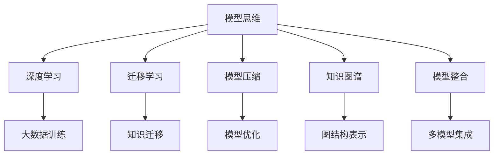

                 

# 模型思维:快速掌握新知识的捷径

> 关键词：模型思维,知识图谱,深度学习,迁移学习,模型压缩,知诀整合,快速学习,实例分析

## 1. 背景介绍

### 1.1 问题由来

在当今信息爆炸的时代，知识更新速度不断加快，如何高效地掌握新知识，成为了每一个从业者都需要面对的问题。传统的线性学习模式已经难以适应当前快速变化的环境。幸运的是，基于模型的思维方式，提供了一种快速、高效的解决方案，使得人们可以迅速将经验转化为知识，并在新领域中快速应用。

### 1.2 问题核心关键点

模型思维的核心在于将经验知识编码为模型，通过数据训练和优化，使模型能够自动学习新知识，并在实际应用中产生价值。这种模式在深度学习、迁移学习、模型压缩、知识图谱等领域得到了广泛应用，成为一种颠覆传统学习方式的新路径。

### 1.3 问题研究意义

研究模型思维，对于提升个人学习效率、促进知识共享、加速行业技术进步具有重要意义：

1. 高效学习：模型思维将复杂的经验知识转化为可解释、可复制的模型，使得新学习者能够快速上手，避免从头学起。
2. 知识共享：模型可以通过标准化接口和数据集共享，促进知识在社区和行业间的传播与交流。
3. 技术迭代：模型思维支持快速的知识迭代和创新，加速技术的商业化应用。
4. 经验积累：模型能够存储大量的经验知识，供后续任务参考，提高工作效率。

## 2. 核心概念与联系

### 2.1 核心概念概述

为更好地理解模型思维，本节将介绍几个密切相关的核心概念：

- 模型思维(Modelling)：将经验知识编码为模型，通过数据训练和优化，使模型能够自动学习新知识，并在实际应用中产生价值。
- 深度学习(Deep Learning)：基于多层神经网络，通过大量数据训练得到的复杂知识模型。
- 迁移学习(Transfer Learning)：将一个领域学习到的知识，迁移到另一个不同但相关的领域。
- 模型压缩(Model Compression)：在不影响模型性能的前提下，减小模型尺寸，提高计算效率。
- 知识图谱(Knowledge Graph)：通过图结构表示实体和关系，为模型的推理和查询提供结构化信息支持。
- 模型整合(Model Integration)：将多个模型组合使用，发挥各自优势，提升整体性能。

这些核心概念之间的逻辑关系可以通过以下Mermaid流程图来展示：



这个流程图展示了一些关键概念及其之间的关系：

1. 模型思维通过深度学习获得复杂知识。
2. 迁移学习使得模型能够迁移应用到新领域。
3. 模型压缩减小了模型规模，提高了计算效率。
4. 知识图谱为模型推理和查询提供了结构化信息。
5. 模型整合将多个模型组合，提升整体性能。

这些概念共同构成了模型思维的核心框架，使得我们可以更高效地学习、理解和应用新知识。

## 3. 核心算法原理 & 具体操作步骤
### 3.1 算法原理概述

模型思维的核心在于利用机器学习算法，将经验知识编码为模型，并利用大量数据进行训练，使模型自动学习新知识。这一过程通常包括以下步骤：

1. 数据准备：收集与经验知识相关的数据集，进行预处理和标注。
2. 模型选择：选择合适的机器学习模型，如神经网络、支持向量机等。
3. 模型训练：使用数据集对模型进行训练，优化模型参数。
4. 模型评估：使用测试集对模型性能进行评估，选择合适的模型和参数。
5. 模型应用：将训练好的模型应用于新问题或新场景中，进行推理或预测。

### 3.2 算法步骤详解

基于模型思维的机器学习流程如下：

**Step 1: 数据准备**
- 收集与经验知识相关的数据集，并进行预处理。
- 数据标注：将经验知识编码为标签或目标变量。
- 数据分割：将数据集划分为训练集、验证集和测试集。

**Step 2: 模型选择**
- 选择合适的机器学习模型。
- 确定模型的超参数，如学习率、批大小等。

**Step 3: 模型训练**
- 使用训练集对模型进行训练，优化模型参数。
- 使用验证集进行模型评估，选择合适的模型和参数。

**Step 4: 模型评估**
- 使用测试集对模型进行评估，计算准确率、召回率等指标。
- 根据评估结果调整模型和超参数。

**Step 5: 模型应用**
- 将训练好的模型应用于新问题或新场景中，进行推理或预测。
- 根据实际结果调整模型和策略。

### 3.3 算法优缺点

模型思维具有以下优点：

1. 高效学习：模型可以快速学习新知识，并应用于新场景。
2. 知识共享：模型可以通过接口和数据共享，促进知识传播。
3. 技术迭代：模型思维支持快速迭代和创新，加速技术应用。

同时，该方法也存在一定的局限性：

1. 数据依赖：模型的性能高度依赖于训练数据的质量和数量。
2. 模型复杂：模型选择和调参需要专业知识，较为复杂。
3. 过度拟合：模型可能会过度拟合训练数据，泛化能力有限。
4. 可解释性差：模型往往作为一个黑盒，难以解释其决策过程。

尽管存在这些局限性，但就目前而言，模型思维已成为机器学习领域的主流范式。未来相关研究的重点在于如何进一步提高模型的泛化能力、可解释性和易用性，同时兼顾高效学习和知识共享。

### 3.4 算法应用领域

模型思维在机器学习和人工智能领域已经得到了广泛的应用，覆盖了几乎所有常见的机器学习任务，例如：

- 图像识别：如人脸识别、物体分类等。通过训练图像分类模型，将像素特征编码为知识。
- 自然语言处理(NLP)：如情感分析、文本分类、机器翻译等。通过训练语言模型，将文本数据编码为知识。
- 推荐系统：如电商推荐、音乐推荐等。通过训练推荐模型，将用户行为和物品特征编码为知识。
- 异常检测：如网络入侵检测、故障诊断等。通过训练异常检测模型，将正常行为与异常行为编码为知识。
- 强化学习：如游戏AI、自动驾驶等。通过训练强化学习模型，将环境与行为策略编码为知识。

除了上述这些经典任务外，模型思维还被创新性地应用到更多场景中，如生成对抗网络(GANs)、知识图谱构建、智能辅助设计等，为人工智能技术带来了全新的突破。随着模型思维和相关算法的不断进步，相信人工智能技术将在更广阔的应用领域大放异彩。

## 4. 数学模型和公式 & 详细讲解
### 4.1 数学模型构建

本节将使用数学语言对模型思维的机器学习流程进行更加严格的刻画。

记输入数据为 $X=\{(x_i,y_i)\}_{i=1}^N$，其中 $x_i$ 为输入特征， $y_i$ 为标签。

定义损失函数 $\ell(M_{\theta},X)=\frac{1}{N}\sum_{i=1}^N \ell(M_{\theta}(x_i),y_i)$，其中 $M_{\theta}$ 为训练好的模型，$\ell$ 为损失函数。

### 4.2 公式推导过程

以下我们以线性回归为例，推导模型的损失函数及其梯度计算公式。

假设模型 $M_{\theta}$ 的输出为 $\hat{y}=M_{\theta}(x)=w^Tx+\theta$，其中 $w$ 为权重向量，$\theta$ 为偏置项。

定义均方误差损失函数：$\ell(y,\hat{y})=(y-\hat{y})^2$

将其代入损失函数，得：

$$
\ell(M_{\theta},X)=\frac{1}{N}\sum_{i=1}^N (y_i-M_{\theta}(x_i))^2
$$

根据梯度下降算法，损失函数对参数 $\theta$ 的梯度为：

$$
\nabla_{\theta}\ell(M_{\theta},X)=-2\frac{1}{N}\sum_{i=1}^N (y_i-M_{\theta}(x_i))x_i
$$

其中 $x_i$ 为输入特征向量。

### 4.3 案例分析与讲解

假设我们希望训练一个线性回归模型，用于预测房价。我们可以使用波士顿房价数据集，其中包含13个特征和一个目标变量。

使用Scikit-learn库，可以编写以下Python代码实现模型训练：

```python
from sklearn.linear_model import LinearRegression
from sklearn.metrics import mean_squared_error

# 准备数据集
X = boston['features']
y = boston['target']

# 初始化模型
model = LinearRegression()

# 训练模型
model.fit(X, y)

# 评估模型
mse = mean_squared_error(y, model.predict(X))
print('均方误差：', mse)
```

在训练过程中，我们会使用梯度下降算法来优化模型参数，最小化损失函数：

$$
\theta \leftarrow \theta - \eta \nabla_{\theta}\ell(M_{\theta},X)
$$

其中 $\eta$ 为学习率。

## 5. 项目实践：代码实例和详细解释说明
### 5.1 开发环境搭建

在进行模型思维的机器学习实践前，我们需要准备好开发环境。以下是使用Python进行Scikit-learn开发的环境配置流程：

1. 安装Anaconda：从官网下载并安装Anaconda，用于创建独立的Python环境。

2. 创建并激活虚拟环境：
```bash
conda create -n sklearn-env python=3.8 
conda activate sklearn-env
```

3. 安装Scikit-learn：使用pip安装Scikit-learn库。
```bash
pip install scikit-learn
```

4. 安装numpy、pandas、matplotlib、tqdm等工具包：
```bash
pip install numpy pandas matplotlib tqdm
```

完成上述步骤后，即可在`sklearn-env`环境中开始模型实践。

### 5.2 源代码详细实现

下面我们以波士顿房价数据集为例，使用Scikit-learn库实现线性回归模型的训练和评估。

```python
from sklearn.datasets import load_boston
from sklearn.linear_model import LinearRegression
from sklearn.model_selection import train_test_split
from sklearn.metrics import mean_squared_error

# 准备数据集
boston = load_boston()
X = boston.data
y = boston.target

# 分割数据集
X_train, X_test, y_train, y_test = train_test_split(X, y, test_size=0.2, random_state=42)

# 初始化模型
model = LinearRegression()

# 训练模型
model.fit(X_train, y_train)

# 评估模型
mse = mean_squared_error(y_test, model.predict(X_test))
print('均方误差：', mse)
```

### 5.3 代码解读与分析

让我们再详细解读一下关键代码的实现细节：

**模型训练代码**：
- `load_boston`：加载波士顿房价数据集。
- `train_test_split`：将数据集分为训练集和测试集。
- `LinearRegression`：初始化线性回归模型。
- `fit`：使用训练集对模型进行训练，优化模型参数。
- `mean_squared_error`：计算模型在测试集上的均方误差。

可以看到，通过Scikit-learn库，我们可以用简洁的代码实现线性回归模型的训练和评估。

## 6. 实际应用场景
### 6.1 智能推荐系统

基于模型思维的推荐系统已经在电商、音乐、视频等多个领域取得了巨大的成功。通过分析用户的历史行为数据，训练推荐模型，使得系统能够根据用户的兴趣和偏好，推荐个性化的商品、音乐或视频内容。

在技术实现上，可以收集用户的历史浏览、购买、评分等行为数据，构建用户画像，训练推荐模型，实时推荐商品或内容。对于新的用户行为，系统也可以通过模型进行预测和推荐。

### 6.2 金融风险预测

金融领域需要实时预测市场风险，以便及时采取应对措施，降低风险损失。传统的金融分析依赖人工经验和规则，难以覆盖所有复杂情形。基于模型思维的风险预测系统，可以全面分析市场数据，预测不同情况下的风险概率。

在实践应用中，可以收集股票、商品、汇率等金融数据，训练风险预测模型，预测市场的变化趋势和风险概率。同时结合外部信息，如新闻、社交媒体等，实时更新预测结果，帮助金融机构及时调整策略。

### 6.3 医疗诊断系统

医疗领域对误诊的容忍度极低，基于模型思维的诊断系统可以显著提高诊断准确率，减少误诊率。通过分析历史病例数据，训练诊断模型，使得系统能够自动识别病情和病灶，辅助医生进行诊断。

在实践应用中，可以收集患者的病历、检查报告等医疗数据，训练诊断模型，对新病例进行快速诊断。同时结合医生的经验和知识，对模型输出进行解释和修正，提高诊断的准确性和可信度。

### 6.4 未来应用展望

随着模型思维和相关算法的不断发展，基于模型思维的系统将在更多领域得到应用，为各行各业带来变革性影响。

在智慧医疗领域，基于模型思维的医疗诊断系统将提升医疗服务的智能化水平，辅助医生诊疗，提高诊断准确率。

在智能教育领域，模型思维的应用将使教育更加个性化，通过分析学生的学习数据，训练推荐模型，提供个性化的学习建议和资源。

在智慧城市治理中，基于模型思维的城市事件监测、舆情分析、应急指挥等系统，将提高城市管理的自动化和智能化水平，构建更安全、高效的未来城市。

此外，在企业生产、社会治理、文娱传媒等众多领域，基于模型思维的人工智能应用也将不断涌现，为经济社会发展注入新的动力。相信随着技术的日益成熟，模型思维必将在构建人机协同的智能时代中扮演越来越重要的角色。

## 7. 工具和资源推荐
### 7.1 学习资源推荐

为了帮助开发者系统掌握模型思维的理论基础和实践技巧，这里推荐一些优质的学习资源：

1. 《Python数据科学手册》系列博文：由Scikit-learn官方团队撰写，全面介绍了Scikit-learn库的使用方法和经典案例。

2. 《深度学习》课程：斯坦福大学开设的深度学习明星课程，详细讲解深度学习的基本概念和经典模型。

3. 《Hands-On Machine Learning with Scikit-Learn, Keras, and TensorFlow》书籍：详细介绍了使用Scikit-learn、Keras和TensorFlow进行机器学习的实践方法。

4. Scikit-learn官方文档：提供了丰富的学习资源和示例代码，是学习模型思维的必备工具。

5. Kaggle数据科学竞赛：提供大量公开数据集和挑战任务，助力数据科学爱好者实践学习。

通过对这些资源的学习实践，相信你一定能够快速掌握模型思维的精髓，并用于解决实际的机器学习问题。

### 7.2 开发工具推荐

高效的开发离不开优秀的工具支持。以下是几款用于模型思维开发的常用工具：

1. Python：作为数据科学和机器学习的核心语言，Python简单易用，拥有丰富的第三方库支持。

2. Scikit-learn：开源机器学习库，提供了丰富的模型选择和评估工具，适合快速迭代开发。

3. TensorFlow：由Google主导开发的深度学习框架，支持多设备部署和分布式训练。

4. PyTorch：由Facebook主导开发的深度学习框架，支持动态计算图和高效的模型训练。

5. Jupyter Notebook：交互式编程环境，支持代码和文档的混合编辑和共享。

合理利用这些工具，可以显著提升模型思维的开发效率，加快创新迭代的步伐。

### 7.3 相关论文推荐

模型思维在机器学习和人工智能领域的发展得到了学界的持续关注。以下是几篇奠基性的相关论文，推荐阅读：

1. "A framework for building large-scale knowledge-based expert systems"（Knowledge Engineering 1988）：提出知识图谱的概念和构建方法，为模型推理提供结构化信息支持。

2. "Deep Learning"（Nature 2015）：提出深度学习算法，通过多层次的神经网络学习复杂数据特征，实现高效的知识表示和推理。

3. "Transfer Learning for Deep Neural Networks: A Survey"（Journal of Machine Learning Research 2017）：详细介绍了迁移学习的方法和应用，强调了模型在不同领域之间的迁移能力。

4. "Knowledge-Aware Machine Learning"（IEEE Transactions on Knowledge and Data Engineering 2021）：探讨了模型整合的方法，将多模型集成使用，提升整体性能。

5. "Model-based transfer learning"（IEEE Transactions on Neural Networks and Learning Systems 2021）：提出基于模型的迁移学习方法，通过建模优化迁移效果。

这些论文代表了大模型思维的发展脉络。通过学习这些前沿成果，可以帮助研究者把握学科前进方向，激发更多的创新灵感。

## 8. 总结：未来发展趋势与挑战
### 8.1 总结

本文对基于模型思维的机器学习流程进行了全面系统的介绍。首先阐述了模型思维的背景和重要性，明确了模型思维在提高学习效率、促进知识共享、加速技术迭代方面的独特价值。其次，从原理到实践，详细讲解了模型思维的数学原理和关键步骤，给出了模型思维任务开发的完整代码实例。同时，本文还广泛探讨了模型思维在智能推荐、金融风险预测、医疗诊断等众多行业领域的应用前景，展示了模型思维的巨大潜力。此外，本文精选了模型思维的学习资源和开发工具，力求为读者提供全方位的技术指引。

通过本文的系统梳理，可以看到，基于模型思维的机器学习方法在数据科学和人工智能领域已经取得了显著成效，并且正在向更广泛的领域扩展。未来，随着模型思维和相关算法的不断发展，我们将能够更快、更灵活地掌握新知识，并在实际应用中产生更大的价值。

### 8.2 未来发展趋势

展望未来，模型思维的发展将呈现以下几个趋势：

1. 知识图谱的普及：知识图谱将成为模型推理和查询的标配，提供更丰富的语义信息支持。
2. 深度学习的深化：基于深度学习的模型将更加复杂和高效，支持更广泛的知识表示和推理。
3. 迁移学习的扩展：迁移学习将进一步扩展到更多领域，实现更广泛的知识迁移和应用。
4. 模型整合的优化：多模型集成的方法将进一步优化，提高模型的整体性能和鲁棒性。
5. 实时学习的应用：基于在线学习、增量学习的模型将更广泛应用，支持实时更新和迭代。
6. 技术融合的创新：模型思维将与其他人工智能技术进行更多融合，提升系统的智能化水平。

以上趋势凸显了模型思维的广泛应用和重要价值，未来随着技术的不断进步，模型思维必将成为机器学习领域的重要范式，进一步推动人工智能技术的普及和发展。

### 8.3 面临的挑战

尽管模型思维已经取得了显著成果，但在迈向更加智能化、普适化应用的过程中，它仍面临诸多挑战：

1. 数据依赖：模型的性能高度依赖于训练数据的质量和数量，获取高质量标注数据的成本较高。
2. 模型复杂：模型的选择和调参需要专业知识，较为复杂。
3. 泛化能力：模型可能在不同数据集上泛化性能有限，需要进一步优化。
4. 可解释性：模型往往作为一个黑盒，难以解释其决策过程。
5. 安全性和隐私：模型可能会受到攻击和滥用，需要考虑安全性和隐私保护。

尽管存在这些挑战，但未来相关研究的重点在于如何进一步提高模型的泛化能力、可解释性和安全性，同时兼顾高效学习和知识共享。

### 8.4 研究展望

面向未来，模型思维的研究需要在以下几个方面寻求新的突破：

1. 探索更加高效的学习算法：开发更快速、更稳定的学习算法，支持更复杂、更大规模的数据集。
2. 发展更普适的模型架构：构建更灵活、更通用的模型架构，支持多种任务的快速部署和应用。
3. 引入更多先验知识：将符号化的先验知识与模型进行有效融合，增强模型的推理能力和泛化能力。
4. 开发更高效的模型压缩技术：减小模型尺寸，提高计算效率，支持实时应用和部署。
5. 提升模型的可解释性：引入可解释模型技术，帮助用户理解模型的决策过程。
6. 加强模型安全性和隐私保护：开发安全模型架构和隐私保护机制，防止模型滥用和攻击。

这些研究方向的探索，将引领模型思维技术迈向更高的台阶，为构建更加智能、可靠、可解释、可控的智能系统铺平道路。面向未来，模型思维还需要与其他人工智能技术进行更深入的融合，共同推动自然语言理解和智能交互系统的进步。只有勇于创新、敢于突破，才能不断拓展模型思维的边界，让智能技术更好地造福人类社会。

## 9. 附录：常见问题与解答

**Q1：模型思维是否适用于所有机器学习任务？**

A: 模型思维在大多数机器学习任务上都能取得不错的效果，特别是对于数据量较大的任务。但对于一些特定领域的任务，如医学、法律等，仅仅依靠通用语料预训练的模型可能难以很好地适应。此时需要在特定领域语料上进一步预训练，再进行微调，才能获得理想效果。此外，对于一些需要时效性、个性化很强的任务，如对话、推荐等，模型思维也需要针对性的改进优化。

**Q2：采用模型思维时会面临哪些资源瓶颈？**

A: 模型思维的开发需要大量数据和计算资源，对于大规模数据集和高性能计算设备的要求较高。此外，模型的优化和训练过程也可能占用大量时间和空间。因此需要采用一些资源优化技术，如梯度压缩、模型并行等，来突破硬件瓶颈。同时，模型的存储和读取也可能占用大量时间和空间，需要采用模型压缩、稀疏化存储等方法进行优化。

**Q3：模型思维在实际应用中需要注意哪些问题？**

A: 将模型思维转化为实际应用，还需要考虑以下因素：
1. 模型裁剪：去除不必要的层和参数，减小模型尺寸，加快推理速度。
2. 量化加速：将浮点模型转为定点模型，压缩存储空间，提高计算效率。
3. 服务化封装：将模型封装为标准化服务接口，便于集成调用。
4. 弹性伸缩：根据请求流量动态调整资源配置，平衡服务质量和成本。
5. 监控告警：实时采集系统指标，设置异常告警阈值，确保服务稳定性。
6. 安全防护：采用访问鉴权、数据脱敏等措施，保障数据和模型安全。

模型思维需要开发者根据具体任务，不断迭代和优化模型、数据和算法，方能得到理想的效果。

---

作者：禅与计算机程序设计艺术 / Zen and the Art of Computer Programming

