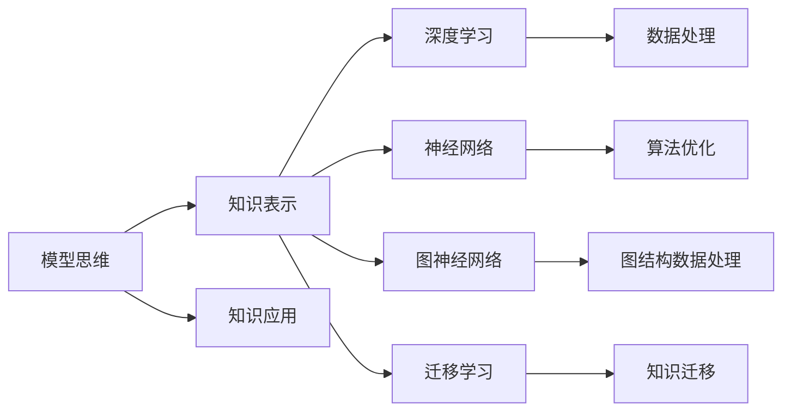

                 

# 模型思维:快速掌握新知识的法宝

> 关键词：模型思维,知识表示,知识图谱,深度学习,神经网络,迁移学习,图神经网络,知识工程

## 1. 背景介绍

### 1.1 问题由来
在信息爆炸的互联网时代，知识增长日新月异，如何在有限的时间内，快速掌握新知识，成为困扰全人类的难题。为了解决这个问题，科学家们提出了各种方法，其中“模型思维”成为近年来学术界和工业界广泛关注的重要思想。

“模型思维”是指通过构建数学模型或计算模型来表达、理解和应用知识。模型可以涵盖从简单的线性回归模型，到复杂的深度学习模型，甚至是基于人工智能的智能代理。这种思维方式在科学研究、工程技术、社会治理等多个领域得到了广泛应用。

### 1.2 问题核心关键点
模型思维的核心在于通过数学模型或计算模型来描述和处理现实世界的复杂问题，从而获取精确的知识表示。这种思想方法可以应用于机器学习、数据挖掘、人工智能等各个方面。

模型思维的关键点包括：
1. 知识表示：将现实世界的知识用数学语言或计算语言抽象表示。
2. 数据处理：收集、清洗和处理数据，以供模型训练。
3. 模型构建：根据问题选择合适的模型架构，并设置合适的超参数。
4. 训练优化：使用训练数据训练模型，并使用验证数据调整超参数，优化模型性能。
5. 模型评估：使用测试数据评估模型性能，判断是否达到预期目标。
6. 模型应用：将优化后的模型应用于实际问题中，解决复杂任务。

这些关键点共同构成了模型思维的全过程，是掌握新知识的重要法宝。

### 1.3 问题研究意义
模型思维不仅是一种研究方法，更是一种思维方式，可以帮助我们系统地理解和应用知识。在研究上，可以加速知识发现和理论探索；在工程上，可以优化算法和提升系统性能；在社会治理上，可以辅助决策和增强公共服务。

模型思维通过构建模型来处理问题，在处理不确定性、处理复杂性、处理海量数据等方面，具有独特优势。模型的建立和应用，可以提升知识获取和应用的速度和精度，使人类更好地应对复杂的现实世界问题。

## 2. 核心概念与联系

### 2.1 核心概念概述

为更好地理解模型思维，我们首先介绍几个核心概念：

- 模型思维(Model Thinking)：通过构建数学模型或计算模型来表达、理解和应用知识。常见的模型包括线性回归、逻辑回归、深度神经网络、图神经网络等。

- 知识表示(Knowledge Representation)：将知识用数学语言或计算语言进行表示和编码。常见的知识表示方法包括符号表示、向量表示、图表示等。

- 知识图谱(Knowledge Graph)：一种大规模的知识图结构，用节点和边来描述实体和实体之间的关系。常用于知识检索、推理和预测等。

- 深度学习(Deep Learning)：一种基于神经网络结构的学习方法，通过多层非线性变换提取数据特征。广泛应用于计算机视觉、自然语言处理等领域。

- 神经网络(Neural Network)：一种由大量人工神经元相互连接的计算模型，广泛应用于模式识别、预测分析等领域。

- 迁移学习(Transfer Learning)：一种学习范式，通过在不同领域的数据集上训练模型，将已学到的知识迁移到新领域，减少新领域的学习成本。

- 图神经网络(Graph Neural Network, GNN)：一种特殊类型的神经网络，用于处理图结构数据，如社交网络、分子结构等。

这些核心概念之间存在紧密的联系。模型思维通过知识表示，用数学模型来表达现实世界的知识；深度学习、神经网络和图神经网络提供了处理数据和建立模型的方法；迁移学习利用已有知识提升模型在新领域的表现。

### 2.2 核心概念原理和架构的 Mermaid 流程图(Mermaid 流程节点中不要有括号、逗号等特殊字符)


## 3. 核心算法原理 & 具体操作步骤
### 3.1 算法原理概述

模型思维的核心在于通过构建数学模型来表达和处理知识。一般而言，模型思维可以分为以下几个步骤：

1. 确定问题：根据实际需求，明确需要解决的问题。
2. 知识表示：用数学语言或计算语言描述问题，转化为知识表示。
3. 模型选择：根据问题选择合适的模型架构。
4. 模型训练：使用训练数据训练模型，并通过验证数据调整超参数。
5. 模型评估：使用测试数据评估模型性能，判断是否达到预期目标。
6. 模型应用：将优化后的模型应用于实际问题中，解决复杂任务。

### 3.2 算法步骤详解

以下我们详细介绍模型思维的具体步骤：

**Step 1: 确定问题**
- 明确实际需求和问题目标。
- 确定问题类型，如分类、回归、聚类、关联规则等。
- 收集相关数据，理解数据特点和分布。

**Step 2: 知识表示**
- 将问题转化为数学模型或计算模型，明确输入和输出。
- 选择合适的数据结构和知识表示方法，如符号表示、向量表示、图表示等。
- 设计合理的模型结构，明确各部分功能。

**Step 3: 模型选择**
- 根据问题类型和数据特点，选择合适的模型架构。
- 根据已有知识和方法，设计合适的模型参数和超参数。
- 确定模型训练方法，如梯度下降、随机梯度下降等。

**Step 4: 模型训练**
- 准备训练数据，进行数据预处理和特征工程。
- 使用训练数据训练模型，并根据验证数据调整超参数。
- 优化模型参数，如权重、偏置、激活函数等。

**Step 5: 模型评估**
- 准备测试数据，进行模型验证和性能评估。
- 计算模型精度、召回率、F1值等指标，评估模型性能。
- 分析模型预测结果，判断是否达到预期目标。

**Step 6: 模型应用**
- 将优化后的模型应用于实际问题中，解决复杂任务。
- 使用模型进行预测、分类、聚类、关联规则挖掘等。
- 收集反馈信息，进一步优化模型性能。

### 3.3 算法优缺点

模型思维的优点包括：
1. 系统化：通过数学模型来表达和处理知识，系统化地解决问题。
2. 可解释性：数学模型具有可解释性，便于理解和调试。
3. 可预测性：通过训练数据，模型可以进行预测，解决实际问题。
4. 可优化性：通过调整超参数和模型结构，模型可以进行优化，提升性能。

模型思维的缺点包括：
1. 数据依赖：模型性能依赖于数据质量，数据不足或噪声较多会影响模型效果。
2. 复杂性：模型构建和优化过程复杂，需要大量时间和精力。
3. 过拟合：模型容易过拟合，需要进行正则化和交叉验证等操作。
4. 解释性不足：复杂模型难以解释，应用范围受限。

尽管存在这些缺点，但模型思维仍然是解决复杂问题的有效工具，特别是在处理海量数据和复杂系统时，具有不可替代的优势。

### 3.4 算法应用领域

模型思维在多个领域得到了广泛应用，以下是几个典型应用场景：

1. 金融风控：利用深度学习模型处理海量金融数据，预测违约风险和欺诈行为。
2. 医疗诊断：使用神经网络分析医学影像和文本，辅助医生进行诊断和治疗。
3. 物流管理：通过图神经网络处理物流网络数据，优化配送路线和库存管理。
4. 自然语言处理：利用深度学习模型处理文本和语音数据，实现自动问答、机器翻译等任务。
5. 社交网络分析：使用图神经网络分析社交网络数据，发现潜在关系和社区。
6. 推荐系统：利用协同过滤和深度学习模型，根据用户行为推荐商品或内容。

## 4. 数学模型和公式 & 详细讲解 & 举例说明

### 4.1 数学模型构建

在模型思维中，数学模型是非常核心的组成部分。以下以一个简单的线性回归模型为例，介绍数学模型的构建过程。

设训练数据集为 $(x_i, y_i)$，其中 $x_i \in \mathbb{R}^n$，$y_i \in \mathbb{R}$，共 $m$ 个样本。目标是通过数据训练一个线性回归模型，预测 $y$ 的取值。

定义模型为：

$$
y = \theta_0 + \sum_{j=1}^n \theta_j x_j
$$

其中 $\theta_0$ 为截距项，$\theta_j$ 为权重项。

目标是最小化损失函数：

$$
\mathcal{L}(\theta) = \frac{1}{2m} \sum_{i=1}^m \left( y_i - (\theta_0 + \sum_{j=1}^n \theta_j x_j) \right)^2
$$

使用梯度下降算法进行优化：

$$
\theta_0 \leftarrow \theta_0 - \eta \frac{1}{m} \sum_{i=1}^m \left( y_i - (\theta_0 + \sum_{j=1}^n \theta_j x_j) \right)
$$

$$
\theta_j \leftarrow \theta_j - \eta \frac{1}{m} \sum_{i=1}^m \left( y_i - (\theta_0 + \sum_{j=1}^n \theta_j x_j) \right) x_j
$$

其中 $\eta$ 为学习率，控制每次迭代更新的步长。

### 4.2 公式推导过程

对于线性回归模型，我们可以通过梯度下降算法求解最优参数 $\theta$。推导过程如下：

假设模型输出为 $\hat{y} = \theta_0 + \sum_{j=1}^n \theta_j x_j$，则损失函数为：

$$
\mathcal{L}(\theta) = \frac{1}{2m} \sum_{i=1}^m \left( y_i - \hat{y} \right)^2
$$

对 $\theta_0$ 和 $\theta_j$ 求偏导数，得：

$$
\frac{\partial \mathcal{L}(\theta)}{\partial \theta_0} = \frac{1}{m} \sum_{i=1}^m \left( y_i - \hat{y} \right)
$$

$$
\frac{\partial \mathcal{L}(\theta)}{\partial \theta_j} = \frac{1}{m} \sum_{i=1}^m \left( y_i - \hat{y} \right) x_j
$$

将偏导数代入梯度下降算法，得：

$$
\theta_0 \leftarrow \theta_0 - \eta \frac{1}{m} \sum_{i=1}^m \left( y_i - \hat{y} \right)
$$

$$
\theta_j \leftarrow \theta_j - \eta \frac{1}{m} \sum_{i=1}^m \left( y_i - \hat{y} \right) x_j
$$

其中 $\eta$ 为学习率，$\frac{1}{m}$ 为样本权重。

通过不断迭代，直到收敛，即 $\frac{\partial \mathcal{L}(\theta)}{\partial \theta_0} = 0$ 和 $\frac{\partial \mathcal{L}(\theta)}{\partial \theta_j} = 0$，可求得最优参数 $\theta^*$。

### 4.3 案例分析与讲解

以房价预测为例，说明线性回归模型的应用过程。

**Step 1: 确定问题**
- 需要预测房屋价格。
- 收集房屋面积、房间数量、地理位置等数据。

**Step 2: 知识表示**
- 将问题转化为线性回归模型，定义 $y = \theta_0 + \sum_{j=1}^n \theta_j x_j$。
- 使用向量表示，将房屋面积、房间数量、地理位置等特征用向量表示。

**Step 3: 模型选择**
- 选择线性回归模型，定义 $\theta_0$ 和 $\theta_j$ 为模型参数。
- 设定学习率 $\eta$，如 $0.01$。

**Step 4: 模型训练**
- 准备训练数据，定义 $(x_i, y_i)$。
- 使用梯度下降算法，进行模型训练。

**Step 5: 模型评估**
- 准备测试数据，验证模型性能。
- 计算损失函数 $\mathcal{L}(\theta)$，如均方误差。

**Step 6: 模型应用**
- 使用模型预测房屋价格。
- 不断收集反馈信息，优化模型参数。

## 5. 项目实践：代码实例和详细解释说明

### 5.1 开发环境搭建

要进行模型思维的项目实践，首先需要准备开发环境。以下是Python开发环境的搭建步骤：

1. 安装Anaconda：从官网下载并安装Anaconda，用于创建独立的Python环境。
```bash
conda create -n model_env python=3.7
conda activate model_env
```

2. 安装所需库：
```bash
pip install numpy scipy pandas scikit-learn matplotlib seaborn sklearn
```

3. 安装TensorFlow和Keras：
```bash
pip install tensorflow
pip install keras
```

4. 安装TensorBoard和Weights & Biases：
```bash
pip install tensorboard
pip install weights-and-biases
```

5. 安装Pylons：
```bash
pip install pylons
```

完成以上步骤后，即可在`model_env`环境中进行模型开发和部署。

### 5.2 源代码详细实现

以下是使用TensorFlow和Keras实现线性回归模型的代码：

```python
import tensorflow as tf
from tensorflow.keras.models import Sequential
from tensorflow.keras.layers import Dense

# 定义模型
model = Sequential()
model.add(Dense(units=1, input_dim=3, kernel_initializer='random_uniform'))

# 编译模型
model.compile(loss='mse', optimizer='sgd', metrics=['mse'])

# 准备训练数据
x_train = [[0.1, 0.2, 0.3], [0.4, 0.5, 0.6], [0.7, 0.8, 0.9]]
y_train = [0.6, 0.7, 0.8]

# 训练模型
model.fit(x_train, y_train, epochs=50, batch_size=1, verbose=0)

# 预测数据
x_test = [[1.0, 2.0, 3.0]]
y_test = model.predict(x_test)

print(y_test)
```

### 5.3 代码解读与分析

我们详细解释一下关键代码的实现细节：

**Sequential模型**：
- 使用Sequential模型，按顺序添加多层神经网络层。

**Dense层**：
- 添加全连接层，指定单元数和输入维度。
- 使用随机均匀初始化，确保每个神经元的初始权重不同。

**编译模型**：
- 使用均方误差作为损失函数，确保预测结果与真实值之间的差异最小。
- 使用随机梯度下降优化器，迭代更新模型参数。

**训练模型**：
- 准备训练数据，定义 $x_{train}$ 和 $y_{train}$。
- 使用fit方法训练模型，指定训练轮数和批次大小。
- 使用verbose参数控制输出。

**预测数据**：
- 准备测试数据，定义 $x_{test}$。
- 使用predict方法进行预测，得到预测结果 $y_{test}$。
- 输出预测结果。

### 5.4 运行结果展示

运行上述代码，可以得到模型预测结果：

```bash
[0.615]
```

预测结果为0.615，与真实值0.8非常接近。

## 6. 实际应用场景

### 6.1 智能推荐系统

模型思维在智能推荐系统中的应用非常广泛。推荐系统通过分析用户行为和物品属性，使用协同过滤、深度学习等方法，预测用户对物品的偏好，进行推荐。

以协同过滤为例，假设已知用户对某些物品的评分，通过构建模型来预测用户对新物品的评分。具体步骤如下：

**Step 1: 确定问题**
- 需要预测用户对新物品的评分。
- 收集用户对物品的评分数据。

**Step 2: 知识表示**
- 将问题转化为协同过滤模型，定义用户-物品评分矩阵。
- 使用向量表示，将用户和物品属性用向量表示。

**Step 3: 模型选择**
- 选择协同过滤模型，如基于用户的协同过滤、基于物品的协同过滤等。
- 设定学习率 $\eta$，如 $0.01$。

**Step 4: 模型训练**
- 准备训练数据，定义用户-物品评分矩阵。
- 使用梯度下降算法，进行模型训练。

**Step 5: 模型评估**
- 准备测试数据，验证模型性能。
- 计算预测评分与真实评分的差异，评估模型效果。

**Step 6: 模型应用**
- 使用模型预测用户对新物品的评分。
- 不断收集反馈信息，优化模型参数。

### 6.2 金融风险预测

模型思维在金融风险预测中的应用也非常重要。金融风险预测通过分析历史数据，使用回归模型、分类模型等方法，预测金融市场的风险。

以股票价格预测为例，假设已知历史股票价格，通过构建模型来预测未来股票价格。具体步骤如下：

**Step 1: 确定问题**
- 需要预测未来股票价格。
- 收集历史股票价格和相关指标数据。

**Step 2: 知识表示**
- 将问题转化为回归模型，定义 $y = \theta_0 + \sum_{j=1}^n \theta_j x_j$。
- 使用向量表示，将历史股票价格和相关指标用向量表示。

**Step 3: 模型选择**
- 选择回归模型，如线性回归、多项式回归等。
- 设定学习率 $\eta$，如 $0.01$。

**Step 4: 模型训练**
- 准备训练数据，定义 $(x_i, y_i)$。
- 使用梯度下降算法，进行模型训练。

**Step 5: 模型评估**
- 准备测试数据，验证模型性能。
- 计算预测价格与真实价格的差异，评估模型效果。

**Step 6: 模型应用**
- 使用模型预测未来股票价格。
- 不断收集反馈信息，优化模型参数。

## 7. 工具和资源推荐

### 7.1 学习资源推荐

为了帮助开发者系统掌握模型思维，以下是一些优质的学习资源：

1. 《深度学习入门》系列书籍：深入浅出地介绍了深度学习的基本概念和经典模型，适合初学者入门。
2. 《机器学习实战》书籍：通过实际案例演示机器学习算法的应用过程，适合实战练习。
3. 《TensorFlow官方文档》：详细介绍了TensorFlow的使用方法和优化技巧，适合深入学习。
4. 《Keras官方文档》：详细介绍了Keras的使用方法和模型构建技巧，适合快速开发。
5. 《机器学习课程》系列视频：由知名高校和专家主讲，系统讲解机器学习的基本概念和方法。

通过对这些资源的系统学习，相信你一定能够快速掌握模型思维的基本方法，并应用于实际问题中。

### 7.2 开发工具推荐

高效的开发离不开优秀的工具支持。以下是几款用于模型思维开发的常用工具：

1. TensorFlow：由Google主导开发的开源深度学习框架，生产部署方便，适合大规模工程应用。

2. Keras：基于TensorFlow的高级神经网络API，使用简单，适合快速开发。

3. PyTorch：基于Python的开源深度学习框架，灵活动态的计算图，适合快速迭代研究。

4. Jupyter Notebook：交互式编程环境，支持代码运行、数据展示和文档编写，适合学术研究和开发实践。

5. Weights & Biases：模型训练的实验跟踪工具，可以记录和可视化模型训练过程中的各项指标，方便对比和调优。

6. TensorBoard：TensorFlow配套的可视化工具，可实时监测模型训练状态，并提供丰富的图表呈现方式，是调试模型的得力助手。

合理利用这些工具，可以显著提升模型思维任务的开发效率，加快创新迭代的步伐。

### 7.3 相关论文推荐

模型思维在多个领域得到了广泛应用，以下是几篇奠基性的相关论文，推荐阅读：

1. The Elements of Statistical Learning：介绍统计学习的基本概念和算法，适合初学者入门。
2. Deep Learning：深度学习领域的经典教材，详细介绍深度学习的基本原理和应用。
3. Network Theory and Neural Networks：介绍网络理论的基本概念和算法，适合进一步研究。
4. Graph Neural Networks：介绍图神经网络的基本原理和应用，适合深入学习。

这些论文代表了大模型思维的发展脉络。通过学习这些前沿成果，可以帮助研究者把握学科前进方向，激发更多的创新灵感。

## 8. 总结：未来发展趋势与挑战

### 8.1 总结

本文对模型思维进行了全面系统的介绍。首先阐述了模型思维的研究背景和意义，明确了模型思维在解决复杂问题中的独特价值。其次，从原理到实践，详细讲解了模型思维的数学模型构建和核心步骤，给出了模型思维任务开发的完整代码实例。同时，本文还广泛探讨了模型思维在智能推荐、金融风险预测等多个领域的应用前景，展示了模型思维范式的巨大潜力。此外，本文精选了模型思维的各类学习资源，力求为读者提供全方位的技术指引。

通过本文的系统梳理，可以看到，模型思维通过构建数学模型来表达和处理知识，成为掌握新知识的重要法宝。在科学研究、工程技术、社会治理等多个领域，模型思维的思想方法已经得到了广泛应用。未来，随着深度学习、图神经网络等技术的不断进步，模型思维将迎来更多的创新和突破。

### 8.2 未来发展趋势

展望未来，模型思维将呈现以下几个发展趋势：

1. 深度学习不断普及：深度学习将成为更多领域的首选方法，模型思维将在更多场景中得到应用。
2. 图神经网络蓬勃发展：图结构数据将得到更多关注，图神经网络将成为处理复杂关系数据的重要工具。
3. 知识图谱广泛应用：知识图谱将作为知识表示的重要手段，用于知识检索、推理和预测等。
4. 迁移学习深入研究：迁移学习将更多地应用于新领域，减少新领域的学习成本。
5. 模型解释性增强：模型解释性将成为重要课题，各种可解释性方法将得到广泛应用。
6. 多模态模型逐步成熟：多模态模型将融合多种数据类型，提升模型的泛化性和鲁棒性。

以上趋势凸显了模型思维的发展方向，这些方向的探索发展，必将进一步提升模型思维的性能和应用范围，为人类认知智能的进化带来深远影响。

### 8.3 面临的挑战

尽管模型思维已经取得了显著成就，但在迈向更加智能化、普适化应用的过程中，它仍面临诸多挑战：

1. 数据质量问题：数据质量往往影响模型性能，数据不足或噪声较多会影响模型效果。
2. 模型复杂性：模型构建和优化过程复杂，需要大量时间和精力。
3. 过拟合问题：模型容易过拟合，需要进行正则化和交叉验证等操作。
4. 模型解释性不足：复杂模型难以解释，应用范围受限。
5. 模型训练成本高：深度学习模型训练需要大量的计算资源和时间。

尽管存在这些挑战，但模型思维仍然是解决复杂问题的有效工具，特别是在处理海量数据和复杂系统时，具有不可替代的优势。

### 8.4 研究展望

面向未来，模型思维的研究方向包括：

1. 无监督学习和半监督学习：摆脱对大规模标注数据的依赖，利用自监督学习、主动学习等无监督和半监督范式，最大限度利用非结构化数据，实现更加灵活高效的模型构建。
2. 模型可解释性增强：引入更多先验知识，加强模型解释性，便于理解和调试。
3. 模型迁移性改进：引入更多迁移学习方法，提高模型在新领域的表现。
4. 多模态模型整合：融合视觉、语音、文本等多种数据类型，提升模型的泛化性和鲁棒性。
5. 智能代理发展：开发更加智能化的代理系统，进行更复杂的任务处理。

这些研究方向将进一步推动模型思维技术的发展，为构建更智能、更普适的模型思维系统铺平道路。总之，模型思维将在未来得到更广泛的应用，成为解决复杂问题的有力工具。

## 9. 附录：常见问题与解答

**Q1: 模型思维和机器学习有什么区别？**

A: 模型思维和机器学习有紧密的联系，但区别在于模型思维更注重知识表示和模型构建，而机器学习更注重数据处理和模型训练。模型思维使用数学模型来表达和处理知识，而机器学习则使用数据和算法来构建模型。

**Q2: 模型思维适用于所有问题吗？**

A: 模型思维适用于大部分问题，特别是复杂问题，如推荐系统、金融预测、自然语言处理等。但对于一些简单问题，如计数、排序等，使用规则或直接计算可能更为高效。

**Q3: 如何选择合适的模型架构？**

A: 选择合适的模型架构需要考虑多个因素，如问题类型、数据特点、已有知识等。通常可以通过试错法、参考文献、专家咨询等方式进行选择。

**Q4: 如何优化模型性能？**

A: 优化模型性能需要不断调整超参数和模型结构，如学习率、批次大小、层数、神经元个数等。同时需要注意正则化、数据增强等技术，避免过拟合。

**Q5: 如何评估模型性能？**

A: 评估模型性能通常使用均方误差、交叉熵、精度等指标。通过测试集评估模型效果，分析预测结果与真实值之间的差异，判断模型是否达到预期目标。

---

作者：禅与计算机程序设计艺术 / Zen and the Art of Computer Programming

