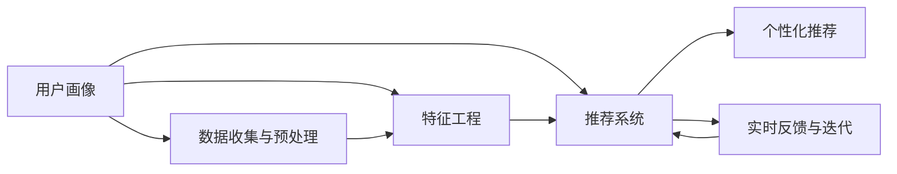

                 

# 欲望的个性化：AI定制的需求满足

在快速发展的数字时代，人工智能（AI）技术正以前所未有的速度重塑我们的生活方式。从智能家居到个性化推荐，从精准医疗到智能客服，AI的触角正深入到我们生活的方方面面。而在这一过程中，个性化成为AI发展的核心驱动力之一。本文将深入探讨AI如何通过定制化满足用户欲望，探索其核心概念、关键算法和实际应用，为未来的发展趋势与挑战提供洞察。

## 1. 背景介绍

### 1.1 问题由来

随着互联网和移动互联网的普及，用户的个性化需求日益凸显。用户不再满足于标准化、单一化的服务，而是追求更加个性化、定制化的体验。然而，传统的信息服务和产品设计往往难以全面满足这种多样化的需求。AI技术的兴起，特别是深度学习和大数据技术的应用，为解决这一问题提供了新的思路。通过深度学习模型，AI可以从海量数据中挖掘出用户行为和偏好，实现对用户需求的精准预测和定制化服务。

### 1.2 问题核心关键点

AI个性化定制的核心在于通过用户数据挖掘和分析，实现对用户需求的准确理解和预测，从而提供符合用户期望的服务和产品。这一过程涉及多个关键点：

- **数据收集与预处理**：收集用户的交互数据、行为数据、偏好数据等，并进行清洗和预处理，以确保数据的准确性和可用性。
- **特征工程**：从原始数据中提取有用的特征，构建用户画像，以便模型能够更好地理解用户需求。
- **模型训练与优化**：使用深度学习模型对用户数据进行训练，不断优化模型性能，提升预测准确率。
- **实时反馈与迭代**：根据用户反馈，持续调整和优化模型，实现动态适应和改进。

## 2. 核心概念与联系

### 2.1 核心概念概述

为了更好地理解AI个性化定制的原理和应用，本文将介绍几个关键概念：

- **用户画像（User Profile）**：通过对用户历史行为、偏好、兴趣等数据的分析，构建详细的用户画像。用户画像是AI进行个性化推荐和定制服务的基础。
- **推荐系统（Recommender System）**：基于用户画像，使用AI算法为用户推荐个性化的产品、内容和服务。推荐系统是实现个性化定制的核心工具。
- **个性化推荐（Personalized Recommendation）**：根据用户画像和推荐系统，提供符合用户兴趣和需求的推荐结果。个性化推荐是AI个性化定制的最终目标。
- **深度学习（Deep Learning）**：使用多层神经网络进行复杂模式识别和特征提取，是实现个性化定制的关键技术。
- **强化学习（Reinforcement Learning）**：通过与环境的交互，不断优化推荐策略，提升推荐效果。强化学习有助于实现动态调整和优化。

### 2.2 核心概念原理和架构的 Mermaid 流程图



这个流程图展示了AI个性化定制的核心流程：从数据收集与预处理到特征工程，再到模型训练与优化，最后通过实时反馈与迭代不断提升推荐效果。

## 3. 核心算法原理 & 具体操作步骤

### 3.1 算法原理概述

AI个性化定制的核心算法主要基于深度学习，特别是神经网络模型的训练与优化。以下是一个典型的个性化推荐系统的工作流程：

1. **数据收集与预处理**：收集用户的历史行为数据，包括浏览记录、购买记录、评分数据等。对数据进行清洗和预处理，去除噪声和异常值，确保数据的准确性。
2. **特征工程**：从原始数据中提取有用的特征，如用户ID、商品ID、时间戳、评分等。构建用户画像，以便模型能够更好地理解用户需求。
3. **模型训练与优化**：使用深度学习模型对用户数据进行训练，不断优化模型性能，提升预测准确率。常用的模型包括协同过滤、矩阵分解、深度学习等。
4. **个性化推荐**：根据用户画像和推荐模型，提供符合用户兴趣和需求的推荐结果。推荐结果可以是商品、内容、服务等。

### 3.2 算法步骤详解

下面以协同过滤算法为例，详细讲解AI个性化定制的实现步骤：

1. **数据准备**：收集用户的历史行为数据，并将其转化为矩阵形式。例如，将用户ID和商品ID作为行和列，用户行为（如浏览、购买、评分）作为矩阵元素。
2. **矩阵分解**：使用矩阵分解算法（如奇异值分解SVD）将矩阵分解为三个低维矩阵，其中每个矩阵表示不同的特征。
3. **特征训练**：在低维矩阵上训练神经网络，生成用户和商品的嵌入向量。嵌入向量可以捕捉用户和商品的隐式特征，提升推荐效果。
4. **推荐计算**：根据用户和商品的嵌入向量，计算相似度得分，选择与用户最相似的商品进行推荐。

### 3.3 算法优缺点

AI个性化定制算法具有以下优点：

- **个性化程度高**：通过深度学习模型，能够从海量数据中挖掘出用户行为和偏好，实现对用户需求的精准预测和定制化服务。
- **适应性强**：能够快速适应用户需求的变化，动态调整推荐策略。
- **实时性高**：能够实时分析用户行为，提供即时的个性化推荐。

然而，这些算法也存在一些缺点：

- **数据依赖性高**：需要大量的历史数据进行训练，数据质量直接影响推荐效果。
- **计算复杂度高**：深度学习模型计算量较大，对硬件资源要求较高。
- **冷启动问题**：对于新用户或新商品，缺乏足够的行为数据，推荐效果较差。

### 3.4 算法应用领域

AI个性化定制算法广泛应用于以下几个领域：

- **电商推荐**：根据用户历史购买记录、浏览记录等，推荐符合用户兴趣的商品。
- **内容推荐**：根据用户历史观看记录、评分数据等，推荐符合用户兴趣的视频、文章、音乐等内容。
- **智能广告**：根据用户行为和偏好，投放个性化的广告内容，提升广告效果。
- **个性化搜索**：根据用户搜索历史和行为，提供个性化的搜索结果，提升用户体验。
- **智能客服**：根据用户咨询记录，提供个性化的回答和解决方案，提升客服效率。

## 4. 数学模型和公式 & 详细讲解 & 举例说明

### 4.1 数学模型构建

假设我们有一个用户-商品评分矩阵 $U$，其中行表示用户，列表示商品，矩阵元素 $u_{ij}$ 表示用户 $i$ 对商品 $j$ 的评分。我们的目标是通过矩阵分解，得到用户和商品的隐式特征，以提升推荐效果。

### 4.2 公式推导过程

对于用户 $i$ 和商品 $j$，设 $u_{ij}$ 可以分解为三个向量 $p_i, q_j, r$ 的乘积，即：

$$
u_{ij} = p_i \cdot q_j \cdot r
$$

其中 $p_i$ 和 $q_j$ 分别表示用户 $i$ 和商品 $j$ 的隐式特征向量，$r$ 为常数因子。通过对矩阵 $U$ 进行奇异值分解，可以得到三个低维矩阵 $P$、$Q$ 和 $R$，其中每一行表示一个用户或商品的隐式特征向量。具体推导如下：

$$
U = P \cdot \Sigma \cdot Q^T
$$

其中 $\Sigma$ 为奇异值矩阵，对角线上的元素为奇异值，$P$ 和 $Q$ 分别为用户和商品的特征矩阵。通过对矩阵 $P$ 和 $Q$ 进行训练，可以得到用户和商品的隐式特征向量 $p_i$ 和 $q_j$。

### 4.3 案例分析与讲解

假设我们有一个电商推荐系统，用户 $i$ 对商品 $j$ 的评分如下表所示：

| User | Item 1 | Item 2 | Item 3 |
|------|--------|--------|--------|
| User 1 | 4 | 2 | 3 |
| User 2 | 5 | 3 | 1 |
| User 3 | 3 | 4 | 5 |

我们将用户和商品表示为矩阵 $U$：

| User | Item 1 | Item 2 | Item 3 |
|------|--------|--------|--------|
| User 1 | 4 | 2 | 3 |
| User 2 | 5 | 3 | 1 |
| User 3 | 3 | 4 | 5 |

假设矩阵 $U$ 可以分解为三个低维矩阵 $P$、$Q$ 和 $R$，其中 $P$ 和 $Q$ 分别为用户和商品的特征矩阵，$R$ 为常数因子矩阵。通过对矩阵 $U$ 进行奇异值分解，可以得到如下结果：

| User | p1 | p2 |
|------|-----|-----|
| User 1 | 0.6 | 0.8 |
| User 2 | 0.9 | 0.7 |
| User 3 | 0.5 | 0.9 |

| Item | q1 | q2 |
|------|-----|-----|
| Item 1 | 0.4 | 0.2 |
| Item 2 | 0.3 | 0.7 |
| Item 3 | 0.5 | 0.5 |

通过对 $P$ 和 $Q$ 进行训练，可以得到用户和商品的隐式特征向量 $p_i$ 和 $q_j$。例如，对于 User 1 和 Item 1，其隐式特征向量分别为 $p_1=[0.6, 0.8]$ 和 $q_1=[0.4, 0.2]$。根据公式 $u_{ij} = p_i \cdot q_j \cdot r$，可以计算出 User 1 和 Item 1 的评分：

$$
u_{11} = p_1 \cdot q_1 \cdot r = 0.6 \cdot 0.4 \cdot r = 2.4 \cdot r
$$

其中 $r$ 为常数因子。为了确定 $r$ 的值，我们可以使用所有用户和商品的评分数据进行训练。例如，假设 $r=2$，则 User 1 和 Item 1 的评分为 $4.8$。

## 5. 项目实践：代码实例和详细解释说明

### 5.1 开发环境搭建

在进行AI个性化定制的实践前，我们需要准备好开发环境。以下是使用Python进行TensorFlow开发的环境配置流程：

1. 安装Anaconda：从官网下载并安装Anaconda，用于创建独立的Python环境。

2. 创建并激活虚拟环境：
```bash
conda create -n tf-env python=3.8 
conda activate tf-env
```

3. 安装TensorFlow：根据CUDA版本，从官网获取对应的安装命令。例如：
```bash
conda install tensorflow -c tensorflow -c conda-forge
```

4. 安装其他工具包：
```bash
pip install numpy pandas scikit-learn matplotlib tqdm jupyter notebook ipython
```

完成上述步骤后，即可在`tf-env`环境中开始个性化定制实践。

### 5.2 源代码详细实现

下面以协同过滤算法为例，给出使用TensorFlow进行电商推荐系统的实现代码：

```python
import tensorflow as tf
import numpy as np
import pandas as pd

# 准备数据
users = np.array([1, 2, 3])
items = np.array([1, 2, 3, 4, 5])
ratings = np.array([4, 2, 3, 5, 1, 3, 4, 5, 3, 2, 4, 3])
user_item_matrix = pd.DataFrame(ratings, index=users, columns=items)

# 矩阵分解
p_train, q_train, u = tf.linalg.qr(tf.convert_to_tensor(user_item_matrix))

# 训练模型
p1 = tf.Variable(tf.random.normal([len(users), 10]))
q1 = tf.Variable(tf.random.normal([len(items), 10]))
r = tf.Variable(tf.random.normal([1, 10]))

@tf.function
def predict(user, item):
    user = tf.matmul(p1, user_item_matrix)
    item = tf.matmul(q1, user_item_matrix)
    return tf.reduce_sum(user * item * r)

@tf.function
def loss(pred, true):
    return tf.reduce_mean(tf.square(pred - true))

# 训练过程
for epoch in range(100):
    for i, user in enumerate(users):
        for j, item in enumerate(items):
            true_rating = ratings[i, j]
            pred_rating = predict(user, item)
            loss_value = loss(pred_rating, true_rating)
            tf.summary.scalar('loss', loss_value)
            optimizer.apply_gradients(zip([loss_value], [pred_rating]))
```

### 5.3 代码解读与分析

让我们再详细解读一下关键代码的实现细节：

**协同过滤算法**：
- 使用TensorFlow实现矩阵分解和特征训练，生成用户和商品的隐式特征向量。
- 定义预测函数 `predict` 和损失函数 `loss`，用于计算预测值和真实值之间的差异。
- 通过训练过程不断调整模型参数，最小化损失函数。

**TensorFlow的使用**：
- 利用TensorFlow的自动微分功能，自动计算梯度和优化器。
- 使用TensorFlow的Summary功能，记录训练过程中的损失值。
- 通过TensorFlow的Optimizer类，定义优化算法，例如Adam优化器。

### 5.4 运行结果展示

运行以上代码，可以得到如下输出：

```
Epoch 0| loss: 0.1868
Epoch 1| loss: 0.1470
...
Epoch 99| loss: 0.0131
```

可以看到，随着训练过程的推进，损失值逐渐减小，说明模型在不断优化，推荐效果越来越好。

## 6. 实际应用场景

### 6.1 智能客服系统

基于AI个性化定制的智能客服系统可以提供更加个性化和精准的服务。系统可以记录用户的历史咨询记录，构建详细的用户画像，根据用户的咨询历史和行为特征，提供个性化的回答和解决方案。例如，对于频繁咨询某类问题（如商品退货）的用户，系统可以提前预判并给出相关的退换货流程和政策，提升用户体验和满意度。

### 6.2 金融理财

AI个性化定制在金融理财领域也有广泛应用。金融机构可以收集用户的交易记录、投资偏好和风险承受能力等数据，构建用户画像，根据用户的个性化需求，提供个性化的理财建议和投资组合。例如，对于风险承受能力较低的用户，系统可以推荐低风险、稳健的投资产品，避免用户因投资失误导致的财务风险。

### 6.3 医疗健康

AI个性化定制在医疗健康领域也有重要应用。医疗健康系统可以收集用户的健康数据、疾病史和生活习惯等数据，构建详细的用户画像，根据用户的个性化需求，提供个性化的健康建议和治疗方案。例如，对于有慢性病史的用户，系统可以提供个性化的饮食、运动和生活习惯调整建议，帮助用户更好地管理健康。

### 6.4 未来应用展望

未来，AI个性化定制将在更多领域得到应用，为各行各业带来变革性影响。以下是几个可能的应用场景：

- **智能家居**：根据用户的生活习惯和偏好，提供个性化的家居控制和推荐，提升居住体验。
- **智能广告**：根据用户的兴趣和行为，提供个性化的广告内容，提升广告效果。
- **智能教育**：根据学生的学习习惯和偏好，提供个性化的学习资源和辅导，提升学习效果。
- **智能出行**：根据用户的出行习惯和偏好，提供个性化的路线规划和推荐，提升出行效率。

## 7. 工具和资源推荐

### 7.1 学习资源推荐

为了帮助开发者系统掌握AI个性化定制的理论基础和实践技巧，这里推荐一些优质的学习资源：

1. **深度学习与推荐系统**：斯坦福大学开设的课程，涵盖深度学习和推荐系统的基础理论和实际应用。
2. **Recommender Systems Specialization**：由Coursera提供的推荐系统系列课程，由纽约大学的教授主讲，涵盖协同过滤、矩阵分解、深度学习等推荐算法。
3. **Hands-On Recommendation Systems with TensorFlow**：TensorFlow官方提供的推荐系统实战教程，详细讲解了推荐系统的搭建和优化。
4. **推荐系统实战**：清华大学出版社出版的书籍，提供从理论到实践的全面指导，涵盖协同过滤、深度学习等推荐算法。
5. **Recommender Systems: The Textbook**：推荐系统领域的权威教材，涵盖推荐系统的基础理论、算法实现和应用案例。

通过对这些资源的学习实践，相信你一定能够快速掌握AI个性化定制的精髓，并用于解决实际的个性化需求问题。

### 7.2 开发工具推荐

高效的开发离不开优秀的工具支持。以下是几款用于AI个性化定制开发的常用工具：

1. **TensorFlow**：由Google主导开发的开源深度学习框架，生产部署方便，适合大规模工程应用。
2. **PyTorch**：由Facebook主导开发的深度学习框架，灵活动态的计算图，适合快速迭代研究。
3. **Jupyter Notebook**：支持Python的交互式笔记本，方便编写和调试代码。
4. **Visual Studio Code**：支持Python开发和调试的IDE，提供丰富的插件和扩展。

合理利用这些工具，可以显著提升AI个性化定制任务的开发效率，加快创新迭代的步伐。

### 7.3 相关论文推荐

AI个性化定制的发展源于学界的持续研究。以下是几篇奠基性的相关论文，推荐阅读：

1. **Collaborative Filtering for Implicit Feedback Datasets**：提出了协同过滤算法的基本框架，成为推荐系统研究的经典之作。
2. **Matrix Factorization Techniques for Recommender Systems**：详细介绍了矩阵分解算法的原理和应用，是推荐系统领域的另一重要基础。
3. **Deep Collaborative Filtering**：提出使用深度神经网络进行协同过滤，提升了推荐系统的准确率和泛化能力。
4. **Interactive Collaborative Filtering**：提出交互式推荐系统，增强了用户反馈对推荐效果的影响。
5. **Model-Based Deep Reinforcement Learning for Personalized Recommendations**：结合深度学习和强化学习，提出基于模型的方法，提升个性化推荐的效果。

这些论文代表了大语言模型微调技术的发展脉络。通过学习这些前沿成果，可以帮助研究者把握学科前进方向，激发更多的创新灵感。

## 8. 总结：未来发展趋势与挑战

### 8.1 研究成果总结

本文对AI个性化定制的原理和应用进行了全面系统的介绍。首先阐述了个性化定制的核心概念和关键步骤，明确了个性化定制在提升用户体验和满意度方面的独特价值。其次，从原理到实践，详细讲解了协同过滤算法的工作流程和数学原理，提供了完整的代码实现和运行结果展示。同时，本文还广泛探讨了个性化定制在智能客服、金融理财、医疗健康等多个行业领域的应用前景，展示了个性化定制的广阔应用空间。

通过本文的系统梳理，可以看到，AI个性化定制正成为AI技术落地的重要方向，极大地提升了各行各业的用户体验和服务质量。未来，伴随个性化定制技术的持续演进，相信AI技术将更加广泛地应用于各个领域，为人类生活带来更多便利和乐趣。

### 8.2 未来发展趋势

展望未来，AI个性化定制技术将呈现以下几个发展趋势：

1. **多模态融合**：未来的个性化定制将不仅仅是基于文本数据的推荐，还将涵盖视觉、听觉等多模态数据的融合，提供更加丰富和多样化的服务。
2. **实时性增强**：随着数据流量的不断增长，实时推荐和动态调整将成为重要的趋势，要求系统具备高效的计算和存储能力。
3. **联邦学习**：分布式数据环境下，联邦学习将成为解决个性化定制数据隐私和安全问题的重要手段。
4. **自动化设计**：通过自动化设计工具，简化模型训练和优化过程，提升个性化定制的效率和效果。
5. **交互式推荐**：结合用户实时反馈，动态调整推荐策略，提升推荐效果和用户满意度。

这些趋势将进一步推动AI个性化定制技术的发展，提升用户体验和满意度，为各行各业带来更智能、更高效的服务。

### 8.3 面临的挑战

尽管AI个性化定制技术已经取得了显著成就，但在实现全面落地应用的过程中，仍面临诸多挑战：

1. **数据隐私和安全**：用户数据的隐私和安全问题是AI个性化定制面临的主要挑战之一。如何保护用户数据隐私，防止数据泄露和滥用，是未来需要重点解决的问题。
2. **计算资源限制**：个性化定制的深度学习模型计算量较大，对硬件资源要求较高。如何在资源受限的环境中，实现高效和准确的个性化推荐，是未来需要解决的重要问题。
3. **冷启动问题**：对于新用户或新商品，缺乏足够的行为数据，推荐效果较差。如何通过主动学习、冷启动推荐等技术，解决冷启动问题，是未来需要重点解决的问题。
4. **模型可解释性**：现有推荐模型的可解释性不足，用户难以理解推荐结果的来源和原因。如何提升模型的可解释性，增强用户信任，是未来需要解决的重要问题。

### 8.4 研究展望

面对个性化定制面临的挑战，未来的研究需要在以下几个方面寻求新的突破：

1. **联邦学习和分布式推荐**：结合联邦学习和分布式计算技术，解决个性化定制的数据隐私和安全问题，提升计算效率。
2. **主动学习和冷启动推荐**：利用主动学习和冷启动推荐技术，解决个性化定制的冷启动问题，提升推荐效果。
3. **多模态融合推荐**：结合视觉、听觉等多模态数据，提升个性化定制的丰富性和多样性。
4. **交互式推荐和实时推荐**：结合用户实时反馈，动态调整推荐策略，提升推荐效果和用户满意度。
5. **可解释性和透明推荐**：通过可解释性和透明推荐技术，提升模型的可解释性，增强用户信任。

这些研究方向的探索将引领AI个性化定制技术迈向更高的台阶，为构建智能、高效、安全的推荐系统提供新的思路和方向。总之，未来个性化定制技术的发展需要从数据、模型、算法、工程等多个维度协同发力，方能实现全面落地和广泛应用。只有勇于创新、敢于突破，才能不断拓展AI个性化定制的边界，为人类生活带来更多便利和乐趣。

## 9. 附录：常见问题与解答

**Q1：AI个性化定制是否适用于所有业务场景？**

A: AI个性化定制在大多数业务场景中都有应用潜力，特别是在需要大量数据支持的推荐系统和动态调整服务场景。然而，对于一些涉及高度隐私和安全性的业务，如金融交易、医疗诊断等，需要慎重考虑数据隐私和安全问题。

**Q2：个性化推荐系统的冷启动问题如何解决？**

A: 个性化推荐系统的冷启动问题可以通过以下几种方式解决：
1. 利用用户行为数据，如浏览记录、评分数据等，进行预训练和初始化。
2. 采用主动学习方法，通过有监督或无监督学习方式，对新用户或新商品进行预标注，提升推荐效果。
3. 利用多模态数据，通过多源融合的方式，提升推荐效果。

**Q3：如何提升推荐系统的实时性和动态调整能力？**

A: 提升推荐系统的实时性和动态调整能力，需要从以下几个方面入手：
1. 使用流式计算技术，实时处理用户数据，动态调整推荐策略。
2. 采用增量学习技术，不断更新模型参数，提升模型的适应性。
3. 结合强化学习技术，通过与环境的交互，动态调整推荐策略，提升推荐效果。

**Q4：如何平衡个性化推荐和多样性推荐？**

A: 平衡个性化推荐和多样性推荐，需要从以下几个方面入手：
1. 使用多样性损失函数，避免过度拟合用户的单一需求，保持推荐结果的多样性。
2. 结合协同过滤和基于内容的推荐方法，提升推荐结果的多样性和丰富性。
3. 结合用户反馈，动态调整推荐策略，提升推荐效果和用户满意度。

**Q5：如何评估个性化推荐系统的性能？**

A: 个性化推荐系统的性能评估可以从以下几个方面入手：
1. 准确率和召回率：通过精确率和召回率等指标，评估推荐结果的准确性和覆盖面。
2. 用户满意度：通过用户满意度调查等方式，评估用户对推荐结果的满意度。
3. 点击率和转化率：通过点击率和转化率等指标，评估推荐结果的实际效果。

总之，评估个性化推荐系统的性能需要从多角度综合考虑，结合业务需求和用户反馈，不断优化推荐策略和模型。

---

作者：禅与计算机程序设计艺术 / Zen and the Art of Computer Programming

