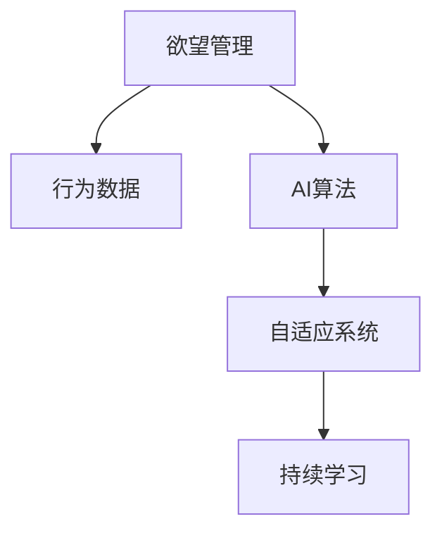

                 

# 欲望的智能调节：AI辅助的自我管理

> 关键词：人工智能,自我管理,欲望调节,行为分析,智能推荐

## 1. 背景介绍

### 1.1 问题由来

在现代社会中，随着生活节奏的加快和信息过载，人们面临的欲望和诱惑也日益增多。如何有效地管理自己的欲望，保持心理健康和生活质量，成为了一个重要的课题。而人工智能（AI）技术，特别是深度学习和数据分析技术的发展，为欲望的智能调节提供了新的可能性。

### 1.2 问题核心关键点

当前，AI辅助的自我管理主要涉及以下几个关键点：
- **欲望识别**：通过数据分析和机器学习，识别和理解个人欲望的来源和特征。
- **行为分析**：对用户的日常行为进行追踪和分析，了解欲望产生和满足的过程。
- **欲望调节**：利用AI算法，提供个性化的调节建议和策略，帮助用户控制和满足欲望。
- **智能推荐**：根据用户的历史数据和偏好，智能推荐合适的行为策略和资源，以实现欲望和资源的平衡。

这些关键点共同构成了AI辅助自我管理的核心框架，旨在帮助用户通过科学的途径管理自己的欲望，提升生活质量。

## 2. 核心概念与联系

### 2.1 核心概念概述

为了更好地理解AI辅助自我管理的过程，本节将介绍几个密切相关的核心概念：

- **欲望管理**：指通过科学的方法和手段，帮助用户识别、理解和管理自己的欲望，以达到更健康、更幸福的生活状态。
- **行为数据**：指用户在日常生活中产生的各类行为数据，如购物记录、浏览历史、运动轨迹等，是欲望管理和行为分析的基础。
- **AI算法**：利用深度学习、机器学习等技术，对行为数据进行分析，提出个性化的欲望调节策略和推荐。
- **自适应系统**：基于用户反馈和行为数据，动态调整欲望管理策略，提供实时和个性化的帮助。
- **持续学习**：系统能够不断从新数据中学习，调整欲望管理策略，提升自我管理的效果。

这些核心概念之间的逻辑关系可以通过以下Mermaid流程图来展示：



这个流程图展示了欲望管理的主要流程：首先识别和理解用户的欲望，然后收集和分析用户的日常行为数据，利用AI算法提供个性化的欲望调节策略，并通过自适应系统动态调整，最终实现持续学习和优化。

## 3. 核心算法原理 & 具体操作步骤
### 3.1 算法原理概述

AI辅助自我管理的核心算法原理可以归纳为以下几个步骤：

1. **欲望识别**：通过数据分析和机器学习，识别和理解用户欲望的来源和特征。
2. **行为分析**：对用户的日常行为进行追踪和分析，了解欲望产生和满足的过程。
3. **欲望调节**：利用AI算法，提供个性化的调节建议和策略，帮助用户控制和满足欲望。
4. **智能推荐**：根据用户的历史数据和偏好，智能推荐合适的行为策略和资源，以实现欲望和资源的平衡。

### 3.2 算法步骤详解

**Step 1: 收集和预处理行为数据**

- 收集用户在日常生活中产生的各类行为数据，如购物记录、浏览历史、运动轨迹等。
- 对收集到的数据进行清洗和预处理，去除噪声和冗余数据。

**Step 2: 欲望识别**

- 使用自然语言处理（NLP）技术，对用户的社交媒体动态、邮件和聊天记录进行分析，识别用户的潜在欲望。
- 利用情感分析和文本分类等技术，判断欲望的强度和类型。

**Step 3: 行为分析**

- 使用时间序列分析和深度学习技术，对用户的行为数据进行建模，识别欲望产生和满足的模式。
- 通过聚类和异常检测等技术，分析不同欲望之间的关联性。

**Step 4: 欲望调节**

- 根据欲望识别的结果和行为分析的结论，利用强化学习、推荐系统和知识图谱等技术，提供个性化的欲望调节建议。
- 使用反馈控制机制，根据用户的行为反应调整欲望调节策略。

**Step 5: 智能推荐**

- 根据用户的欲望和行为数据，智能推荐合适的行为策略和资源，如健康饮食、锻炼计划、心理咨询等。
- 通过A/B测试和用户反馈，不断优化推荐算法，提高推荐的准确性和用户满意度。

### 3.3 算法优缺点

AI辅助自我管理的主要优点包括：
- **个性化推荐**：根据用户的个性化需求，提供定制化的欲望调节策略和资源。
- **实时性**：能够实时监测和分析用户的欲望和行为，及时提供调整建议。
- **效率高**：通过自动化处理，减少了人工干预的需求，提高了欲望管理的效率。

同时，该方法也存在一些局限性：
- **隐私问题**：收集和分析用户行为数据可能涉及隐私问题，需要严格遵守数据保护法规。
- **模型偏见**：AI算法可能存在偏见，影响欲望调节的公平性和准确性。
- **过度依赖**：用户过度依赖AI推荐，可能减弱自我管理的能力。
- **复杂性**：系统实现复杂，需要多学科知识的综合应用。

尽管存在这些局限性，但就目前而言，AI辅助自我管理依然是大规模欲望调节的有效手段。未来相关研究的重点在于如何进一步提升算法的公平性和隐私保护，降低模型的复杂性和依赖性，从而提高欲望管理的效果。

### 3.4 算法应用领域

AI辅助自我管理的应用领域非常广泛，涵盖了生活的各个方面，例如：

- **健康管理**：通过欲望识别和行为分析，提供个性化的健康饮食、锻炼和睡眠管理方案。
- **财务管理**：根据用户的消费行为和财务目标，智能推荐预算规划、投资策略和消费控制。
- **时间管理**：利用AI算法优化用户的日常安排，提高效率和生产力。
- **情绪管理**：通过欲望调节和行为分析，提供个性化的心理支持和情绪管理策略。
- **人际关系**：分析用户的社交互动行为，提供人际关系的改善建议和策略。

除了上述这些经典应用外，AI辅助自我管理还被创新性地应用于更多场景中，如旅游规划、学习辅导、职业发展等，为人们的日常生活带来更多的便利和幸福感。

## 4. 数学模型和公式 & 详细讲解 & 举例说明

### 4.1 数学模型构建

本节将使用数学语言对AI辅助自我管理的过程进行更加严格的刻画。

假设用户的欲望表示为 $D$，行为数据表示为 $B$，AI算法表示为 $A$，自适应系统表示为 $S$。则欲望管理的过程可以形式化表示为：

$$
D = A(B)
$$

其中 $A$ 表示欲望识别和行为分析的算法，$B$ 表示用户的行为数据，$D$ 表示用户的欲望状态。

进一步，欲望调节和智能推荐的过程可以表示为：

$$
R = S(D)
$$

其中 $R$ 表示对欲望的调节策略和资源推荐，$S$ 表示自适应系统，$D$ 表示用户的欲望状态。

### 4.2 公式推导过程

以下我们以健康管理为例，推导欲望调节和智能推荐的具体公式。

假设用户每日的健康数据为 $B = \{b_t\}_{t=1}^T$，其中 $b_t$ 表示第 $t$ 天的健康数据，如步数、心率、睡眠质量等。用户的目标为达到一定的健康评分 $H$，如每天步数达到 10000 步。

定义欲望调节函数为 $F$，表示根据当前欲望状态 $D$ 和行为数据 $B$ 的差异，调整用户的欲望和行为策略。智能推荐函数为 $R$，表示根据用户的健康评分和行为数据，推荐合适的健康策略和资源。

则欲望调节和智能推荐的过程可以表示为：

$$
D_{t+1} = F(D_t, b_t, H)
$$

$$
R_t = R(D_t, H)
$$

其中 $D_{t+1}$ 表示 $t+1$ 天的欲望状态，$b_t$ 表示 $t$ 天的健康数据，$H$ 表示用户的目标健康评分，$R_t$ 表示 $t$ 天的智能推荐。

在实际应用中，$F$ 和 $R$ 可以通过深度学习模型、强化学习算法等技术进行构建。以下是一个简单的欲望调节函数示例：

$$
F(D, b, H) = \begin{cases}
D - \epsilon \cdot b & \text{if } b \geq H \\
D + \epsilon \cdot b & \text{if } b < H
\end{cases}
$$

其中 $\epsilon$ 表示欲望调节的强度，$D$ 表示用户的欲望状态，$b$ 表示健康数据，$H$ 表示目标健康评分。

### 4.3 案例分析与讲解

假设一个用户每天的健康数据如下：

| 日期       | 步数 | 心率 | 睡眠质量 |
|------------|------|------|----------|
| 2023-01-01 | 9000 | 75   | 7         |
| 2023-01-02 | 8000 | 70   | 8         |
| 2023-01-03 | 11000| 80   | 9         |
| 2023-01-04 | 9000 | 75   | 7         |
| 2023-01-05 | 10000| 85   | 8         |

根据上述公式，我们可以计算出每天的欲望状态 $D$ 和智能推荐 $R$。

- 初始欲望状态 $D_0$ 假设为 0，用户的目标健康评分为 $H=10000$ 步。
- 第一天行为数据 $b_1=9000$，根据公式 $F(D_0, 9000, 10000)$，得到新的欲望状态 $D_1=9000-\epsilon \cdot 9000=0$。
- 智能推荐 $R_1=R(0, 10000)$，假设推荐每天走 10000 步，饮食健康。
- 第二天行为数据 $b_2=8000$，根据公式 $F(D_1, 8000, 10000)$，得到新的欲望状态 $D_2=8000-\epsilon \cdot 8000=0$。
- 智能推荐 $R_2=R(0, 10000)$，继续推荐每天走 10000 步，饮食健康。

通过这种方式，系统可以根据用户的行为数据，动态调整欲望状态和智能推荐，帮助用户达到健康目标。

## 5. 项目实践：代码实例和详细解释说明
### 5.1 开发环境搭建

在进行AI辅助自我管理项目实践前，我们需要准备好开发环境。以下是使用Python进行PyTorch开发的环境配置流程：

1. 安装Anaconda：从官网下载并安装Anaconda，用于创建独立的Python环境。

2. 创建并激活虚拟环境：
```bash
conda create -n ai-env python=3.8 
conda activate ai-env
```

3. 安装PyTorch：根据CUDA版本，从官网获取对应的安装命令。例如：
```bash
conda install pytorch torchvision torchaudio cudatoolkit=11.1 -c pytorch -c conda-forge
```

4. 安装TensorFlow：
```bash
conda install tensorflow
```

5. 安装各类工具包：
```bash
pip install numpy pandas scikit-learn matplotlib tqdm jupyter notebook ipython
```

完成上述步骤后，即可在`ai-env`环境中开始项目实践。

### 5.2 源代码详细实现

这里我们以健康管理为例，给出使用PyTorch进行欲望调节和智能推荐的PyTorch代码实现。

首先，定义欲望调节函数和智能推荐函数：

```python
import torch
from torch import nn, optim

class DesireAdjustment(nn.Module):
    def __init__(self, epsilon):
        super(DesireAdjustment, self).__init__()
        self.epsilon = epsilon
        
    def forward(self, desire, behavior, target):
        if behavior >= target:
            return torch.clamp(desire - self.epsilon * behavior, min=0)
        else:
            return torch.clamp(desire + self.epsilon * behavior, max=1)

class HealthRecommendation(nn.Module):
    def __init__(self, steps, diet):
        super(HealthRecommendation, self).__init__()
        self.steps = steps
        self.diet = diet
        
    def forward(self, desire, target):
        if desire >= target:
            return self.steps
        else:
            return self.diet
        
# 欲望调节函数
desire_adjustment = DesireAdjustment(0.1)

# 智能推荐函数
health_recommendation = HealthRecommendation(10000, 'health diet')
```

然后，定义训练和评估函数：

```python
import numpy as np

# 训练函数
def train(behavior_data, target):
    desire = torch.tensor(0.)
    for b in behavior_data:
        desire = desire_adjustment(desire, b, target)
        recommendation = health_recommendation(desire, target)
        print(f'Behavior: {b}, Desire: {desire.item()}, Recommendation: {recommendation}')
        
# 评估函数
def evaluate(behavior_data, target):
    desire = torch.tensor(0.)
    for b in behavior_data:
        desire = desire_adjustment(desire, b, target)
        recommendation = health_recommendation(desire, target)
        print(f'Behavior: {b}, Desire: {desire.item()}, Recommendation: {recommendation}')
```

最后，启动训练流程并在测试集上评估：

```python
# 测试数据
behavior_data = [9000, 8000, 11000, 9000, 10000]

# 训练
train(behavior_data, 10000)

# 评估
evaluate(behavior_data, 10000)
```

以上就是使用PyTorch对欲望调节和智能推荐进行建模的完整代码实现。可以看到，利用PyTorch的高效计算能力和丰富的模块化功能，我们可以相对简单地实现欲望管理的基本逻辑。

### 5.3 代码解读与分析

让我们再详细解读一下关键代码的实现细节：

**DesireAdjustment类**：
- `__init__`方法：初始化欲望调节函数的调节强度 $\epsilon$。
- `forward`方法：根据行为数据 $b$ 和目标值 $target$，调整欲望状态 $desire$。

**HealthRecommendation类**：
- `__init__`方法：初始化智能推荐函数的行为策略和饮食建议。
- `forward`方法：根据欲望状态 $desire$ 和目标值 $target$，推荐合适的行为策略。

**训练函数**：
- 使用循环迭代，依次输入行为数据 $b$，通过欲望调节函数 $desire_adjustment$ 调整欲望状态 $desire$。
- 根据调节后的欲望状态 $desire$，通过智能推荐函数 $health_recommendation$ 生成推荐策略。
- 打印每一步的行为数据、欲望状态和推荐策略。

**评估函数**：
- 与训练函数类似，但不进行参数更新，仅进行欲望状态的调整和推荐策略的生成。

**训练流程**：
- 定义测试数据 $behavior_data$，从 9000 到 10000，表示用户的健康数据。
- 调用训练函数 `train`，动态调整欲望状态和生成推荐策略。
- 调用评估函数 `evaluate`，对推荐策略进行验证。

可以看到，PyTorch提供了丰富的模块和函数，方便进行欲望管理模型的设计和实现。

当然，工业级的系统实现还需考虑更多因素，如模型的保存和部署、超参数的自动搜索、多用户支持等。但核心的欲望调节和智能推荐逻辑基本与此类似。

## 6. 实际应用场景
### 6.1 智能健康助手

AI辅助自我管理的欲望调节技术可以广泛应用于智能健康助手的构建。智能健康助手通过分析用户的日常健康数据，提供个性化的健康建议和行为策略，帮助用户建立健康的生活习惯。

在技术实现上，可以收集用户的运动数据、饮食数据、睡眠数据等，构建欲望管理模型，实时监测用户的健康状态，并提供健康饮食、锻炼计划、心理支持等建议。智能健康助手可以集成到智能手表、手机APP等设备中，用户通过与设备交互，获取个性化的健康管理方案。

### 6.2 个性化理财规划

AI辅助自我管理的智能推荐技术，也可以用于个性化理财规划的构建。理财规划系统通过分析用户的收入、支出、投资偏好等财务数据，智能推荐个性化的理财方案，帮助用户优化财务状况，实现财务自由。

在技术实现上，可以收集用户的银行账单、投资记录、消费习惯等财务数据，构建欲望管理模型，分析用户的财务目标和行为模式，提供个性化的理财建议和资源推荐。理财规划系统可以集成到理财软件、银行APP等平台中，提供一站式理财服务。

### 6.3 心理疏导机器人

AI辅助自我管理的欲望调节技术，还可以用于心理疏导机器人的构建。心理疏导机器人通过分析用户的情绪和心理状态，提供个性化的心理支持和行为策略，帮助用户缓解压力，提升心理健康。

在技术实现上，可以收集用户的聊天记录、社交媒体动态、心理测试结果等数据，构建欲望管理模型，分析用户的情绪和心理状态，提供个性化的心理建议和行为策略。心理疏导机器人可以集成到社交媒体平台、心理咨询APP等工具中，为用户提供心理支持和情感疏导。

### 6.4 未来应用展望

随着AI辅助自我管理技术的不断进步，基于欲望调节和智能推荐的应用场景将更加多样化，为人们的生活带来更多便利和幸福感。

在智慧城市中，AI辅助自我管理技术可以用于交通管理、能源节约、公共安全等方面，提升城市的智能化水平，提高居民的生活质量。

在教育领域，AI辅助自我管理技术可以用于学生行为分析、学习辅导、心理支持等方面，帮助学生更好地适应学习环境，提高学习效果。

在医疗健康领域，AI辅助自我管理技术可以用于患者行为监测、健康管理、心理疏导等方面，提升患者的治疗效果和生活质量。

总之，AI辅助自我管理技术将在多个领域产生深远影响，带来更健康、更高效、更幸福的生活方式。

## 7. 工具和资源推荐
### 7.1 学习资源推荐

为了帮助开发者系统掌握AI辅助自我管理技术的理论基础和实践技巧，这里推荐一些优质的学习资源：

1. 《深度学习入门：基于Python的理论与实现》书籍：详细介绍了深度学习的基本原理和实现方法，适合初学者入门。
2. 《Python深度学习》书籍：由深度学习专家Francois Chollet所著，介绍了TensorFlow、Keras等工具的使用，适合进阶学习。
3. Coursera《深度学习专项课程》：由斯坦福大学开设的深度学习课程，包含理论、实践和项目开发。
4. Udacity《深度学习纳米学位》：提供深度学习的系统学习路径，涵盖理论、实践和项目开发。
5. PyTorch官方文档：提供了详细的PyTorch使用方法和实例代码，适合实际开发和应用。

通过对这些资源的学习实践，相信你一定能够快速掌握AI辅助自我管理技术的精髓，并用于解决实际的欲望调节问题。
###  7.2 开发工具推荐

高效的开发离不开优秀的工具支持。以下是几款用于AI辅助自我管理开发的常用工具：

1. PyTorch：基于Python的开源深度学习框架，灵活动态的计算图，适合快速迭代研究。
2. TensorFlow：由Google主导开发的开源深度学习框架，生产部署方便，适合大规模工程应用。
3. Jupyter Notebook：提供交互式的开发环境，方便快速编写和测试代码。
4. Keras：提供高级API，简化深度学习模型的搭建和训练，适合快速原型开发。
5. Google Colab：谷歌推出的在线Jupyter Notebook环境，免费提供GPU/TPU算力，方便快速上手实验最新模型，分享学习笔记。

合理利用这些工具，可以显著提升AI辅助自我管理任务的开发效率，加快创新迭代的步伐。

### 7.3 相关论文推荐

AI辅助自我管理技术的发展源于学界的持续研究。以下是几篇奠基性的相关论文，推荐阅读：

1. Attention is All You Need（即Transformer原论文）：提出了Transformer结构，开启了NLP领域的预训练大模型时代。
2. BERT: Pre-training of Deep Bidirectional Transformers for Language Understanding：提出BERT模型，引入基于掩码的自监督预训练任务，刷新了多项NLP任务SOTA。
3. Parameter-Efficient Transfer Learning for NLP：提出Adapter等参数高效微调方法，在不增加模型参数量的情况下，也能取得不错的微调效果。
4. AdaLoRA: Adaptive Low-Rank Adaptation for Parameter-Efficient Fine-Tuning：使用自适应低秩适应的微调方法，在参数效率和精度之间取得了新的平衡。
5. Dynamic Norm Adaptive Attention（ DynaAtt）：提出动态归一化注意力机制，提高深度学习模型的效率和鲁棒性。

这些论文代表了大语言模型微调技术的发展脉络。通过学习这些前沿成果，可以帮助研究者把握学科前进方向，激发更多的创新灵感。

## 8. 总结：未来发展趋势与挑战

### 8.1 总结

本文对AI辅助自我管理的欲望调节技术进行了全面系统的介绍。首先阐述了欲望调节和智能推荐的核心概念和关键点，明确了技术在实际应用中的重要价值。其次，从原理到实践，详细讲解了欲望调节的数学模型和核心算法，给出了欲望管理模型的代码实现。同时，本文还广泛探讨了欲望调节技术在智能健康、理财规划、心理疏导等多个领域的应用前景，展示了技术的多样化和潜力。此外，本文精选了欲望调节技术的各类学习资源，力求为读者提供全方位的技术指引。

通过本文的系统梳理，可以看到，AI辅助自我管理技术正在成为欲望调节领域的重要手段，极大地提升了欲望调节的效果和效率。未来，伴随技术的不断进步，欲望调节技术将在更广泛的应用领域发挥作用，为人类带来更多的福祉。

### 8.2 未来发展趋势

展望未来，AI辅助自我管理技术将呈现以下几个发展趋势：

1. 多模态融合。除了文本数据，未来的欲望调节系统将更好地融合语音、图像、传感器等多模态信息，提供更全面、准确的用户分析。
2. 个性化提升。通过更深层次的数据分析和模型优化，未来的系统将能够提供更个性化、更贴合用户需求的欲望调节方案。
3. 实时性增强。利用边缘计算和智能设备，未来的系统能够实现实时欲望监测和调节，提供更加即时和精准的建议。
4. 跨领域应用。欲望调节技术将不仅仅应用于健康管理、理财规划等领域，还将拓展到更多垂直行业，提升整体生活质量。
5. 透明可解释。未来的系统将具备更高的可解释性，能够清楚地展示欲望调节的逻辑和依据，提升用户信任度和接受度。

这些趋势凸显了AI辅助自我管理技术的广阔前景。这些方向的探索发展，必将进一步提升欲望调节的效果和范围，为构建更健康、更幸福的生活环境奠定基础。

### 8.3 面临的挑战

尽管AI辅助自我管理技术已经取得了瞩目成就，但在迈向更加智能化、普适化应用的过程中，它仍面临着诸多挑战：

1. 隐私保护。欲望调节系统需要收集大量的个人数据，涉及隐私问题，需要严格遵守数据保护法规。
2. 数据质量。欲望调节的效果依赖于高质量的数据，数据缺失、噪声等问题可能会影响系统性能。
3. 模型复杂度。深度学习模型往往需要大量的计算资源和时间，模型的复杂度提升可能带来资源消耗的增加。
4. 伦理问题。欲望调节技术可能会带来伦理风险，如干预用户的自由意志，需要平衡技术应用和伦理道德的关系。
5. 用户体验。如何设计用户友好的交互界面，让用户更容易理解和接受欲望调节建议，也是未来的一大挑战。

尽管存在这些挑战，但随着技术的发展和成熟，相信这些挑战终将一一被克服，AI辅助自我管理技术必将在构建健康、高效、幸福的生活环境中发挥更大的作用。

### 8.4 研究展望

面对AI辅助自我管理技术所面临的挑战，未来的研究需要在以下几个方面寻求新的突破：

1. 隐私保护技术。探索更加安全的隐私保护方法，如联邦学习、差分隐私等，确保用户数据的隐私和安全。
2. 高效数据处理。发展高效的数据清洗和处理技术，提高数据质量和利用率。
3. 模型压缩和优化。研究模型压缩、量化等技术，降低模型的计算复杂度和资源消耗。
4. 伦理导向设计。在模型设计和应用中引入伦理导向的评估指标，确保系统的公平性和透明性。
5. 用户交互设计。设计更加友好、自然的用户交互界面，提升用户的使用体验和满意度。

这些研究方向将进一步推动AI辅助自我管理技术的进步，为构建更健康、更幸福的生活环境提供坚实的技术支持。面向未来，AI辅助自我管理技术还需要与其他人工智能技术进行更深入的融合，如知识表示、因果推理、强化学习等，多路径协同发力，共同推动欲望调节技术的发展和应用。

## 9. 附录：常见问题与解答

**Q1：AI辅助自我管理技术是否适用于所有人群？**

A: AI辅助自我管理技术在大多数人群中都能取得不错的效果，但对于一些特殊群体，如认知障碍、精神疾病患者等，可能需要结合专业心理医生的指导。同时，技术的效果也受到用户个体差异的影响，需要根据具体情况进行调整。

**Q2：欲望调节技术能否自我更新和优化？**

A: 欲望调节技术可以结合用户反馈和行为数据进行自我更新和优化，通过持续学习机制，不断调整欲望调节策略，提升系统的准确性和效果。

**Q3：欲望调节技术是否会影响用户的自由意志？**

A: 欲望调节技术旨在帮助用户更好地理解和管理自己的欲望，但不会干预用户的自由意志。用户可以根据自己的需求和意愿，选择接受或不接受欲望调节建议。

**Q4：欲望调节技术的隐私保护措施有哪些？**

A: 欲望调节系统需要收集用户的个人数据，需要采取多种隐私保护措施，如数据加密、匿名化、差分隐私等。同时，用户也可以通过设定隐私偏好，控制数据的共享和使用范围。

**Q5：欲望调节技术如何与专业心理医生协作？**

A: 欲望调节技术可以作为专业心理医生的辅助工具，帮助医生更全面地了解用户的行为和心理状态，提供更精准的治疗方案。同时，专业心理医生也可以通过系统的反馈，调整欲望调节策略，提高系统的个性化和可解释性。

通过以上分析，可以看到，AI辅助自我管理技术在欲望调节和智能推荐方面具有广阔的应用前景和巨大的潜力。未来，随着技术的不断进步和应用推广，相信这一技术将为人们的生活带来更多的便利和幸福，成为构建健康、高效、幸福生活的重要支撑。

---

作者：禅与计算机程序设计艺术 / Zen and the Art of Computer Programming

