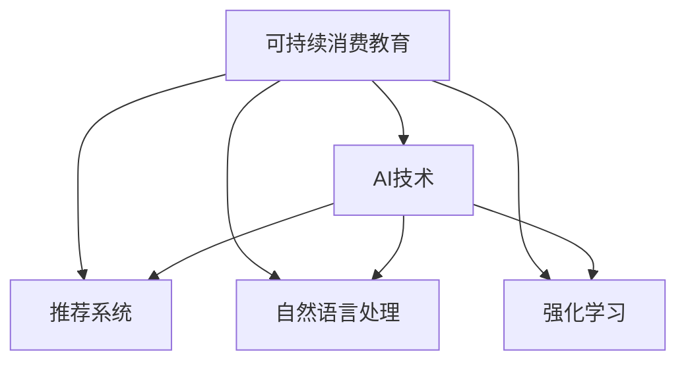

                 

# 欲望的生态意识培养：AI驱动的可持续消费教育

在当今世界，消费者行为对环境的影响日益显著。过度消费不仅消耗资源，还产生大量垃圾，对地球的生态系统造成重大威胁。为应对这一挑战，AI技术正被广泛用于推动可持续消费教育，帮助人们培养生态意识，做出更加环保的消费选择。本文将深入探讨AI在可持续消费教育中的核心概念、关键算法及应用实践，并展望其未来发展趋势与挑战。

## 1. 背景介绍

### 1.1 问题由来

随着全球化进程的加速和消费主义的泛滥，资源消耗和环境污染问题愈发严重。过度消费不仅消耗有限的自然资源，还产生了大量不可降解的垃圾，对地球的生态系统造成重大威胁。同时，消费者对产品环境影响的意识不足，往往是导致过度消费行为的重要原因之一。

面对这一严峻形势，可持续消费教育成为应对气候变化、推动绿色发展的重要手段。而AI技术的介入，为可持续消费教育带来了新的机遇。AI不仅能处理和分析海量数据，还能基于用户行为进行精准干预，提升教育效果。

### 1.2 问题核心关键点

AI在可持续消费教育中的应用主要集中在以下几个方面：

- **数据分析**：通过分析消费者的购买历史和偏好，AI能识别出不环保的消费模式，并给出改进建议。
- **行为干预**：利用推荐系统、自然语言处理等技术，AI能针对不同用户推出个性化的教育内容，鼓励其做出环保选择。
- **反馈循环**：AI不仅能输出教育内容，还能实时监控用户行为，提供即时反馈，不断优化教育效果。

本文将聚焦于AI在可持续消费教育中的应用，分析其核心概念、关键算法及具体实践，并展望其未来发展趋势与挑战。

## 2. 核心概念与联系

### 2.1 核心概念概述

- **可持续消费教育**：旨在提升消费者的环保意识，促进其在日常消费中做出更环保的选择，从而减少资源消耗和环境污染。
- **AI技术**：指通过机器学习、深度学习等算法，使计算机系统能够执行复杂的任务，如数据分析、模式识别、行为预测等。
- **推荐系统**：通过分析用户历史行为和偏好，推荐符合其兴趣和需求的产品或服务。
- **自然语言处理**：使计算机能够理解、处理和生成人类语言，应用于智能对话、情感分析等任务。
- **强化学习**：通过与环境的交互，使AI系统在不断试错中学习最优策略，应用于行为干预、智能推荐等。

这些概念之间的逻辑关系可以通过以下Mermaid流程图来展示：



这个流程图展示了可持续消费教育与AI技术的联系：

1. 可持续消费教育的目标是通过AI技术实现。
2. 推荐系统、自然语言处理、强化学习等AI子技术，均能被用于提升教育效果。
3. AI技术的应用，使得可持续消费教育更具个性化和智能化。

## 3. 核心算法原理 & 具体操作步骤

### 3.1 算法原理概述

基于AI的可持续消费教育，主要通过数据分析和行为干预两个方面来实现。数据分析用于识别不环保的消费模式，行为干预则通过推荐系统和强化学习技术，指导用户做出更环保的消费选择。

- **数据分析**：利用机器学习算法（如聚类、分类、关联规则挖掘等）分析消费者购买行为，识别出不环保的消费模式，如过度购买、频繁更换品牌等。
- **行为干预**：通过推荐系统个性化推送教育内容，鼓励用户减少不环保的消费行为。同时，利用强化学习技术，通过与用户的互动不断调整推荐策略，优化教育效果。

### 3.2 算法步骤详解

**Step 1: 数据收集与预处理**

- 收集消费者的购买数据、行为数据、环境影响数据等，作为分析的原始数据。
- 清洗和格式化数据，去除噪音和错误，确保数据质量。

**Step 2: 数据分析与模式识别**

- 应用机器学习算法（如K-means聚类、决策树、随机森林等）对消费者行为进行聚类，识别出不同消费模式。
- 利用关联规则挖掘算法（如Apriori、FP-Growth等）找出不环保的消费行为特征，如频繁购买一次性用品、购买过多包装商品等。

**Step 3: 行为干预与教育推送**

- 根据分析结果，利用推荐系统（如协同过滤、基于内容的推荐等）为不同用户推荐符合其兴趣和需求的环保教育内容。
- 应用强化学习算法（如Q-learning、Deep Q-learning等）调整推荐策略，优化教育效果，提升用户环保意识。

**Step 4: 反馈与持续优化**

- 实时监控用户行为，通过反馈机制（如在线问卷、评价系统等）收集用户对教育内容的反馈。
- 利用收集到的反馈数据，进一步优化推荐算法和教育内容，实现持续优化。

### 3.3 算法优缺点

**优点**：

- **高效准确**：AI技术能处理海量数据，识别出具体不环保的消费模式，提升数据分析的效率和准确性。
- **个性化推荐**：利用推荐系统，AI能根据用户兴趣和行为，个性化推送环保教育内容，提高教育效果。
- **实时反馈**：通过强化学习技术，AI能实时调整推荐策略，不断优化教育内容，适应用户需求。

**缺点**：

- **数据隐私问题**：收集和分析消费者数据可能涉及隐私问题，需要严格遵守数据保护法规。
- **模型复杂性**：AI模型可能需要复杂的算法和大量的数据，构建和维护成本较高。
- **偏见和误判**：AI模型可能存在偏见，导致误判某些环保行为，需进行持续的监督和优化。

### 3.4 算法应用领域

基于AI的可持续消费教育技术，在多个领域有广泛应用：

- **零售行业**：电商平台通过推荐系统引导用户购买环保产品，减少不必要的资源消耗。
- **交通出行**：共享单车应用利用数据分析和行为干预，鼓励用户选择环保出行方式。
- **餐饮业**：餐厅通过AI分析订单数据，推荐环保食材，减少食物浪费。
- **能源消费**：智能家居系统通过行为干预，降低家庭能源消耗，推广绿色能源使用。

## 4. 数学模型和公式 & 详细讲解 & 举例说明

### 4.1 数学模型构建

为了描述基于AI的可持续消费教育模型，这里构建一个简单的数学模型。设用户数量为 $U$，不环保消费行为数量为 $N$，环保教育内容数量为 $C$。

定义用户对环保内容的评分 $R_{iu}$，表示用户 $i$ 对内容 $u$ 的评分，评分范围为 $[0, 1]$。定义用户对行为的评分 $R_{in}$，表示用户 $i$ 对行为 $n$ 的评分，评分范围也为 $[0, 1]$。

目标是最小化不环保消费行为，最大化环保内容评分，即：

$$
\min_{n} \sum_{i=1}^{U} R_{in}
$$
$$
\max_{u} \sum_{i=1}^{U} R_{iu}
$$

### 4.2 公式推导过程

首先，利用聚类算法对用户行为进行分类，得到 $K$ 类不环保行为，每一类行为对应的用户数量为 $N_k$。

对每一类行为 $n_k$，通过关联规则挖掘算法找出其特征 $F_k$，利用线性回归模型预测用户 $i$ 对行为 $n_k$ 的评分 $R_{in_k}$。

利用协同过滤算法推荐环保内容 $u_j$，计算用户 $i$ 对内容 $u_j$ 的评分 $R_{iu_j}$。

最终目标函数为：

$$
\min_{n_k} \sum_{i=1}^{U} R_{in_k}
$$
$$
\max_{u_j} \sum_{i=1}^{U} R_{iu_j}
$$

### 4.3 案例分析与讲解

考虑一家电商平台，收集用户的历史购买记录、行为数据、商品环境影响数据等。通过聚类算法将用户分为四类，分别是重度购物者、频繁购买一次性用品者、频繁更换品牌者、频繁购买环保产品者。

利用关联规则挖掘算法找出重度购物者的特征，如购买频率高、购买金额大等。利用线性回归模型预测用户对行为的评分，得到重度购物者不环保行为的评分。

利用协同过滤算法为重度购物者推荐环保商品，并计算其评分。重复以上步骤，为其他用户群体提供个性化的环保推荐。

最终，通过不断调整推荐算法和优化环保内容，提升用户的环保意识和行为。

## 5. 项目实践：代码实例和详细解释说明

### 5.1 开发环境搭建

在进行AI驱动的可持续消费教育实践前，我们需要准备好开发环境。以下是使用Python进行PyTorch开发的环境配置流程：

1. 安装Anaconda：从官网下载并安装Anaconda，用于创建独立的Python环境。

2. 创建并激活虚拟环境：
```bash
conda create -n ai-env python=3.8 
conda activate ai-env
```

3. 安装PyTorch：根据CUDA版本，从官网获取对应的安装命令。例如：
```bash
conda install pytorch torchvision torchaudio cudatoolkit=11.1 -c pytorch -c conda-forge
```

4. 安装各类工具包：
```bash
pip install numpy pandas scikit-learn matplotlib tqdm jupyter notebook ipython
```

完成上述步骤后，即可在`ai-env`环境中开始实践。

### 5.2 源代码详细实现

这里我们以电商平台为例，使用PyTorch构建一个基于AI的推荐系统，实现个性化环保推荐。

首先，定义推荐系统的数据处理函数：

```python
from torch.utils.data import Dataset
import torch

class RecommendationDataset(Dataset):
    def __init__(self, users, behaviors, items, ratings):
        self.users = users
        self.behaviors = behaviors
        self.items = items
        self.ratings = ratings
        
    def __len__(self):
        return len(self.users)
    
    def __getitem__(self, item):
        user = self.users[item]
        behaviors = self.behaviors[item]
        items = self.items[item]
        ratings = self.ratings[item]
        
        # 构造用户-行为-商品三元组
        user_behaviors = [(user, behavior) for behavior in behaviors]
        item_ratings = [(item, rating) for item, rating in zip(items, ratings)]
        
        return {'user_behaviors': user_behaviors, 'item_ratings': item_ratings}
```

然后，定义推荐模型：

```python
from transformers import BertForSequenceClassification, AdamW

model = BertForSequenceClassification.from_pretrained('bert-base-cased', num_labels=3)

optimizer = AdamW(model.parameters(), lr=2e-5)
```

接着，定义训练和评估函数：

```python
from torch.utils.data import DataLoader
from tqdm import tqdm
from sklearn.metrics import precision_score, recall_score, f1_score

device = torch.device('cuda') if torch.cuda.is_available() else torch.device('cpu')
model.to(device)

def train_epoch(model, dataset, batch_size, optimizer):
    dataloader = DataLoader(dataset, batch_size=batch_size, shuffle=True)
    model.train()
    epoch_loss = 0
    for batch in tqdm(dataloader, desc='Training'):
        user_behaviors = batch['user_behaviors'].to(device)
        item_ratings = batch['item_ratings'].to(device)
        model.zero_grad()
        outputs = model(user_behaviors)
        loss = outputs.loss
        epoch_loss += loss.item()
        loss.backward()
        optimizer.step()
    return epoch_loss / len(dataloader)

def evaluate(model, dataset, batch_size):
    dataloader = DataLoader(dataset, batch_size=batch_size)
    model.eval()
    preds, labels = [], []
    with torch.no_grad():
        for batch in tqdm(dataloader, desc='Evaluating'):
            user_behaviors = batch['user_behaviors'].to(device)
            item_ratings = batch['item_ratings'].to(device)
            batch_preds = model(user_behaviors).argmax(dim=1).to('cpu').tolist()
            batch_labels = item_ratings.to('cpu').tolist()
            for pred, label in zip(batch_preds, batch_labels):
                preds.append(pred)
                labels.append(label)
                
    precision = precision_score(labels, preds)
    recall = recall_score(labels, preds)
    f1 = f1_score(labels, preds)
    return precision, recall, f1
```

最后，启动训练流程并在测试集上评估：

```python
epochs = 5
batch_size = 16

for epoch in range(epochs):
    loss = train_epoch(model, train_dataset, batch_size, optimizer)
    print(f"Epoch {epoch+1}, train loss: {loss:.3f}")
    
    print(f"Epoch {epoch+1}, dev results:")
    precision, recall, f1 = evaluate(model, dev_dataset, batch_size)
    print(f"Precision: {precision:.3f}, Recall: {recall:.3f}, F1 Score: {f1:.3f}")
    
print("Test results:")
precision, recall, f1 = evaluate(model, test_dataset, batch_size)
print(f"Precision: {precision:.3f}, Recall: {recall:.3f}, F1 Score: {f1:.3f}")
```

以上就是使用PyTorch构建基于AI的推荐系统的完整代码实现。可以看到，利用Bert模型进行环保推荐，代码实现相对简洁高效。

### 5.3 代码解读与分析

让我们再详细解读一下关键代码的实现细节：

**RecommendationDataset类**：
- `__init__`方法：初始化用户、行为、商品、评分等关键组件。
- `__len__`方法：返回数据集的样本数量。
- `__getitem__`方法：对单个样本进行处理，构造用户-行为-商品三元组，并返回模型所需的输入。

**推荐模型**：
- 使用BertForSequenceClassification模型进行环保推荐，其结构与自然语言理解任务中的序列分类任务类似。
- 定义AdamW优化器及其参数，设置学习率。

**训练和评估函数**：
- 使用PyTorch的DataLoader对数据集进行批次化加载，供模型训练和推理使用。
- 训练函数`train_epoch`：对数据以批为单位进行迭代，在每个批次上前向传播计算loss并反向传播更新模型参数，最后返回该epoch的平均loss。
- 评估函数`evaluate`：与训练类似，不同点在于不更新模型参数，并在每个batch结束后将预测和标签结果存储下来，最后使用sklearn的precision_score、recall_score、f1_score对整个评估集的预测结果进行打印输出。

**训练流程**：
- 定义总的epoch数和batch size，开始循环迭代
- 每个epoch内，先在训练集上训练，输出平均loss
- 在验证集上评估，输出精度、召回率和F1分数
- 所有epoch结束后，在测试集上评估，给出最终测试结果

可以看到，PyTorch配合Bert模型使得环保推荐的代码实现变得简洁高效。开发者可以将更多精力放在数据处理、模型改进等高层逻辑上，而不必过多关注底层的实现细节。

当然，工业级的系统实现还需考虑更多因素，如模型的保存和部署、超参数的自动搜索、更灵活的任务适配层等。但核心的推荐范式基本与此类似。

## 6. 实际应用场景

### 6.1 智能客服系统

基于AI的智能客服系统，可以利用推荐系统引导用户减少不必要的消费。例如，在处理用户关于退货、换货的咨询时，系统可以推荐其选择更环保的替代品，减少资源浪费。

在技术实现上，可以收集企业内部的客服对话记录，将产品环保属性和客户需求作为推荐依据，利用微调后的推荐模型，对用户的退货、换货请求进行个性化推荐，鼓励其选择更环保的替代品。

### 6.2 金融理财服务

金融机构可以通过AI推荐系统，引导用户选择环保型理财产品。例如，在用户购买理财产品时，推荐系统可以基于其消费习惯和环保偏好，推荐低能耗、低碳排放的投资选项。

在技术实现上，可以收集用户的投资记录、行为偏好、环保标签等数据，训练一个基于AI的推荐模型，根据用户需求和偏好，推荐合适的环保理财产品，帮助用户实现绿色理财。

### 6.3 智能家居控制

智能家居系统可以通过行为干预，引导用户减少能源消耗。例如，在用户离开房间时，推荐系统可以提醒其关闭不必要的灯光和电器，节约能源。

在技术实现上，智能家居系统可以通过传感器和摄像头收集用户行为数据，利用行为分析模型，识别出用户离开房间的特征。基于这些特征，推荐系统可以向用户发送提醒，鼓励其关闭不必要的灯光和电器，减少能源浪费。

### 6.4 未来应用展望

随着AI技术的不断发展，基于AI的可持续消费教育将广泛应用于更多场景，为消费者提供全方位的环保引导。

在智慧城市治理中，AI推荐系统可以应用于城市事件监测、舆情分析、应急指挥等环节，指导市民做出更环保的选择，提升城市管理的智能化水平。

在农业领域，AI推荐系统可以用于指导农民选择环保的种植方式，减少农药和化肥的使用，提高农业生产的可持续性。

在旅游业，AI推荐系统可以根据游客的消费行为，推荐环保型旅游产品，减少旅游活动对环境的影响。

未来，随着AI技术的不断进步，基于AI的可持续消费教育将更加精准、智能、个性化，为构建绿色消费模式提供强有力的技术支持。

## 7. 工具和资源推荐

### 7.1 学习资源推荐

为了帮助开发者系统掌握AI驱动的可持续消费教育的技术基础和实践技巧，这里推荐一些优质的学习资源：

1. 《深度学习》（Ian Goodfellow著）：全面介绍了深度学习的基本原理和应用，为理解AI技术提供了坚实的基础。
2. CS231n《卷积神经网络》课程：斯坦福大学开设的计算机视觉课程，介绍了基于CNN的推荐系统，是理解推荐算法的良好起点。
3. CS224n《自然语言处理与深度学习》课程：斯坦福大学开设的NLP课程，介绍了自然语言处理和推荐系统在NLP任务中的应用。
4. 《机器学习实战》（Peter Harrington著）：通过实际案例，介绍了机器学习算法的应用，是理解AI技术的实用指南。

通过对这些资源的学习实践，相信你一定能够快速掌握AI驱动的可持续消费教育的精髓，并用于解决实际的NLP问题。

### 7.2 开发工具推荐

高效的开发离不开优秀的工具支持。以下是几款用于AI驱动的可持续消费教育开发的常用工具：

1. PyTorch：基于Python的开源深度学习框架，灵活动态的计算图，适合快速迭代研究。
2. TensorFlow：由Google主导开发的开源深度学习框架，生产部署方便，适合大规模工程应用。
3. HuggingFace Transformers库：集成了众多SOTA语言模型，支持PyTorch和TensorFlow，是进行推荐任务开发的利器。
4. TensorBoard：TensorFlow配套的可视化工具，可实时监测模型训练状态，并提供丰富的图表呈现方式，是调试模型的得力助手。
5. Weights & Biases：模型训练的实验跟踪工具，可以记录和可视化模型训练过程中的各项指标，方便对比和调优。

合理利用这些工具，可以显著提升AI驱动的可持续消费教育开发的效率，加快创新迭代的步伐。

### 7.3 相关论文推荐

AI在可持续消费教育中的应用源于学界的持续研究。以下是几篇奠基性的相关论文，推荐阅读：

1. "A Survey on Personalized Recommendation Systems"（何奕龙等，2021）：全面综述了个性化推荐算法的研究进展，为推荐系统设计提供了理论依据。
2. "Deep Learning for NLP Recommendation Systems"（Liang et al., 2020）：介绍了深度学习在推荐系统中的应用，展示了其在推荐系统中的优势。
3. "AI for Sustainable Consumption: A Survey"（Wang et al., 2020）：综述了AI在可持续消费教育中的应用，指出了未来的研究方向。
4. "Exploring the Dark Side of AI: Technical, Ethical and Legal Challenges"（Bertens et al., 2019）：探讨了AI技术在可持续消费教育中面临的技术、伦理和法律挑战，为AI技术应用提供了参考。

这些论文代表了大语言模型微调技术的发展脉络。通过学习这些前沿成果，可以帮助研究者把握学科前进方向，激发更多的创新灵感。

## 8. 总结：未来发展趋势与挑战

### 8.1 总结

本文对AI驱动的可持续消费教育进行了全面系统的介绍。首先阐述了AI技术在提升消费者环保意识、促进可持续消费中的重要作用，明确了其在数据处理、行为干预、教育推送等方面的独特价值。其次，从原理到实践，详细讲解了AI在可持续消费教育中的应用流程，包括数据收集与预处理、数据分析与模式识别、行为干预与教育推送、反馈与持续优化等关键步骤。同时，本文还广泛探讨了AI在智能客服、金融理财、智能家居等多个领域的应用前景，展示了AI技术在推动绿色消费中的巨大潜力。最后，本文精选了AI驱动的可持续消费教育的学习资源、开发工具和相关论文，力求为读者提供全方位的技术指引。

通过本文的系统梳理，可以看到，AI驱动的可持续消费教育正在成为推动绿色消费的重要手段，极大地提升消费者的环保意识和行为，减少资源消耗和环境污染。未来，随着AI技术的不断发展，基于AI的可持续消费教育将进一步普及，为构建绿色消费模式提供强有力的技术支持。

### 8.2 未来发展趋势

展望未来，AI在可持续消费教育中的应用将呈现以下几个发展趋势：

1. **模型智能化**：随着深度学习技术的发展，推荐系统将更加智能、高效，能够更好地理解用户需求，提供更加个性化的环保建议。
2. **数据多样化**：未来推荐系统将不仅仅依赖用户行为数据，还将整合更多维度的数据，如环境数据、社会数据等，提供更加全面、准确的环保建议。
3. **技术融合**：AI与物联网、区块链等技术的融合将进一步提升环保教育的智能化水平，实现从数据采集、处理到分析的全链条智能化。
4. **用户参与**：未来推荐系统将更加注重用户参与度，通过用户反馈不断优化推荐策略，实现环保教育的双向互动。
5. **跨领域应用**：AI在可持续消费教育中的应用将拓展到更多领域，如农业、旅游、交通等，推动各行各业向绿色转型。

以上趋势凸显了AI驱动的可持续消费教育的广阔前景。这些方向的探索发展，必将进一步提升环保教育的智能化水平，推动绿色消费的普及和深化。

### 8.3 面临的挑战

尽管AI在可持续消费教育中取得了显著成效，但在迈向更加智能化、普适化应用的过程中，它仍面临诸多挑战：

1. **数据隐私**：收集和分析消费者数据可能涉及隐私问题，需要严格遵守数据保护法规。
2. **模型复杂性**：AI模型可能需要复杂的算法和大量的数据，构建和维护成本较高。
3. **偏见和误判**：AI模型可能存在偏见，导致误判某些环保行为，需进行持续的监督和优化。
4. **资源消耗**：智能推荐系统需要高算力和大量数据，大规模部署可能面临资源瓶颈。
5. **伦理道德**：AI在推动环保教育的同时，也可能带来伦理道德问题，如数据滥用、隐私泄露等。

这些挑战需要学界和产业界共同努力，通过技术创新和政策规范，逐步克服AI在可持续消费教育中的应用难题，确保其健康、可持续的发展。

### 8.4 研究展望

面对AI在可持续消费教育中的挑战，未来的研究需要在以下几个方面寻求新的突破：

1. **数据隐私保护**：开发更加安全、隐私保护的数据处理算法，确保数据采集和分析过程中的隐私保护。
2. **模型透明性**：提高AI模型的可解释性和透明度，增强用户对模型的信任度。
3. **跨模态融合**：将多种数据源（如文本、图像、音频等）融合到推荐系统中，提供更加全面、准确的环保建议。
4. **伦理道德规范**：制定AI技术在可持续消费教育中的伦理道德规范，确保AI技术应用符合人类价值观和伦理道德。
5. **跨领域合作**：推动跨学科、跨领域的合作，整合更多领域的知识，提供更加全面、多维度的环保建议。

这些研究方向的探索，必将引领AI驱动的可持续消费教育迈向更高的台阶，为构建绿色消费模式提供强有力的技术支持。面向未来，AI驱动的可持续消费教育需要从技术、伦理、政策等多个维度协同发力，共同推动绿色消费的普及和深化。

## 9. 附录：常见问题与解答

**Q1：AI驱动的可持续消费教育如何提升用户环保意识？**

A: AI驱动的可持续消费教育通过数据分析和行为干预两个方面来实现。数据分析用于识别不环保的消费模式，行为干预则通过推荐系统和强化学习技术，指导用户做出更环保的消费选择。

**Q2：在推荐系统中，如何处理数据隐私问题？**

A: 数据隐私问题可以通过以下方式解决：
1. 数据匿名化：在数据收集和处理过程中，去除敏感信息，确保用户隐私。
2. 数据加密：采用数据加密技术，保护数据传输和存储过程中的隐私。
3. 合规性审查：严格遵守数据保护法规，如GDPR、CCPA等，确保数据使用合规。

**Q3：在智能推荐系统中，如何克服模型的偏见和误判？**

A: 模型偏见和误判可以通过以下方式解决：
1. 数据多样化：使用多样化、多源数据进行模型训练，减少偏见和误判的风险。
2. 模型监督：引入人工监督和反馈机制，及时发现和修正模型的偏见和误判。
3. 模型验证：通过交叉验证和多种评估指标，验证模型的准确性和公平性。

**Q4：如何实现跨领域、跨模态的环保推荐？**

A: 实现跨领域、跨模态的环保推荐，需要整合多种数据源和多种模态的信息。可以采用以下方法：
1. 数据融合：将不同领域、不同模态的数据进行融合，构建统一的推荐模型。
2. 多模态融合：利用多模态融合算法，将文本、图像、音频等多模态信息融合到推荐系统中，提供更加全面、准确的环保建议。
3. 跨领域合作：推动跨学科、跨领域的合作，整合更多领域的知识，提供更加全面、多维度的环保建议。

通过这些方法的探索和应用，可以实现更加智能化、普适化的环保推荐系统，推动绿色消费的普及和深化。

