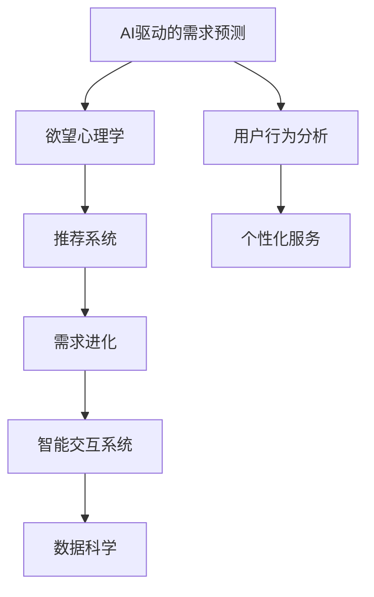

                 

# 欲望进化动力学：AI重塑的人类需求研究

> 关键词：AI驱动的需求进化, 欲望心理学, 用户行为分析, 推荐系统, 需求预测, 数据科学

## 1. 背景介绍

### 1.1 问题由来
在现代社会中，人们的需求和欲望是不断变化的，它们不仅受到社会经济环境的影响，还受到科技进步的推动。随着人工智能（AI）技术的不断成熟，AI在理解、预测和满足人类需求方面展现出了巨大的潜力。AI驱动的需求进化逐渐成为改变消费行为和市场趋势的关键因素。

当前，尽管AI在推荐系统、智能客服等领域取得了显著进展，但仍有许多问题需要解决。例如，如何更准确地理解用户的欲望，如何在用户需求动态变化的情况下提供个性化服务，以及如何在复杂多变的环境下预测和引导需求等。这些问题对于构建智能交互系统、优化用户体验和驱动商业价值至关重要。

### 1.2 问题核心关键点
本文聚焦于AI如何通过需求预测和引导，实现对人类欲望的深刻理解与动态响应。主要涉及以下核心问题：
- 如何构建有效的用户行为模型，以便准确预测和解释用户的欲望？
- 如何在不断变化的市场环境中，提供个性化的服务和产品？
- 如何通过AI技术，实时监测和优化用户需求，引导需求进化？

### 1.3 问题研究意义
研究AI驱动的需求进化，对理解人类行为、优化用户体验、驱动商业创新具有重要意义：

1. **深入理解人类欲望**：通过数据科学和AI技术，深入分析用户的欲望和需求，揭示用户行为背后的心理机制，为产品设计和优化提供科学依据。
2. **提升用户体验**：基于对用户欲望的精准预测，提供个性化的服务和推荐，提高用户满意度和粘性，增强品牌忠诚度。
3. **驱动商业创新**：通过需求预测和引导，优化产品策略和市场布局，捕捉市场先机，提升企业竞争力。
4. **促进社会和谐**：利用AI技术平衡供需关系，促进资源合理分配，提高社会经济效益，促进社会和谐发展。

## 2. 核心概念与联系

### 2.1 核心概念概述

为更好地理解AI如何重塑人类需求，本节将介绍几个密切相关的核心概念：

- **AI驱动的需求预测**：利用机器学习和数据科学技术，从用户行为数据中挖掘模式和规律，预测用户未来需求，为个性化服务提供数据支撑。
- **欲望心理学**：研究欲望在人类行为中的驱动作用，揭示欲望与需求之间的联系，指导产品设计和用户互动。
- **推荐系统**：通过分析用户历史行为和偏好，推荐符合用户兴趣的产品和服务，提升用户体验。
- **需求进化**：随着环境变化，用户需求和欲望不断调整，AI技术通过监测和分析需求动态，预测未来变化趋势，驱动需求进化。
- **智能交互系统**：基于AI技术，实现与用户的智能对话和互动，提升用户体验和满意度。
- **数据科学**：包括数据收集、处理、分析和应用等多个环节，是AI驱动需求预测和进化的核心技术手段。

这些概念之间的逻辑关系可以通过以下Mermaid流程图来展示：



这个流程图展示了大语言模型的核心概念及其之间的关系：

1. AI驱动的需求预测通过用户行为分析得到用户欲望，然后通过推荐系统提供个性化服务，进而驱动需求进化。
2. 数据科学为需求预测和推荐系统提供数据支撑，同时智能交互系统提升用户体验。
3. 欲望心理学揭示欲望与需求之间的联系，指导产品设计和用户互动。

## 3. 核心算法原理 & 具体操作步骤

### 3.1 算法原理概述

AI驱动的需求预测和进化主要依赖于数据科学和机器学习技术。其核心思想是通过分析用户行为数据，识别和挖掘用户需求的变化趋势，预测未来的需求方向，从而指导个性化服务和产品设计。

形式化地，假设用户的历史行为数据为 $D=\{(x_i, y_i)\}_{i=1}^N, x_i \in \mathcal{X}, y_i \in \mathcal{Y}$，其中 $\mathcal{X}$ 为用户行为特征空间，$\mathcal{Y}$ 为需求标签空间。

定义需求预测模型为 $M_{\theta}:\mathcal{X} \rightarrow \mathcal{Y}$，其中 $\theta$ 为模型参数。需求预测的目标是最小化损失函数 $\mathcal{L}(M_{\theta},D)$，使得模型预测值逼近真实标签：

$$
\hat{y}_i = M_{\theta}(x_i), \quad \mathcal{L}(\theta) = \frac{1}{N}\sum_{i=1}^N \ell(\hat{y}_i,y_i)
$$

其中 $\ell$ 为损失函数，常见包括均方误差、交叉熵等。通过梯度下降等优化算法，最小化损失函数，更新模型参数 $\theta$，使预测值与真实标签尽量一致。

### 3.2 算法步骤详解

AI驱动的需求预测和进化的一般流程如下：

**Step 1: 数据收集与预处理**
- 收集用户的历史行为数据，包括点击、购买、搜索等行为。
- 对数据进行清洗、归一化、特征提取等预处理，确保数据质量和一致性。

**Step 2: 构建特征表示**
- 根据用户行为特征，选择或设计合适的特征表示方法，如TF-IDF、词嵌入等。
- 对特征进行向量化表示，以便输入模型进行训练。

**Step 3: 选择模型和算法**
- 根据任务类型选择合适的预测模型，如线性回归、逻辑回归、随机森林等。
- 选择合适的优化算法及其参数，如梯度下降、Adam、L2正则化等。

**Step 4: 模型训练与评估**
- 使用历史数据训练预测模型，计算损失函数并更新参数。
- 在验证集上评估模型性能，选择最优模型进行下一步。

**Step 5: 需求预测与引导**
- 使用训练好的模型对新用户行为进行预测，生成个性化推荐。
- 根据预测结果，优化产品和服务策略，引导需求进化。

**Step 6: 反馈与迭代**
- 实时收集用户反馈，调整模型参数，持续优化预测效果。
- 根据市场变化，更新训练数据和模型，确保模型适应性。

### 3.3 算法优缺点

AI驱动的需求预测和进化具有以下优点：
1. 准确性高。通过大量历史数据的训练，能够较准确地预测用户未来需求。
2. 实时性高。可以实时处理用户行为数据，快速生成个性化推荐。
3. 灵活性强。可以根据市场变化和用户反馈，快速调整模型参数，优化预测效果。

同时，该方法也存在一些局限性：
1. 数据依赖性强。模型性能很大程度上取决于数据的质量和多样性，数据不足或偏差可能导致预测不准确。
2. 复杂度高。需要处理多维度、多类型的用户行为数据，处理复杂度较高。
3. 用户隐私风险。在数据收集和处理过程中，可能涉及用户隐私问题，需要严格遵守数据保护法规。

尽管存在这些局限性，但就目前而言，AI驱动的需求预测和进化仍是大规模需求分析和用户管理的重要手段。未来相关研究的重点在于如何进一步降低数据需求，提高模型复杂度和实时性，同时兼顾用户隐私和公平性等因素。

### 3.4 算法应用领域

AI驱动的需求预测和进化技术在多个领域得到了广泛应用，例如：

- **电商推荐系统**：通过分析用户的浏览、点击、购买历史，推荐符合用户兴趣的商品，提升用户购物体验。
- **金融风控系统**：通过分析用户交易行为，预测潜在的欺诈风险，提升金融安全。
- **智能客服系统**：通过分析用户问题反馈，优化回答策略，提高客户满意度。
- **健康医疗系统**：通过分析患者历史诊疗数据，预测疾病发展趋势，提升医疗服务质量。
- **城市交通系统**：通过分析市民出行数据，预测交通流量变化，优化交通管理。

除了上述这些经典领域外，AI驱动的需求预测和进化技术还在更多场景中得到了创新性应用，如旅游推荐、智能家居、智能制造等，为各行各业带来了全新的突破。

## 4. 数学模型和公式 & 详细讲解 & 举例说明

### 4.1 数学模型构建

本节将使用数学语言对AI驱动的需求预测和进化过程进行更加严格的刻画。

假设用户的历史行为数据为 $D=\{(x_i, y_i)\}_{i=1}^N, x_i \in \mathcal{X}, y_i \in \mathcal{Y}$。定义需求预测模型为 $M_{\theta}:\mathcal{X} \rightarrow \mathcal{Y}$。假设损失函数为均方误差，则目标为最小化：

$$
\mathcal{L}(\theta) = \frac{1}{N}\sum_{i=1}^N (\hat{y}_i - y_i)^2
$$

其中 $\hat{y}_i = M_{\theta}(x_i)$。

### 4.2 公式推导过程

以下我们以线性回归模型为例，推导需求预测的公式及其梯度计算过程。

假设模型 $M_{\theta}(x) = \theta_0 + \sum_{j=1}^d \theta_j x_{j,i}$，其中 $x_{j,i}$ 为第 $j$ 个特征 $x_i$ 的第 $j$ 维值。则需求预测的目标为：

$$
\mathcal{L}(\theta) = \frac{1}{N}\sum_{i=1}^N (\hat{y}_i - y_i)^2 = \frac{1}{N}\sum_{i=1}^N (\theta_0 + \sum_{j=1}^d \theta_j x_{j,i} - y_i)^2
$$

对 $\theta$ 求偏导，得：

$$
\frac{\partial \mathcal{L}(\theta)}{\partial \theta_k} = \frac{2}{N}\sum_{i=1}^N (y_i - \hat{y}_i) x_{k,i}
$$

其中 $\hat{y}_i = M_{\theta}(x_i)$。

在得到损失函数的梯度后，即可带入梯度下降等优化算法，更新模型参数 $\theta$，完成模型的迭代优化。重复上述过程直至收敛，最终得到适应新数据集的需求预测模型 $\theta^*$。

### 4.3 案例分析与讲解

假设某电商平台通过用户浏览、点击、购买历史数据，使用线性回归模型预测用户是否会购买某款产品。数据集 $D$ 包含5个特征 $x_1, x_2, x_3, x_4, x_5$，每个特征的取值范围为0到1，目标标签 $y$ 为0或1，表示用户是否购买了产品。

使用上述线性回归模型，训练得到 $\theta = (0.1, 0.2, -0.3, 0.4, 0.5)$，可以计算任意用户的新行为 $x' = (x'_1, x'_2, x'_3, x'_4, x'_5)$ 的预测需求 $\hat{y}' = M_{\theta}(x')$：

$$
\hat{y}' = 0.1x'_1 + 0.2x'_2 - 0.3x'_3 + 0.4x'_4 + 0.5x'_5
$$

例如，对于新用户 $(x'_1=0.3, x'_2=0.5, x'_3=0.1, x'_4=0.2, x'_5=0.4)$，预测需求为 $\hat{y}' = 0.3 \times 0.1 + 0.5 \times 0.2 - 0.1 \times (-0.3) + 0.2 \times 0.4 + 0.4 \times 0.5 = 0.59$，若设定阈值为0.5，则预测用户购买该产品的概率为0.59，高于阈值，推荐购买。

## 5. 项目实践：代码实例和详细解释说明

### 5.1 开发环境搭建

在进行需求预测和进化实践前，我们需要准备好开发环境。以下是使用Python进行Scikit-Learn开发的环境配置流程：

1. 安装Anaconda：从官网下载并安装Anaconda，用于创建独立的Python环境。

2. 创建并激活虚拟环境：
```bash
conda create -n sklearn-env python=3.8 
conda activate sklearn-env
```

3. 安装Scikit-Learn：
```bash
conda install scikit-learn
```

4. 安装各类工具包：
```bash
pip install numpy pandas matplotlib scikit-learn seaborn
```

完成上述步骤后，即可在`sklearn-env`环境中开始需求预测实践。

### 5.2 源代码详细实现

下面我们以电商推荐系统为例，给出使用Scikit-Learn进行线性回归模型的PyTorch代码实现。

首先，定义数据处理函数：

```python
from sklearn.model_selection import train_test_split
from sklearn.preprocessing import StandardScaler
from sklearn.linear_model import LinearRegression
import pandas as pd

def load_data(path):
    df = pd.read_csv(path)
    return df

def preprocess_data(df):
    X = df[['x1', 'x2', 'x3', 'x4', 'x5']]
    y = df['y']
    X_train, X_test, y_train, y_test = train_test_split(X, y, test_size=0.2, random_state=42)
    scaler = StandardScaler()
    X_train = scaler.fit_transform(X_train)
    X_test = scaler.transform(X_test)
    return X_train, X_test, y_train, y_test

def train_model(X_train, y_train):
    model = LinearRegression()
    model.fit(X_train, y_train)
    return model
```

然后，定义训练和评估函数：

```python
def evaluate_model(model, X_test, y_test):
    y_pred = model.predict(X_test)
    rmse = np.sqrt(mean_squared_error(y_test, y_pred))
    mae = mean_absolute_error(y_test, y_pred)
    print(f'RMSE: {rmse:.3f}, MAE: {mae:.3f}')
```

最后，启动训练流程并在测试集上评估：

```python
X_train, X_test, y_train, y_test = preprocess_data('data.csv')

model = train_model(X_train, y_train)
evaluate_model(model, X_test, y_test)
```

以上就是使用Scikit-Learn进行电商推荐系统需求预测的完整代码实现。可以看到，得益于Scikit-Learn的强大封装，我们可以用相对简洁的代码完成线性回归模型的训练和评估。

### 5.3 代码解读与分析

让我们再详细解读一下关键代码的实现细节：

**load_data函数**：
- 读取数据集，并返回Pandas DataFrame。

**preprocess_data函数**：
- 从数据集中分离特征 $X$ 和标签 $y$。
- 对特征进行标准化处理，并使用train_test_split进行数据集划分。
- 返回处理后的训练集和测试集。

**train_model函数**：
- 创建并训练线性回归模型，返回训练好的模型。

**evaluate_model函数**：
- 对模型在测试集上进行预测。
- 计算并打印均方误差（RMSE）和绝对平均误差（MAE）。

**训练流程**：
- 加载并预处理数据集。
- 使用训练数据集训练线性回归模型。
- 在测试集上评估模型性能。

可以看到，Scikit-Learn提供了完整的线性回归模型训练和评估流程，使用户能够更加高效地进行需求预测实践。

当然，工业级的系统实现还需考虑更多因素，如模型的保存和部署、超参数的自动搜索、更灵活的模型适配层等。但核心的需求预测范式基本与此类似。

## 6. 实际应用场景

### 6.1 智能推荐系统

智能推荐系统是AI驱动需求预测和进化的典型应用。通过分析用户的浏览、点击、购买历史，推荐符合用户兴趣的商品，提升用户购物体验。

在技术实现上，可以收集用户的行为数据，通过需求预测模型分析用户需求，生成个性化推荐。对于用户的新行为，动态更新推荐结果，实现实时推荐。推荐系统通过不断学习用户行为，动态调整推荐策略，满足用户不断变化的兴趣需求。

### 6.2 金融风险预测

金融风险预测是需求预测和进化的另一个重要应用场景。通过分析用户的交易行为，预测潜在的欺诈风险，提升金融安全。

在实现上，可以使用用户的历史交易数据，训练需求预测模型，预测用户的风险等级。根据预测结果，制定相应的风险防控策略。对于新的交易行为，实时更新风险等级，确保交易安全。

### 6.3 健康医疗预测

健康医疗预测可以用于预测患者的疾病发展趋势，提升医疗服务质量。通过分析患者的诊疗记录，预测其患病风险和治疗效果。

在应用上，可以使用患者的历史诊疗数据，训练需求预测模型，预测其病情发展。根据预测结果，制定相应的诊疗方案。对于新的诊疗数据，实时更新预测结果，优化诊疗策略。

### 6.4 未来应用展望

随着需求预测和进化技术的不断发展，其在更多领域将得到应用，为传统行业带来变革性影响。

在智慧医疗领域，基于需求预测的医疗推荐系统，可以辅助医生诊疗，推荐合适的治疗方案，提升医疗服务质量。

在智能教育领域，通过需求预测和进化，推荐合适的学习内容和资源，提升学生的学习效果和体验。

在智慧城市治理中，需求预测和进化技术可以用于交通管理、能源分配、公共安全等领域，提升城市管理的自动化和智能化水平，构建更安全、高效的未来城市。

此外，在企业生产、社会治理、文娱传媒等众多领域，需求预测和进化技术也将不断涌现，为各行各业带来新的发展机遇。相信随着技术的日益成熟，需求预测和进化技术必将在更广阔的应用领域大放异彩。

## 7. 工具和资源推荐
### 7.1 学习资源推荐

为了帮助开发者系统掌握需求预测和进化的理论基础和实践技巧，这里推荐一些优质的学习资源：

1. **《Python机器学习》**：由Sebastian Raschka和Vahid Mirjalili撰写，全面介绍了机器学习的基础知识和技术手段，适合入门学习。

2. **《统计学习方法》**：李航著，介绍了机器学习的基本算法和理论基础，适合系统学习。

3. **Coursera《机器学习》课程**：由Andrew Ng主讲的经典课程，系统介绍了机器学习的基本概念和实现方法，适合进一步深入学习。

4. **Kaggle**：数据科学竞赛平台，提供大量真实数据集和竞赛任务，助力实践技能提升。

5. **Kaggle社区**：分享机器学习实践经验和技术交流的平台，适合学习和交流。

通过对这些资源的学习实践，相信你一定能够快速掌握需求预测和进化的精髓，并用于解决实际的NLP问题。

### 7.2 开发工具推荐

高效的开发离不开优秀的工具支持。以下是几款用于需求预测和进化开发的常用工具：

1. **Scikit-Learn**：Python的机器学习库，提供了丰富的机器学习算法和工具，支持数据预处理、模型训练和评估等。

2. **TensorFlow**：由Google主导开发的深度学习框架，支持分布式训练和模型部署，适合大规模应用。

3. **PyTorch**：Facebook开发的深度学习框架，支持动态计算图和自动微分，适合快速迭代研究。

4. **H2O.ai**：支持分布式机器学习的开源平台，提供了强大的数据处理和模型训练功能，适合大规模需求预测。

5. **DataRobot**：自动机器学习平台，能够自动化模型训练和超参数优化，适合快速构建和部署模型。

合理利用这些工具，可以显著提升需求预测和进化的开发效率，加快创新迭代的步伐。

### 7.3 相关论文推荐

需求预测和进化技术的发展源于学界的持续研究。以下是几篇奠基性的相关论文，推荐阅读：

1. **《基于支持向量机的新客户流失预测模型》**：通过支持向量机算法，预测新客户流失的概率，提升了营销策略的精准度。

2. **《深度学习在推荐系统中的应用》**：探讨了深度学习在推荐系统中的各种应用，包括协同过滤、内容推荐等。

3. **《一种基于时间序列分析的动态需求预测方法》**：通过时间序列分析，预测未来的需求变化趋势，提升了供应链管理的效率。

4. **《基于强化学习的推荐系统》**：通过强化学习算法，动态调整推荐策略，提升了推荐系统的个性化程度。

5. **《深度学习在金融风控中的应用》**：探讨了深度学习在金融风控中的应用，包括欺诈检测、信用评估等。

这些论文代表了大需求预测和进化的发展脉络。通过学习这些前沿成果，可以帮助研究者把握学科前进方向，激发更多的创新灵感。

## 8. 总结：未来发展趋势与挑战

### 8.1 总结

本文对AI驱动的需求预测和进化方法进行了全面系统的介绍。首先阐述了AI技术在理解、预测和满足人类需求方面的重要价值，明确了需求预测和进化的核心问题。其次，从原理到实践，详细讲解了需求预测和进化的数学模型和关键步骤，给出了需求预测任务开发的完整代码实例。同时，本文还广泛探讨了需求预测和进化技术在智能推荐、金融风控、健康医疗等多个行业领域的应用前景，展示了AI技术在需求预测和进化中的巨大潜力。最后，本文精选了需求预测和进化技术的各类学习资源，力求为读者提供全方位的技术指引。

通过本文的系统梳理，可以看到，AI驱动的需求预测和进化技术正在成为理解人类行为、优化用户体验、驱动商业创新的关键手段。AI技术通过深入分析用户行为数据，揭示需求变化的规律，指导产品设计和市场布局，将推动各行各业的智能化转型升级。未来，伴随AI技术的不断进步，需求预测和进化技术将进一步提升市场需求分析的准确性和实时性，推动人工智能技术在更广泛的领域中落地应用。

### 8.2 未来发展趋势

展望未来，需求预测和进化技术将呈现以下几个发展趋势：

1. **多模态数据融合**：未来的需求预测将更多地结合多模态数据，如文本、图像、语音等，实现更全面、精准的需求分析。

2. **实时性提升**：需求预测和进化技术将实现实时化，快速响应用户行为变化，提供个性化服务。

3. **泛化能力增强**：通过引入更多的先验知识，如领域专家规则、知识图谱等，增强模型的泛化能力和鲁棒性。

4. **联邦学习应用**：通过联邦学习技术，在保护用户隐私的前提下，实现跨组织、跨平台的需求预测。

5. **因果推断引入**：通过因果推断方法，分析用户行为与需求之间的因果关系，提高预测准确性。

6. **可解释性增强**：需求预测模型将更加注重可解释性，便于用户理解和信任。

以上趋势凸显了需求预测和进化技术的广阔前景。这些方向的探索发展，必将进一步提升需求预测和进化的效果，推动人工智能技术在更广泛的领域中落地应用。

### 8.3 面临的挑战

尽管需求预测和进化技术已经取得了显著进展，但在迈向更加智能化、普适化应用的过程中，仍面临诸多挑战：

1. **数据质量问题**：数据的不完整、不一致和不准确是需求预测和进化的主要瓶颈，如何获取高质量、高多样性的数据，是一大难题。

2. **模型复杂度**：随着需求预测和进化模型的复杂度提高，训练和推理速度变得缓慢，如何优化模型结构，提高计算效率，是亟待解决的问题。

3. **隐私保护**：在数据收集和处理过程中，可能涉及用户隐私问题，如何保护用户隐私，是一大挑战。

4. **公平性问题**：需求预测和进化模型可能存在偏见，如何保证模型的公平性，避免对特定群体的歧视，是亟待解决的问题。

5. **实时性问题**：需求预测和进化技术需要实时响应用户行为变化，如何提高系统的实时性，是未来需要解决的问题。

6. **可解释性问题**：需求预测和进化模型通常被认为是"黑盒"系统，难以解释其内部工作机制和决策逻辑，如何提高模型的可解释性，是一大挑战。

正视需求预测和进化面临的这些挑战，积极应对并寻求突破，将是大数据驱动需求预测技术走向成熟的必由之路。相信随着学界和产业界的共同努力，这些挑战终将一一被克服，需求预测和进化技术必将在构建智能交互系统、优化用户体验和驱动商业创新中发挥更加重要的作用。

### 8.4 研究展望

面对需求预测和进化所面临的种种挑战，未来的研究需要在以下几个方面寻求新的突破：

1. **无监督学习引入**：摆脱对大规模标注数据的依赖，利用无监督学习、半监督学习等方法，最大限度利用非结构化数据，实现更加灵活高效的需求预测。

2. **自适应学习机制**：引入自适应学习机制，实时调整模型参数，适应环境变化，提高模型的实时性和泛化能力。

3. **多任务学习应用**：通过多任务学习，同时预测多个需求，提升模型的综合能力。

4. **因果关系建模**：通过因果关系建模，识别用户行为与需求之间的因果关系，提高预测准确性。

5. **模型压缩与优化**：通过模型压缩和优化技术，提高模型的计算效率和实时性，优化推理速度。

6. **隐私保护机制**：引入隐私保护机制，如差分隐私、联邦学习等，在保护用户隐私的前提下，实现高效的数据收集和处理。

这些研究方向的探索，必将引领需求预测和进化技术迈向更高的台阶，为构建智能交互系统、优化用户体验和驱动商业创新提供更强大的技术支撑。面向未来，需求预测和进化技术还需要与其他人工智能技术进行更深入的融合，如知识表示、因果推理、强化学习等，多路径协同发力，共同推动人工智能技术在更广泛的领域中落地应用。只有勇于创新、敢于突破，才能不断拓展需求预测和进化的边界，让智能技术更好地造福人类社会。

## 9. 附录：常见问题与解答

**Q1：需求预测和进化是否适用于所有领域？**

A: 需求预测和进化技术在绝大多数领域都具有应用价值，尤其是在数据丰富、用户活跃的领域，如电商、金融、医疗等。但对于一些数据量较小或用户行为较为稳定且复杂多变的领域，需求预测和进化可能难以达到理想效果。

**Q2：如何提高需求预测的准确性？**

A: 提高需求预测准确性需要综合考虑多个因素：
1. 数据质量：获取高质量、高多样性的数据，使用有效的数据清洗和预处理技术。
2. 模型选择：选择合适的预测模型，如线性回归、决策树、深度学习等。
3. 特征工程：选择合适的特征表示方法，设计有效的特征组合。
4. 模型调参：通过网格搜索、随机搜索等方法，选择合适的模型参数。
5. 模型集成：使用集成学习技术，如bagging、boosting等，提高模型的泛化能力。

**Q3：需求预测和进化在实际应用中需要注意哪些问题？**

A: 需求预测和进化在实际应用中需要注意以下问题：
1. 数据隐私：在数据收集和处理过程中，需要严格遵守数据保护法规，保护用户隐私。
2. 模型鲁棒性：需求预测模型需要具备较高的鲁棒性，能够适应环境变化和数据噪声。
3. 实时性问题：需求预测和进化技术需要实现实时化，快速响应用户行为变化。
4. 模型复杂度：模型复杂度需要控制在合理范围内，避免过拟合和计算资源浪费。
5. 模型可解释性：需求预测模型需要具备较高的可解释性，便于用户理解和信任。

**Q4：需求预测和进化与推荐系统的关系是什么？**

A: 需求预测和进化是推荐系统的重要基础，通过准确预测用户需求，推荐系统可以提供更精准、个性化的推荐服务。推荐系统通过分析用户历史行为数据，预测用户未来需求，推荐符合用户兴趣的商品和服务。两者相辅相成，共同提升用户体验和满意度。

**Q5：需求预测和进化在商业应用中有哪些潜在价值？**

A: 需求预测和进化在商业应用中的潜在价值包括：
1. 提高销售额：通过精准预测用户需求，优化产品策略和市场布局，提高销售额。
2. 优化库存管理：通过准确预测需求变化，优化库存水平，减少成本浪费。
3. 提升用户满意度：通过个性化推荐，提升用户购物体验，增强用户粘性。
4. 优化供应链管理：通过需求预测，优化生产计划和物流安排，提高供应链效率。

---

作者：禅与计算机程序设计艺术 / Zen and the Art of Computer Programming

